# Mandelbrot FPGA Accelerator Architecture

## 1. Overview

This project implements a UART-controlled Mandelbrot accelerator on FPGA. The host sends one binary command describing a complete image, and the FPGA streams back one 16-bit iteration count per pixel. The current stable configuration is FP64, four Mandelbrot workers, `FP_CE_DIV=1`, true 100 MHz operation per worker, and 576000 baud UART.

The design is intentionally streaming-oriented. It does not store a full frame on FPGA. Four workers compute interleaved rows, per-core FIFOs absorb local imbalance, a raster-order merger restores the original host-visible pixel order, and the transmit controller streams pixels to the host as soon as they are available.

Current validated capabilities:

| Item | Value |
|---|---:|
| System clock | 100 MHz |
| FP/core effective clock enable rate | 100 MHz (`FP_CE_DIV=1`) |
| Mandelbrot workers | 4 |
| UART baudrate | 576000 baud |
| Pixel format | `uint16`, little-endian iteration count |
| Maximum iteration count | 65535 |
| Width/height fields | 16-bit each |
| Pixel count path | 32-bit, validated above 65535 pixels |
| Largest validated image | 1920x1080 |
| Stable mode used in testing | FP64 |

## 2. Top-Level Architecture

Top-level integration is in `rtl/top.v`.

```text
Host PC
  |
  |  UART command: center, step, max_iter, rows, cols
  v
uart_rx
  |
  v
cmd_parser
  |
  |  compute_start, image parameters
  v
mandelbrot_multicore -- raster fifo_wr/fifo_data --> queue(1024 x 16-bit) --> tx_ctrl --> uart_tx
       |
       +-- work_dispatch_static_rows
       +-- 4 x mandelbrot_core_worker -- per-core FIFO --> raster_merge_static_rows
              |
              +-- fp_mul
              +-- fp_add
```

The main modules are:

| Module | File | Role |
|---|---|---|
| `top` | `rtl/top.v` | Instantiates clock-enable generator, UART, command parser, 4-core wrapper, output FIFO, and TX controller. |
| `uart_rx` | `rtl/uart_rx.v` | Receives 8N1 UART bytes at 576000 baud. |
| `uart_tx` | `rtl/uart_tx.v` | Sends 8N1 UART bytes at 576000 baud. |
| `cmd_parser` | `rtl/cmd_parser.v` | Parses command packet and validates XOR checksum. |
| `mandelbrot_multicore` | `rtl/mandelbrot_multicore.v` | 4-core wrapper with scheduler, per-core FIFOs, raster merger, and `tx_start` handling. |
| `work_dispatch_static_rows` | `rtl/work_dispatch_static_rows.v` | Default modular scheduler. Assigns static interleaved rows to workers. |
| `work_dispatch_dynamic_rows` | `rtl/work_dispatch_dynamic_rows.v` | Optional scheduler. Assigns one full row at a time to the first idle worker and records row ownership. |
| `mandelbrot_core_worker` | `rtl/mandelbrot_core_worker.v` | Row-start/stride worker version of the Mandelbrot iteration engine. |
| `raster_merge_static_rows` | `rtl/raster_merge_static_rows.v` | Restores per-worker row streams to strict row-major output order. |
| `raster_collect_dynamic_rows` | `rtl/raster_collect_dynamic_rows.v` | Optional dynamic result collector. Uses the row-owner table to drain dynamically assigned rows in raster order. |
| `mandelbrot_core` | `rtl/mandelbrot_core.v` | Legacy/single-core raster-order Mandelbrot engine used by regression simulation. |
| `fp_mul` | `rtl/fp_mul.v` | Parameterized FP multiplier. |
| `fp_add` | `rtl/fp_add.v` | Parameterized FP adder/subtractor. |
| `queue` | `rtl/queue.v` | Synchronous FIFO for per-core and output buffering. |
| `tx_ctrl` | `rtl/tx_ctrl.v` | Builds response header, drains FIFO, transmits pixels and checksum. |

## 3. Command And Response Protocol

The protocol is binary, little-endian, and frame-oriented. One command produces one full image response.

### 3.1 Host To FPGA Command

FP64 command length is 33 bytes. FP128 command length is 57 bytes.

| Offset | Size | Field |
|---:|---:|---|
| 0 | 1 | Magic byte `0x4D` |
| 1 | 1 | Precision flag, bit0 `0=FP64`, `1=FP128` |
| 2 | 2 | `rows`, uint16 LE |
| 4 | 2 | `cols`, uint16 LE |
| 6 | 2 | `max_iter`, uint16 LE |
| 8 | 8 or 16 | `center_re`, FP64 or FP128 LE |
| 16 or 24 | 8 or 16 | `center_im`, FP64 or FP128 LE |
| 24 or 40 | 8 or 16 | `step`, FP64 or FP128 LE |
| Last | 1 | XOR checksum over all previous bytes |

`cmd_parser` assembles these fields with byte-wise shift registers and only starts computation if the XOR including the received checksum is zero.

### 3.2 FPGA To Host Response

Response length is `6 + 2 * rows * cols + 1` bytes.

| Offset | Size | Field |
|---:|---:|---|
| 0 | 1 | `0x52`, ASCII `R` |
| 1 | 1 | `0x4B`, ASCII `K` |
| 2 | 2 | `rows`, uint16 LE |
| 4 | 2 | `cols`, uint16 LE |
| 6 | `2*N` | Pixel data, uint16 LE per pixel |
| Last | 1 | XOR checksum over pixel bytes only |

The host currently computes the response checksum over pixel data only, matching `tx_ctrl`.

## 4. Clocking And Clock-Enable Design

The board provides a 100 MHz `sys_clk`. The design uses one actual clock domain for all logic. UART, parser, FIFO, TX controller, floating-point datapath, and Mandelbrot core all run in that clock domain. The `fp_ce` signal is retained as a compile-time throttle, but the current FP64 configuration sets `FP_CE_DIV=1`, so it is asserted every clock.

`fp_ce` is generated in `top.v`:

```verilog
reg [`FP_CE_DIV-1:0] ce_counter;
wire fp_ce;
assign fp_ce = (`FP_CE_DIV == 1) ? 1'b1 : (ce_counter == `FP_CE_DIV - 1);
```

Current `rtl/fp_defines.vh` sets:

```verilog
`define FP_CE_DIV 1
```

Therefore the core and FP units advance every system cycle, giving true 100 MHz datapath operation while preserving one physical clock domain.

### 4.1 Why Clock Enable Instead Of A Derived Clock

The design previously used derived/pseudo clocks in the UART area and later moved to a single-clock style. The current single-clock + enable approach avoids clock-domain crossing issues and simplifies timing closure.

Benefits:

| Benefit | Explanation |
|---|---|
| No generated clock tree | All registers are clocked by `sys_clk`. |
| No CDC between core and UART | FIFO and handshake signals stay in one clock domain. |
| Easier reset and debug | One synchronous timing model. |
| STA remains direct | Current FP64 timing uses normal single-cycle 100 MHz constraints. |

### 4.2 Timing Constraints

Current FP64 builds use normal single-cycle timing at 100 MHz. No `u_core` multicycle exceptions are required. Older effective-50 MHz experiments used `FP_CE_DIV=2` plus setup/hold multicycle constraints, but the current pipelined FP datapath closes timing at `FP_CE_DIV=1`.

Current routed timing after 4-core integration and FP adder output-side pipeline cut:

| Metric | Value |
|---|---:|
| WNS | 0.224 ns |
| TNS | 0.000 ns |
| WHS | 0.005 ns |
| THS | 0.000 ns |

## 5. Floating-Point Format

The project uses parameterized binary floating-point formats selected at compile time with `fp_defines.vh`.

| Parameter | FP64 | FP128 |
|---|---:|---:|
| Total width | 64 | 128 |
| Sign bits | 1 | 1 |
| Exponent bits | 11 | 15 |
| Mantissa bits | 52 | 112 |
| Bias | 1023 | 16383 |
| Max normal exponent macro | 2046 | 32766 |

The implementation is IEEE-like but not a full IEEE-754 implementation. It is sufficient for the project workload, but it does not implement all special cases.

Important simplifications:

| Feature | Current behavior |
|---|---|
| Denormals | Not fully supported; zero-like behavior is used. |
| NaN/Inf | Not intended as input or output. |
| Rounding | Truncation/limited normalization behavior, not full IEEE rounding. |
| Exceptions | No exception flags. |

The FPGA and software reference are compared against the implemented RTL behavior, not a full IEEE-754 formal model. A detailed analysis of boundary pixel differences (truncation vs IEEE round-to-nearest-even) is available in [FP64_BOUNDARY_DIFFERENCE_ANALYSIS.md](FP64_BOUNDARY_DIFFERENCE_ANALYSIS.md).

## 6. Floating-Point Multiplier Pipeline

`fp_mul.v` implements multiplication for FP64/FP128 using parameterized exponent and mantissa widths.

Algorithm summary:

1. Register inputs when `ce` is asserted.
2. Detect zero operands.
3. Compute result sign as `a.sign ^ b.sign`.
4. Add exponents and subtract bias.
5. Multiply hidden-bit mantissas: `{1'b1, a.man} * {1'b1, b.man}`.
6. Register DSP product and metadata.
7. Normalize based on the product MSB.
8. Register final output.

Detailed multiplier pipeline:

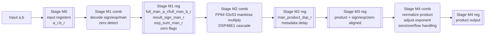

Shape convention: rounded boxes are combinational logic; double-sided boxes are register stages.

Pipeline intent:

| Stage | Main registers | Purpose |
|---|---|---|
| M0 | `a_r`, `b_r` | Isolate caller routing from FP decode. |
| M1 | decoded mantissas and metadata | Remove zero mux and sign/exponent decode from DSP input path. |
| M2 | `man_product_dsp_r` | Register DSP cascade output. |
| M3 | product/metadata alignment registers | Align delayed sign/exponent/zero flags with product. |
| M4 | `product` | Normalize and publish final FP value. |

The multiplier includes input, decoded-mantissa, DSP-product, and metadata registers to improve timing. The decoded-mantissa stage removes zero mux and exponent/sign decode logic from the DSP input path. The multiplication is annotated with:

```verilog
(* mult_style = "pipe_block" *)
```

This encourages DSP-based implementation. The Zynq-7010 implementation uses multiple DSP48E1s for FP64 mantissa multiplication.

### 6.1 Multiplier Pipeline Behavior

The core does not assume a single-cycle FP unit. Instead, it issues an operation and waits `PIPE_WAIT` CE cycles before capturing the result. Current worker and legacy single-core RTL use:

```verilog
localparam PIPE_WAIT = 10;
```

This wait value is conservative relative to the internal FP pipeline and has been validated in simulation and hardware at true 100 MHz. It increased from 9 to 10 when the 4-core build added one more adder output-side pipeline stage to close timing.

## 7. Floating-Point Adder Pipeline

`fp_add.v` implements both addition and subtraction. Subtraction is performed by flipping the sign of operand B before entering the adder:

```verilog
wire [`FP_WIDTH-1:0] add_b_eff = add_neg ? {~add_b[`FP_SIGN_IDX], add_b[`FP_EXP_HI:0]} : add_b;
```

Algorithm summary:

1. Register inputs on `ce`.
2. Decode signs, exponents, and mantissas.
3. Compare magnitudes and register the selected large/small operands.
4. Align the smaller mantissa by exponent difference.
5. Add or subtract aligned mantissas depending on signs.
6. Register intermediate mantissa/sign/exponent information.
7. Normalize the mantissa.
8. Adjust exponent.
9. Register output.

Detailed adder/subtractor pipeline:

```mermaid
flowchart LR
    IN["Input a,b"] --> R0[["Stage A0<br/>input registers<br/>a_r,b_r"]]
    R0 --> D0("Stage A1 comb<br/>decode sign/exp/man<br/>zero detect<br/>compare magnitude")
    D0 --> R1[["Stage A1 reg<br/>large/small mantissas<br/>exp_large,diff<br/>signs,zero flags"]]
    R1 --> ALIGN("Stage A2 comb<br/>right shift small mantissa<br/>add/sub aligned mantissas")
    ALIGN --> R2[["Stage A2 reg<br/>man_result_r<br/>exp/sign/zero/input bypass"]]
    R2 --> LZ("Stage A3 comb<br/>leading-zero scan<br/>normalize mantissa<br/>adjust exponent")
    LZ --> R3[["Stage A3 reg<br/>man_final_r<br/>exp_final_r<br/>sign_final_r<br/>zero/bypass flags"]]
    R3 --> OF("Stage A4 comb<br/>overflow test<br/>final mux")
    OF --> OUT[["Stage A4 reg<br/>sum output"]]
```

Shape convention: rounded boxes are combinational logic; double-sided boxes are register stages.

Pipeline intent:

| Stage | Main registers | Purpose |
|---|---|---|
| A0 | `a_r`, `b_r` | Isolate caller routing and provide stable decode inputs. |
| A1 | `man_large_s1`, `man_small_s1`, `exp_large_s1`, `diff_s1` | Cut decode/compare/select away from alignment and add/sub. |
| A2 | `man_result_r`, `exp_large_r`, `sign_large_r` | Register add/sub result before normalization. |
| A3 | `man_final_r`, `exp_final_r`, `sign_final_r` | Register normalized result before overflow/final mux. |
| A4 | `sum` | Publish zero bypass, overflow-zero, or normal FP result. |

Important fixes already made in this design:

| Issue | Fix |
|---|---|
| Wrong same-sign normalization slice | Corrected carry/no-carry mantissa extraction. |
| Negative add/sub mismatch | Added tests and fixed sign/magnitude handling. |
| Input timing pressure | Added input registers. |
| 100 MHz adder critical path | Split decode/compare/select from align/add-sub. |
| Output normalization timing | Added output-side normalization/output registers. |

## 8. Mandelbrot Core Architecture

`mandelbrot_core_worker.v` computes one interleaved subset of rows. The legacy `mandelbrot_core.v` computes pixels in raster order and remains useful for focused single-core regression. For each pixel, both engines iterate:

```text
z_{n+1} = z_n^2 + c

z_re_next = z_re^2 - z_im^2 + c_re
z_im_next = 2 * z_re * z_im + c_im
escape if z_re^2 + z_im^2 > 4
```

Each worker uses one FP multiplier and one FP adder. It time-multiplexes those units across each iteration through a finite-state machine. The 4-core wrapper instantiates four independent workers.

### 8.1 Coordinate Generation

The host provides image center and pixel step. The RTL uses integer-truncated half dimensions:

```text
half_w = (cols - 1) >> 1
half_h = (rows - 1) >> 1

c_re_start = center_re - half_w * step
c_im_start = center_im + half_h * step
```

For each row in the single-core engine:

```text
c_re = c_re_start
for each column: c_re += step
after row: c_im -= step
```

The software reference intentionally mirrors this integer-center behavior. This avoids false mismatches versus a conventional floating-centered renderer.

Worker coordinate initialization pipeline:

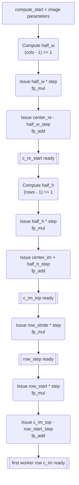

Shape convention: rounded boxes are issued combinational computations or FP operations; double-sided boxes are registered ready values captured after `PIPE_WAIT`.

For the current 4-core static scheduler, `row_stride=4` for every worker and `row_start` is the worker ID. This lets each worker advance from row `y` to row `y+4` with one precomputed FP decrement.

### 8.2 4-Core Row Scheduling

`mandelbrot_multicore` supports a compile-time scheduling parameter:

| Parameter | Value | Meaning |
|---|---:|---|
| `SCHED_MODE` | `0` | Static interleaved rows, default board mode. |
| `SCHED_MODE` | `1` | Dynamic idle-core row scheduling. |
| `DYNAMIC_OWNER_DEPTH` | `4096` default | Owner-table rows available in dynamic mode. |

The default multi-core scheduler uses static interleaved rows:

| Core | First row | Stride | Rows |
|---:|---:|---:|---|
| 0 | 0 | 4 | `0, 4, 8, ...` |
| 1 | 1 | 4 | `1, 5, 9, ...` |
| 2 | 2 | 4 | `2, 6, 10, ...` |
| 3 | 3 | 4 | `3, 7, 11, ...` |

This is implemented by `work_dispatch_static_rows.v`. The worker receives `row_start_in` and `row_stride_in`, computes `row_stride * step` once during initialization, and then jumps directly from one assigned row to the next.

The scheduler is intentionally modular. Dynamic row scheduling now exists as an optional build mode, and future dynamic tile scheduling or out-of-order row dispatch can still replace the scheduler/collector pair without changing the UART command parser or the worker arithmetic datapath.

Static dispatch structure:

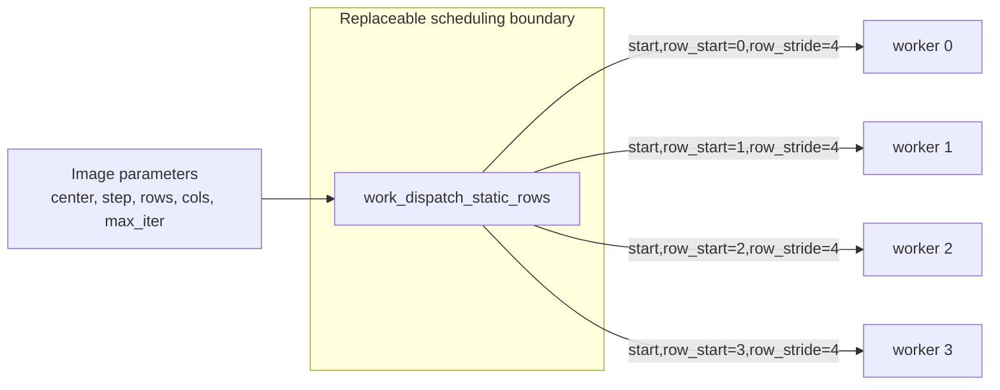

Dispatch is combinational for the current policy: every worker receives the same render parameters and a different row-start value. This keeps scheduler timing shallow and makes the future replacement point explicit.

Dynamic idle-core scheduling uses `work_dispatch_dynamic_rows.v`. It reuses the existing row-start/stride worker interface by making each job one full row:

```text
row_start = assigned row
row_stride = rows
```

Because `row + row_stride >= rows` after one row, the existing worker finishes after that row and returns `done`. The dynamic dispatcher tracks which cores are active, waits for `done` to return low before reusing a core, and assigns the next unissued row to the first available core. It also emits `owner_row` and `owner_core` so the collector can later restore raster order.

Dynamic dispatch structure:

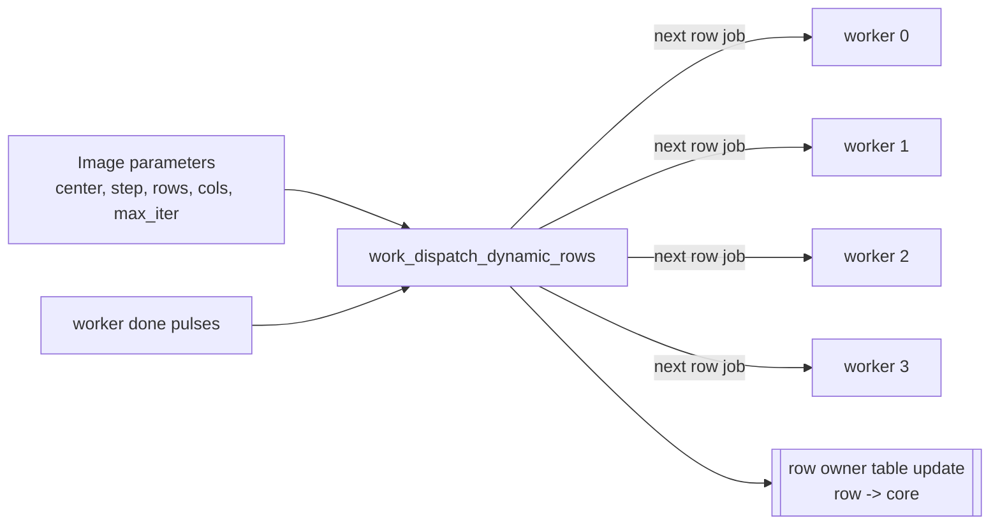

Dynamic mode preserves the existing host-visible raster stream. It is useful for row-level load-balance experiments, but it does not remove worker-internal FP pipeline bubbles and cannot improve scenes already capped by UART bandwidth.

### 8.3 Raster Merge

The unchanged host protocol expects pixels in row-major order with no row or tile IDs. Static mode uses `raster_merge_static_rows.v`; dynamic mode uses `raster_collect_dynamic_rows.v`. Both preserve that contract in hardware.

For output row `y`:

```text
source_core = y % 4
```

The merger waits until the selected core FIFO has data, reads one pixel, waits one synchronous FIFO read cycle, and writes the pixel into the shared output FIFO. This keeps the host protocol unchanged while allowing workers to run independently behind per-core FIFOs.

In dynamic mode, `raster_collect_dynamic_rows.v` first waits until the owner table has an entry for the current raster row. The source core is then `owner_mem[row]`, not `row % CORE_COUNT`. After source selection, FIFO read/write sequencing is the same as the static merger. `DYNAMIC_OWNER_DEPTH` bounds the owner table; the default `4096` rows covers the validated 1080p use case.

Raster merge pipeline:

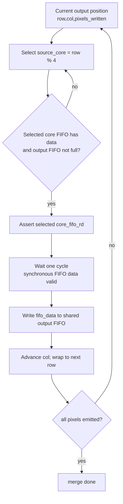

Merger state machine:

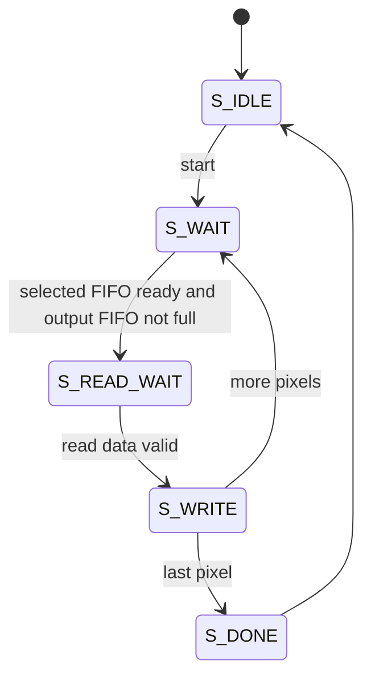

Dynamic collector behavior:

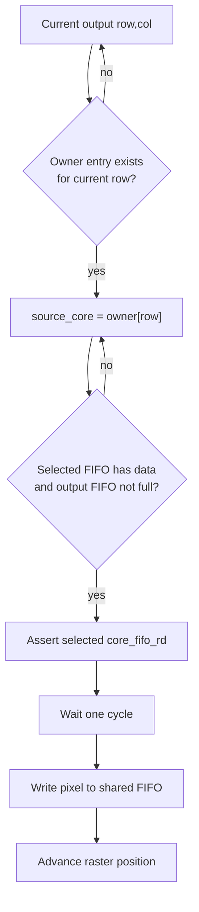

### 8.4 Per-Pixel FSM Pipeline

The core advances one FSM state per asserted `ce`, except when `pipe_wait` is nonzero. Each FP operation is issued, then the FSM waits `PIPE_WAIT` CE pulses before consuming the registered result.

Per-iteration sequence:

```text
S_ITER_START
  z_re = 0, z_im = 0, iter = 0
  issue z_re * z_re

S_MUL_ZRSQ_CAPT
  capture z_re_sq
  issue z_im * z_im

S_MUL_ZISQ_CAPT
  capture z_im_sq
  issue z_re * z_im
  issue z_re_sq + z_im_sq for escape check

S_MUL_ZRZI_CAPT
  capture z_re_z_im
  check quick escape against z_re_sq, z_im_sq, and add_result
  if escaped: output current iter
  else issue z_re_sq - z_im_sq

S_SUB_RE_CAPT
  capture difference
  issue difference + c_re

S_ADD_NEXTRE_CAPT
  capture z_re_next
  issue z_re_z_im + z_re_z_im

S_ADD_2X_CAPT
  capture 2*z_re*z_im
  issue 2*z_re*z_im + c_im

S_ADD_NEXTIM_CAPT
  capture z_im_next
  iter++

S_ITER_INC
  if iter >= max_iter: output
  else issue next z_re * z_re
```

Per-iteration issue/capture pipeline view:

```mermaid
flowchart LR
    I0["S_ITER_START<br/>issue z_re*z_re"] --> W0["wait PIPE_WAIT"]
    W0 --> I1["S_MUL_ZRSQ_CAPT<br/>capture z_re_sq<br/>issue z_im*z_im"]
    I1 --> W1["wait PIPE_WAIT"]
    W1 --> I2["S_MUL_ZISQ_CAPT<br/>capture z_im_sq<br/>issue z_re*z_im<br/>issue z_re_sq+z_im_sq"]
    I2 --> W2["wait PIPE_WAIT"]
    W2 --> I3["S_MUL_ZRZI_CAPT<br/>capture z_re_z_im<br/>check escape"]
    I3 -->|escaped| OUT[output iter]
    I3 -->|not escaped| I4["issue z_re_sq-z_im_sq"]
    I4 --> W3["wait PIPE_WAIT"]
    W3 --> I5["S_SUB_RE_CAPT<br/>issue diff+c_re"]
    I5 --> W4["wait PIPE_WAIT"]
    W4 --> I6["S_ADD_NEXTRE_CAPT<br/>capture z_re_next<br/>issue z_re_z_im+z_re_z_im"]
    I6 --> W5["wait PIPE_WAIT"]
    W5 --> I7["S_ADD_2X_CAPT<br/>issue 2*z_re*z_im+c_im"]
    I7 --> W6["wait PIPE_WAIT"]
    W6 --> I8["S_ADD_NEXTIM_CAPT<br/>capture z_im_next<br/>iter++"]
    I8 --> I9["S_ITER_INC"]
    I9 -->|iter < max_iter| I0
    I9 -->|iter >= max_iter| OUT
```

Operation schedule per non-escaping iteration:

| FSM point | Multiplier action | Adder action | Captured value |
|---|---|---|---|
| `S_ITER_START` | `z_re * z_re` | none | none |
| `S_MUL_ZRSQ_CAPT` | `z_im * z_im` | none | `z_re_sq` |
| `S_MUL_ZISQ_CAPT` | `z_re * z_im` | `z_re_sq + z_im_sq` | `z_im_sq` |
| `S_MUL_ZRZI_CAPT` | none | conditional escape decision | `z_re_z_im` |
| `S_SUB_RE_CAPT` | none | `(z_re_sq - z_im_sq) + c_re` is prepared over two add waits | difference path |
| `S_ADD_NEXTRE_CAPT` | none | `z_re_z_im + z_re_z_im` | `z_re_next` |
| `S_ADD_2X_CAPT` | none | `2*z_re*z_im + c_im` | doubled product path |
| `S_ADD_NEXTIM_CAPT` | none | none | `z_im_next` |

The FSM is latency-tolerant rather than throughput-pipelined across pixels: a worker completes one pixel iteration sequence before advancing that worker's pixel. Parallelism comes from four independent workers, not from overlapping multiple pixels inside one worker.

### 8.5 Escape Check

Escape is detected with:

```text
z_re^2 + z_im^2 > 4.0
```

The implementation includes quick checks on each squared term and on their sum:

```verilog
quick_esc(z_re_sq) || quick_esc(z_im_sq) || quick_esc(add_result)
```

`quick_esc` compares the floating-point exponent against `bias + 2` and handles the exact `4.0` boundary by checking mantissa bits. Values greater than 4.0 escape. Exact 4.0 does not escape.

### 8.6 Output And Backpressure

When a pixel is complete, a worker waits until its per-core FIFO is not full, writes the 16-bit iteration count, and then advances to the next pixel. The raster merger drains per-core FIFOs into the shared output FIFO. `tx_ctrl` then drains the shared output FIFO to UART.

The top-level output FIFO has 1024 entries of 16-bit data. Each worker also has a per-core FIFO. The system is still fundamentally streaming and will backpressure workers when UART is the bottleneck or when strict raster ordering waits for an earlier row.

Output buffering and backpressure path:

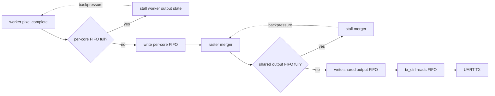

Because `queue.v` has synchronous read data, both the raster merger and `tx_ctrl` use a read-wait style: assert read enable, wait one clock for `data_out` to become valid, then consume the value.

## 9. UART Design

UART is 8N1, no parity, no flow control.

Current baudrate is 576000. With a 100 MHz clock:

```text
CLOCKS_PER_BIT = 174
actual baud = 100e6 / 174 = 574712.64 baud
error = -0.2235% (vs host requested 576000)
```

`uart_rx.v` synchronizes the asynchronous RX input with two flip-flops, detects the falling start edge, waits half a bit, then samples each data bit every `CLOCKS_PER_BIT` clocks. The current implementation uses `CLOCKS_PER_BIT - 1` comparisons to avoid off-by-one bit timing drift.

`uart_tx.v` serializes one start bit, eight data bits, and one stop bit. `transmit_avail` acts as a ready signal for `tx_ctrl`.

UART receive pipeline:

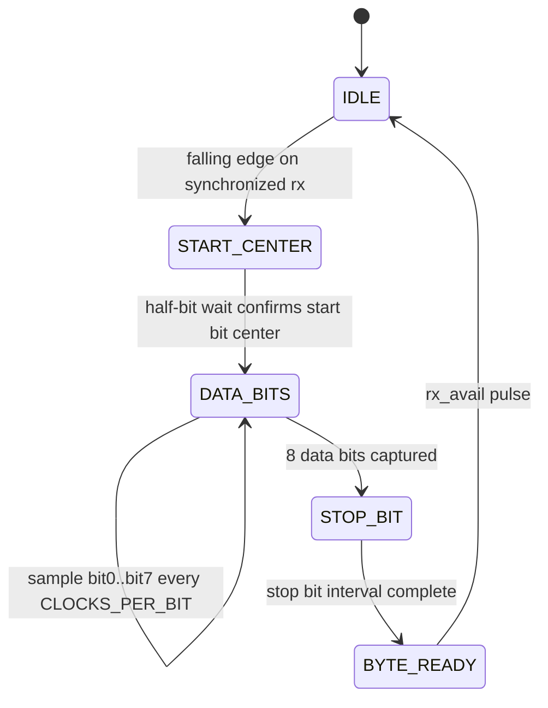

UART transmit pipeline:

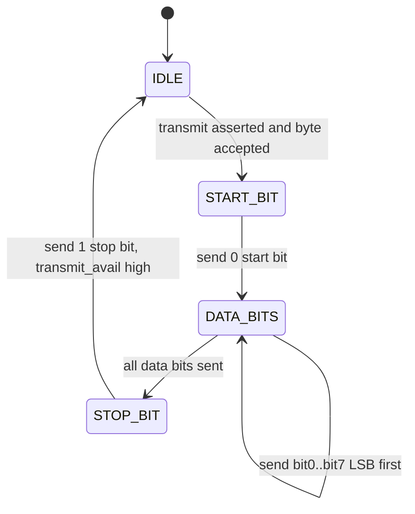

### 9.1 Baudrate Experiment Summary

The UART baudrate was systematically investigated above 500000 baud. Key findings:

| Baudrate | CPB | FPGA actual | Result | Root cause |
|---:|---:|---:|---:|---|
| 500000 | 200 | 500000.00 | Pass (was default) | Exact divider, clean CP2102 |
| 520833 | 192 | 520833.33 | Pass | Exact divider |
| 523560 | 191 | 523560.21 | Marginal (1/8 corrupt) | CP2102 baud quantisation mismatch |
| 526316 | 190 | 526315.79 | Fail (byte corruption) | CP2102 baud quantisation mismatch |
| 530000 | 189 | 529100.53 | Fail (silent) | RX timing margin collapse |
| 540000 | 185 | 540540.54 | Fail (silent) | RX timing margin collapse |
| **576000** | **174** | **574712.64** | **Pass (current)** | **Standard PC baud, clean CP2102 support** |
| 625000 | 160 | 625000.00 | Fail (silent) | FPGA RX uplink failure |
| 800000 | 125 | 800000.00 | Fail (silent) | FPGA RX uplink failure |
| 1000000 | 100 | 1000000.00 | Fail (silent) | FPGA RX uplink failure |

A TX-only isolation experiment using `uart_tx_pattern_top.v` proved that the FPGA TX downlink functions correctly at 625000, 800000, and 1000000 baud. The failure at those rates is in the FPGA RX uplink path, caused by the single-sample architecture lacking oversampling and start/stop-bit verification.

Detailed reports: [UART_BAUDRATE_INVESTIGATION.md](UART_BAUDRATE_INVESTIGATION.md), [UART_TIMING_ANALYSIS.md](UART_TIMING_ANALYSIS.md).

## 10. TX Controller And Large-Frame Support

`tx_ctrl.v` sends response header, drains pixels from the FIFO, sends each pixel little-endian, computes checksum, and sends one checksum byte.

The response size is based on:

```verilog
wire [31:0] total_pixels = {16'd0, rows} * {16'd0, cols};
wire [31:0] total_bytes  = total_pixels * 2;
```

The explicit 32-bit cast is important. Without it, Verilog computes `rows * cols` using the operand widths, producing a 16-bit product before extension. That caused images larger than 65535 pixels to fail. The fix was validated with `320x240` and `1920x1080` frames.

`queue.v` has synchronous read behavior. `tx_ctrl` therefore includes `S_READ_WAIT` between asserting `fifo_rd` and using `fifo_data`. This prevents pixel misalignment.

TX controller response pipeline:

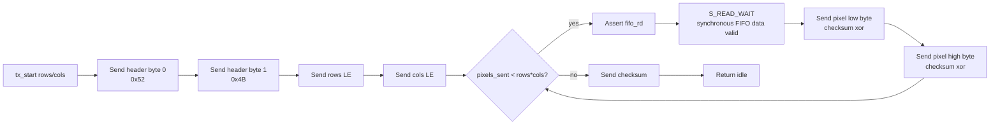

## 11. Host Software Architecture

Host code is in `python/mandelbrot_host.py`.

Responsibilities:

| Component | Responsibility |
|---|---|
| CLI parser | Accept center, step, max iteration, dimensions, output, mode, port, timeout, verify flag. |
| FP encoding | Pack FP64 with Python `struct.pack('<d')`; pack FP128 manually for experimental mode. |
| Command builder | Build little-endian command packet and XOR checksum. |
| Serial transport | Open `COM4` by default at 576000 baud. |
| Response receiver | Read header, expected pixel bytes, checksum, and convert to uint16 pixels. |
| Renderer | Convert iteration counts to PNG or text output. |
| Software reference | Optional `--verify` computes a Python Mandelbrot image matching RTL coordinate rules. |
| Timing | Print FPGA elapsed, pixels/s, render elapsed, software elapsed, and total elapsed. |

Typical command:

```bash
python python\mandelbrot_host.py --width 1920 --height 1080 --max-iter 512 --center -0.743643887037151 0.13182590420533 --step 0.000005 --timeout 1800 --output python\hw_1080p_zoom.png
```

### 11.1 Software Reference Matching RTL

The reference model uses the same coordinate convention as the RTL:

```python
half_w = (width - 1) >> 1
half_h = (height - 1) >> 1
re_start = center_re - half_w * step
im_start = center_im + half_h * step
```

This is different from a renderer that centers exactly at `width / 2.0` and `height / 2.0`. The integer-center convention is required for bit-for-bit comparison with the RTL pixel grid.

## 12. Verification Strategy

Verification uses several layers.

### 12.1 Unit Simulation

`sim/tb_fp.v` tests FP add/multiply cases. Coverage includes:

| Category | Examples |
|---|---|
| Zero handling | `0 + x`, `0 * x` |
| Positive multiplication | `2 * 3`, `2.5 * 2.5`, coordinate offset cases |
| Same-sign addition | `1.5 + 3.5` |
| Opposite-sign addition | `-0.75 + 0.1`, `0.5625 + -0.01` |
| Negative same-sign addition | `-0.075 + -0.075` |

Run:

```bash
vivado -mode batch -source sim_fp.tcl
```

### 12.2 Core Simulation

`sim/tb_core.v` runs the Mandelbrot core against a software reference embedded in the testbench. It covers individual points, a small grid, and a full-size first-pixel regression.

Run:

```bash
vivado -mode batch -source sim_core.tcl
```

Expected pass marker:

```text
=== CORE TEST PASS ===
```

### 12.3 Multicore Simulation

`sim/tb_multicore.v` instantiates `mandelbrot_multicore` with four workers and checks that the default static merged output stream matches row-major software reference order. `sim/tb_multicore_dynamic.v` runs the same raster-order check with `SCHED_MODE=1` dynamic idle-core row scheduling.

Run:

```bash
vivado -mode batch -source sim_multicore.tcl
vivado -mode batch -source sim_multicore_dynamic.tcl
```

Expected pass marker:

```text
=== MULTICORE TEST PASS: 192 pixels ===
=== DYNAMIC MULTICORE TEST PASS: 192 pixels ===
```

### 12.4 Host-Side Random Reference Testing

`python/test_random_compare.py` compares host/software reference conventions across randomized cases. This catches coordinate convention errors, checksum assumptions, and corner cases in command construction.

Example validated command:

```bash
python python/test_random_compare.py --cases 300 --seed 20260608
```

### 12.5 Hardware Smoke Tests

`python/test_esc.py` sends 1x1-like commands for obvious escape points. It verifies UART RX, command parsing, core start, escape logic, FIFO/TX, and host parsing.

Validated points include:

```text
c=(2.5,0) -> iter=1
c=(2.6,0) -> iter=1
c=(3.0,0) -> iter=1
c=(4.1,0) -> iter=1
```

### 12.6 Hardware Image Verification

For moderate images, the host can run software verification:

```bash
python python\mandelbrot_host.py --verify --width 160 --height 120 --max-iter 256 --output python\verify.png
```

Many tested cases reached `100.00%` match.

For large 1080p or very high iteration tests, `--verify` is normally skipped because Python software rendering becomes slow.

### 12.7 Large-Frame Verification

The 32-bit pixel-count fix was validated with:

```text
320x240 @ 128, center=(1.0,1.0): 76800/76800 match, 22873.22 pixels/s
1920x1080 frames: successful transfer and rendering
```

## 13. Performance Characteristics

The system has two main bottlenecks:

1. UART bandwidth for fast-escaping or low-iteration scenes.
2. FP/core compute for high-iteration zooms.

At 576000 baud, the practical upper bound is roughly:

```text
576000 bits/s / 10 UART bits/byte / 2 bytes/pixel ~= 28800 pixels/s
```

Measured current fast throughput is close to this limit:

```text
1080p standard @64: 28508.82 pixels/s
1080p Seahorse zoom @512: 27921.47 pixels/s
```

Current 4-core high-iteration examples:

| Case | FPGA Time | Throughput | Single-Core 500k Baseline | Speedup |
|---|---:|---:|---:|---:|
| `160x120 @256`, standard view | `0.902s` | `21292.23 pps` | `3.193s` | `3.54x` |
| `1080p deep tendrils @8192` | `93.960s` | `22068.99 pps` | `340.029s` | `3.62x` |
| `1080p deep minibrot @8192` | `234.261s` | `8851.67 pps` | `850.720s` | `3.63x` |
| `1080p deep seahorse @1024` | `103.032s` | `20125.73 pps` | `363.253s` | `3.53x` |

Validated 1080p examples (576000 baud):

| Case | FPGA Time | Throughput |
|---|---:|---:|
| 1080p fast escape @128 | 72.736 s | 28508.56 pixels/s |
| 1080p standard @64 | 72.735 s | 28508.82 pixels/s |
| 1080p Seahorse @512, step `5e-6` | 74.265 s | 27921.47 pixels/s |
| 1080p deep tendrils @8192, step `1e-9` | 93.916 s | 22079.29 pixels/s |
| 1080p Mini-brot @8192, step `1e-9` | 234.231 s | 8852.78 pixels/s |
| 1080p deep Seahorse @1024, step `1e-8` | 100.658 s | 20600.46 pixels/s |

Dynamic scheduler 1080p board benchmarks, using `SCHED_MODE=1`:

| Case | Static 4-core | Dynamic 4-core | Dynamic throughput | Dynamic vs static |
|---|---:|---:|---:|---:|
| 1080p fast escape @128 | 72.736 s | 72.721 s | 28514.47 pixels/s | 1.000x |
| 1080p standard @64 | 72.735 s | 72.719 s | 28515.41 pixels/s | 1.000x |
| 1080p Seahorse @512, step `5e-6` | 74.265 s | 74.253 s | 27926.03 pixels/s | 1.000x |
| 1080p deep tendrils @8192, step `1e-9` | 93.916 s | 93.907 s | 22081.36 pixels/s | 1.000x |
| 1080p Mini-brot @8192, step `1e-9` | 234.231 s | 234.137 s | 8856.36 pixels/s | 1.000x |
| 1080p deep Seahorse @1024, step `1e-8` | 100.658 s | 100.691 s | 20593.74 pixels/s | 1.000x |

The dynamic scheduler preserves full-frame correctness and raster output on hardware, but the measured scenes do not show material speedup. The static interleaved scheduler is already well balanced for these views, and the remaining limits are UART bandwidth or worker-internal compute latency rather than row assignment tail imbalance.

## 14. Resource Use

Latest representative 4-core FP64 placed utilization:

| Resource | Static `SCHED_MODE=0` | Dynamic `SCHED_MODE=1` |
|---|---:|---:|
| Slice LUTs | 8599 / 17600, 48.86% | 8717 / 17600, 49.53% |
| Slice Registers | 9807 / 35200, 27.86% | 10142 / 35200, 28.81% |
| DSP48E1 | 38 / 80, 47.50% | 38 / 80, 47.50% |
| Block RAM Tile | 8.5 / 60, 14.17% | 9.5 / 60, 15.83% |
| RAMB18 | 1 / 120, 0.83% | 3 / 120, 2.50% |

Latest routed timing after scheduler-mode support:

| Build | Scheduler | WNS | TNS | WHS | THS |
|---|---|---:|---:|---:|---:|
| `build_fp64.tcl` | Static interleaved rows | 0.358 ns | 0.000 ns | 0.024 ns | 0.000 ns |
| `build_fp64_dynamic.tcl` | Dynamic idle-core rows | 0.269 ns | 0.000 ns | 0.027 ns | 0.000 ns |

The design still has logic and DSP headroom, but many practical scenes are now limited by UART bandwidth. More cores only help the most compute-bound views unless the output link improves.

## 15. Known Limitations

| Limitation | Details |
|---|---|
| Static 4-core scheduler | Default mode. Interleaved rows balance many views, but strict raster ordering can still wait on a slower row. |
| Dynamic row scheduler | Optional mode. Reclaims some row-level tail imbalance, but still preserves strict raster output and does not remove per-worker FP pipeline bubbles. |
| UART output | Fast scenes are capped near 28800 pixels/s at 576000 baud. |
| FP64 precision | Very deep zooms below approximately `1e-12` to `1e-14` pixel step become precision-sensitive. |
| FP units are IEEE-like, not full IEEE-754 | No full NaN/Inf/denormal/rounding support. |
| FP128 mode exists structurally | Most validation and performance work has focused on FP64. |
| Max iteration field is 16-bit | Maximum supported `max_iter` is 65535. |

## 16. Future Improvement Directions

Most valuable next steps:

1. Add a higher-bandwidth transport, such as USB FIFO, SPI, Ethernet, or memory-mapped PS interface on Zynq.
2. Add row/tile IDs to the response protocol so the host can accept out-of-order rows or tiles.
3. Extend the current dynamic row scheduler toward dynamic tiles once the protocol can carry coordinates.
4. Improve UART to 921600 or higher with oversampling/fractional baud generation if UART must remain the transport.
5. Add cardioid and period-2 bulb classification to skip interior pixels quickly.
6. Evaluate fixed-point arithmetic for Mandelbrot-specific deep zoom windows.
7. Validate and optimize FP128 mode for deeper zooms beyond FP64 precision comfort.

## 17. Build And Run Commands

Simulation:

```bash
vivado -mode batch -source sim_fp.tcl
vivado -mode batch -source sim_core.tcl
vivado -mode batch -source sim_multicore.tcl
vivado -mode batch -source sim_multicore_dynamic.tcl
```

Build and program:

```bash
vivado -mode batch -source build_fp64.tcl
vivado -mode batch -source program.tcl
```

Optional dynamic scheduler build:

```bash
vivado -mode batch -source build_fp64_dynamic.tcl
```

Small hardware verification:

```bash
python python\test_esc.py
python python\mandelbrot_host.py --verify --width 160 --height 120 --max-iter 256 --output python\verify_160x120.png
```

1080p render example:

```bash
python python\mandelbrot_host.py --width 1920 --height 1080 --max-iter 512 --center -0.743643887037151 0.13182590420533 --step 0.000005 --timeout 1800 --output python\hw_1080p_zoom.png
```
