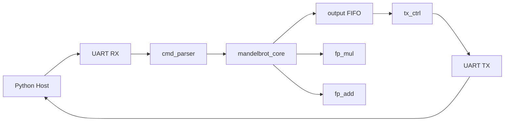
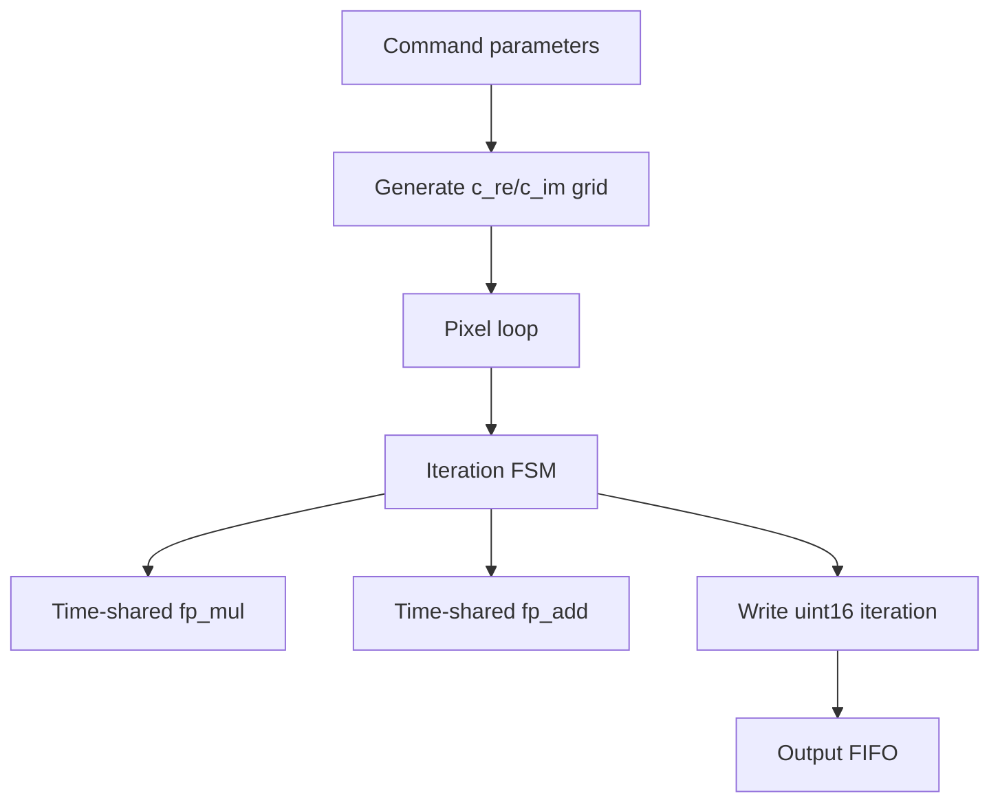
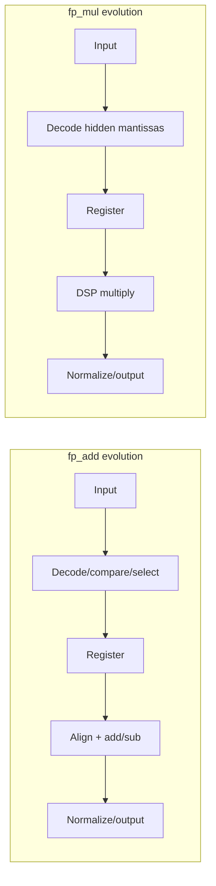
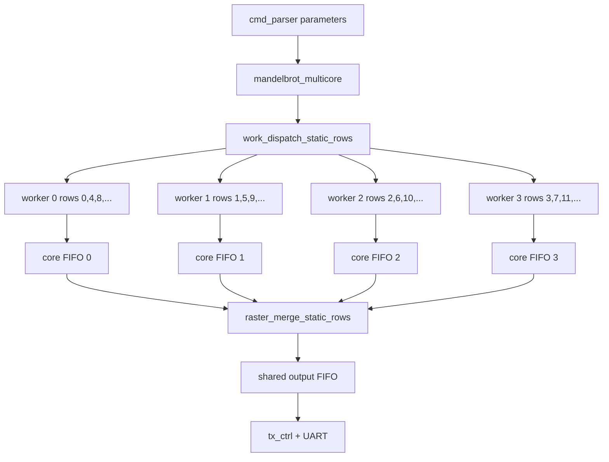

# Architecture Evolution And Optimization Report

This report explains the design thinking behind the Mandelbrot FPGA accelerator and summarizes how the architecture evolved from the initial single-core UART renderer to the current 4-core FP64 implementation. Stage-specific details are intentionally linked to the focused reports instead of duplicated in full.

## Related Stage Reports

| Stage | Report | Scope |
|---|---|---|
| Detailed current architecture | [ARCHITECTURE.md](ARCHITECTURE.md) | Full RTL/software architecture, protocol, verification, timing, and current performance. |
| 100 MHz timing closure | [PERFORMANCE_100MHZ.md](PERFORMANCE_100MHZ.md) | FP64 pipeline changes, 50 MHz effective to true 100 MHz migration, timing and performance impact. |
| UART baudrate optimization | [UART_BAUDRATE_BENCHMARK.md](UART_BAUDRATE_BENCHMARK.md) | CP2102 baudrate tests, 500000 baud selection, UART-limited benchmark impact. |
| UART baudrate deep investigation | [UART_BAUDRATE_INVESTIGATION.md](UART_BAUDRATE_INVESTIGATION.md) | Raw-probe integer-divider tests, TX-only isolation, 576000 candidate. |
| UART timing analysis | [UART_TIMING_ANALYSIS.md](UART_TIMING_ANALYSIS.md) | Single-sample RX timing, CP2102 drift, margin analysis, root cause of high-baud failures. |
| FP64 boundary differences | [FP64_BOUNDARY_DIFFERENCE_ANALYSIS.md](FP64_BOUNDARY_DIFFERENCE_ANALYSIS.md) | Truncation vs RNE, chaotic amplification, boundary pixel trace, difference classification. |
| Dynamic idle-core scheduling | [DYNAMIC_IDLE_CORE_SCHEDULING.md](DYNAMIC_IDLE_CORE_SCHEDULING.md) | Optional row-level dynamic scheduler, result collector, mode switching, validation, and limits. |
| Multi-core feasibility | [MULTICORE_FEASIBILITY.md](MULTICORE_FEASIBILITY.md) | Resource model, scheduler alternatives, output-order constraints, expected scaling. |
| Implemented 4-core design | [MULTICORE_4CORE_ARCHITECTURE.md](MULTICORE_4CORE_ARCHITECTURE.md) | Final 4-core architecture, modular dispatch/merge boundary, validation, 1080p benchmark results. |
| Historical notes | [DESIGN.md](DESIGN.md) | Earlier design notes and historical context. |

## Final Current State

| Item | Current Value |
|---|---:|
| FPGA | Xilinx Zynq-7010 `xc7z010clg400-1` |
| System clock | 100 MHz |
| Floating-point mode | FP64 |
| Compute cores | 4 |
| Effective worker rate | 100 MHz per worker, `FP_CE_DIV=1` |
| UART | 576000 baud, 8N1 |
| Host protocol | Unchanged raster-order response stream |
| Pixel format | 16-bit little-endian iteration count |
| Largest validated frame | 1920x1080 |
| Final routed timing | `WNS=0.224ns`, `TNS=0.000ns`, `WHS=0.005ns`, `THS=0.000ns` |
| Final placed DSP use | 38 / 80 DSP48E1, 47.50% |

## Initial Architecture Design Thinking

The original design goal was not maximum theoretical Mandelbrot throughput. It was a board-debuggable, end-to-end FPGA accelerator that could accept a complete image command from a PC, compute pixels in hardware, and return a file-renderable image with minimal host-side assumptions.

The initial architecture therefore favored these priorities:

| Priority | Design Choice | Reason |
|---|---|---|
| Simple bring-up | UART command/response protocol | UART is easy to probe, debug, and drive from Python on Windows. |
| Low memory use | Streaming pixels instead of frame buffering | A full 1080p frame at 16 bits/pixel is about 4 MiB, unnecessary for a serial output path. |
| Deterministic validation | Raster-order pixel stream | Host can render directly and compare against a software reference without coordinates per pixel. |
| Manageable RTL | One Mandelbrot FSM using one FP multiplier and one FP adder | Keeps area small and makes pipeline latency explicit. |
| Timing simplicity | One 100 MHz clock domain | Avoids derived-clock CDC issues between UART, parser, compute, FIFO, and TX. |
| Precision for zooms | FP64 default | FP64 supports visually useful deep zooms without committing to a much larger FP128 implementation. |

This produced the first useful architecture:



The important early decision was to make the hardware/software contract raster-order and image-level rather than pixel-command based. That avoided per-pixel command overhead and made it possible to later insert multi-core compute behind the same protocol.

## Baseline Single-Core Architecture

The baseline compute core used one FP multiplier and one FP adder, scheduled by a finite-state machine. Each pixel iterated:

```text
z_re_next = z_re^2 - z_im^2 + c_re
z_im_next = 2 * z_re * z_im + c_im
escape when z_re^2 + z_im^2 > 4
```

The core issued an FP operation, waited a fixed number of `fp_ce` pulses, then consumed the registered result. This made FP latency explicit and kept the Mandelbrot FSM independent from exact internal FP pipeline details.



The early design was resource-light. That was useful because it gave enough DSP/LUT/FF headroom to later improve timing and add multiple workers.

## Stage 1: Functional Correctness And Streaming Reliability

Before pursuing performance, the design needed to produce correct pixels and complete frames.

Key fixes included:

| Area | Issue | Resolution |
|---|---|---|
| FP add | Sign/magnitude and normalization corner cases | Added targeted tests and corrected same-sign/opposite-sign behavior. |
| FP mul | Coordinate multiplication cases | Added input and DSP product registers; verified image coordinate cases. |
| Core escape | Escape calculation used stale intermediate value | Corrected scheduling so `z_re^2 + z_im^2` uses the intended current terms. |
| Coordinate grid | Host and RTL center conventions differed | Host reference now mirrors RTL integer-center behavior. |
| TX stream | FIFO read data became valid one cycle after read | Added `S_READ_WAIT` in `tx_ctrl`. |
| Large images | `rows * cols` could truncate to 16 bits | Forced 32-bit pixel count in TX controller. |
| UART TX | Derived pseudo clock caused transfer fragility | Moved UART TX to the single `sys_clk` domain. |

Effect:

| Validation | Result |
|---|---|
| FP unit simulation | Passed targeted multiply/add cases. |
| Core simulation | Passed point/grid/full-size first-pixel regression. |
| Host reference testing | Passed randomized host/reference cases. |
| Hardware smoke | Passed known escape points. |
| Hardware image verify | Achieved 100% match on small frames. |

The outcome of this stage was a stable single-core streaming renderer with a trustworthy software reference.

## Stage 2: True 100 MHz FP64 Core

The early stable hardware used a 100 MHz physical clock but advanced the FP/core datapath every other cycle. That made timing easier but limited compute throughput.

The optimization goal was true 100 MHz operation with no core multicycle exceptions.

Detailed report: [PERFORMANCE_100MHZ.md](PERFORMANCE_100MHZ.md).

### Design Problem

Directly changing `FP_CE_DIV=2` to `FP_CE_DIV=1` failed timing badly:

| Attempt | Result |
|---|---:|
| Direct true 100 MHz | `WNS=-4.626ns`, `TNS=-593.205ns` |

The worst path was initially in `fp_add`, where decode, compare/select, alignment, and add/sub logic were too deep for 10 ns.

### Pipeline Strategy

The fix was not to change Mandelbrot math. It was to cut the long FP timing cones:



Timing closure path:

| Build | WNS | Result |
|---|---:|---|
| Old effective-50 MHz, multicycle | `2.619ns` | pass |
| Direct true 100 MHz | `-4.626ns` | fail |
| After adder cut | `-1.221ns` | fail, bottleneck moved to multiplier |
| After adder + multiplier cuts | `0.258ns` | pass |

### Stage Effect

Compute-bound workloads improved consistently by about `1.40x-1.41x`. The speedup was below an ideal `2x` because the deeper FP pipeline increased `PIPE_WAIT` from 6 to 9.

Representative 1080p impact from [PERFORMANCE_100MHZ.md](PERFORMANCE_100MHZ.md):

| Case | Old 50 MHz Effective | True 100 MHz | Speedup |
|---|---:|---:|---:|
| Deep tendrils @8192 | `478.776s` | `340.055s` | `1.41x` |
| Deep minibrot @8192 | `1198.049s` | `850.711s` | `1.41x` |
| Deep seahorse @1024 | `511.486s` | `363.254s` | `1.41x` |

UART-bound scenes barely improved, which exposed the next bottleneck.

## Stage 3: UART Baudrate Optimization

Once true 100 MHz was stable, fast scenes were capped by the serial output link.

Detailed reports: [UART_BAUDRATE_BENCHMARK.md](UART_BAUDRATE_BENCHMARK.md), [UART_BAUDRATE_INVESTIGATION.md](UART_BAUDRATE_INVESTIGATION.md), [UART_TIMING_ANALYSIS.md](UART_TIMING_ANALYSIS.md).

### Design Problem

At 460800 baud, the theoretical pixel ceiling was:

```text
460800 bits/s / 10 UART bits/byte / 2 bytes/pixel = 23040 pixels/s
```

Fast 1080p scenes were already near this ceiling.

### Initial Sweep

The 100 MHz clock allowed exact integer dividers for several candidate rates:

| Baudrate | `CLOCKS_PER_BIT` | Board Result |
|---:|---:|---|
| 1000000 | 100 | timeout |
| 800000 | 125 | timeout |
| 625000 | 160 | timeout |
| 500000 | 200 | pass |
| 460800 | 217 | previous stable baseline |

500000 baud was initially selected as the highest stable tested rate.

### Raw-Probe Deep Investigation

A follow-up investigation used `python/uart_raw_probe.py` to dump raw byte-level responses at each integer-divided baud rate, identifying three distinct failure classes:

| Baud | CPB | FPGA actual | Symptom | Root cause |
|---:|---:|---:|---:|---|
| 500000 | 200 | 500000.00 | Pass | Exact divider |
| 520833 | 192 | 520833.33 | Pass | Exact divider |
| 523560 | 191 | 523560.21 | 1/8 corrupt frames | CP2102 baud quantisation mismatch |
| 526316 | 190 | 526315.79 | All frames byte-corrupted | CP2102 baud quantisation mismatch |
| 530000–540000 | 189–185 | ~530k–541k | Zero response | RX timing margin collapse |
| **576000** | **174** | **574712.64** | **Pass** | **Standard PC baud, clean CP2102 path** |
| 625000 | 160 | 625000.00 | Zero response | FPGA RX uplink |
| 800000 | 125 | 800000.00 | Zero response | FPGA RX uplink |
| 1000000 | 100 | 1000000.00 | Zero response | FPGA RX uplink |

A **TX-only isolation experiment** (`uart_tx_pattern_top.v`) proved definitively that the FPGA TX downlink functions correctly at 625000, 800000, and 1000000 baud — the host receives large volumes of bytes when TX is driven without depending on RX. The failures at those rates are in the **FPGA RX uplink**, caused by the single-sample architecture lacking oversampling, start-bit verification, and majority-vote sampling.

Detailed timing analysis and CP2102 baud quantisation calculations are in [UART_TIMING_ANALYSIS.md](UART_TIMING_ANALYSIS.md).

### Stage Effect

The UART ceiling moved to:

```text
576000 bits/s / 10 / 2 = 28800 pixels/s
```

Representative impact:

| Case | 460800 | 500000 | 576000 | Speedup (500k→576k) |
|---|---:|---:|---:|---:|
| 1080p standard @64 | `90.551s` | `83.510s` | `72.735s` | `1.15x` |
| 1080p Seahorse zoom @512 | — | `83.956s` | `74.265s` | `1.13x` |
| Deep compute-bound cases | unchanged | unchanged | unchanged | `1.00x` |

## Stage 4: Multi-Core Feasibility Study

The next optimization question was whether multiple FP64 Mandelbrot cores fit on the target and whether they would actually help under the unchanged UART protocol.

Detailed report: [MULTICORE_FEASIBILITY.md](MULTICORE_FEASIBILITY.md).

### Resource Reasoning

The single-core 500000 baud design used about 10 DSP48E1 blocks. The compute core accounted for roughly 9 of them.

Planning model:

```text
DSP_total(N) ~= 1 + 9 * N
```

Estimated DSP use:

| Cores | Estimated DSPs | Assessment |
|---:|---:|---|
| 2 | ~19 | easy |
| 4 | ~37 | good target |
| 6 | ~55 | possible, more timing risk |
| 8 | ~73 | high routing/timing risk |

4 cores were chosen as the direct implementation target because they were large enough to materially improve deep zooms while still leaving routing/timing headroom.

### Scheduling Reasoning

The unchanged host protocol requires a raster-order stream with no coordinate metadata. That rules out a simple out-of-order dynamic scheduler unless hardware reorders results internally.

Options considered:

| Strategy | Pros | Cons | Decision |
|---|---|---|---|
| Contiguous row bands | Simple output order | Poor balance on localized zooms | Not selected |
| Interleaved rows | Better balance, simple `row % N` merge | Still strict-order stalls possible | Selected |
| Dynamic row chunks | Better balance | Needs row IDs or more complex reorder | Future |
| Tile scheduling | Best future balance | Needs protocol support for tile IDs | Future |
| Pixel interleaving | Fine balance | Merge/control overhead too high | Not selected |

The chosen path was static interleaved rows plus a hardware raster merger.

## Stage 5: Implemented 4-Core Architecture

The final implemented design instantiates four worker cores and preserves the existing host protocol.

Detailed report: [MULTICORE_4CORE_ARCHITECTURE.md](MULTICORE_4CORE_ARCHITECTURE.md).

### Implemented Data Path



### Modularity For Future Protocols

The scheduler and merger were deliberately separated from the worker arithmetic datapath:

| Current Module | Future Replacement |
|---|---|
| `work_dispatch_static_rows.v` | Dynamic row/tile scheduler. |
| `raster_merge_static_rows.v` | Row/tile packetizer or out-of-order merger. |
| Existing UART response stream | Higher-bandwidth coordinate-tagged stream. |

This keeps future protocol changes localized. Workers already accept row metadata through `row_start_in` and `row_stride_in`.

### 4-Core Timing Closure

The first 4-core route missed timing by a small margin in `fp_add` normalization/output logic:

| Build | Result |
|---|---:|
| First 4-core route | `WNS=-0.133ns`, `TNS=-0.151ns` |
| After additional `fp_add` output-side pipeline | timing met |

Final timing:

| Metric | Value |
|---|---:|
| WNS | `0.224ns` |
| TNS | `0.000ns` |
| WHS | `0.005ns` |
| THS | `0.000ns` |

### 4-Core Resource Result

| Resource | Used | Available | Utilization |
|---|---:|---:|---:|
| Slice LUTs | 8597 | 17600 | 48.85% |
| Slice Registers | 9807 | 35200 | 27.86% |
| Block RAM Tile | 8.5 | 60 | 14.17% |
| DSP48E1 | 38 | 80 | 47.50% |

The result matched the feasibility study closely.

## End-To-End Stage Effects

The table below summarizes how each stage moved the system bottleneck.

| Stage | Main Bottleneck Before | Change | Effect |
|---|---|---|---|
| Functional baseline | Correctness and streaming reliability | Fixed FP/core/TX/host reference bugs | Produced reliable hardware images and simulation regressions. |
| True 100 MHz | FP adder/multiplier timing | Added FP pipeline cuts, removed multicycle constraints | Compute-bound scenes improved about `1.40x-1.41x`. |
| UART 576k baud | 460800 baud output ceiling | Swept integer-divider bauds with raw-probe; TX-only isolation proved TX works at 625k+; 576k selected as stable standard-PC baud | UART-limited scenes improved about `1.15x`; systematic understanding of high-baud failure mode. |
| Multi-core feasibility | Need parallel compute but protocol constrained | Selected 4-core interleaved rows | Clear path with no host protocol change. |
| 4-core implementation | Single-worker compute throughput | Added 4 workers and raster merger | Compute-bound 1080p scenes improved about `3.5x-3.6x`. |
| FP64 boundary differences | Truncation vs RNE discrepancy | Quantified chaotic amplification, documented acceptance criteria | Verified differences are benign and expected. |
| Dynamic scheduler option | Static row modulo can leave row-level tail imbalance | Added `SCHED_MODE=1` idle-core row dispatcher and raster collector | Dynamic mode simulates and builds successfully while preserving the host protocol. |

## Final 1080p Performance Comparison

The 4-core design's gains over single-core are architecture-limited, not baudrate-limited. The tables below show the architectural speedup at matched baud rates.

### At 500000 Baud (Historical Baseline)

| Scene | Single Core 500k | 4-Core 500k | Speedup | Limiting Factor |
|---|---:|---:|---:|---|
| Fast escape @128 | `91.183s` | `83.520s` | `1.09x` | UART |
| Standard @64 | `83.510s` | `83.501s` | `1.00x` | UART |
| Seahorse zoom @512 | `171.817s` | `83.956s` | `2.05x` | UART after compute improvement |
| Deep tendrils @8192 | `340.029s` | `93.960s` | `3.62x` | mixed, near UART |
| Deep mini-brot @8192 | `850.720s` | `234.261s` | `3.63x` | compute |
| Deep seahorse @1024 | `363.253s` | `103.032s` | `3.53x` | mixed, near UART |

### At 576000 Baud (Current Default)

| Scene | 4-Core 500k | 4-Core 576k | Throughput | vs 4-Core 500k |
|---|---:|---:|---:|---:|
| Fast escape @128 | `83.520s` | `72.736s` | `28508.56 pps` | `1.15x` |
| Standard @64 | `83.510s` | `72.735s` | `28508.82 pps` | `1.15x` |
| Seahorse zoom @512 | `83.956s` | `74.265s` | `27921.47 pps` | `1.13x` |
| Deep tendrils @8192 | `93.960s` | `93.916s` | `22079.29 pps` | `1.00x` |
| Deep mini-brot @8192 | `234.261s` | `234.231s` | `8852.78 pps` | `1.00x` |
| Deep seahorse @1024 | `103.032s` | `100.658s` | `20600.46 pps` | `1.02x` |

The 576000 baud improvement follows UART dependency precisely: UART-bound scenes see the full ~15% raw bandwidth gain (576000/500000 = 1.152), mixed-bound scenes see a partial improvement (1.02x–1.13x), and compute-bound scenes see no change. All six scenes ran successfully at 1080p resolution; the first three were verified with `--verify` against the software reference.

### Dynamic Scheduler At 576000 Baud

The optional `SCHED_MODE=1` dynamic row scheduler was also benchmarked on the same six 1080p scenes after programming `fp64_dynamic_proj/mandelbrot_fp64_dynamic.runs/impl_1/top.bit`.

| Scene | Static 4-Core 576k | Dynamic 4-Core 576k | Dynamic Throughput | Dynamic vs Static |
|---|---:|---:|---:|---:|
| Fast escape @128 | `72.736s` | `72.721s` | `28514.47 pps` | `1.000x` |
| Standard @64 | `72.735s` | `72.719s` | `28515.41 pps` | `1.000x` |
| Seahorse zoom @512 | `74.265s` | `74.253s` | `27926.03 pps` | `1.000x` |
| Deep tendrils @8192 | `93.916s` | `93.907s` | `22081.36 pps` | `1.000x` |
| Deep mini-brot @8192 | `234.231s` | `234.137s` | `8856.36 pps` | `1.000x` |
| Deep seahorse @1024 | `100.658s` | `100.691s` | `20593.74 pps` | `1.000x` |

This confirms the scheduling model: the current real scenes have little row-level tail imbalance left for dynamic assignment to recover. The dynamic scheduler is useful as an architecture option and validates the scheduler/collector replacement boundary, but the next major performance improvements still require transport upgrades, tagged/tile output, or worker-internal de-bubbling.

The important lesson is that dynamic row assignment targeted the wrong dominant term for these measured scenes. Fast scenes are already limited by UART output time. Compute-heavy scenes are dominated by worker-internal FP latency rather than row ownership imbalance. The existing static scheduler already interleaves adjacent rows, so it was much closer to balanced than a contiguous-band split would have been.

Test parameters for the comparison table:

| Scene | Center | Step | Max Iter |
|---|---|---:|---:|
| Fast escape @128 | `(1.0, 1.0)` | `0.002` | `128` |
| Standard @64 | `(-0.5, 0.0)` | `0.002` | `64` |
| Seahorse zoom @512 | `(-0.743643887037151, 0.13182590420533)` | `5e-6` | `512` |
| Deep triple spiral @8192 | `(-0.088, 0.654)` | `1e-6` | `8192` |
| Deep tendrils @8192 | `(-0.77568377, 0.13646737)` | `1e-9` | `8192` |
| Deep mini-brot @8192 | `(-1.25066, 0.02012)` | `1e-9` | `8192` |
| Deep seahorse @1024 | `(-0.743643887037151, 0.13182590420533)` | `1e-8` | `1024` |

## Architectural Lessons

### Streaming Was The Right Initial Choice

Streaming kept memory use low and allowed early board validation with a simple UART protocol. The same stream contract survived the transition from one core to four cores.

### The Host Protocol Became Both Strength And Constraint

The raster-order protocol made validation simple and backward-compatible. It also forced the FPGA to reorder internally, which limits future scheduling flexibility. This is acceptable for 4 cores over UART, but not ideal for higher bandwidth or more cores.

### Timing Closure Required Data Path Changes, Not Constraints

The true 100 MHz stage succeeded because long FP logic cones were pipelined. Removing multicycle constraints simplified STA and made multi-core replication safer.

### 4 Cores Are A Good Match For 576000 Baud

Four workers are enough to push many compute-heavy scenes near the UART ceiling (~28800 pps). More workers would consume resources but often wait on UART unless the scene is extremely compute-bound.

### Dynamic Row Scheduling Is Now A Switchable Option

The original 4-core implementation deliberately separated dispatch and merge logic. That boundary has now been exercised by adding an optional dynamic row scheduler:

| Mode | Dispatcher | Collector | Protocol |
|---|---|---|---|
| Static default | `work_dispatch_static_rows` | `raster_merge_static_rows` | Existing raster stream. |
| Dynamic optional | `work_dispatch_dynamic_rows` | `raster_collect_dynamic_rows` | Existing raster stream. |

Dynamic mode assigns one full row at a time to an idle core and records row ownership. The collector still emits rows in order, so the host does not change. This validates the scheduler replacement boundary and gives a practical way to study row-level imbalance, but expected speedup on current measured 576k scenes is limited because UART and worker-internal FP latency remain dominant.

Why the measured speedup is effectively zero:

| Cause | Effect |
|---|---|
| UART-bound views already run at about 99% of the 576000 baud pixel ceiling | A better scheduler cannot send pixels faster than UART. |
| Static interleaved rows already spread smooth Mandelbrot row costs across all four cores | Dynamic assignment has little tail imbalance to recover. |
| Dynamic mode uses one-row jobs to reuse the existing worker safely | Each row repeats worker startup work, which consumes part of any balancing gain. |
| The collector still emits strict raster order | A slow earlier row can still hold the output stream even if later rows completed. |
| High-iteration views are dominated by the worker FSM and `PIPE_WAIT=10` FP latency | Row scheduling does not increase per-worker FP issue utilization. |

The architectural value is therefore not immediate throughput. It is validation that the dispatch/collection boundary can be replaced without touching UART, command parsing, FP datapaths, or host protocol.

Validation after adding this mode:

| Command | Result |
|---|---|
| `sim_multicore.tcl` | `=== MULTICORE TEST PASS: 192 pixels ===` |
| `sim_multicore_dynamic.tcl` | `=== DYNAMIC MULTICORE TEST PASS: 192 pixels ===` |
| `build_fp64.tcl` | Static bitstream generated, timing met. |
| `build_fp64_dynamic.tcl` | Dynamic bitstream generated, timing met. |

## Recommended Next Evolution

The next major improvement should target protocol and transport before adding more compute cores.


Recommended order:

| Priority | Step | Reason |
|---:|---|---|
| 1 | Add a higher-bandwidth transport | Current UART caps fast scenes at about `28800 pps`. |
| 2 | Add row/tile IDs to output packets | Enables out-of-order completion beyond the current raster collector. |
| 3 | De-bubble workers with multi-context interleaving | Attacks the real compute-bound bottleneck inside each worker. |
| 4 | Extend row-level dynamic scheduling to dynamic tiles | Improves load balance on localized deep zooms once output can be tagged. |
| 5 | Revisit 6 or 8 cores | Only useful after output bandwidth and scheduling improve. |
| 6 | Add mathematical interior tests | Cardioid/period-2 bulb rejection can reduce compute for standard views. |

## Summary

The project evolved through a pragmatic sequence:

1. Build a correct single-core streaming renderer.
2. Close true 100 MHz FP64 timing.
3. Raise UART bandwidth safely to 576000 baud via systematic integer-divider sweep, raw-probe, and TX-only isolation experiments.
4. Perform UART timing analysis proving FPGA RX is the high-baud failure root.
5. Study multi-core scaling under the unchanged raster protocol.
6. Implement 4-core interleaved-row workers with a modular scheduler and raster merger.
7. Analyze and document FP64 boundary differences (truncation vs RNE rounding, chaotic amplification).
8. Add a switchable dynamic idle-core row scheduler and matching raster collector.

The current design is stable, validated, and substantially faster for compute-bound 1080p deep zooms while preserving the original host protocol. The remaining bottleneck is no longer primarily FP compute for many scenes; it is the combination of UART bandwidth and strict raster-order output.
