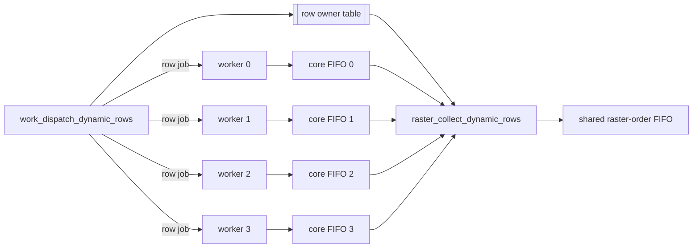

# Dynamic Idle-Core-Priority Scheduling Report

This report documents the dynamic idle-core scheduler added beside the existing static interleaved-row scheduler. The implemented mode assigns one full row at a time to the first available Mandelbrot worker, records row ownership in hardware, and preserves the existing raster-order host protocol.

## Implementation Summary

| Item | Status |
|---|---|
| Dynamic dispatcher | Implemented in `rtl/work_dispatch_dynamic_rows.v`. |
| Dynamic result collector | Implemented in `rtl/raster_collect_dynamic_rows.v`. |
| Compile-time mode switch | `SCHED_MODE` in `mandelbrot_multicore` and `top`. |
| Static default | Preserved as `SCHED_MODE=0`. |
| Dynamic optional build | `build_fp64_dynamic.tcl`, `SCHED_MODE=1`. |
| Dynamic simulation | `sim_multicore_dynamic.tcl`. |
| Host protocol | Unchanged raster-order 16-bit pixel stream. |

The default board build remains the static interleaved-row design. Dynamic mode is available for scheduler experiments and row-level load-balance evaluation.

## Current Static Baseline

Static mode assigns rows once at frame start:

| Core | Rows |
|---:|---|
| 0 | `0, 4, 8, ...` |
| 1 | `1, 5, 9, ...` |
| 2 | `2, 6, 10, ...` |
| 3 | `3, 7, 11, ...` |

`raster_merge_static_rows.v` restores output order by using:

```text
source_core = row % CORE_COUNT
```

This is simple and efficient, but a core can finish early and remain idle if another core owns heavier rows.

## Dynamic Scheduler Design

Dynamic mode reuses the existing `mandelbrot_core_worker` instead of introducing a new arithmetic worker. Each dynamic job is one full-width row:

```text
row_start = assigned_row
row_stride = rows
```

Since `row + row_stride >= rows` after that row, the worker finishes after producing exactly one row. The dispatcher then gives it another row if work remains.

The dispatcher tracks active cores internally. This is necessary because the worker latches `start` before `busy` rises, and `done` can remain visible long enough to confuse a naive `!busy` scheduler. `work_dispatch_dynamic_rows.v` therefore marks a core active immediately when it issues a job and waits for `done` to return low before reusing that core.

## Dynamic Result Collection

The host protocol still expects strict raster order with no row tags. Dynamic completion order is therefore hidden inside the FPGA.

`work_dispatch_dynamic_rows.v` writes a row-owner update whenever it issues a row:

```text
owner[row] = core_id
```

`raster_collect_dynamic_rows.v` walks the output raster order. For the current row, it waits until the owner entry exists, selects the recorded core FIFO, and drains pixels from that FIFO.



`DYNAMIC_OWNER_DEPTH` bounds the owner table. The default is `4096`, which covers the validated 1080p image height. Static mode does not use this table.

## Mode Switching

`mandelbrot_multicore` parameters:

| Parameter | Value | Meaning |
|---|---:|---|
| `SCHED_MODE` | `0` | Static interleaved rows, default. |
| `SCHED_MODE` | `1` | Dynamic idle-core rows. |
| `DYNAMIC_OWNER_DEPTH` | `4096` | Dynamic owner-table depth in rows. |

`top` forwards the same parameters to `mandelbrot_multicore`, so top-level builds can switch modes with Vivado generics.

Build scripts:

| Script | Mode |
|---|---|
| `build_fp64.tcl` | Static default, `SCHED_MODE=0`. |
| `build_fp64_dynamic.tcl` | Dynamic, `SCHED_MODE=1`. |

## Validation Results

| Command | Result |
|---|---|
| `vivado -mode batch -source sim_fp.tcl` | Pass. |
| `vivado -mode batch -source sim_core.tcl` | `=== CORE TEST PASS ===` |
| `vivado -mode batch -source sim_multicore.tcl` | `=== MULTICORE TEST PASS: 192 pixels ===` |
| `vivado -mode batch -source sim_multicore_dynamic.tcl` | `=== DYNAMIC MULTICORE TEST PASS: 192 pixels ===` |
| `vivado -mode batch -source build_fp64.tcl` | Static bitstream generated, timing met. |
| `vivado -mode batch -source build_fp64_dynamic.tcl` | Dynamic bitstream generated, timing met. |

Routed timing:

| Build | Scheduler | WNS | TNS | WHS | THS |
|---|---|---:|---:|---:|---:|
| `build_fp64.tcl` | Static interleaved rows | 0.358 ns | 0.000 ns | 0.024 ns | 0.000 ns |
| `build_fp64_dynamic.tcl` | Dynamic idle-core rows | 0.269 ns | 0.000 ns | 0.027 ns | 0.000 ns |

Placed utilization:

| Resource | Static | Dynamic |
|---|---:|---:|
| Slice LUTs | 8599 / 17600, 48.86% | 8717 / 17600, 49.53% |
| Slice Registers | 9807 / 35200, 27.86% | 10142 / 35200, 28.81% |
| DSP48E1 | 38 / 80, 47.50% | 38 / 80, 47.50% |
| Block RAM Tile | 8.5 / 60, 14.17% | 9.5 / 60, 15.83% |
| RAMB18 | 1 / 120, 0.83% | 3 / 120, 2.50% |

## Expected Performance Impact

Dynamic scheduling can only recover row-level load imbalance. It does not change the per-worker Mandelbrot FSM, FP latency, or UART output limit.

At 576000 baud, the UART ceiling is:

```text
576000 / 10 / 2 = 28800 pixels/s
```

Measured static 4-core scenes already show about `3.5x-3.6x` scaling on compute-bound cases, so the normal measured-scene upper bound for row-level dynamic scheduling is modest:

| Scene | Current 4-core 576k | Dynamic upper bound | Upper speedup |
|---|---:|---:|---:|
| Fast escape @128 | 28508.56 pps | UART cap 28800 pps | 1.01x |
| Standard @64 | 28508.82 pps | UART cap 28800 pps | 1.01x |
| Seahorse zoom @512 | 27921.47 pps | UART cap 28800 pps | 1.03x |
| Deep tendrils @8192 | 22079.29 pps | about 24393 pps | 1.10x |
| Deep mini-brot @8192 | 8852.78 pps | about 9749 pps | 1.10x |
| Deep seahorse @1024 | 20600.46 pps | about 22834 pps | 1.11x |

The dynamic scheduler is more valuable for highly uneven row-cost distributions, future higher core counts, faster output transports, and future tile-level scheduling.

## 1080p Board Benchmark Results

The dynamic scheduler bitstream was programmed with:

```bash
vivado -mode batch -source program.tcl -tclargs ./fp64_dynamic_proj/mandelbrot_fp64_dynamic.runs/impl_1/top.bit
```

All six 1080p scenes rendered successfully through the unchanged 576000 baud host path.

| Scene | Static 4-core 576k | Dynamic 4-core 576k | Dynamic throughput | Dynamic vs static |
|---|---:|---:|---:|---:|
| Fast escape @128 | 72.736 s | 72.721 s | 28514.47 pps | 1.000x |
| Standard @64 | 72.735 s | 72.719 s | 28515.41 pps | 1.000x |
| Seahorse zoom @512 | 74.265 s | 74.253 s | 27926.03 pps | 1.000x |
| Deep tendrils @8192 | 93.916 s | 93.907 s | 22081.36 pps | 1.000x |
| Deep mini-brot @8192 | 234.231 s | 234.137 s | 8856.36 pps | 1.000x |
| Deep seahorse @1024 | 100.658 s | 100.691 s | 20593.74 pps | 1.000x |

Generated benchmark images:

| Scene | Output file |
|---|---|
| Fast escape @128 | `python/dyn_1080p_fast_escape_i128.png` |
| Standard @64 | `python/dyn_1080p_standard_i64.png` |
| Seahorse zoom @512 | `python/dyn_1080p_seahorse_zoom_i512_s5e-6.png` |
| Deep tendrils @8192 | `python/dyn_1080p_deep_tendrils_i8192_s1e-9.png` |
| Deep mini-brot @8192 | `python/dyn_1080p_deep_minibrot_i8192_s1e-9.png` |
| Deep seahorse @1024 | `python/dyn_1080p_deep_seahorse_i1024_s1e-8.png` |

Interpretation:

| Observation | Meaning |
|---|---|
| UART-bound scenes are unchanged | Fast escape and standard views already sit at the 576000 baud pixel ceiling. |
| Mixed scenes are unchanged | Seahorse zoom and deep seahorse have little row-level tail imbalance to recover before hitting other limits. |
| Compute-bound scenes are unchanged | Deep tendrils and mini-brot remain limited by worker-internal compute, not by static row assignment imbalance. |
| Dynamic mode is functionally validated | The row-owner collector preserves raster-order output for full 1080p frames. |

These results confirm the model: the implemented dynamic row scheduler is useful as an architectural option and validation of the dispatch/collect boundary, but it is not a performance win for the current measured scenes. Bigger gains require either highly row-imbalanced views, tile-level dynamic scheduling, more cores, transport upgrades, or worker de-bubbling.

## Why The Speedup Was Not Observed

The dynamic scheduler did not underperform because the RTL failed to distribute work. It underperformed relative to the optimistic intuition because the current system has very little recoverable row-assignment idle time in the measured scenes. The measured result is therefore a useful negative result: it shows which bottleneck is not dominant.

### 1. The Fast Scenes Are Already UART-Bound

At 576000 baud, the hard pixel-output ceiling is:

```text
576000 bits/s / 10 UART bits/byte / 2 bytes/pixel = 28800 pixels/s
```

The dynamic fast/standard measurements are already essentially at that ceiling:

| Scene | Dynamic pps | Fraction of UART ceiling | Remaining headroom |
|---|---:|---:|---:|
| Fast escape @128 | 28514.47 pps | 99.0% | 1.0% |
| Standard @64 | 28515.41 pps | 99.0% | 1.0% |
| Seahorse zoom @512 | 27926.03 pps | 97.0% | 3.1% |

No row scheduler can materially improve a scene once the output link is the limiter. Even a perfect compute scheduler would spend most of the time waiting for `tx_ctrl`/UART to drain the same 4,147,200 pixel bytes.

### 2. Static Interleaved Rows Were Already Well Balanced

The static scheduler was not a weak contiguous-band split. It already interleaves rows:

```text
core0: rows 0,4,8,...
core1: rows 1,5,9,...
core2: rows 2,6,10,...
core3: rows 3,7,11,...
```

Mandelbrot cost usually varies smoothly between neighboring rows for the tested views. Interleaving therefore distributes heavy regions across all cores reasonably well. Dynamic row assignment can only improve the residual imbalance after that distribution.

The earlier single-core-to-4-core results already prove this point:

| Scene | Single-core 500k | Static 4-core 500k | Static scaling |
|---|---:|---:|---:|
| Deep tendrils @8192 | 340.029 s | 93.960 s | 3.62x |
| Deep mini-brot @8192 | 850.720 s | 234.261 s | 3.63x |
| Deep seahorse @1024 | 363.253 s | 103.032 s | 3.53x |

Those are already about 88% to 91% of ideal 4-core scaling. Dynamic row scheduling can only recover the missing tail imbalance, not create another multi-x gain.

### 3. The Dynamic Job Granularity Adds Row-Start Work

The implemented dynamic mode deliberately reuses the existing worker by making each job one row:

```text
row_start = assigned row
row_stride = rows
```

This keeps the RTL small and safe, but every row becomes a separate worker job. Each job repeats worker initialization, including coordinate setup for that row. For 1920-wide rows this overhead is small, but it is not zero. The dynamic scheduler must first overcome this overhead before any load-balance gain becomes visible.

This is why `CHUNK_ROWS > 1` may be worth prototyping later: it would reduce per-row startup overhead, but it would also make load balancing coarser.

### 4. Strict Raster Collection Still Serializes Early Rows

Dynamic mode keeps the old host protocol. The collector must emit:

```text
row 0, row 1, row 2, ...
```

It cannot transmit a completed later row before an earlier row. Therefore, dynamic dispatch improves compute assignment, but it does not remove all order-related stalls. If row `N` is slow, rows after `N` can be computed earlier, but the UART stream still waits at row `N`.

A tagged protocol v2 would remove this restriction by letting the FPGA return completed row/tile chunks out of order and letting the host place them into the image buffer.

### 5. Compute-Bound Scenes Are Mostly Worker-Internal, Not Assignment-Internal

For high-iteration scenes, the dominant compute cost is inside each worker's Mandelbrot FSM. The worker is latency-scheduled: it issues an FP operation, waits `PIPE_WAIT=10`, captures the result, and then issues the next dependent operation.

For a non-escaping iteration, the current worker performs roughly:

```text
3 multiplier issues + 5 adder issues over about 77 cycles
```

Dynamic row assignment does not change this per-worker schedule. It can make sure an idle worker receives another row, but it cannot make that worker feed its multiplier/adder every cycle. That is why compute-heavy mini-brot/tendrils cases remain effectively unchanged.

### 6. The Tested Views Are Not Pathological For Row Modulo Assignment

Dynamic scheduling is most useful when one static row class is much heavier than the others. For example:

```text
rows where y % 4 == 2 contain a localized expensive filament
other row classes mostly escape quickly
```

The six benchmark views do not appear to have that kind of row-class pathology. They are either UART-bound, broadly distributed, or dominated by per-worker iteration latency. An artificial row-imbalanced benchmark would be better for demonstrating scheduler benefit in isolation.

### 7. Whole-System Timing Is The Maximum Of Several Terms

A useful mental model is:

```text
frame_time = max(output_time, compute_time_with_assignment, raster_wait_time) + overhead
```

The dynamic scheduler only reduces `compute_time_with_assignment` when static assignment imbalance is significant. It does not reduce `output_time`, does not reduce per-worker FP latency, and only partially affects `raster_wait_time` because the output stream remains ordered.

For the measured scenes:

| Scene class | Dominant term | Dynamic row scheduling effect |
|---|---|---|
| Fast escape / standard | `output_time` | None. UART dominates. |
| Seahorse zoom / deep seahorse | mixed output + compute | Too little remaining row imbalance. |
| Tendrils / mini-brot | worker-internal compute | Assignment is not the main limiter. |

### Practical Conclusion

The dynamic scheduler is still valuable because it proves the dispatch/collect boundary is replaceable and timing-clean. It also provides a platform for future schedulers. However, the result shows that row-level work stealing over the existing raster UART protocol is not enough. The next performance-oriented changes should target bottlenecks in this order:

| Priority | Change | Reason |
|---:|---|---|
| 1 | Higher-bandwidth transport | Removes the ceiling for UART-bound scenes. |
| 2 | Tagged row/tile output protocol | Removes strict raster collector stalls and lets the host reorder. |
| 3 | Dynamic tile scheduling | Provides finer load balance for localized hotspots. |
| 4 | Worker de-bubbling / multi-context interleaving | Attacks the real compute-bound bottleneck inside each worker. |
| 5 | More cores | Useful only after output bandwidth and scheduling granularity improve. |

## Limitations

| Limitation | Detail |
|---|---|
| Row granularity | Current dynamic mode schedules full rows, not tiles. |
| Strict raster output | The collector can still wait for an earlier row before emitting later rows. |
| Owner depth | Dynamic mode supports rows below `DYNAMIC_OWNER_DEPTH`; default is 4096. |
| Worker initialization overhead | Each row is a separate worker job, so each row repeats worker initialization. This is acceptable for 1080p rows but not ideal for very narrow images. |
| No FP de-bubbling | Per-worker FP issue bubbles remain unchanged. |
| No UART relief | UART-bound scenes cannot improve materially. |

## Future Direction

The implemented compatible dynamic mode is a useful stepping stone. The next larger architectural step is a tagged row/tile protocol where the FPGA can emit completed chunks out of order and the host reorders them. That would remove strict raster collector stalls and make dynamic tile scheduling practical.

Recommended next steps:

| Priority | Work |
|---:|---|
| 1 | Board-benchmark static vs dynamic on artificial row-imbalanced scenes. |
| 2 | Add dynamic-mode host/build documentation for programming the dynamic bitstream. |
| 3 | Prototype `CHUNK_ROWS > 1` to reduce row-job initialization overhead. |
| 4 | Define protocol v2 with tagged row/tile packets. |
| 5 | Move from row-level jobs to tile-level jobs after tagged output exists. |

## Conclusion

Dynamic idle-core row scheduling is now implemented, switchable, simulated, and synthesizable. The default stable design remains static interleaved rows. Dynamic mode preserves host compatibility and adds only modest resources, but its expected performance gain on current 576000-baud measured scenes is limited because UART and per-worker FP latency remain the dominant constraints.
