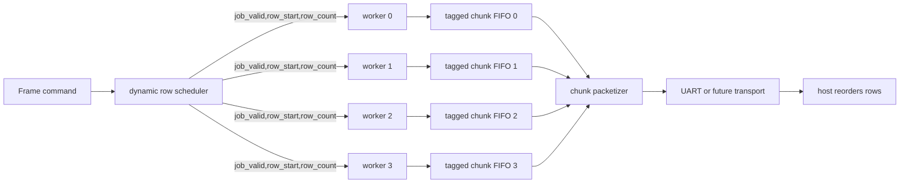
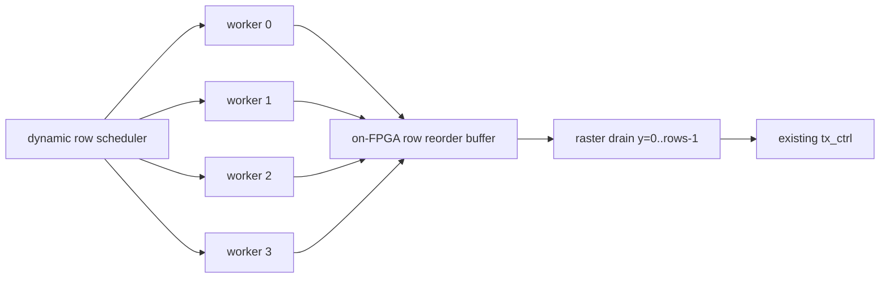

# 空闲核心优先调度方案研究报告

本文研究在当前 4-core FP64 Mandelbrot FPGA 架构上，将静态交错行分配替换为“优先向空闲核心分配任务”的动态调度方案。重点分析设计思路、需要修改的模块、输出顺序约束、资源和时序风险，以及相对当前实现的实际收益边界。

## 0. 当前实现状态

该方案已实现为可选 RTL 模式，默认板上构建仍保持 static interleaved rows。

| 项目 | 状态 |
|---|---|
| 动态 dispatcher | 已实现：`rtl/work_dispatch_dynamic_rows.v`。 |
| 动态结果收集模块 | 已实现：`rtl/raster_collect_dynamic_rows.v`。 |
| 模式切换 | 已实现：`mandelbrot_multicore` 和 `top` 参数 `SCHED_MODE`。 |
| 默认模式 | `SCHED_MODE=0`，static interleaved rows。 |
| 动态模式 | `SCHED_MODE=1`，空闲核心优先领取单行 job。 |
| 动态 build 脚本 | `build_fp64_dynamic.tcl`。 |
| 动态仿真 | `sim_multicore_dynamic.tcl`，通过 `=== DYNAMIC MULTICORE TEST PASS: 192 pixels ===`。 |
| Host 协议 | 保持不变，仍输出 strict raster-order 16-bit pixel stream。 |

实现采用兼容旧协议的方案：每个 job 是一整行，dispatcher 把下一行分配给第一个可用 core，并写入 `owner[row] = core_id`；collector 按 raster order 逐行查 owner table，再从对应 core FIFO 取像素。该实现不是 tagged protocol v2，也不是 tile scheduler，但为后续 out-of-order/tagged/tile 架构打好了调度边界。

验证结果：

| 命令 | 结果 |
|---|---|
| `vivado -mode batch -source sim_fp.tcl` | Pass。 |
| `vivado -mode batch -source sim_core.tcl` | `=== CORE TEST PASS ===` |
| `vivado -mode batch -source sim_multicore.tcl` | `=== MULTICORE TEST PASS: 192 pixels ===` |
| `vivado -mode batch -source sim_multicore_dynamic.tcl` | `=== DYNAMIC MULTICORE TEST PASS: 192 pixels ===` |
| `vivado -mode batch -source build_fp64.tcl` | static bitstream 生成，timing met。 |
| `vivado -mode batch -source build_fp64_dynamic.tcl` | dynamic bitstream 生成，timing met。 |

资源和 timing：

| Build | Scheduler | WNS | TNS | WHS | THS |
|---|---|---:|---:|---:|---:|
| `build_fp64.tcl` | Static interleaved rows | 0.358 ns | 0.000 ns | 0.024 ns | 0.000 ns |
| `build_fp64_dynamic.tcl` | Dynamic idle-core rows | 0.269 ns | 0.000 ns | 0.027 ns | 0.000 ns |

| Resource | Static | Dynamic |
|---|---:|---:|
| Slice LUTs | 8599 / 17600, 48.86% | 8717 / 17600, 49.53% |
| Slice Registers | 9807 / 35200, 27.86% | 10142 / 35200, 28.81% |
| DSP48E1 | 38 / 80, 47.50% | 38 / 80, 47.50% |
| Block RAM Tile | 8.5 / 60, 14.17% | 9.5 / 60, 15.83% |
| RAMB18 | 1 / 120, 0.83% | 3 / 120, 2.50% |

1080p 板上生图测试，使用动态 bitstream 和原 576000 baud host path：

| Scene | Static 4-core 576k | Dynamic 4-core 576k | Dynamic throughput | Dynamic vs static |
|---|---:|---:|---:|---:|
| Fast escape @128 | 72.736 s | 72.721 s | 28514.47 pps | 1.000x |
| Standard @64 | 72.735 s | 72.719 s | 28515.41 pps | 1.000x |
| Seahorse zoom @512 | 74.265 s | 74.253 s | 27926.03 pps | 1.000x |
| Deep tendrils @8192 | 93.916 s | 93.907 s | 22081.36 pps | 1.000x |
| Deep mini-brot @8192 | 234.231 s | 234.137 s | 8856.36 pps | 1.000x |
| Deep seahorse @1024 | 100.658 s | 100.691 s | 20593.74 pps | 1.000x |

结论：动态行分配在这些实际 1080p 场景上功能正确，但性能基本持平。当前 static interleaved rows 对这些视图已经足够均衡；剩余瓶颈主要是 UART 输出、worker 内部 FP pipeline 空泡或整体 compute latency，而不是行级任务尾部不均衡。

## 1. 当前基线

当前稳定设计是 4 个 `mandelbrot_core_worker` 并行工作，调度策略是静态交错行：

| Core | Current rows |
|---:|---|
| 0 | `0, 4, 8, ...` |
| 1 | `1, 5, 9, ...` |
| 2 | `2, 6, 10, ...` |
| 3 | `3, 7, 11, ...` |

相关模块：

| Module | Current role |
|---|---|
| `work_dispatch_static_rows.v` | 组合逻辑分配 `row_start=i`, `row_stride=CORE_COUNT`，所有 core 同时启动。 |
| `mandelbrot_core_worker.v` | 每个 worker 独立计算固定 row stride 的行序列。 |
| `raster_merge_static_rows.v` | 按 `source_core = row % CORE_COUNT` 从固定 core FIFO 取像素，恢复 strict raster order。 |
| `mandelbrot_multicore.v` | 实例化 worker、per-core FIFO、dispatcher、merger。 |

当前设计的优点是简单、确定、无需 host 协议变化。缺点是每个 core 的任务集合在 frame 开始时固定，某个 core 如果遇到更重的行集合，其他 core 提前完成后不能继续帮忙。

## 2. 问题定义

“优先向空闲核心分配任务”的目标是动态负载均衡：

```text
当某个 core 完成当前 job 后，如果还有未计算的 job，就立即把下一个 job 发给这个空闲 core。
```

这类方案能解决的是 core 之间的工作量不均衡，不解决单个 worker 内部 FP pipeline 空泡。也就是说，它不会改变每个像素每次迭代的计算周期，只是减少“有 core 闲着但 frame 还没完成”的尾部浪费。

因此它和 `PIPELINE_BUBBLE_ANALYSIS.md` 中的 multi-context de-bubbling 是两个不同层级：

| Optimization | Solves | Does not solve |
|---|---|---|
| Idle-core dynamic scheduling | Core-level load imbalance | Per-worker FP issue bubbles |
| Multi-context worker de-bubbling | Per-worker FP latency bubbles | Output ordering and job-level imbalance |
| Higher-bandwidth transport | UART output ceiling | Compute imbalance or FP bubbles |

## 3. 为什么不能只改 dispatcher

当前 `work_dispatch_static_rows.v` 非常简单，因为 assignment 在 frame 开始时一次性决定。动态空闲核心优先调度需要更多接口能力：

| Requirement | Current support | Needed change |
|---|---|---|
| 多次给同一个 core 发 job | 不支持，worker 一帧只 start 一次 | worker 支持 job-level start/ready/done。 |
| 任意 row/chunk 分配给任意 core | 当前通过固定 `row_start/row_stride` 实现 | job 需要携带 `row_start`, `row_count` 或 tile 坐标。 |
| 输出识别来源位置 | 当前 merger 假设 `row % 4` | 输出需要 row/chunk tag，或硬件 reorder buffer。 |
| 防止 reorder buffer 溢出 | 当前不需要 | scheduler 需要观察可用 reorder window。 |
| frame 完成判定 | 当前等 merger 输出完全部像素 | 需要区分 jobs issued、jobs completed、pixels emitted。 |

关键约束是 host 当前只接收没有坐标标签的 raster-order pixel stream。如果动态分配后 core completion order 不再等于 raster order，必须二选一：

1. FPGA 内部重排为 raster order，保持旧协议。
2. 输出 row/tile 标签，让 host 重排，定义协议 v2。

## 4. 推荐 job 粒度

### 4.1 Full-width row chunk

最实用的第一版 job 是若干连续整行：

```text
job = rows [y_start, y_start + row_count - 1], full image width
```

优点：

| Property | Assessment |
|---|---|
| Worker 修改量 | 中等。当前 worker 已经按行和列计算，最接近现有结构。 |
| Metadata | 小，只需要 `job_id` / `row_start` / `row_count`。 |
| Host reorder | 简单，按 row offset 放回图像。 |
| Chunk overhead | 很低，1080p 下一行 payload 是 `1920 * 2 = 3840` bytes。 |
| Load balance | 好。`row_count=1` 时粒度最细。 |

建议 chunk 大小：

| Resolution | Recommended row_count | Reason |
|---:|---:|---|
| 160x120 | 4 to 8 | 减少 job 管理开销。 |
| 640-wide | 2 to 4 | 平衡开销和负载均衡。 |
| 1920-wide | 1 to 2 | 每行已经足够大，metadata overhead 很小。 |

### 4.2 Tile chunk

tile job 例如 `128x16` 或 `256x8`，长期更灵活，但第一版不推荐。

| Aspect | Row chunk | Tile chunk |
|---|---|---|
| Worker coordinate change | 小 | 大，需要 `x_start/x_count` 和 tile-local coordinate。 |
| Output metadata | row start/count | x/y start, width/height。 |
| Reorder complexity | 低 | 中到高。 |
| Load balance | 好 | 更好。 |
| First implementation risk | 中 | 高。 |

## 5. 架构方案 A：协议 v2，host 重排

这是推荐方案。FPGA 不再强制输出 strict raster-order pixels，而是输出完成的 row chunks。host 根据 row tag 放回图像。

### 5.1 数据流



### 5.2 Scheduler 行为

Scheduler 维护：

| Register | Role |
|---|---|
| `next_row` | 下一个尚未发出的 row chunk 起点。 |
| `jobs_issued` | 已发 job 数量。 |
| `jobs_completed` | 已完成 job 数量。 |
| `core_busy[i]` | core 是否正在执行 job。 |
| `core_job_row[i]` | core 当前 job 的 row 起点。 |
| `core_job_rows[i]` | core 当前 job 的行数。 |

每个 cycle 可以用 priority encoder 找空闲 core：

```text
for each core in priority/round-robin order:
    if core is idle and next_row < rows:
        assign job(row_start=next_row, row_count=min(CHUNK_ROWS, rows-next_row))
        next_row += row_count
```

Tie-break 可以用 lowest-index 或 round-robin。lowest-index RTL 最简单；round-robin 可以避免某些短 job 场景下 core 0 更忙，但差异很小。

### 5.3 Worker 接口建议

当前 worker 是 frame-level worker，一帧只 start 一次。动态调度建议拆成 frame context 和 job context：

```verilog
input  wire        frame_start;
input  wire        job_valid;
output wire        job_ready;
input  wire [15:0] job_row_start;
input  wire [15:0] job_row_count;
output reg         job_done;
output reg  [15:0] out_row;
output reg  [15:0] out_col;
output reg  [15:0] out_iter;
output reg         out_valid;
input  wire        out_ready;
```

为了减少每个 job 的初始化成本，worker 应在 `frame_start` 时只做一次全局预计算：

| Precomputed once per frame | Reason |
|---|---|
| `c_re_start` | 每行第 0 列 real 坐标相同。 |
| `c_im_top` | 任意 row 的 imaginary 坐标都可由它推导。 |
| `step_val` | frame 内固定。 |
| `rows/cols/max_iter` | frame 内固定。 |

每个 row job 开始时再计算：

```text
c_im(row_start) = c_im_top - row_start * step
```

这个 job 初始化需要一个 int-to-FP、一个 FP multiply、一个 FP subtract。对 1080p 整行 job 来说开销很小；对非常小的 tile job 才会明显。

### 5.4 Packet 格式建议

保持现有 frame header 思路，但 payload 改为 chunk packet：

```text
Frame header:
  magic: 'R' 'K' or new magic 'R' 'T'
  rows: uint16
  cols: uint16
  mode/version: uint8

Chunk packet:
  tag: 'C'
  row_start: uint16
  row_count: uint16
  payload_bytes: uint32
  pixels: row_count * cols * uint16
  chunk_checksum: uint8

Frame end:
  tag: 'E'
  frame_checksum: uint8
```

1080p 单行 chunk 的 header overhead 约为：

```text
~10 bytes header / 3840 bytes payload = 0.26%
```

即使使用 576000 baud，这个 overhead 也只带来约 `0.2s` 量级的整帧传输时间增加，远低于动态调度可能回收的 compute tail。

### 5.5 优点和代价

| Item | Assessment |
|---|---|
| Load balance | 最好。任何 core 空闲都能继续取下一行或下一组行。 |
| FPGA buffering | 低。完成 chunk 可直接 packetize，不需要大 reorder buffer。 |
| Host complexity | 中。host 需要按 row 写入 image array。 |
| Protocol compatibility | 需要 v2，旧 host 不能直接读取。 |
| RTL complexity | 中。scheduler 和 packetizer 新增，但 merger 反而更简单。 |
| Deadlock risk | 低。没有 strict raster reorder 造成的大窗口阻塞。 |

## 6. 架构方案 B：保持旧 raster 协议，FPGA 内部重排

如果必须保持现有 host 完全不变，动态调度仍可做，但需要 FPGA reorder buffer。

### 6.1 数据流



### 6.2 Reorder window

完整任意顺序重排最坏情况需要接近整帧 buffer。1080p FP16 pixel payload 是：

```text
1920 * 1080 * 2 = 4,147,200 bytes
```

Zynq-7010 fabric BRAM 不适合存完整帧。因此需要有限窗口：

```text
only issue jobs with row < drain_row + WINDOW_ROWS
```

一行 1080p buffer 大小：

```text
1920 * 16 bits = 30,720 bits ~= 1.7 RAMB18
```

窗口资源估算：

| WINDOW_ROWS | Buffer bits | Approx RAMB18 | Assessment |
|---:|---:|---:|---|
| 4 | 122,880 | 7 | 可接受，但调度自由度有限。 |
| 8 | 245,760 | 14 | 可接受，资源开始明显。 |
| 16 | 491,520 | 28 | 可能可行，但会吃掉大量 BRAM。 |
| 32 | 983,040 | 55 | 接近器件 BRAM 上限，不推荐。 |

当前 4-core 设计已使用 `8.5 / 60` Block RAM Tile。窗口 16 行仍可能放得下，但会把 BRAM 从轻度使用变为主要资源，并增加 address/control 复杂度。

### 6.3 优点和代价

| Item | Assessment |
|---|---|
| Host compatibility | 最好，旧 host 完全不变。 |
| Load balance | 中到好，受 reorder window 限制。 |
| FPGA buffering | 高，窗口越大越贵。 |
| Deadlock risk | 中，需要严格处理窗口满、早行未完成、后行完成无法写入的情况。 |
| Timing risk | 中，BRAM address mux、valid bitmap、window control 都进入关键控制路径。 |
| Recommendation | 仅当必须保持旧协议时考虑。 |

## 7. 架构方案 C：混合模式

混合方案是在旧 raster 协议和动态调度之间折中：

```text
按小窗口顺序发 job，窗口内空闲 core 优先取任务，输出仍由 FPGA raster drain。
```

例如窗口为 8 行：scheduler 只允许 row `drain_row` 到 `drain_row+7` 在飞。这样能回收窗口内负载不均衡，但如果 row `drain_row` 特别慢，后续窗口无法继续推进。

| Property | Hybrid windowed dynamic rows |
|---|---|
| Host protocol | 不变。 |
| FPGA BRAM | 可控。 |
| Load balance | 比 static interleaved 好，但不如 tagged v2。 |
| Implementation risk | 中到高。 |
| Best use | 不想改 host，但想验证动态调度收益。 |

这个方案适合做实验原型，但不是最终推荐架构。

## 8. 收益模型

动态空闲核心优先调度的上限来自当前 static 4-core 和理想 4-core 之间的差距。

用 500k single-core 数据估算理想 4-core compute throughput：

```text
ideal_4core_pps = single_core_pps * 4
dynamic_upper_pps = min(ideal_4core_pps, UART_ceiling)
```

当前 576000 baud UART pixel ceiling：

```text
576000 / 10 / 2 = 28800 pixels/s
```

### 8.1 基于已测 1080p 场景的上限估算

| Scene | Current 4-core 576k | Ideal 4-core compute estimate | UART cap | Dynamic upper | Upper speedup |
|---|---:|---:|---:|---:|---:|
| Fast escape @128 | `28508.56 pps` | already UART-bound | `28800 pps` | `28800 pps` | `1.01x` |
| Standard @64 | `28508.82 pps` | already UART-bound | `28800 pps` | `28800 pps` | `1.01x` |
| Seahorse zoom @512 | `27921.47 pps` | `48274 pps` | `28800 pps` | `28800 pps` | `1.03x` |
| Deep tendrils @8192 | `22079.29 pps` | `24393 pps` | `28800 pps` | `24393 pps` | `1.10x` |
| Deep mini-brot @8192 | `8852.78 pps` | `9749 pps` | `28800 pps` | `9749 pps` | `1.10x` |
| Deep seahorse @1024 | `20600.46 pps` | `22834 pps` | `28800 pps` | `22834 pps` | `1.11x` |

解释：

| Observation | Meaning |
|---|---|
| 当前 compute-bound 4-core speedup 已有 `3.5x-3.6x` | static interleaved rows 已经很接近理想 4-core。 |
| 动态调度只能把 `3.5x-3.6x` 推近 `4.0x` | 常规场景上限约 `1.1x`。 |
| UART-bound 场景没有有效收益 | 当前 576k 下 fast/standard 已接近 `28800 pps` ceiling。 |
| Seahorse zoom 收益也很小 | compute 还有余地，但马上撞 UART。 |

### 8.2 什么时候收益会更大

动态空闲核心优先在以下情况下收益会明显高于上表：

| Case | Expected benefit |
|---|---|
| 极局部高复杂区域只落在少数 `row % 4` 类别 | 可能显著超过 `1.1x`，因为 static interleaving 会严重偏斜。 |
| core 数增加到 6 或 8 | static row modulo 更容易出现尾部不均衡，动态调度更有价值。 |
| 输出链路升级到远高于 28800 pps | UART 不再压制 compute/load-balance 收益。 |
| 使用 tile 而不是整行 | 对局部热点更敏感，负载均衡更细。 |

### 8.3 为什么不是 4x 级提升

空闲核心优先只是重新分配 job。它不会让一个 worker 的 FP multiplier/adder 更忙。当前 worker 内部非 escape iteration 仍然大约需要：

```text
7 * (PIPE_WAIT + 1) ~= 77 cycles
```

因此它的收益来源只有：

```text
减少最后一个重任务 core 拖住整帧的时间
```

不是：

```text
提高每个 core 的每周期 FP issue rate
```

## 9. 资源和时序影响

### 9.1 协议 v2 tagged chunk 方案

| Resource | Expected impact |
|---|---|
| LUT | 中等增加，scheduler、packetizer、metadata FIFO。 |
| FF | 小到中等增加，job state 和 per-core metadata。 |
| BRAM | 小。只需要 per-core output FIFO，不需要大 reorder buffer。 |
| DSP | 基本不变，除非 worker job init 复用现有 FP units。 |
| Timing | 中等风险，主要在 scheduler priority encoder 和 packet mux。 |

### 9.2 旧协议 FPGA reorder 方案

| Resource | Expected impact |
|---|---|
| LUT | 中到高，row valid bitmap、window mapping、merge control。 |
| FF | 中等，窗口状态和 counters。 |
| BRAM | 高，1080p 每行约 30,720 bits。 |
| DSP | 基本不变。 |
| Timing | 中到高，window control 和 BRAM mux 可能影响 100MHz margin。 |

## 10. 验证计划

推荐先在 simulation 中做最小闭环，再上板。

### 10.1 单元级验证

| Test | Purpose |
|---|---|
| Scheduler synthetic jobs | 确认空闲 core 优先、无重复 job、无漏 job。 |
| Worker repeated jobs | 确认同一 worker 可连续接多个 row chunks。 |
| Packetizer checksum | 确认 chunk header/payload/checksum 正确。 |
| Host reorder unit test | 随机打乱 chunk 到达顺序，重建图像。 |

### 10.2 集成仿真

| Test | Purpose |
|---|---|
| Tiny frame, deterministic row costs | 检查输出像素完整性。 |
| Artificial delayed core | 验证某 core 慢时其他 core 继续拿 job。 |
| Randomized chunk completion order | 验证 tagged host reorder 或 FPGA reorder。 |
| Compare against existing `tb_multicore` reference | 保证 pixel values 不变。 |

### 10.3 板上 benchmark

至少跑这些已知场景：

| Scene | Expected result |
|---|---|
| Fast escape @128 | 几乎无提升，仍 UART-bound。 |
| Standard @64 | 几乎无提升，仍 UART-bound。 |
| Seahorse zoom @512 | 0% 到 3% 量级。 |
| Deep tendrils @8192 | 最高约 10%。 |
| Deep mini-brot @8192 | 最高约 10%。 |
| Deep seahorse @1024 | 最高约 11%。 |
| 人工构造热点视图 | 观察 dynamic scheduler 真正优势。 |

## 11. 实施路线

推荐路线：先协议 v2 tagged row chunks，不建议先做旧协议大 reorder buffer。

### Milestone 1：simulation-only scheduler

实现 `work_dispatch_dynamic_rows` 原型：

```verilog
parameter CORE_COUNT = 4;
parameter CHUNK_ROWS = 1;
```

接口只处理 job 分配，不接 FP worker：

```verilog
input  wire [CORE_COUNT-1:0] core_idle;
output reg  [CORE_COUNT-1:0] job_valid;
output reg  [CORE_COUNT*16-1:0] job_row_start_bus;
output reg  [CORE_COUNT*16-1:0] job_row_count_bus;
```

### Milestone 2：worker 支持 repeated jobs

把 worker 从“一帧一个 start”改为“一帧初始化，多次 row job”。保留现有 `mandelbrot_core_worker.v` 作为稳定版本，建议新增文件而不是直接大改：

```text
mandelbrot_core_worker_dynamic.v
```

### Milestone 3：tagged chunk FIFO and packetizer

每个 worker 输出：

```text
chunk metadata + pixel stream
```

packetizer 轮询已完成 chunk FIFO，直接发给 host。不再需要 `raster_merge_static_rows.v`。

### Milestone 4：host protocol v2

在 `python/mandelbrot_host.py` 增加 `--protocol tagged` 或自动识别新 magic。host 分配目标 image buffer，按 `row_start` 写入 payload。

### Milestone 5：hardware benchmark

先用 `CHUNK_ROWS=1` 跑 1080p compute-bound 场景，再尝试 `CHUNK_ROWS=2/4` 比较调度 overhead 和 balance。

## 12. 结论

优先向空闲核心分配任务是合理的下一层调度优化，但它不是当前系统的最大收益点。

核心结论：

| Topic | Conclusion |
|---|---|
| 技术可行性 | 可行，但需要 worker job 接口、scheduler、tagged output 或 reorder buffer。 |
| 推荐实现 | 协议 v2 tagged full-width row chunks，host 重排。 |
| 不推荐首选 | 保持旧协议的大型 FPGA reorder buffer，BRAM 和死锁复杂度更高。 |
| 当前 576k 收益 | 已测常规 1080p 场景多数 `1.0x-1.11x` 上限。 |
| 最大价值场景 | 极不均匀热点、更多 core、更高带宽 transport、tile scheduling。 |
| 与 de-bubbling 关系 | 互补。动态调度解决 core-level imbalance，de-bubbling 解决 per-worker pipeline bubbles。 |

建议优先级：

| Priority | Work |
|---:|---|
| 1 | 如果要做动态调度，先定义 tagged row-chunk protocol v2。 |
| 2 | 新增 dynamic worker，不破坏当前稳定 static worker。 |
| 3 | 用 `CHUNK_ROWS=1` 的 full-width row jobs 做第一版。 |
| 4 | 与现有 4-core static interleaved rows 对比 benchmark。 |
| 5 | 若输出链路升级，再扩展到 tile scheduler 或更多 cores。 |

在当前 4-core + 576000 UART 下，static interleaved rows 已经足够接近理想 4-core。动态空闲核心优先调度的主要价值不是立即大幅提升现有 demo，而是为后续 tagged/out-of-order protocol、更高带宽 transport、6-8 cores 和 tile-level dynamic scheduling 建立架构基础。
