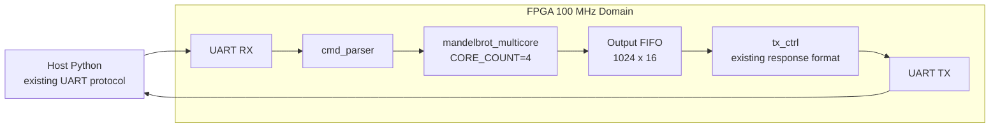
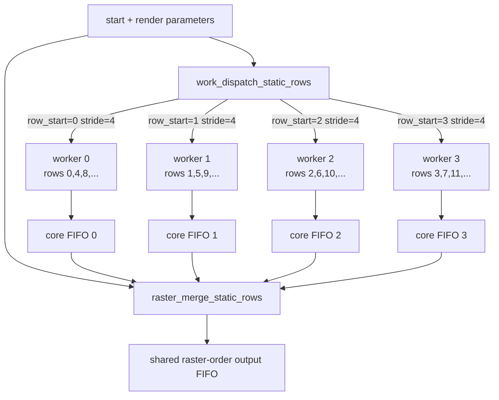
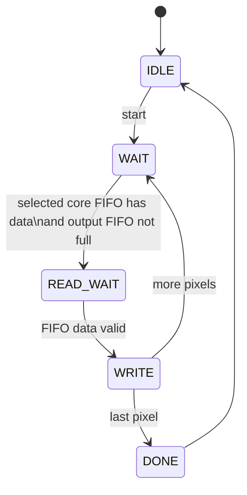
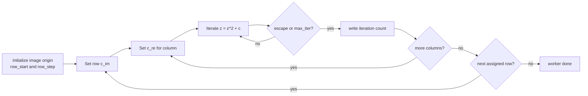
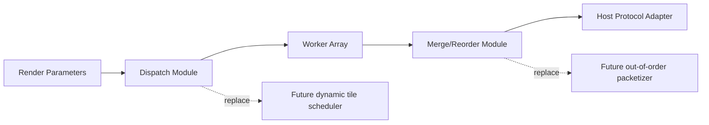

# 4-Core Mandelbrot Architecture

This document records the implemented 4-core FP64 Mandelbrot accelerator, its modular scheduling boundary, validation results, and measured board performance.

## Current Configuration

| Item | Value |
|---|---:|
| FPGA fabric clock | 100 MHz |
| FP core clock enable | `FP_CE_DIV=1` |
| Core count | 4 |
| Worker FP latency wait | `PIPE_WAIT=10` |
| Host protocol | Unchanged raster-order UART protocol |
| UART baud | 500000 |
| UART payload | 16-bit iteration count per pixel |
| Stable bitstream | `fp64_proj/mandelbrot_fp64.runs/impl_1/top.bit` |

The host protocol is intentionally unchanged because the current transport is still UART-limited for many 1080p scenes. The FPGA returns pixels in ordinary row-major raster order, so existing Python host code and image generation code continue to work without protocol changes.

## Top-Level Diagram



## Multicore Block Diagram



## Module Roles

| Module | Role |
|---|---|
| `mandelbrot_multicore.v` | 4-core wrapper. Owns worker instantiation, per-core FIFOs, scheduler, merger, and `tx_start` passthrough. |
| `work_dispatch_static_rows.v` | Modular task assignment. Current policy is static interleaved rows. Replace this module for future dynamic or out-of-order work issue. |
| `work_dispatch_dynamic_rows.v` | Optional task assignment. Issues one full row at a time to the first available worker and records row ownership. |
| `mandelbrot_core_worker.v` | Worker version of the single-core FSM. Adds `row_start_in` and `row_stride_in`; otherwise computes the same FP64 Mandelbrot iterations. |
| `raster_merge_static_rows.v` | Reorders per-core row streams into exact host-visible raster order. This preserves the existing host protocol. |
| `raster_collect_dynamic_rows.v` | Optional dynamic-mode collector. Uses the owner table from the dynamic dispatcher to preserve host-visible raster order. |
| `queue.v` | Existing synchronous FIFO, reused for per-core and output buffering. |
| `top.v` | Instantiates `mandelbrot_multicore #(.CORE_COUNT(4), .CORE_FIFO_DEPTH(4096))`. |

## Scheduling Policy

The implemented dispatcher assigns rows by static interleaving:

| Core | First row | Stride | Rows |
|---:|---:|---:|---|
| 0 | 0 | 4 | `0, 4, 8, ...` |
| 1 | 1 | 4 | `1, 5, 9, ...` |
| 2 | 2 | 4 | `2, 6, 10, ...` |
| 3 | 3 | 4 | `3, 7, 11, ...` |

This policy is a good fit for the unchanged raster protocol:

| Property | Result |
|---|---|
| Load balance | Better than contiguous row bands for most Mandelbrot views. Adjacent rows tend to have similar but not identical costs, and interleaving spreads expensive regions across all workers. |
| Merger complexity | Simple. Raster output row `y` always comes from `core = y % 4`. |
| Protocol impact | None. Host still receives row-major pixels. |
| Future replacement | Clear. Replace `work_dispatch_static_rows` and `raster_merge_static_rows` together when a future protocol can accept row IDs, tiles, or out-of-order packets. |

An optional dynamic row scheduler is also available through `SCHED_MODE=1` in `mandelbrot_multicore`/`top`. It assigns one full-width row at a time to an idle worker and writes `owner[row] = core_id` into a small owner table. `raster_collect_dynamic_rows.v` drains rows in raster order by reading that owner table, so the UART/host protocol remains unchanged.

| Mode | Dispatcher | Collector | Validation |
|---:|---|---|---|
| `SCHED_MODE=0` | `work_dispatch_static_rows` | `raster_merge_static_rows` | Default board mode. |
| `SCHED_MODE=1` | `work_dispatch_dynamic_rows` | `raster_collect_dynamic_rows` | `sim_multicore_dynamic.tcl` and `build_fp64_dynamic.tcl` pass. |

## Raster Merge

The merger emits pixels in strict row-major order. It waits for the selected core FIFO to have data, reads one pixel, waits one cycle for synchronous FIFO output, and writes that pixel to the shared output FIFO.



For pixel `(row, col)`, the selected FIFO is:

```text
core_id = row % CORE_COUNT
```

The design deliberately keeps ordering in hardware instead of changing the host. This lets the current Python tool remain simple and avoids adding row/tile headers to the UART stream.

## Worker Data Flow

Each worker is a full FP64 Mandelbrot engine. It computes a subset of rows and emits row-local pixels in ascending row/column order.



The row increment is `row_stride * step`, so a worker can skip directly from row `n` to row `n + 4` without recomputing from the top of the image.

## Modularity Boundary For Future Out-of-Order Protocols

The current design has a deliberate scheduling boundary:



Future options:

| Future protocol capability | Replace module(s) | Benefit |
|---|---|---|
| Row IDs in output packets | `raster_merge_static_rows` | Can send completed rows without waiting for raster order. |
| Tile IDs in output packets | `work_dispatch_static_rows`, `raster_merge_static_rows` | Supports dynamic tile scheduling and better load balance. |
| Higher bandwidth link | Output protocol adapter and host | Allows more cores to help UART-limited scenes. |
| Out-of-order host assembly | Merger becomes packetizer | Hardware no longer stalls on slow earlier rows. |

The worker interface already carries row-start/stride metadata, and the multicore wrapper isolates this from UART framing. That keeps the future protocol change localized.

## Timing Closure

Initial 4-core routing exposed a small setup violation in `fp_add` normalization logic. The fix was to add one output-side FP adder pipeline stage and increase worker wait latency from `PIPE_WAIT=9` to `PIPE_WAIT=10`.

| Build | Result |
|---|---:|
| First 4-core route | `WNS=-0.133ns`, `TNS=-0.151ns` |
| After `fp_add` extra stage | timing met |

Final routed timing:

| Metric | Value |
|---|---:|
| WNS | `0.224ns` |
| TNS | `0.000ns` |
| WHS | `0.005ns` |
| THS | `0.000ns` |
| Clock | `100.000 MHz` |

## Resource Utilization

Final placed utilization for the 4-core build:

| Resource | Used | Available | Utilization |
|---|---:|---:|---:|
| Slice LUTs | 8597 | 17600 | 48.85% |
| Slice Registers | 9807 | 35200 | 27.86% |
| Block RAM Tile | 8.5 | 60 | 14.17% |
| DSP48E1 | 38 | 80 | 47.50% |
| BUFGCTRL | 1 | 32 | 3.13% |
| Bonded IOB | 3 | 100 | 3.00% |

The DSP count matches the feasibility estimate: roughly one top-level multiply for pixel count plus four FP64 workers.

## Validation

| Test | Result |
|---|---|
| `sim_fp.tcl` | Pass |
| `sim_core.tcl` | Pass |
| `sim_multicore.tcl` | `=== MULTICORE TEST PASS: 192 pixels ===` |
| `sim_multicore_dynamic.tcl` | `=== DYNAMIC MULTICORE TEST PASS: 192 pixels ===` |
| `build_fp64.tcl` | Pass, bitstream generated |
| `build_fp64_dynamic.tcl` | Pass, dynamic-scheduler bitstream generated |
| `program.tcl` | Pass |
| `python python\test_esc.py` | Pass |
| `python python\mandelbrot_host.py --verify --width 160 --height 120 --max-iter 256 ...` | `19200/19200 match` |
| `python python\scan_points.py --y 0 --x0 0 --x1 159 --max-iter 128` | `PASS: 160/160 row points match` |

## Board Benchmarks

All board tests used 100 MHz FP64, 4 cores, unchanged host protocol, and 500000 baud UART.

### Small Validation Case

| Scene | Single core 500k | 4-core | Speedup |
|---|---:|---:|---:|
| `160x120 @256`, center `(-0.5,0)`, step `0.005` | `3.193s`, `6014.00 pps` | `0.902s`, `21292.23 pps` | `3.54x` |

### 1080p Cases

| Scene | Command parameters | Single core 500k | 4-core | Speedup |
|---|---|---:|---:|---:|
| Fast escape | `center=(1.0,1.0)`, `step=0.002`, `iter=128` | `91.183s`, `22741.04 pps` | `83.520s`, `24827.49 pps` | `1.09x` |
| Standard | `center=(-0.5,0.0)`, `step=0.002`, `iter=64` | `83.510s`, `24830.65 pps` | `83.501s`, `24833.32 pps` | `1.00x` |
| Seahorse zoom | `center=(-0.743643887037151,0.13182590420533)`, `step=5e-6`, `iter=512` | `171.817s`, `12068.62 pps` | `83.956s`, `24698.58 pps` | `2.05x` |
| Deep triple spiral | `center=(-0.088,0.654)`, `step=1e-6`, `iter=8192` | `83.499s`, `24833.70 pps` | `83.646s`, `24790.22 pps` | `1.00x` |
| Deep tendrils | `center=(-0.77568377,0.13646737)`, `step=1e-9`, `iter=8192` | `340.029s`, `6098.30 pps` | `93.960s`, `22068.99 pps` | `3.62x` |
| Deep mini-brot | `center=(-1.25066,0.02012)`, `step=1e-9`, `iter=8192` | `850.720s`, `2437.46 pps` | `234.261s`, `8851.67 pps` | `3.63x` |
| Deep seahorse | `center=(-0.743643887037151,0.13182590420533)`, `step=1e-8`, `iter=1024` | `363.253s`, `5708.41 pps` | `103.032s`, `20125.73 pps` | `3.53x` |

### Dynamic Scheduler 1080p Cases

The optional `SCHED_MODE=1` dynamic row scheduler was programmed and benchmarked with the same 576000 baud host path. It preserves the original raster protocol and rendered all six full 1080p scenes successfully.

| Scene | Static 4-core 576k | Dynamic 4-core 576k | Dynamic throughput | Dynamic vs static |
|---|---:|---:|---:|---:|
| Fast escape @128 | `72.736s` | `72.721s` | `28514.47 pps` | `1.000x` |
| Standard @64 | `72.735s` | `72.719s` | `28515.41 pps` | `1.000x` |
| Seahorse zoom @512 | `74.265s` | `74.253s` | `27926.03 pps` | `1.000x` |
| Deep tendrils @8192 | `93.916s` | `93.907s` | `22081.36 pps` | `1.000x` |
| Deep mini-brot @8192 | `234.231s` | `234.137s` | `8856.36 pps` | `1.000x` |
| Deep seahorse @1024 | `100.658s` | `100.691s` | `20593.74 pps` | `1.000x` |

The result is intentionally documented as a neutral outcome: dynamic row assignment is functionally correct and timing-clean, but the measured scenes do not contain enough static row-assignment tail imbalance to produce a visible speedup.

## Interpretation

4 cores substantially improve compute-bound renders but cannot improve scenes already limited by 500000 baud UART output.

| Scene class | Observed behavior |
|---|---|
| UART-limited | 1080p standard and triple spiral remain at about `24800 pps`, matching the UART ceiling. |
| Mixed | Seahorse zoom improves until it reaches the UART ceiling. |
| Compute-bound | Tendrils, mini-brot, and deep seahorse improve by about `3.5x-3.6x`. |

The speedup is below ideal `4x` because of row-load imbalance, merger/order waits, per-worker startup overhead, and the fixed UART drain time.

## Known Limits

| Limit | Impact |
|---|---|
| UART output ceiling | Maximum practical throughput is about `25000 pixels/s` at 500000 baud and 16 bits per pixel. |
| Strict raster ordering | The merger may wait for an earlier row even if later-row cores have data available. |
| Static row scheduling | Heavy regions can still be unevenly distributed across interleaved rows. |
| 4-core DSP usage | 38/80 DSPs used; more cores are possible but UART and timing become bigger constraints. |

## Next Architecture Step

The best next step is not more cores on UART. It is a protocol and transport upgrade:

| Step | Reason |
|---|---|
| Add row/tile IDs to output packets | Enables out-of-order return and simpler dynamic scheduling. |
| Move from UART to a higher-bandwidth link | Lets 4 cores benefit UART-limited scenes and makes 6-8 cores worthwhile. |
| Replace static dispatcher with dynamic tile scheduler | Better load balance for deep zooms with highly localized high-iteration regions. |
