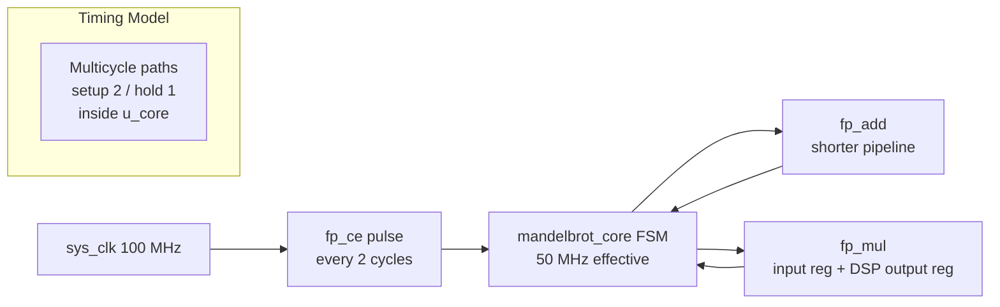
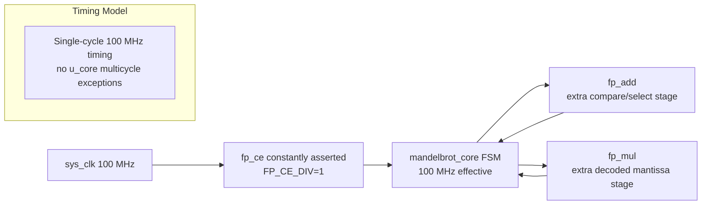

# FP64 100 MHz Pipeline And Performance Report

This report summarizes the move from the previous stable FP64 configuration to the current true 100 MHz FP64 core. It compares the old and new datapath pipelines, timing closure results, and measured board-level performance.

## Configuration Summary

| Item | Previous Stable Config | Current Config |
|---|---:|---:|
| System clock | 100 MHz | 100 MHz |
| FP/core effective rate | 50 MHz | 100 MHz |
| `FP_CE_DIV` | `2` | `1` |
| Core multicycle constraints | setup `2`, hold `1` | none |
| `PIPE_WAIT` | `6` | `9` |
| UART baudrate | 460800 | 460800 |
| FP mode | FP64 | FP64 |

The new core is not a pure 2x speedup because the FP units needed deeper pipelines to meet single-cycle 100 MHz timing. Compute-bound workloads improve by about 1.40x to 1.41x. UART-bound workloads remain capped near 23000 pixels/s.

## Old Pipeline

The previous stable design used a 100 MHz physical clock, but the Mandelbrot core and FP datapath advanced only every second clock via `FP_CE_DIV=2`. Vivado timing was relaxed with multicycle constraints under `u_core`.



### Old Adder Pipeline


The long path combined decode, compare/select, alignment, and add/sub logic in one timing cone. This failed true 100 MHz timing with `WNS=-4.626ns` when `FP_CE_DIV=1` was first attempted.

### Old Multiplier Pipeline


After the adder was cut, the remaining true 100 MHz bottleneck moved to the multiplier DSP cascade and its input path.

## New Pipeline

The current design keeps one 100 MHz clock domain and sets `FP_CE_DIV=1`, so `fp_ce` is constantly asserted. No multicycle exceptions are used.



### New Adder Pipeline


The adder cut separates magnitude selection from alignment and add/sub. This improved the first true 100 MHz attempt from `WNS=-4.626ns` to `WNS=-1.221ns`, moving the critical path to `fp_mul`.

### New Multiplier Pipeline


The multiplier cut removes zero mux and exponent/sign decode logic from the DSP input path. With this change, true 100 MHz routed timing closes.

## Timing Closure

| Build | Config | WNS | TNS | Result |
|---|---|---:|---:|---|
| Old stable | `FP_CE_DIV=2`, multicycle `2/1` | `2.619ns` | `0.000ns` | pass |
| First true 100 MHz attempt | `FP_CE_DIV=1`, no multicycle | `-4.626ns` | `-593.205ns` | fail |
| After adder pipeline cut | `FP_CE_DIV=1`, no multicycle | `-1.221ns` | `-181.374ns` | fail |
| After adder + multiplier cuts | `FP_CE_DIV=1`, no multicycle | `0.258ns` | `0.000ns` | pass |

Current routed timing summary:

| Metric | Value |
|---|---:|
| WNS | `0.258ns` |
| TNS | `0.000ns` |
| Setup failing endpoints | `0` |
| WHS | `0.015ns` |
| THS | `0.000ns` |
| Hold failing endpoints | `0` |

Vivado report result:

```text
All user specified timing constraints are met.
```

## Board Validation

The current 100 MHz bitstream was programmed and tested on board.

| Test | Result |
|---|---|
| `sim_fp.tcl` | pass |
| `sim_core.tcl` | pass |
| `python python\test_esc.py` | pass after transient UART retry |
| `160x120 @256 --verify` | `19200/19200 match` |
| Row compare `y=59, x=0..159` | all points match |
| Row compare `y=0, x=0..159` | `PASS: 160/160 row points match` |

## Performance Summary

### Small And Medium Cases

| Case | Old 50 MHz Time | New 100 MHz Time | Time Speedup | Old pps | New pps | PPS Speedup |
|---|---:|---:|---:|---:|---:|---:|
| `160x120 @128 fast` | `0.849s` | `0.848s` | `1.00x` | `22623.99` | `22629.70` | `1.00x` |
| `160x120 @256 standard` | `4.481s` | `3.198s` | `1.40x` | `4284.48` | `6004.01` | `1.40x` |
| `160x120 @512 standard` | `8.878s` | `6.308s` | `1.41x` | `2162.71` | `3043.71` | `1.41x` |
| `255x255 @64 fast` | `3.395s` | `2.843s` | `1.19x` | `19154.69` | `22872.28` | `1.19x` |
| `320x240 @128 fast` | `3.358s` | `3.357s` | `1.00x` | `22873.22` | `22877.18` | `1.00x` |

### Deep Zoom Cases

| Case | Old 50 MHz Time | New 100 MHz Time | Time Speedup | Old pps | New pps | PPS Speedup |
|---|---:|---:|---:|---:|---:|---:|
| `Tendrils 160x90 @8192` | `4.290s` | `3.048s` | `1.41x` | `3356.47` | `4724.09` | `1.41x` |
| `Mini-brot 160x90 @8192` | `6.881s` | `4.884s` | `1.41x` | `2092.57` | `2948.16` | `1.41x` |
| `Triple spiral 160x90 @8192` | `0.708s` | `0.633s` | `1.12x` | `20346.50` | `22755.72` | `1.12x` |
| `Seahorse 320x180 @4096` | `157.307s` | `111.695s` | `1.41x` | `366.16` | `515.69` | `1.41x` |
| `Seahorse 160x90 @16384` | `178.014s` | `126.392s` | `1.41x` | `80.89` | `113.93` | `1.41x` |
| `Seahorse 80x45 @65535` | `176.200s` | `125.102s` | `1.41x` | `20.43` | `28.78` | `1.41x` |

### 1080p Cases

| Case | Old 50 MHz Time | New 100 MHz Time | Time Speedup | Old pps | New pps | PPS Speedup |
|---|---:|---:|---:|---:|---:|---:|
| `1080p fast escape @128` | `104.666s` | `97.410s` | `1.07x` | `19811.65` | `21287.29` | `1.07x` |
| `1080p standard @64` | `94.546s` | `90.551s` | `1.04x` | `21932.26` | `22899.91` | `1.04x` |
| `1080p Seahorse zoom @512 step=5e-6` | `235.503s` | `173.758s` | `1.36x` | `8804.97` | `11933.83` | `1.36x` |
| `1080p deep triple spiral @8192` | `101.255s` | `90.560s` | `1.12x` | `20479.01` | `22897.40` | `1.12x` |
| `1080p deep tendrils @8192` | `478.776s` | `340.055s` | `1.41x` | `4331.05` | `6097.84` | `1.41x` |
| `1080p deep minibrot @8192` | `1198.049s` | `850.711s` | `1.41x` | `1730.81` | `2437.49` | `1.41x` |
| `1080p deep seahorse @1024` | `511.486s` | `363.254s` | `1.41x` | `4054.07` | `5708.39` | `1.41x` |

## Aggregate Results

| Workload Class | Average Speedup | Limiting Factor |
|---|---:|---|
| Compute-bound small/deep zoom cases | `~1.41x` | FP core throughput |
| 1080p compute-bound/deep zoom cases | `~1.39x` | FP core throughput, with some UART component |
| UART-limited or mixed cases | `~1.08x` | 460800 baud serial transport |

At 460800 baud, the theoretical pixel-output ceiling is:

```text
460800 bits/s / 10 UART bits per byte / 2 bytes per pixel = 23040 pixels/s
```

The fastest measured cases now reach about `22899 pixels/s`, so additional core speed will not improve fast scenes unless UART bandwidth is increased.

## Interpretation

The 100 MHz work succeeded as a timing-closure effort and produces a measurable board-level performance improvement:

- True 100 MHz FP64 core timing now closes without multicycle exceptions.
- Compute-bound Mandelbrot workloads improve consistently by about `1.40x` to `1.41x`.
- UART-bound workloads improve little because output transfer is already saturated.
- The speedup is below `2x` because closing 100 MHz required deeper FP pipelines and `PIPE_WAIT` increased from `6` to `9`.

The next major performance step is not more single-core timing work. It is one of:

1. Improve UART above 460800 baud with oversampling/fractional baud generation.
2. Add multiple Mandelbrot cores for compute-bound deep zooms.
3. Add mathematical fast paths, such as cardioid and period-2 bulb rejection.
