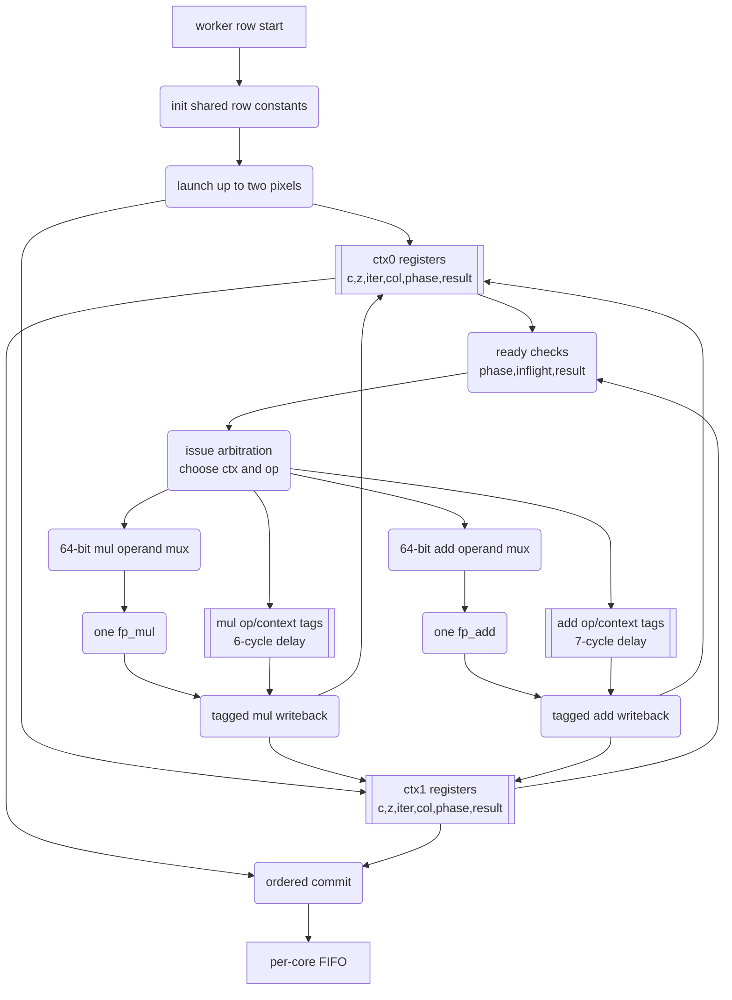
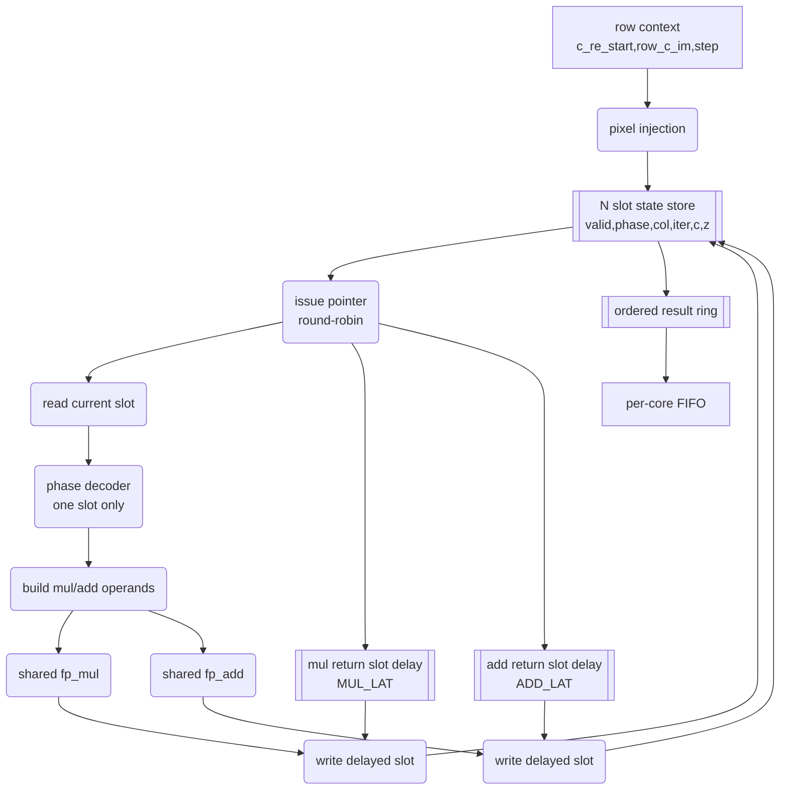

# Compute Pipeline 气泡分析与去气泡可行性

本文是 `PIPELINE_BUBBLE_ANALYSIS.md` 的中文版本，分析当前 worker 的 FP pipeline 气泡、context 数量、ADD/MUL 数量以及 4/8ctx 实验结果。

## 摘要

当前 2-context worker 已证明 tagged multi-context 架构可行，但 FP pipeline 仍未饱和。使用当前 RTL latency `MUL_LAT=6`、`ADD_LAT=7` 重新建模后，结论是：低 context 下增加 ADD 或 MUL 没有收益。下一步应先增加 contexts。第二个 ADD 大约到 16 contexts 才明显有价值；第二个 MUL 在没有更多 ADD 容量时基本无收益。

## 当前实现

| 项目 | 当前值 |
|---|---:|
| FP mode | FP64 |
| System clock | 100 MHz |
| Worker count | 4 |
| Worker contexts | 2 |
| Per worker FP units | 1 multiplier + 1 adder |
| `MUL_LAT` | 6 |
| `ADD_LAT` | 7 |
| UART | 12 Mbaud fractional NCO |
| 可靠输出模式 | host-driven `1920x120` tiled stripes |

## 旧单 context 调度

旧 worker 对每个 FP 操作 issue 后等待 `PIPE_WAIT=10`，等价大约 11 cycle capture 间隔。一个 non-escaping iteration 需要：

```text
3 multiplier issues
5 adder issues
```

旧估算：

```text
cycles_per_iteration ~= 7 * 11 = 77 cycles
```

FP issue 利用率很低：multiplier 约 3.9%，adder 约 6.5%。

## 当前 tagged worker 模型

2ctx worker 不再等待旧 `PIPE_WAIT+1`，而是通过 tag delay line 路由结果：

| Unit | Latency |
|---|---:|
| `fp_mul` | `MUL_LAT=6` |
| `fp_add` | `ADD_LAT=7` |

当前 dependency chain：

```text
full iteration latency ~= 2*MUL_LAT + max(MUL_LAT, ADD_LAT) + 4*ADD_LAT
                       ~= 47 cycles

escape iteration latency ~= 2*MUL_LAT + max(MUL_LAT, ADD_LAT)
                         ~= 19 cycles
```

## Context 数量需求

对 `1M+1A` worker，理想 issue limit 是 5 cycles/iteration，因为一个 iteration 需要 5 个 ADD issue。要隐藏约 47 cycle dependency，需要约 10 个 context，实际还要考虑 branch divergence、refill/drain、ordered commit stall 和 row transition，因此 8-16 contexts 是有意义区间。

| Contexts | Approx cycles/iter | 评价 |
|---:|---:|---|
| 2 | 23.5 | 当前实现，证明点，但未饱和。 |
| 4 | 11.8 | 仍 context-limited。 |
| 8 | 5.9 | 接近 `1M+1A` issue limit。 |
| 12 | 5.0 | 接近饱和。 |
| 16 | 5.0 | 多余 context 主要吸收 stall。 |

## 4/8ctx RTL 部署实验

实现了实验性 `mandelbrot_core_worker_kctx`，当 `WORKER_CONTEXTS=4/8` 时使用。默认 2ctx 仍使用专用 `mandelbrot_core_worker_2ctx`。

| 配置 | 行为仿真 | Slice LUTs | LUT-as-logic | Registers | DSPs | 结果 |
|---|---:|---:|---:|---:|---:|---|
| 2ctx current | board baseline | `13917 / 17600` | `13641 / 17600` | `14458 / 35200` | `37 / 80` | 可部署，timing clean |
| 4ctx generic | PASS, 192 pixels, `445045 ns` | `37350 / 17600` | `36562 / 17600` | `19046 / 35200` | `37 / 80` | FAIL, LUT 超量 |
| 8ctx generic | PASS, 192 pixels, `364705 ns` | `71462 / 17600` | `70674 / 17600` | `29378 / 35200` | `37 / 80` | FAIL, LUT 超量 |

结论：generic K-context 数组式 scoreboard 功能上可行，但在 xc7z010 上不可部署。问题不是 DSP，而是 FP64 context array、wide mux、writeback mux、inflight scan 和 arbitration logic 造成 LUT 爆炸。

## 当前 2ctx RTL 形态

当前 `mandelbrot_core_worker_2ctx` 是 tagged two-entry scoreboard，而不是复制两套 FP datapath。每个 worker 仍只有一个 `fp_mul` 和一个 `fp_add`。额外 LUT 来自两份像素状态、ready arbitration、operation/context tag delay line、result writeback demux 和 ordered commit。



时序上，每次 issue 都同时写入 op tag 和 context tag。`MUL_LAT=6` 后 multiplier result 依据 tag 写回对应 context 和字段；`ADD_LAT=7` 后 adder result 同理。context 可乱序完成，但写 FIFO 前必须按 `commit_col` 顺序提交。

## 规划低 LUT N-context 形态

下一版高 context worker 不应直接扩展当前 scoreboard。更合理方向是 CPU-like barrel/ring pipeline：N 个 slot 保存 N 个像素状态，issue pointer 固定或近似固定轮转，结果按 latency-delayed return pointer 写回固定 slot。



预期时序：

```text
cycle k:     issue slot s phase p
cycle k+1:   issue slot s+1 phase p or another ready phase
cycle k+6:   multiplier result returns to delayed slot s
cycle k+7:   adder result returns to delayed slot s
```

该结构不是消除 N 个像素状态，而是避免每周期扫描所有 context、避免 N 路 FP64 operand mux、避免任意 context writeback demux。它牺牲部分调度自由，换取更低 LUT，是 4/8/12/16 contexts 在 xc7z010 上可部署的更现实方向。

## 当前资源和 timing

| Resource | Used | Device | Utilization |
|---|---:|---:|---:|
| Slice LUTs | 13917 | 17600 | 79.07% |
| LUT as Logic | 13641 | 17600 | 77.51% |
| Slice Registers | 14458 | 35200 | 41.07% |
| DSP48E1 | 37 | 80 | 46.25% |
| Block RAM Tile | 9.5 | 60 | 15.83% |

| WNS | TNS | WHS | THS |
|---:|---:|---:|---:|
| `0.285ns` | `0.000ns` | `0.021ns` | `0.000ns` |

## ADD/MUL 数量分析

一个 non-escaping iteration 需要 3 个 MUL issue 和 5 个 ADD issue。理想 issue limit：

```text
T_issue = max(3 / M, 5 / A)
```

| FP units | Ideal cycles/iter | 结论 |
|---|---:|---|
| 1M + 1A | 5.00 | 当前正确方向是增加 context。 |
| 1M + 2A | 3.00 | 低 context 无收益，约 16ctx 才有价值。 |
| 2M + 1A | 5.00 | ADD 仍是瓶颈，MUL 浪费。 |
| 2M + 2A | 2.50 | DSP-heavy，优先级低。 |

## 12M whole-system 模型

当前 12M host-tiled board 与 2ctx compute-only model 对比：

| Scene | Board pps | Model pps | Board/model | Limiter |
|---|---:|---:|---:|---|
| Fast escape @128 | `428068.64` | `1142934` | `37.5%` | output/host path |
| Standard @64 | `466030.04` | `1061531` | `43.9%` | output/host path |
| Seahorse zoom @512 | `118207.86` | `152317` | `77.6%` | mixed |
| Deep tendrils @8192 | `61080.26` | `73858` | `82.7%` | mostly compute |
| Deep mini-brot @8192 | `24898.89` | `29476` | `84.5%` | compute |
| Deep Seahorse @1024 | `57056.36` | `69102` | `82.6%` | mostly compute |

深场景已经能暴露 compute 改进；fast scenes 仍受 output/host 限制。

## 规划建议

| 优先级 | 工作 | 原因 |
|---:|---|---|
| 1 | 设计低 LUT 4ctx worker | generic kctx LUT 超量，但模型显示 context 是下一步。 |
| 2 | 保持 tagged writeback 和 ordered commit | 正确性依赖 result tag 和行内顺序。 |
| 3 | 继续改善 transport/protocol | fast scenes 仍 output-bound。 |
| 4 | 评估 8ctx/16ctx `1M+1A` | 接近 adder issue limit。 |
| 5 | 高 context 稳定后再加第二 ADD | 2/4/8ctx 下第二 ADD 无收益。 |
| 6 | 最后才考虑第二 MUL | `2M+1A` 模型显示浪费。 |

## 结论

当前 2ctx worker 是正确的去气泡第一步，但还没有填满 FP pipeline。下一步不是增加 FP unit，而是实现低 LUT 的更多 context。Generic 4/8ctx 实验证明了功能方向，也证明了不能用天真的参数化数组结构直接部署在小器件上。
