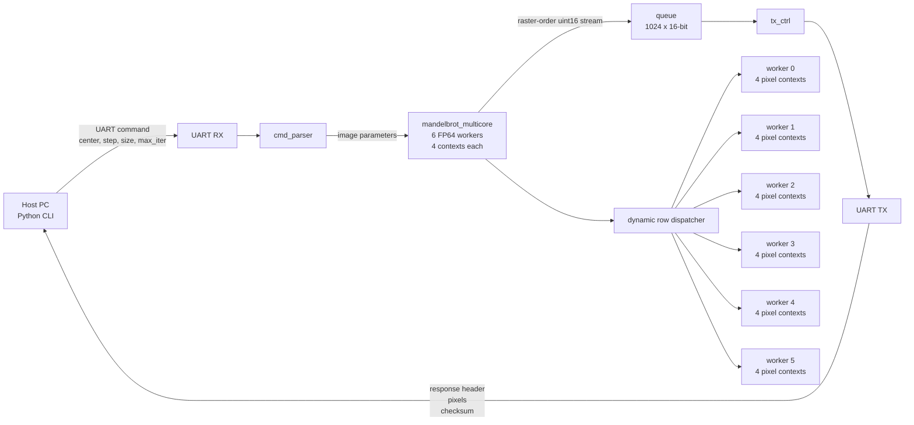
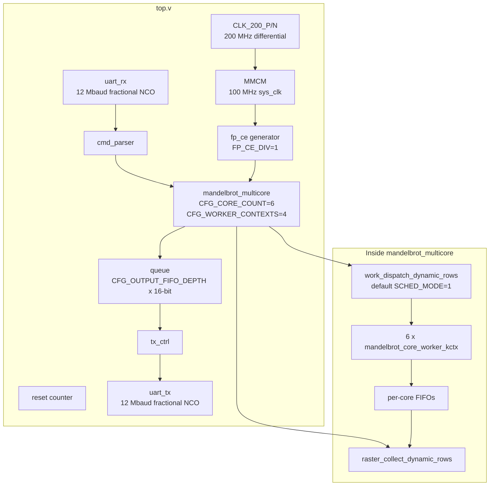
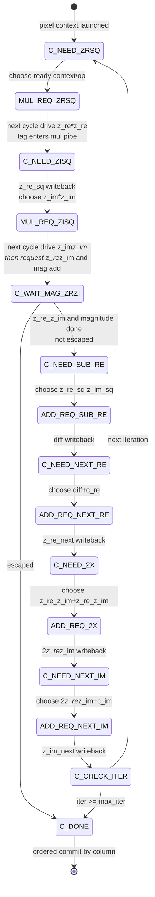
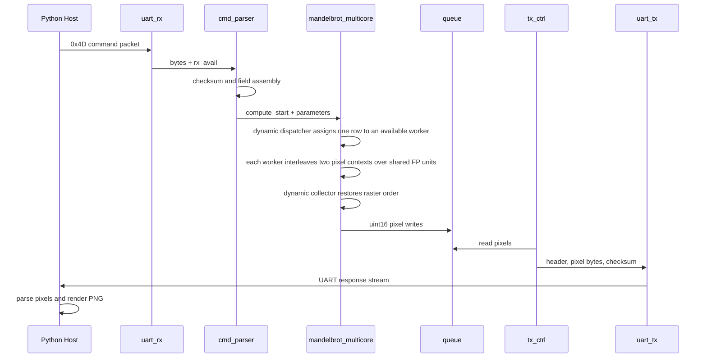

# Mandelbrot FPGA Accelerator

FPGA-based Mandelbrot renderer with a UART host interface. The PC sends one image command containing center, step, maximum iteration count, and dimensions. The FPGA computes pixels with a 6-worker FP64 engine, dynamically assigns rows to available workers, restores raster order, and streams one 16-bit iteration count per pixel. The validated default now uses six workers with four pixel contexts per worker at direct 200 MHz over one shared FP64 multiplier and one shared FP64 adder per worker.

For detailed hardware architecture, pipeline scheduling, timing constraints, software design, and validation notes, see [ARCHITECTURE.md](doc/ARCHITECTURE.md). For the project-level evolution from the initial single-core design to the current dynamic 6-worker, 4-context direct-200MHz implementation, see [ARCHITECTURE_EVOLUTION_REPORT.md](doc/ARCHITECTURE_EVOLUTION_REPORT.md). For worker pipeline bubble analysis and N-context architecture modeling, see [PIPELINE_BUBBLE_ANALYSIS.md](doc/PIPELINE_BUBBLE_ANALYSIS.md) and [CONTEXT_WORKER_ARCHITECTURE_REPORT.md](doc/CONTEXT_WORKER_ARCHITECTURE_REPORT.md). For the direct-200 MHz timing-closure log and validation data, see [200MHZ_ATTEMPT_REPORT.md](doc/200MHZ_ATTEMPT_REPORT.md) and [WORKER_COUNT_SCALING.md](doc/WORKER_COUNT_SCALING.md).

## Demo Images

| Deep Seahorse Valley | Tendrils / Needle |
|---|---|
|  |  |
| `python/hw_1080p_deep_seahorse_i1024_s1e-8.png` | `python/hw_1080p_deep_tendrils_i8192_s1e-9.png` |

Current validated default configuration:

| Item | Value |
|---|---:|
| FPGA target | Xilinx Kintex-7 `xc7k70tfbg676-1` |
| Vivado version used | 2024.2 or compatible |
| Board clock input | 200 MHz differential `CLK_200_P/N` |
| Internal system clock | Direct 200 MHz (`DIRECT_200MHZ=1`) |
| 100 MHz reference build | `build_fp64_100mhz.tcl` |
| Floating-point mode | FP64 |
| Mandelbrot workers | 6 |
| Pixel contexts per worker | 4 |
| Lower-LUT historical worker contexts | 2 |
| Default scheduler | Dynamic idle-core rows (`SCHED_MODE=1`) |
| Worker context generic | `WORKER_CONTEXTS=4` |
| FP datapath effective rate | 200 MHz (`FP_CE_DIV=1`) |
| UART baudrate | 12000000 |
| Host serial port default | `COM9` |
| Pixel format | `uint16` iteration count, little-endian |
| Maximum iteration count | 65535 |
| Largest validated frame | 1920x1080 |
| Current board build status | XC7K70T full FP64 bitstream builds cleanly |
| Programming link | Vivado `hw_server` at `127.0.0.1:3122`, CH347 XVC at `127.0.0.1:2542` |
| Current routed timing | `WNS=0.003ns`, `TNS=0.000ns`, `WHS=0.042ns`, `THS=0.000ns` |
| Current placed utilization | `29891` LUTs, `25501` registers, `97` DSP48E1, `13.5` BRAM tiles |

The default RTL is the 6-worker, 4-context-per-worker configuration on XC7K70T at direct 200 MHz. It builds, programs, meets timing, passes board tests, and is the best validated performance point so far. The older 4-worker direct-200MHz and 100MHz 4ctx builds remain useful references for area and shallow-scene comparisons.

## Repository Layout

```text
Mandelbrot/
├── rtl/                         RTL source files
│   ├── top.v                    Top-level integration
│   ├── mandelbrot_multicore.v   Parameterized worker wrapper, FIFOs, scheduler, collector
│   ├── mandelbrot_core_worker_kctx.v
│   │                              Default 4-context row worker
│   ├── mandelbrot_core_worker_2ctx.v
│   │                              Historical lower-LUT 2-context row worker
│   ├── mandelbrot_core_worker.v Single-context row worker used by regression builds
│   ├── mandelbrot_core.v        Legacy/single-core Mandelbrot FSM and FP scheduling
│   ├── work_dispatch_static_rows.v
│   ├── work_dispatch_dynamic_rows.v
│   ├── raster_merge_static_rows.v
│   ├── raster_collect_dynamic_rows.v
│   ├── fp_add.v                 Parameterized FP adder/subtractor
│   ├── fp_mul.v                 Parameterized FP multiplier
│   ├── config.vh                Central RTL configuration defaults
│   ├── fp_defines.vh            FP64/FP128 parameters and CE divider
│   ├── uart_rx.v                UART receiver
│   ├── uart_tx.v                UART transmitter
│   ├── cmd_parser.v             Host command parser
│   ├── tx_ctrl.v                Response stream controller
│   └── queue.v                  Small synchronous FIFO
├── constraints_hvs_xc7k70t/
│   └── mandelbrot_top.xdc       XC7K70T clock, UART, and LED constraints
├── sim/                         Testbenches
│   ├── tb_fp.v
│   ├── tb_core.v
│   ├── tb_multicore.v
│   ├── tb_multicore_dynamic.v
│   ├── tb_multicore_dynamic_stress.v
│   ├── tb_multicore_static.v
│   └── tb_core_count.v
├── python/                      Host and hardware test scripts
│   ├── mandelbrot_host.py
│   ├── pipeline_2ctx_model.py
│   ├── test_esc.py
│   ├── test_points.py
│   ├── scan_points.py
│   ├── test_random_compare.py
│   ├── uart_raw_probe.py
│   └── uart_listen_raw.py
├── doc/                         Architecture, design, analysis, and TODO documents
│   ├── ARCHITECTURE.md
│   ├── ARCHITECTURE_CN.md
│   ├── ARCHITECTURE_EVOLUTION_REPORT.md
│   ├── ARCHITECTURE_EVOLUTION_REPORT_CN.md
│   ├── PIPELINE_BUBBLE_ANALYSIS.md
│   ├── PIPELINE_BUBBLE_ANALYSIS_CN.md
│   ├── TILE_DESIGN.md
│   ├── TILE_DESIGN_CN.md
│   ├── TODO.md
│   └── TODO_CN.md
├── build_fp64.tcl               Default FP64 build, 6 workers + 4 contexts at direct 200MHz
├── build_fp64_static.tcl        Static scheduler + 1-context regression build
├── build_fp64_dynamic.tcl       Earlier dynamic-scheduler build script
├── build_fp128.tcl              FP128 Vivado build script
├── program.tcl                  JTAG programming script
├── sim_fp.tcl                   FP unit simulation script
├── sim_core.tcl                 Core simulation script
├── sim_multicore.tcl            Default dynamic 2-context simulation script
├── sim_multicore_dynamic.tcl    Dynamic scheduler simulation script
├── sim_multicore_dynamic_stress.tcl
├── sim_multicore_static.tcl
├── sim_worker_2ctx_model.tcl
└── README.md                    Project overview
```

## System Diagram



## RTL Structure



## Scheduler Modes

`mandelbrot_multicore` supports a compile-time `SCHED_MODE` generic:

| `SCHED_MODE` | Dispatcher | Result collector | Status |
|---:|---|---|---|
| `0` | `work_dispatch_static_rows` | `raster_merge_static_rows` | Static regression mode. |
| `1` | `work_dispatch_dynamic_rows` | `raster_collect_dynamic_rows` | Default board mode. |

Static mode assigns interleaved row streams once at frame start. Dynamic mode assigns one full row at a time to the first available core, records the row owner, and drains each row in raster order from the recorded core FIFO. Both modes keep the existing host protocol unchanged.

The dynamic dispatcher also waits until the selected per-core FIFO is empty before assigning another row to that core. This guard prevents a UART-backpressure deadlock where future rows fill a core FIFO while the raster collector waits for an earlier row from the same core.

Worker implementation is selected by the `WORKER_CONTEXTS` generic:

| `WORKER_CONTEXTS` | Worker module | Status |
|---:|---|---|
| `1` | `mandelbrot_core_worker` | Single-context regression worker. |
| `2` | `mandelbrot_core_worker_2ctx` | Historical lower-LUT worker. Interleaves two pixels over one shared multiplier and one shared adder. |
| `4` | `mandelbrot_core_worker_kctx` | Current default on XC7K70T. Interleaves four pixel contexts over one shared multiplier and one shared adder. |
| `8` | `mandelbrot_core_worker_kctx` | Experimental synthesis path; not the validated default. |

## Mandelbrot Core Pipeline

Each worker uses one multiplier and one adder. A worker does not instantiate one FP pipeline per mathematical operation. Instead, it time-multiplexes the FP units with a Mandelbrot iteration scheduler. The default worker keeps four pixel contexts live, so while one pixel is waiting for a delayed FP result, another pixel can issue useful work into the same FP pipelines.



The FP/core datapath advances on `fp_ce`. Current FP64 builds use `FP_CE_DIV=1`, so `fp_ce` is constantly asserted and useful worker operations occur every system-clock cycle. The default build sets `DIRECT_200MHZ=1` and runs the compute/UART domain directly from the 200 MHz board clock. The 100MHz reference build explicitly sets `DIRECT_200MHZ=0` and uses the MMCM-generated 100 MHz `sys_clk`.

The current 4-context worker uses delayed operation/context tags to route FP results back to the correct pixel context. In the direct-200MHz request-sliced path, cycle N selects only `req_op/req_ctx`, cycle N+1 drives the 64-bit FPU operands and inserts the tag, and the validated kctx result tag latencies are `MUL_LAT=6` and `ADD_LAT=9`. The historical 2-context RTL now uses `MUL_LAT=7` and `ADD_LAT=9` after the FP retiming changes. All worker variants commit completed pixels in worker-local column order so the downstream per-core FIFO and raster collector still see ordered row pixels.

## Requirements

### Hardware

- XC7K70T board using `xc7k70tfbg676-1` and the pins in `constraints_hvs_xc7k70t/mandelbrot_top.xdc`.
- JTAG connection served by Vivado Hardware Server at `127.0.0.1:3122`, with the CH347 XVC target at `127.0.0.1:2542`.
- FT232HL UART connection wired to FPGA `uart_rx=J23` and `uart_tx=H24`.
- 200 MHz differential input clock on `CLK_200_P/N`.
- Eight active-high LEDs available as `LED[7:0]`.

Current pin constraints:

| Port | Package pin | I/O standard |
|---|---|---|
| `CLK_200_P` | `AA10` | `LVDS` |
| `CLK_200_N` | `AB10` | `LVDS` |
| `uart_rx` | `J23` | `LVCMOS33` |
| `uart_tx` | `H24` | `LVCMOS33` |
| `LED[0:7]` | `D25,C21,D26,C26,F25,G25,E25,E26` | `LVCMOS33` |

If your board uses different pins, edit `constraints_hvs_xc7k70t/mandelbrot_top.xdc` before building.

### Software

- Windows PowerShell or terminal.
- Xilinx Vivado 2024.2 or compatible version.
- Python 3.
- Python packages:
  - `pyserial`
  - `pillow`

Install Python dependencies:

```bash
python -m pip install pyserial pillow
```

## Initial Configuration

1. Clone or copy the repository.

2. Open a terminal in the project root:

```bash
cd C:\path\to\Mandelbrot
```

3. Confirm Vivado is installed and note your local `vivado` or `vivado.bat` path. Example paths are illustrative only:

```text
C:\Xilinx\Vivado\2024.2\bin\vivado.bat
/opt/Xilinx/Vivado/2024.2/bin/vivado
```

If Vivado is on your PATH, you can use `vivado`. Otherwise, call `vivado.bat` with its full path.

4. Confirm the UART port. The host defaults to `COM9`.

You can override it on every command:

```bash
python python\mandelbrot_host.py --port COM9
```

5. Confirm baudrate. The RTL and Python host currently use `12000000` baud.

Relevant files:

| File | Setting |
|---|---|
| `rtl/uart_rx.v` | `BAUD = 12000000` |
| `rtl/uart_tx.v` | `BAUD = 12000000` |
| `python/mandelbrot_host.py` | `BAUD = 12000000` |

Do not change only one side. The RTL and host must match.

## Configuration

Most RTL defaults are centralized in `rtl/config.vh`. The file uses `ifndef` guards so values can be overridden by Verilog defines in future scripts, and top-level module parameters can still be overridden by Vivado generics.

Current defaults:

| Macro | Default | Used by | Purpose |
|---|---:|---|---|
| `CFG_CLK_HZ` | `100000000` | `uart_rx`, `uart_tx` | System clock used for fractional UART timing. |
| `CFG_UART_BAUD` | `12000000` | `uart_rx`, `uart_tx` | UART baudrate. Must match `python/mandelbrot_host.py` `BAUD`. |
| `CFG_UART_ACC_WIDTH` | `32` | `uart_rx`, `uart_tx` | Fractional baud accumulator width. |
| `CFG_CORE_COUNT` | `6` | `top`, `mandelbrot_multicore` | Number of Mandelbrot workers. |
| `CFG_CORE_FIFO_DEPTH` | `4096` | `top`, `mandelbrot_multicore` | Per-core result FIFO depth. |
| `CFG_OUTPUT_FIFO_DEPTH` | `1024` | `top` | Shared output FIFO depth before `tx_ctrl`. |
| `CFG_SCHED_MODE` | `1` | `top`, `mandelbrot_multicore` | `0` static rows, `1` dynamic idle-core rows. |
| `CFG_DYNAMIC_OWNER_DEPTH` | `4096` | `top`, `mandelbrot_multicore` | Dynamic row-owner table depth. |
| `CFG_WORKER_CONTEXTS` | `4` | `top`, `mandelbrot_multicore` | `1` single-context worker, `2` lower-LUT historical worker, `4` default 4-context worker. |

For the default source build, edit `rtl/config.vh` and keep the Python host in sync when changing UART baud:

```verilog
`define CFG_UART_BAUD 12000000
```

```python
BAUD = 12000000
```

The existing Vivado build scripts intentionally override some top-level parameters for known build modes:

| Script | Overrides | Purpose |
|---|---|---|
| `build_fp64.tcl` | `CLK_HZ=200000000 DIRECT_200MHZ=1 SCHED_MODE=1 DYNAMIC_OWNER_DEPTH=4096 CORE_COUNT=6 WORKER_CONTEXTS=4` | Default FP64 direct-200MHz dynamic 6-worker, 4-context build. |
| `build_fp64_100mhz.tcl` | `CLK_HZ=100000000 DIRECT_200MHZ=0 SCHED_MODE=1 DYNAMIC_OWNER_DEPTH=4096 WORKER_CONTEXTS=4` | 100MHz 4-context reference build. |
| `build_fp64_contexts.tcl` | `SCHED_MODE=1 DYNAMIC_OWNER_DEPTH=4096 WORKER_CONTEXTS=N` | Explicit K-context worker build for comparisons and experiments. |
| `build_fp64_static.tcl` | `SCHED_MODE=0 DYNAMIC_OWNER_DEPTH=4096 WORKER_CONTEXTS=1` | Static scheduler, single-context regression build. |
| `build_fp64_dynamic.tcl` | `SCHED_MODE=1 DYNAMIC_OWNER_DEPTH=4096` | Earlier dynamic scheduler build. |

Those Vivado generics take precedence over the corresponding `CFG_*` defaults for `top` parameters. UART defaults currently come from `config.vh` unless a build script is extended to override them.

## Build

### FP64 Build

`build_fp64.tcl` is the default validated direct-200MHz build. It sets:

```text
CLK_HZ=200000000
DIRECT_200MHZ=1
SCHED_MODE=1
DYNAMIC_OWNER_DEPTH=4096
WORKER_CONTEXTS=4
CORE_COUNT=6
```

Using Vivado on PATH:

```bash
vivado -mode batch -source build_fp64.tcl
```

Using an explicit local install path, replace the example prefix with your Vivado installation directory:

```bash
C:\Xilinx\Vivado\2024.2\bin\vivado.bat -mode batch -source build_fp64.tcl
```

Expected output includes:

```text
BUILD SUCCESSFUL
Bitstream: ./fp64_proj/mandelbrot_fp64.runs/impl_1/top.bit
```

### Explicit Context-Count FP64 Builds

`build_fp64_contexts.tcl` can still build a selected context count explicitly. For example, the current default 4-context configuration can also be built with:

```bash
vivado -mode batch -source build_fp64_contexts.tcl -tclargs 4
```

Expected bitstream:

```text
./fp64_ctx4_proj/mandelbrot_fp64_ctx4.runs/impl_1/top.bit
```

The normal default build is now `build_fp64.tcl`; the explicit context script is kept for controlled comparisons such as `WORKER_CONTEXTS=2` versus `WORKER_CONTEXTS=4`.

### 100MHz FP64 Reference Build

Use this only when you intentionally want the old 100MHz 4-context reference:

```bash
vivado -mode batch -source build_fp64_100mhz.tcl
```

Expected bitstream:

```text
./fp64_100mhz_ctx4_proj/mandelbrot_fp64_100mhz_ctx4.runs/impl_1/top.bit
```

### FP128 Build

FP128 is structurally supported, but most validation has focused on FP64.

```bash
vivado -mode batch -source build_fp128.tcl
```

### Static Regression Build

Use this only when you intentionally want the older static scheduler and single-context worker regression path:

```bash
vivado -mode batch -source build_fp64_static.tcl
```

Expected output includes:

```text
BUILD SUCCESSFUL
Bitstream: ./fp64_static_proj/mandelbrot_fp64_static.runs/impl_1/top.bit
```

## Program The FPGA

After building, program the board:

```bash
vivado -mode batch -source program.tcl
```

Or with an explicit local install path:

```bash
C:\Xilinx\Vivado\2024.2\bin\vivado.bat -mode batch -source program.tcl
```

`program.tcl` connects to Vivado `hw_server` at `127.0.0.1:3122`, opens the CH347 XVC target at `127.0.0.1:2542`, and auto-detects the default FP64 bitstream first, then dynamic/bring-up bitstreams and FP128 if FP64 is not present. To program the static regression build, pass its bitstream explicitly:

```bash
vivado -mode batch -source program.tcl -tclargs ./fp64_static_proj/mandelbrot_fp64_static.runs/impl_1/top.bit
```

Expected output includes:

```text
Programming complete
Done
```

## Smoke Test

Run a quick escape test after programming:

```bash
python python\test_esc.py
```

Expected output:

```text
OK c=(2.5,0) -> iter=1
OK c=(2.6,0) -> iter=1
OK c=(3.0,0) -> iter=1
OK c=(4.1,0) -> iter=1
```

If this times out:

- Confirm the FPGA was programmed after the latest build.
- Confirm the correct COM port is used.
- Confirm no other process is using the serial port.
- Confirm RTL and Python baudrate match.
- Power-cycle or reprogram the board if a previous failed large transfer left the host/board out of sync.

## Render Images

Basic render:

```bash
python python\mandelbrot_host.py --width 160 --height 120 --max-iter 256 --output python\mandelbrot_160x120.png
```

Render with software verification:

```bash
python python\mandelbrot_host.py --verify --width 160 --height 120 --max-iter 256 --output python\verify_160x120.png
```

Fast 1080p transfer-heavy render:

```bash
python python\mandelbrot_host.py --width 1920 --height 1080 --max-iter 128 --center 1.0 1.0 --step 0.002 --timeout 240 --output python\hw_1080p_2ctx_fast_escape_i128_s0p002.png
```

1080p standard Mandelbrot view:

```bash
python python\mandelbrot_host.py --width 1920 --height 1080 --max-iter 64 --center -0.5 0.0 --step 0.002 --timeout 240 --output python\hw_1080p_2ctx_standard_i64_s0p002.png
```

1080p deep zoom example:

```bash
python python\mandelbrot_host.py --width 1920 --height 1080 --max-iter 1024 --center -0.743643887037151 0.13182590420533 --step 1e-8 --timeout 300 --output python\hw_1080p_deep_seahorse_i1024_s1e-8.png
```

## Host CLI Options

```text
--center RE IM       Complex center point. Default: -0.5 0.0
--step S             Pixel step size. Default: 0.005
--max-iter N         Maximum iterations, <= 65535. Default: 256
--width W            Image width. Default: 160
--height H           Image height. Default: 120
--output PATH        Output image/text path. Default: mandelbrot.png
--format FORMAT      png, bmp, or txt. Default: png
--mode MODE          fp64 or fp128. Default: fp64
--verify             Also compute software reference and compare
--port COMx          Serial port. Default: COM9
--timeout SEC        Serial timeout. Default: 180.0
--force-large-frame  Bypass host-side large-frame guards only for matching bitstreams
```

## Useful Test Commands

FP unit simulation:

```bash
vivado -mode batch -source sim_fp.tcl
```

Core simulation:

```bash
vivado -mode batch -source sim_core.tcl
```

Default dynamic 2-context multicore simulation:

```bash
vivado -mode batch -source sim_multicore.tcl
```

Dynamic scheduler simulation:

```bash
vivado -mode batch -source sim_multicore_dynamic.tcl
```

Dynamic 2-context stress simulation:

```bash
vivado -mode batch -source sim_multicore_dynamic_stress.tcl
```

Static 1-context regression simulation:

```bash
vivado -mode batch -source sim_multicore_static.tcl
```

Two-context cycle model:

```bash
vivado -mode batch -source sim_worker_2ctx_model.tcl
```

Random host/reference comparison:

```bash
python python\test_random_compare.py --cases 300 --seed 20260608
```

Single-point hardware query:

```bash
python python\test_points.py --center -0.743643887037151 0.13182590420533 --max-iter 1024
```

## Data Flow Details



## Performance Notes

### Current Recommended Mode: Host-Tiled 12 Mbaud

The current reliable high-baud operating mode is host-driven tiling at 12000000 baud, and the host now enables it by default. If no tile arguments are supplied, the host selects full-width host stripes with a default height of 120 rows, `--tile-retries 3`, and a per-read tile receive timeout of 30 seconds. By default the hardware compute tile is the host tile itself, except the compute width is capped at 4096 columns. With the current soft-reset-on-retry path, a failed large tile is drained, the FPGA is reset with `RST!RST!`, and the same tile is recomputed. The recommended 1080p setting is automatic for a 1920-wide image: `--tile-width 1920 --tile-height 120 --tile-retries 3 --quiet`.

Example:

```bash
python python\mandelbrot_host.py --port COM9 --width 1920 --height 1080 --max-iter 128 --center 1.0 1.0 --step 0.002 --timeout 600 --verify --tile-width 1920 --tile-height 120 --tile-retries 3 --quiet --output python\hw_1080p_hosttile_fast_escape.png
```

Use `--full-frame` only when you intentionally want the older single-command full-frame response path for regression or controlled single-burst experiments.

If a high-baud tile loses bytes, the host may appear idle until the current serial read times out. The default tiled path uses `--tile-read-timeout 30`; lower it for faster retry detection or raise it for very slow/deep tiles.

With `--quiet`, the host now keeps a single-line progress display instead of printing every tile. The format is:

```text
[progress] (n / total compute tile) (m / total host tile) current task
```

On each failed compute tile attempt, the host drains stale UART bytes and sends a soft reset command (`RST!RST!`) unless `--no-soft-reset-on-retry` is set. The reset clears the FPGA command parser, compute engine, output FIFOs, and transmit controller, then the host recomputes only the failed compute tile. You can also issue a reset manually:

```powershell
python python\mandelbrot_host.py --port COM9 --soft-reset
```

Latest default direct-200MHz 6-worker, 4-context 1080p host-tiled stability run at 12 Mbaud with compute tile equal to host tile (`1920x120` for 1080p), 10 fresh runs per scene:

| Scene | Transport pass | Exact SW match | Retry events | Mean FPGA Time | Min | Max | CV | Mean Throughput | vs 100MHz 4ctx |
|---|---:|---:|---:|---:|---:|---:|---:|---:|---:|
| Fast escape @128 | `10/10` | `0/10` | `2` | `4.641s` | `4.423s` | `6.592s` | `14.77%` | `453333.47 pps` | `1.009x` |
| Standard @64 | `10/10` | `10/10` | `2` | `4.636s` | `4.416s` | `5.515s` | `9.92%` | `450824.12 pps` | `1.247x` |
| Seahorse zoom @512 | `10/10` | `0/10` | `2` | `5.715s` | `5.418s` | `6.937s` | `10.87%` | `366227.26 pps` | `1.721x` |
| Deep tendrils @8192 | `10/10` | `0/10` | `1` | `8.567s` | `8.409s` | `9.968s` | `5.75%` | `242675.75 pps` | `2.063x` |
| Deep mini-brot @8192 | `10/10` | `0/10` | `0` | `20.963s` | `20.962s` | `20.965s` | `0.00%` | `98916.27 pps` | `2.106x` |
| Deep Seahorse @1024 | `10/10` | `0/10` | `1` | `9.668s` | `9.511s` | `11.065s` | `5.08%` | `214934.36 pps` | `2.065x` |

The 100 MHz 4-context reference passed a `160x120` software-verified gate at `100.00%` match with `0.091s` FPGA elapsed. The previous 4-worker direct-200MHz bitstream passed the same gate at `100.00%` match with `0.158s` FPGA elapsed. The current default 6-worker direct-200MHz build passed behavioral simulation, timing, programming, and the 10-run hardware benchmark above. The table compares the default 6-worker direct-200MHz 10-run mean against the 100MHz 4ctx measurements (`4.683/5.782/9.836/17.677/44.146/19.965s`).

Major historical performance points are summarized below for context. Rows are not all the same test campaign: older rows are representative historical measurements, while the final 6-worker direct-200MHz row is the latest 10-run mean. Use this table to understand architecture progression; use the current benchmark table above for the validated default result.

| Version / mode | Test setup | Fast escape @128 | Standard @64 | Seahorse @512 | Deep mini-brot @8192 |
|---|---|---:|---:|---:|---:|
| Historical 576k, 4-worker 1ctx | UART-bound baseline | `72.736s` | `72.735s` | `74.265s` | `234.231s` |
| 12M single-burst, 4-worker 2ctx | High baud, monolithic response | `4.678s` | `4.202s` | `17.280s` | `83.428s` |
| 12M tiled, 2ctx host tile = compute tile | Previous default, `1920x120` at 1080p | `5.127s` | `4.731s` | `19.440s` | `83.561s` |
| 12M tiled, 4ctx 100MHz host tile = compute tile | 100MHz reference, `1920x120` at 1080p | `4.683s` | `5.782s` | `9.836s` | `44.146s` |
| 12M tiled, 4-worker 4ctx direct 200MHz host tile = compute tile | Previous default, 10-run mean | `5.072s` | `5.066s` | `7.879s` | `31.625s` |
| 12M tiled, 6-worker 4ctx direct 200MHz host tile = compute tile | Current default, timing-fixed 10-run mean | `4.641s` | `4.636s` | `5.715s` | `20.963s` |

The current 6-worker direct-200MHz default is the best validated point in the measured matrix. It improves the previous 4-worker direct-200MHz default by about `1.09x` on fast escape and about `1.38x-1.51x` on compute-heavy scenes. The 100MHz 4ctx build remains available as an explicit reference through `build_fp64_100mhz.tcl`. Detailed history and caveats are in [ARCHITECTURE_EVOLUTION_REPORT.md](doc/ARCHITECTURE_EVOLUTION_REPORT.md) and [WORKER_COUNT_SCALING.md](doc/WORKER_COUNT_SCALING.md).

The 4096x4096 default host-tiled path was also checked at RTL packetizer level. The simulation splits the logical image into 35 hardware responses, verifies 262144 `TD` packets and 16777216 pixels, and passes checksum and frame-boundary checks. This validates packet/count/tail behavior for the current host tiling geometry; it does not replace board-level USB-UART soak testing.

### Host Tile Size Comparison

The host tile size matrix below was measured on the historical 100MHz FP64 dynamic 2-context build at 12 Mbaud, before the current 4ctx default and before the direct-200MHz 10-run benchmark. It is kept as host-tile geometry data, not as a current bitstream performance comparison. The matrix uses one run per scene/tile-size and disables software verification so it measures FPGA/transport elapsed time. Detailed design notes and logs are in [TILE_DESIGN.md](doc/TILE_DESIGN.md), [TILE_DESIGN_CN.md](doc/TILE_DESIGN_CN.md), and `python/host_tile_size_matrix/`.

| Scene | `80x60` | `320x120` | `960x120` | `1920x120` | `1920x240` |
|---|---:|---:|---:|---:|---:|
| Fast escape @128 | `13.433s` | `6.992s` | `5.597s` | `4.845s` | `4.759s` |
| Standard @64 | `12.977s` | `6.491s` | `4.641s` | `5.450s` | `4.355s` |
| Seahorse zoom @512 | `24.975s` | `18.605s` | `17.231s` | `17.085s` | `16.951s` |
| Deep tendrils @8192 | `40.828s` | `33.966s` | `33.355s` | `37.524s` | `33.077s` |
| Deep mini-brot @8192 | `91.297s` | `84.214s` | `83.505s` | `83.280s` | `83.179s` |
| Deep Seahorse @1024 | `44.215s` | `37.236s` | `36.534s` | `36.340s` | `36.243s` |

Host tiles per 1080p frame are 432 for `80x60`, 54 for `320x120`, 18 for `960x120`, 9 for `1920x120`, and 5 for `1920x240`. `80x60` is reliable but slow because the command count exposes fixed host/protocol overhead. `960x120` and `1920x120` are the practical high-throughput range. `1920x240` was fastest in the one-run matrix, but it has a larger retry unit and less repeat data than `1920x120`, so `1920x120` remains the recommended default.

### Baudrate Investigation

The UART now uses a 32-bit fractional baud accumulator in both RX and TX. `BAUD=12000000` is the experimental source default and has completed the six 1080p scenes after targeted reprobes. `8000000` remains the safer high-baud fallback from the first full six-scene sweep, while `576000` remains the conservative historical baseline. At 12 Mbaud, occasional byte loss was observed during multi-megabyte bursts. Host-driven tiling provides a practical retry boundary today, but long soak tests are still recommended before relying on 12 Mbaud unattended.

Detailed reports: [UART_BAUDRATE_INVESTIGATION.md](doc/UART_BAUDRATE_INVESTIGATION.md), [UART_TIMING_ANALYSIS.md](doc/UART_TIMING_ANALYSIS.md).

### HW/SW Boundary Differences

The FPGA FP64 engine uses truncation-rounding (round-toward-zero) while the Python software reference uses IEEE 754 round-to-nearest-even. This causes small pixel-level differences near the Mandelbrot set boundary where chaotic dynamics amplify sub-ULP errors across iterations. These differences are not a bug and do not affect visual image quality.

Detailed report: [FP64_BOUNDARY_DIFFERENCE_ANALYSIS.md](doc/FP64_BOUNDARY_DIFFERENCE_ANALYSIS.md).

Current XC7K70T direct-200MHz FP64 routed timing is signed off with no core multicycle exceptions:

| Build | Scheduler | Workers | Worker contexts | WNS | TNS | WHS | THS |
|---|---|---:|---:|---:|---:|---:|---:|
| `build_fp64.tcl` on `xc7k70tfbg676-1` | Dynamic idle-core rows + tiled response | 6 | 4 | `0.003ns` | `0.000ns` | `0.042ns` | `0.000ns` |

Latest routed utilization for the XC7K70T default direct-200MHz 6-worker, 4ctx build:

| Resource | Used | Device | Utilization |
|---|---:|---:|---:|
| Slice LUTs | 29891 | 41000 | 72.90% |
| Slice Registers | 25501 | 82000 | 31.10% |
| DSP48E1 | 97 | 240 | 40.42% |
| Block RAM Tile | 13.5 | 135 | 10.00% |

The default direct-200MHz datapath is now the validated 6-worker, 4ctx performance point. It meets timing at `WNS=0.003ns`, `TNS=0.000ns`, `WHS=0.042ns`, `THS=0.000ns`, and completed the 10-run six-scene benchmark above. Historical resource, timing, and performance comparisons are tracked in [ARCHITECTURE_EVOLUTION_REPORT.md](doc/ARCHITECTURE_EVOLUTION_REPORT.md); direct-200MHz closure details are in [200MHZ_ATTEMPT_REPORT.md](doc/200MHZ_ATTEMPT_REPORT.md), and worker-count scaling details are in [WORKER_COUNT_SCALING.md](doc/WORKER_COUNT_SCALING.md).

## Troubleshooting

### Serial Port Access Denied

Only one process can open the selected serial port at a time. Close serial terminals and avoid running multiple host scripts concurrently.

### Timeout With No Header

Common causes:

- FPGA is not programmed with the matching bitstream.
- Host baudrate differs from RTL baudrate.
- Wrong serial port.
- Board needs reprogramming after a failed test.
- `test_esc.py` or another process still owns the port.

### Bad Or Incomplete Image

Check that you are using the current `tx_ctrl.v` with explicit 32-bit pixel count:

```verilog
wire [31:0] total_pixels = {16'd0, rows} * {16'd0, cols};
```

Without this fix, frames larger than 65535 pixels can fail.

### Very Large Frames Stop Around 536862720 Bytes

The default bitstream uses dynamic row scheduling with `DYNAMIC_OWNER_DEPTH=4096`. Frames taller than 4096 rows are not supported by that default dynamic collector, because row ownership is only recorded for the first 4096 rows. A `65535x65535` command will therefore receive exactly about:

```text
4096 rows * 65535 cols * 2 bytes/pixel = 536862720 bytes
```

and then stall when raster collection reaches an unrecorded row. That frame is also impractical over UART: `65535 * 65535 * 2` pixel bytes takes roughly 2 hours at 12 Mbaud, before rendering or software verification.

Use host tiling, a smaller frame, rebuild with a larger dynamic owner table, or use a compatible static/streaming design. The host now uses tiled requests by default, so the 4096-row owner-depth limit applies to each hardware tile command rather than the logical full image. `--full-frame` restores the older single-command path, where a frame taller than 4096 rows can still stall unless the bitstream is rebuilt. `--force-large-frame` only bypasses host-side guards and should be used only when the programmed bitstream and host memory can support the request.

### Software Verification Is Slow

`--verify` computes a Python reference image. Use it for small or medium frames. Avoid it for 1080p high-iteration renders unless you intentionally want a long software comparison.

## More Documentation

For detailed hardware architecture, pipeline scheduling, timing constraints, and validation notes, see:

```text
doc/ARCHITECTURE.md
doc/ARCHITECTURE_CN.md
doc/ARCHITECTURE_EVOLUTION_REPORT.md
doc/ARCHITECTURE_EVOLUTION_REPORT_CN.md
doc/TILE_DESIGN.md
doc/TILE_DESIGN_CN.md
doc/PIPELINE_BUBBLE_ANALYSIS.md
doc/PIPELINE_BUBBLE_ANALYSIS_CN.md
doc/CONTEXT_WORKER_ARCHITECTURE_REPORT.md
doc/CONTEXT_WORKER_ARCHITECTURE_REPORT_CN.md
doc/PERFORMANCE_100MHZ.md
doc/PERFORMANCE_100MHZ_CN.md
doc/UART_BAUDRATE_BENCHMARK.md
doc/UART_BAUDRATE_BENCHMARK_CN.md
doc/UART_BAUDRATE_INVESTIGATION.md
doc/UART_BAUDRATE_INVESTIGATION_CN.md
doc/UART_TIMING_ANALYSIS.md
doc/UART_TIMING_ANALYSIS_CN.md
doc/FP64_BOUNDARY_DIFFERENCE_ANALYSIS.md
doc/FP64_BOUNDARY_DIFFERENCE_ANALYSIS_CN.md
doc/MULTICORE_FEASIBILITY.md
doc/MULTICORE_FEASIBILITY_CN.md
doc/MULTICORE_4CORE_ARCHITECTURE.md
doc/MULTICORE_4CORE_ARCHITECTURE_CN.md
doc/DYNAMIC_IDLE_CORE_SCHEDULING.md
doc/DYNAMIC_IDLE_CORE_SCHEDULING_CN.md
doc/DESIGN.md
doc/DESIGN_CN.md
doc/TODO.md
doc/TODO_CN.md
```

## License

This project is released under the MIT License unless otherwise stated. You may use, modify, and distribute the RTL, scripts, and documentation under the terms of the MIT License.

If you redistribute this project, keep the license notice and clearly mark any substantial modifications.

## Software And LLM Assistance Disclosure

This project was developed with software and AI-assisted engineering tools, including:

- OpenCode for code editing, repository operations, and project automation.
- DeepSeek v4 Pro for AI-assisted reasoning and implementation support.
- GPT 5.5 for AI-assisted reasoning, documentation, debugging, and implementation support.

All generated code, documentation, hardware behavior, timing closure, and board-level validation remain the responsibility of the project maintainer. The included RTL and scripts should be reviewed and tested for any target board or deployment environment.
