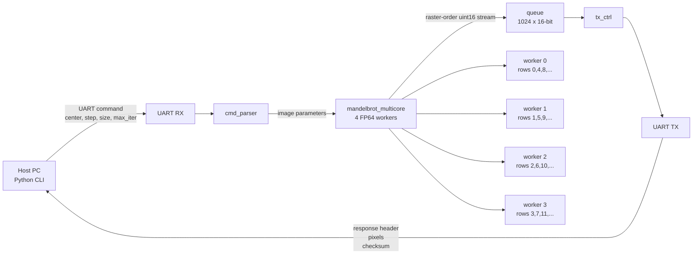
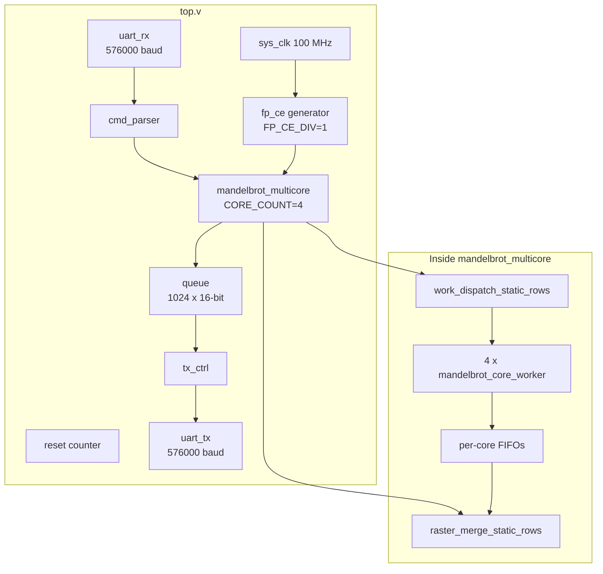
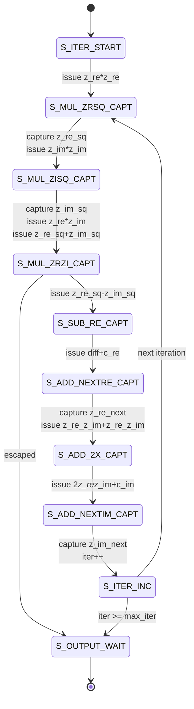
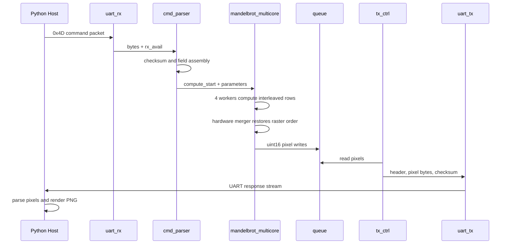

# Mandelbrot FPGA Accelerator

FPGA-based Mandelbrot renderer with a UART host interface. The PC sends one image command containing center, step, maximum iteration count, and dimensions. The FPGA computes pixels with a 4-core FP64 engine, merges results back into raster order, and streams one 16-bit iteration count per pixel. The host renders the result to PNG or text and can optionally compare against a software reference.

For detailed hardware architecture, pipeline scheduling, timing constraints, software design, and validation notes, see [ARCHITECTURE.md](ARCHITECTURE.md). For the project-level evolution from the initial single-core design to the current 4-core implementation, see [ARCHITECTURE_EVOLUTION_REPORT.md](ARCHITECTURE_EVOLUTION_REPORT.md).

## Demo Images

| Deep Seahorse Valley | Tendrils / Needle |
|---|---|
|  |  |
| `python/hw_1080p_deep_seahorse_i1024_s1e-8.png` | `python/hw_1080p_deep_tendrils_i8192_s1e-9.png` |

Current validated default configuration:

| Item | Value |
|---|---:|
| FPGA target | Xilinx Zynq-7010, `xc7z010clg400-1` |
| Vivado version used | 2020.2 |
| System clock | 100 MHz |
| Floating-point mode | FP64 |
| Compute cores | 4 |
| Core effective rate | 100 MHz per core (`FP_CE_DIV=1`) |
| UART baudrate | 576000 |
| Host serial port default | `COM4` |
| Pixel format | `uint16` iteration count, little-endian |
| Maximum iteration count | 65535 |
| Largest validated frame | 1920x1080 |

## Repository Layout

```text
Mandelbrot/
├── rtl/                         RTL source files
│   ├── top.v                    Top-level integration
│   ├── mandelbrot_multicore.v   4-core wrapper, worker FIFOs, scheduler, merger
│   ├── mandelbrot_core_worker.v Row-start/stride worker core
│   ├── mandelbrot_core.v        Legacy/single-core Mandelbrot FSM and FP scheduling
│   ├── work_dispatch_static_rows.v
│   ├── raster_merge_static_rows.v
│   ├── fp_add.v                 Parameterized FP adder/subtractor
│   ├── fp_mul.v                 Parameterized FP multiplier
│   ├── fp_defines.vh            FP64/FP128 parameters and CE divider
│   ├── uart_rx.v                UART receiver
│   ├── uart_tx.v                UART transmitter
│   ├── cmd_parser.v             Host command parser
│   ├── tx_ctrl.v                Response stream controller
│   └── queue.v                  Small synchronous FIFO
├── constraints/
│   └── constraint.xdc           Clock and pin constraints
├── sim/                         Testbenches
│   ├── tb_fp.v
│   ├── tb_core.v
│   ├── tb_multicore.v
│   └── tb_core_count.v
├── python/                      Host and hardware test scripts
│   ├── mandelbrot_host.py
│   ├── test_esc.py
│   ├── test_points.py
│   ├── scan_points.py
│   ├── test_random_compare.py
│   ├── uart_raw_probe.py
│   └── uart_listen_raw.py
├── build_fp64.tcl               FP64 Vivado build script
├── build_fp128.tcl              FP128 Vivado build script
├── program.tcl                  JTAG programming script
├── sim_fp.tcl                   FP unit simulation script
├── sim_core.tcl                 Core simulation script
├── sim_multicore.tcl            4-core raster-order simulation script
├── ARCHITECTURE.md              Detailed architecture document
├── ARCHITECTURE_EVOLUTION_REPORT.md
├── MULTICORE_4CORE_ARCHITECTURE.md
├── PERFORMANCE_100MHZ.md
├── UART_BAUDRATE_BENCHMARK.md
├── UART_BAUDRATE_INVESTIGATION.md
├── UART_TIMING_ANALYSIS.md
├── FP64_BOUNDARY_DIFFERENCE_ANALYSIS.md
├── MULTICORE_FEASIBILITY.md
└── DESIGN.md                    Original design notes
```

## System Diagram



## RTL Structure



## Mandelbrot Core Pipeline

Each worker uses one multiplier and one adder. A worker does not instantiate one FP pipeline per mathematical operation. Instead, it time-multiplexes the FP units with an FSM and waits for registered FP results. The top-level accelerator instantiates four workers and assigns rows in a static interleaved pattern.



The FP/core datapath advances on `fp_ce`. Current FP64 builds use `FP_CE_DIV=1`, so `fp_ce` is constantly asserted and useful worker operations occur every 100 MHz cycle. The FP adder and multiplier are pipelined deeply enough that no core multicycle timing exceptions are required.

## Requirements

### Hardware

- Xilinx Zynq-7010 board matching the pins in `constraints/constraint.xdc`.
- JTAG connection supported by Vivado Hardware Manager.
- UART connection to the FPGA UART pins.
- 100 MHz input clock on `sys_clk`.

Current pin constraints:

| Port | Package pin | I/O standard |
|---|---|---|
| `sys_clk` | `N18` | `LVCMOS33` |
| `uart_rx` | `U20` | `LVCMOS33` |
| `uart_tx` | `V20` | `LVCMOS33` |

If your board uses different pins, edit `constraints/constraint.xdc` before building.

### Software

- Windows PowerShell or terminal.
- Xilinx Vivado 2020.2 or compatible version.
- Python 3.
- Python packages:
  - `pyserial`
  - `pillow`

Install Python dependencies:

```bash
python -m pip install pyserial pillow
```

## Initial Configuration

1. Clone or copy the repository.

2. Open a terminal in the project root:

```bash
cd C:\path\to\Mandelbrot
```

3. Confirm Vivado is installed. For example:

```text
C:\Xilinx\Vivado\2020.2\bin\vivado.bat
```

If Vivado is on your PATH, you can use `vivado`. Otherwise, call `vivado.bat` with its full path.

4. Confirm the UART port. The host defaults to `COM4`.

You can override it on every command:

```bash
python python\mandelbrot_host.py --port COM5
```

5. Confirm baudrate. The RTL and Python host currently use `576000` baud.

Relevant files:

| File | Setting |
|---|---|
| `rtl/uart_rx.v` | `CLOCKS_PER_BIT = 174` |
| `rtl/uart_tx.v` | `CLOCKS_PER_BIT = 174` |
| `python/mandelbrot_host.py` | `BAUD = 576000` |

Do not change only one side. The RTL and host must match.

## Build

### FP64 Build

Using Vivado on PATH:

```bash
vivado -mode batch -source build_fp64.tcl
```

Using the known installed path:

```bash
C:\Xilinx\Vivado\2020.2\bin\vivado.bat -mode batch -source build_fp64.tcl
```

Expected output includes:

```text
BUILD SUCCESSFUL
Bitstream: ./fp64_proj/mandelbrot_fp64.runs/impl_1/top.bit
```

### FP128 Build

FP128 is structurally supported, but most validation has focused on FP64.

```bash
vivado -mode batch -source build_fp128.tcl
```

## Program The FPGA

After building, program the board:

```bash
vivado -mode batch -source program.tcl
```

Or with the full Vivado path:

```bash
C:\Xilinx\Vivado\2020.2\bin\vivado.bat -mode batch -source program.tcl
```

`program.tcl` auto-detects the latest FP64 bitstream first, then FP128 if FP64 is not present.

Expected output includes:

```text
Programming complete
Done
```

## Smoke Test

Run a quick escape test after programming:

```bash
python python\test_esc.py
```

Expected output:

```text
OK c=(2.5,0) -> iter=1
OK c=(2.6,0) -> iter=1
OK c=(3.0,0) -> iter=1
OK c=(4.1,0) -> iter=1
```

If this times out:

- Confirm the FPGA was programmed after the latest build.
- Confirm the correct COM port is used.
- Confirm no other process is using the serial port.
- Confirm RTL and Python baudrate match.
- Power-cycle or reprogram the board if a previous failed large transfer left the host/board out of sync.

## Render Images

Basic render:

```bash
python python\mandelbrot_host.py --width 160 --height 120 --max-iter 256 --output python\mandelbrot_160x120.png
```

Render with software verification:

```bash
python python\mandelbrot_host.py --verify --width 160 --height 120 --max-iter 256 --output python\verify_160x120.png
```

Fast 1080p transfer-heavy render:

```bash
python python\mandelbrot_host.py --width 1920 --height 1080 --max-iter 128 --center 1.0 1.0 --step 0.002 --timeout 600 --output python\hw_1080p_fast_escape.png
```

1080p standard Mandelbrot view:

```bash
python python\mandelbrot_host.py --width 1920 --height 1080 --max-iter 64 --center -0.5 0.0 --step 0.002 --timeout 1200 --output python\hw_1080p_standard.png
```

1080p deep zoom example:

```bash
python python\mandelbrot_host.py --width 1920 --height 1080 --max-iter 1024 --center -0.743643887037151 0.13182590420533 --step 0.00000001 --timeout 2400 --output python\hw_1080p_deep_seahorse.png
```

## Host CLI Options

```text
--center RE IM       Complex center point. Default: -0.5 0.0
--step S             Pixel step size. Default: 0.005
--max-iter N         Maximum iterations, <= 65535. Default: 256
--width W            Image width. Default: 160
--height H           Image height. Default: 120
--output PATH        Output image/text path. Default: mandelbrot.png
--format FORMAT      png, bmp, or txt. Default: png
--mode MODE          fp64 or fp128. Default: fp64
--verify             Also compute software reference and compare
--port COMx          Serial port. Default: COM4
--timeout SEC        Serial timeout. Default: 180.0
```

## Useful Test Commands

FP unit simulation:

```bash
vivado -mode batch -source sim_fp.tcl
```

Core simulation:

```bash
vivado -mode batch -source sim_core.tcl
```

4-core raster-order simulation:

```bash
vivado -mode batch -source sim_multicore.tcl
```

Random host/reference comparison:

```bash
python python\test_random_compare.py --cases 300 --seed 20260608
```

Single-point hardware query:

```bash
python python\test_points.py --center -0.743643887037151 0.13182590420533 --max-iter 1024
```

## Data Flow Details



## Performance Notes

At 576000 baud, the UART ceiling is approximately:

```text
576000 bits/s / 10 bits per UART byte / 2 bytes per pixel = 28800 pixels/s
```

Measured current 4-core examples (576000 baud):

| Case | Center | Step | Max Iter | FPGA Time | Throughput |
|---:|---:|---:|---:|---:|
| `160x120`, standard | `(-0.5, 0.0)` | `0.005` | `256` | `0.896s` | `21432.32 pps` |
| `1920x1080`, standard | `(-0.5, 0.0)` | `0.002` | `64` | `72.735s` | `28508.82 pps` |
| `1920x1080`, Seahorse zoom | `(-0.743643887037151, 0.13182590420533)` | `5e-6` | `512` | `74.265s` | `27921.47 pps` |
| `1920x1080`, deep Seahorse | `(-0.743643887037151, 0.13182590420533)` | `1e-8` | `1024` | `100.658s` | `20600.46 pps` |

Fast scenes are UART-limited. Deep zoom/high-iteration scenes benefit from 4 cores until aggregate compute throughput approaches the UART ceiling.

### Baudrate Investigation

Higher baudrates were tested with a 100 MHz integer divider and a TX-only isolation experiment. The failure boundary above 520000 baud is primarily caused by the single-sample UART RX lacking oversampling, combined with CP2102 baud-rate quantisation error at non-standard rates. 576000 baud (a common PC standard rate) works stably and provides a ~15% throughput improvement over 500000 baud.

Detailed reports: [UART_BAUDRATE_INVESTIGATION.md](UART_BAUDRATE_INVESTIGATION.md), [UART_TIMING_ANALYSIS.md](UART_TIMING_ANALYSIS.md).

### HW/SW Boundary Differences

The FPGA FP64 engine uses truncation-rounding (round-toward-zero) while the Python software reference uses IEEE 754 round-to-nearest-even. This causes small pixel-level differences near the Mandelbrot set boundary where chaotic dynamics amplify sub-ULP errors across iterations. These differences are not a bug and do not affect visual image quality.

Detailed report: [FP64_BOUNDARY_DIFFERENCE_ANALYSIS.md](FP64_BOUNDARY_DIFFERENCE_ANALYSIS.md).

Current 4-core 100 MHz FP64 routed timing is signed off with `WNS=0.224ns`, `TNS=0.000ns`, `WHS=0.005ns`, and no multicycle exceptions.

## Troubleshooting

### Serial Port Access Denied

Only one process can open `COM4` at a time. Close serial terminals and avoid running multiple host scripts concurrently.

### Timeout With No Header

Common causes:

- FPGA is not programmed with the matching bitstream.
- Host baudrate differs from RTL baudrate.
- Wrong serial port.
- Board needs reprogramming after a failed test.
- `test_esc.py` or another process still owns the port.

### Bad Or Incomplete Image

Check that you are using the current `tx_ctrl.v` with explicit 32-bit pixel count:

```verilog
wire [31:0] total_pixels = {16'd0, rows} * {16'd0, cols};
```

Without this fix, frames larger than 65535 pixels can fail.

### Software Verification Is Slow

`--verify` computes a Python reference image. Use it for small or medium frames. Avoid it for 1080p high-iteration renders unless you intentionally want a long software comparison.

## More Documentation

For detailed hardware architecture, pipeline scheduling, timing constraints, and validation notes, see:

```text
ARCHITECTURE.md
ARCHITECTURE_EVOLUTION_REPORT.md
PERFORMANCE_100MHZ.md
UART_BAUDRATE_BENCHMARK.md
UART_BAUDRATE_INVESTIGATION.md
UART_TIMING_ANALYSIS.md
FP64_BOUNDARY_DIFFERENCE_ANALYSIS.md
MULTICORE_FEASIBILITY.md
MULTICORE_4CORE_ARCHITECTURE.md
```

## License

This project is released under the MIT License unless otherwise stated. You may use, modify, and distribute the RTL, scripts, and documentation under the terms of the MIT License.

If you redistribute this project, keep the license notice and clearly mark any substantial modifications.

## Software And LLM Assistance Disclosure

This project was developed with software and AI-assisted engineering tools, including:

- OpenCode for code editing, repository operations, and project automation.
- DeepSeek v4 Pro for AI-assisted reasoning and implementation support.
- GPT 5.5 for AI-assisted reasoning, documentation, debugging, and implementation support.

All generated code, documentation, hardware behavior, timing closure, and board-level validation remain the responsibility of the project maintainer. The included RTL and scripts should be reviewed and tested for any target board or deployment environment.
