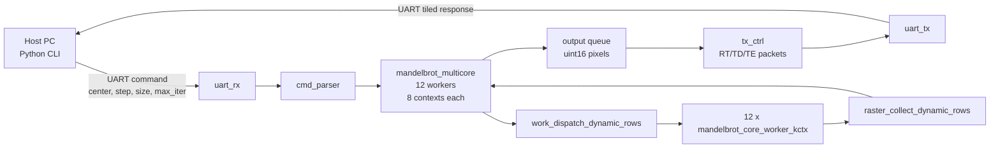

# Mandelbrot FPGA Accelerator

UART-controlled FPGA Mandelbrot renderer. The current validated target is VMC_RTSB ZU4EV with a single-ended `24.576 MHz` system clock. The accepted build uses 12 FP64 workers, 8 in-flight pixel contexts per worker, dynamic row scheduling, and a `6.144 Mbaud` FT232HL UART link with a `50 us` host command byte gap.

Current architecture and validation details are in [doc/ARCHITECTURE.md](doc/ARCHITECTURE.md). The optimization log for this board/clock is [doc/VMC_RTSB_ZU4EV_24576_OPT_REPORT.md](doc/VMC_RTSB_ZU4EV_24576_OPT_REPORT.md). Historical evolution from the earlier boards and clocking points is in [doc/ARCHITECTURE_EVOLUTION_REPORT.md](doc/ARCHITECTURE_EVOLUTION_REPORT.md).

## Demo Images

These are FPGA-generated 1080p outputs from the project history. They remain useful visual smoke tests because they exercise different regions of the Mandelbrot set: one mixed/deep valley scene and one high-iteration tendril scene.

| Deep Seahorse Valley | Deep Tendrils / Needle |
|---|---|
|  |  |
| `python/hw_1080p_deep_seahorse_i1024_s1e-8.png` | `python/hw_1080p_deep_tendrils_i8192_s1e-9.png` |

## Current Validated Configuration

| Item | Value |
|---|---:|
| FPGA target | `xczu4ev-sfvc784-1-i` |
| Board | VMC_RTSB ZU4EV |
| Clock | Single-ended `sys_clk`, `24.576 MHz` |
| Constraint file | `constraints_vmc_rtsb_zu4ev/led.xdc` |
| UART pins | FPGA RX `D12`, FPGA TX `C12` |
| UART baud | `6,144,000` |
| Host command byte gap | `0.00005 s` |
| Host serial default | `COM6` |
| Floating point | FP64 |
| Workers | `12` |
| Contexts per worker | `8` |
| Scheduler | Dynamic idle-core rows |
| Worker FPU tag latency | `MUL_LAT=6`, `ADD_LAT=9` |
| Largest validated frame | `1920x1080` |
| Final 6-scene result | `6/6 PASS`, `0` retries |

Accepted bitstream path after `build_fp64.tcl`:

```text
fp64_zu4ev_proj/mandelbrot_fp64.runs/impl_1/top.bit
```

## Architecture Overview

The FPGA is a streaming accelerator rather than a framebuffer renderer. The host sends one command per image or tile. The FPGA computes pixels and streams iteration counts back immediately; it does not store a full 1080p frame on chip.



The important architectural choices are:

| Area | Current design | Reason |
|---|---|---|
| Clocking | One `24.576 MHz` `sys_clk` domain | Avoids CDC between UART, parser, compute, FIFOs, and TX. |
| Worker shape | 12 workers, 8 contexts per worker | Best validated ZU4EV low-clock performance point. |
| FP units | One FP64 multiplier and one FP64 adder per worker | Shares expensive FP pipelines while contexts hide latency. |
| Scheduling | Dynamic row dispatch to idle workers | Balances rows while preserving a simple raster-order host protocol. |
| Output ordering | Per-worker FIFOs plus raster collector | Host receives ordinary row-major pixels even though rows are computed dynamically. |
| Transport | UART tiled response `RT` / `TD` / `TE` | Provides packet boundaries and host retry points for large frames. |

Each `mandelbrot_core_worker_kctx` keeps multiple pixels live at once. While one pixel waits for a delayed FP result, another context can issue useful work into the shared multiplier or adder. The accepted FPU result-tag alignment is `MUL_LAT=6` and `ADD_LAT=9`; shorter tag latencies were tested and rejected by large RTL simulation.

The ZU4EV `14 workers / 4 contexts` candidate proved why contexts matter. It routed with lower LUT usage and more timing slack, but it was slower in every 1080p benchmark scene because four contexts did not keep each worker's shared FP pipelines busy enough.

## Repository Layout

```text
Mandelbrot/
├── rtl/                                  RTL source
│   ├── top.v                             ZU4EV top-level integration
│   ├── mandelbrot_multicore.v            Worker wrapper, dispatch, FIFOs, collector
│   ├── mandelbrot_core_worker_kctx.v      Accepted multi-context worker
│   ├── fp_mul.v / fp_add.v                FP64 arithmetic pipelines
│   ├── uart_rx.v / uart_tx.v              UART link
│   ├── cmd_parser.v                       Host command parser
│   └── tx_ctrl.v                          Tiled response transmitter
├── constraints_vmc_rtsb_zu4ev/            ZU4EV pin and clock constraints
├── python/                                Host tools and benchmarks
│   ├── mandelbrot_host.py                 Main render/verify CLI
│   ├── host_tile_stability_benchmark.py   Six-scene 1080p benchmark
│   ├── uart_raw_probe.py                  Raw response probe
│   └── uart_rx_burst_capture_probe.py     High-baud command burst diagnostic
├── doc/                                   Architecture and optimization reports
├── build_fp64.tcl                         Accepted ZU4EV 24.576 MHz build
├── build_fp64_zu4ev_24576_sweep.tcl       Worker/context sweep build
├── build_fp64_200mhz.tcl                  Compatibility wrapper to the sweep script
├── program.tcl                            Vivado auto-connect programming script
└── sim_multicore_dynamic_contexts.tcl      Parameterized dynamic multicore simulation
```

## Build

Use Vivado 2024.2 or compatible.

Default accepted build:

```powershell
& "Z:\Softwares\Xilinx\Vivado\2024.2\bin\vivado.bat" -mode batch -source build_fp64.tcl -nolog -nojournal
```

Worker/context sweep build, for example `14 workers / 4 contexts`:

```powershell
& "Z:\Softwares\Xilinx\Vivado\2024.2\bin\vivado.bat" -mode batch -source build_fp64_zu4ev_24576_sweep.tcl -tclargs 4 14 -nolog -nojournal
```

`build_fp64_200mhz.tcl` is kept as a compatibility wrapper but is no longer the preferred name because the current board clock is `24.576 MHz`, not 200 MHz.

## Program

```powershell
& "Z:\Softwares\Xilinx\Vivado\2024.2\bin\vivado.bat" -mode batch -source program.tcl -tclargs "./fp64_zu4ev_proj/mandelbrot_fp64.runs/impl_1/top.bit" -nolog -nojournal
```

The current flow uses Vivado hardware auto-connect. XVC is not required.

## Run And Verify

Small frame verification:

```powershell
python python\mandelbrot_host.py --port COM6 --baud 6144000 --tx-byte-gap 0.00005 --width 160 --height 120 --max-iter 128 --center -0.5 0.0 --step 0.005 --timeout 180 --verify --tile-width 160 --tile-height 120 --tile-retries 1 --output python\hw_24576_160x120_6144k.png
```

Six-scene 1080p benchmark:

```powershell
python python\host_tile_stability_benchmark.py --port COM6 --baud 6144000 --tx-byte-gap 0.00005 --runs 1 --tile-width 1920 --tile-height 120 --tile-retries 3 --run-tag zu4ev24576_6144k_c12ctx8 --summary-name zu4ev24576_6144k_c12ctx8_6scene.md
```

The benchmark writes summaries under `python/host_tile_stability_bench/`.

## Host Script Usage

The main host entry point is `python/mandelbrot_host.py`. It builds the binary command packet, sends it over UART, receives either legacy `RK` or tiled `RT` / `TD` / `TE` responses, optionally verifies against a software reference, and writes an image.

Common options:

| Option | Meaning | Current default / note |
|---|---|---|
| `--port` | Serial port | `COM6` on the current VMC_RTSB setup. |
| `--baud` | UART baud rate | `6144000` for the accepted bitstream. |
| `--tx-byte-gap` | Delay between command bytes | Use `0.00005` at `6.144 Mbaud`. |
| `--width`, `--height` | Output image size | 16-bit fields per hardware command. |
| `--center RE IM` | Complex-plane center | Passed as FP64 values. |
| `--step` | Pixel spacing in the complex plane | Smaller values zoom deeper. |
| `--max-iter` | Maximum Mandelbrot iterations | Hardware field is 16-bit, max `65535`. |
| `--verify` | Run Python software reference and compare | Useful for small/medium tests; deep views can have known FP boundary differences. |
| `--tile-width`, `--tile-height` | Host tile geometry | Recommended 1080p value is `1920x120`. |
| `--tile-retries` | Retry count per tile | Default benchmark uses `3`. |
| `--palette` | Image coloring | `classic`, `fire`, `ocean`, `twilight`, `grayscale`. |
| `--output` | Output image path | PNG/BMP/text depending on extension/options. |
| `--quiet` | Compact progress output | Useful for long 1080p or deep runs. |
| `--soft-reset` | Send `RST!RST!` and exit | Clears parser, compute, FIFOs, and TX path. |

Typical 1080p render:

```powershell
python python\mandelbrot_host.py --port COM6 --baud 6144000 --tx-byte-gap 0.00005 --width 1920 --height 1080 --max-iter 512 --center -0.743643887037151 0.13182590420533 --step 0.000005 --timeout 1800 --tile-width 1920 --tile-height 120 --tile-retries 3 --palette ocean --output python\hw_1080p_zoom.png
```

Manual soft reset:

```powershell
python python\mandelbrot_host.py --port COM6 --baud 6144000 --tx-byte-gap 0.00005 --soft-reset
```

Raw transport probe for bring-up:

```powershell
python python\uart_raw_probe.py --port COM6 --baud 6144000 --tx-byte-gap 0.00005 --trials 3 --read-window 2 --rows 1 --cols 1 --max-iter 5
```

The six-scene runner, `python/host_tile_stability_benchmark.py`, wraps `mandelbrot_host.py` over the standard 1080p scene set and writes a Markdown summary under `python/host_tile_stability_bench/`. It is the preferred board-level regression after changing UART, worker count, scheduler, or host tiling behavior.

## Final ZU4EV Performance

Accepted `12 workers / 8 contexts / 6.144 Mbaud / 50 us TX byte gap` result:

| Scene | Transport | Retries | FPGA s | Pixels/s | SW match |
|---|---:|---:|---:|---:|---:|
| fast escape @128 | PASS | 0 | `9.587` | `216,288.01` | `2,073,588 / 2,073,600` |
| standard @64 | PASS | 0 | `9.622` | `215,498.75` | `2,073,600 / 2,073,600` |
| Seahorse zoom @512 | PASS | 0 | `15.192` | `136,492.42` | `2,072,760 / 2,073,600` |
| deep tendrils @8192 | PASS | 0 | `27.377` | `75,742.33` | `2,072,027 / 2,073,600` |
| deep mini-brot @8192 | PASS | 0 | `71.977` | `28,809.10` | `2,058,166 / 2,073,600` |
| deep Seahorse @1024 | PASS | 0 | `31.128` | `66,614.27` | `2,049,714 / 2,073,600` |

Routed resource/timing for the accepted build:

| Metric | Value |
|---|---:|
| WNS | `25.024 ns` |
| TNS | `0.000 ns` |
| WHS | `0.010 ns` |
| CLB LUTs | `84,949 / 87,840 = 96.71%` |
| LUT as Logic | `81,937 / 87,840 = 93.28%` |
| CLB Registers | `71,408 / 175,680 = 40.65%` |
| Block RAM Tile | `25.5 / 128 = 19.92%` |
| DSPs | `121 / 728 = 16.62%` |

## Historical Comparisons

Historical results are retained for perspective. They are not the current build target, but they explain the current tradeoffs. The ZU4EV board has much more DSP capacity than the old XC7K70T target, but the board clock is only `24.576 MHz`, so the current design wins reliability on this board rather than absolute performance versus the old high-clock branch.

Performance comparison on representative 1080p scenes:

| Platform/config | Clock / UART | Workers / contexts | Fast escape @128 FPGA s / pps | Deep mini-brot @8192 FPGA s / pps | Transport result |
|---|---|---:|---:|---:|---|
| XC7K70T 100MHz reference | 100 MHz, historical UART/tile setup | 4 / 4 | `4.683s` / about `442,824 pps` | `44.148s` / about `46,969 pps` | Historical reference. |
| XC7K70T direct-200MHz | 200 MHz, 12 Mbaud | 6 / 4 | `4.641s` / `453,333 pps` | `20.963s` / `98,916 pps` | Six-scene 10-run PASS in earlier branch. |
| ZU4EV candidate | 24.576 MHz, 6.144 Mbaud + gap | 14 / 4 | `11.269s` / `184,012 pps` | `76.179s` / `27,220 pps` | Six scenes PASS, one retry; rejected as default. |
| ZU4EV accepted | 24.576 MHz, 6.144 Mbaud + gap | 12 / 8 | `9.587s` / `216,288 pps` | `71.977s` / `28,809 pps` | Six scenes PASS, zero retries; current default. |

Resource and timing comparison:

| Platform/config | Timing | LUT / register use | DSP use | BRAM use | Note |
|---|---:|---:|---:|---:|---|
| XC7K70T 100MHz reference | `WNS=0.583ns` | `36,367 / 41,000` LUTs, `19,149 / 82,000` regs | `37 / 240` | `9.5 / 135` | Historical clock reference. |
| XC7K70T direct-200MHz 6/4 | `WNS=0.003ns` | `29,891 / 41,000` LUTs, `25,501 / 82,000` regs | `97 / 240` | `13.5 / 135` | Fastest historical high-clock point. |
| ZU4EV 14/4 candidate | `WNS=30.896ns` | `69,869 / 87,840` CLB LUTs, `61,813 / 175,680` regs | `141 / 728` | `29.5 / 128` | More workers, fewer contexts, slower board result. |
| ZU4EV 12/8 accepted | `WNS=25.024ns` | `84,949 / 87,840` CLB LUTs, `71,408 / 175,680` regs | `121 / 728` | `25.5 / 128` | Current default; LUT-limited but best ZU4EV performance. |

The `14/4` experiment showed that fewer contexts plus more workers is not better for this low-clock build. Four contexts do not hide the existing FP64 worker latency well enough; `12/8` is the best validated resource/performance point.

## Notes

Deep-scene exact SW match can be below 100% because FP64 boundary pixels differ slightly between the RTL arithmetic and the software reference. Transport pass and full-frame receipt are the board-level stability criteria for those views.

The accepted high-baud mode requires `--tx-byte-gap 0.00005`. Without command pacing, the short host-to-FPGA command burst can be corrupted at `6.144 Mbaud`, even though echo-only tests pass.
