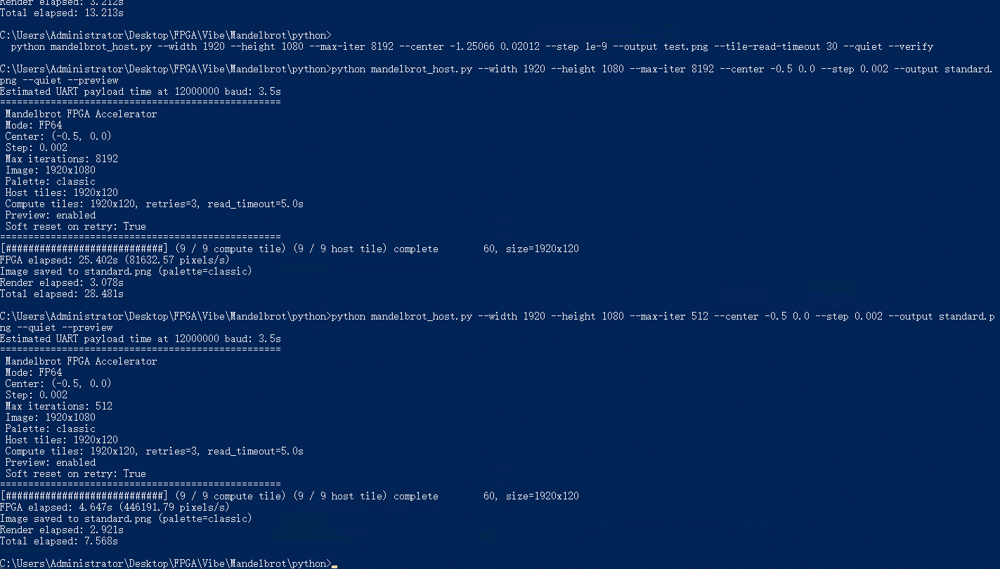
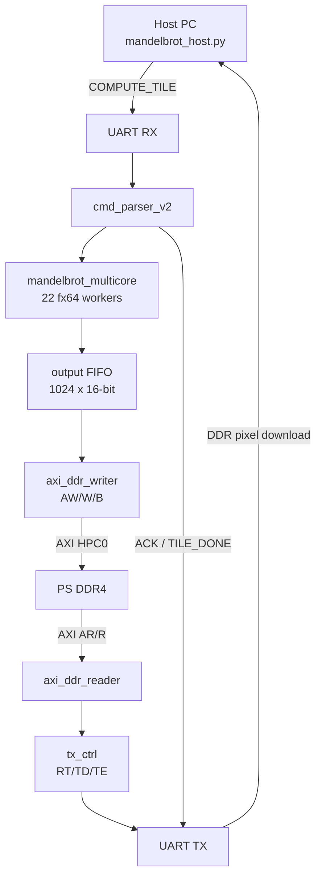
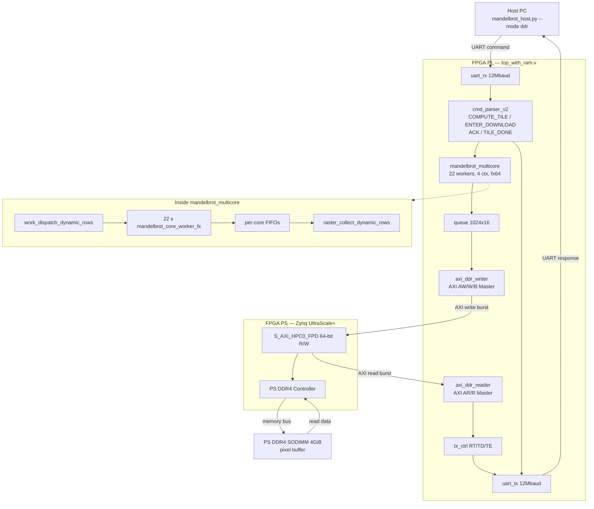
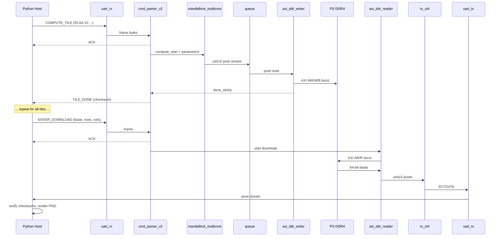
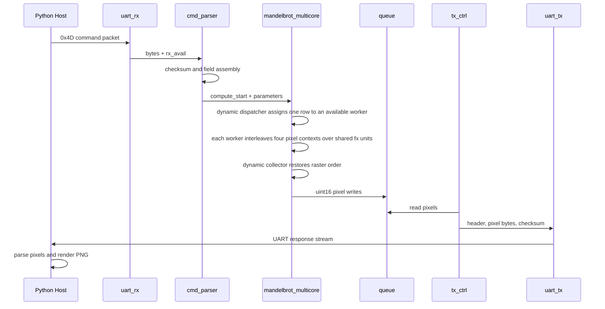

# Mandelbrot FPGA Accelerator



FPGA-based Mandelbrot renderer with two transport modes: **PL-PS DDR (default)** and UART streaming. In both modes the PC sends compute commands containing center, step, maximum iteration count, and dimensions. The FPGA computes pixels with a fixed-point (Q8.55, 64-bit) engine and streams one 16-bit iteration count per pixel.

**PL-PS DDR mode** (default, `build.tcl`): 22-worker fixed-point engine writes pixels to PS DDR4 through AXI during the compute phase, then reads them back through an AXI read master and returns `RT/TD/TE` pixel frames over UART during the download phase. XSDB is only used for PS DDR initialization and PL programming. Use `--mode ddr` (the default) with the host script.

**UART mode** (`build_fp64_fx24.tcl`): 24-worker fixed-point engine, dynamic row scheduling, `RT/TD/TE` tiled response at 12 Mbaud. UART-bound at ~555k pps on shallow scenes. Use `--mode fx64` with the host script.

The fixed-point design uses Q8.55 format (8 integer bits, 55 fractional bits, 64-bit total), which provides resolution of 2^-55 ≈ 2.8e-17. The fixed-point arithmetic eliminates FP normalization/alignment logic, reducing adder latency to 2 cycles and multiplier latency to 4 cycles, which keeps the per-worker LUT cost low.

For the full design review, phase reports, and the fixed-point redesign study, see [REDESIGN_STUDY_REPORT.md](doc/REDESIGN_STUDY_REPORT.md). For the PL-PS DDR architecture, see [PL_PS_DDR_DESIGN.md](doc/PL_PS_DDR_DESIGN.md). For detailed hardware architecture, see [ARCHITECTURE.md](doc/ARCHITECTURE.md). For the ZU4EV 200 MHz adaptation and historical performance, see [VMC_RTSB_ZU4EV_200MHZ_OPT_REPORT.md](doc/VMC_RTSB_ZU4EV_200MHZ_OPT_REPORT.md).

## Demo Images

| Deep Seahorse Valley | Tendrils / Needle |
|---|---|
|  |  |
| `python/hw_1080p_deep_seahorse_i1024_s1e-8.png` | `python/hw_1080p_deep_tendrils_i8192_s1e-9.png` |

Current validated default configuration:

| Item | Value |
|---|---:|
| FPGA target | VMC_RTSB ZU4EV, DDR build `xczu4ev-sfvc784-2-i` (from `reference/design_1.bd`) |
| Vivado version used | 2024.2 or compatible |
| Board clock input | 200 MHz single-ended `sys_clk` on E12 |
| Internal system clock | Direct 200 MHz single clock domain |
| Arithmetic mode | Fixed-point Q8.55 (64-bit), `WORKER_MODE=1` |
| **Default transport** | **PL-PS DDR (AXI HPC0 → PS DDR4 → UART download)** |
| Mandelbrot workers | 22 (DDR mode) / 24 (UART mode) |
| Pixel contexts per worker | 4 |
| Default scheduler | Dynamic idle-core rows (`SCHED_MODE=1`) |
| FP datapath effective rate | 200 MHz (`FP_CE_DIV=1`) |
| UART baudrate | 12000000 |
| Host serial port default | `COM6` |
| Host `--mode` default | `ddr` (PL-PS DDR + fx64) |
| Pixel format | `uint16` iteration count, little-endian |
| Maximum iteration count | 65535 |
| Largest validated frame | 1920x1080 |
| Current board build status | ZU4EV DDR bitstream builds/programs; 4x4, 160x120, edge-tiled 161x121, and 1920x1080 DDR-to-UART tests pass |
| Programming link | XSDB JTAG boot (DDR mode) or Vivado hardware auto-connect (UART mode), target device `xczu4_0` |
| Current routed timing (fx64 22w PL-PS DDR) | `WNS=0.114ns`, `TNS=0.000ns`, `WHS=0.011ns`, `THS=0.000ns` |
| Current routed timing (fx64 24w UART) | `WNS=0.078ns`, `TNS=0.000ns`, `WHS=0.011ns`, `THS=0.000ns` |
| Current routed utilization (fx64 22w PL-PS DDR) | `86450` LUTs (98.42%), `73894` registers, `445` DSP48E2, `46` BRAM tiles |
| Current routed utilization (fx64 24w UART) | `83731` LUTs (95.32%), `76116` registers, `483` DSP48E2, `33` BRAM tiles |
| Response retry tile split | `RESPONSE_TILE_ROW_SPLITS=8`, full-width row slices (UART mode only) |

The default RTL is the 22-worker, 4-context-per-worker fixed-point (fx64) configuration on ZU4EV at direct 200 MHz with PL-PS DDR transport. It builds, programs via JTAG blank-boot, meets timing, and completes a 1920x1080 DDR-to-UART transfer with bit-exact software verification. The 24-worker UART fx64 build (`build_fp64_fx24.tcl`) remains available as an alternative.

## Repository Layout

```text
Mandelbrot/
├── rtl/                         RTL source files
│   ├── top.v                    Top-level integration
│   ├── mandelbrot_multicore.v   Parameterized worker wrapper, FIFOs, scheduler, collector
│   ├── mandelbrot_core_worker_fx.v
│   │                              Default fixed-point Q8.55 4-context row worker
│   ├── mandelbrot_core_worker_kctx.v
│   │                              Historical FP64 4/8-context row worker (not used in current builds)
│   ├── mandelbrot_core_worker_2ctx.v
│   │                              Historical FP64 2-context row worker (not used)
│   ├── mandelbrot_core_worker.v Single-context FP64 row worker (historical, not used)
│   ├── mandelbrot_core.v        Legacy/single-core Mandelbrot FSM and FP scheduling
│   ├── work_dispatch_static_rows.v
│   ├── work_dispatch_dynamic_rows.v
│   ├── raster_merge_static_rows.v
│   ├── raster_collect_dynamic_rows.v
│   ├── fx_mul.v                 Fixed-point 64-bit signed multiplier (3-stage pipeline)
│   ├── fx_add.v                 Fixed-point 64-bit signed adder (1-stage pipeline)
│   ├── fx_mul_int.v             16×64-bit integer×fixed-point multiplier (init path)
│   ├── fp_add.v                 Parameterized FP64 adder/subtractor (historical FP64, not used in current builds)
│   ├── fp_mul.v                 Parameterized FP64 multiplier (historical FP64, not used in current builds)
│   ├── config.vh                Central RTL configuration defaults
│   ├── fp_defines.vh            FP64/FP128 parameters and CE divider
│   ├── fx_defines.vh            Fixed-point Q8.55 parameters (FX_W, FX_FRAC)
│   ├── uart_rx.v                UART receiver
│   ├── uart_tx.v                UART transmitter
│   ├── cmd_parser.v             Host command parser (UART mode)
│   ├── cmd_parser_v2.v          Extended parser + TX (PL-PS DDR mode)
│   ├── tx_ctrl.v                Response stream controller (UART mode)
│   ├── top.v                    Top-level integration (UART mode)
│   ├── top_with_ram.v           Top-level integration (PL-PS DDR mode)
│   ├── axi_ddr_writer.v         AXI4 Master, FIFO → PS DDR writer (PL-PS DDR mode)
│   ├── axi_ddr_reader.v         AXI4 Master, PS DDR → UART pixel reader (PL-PS DDR mode)
│   ├── pl_por.v                 PL-local power-on reset (PL-PS DDR mode)
│   └── queue.v                  Small synchronous FIFO
├── constraints_vmc_rtsb_zu4ev/
│   └── mandelbrot_top.xdc       ZU4EV 200 MHz sys_clk, UART, and LED constraints
├── sim/                         Testbenches
│   ├── tb_fp.v
│   ├── tb_core.v
│   ├── tb_multicore.v
│   ├── tb_multicore_dynamic.v
│   ├── tb_multicore_dynamic_stress.v
│   ├── tb_multicore_static.v
│   ├── tb_multicore_fx.v        Fixed-point multicore testbench + reference model
│   └── tb_core_count.v
├── python/                      Host and hardware test scripts
│   ├── mandelbrot_host.py       Host CLI with --mode ddr/fx64 support
│   ├── pipeline_2ctx_model.py
│   ├── test_esc.py
│   ├── test_points.py
│   ├── scan_points.py
│   ├── test_random_compare.py
│   ├── uart_raw_probe.py
│   ├── uart_listen_raw.py
│   ├── fx_precision_check.py    Fixed-point vs FP64 precision validation
│   ├── fx_precision_all_scenes.py  Six-scene precision sweep
│   ├── test_ram_mode.py         PL-PS DDR mode smoke test
│   ├── bench_ram_mode.py        PL-PS DDR six-scene benchmark
│   ├── debug_status.py          PL-PS DDR UART debug status query
│   └── debug_trace.py           PL-PS DDR compute+debug trace
├── doc/                         Architecture, design, analysis, and TODO documents
│   ├── ARCHITECTURE.md
│   ├── ARCHITECTURE_CN.md
│   ├── ARCHITECTURE_EVOLUTION_REPORT.md
│   ├── ARCHITECTURE_EVOLUTION_REPORT_CN.md
│   ├── REDESIGN_STUDY_REPORT.md   Fixed-point redesign study + Phase 3 results
│   ├── DESIGN_REVIEW_AND_OPTIMIZATION_REPORT.md
│   ├── PHASE0_BASELINE_REPORT.md
│   ├── PHASE1_1M2A_REPORT.md
│   ├── PHASE2_EARLY_ESCAPE_REPORT.md
│   ├── PHASE_SUMMARY.md
│   ├── PIPELINE_BUBBLE_ANALYSIS.md
│   ├── PIPELINE_BUBBLE_ANALYSIS_CN.md
│   ├── TILE_DESIGN.md
│   ├── TILE_DESIGN_CN.md
│   ├── RETRY_TILE_CACHE_DESIGN.md
│   ├── TODO.md
│   └── TODO_CN.md
├── build.tcl                    Canonical default build entrypoint
├── build_mandelbrot_with_ram.tcl  PL-PS DDR build (sourced by build.tcl)
├── build_fp64_fx24.tcl          Fixed-point UART build, 24 workers + 4 contexts at 200MHz
├── program.tcl                  JTAG programming script (UART mode)
├── boot_jtag_with_ram.tcl       JTAG blank-boot script (PL-PS DDR mode)
├── reference/
│   └── design_1.bd              PS configuration reference (PL-PS DDR mode)
├── sim_fp.tcl                   FP unit simulation script
├── sim_core.tcl                 Core simulation script
├── sim_fx.tcl                   Fixed-point multicore simulation script
├── sim_multicore.tcl            Default dynamic 2-context simulation script
├── sim_multicore_dynamic.tcl    Dynamic scheduler simulation script
├── sim_multicore_dynamic_stress.tcl
├── sim_multicore_static.tcl
├── sim_worker_2ctx_model.tcl
└── README.md                    Project overview
```

## Default DDR System Diagram


```mermaid
flowchart TB
    PC[Host PC<br/>mandelbrot_host.py] -->|COMPUTE_TILE| RX[UART RX]
    RX --> Parser[cmd_parser_v2]
    Parser --> Core[mandelbrot_multicore<br/>22 fx64 workers]
    Core --> FIFO[output FIFO<br/>1024 x 16-bit]
    FIFO --> Writer[axi_ddr_writer<br/>AW/W/B]
    Writer -->|AXI HPC0| DDR[PS DDR4]
    DDR -->|AXI AR/R| Reader[axi_ddr_reader]
    Reader --> TXC[tx_ctrl<br/>RT/TD/TE]
    TXC --> TX[UART TX]
    TX -->|DDR pixel download| PC
    Parser -->|ACK / TILE_DONE| TX
```

## RTL Structure


```mermaid
flowchart TB
    CLI["Host PC<br/>mandelbrot_host.py --mode ddr"]

    subgraph PL["FPGA PL — top_with_ram.v"]
        URX["uart_rx 12Mbaud"]
        CMD["cmd_parser_v2<br/>COMPUTE_TILE / ENTER_DOWNLOAD<br/>ACK / TILE_DONE"]
        CORE["mandelbrot_multicore<br/>22 workers, 4 ctx, fx64"]
        FIFO["queue 1024x16"]
        AXIW["axi_ddr_writer<br/>AXI AW/W/B Master"]
        AXIR["axi_ddr_reader<br/>AXI AR/R Master"]
        TXC["tx_ctrl RT/TD/TE"]
        UTX["uart_tx 12Mbaud"]

        URX --> CMD
        CMD --> CORE
        CORE --> FIFO
        FIFO --> AXIW
        AXIR --> TXC
        TXC --> UTX
        CMD --> UTX
    end

    subgraph MC["Inside mandelbrot_multicore"]
        DISP["work_dispatch_dynamic_rows"]
        WORKERS["22 x mandelbrot_core_worker_fx"]
        CFIFO["per-core FIFOs"]
        MERGE["raster_collect_dynamic_rows"]
        DISP --> WORKERS
        WORKERS --> CFIFO
        CFIFO --> MERGE
    end

    CORE -.-> MC

    subgraph PS["FPGA PS — Zynq UltraScale+"]
        HPC0["S_AXI_HPC0_FPD 64-bit R/W"]
        DDRCTL["PS DDR4 Controller"]
        HPC0 --> DDRCTL
    end

    MEM["PS DDR4 SODIMM 4GiB<br/>pixel buffer"]

    CLI -->|UART command| URX
    UTX -->|UART response| CLI
    AXIW -->|AXI write burst| HPC0
    HPC0 -->|AXI read burst| AXIR
    DDRCTL -->|memory bus| MEM
    MEM -->|read data| DDRCTL
```

## Worker Mode Selection

`mandelbrot_multicore` supports a compile-time `WORKER_MODE` generic:

| `WORKER_MODE` | Worker module | Datapath | Status |
|---:|---|---|---|
| `0` | `mandelbrot_core_worker_kctx` | FP64, `MUL_LAT=6`, `ADD_LAT=9` | Historical, not in active builds. |
| `1` | `mandelbrot_core_worker_fx` | Fixed-point Q8.55, `MUL_LAT=4`, `ADD_LAT=2` | **Active mode** (22 workers DDR / 24 UART, 4 contexts). |

When `WORKER_MODE=1`, the `FX_CONTEXTS` generic controls the number of pixel contexts per fixed-point worker (default: 4).

When `WORKER_MODE=0`, the `WORKER_CONTEXTS` generic controls the FP64 worker selection (1/2/4/8 contexts, using the historical kctx/2ctx/1ctx workers).

## Scheduler Modes

`mandelbrot_multicore` supports a compile-time `SCHED_MODE` generic:

| `SCHED_MODE` | Dispatcher | Result collector | Status |
|---:|---|---|---|
| `0` | `work_dispatch_static_rows` | `raster_merge_static_rows` | Static regression mode. |
| `1` | `work_dispatch_dynamic_rows` | `raster_collect_dynamic_rows` | Default board mode. |

Static mode assigns interleaved row streams once at frame start. Dynamic mode assigns one full row at a time to the first available core, records the row owner, and drains each row in raster order from the recorded core FIFO. Both modes keep the existing host protocol unchanged.

The dynamic dispatcher also waits until the selected per-core FIFO is empty before assigning another row to that core. This guard prevents a UART-backpressure deadlock where future rows fill a core FIFO while the raster collector waits for an earlier row from the same core.

## Fixed-Point Worker Pipeline

The default fixed-point worker (`mandelbrot_core_worker_fx`) uses Q8.55 format (8 integer bits for ±128 range, 55 fractional bits for 2^-55 resolution). Each worker maintains four pixel contexts and time-multiplexes one `fx_mul` (64×64 signed multiply, 3-stage pipeline, `MUL_LAT=4`) and one `fx_add` (64-bit signed add, 1-stage pipeline, `ADD_LAT=2`) across the active contexts.

The fixed-point iteration follows the standard Mandelbrot algorithm:

```text
z_re_next = z_re² - z_im² + c_re
z_im_next = 2·z_re·z_im + c_im
escape if z_re² + z_im² > 4.0
```

Subtraction is implemented by negating the b operand before the adder (`c_add_b <= -c_zi_sq`). The escape check is an integer comparison against `4 << FX_FRAC`.

Per-iteration dependency chain: `2·MUL_LAT + max(MUL_LAT, ADD_LAT) + 4·ADD_LAT = 2·4 + 4 + 4·2 = 20 cycles`, with an issue limit of `max(3/1, 5/1) = 5 cycles/iter`. Four contexts are sufficient to hide the 20-cycle dependency latency.

The worker initializes row coordinates using a dedicated `fx_mul_int` module (16-bit integer × 64-bit fixed-point) to compute `c_re_start = center_re - half_w·step` and `row_c_im = c_im_top - row_start·step` without using the shared compute multiplier.

The FP64 worker pipeline (`mandelbrot_core_worker_kctx`, `WORKER_MODE=0`) is retained in the RTL tree as historical code but is not part of any active build. Its pipeline details are documented in [ARCHITECTURE.md](doc/ARCHITECTURE.md).

## Requirements


### Hardware

- VMC_RTSB ZU4EV board. The default DDR build follows `reference/design_1.bd` and targets `xczu4ev-sfvc784-2-i`; UART-only legacy builds still target `-1-i`.
- DDR mode uses XSDB JTAG blank boot (`boot_jtag_with_ram.tcl`); UART-only builds may use Vivado Hardware Manager auto-connect. The programmed device appears as `xczu4_0`.
- FT232HL UART connection wired to FPGA `uart_rx=D12` and `uart_tx=C12`.
- 200 MHz single-ended reference clock on `sys_clk=E12`.
- The default DDR top-level exposes only clock and UART PL pins; LED pins below apply to the UART-only top-level.

Current pin constraints:

| Port | Package pin | I/O standard |
|---|---|---|
| `sys_clk` | `E12` | `LVCMOS25` |
| `uart_rx` | `D12` | `LVCMOS25` |
| `uart_tx` | `C12` | `LVCMOS25` |
| `led[2]` | `A11` | `LVCMOS25` |
| `led[3]` | `A12` | `LVCMOS25` |

The current default LED mapping is intentionally small because two former LED pins are used by the FT232HL UART on this board revision:

| Output | Meaning |
|---|---|
| `led[2]` | Heartbeat (`heartbeat[25]`) |
| `led[3]` | UART RX/TX activity pulse XOR |

If your board uses different pins, edit `constraints_vmc_rtsb_zu4ev/mandelbrot_top.xdc` before building.

### Software

- Windows PowerShell or terminal.
- Xilinx Vivado 2024.2 or compatible version.
- Python 3.
- Python packages:
  - `pyserial`
  - `pillow`

Install Python dependencies:

```bash
python -m pip install pyserial pillow
```

## Initial Configuration

1. Clone or copy the repository.

2. Open a terminal in the project root:

```bash
cd C:\path\to\Mandelbrot
```

3. Confirm Vivado is installed and note your local `vivado` or `vivado.bat` path. Example paths are illustrative only:

```text
C:\Xilinx\Vivado\2024.2\bin\vivado.bat
/opt/Xilinx/Vivado/2024.2/bin/vivado
```

If Vivado is on your PATH, you can use `vivado`. Otherwise, call `vivado.bat` with its full path.

4. Confirm the UART port. The host defaults to `COM6`.

You can override it on every command:

```bash
python python\mandelbrot_host.py --port COM6
```

5. Confirm baudrate. The RTL and Python host currently use `12000000` baud.

Relevant files:

| File | Setting |
|---|---|
| `rtl/uart_rx.v` | `BAUD = 12000000` |
| `rtl/uart_tx.v` | `BAUD = 12000000` |
| `python/mandelbrot_host.py` | `BAUD = 12000000` |

Do not change only one side. The RTL and host must match.

## Configuration

Most RTL defaults are centralized in `rtl/config.vh`. The file uses `ifndef` guards so values can be overridden by Verilog defines in future scripts, and top-level module parameters can still be overridden by Vivado generics.

Current defaults:

| Macro | Default | Used by | Purpose |
|---|---:|---|---|
| `CFG_CLK_HZ` | `200000000` | `uart_rx`, `uart_tx` | System clock used for fractional UART timing. |
| `CFG_UART_BAUD` | `12000000` | `uart_rx`, `uart_tx` | UART baudrate. Must match `python/mandelbrot_host.py` `BAUD`. |
| `CFG_UART_ACC_WIDTH` | `32` | `uart_rx`, `uart_tx` | Fractional baud accumulator width. |
| `CFG_CORE_COUNT` | `22` | `top`, `mandelbrot_multicore` | Number of Mandelbrot workers. Overridden to 24 by `build_fp64_fx24.tcl`. |
| `CFG_CORE_FIFO_DEPTH` | `4096` | `top`, `mandelbrot_multicore` | Per-core result FIFO depth. |
| `CFG_OUTPUT_FIFO_DEPTH` | `1024` | `top` | Shared output FIFO depth before `tx_ctrl`. |
| `CFG_SCHED_MODE` | `1` | `top`, `mandelbrot_multicore` | `0` static rows, `1` dynamic idle-core rows. |
| `CFG_DYNAMIC_OWNER_DEPTH` | `4096` | `top`, `mandelbrot_multicore` | Dynamic row-owner table depth. |
| `CFG_WORKER_CONTEXTS` | `4` | `top`, `mandelbrot_multicore` | FP64 context count when `WORKER_MODE=0` (historical). |
| `CFG_WORKER_MODE` | `1` | `top`, `mandelbrot_multicore` | `0` = FP64 (kctx), `1` = fixed-point (fx). |
| `CFG_FX_CONTEXTS` | `4` | `top`, `mandelbrot_multicore` | Context count per fixed-point worker when `WORKER_MODE=1`. |
| `CFG_RESPONSE_TILE_ROW_SPLITS` | `8` | `top`, `tx_ctrl` | Split one compute response into full-width row-split retry tiles. |

For the default source build, edit `rtl/config.vh` and keep the Python host in sync when changing UART baud:

```verilog
`define CFG_UART_BAUD 12000000
```

```python
BAUD = 12000000
```

The existing Vivado build scripts intentionally override some top-level parameters for known build modes:

| Script | Overrides | Purpose |
|---|---|---|
| `build_mandelbrot_with_ram.tcl` | `CORE_COUNT=22 WORKER_MODE=1 FX_CONTEXTS=4 WORKER_CONTEXTS=4 SCHED_MODE=1` | **Default** PL-PS DDR 22-worker fx64 build with PS BD + AXI HPC0 read/write. |
| `build_fp64_fx24.tcl` | `CORE_COUNT=24 WORKER_MODE=1 FX_CONTEXTS=4 WORKER_CONTEXTS=4 SCHED_MODE=1 DYNAMIC_OWNER_DEPTH=4096 RESPONSE_TILE_ROW_SPLITS=8` | Fixed-point UART 24-worker, 4-context direct-200MHz ZU4EV build. |

Those Vivado generics take precedence over the corresponding `CFG_*` defaults for `top` parameters. UART defaults currently come from `config.vh` unless a build script is extended to override them.

## Build

### PL-PS DDR Build (Default)

`build.tcl` is the canonical default entrypoint and sources `build_mandelbrot_with_ram.tcl`. It creates a Zynq UltraScale+ PS block design (BD), uses 22 workers, writes compute results to PS DDR4, and enables PL-side AXI readback for UART download:

```bash
Z:\Softwares\Xilinx\Vivado\2024.2\bin\vivado.bat -mode batch -source build.tcl
```

Expected bitstream:

```text
./mandelbrot_with_ram_proj/mandelbrot_with_ram.runs/impl_1/system_wrapper.bit
```

After building, boot the board with the JTAG blank-boot script (requires Vitis XSDB, not Vivado):

```bash
Z:\Softwares\Xilinx\Vitis\2024.2\bin\xsdb.bat boot_jtag_with_ram.tcl
```

This initializes PS DDR4 via `psu_init` and programs the PL bitstream — no FSBL or PS C code required. See [PL_PS_DDR_DESIGN.md](doc/PL_PS_DDR_DESIGN.md) for details.

### Fixed-Point UART Build (Alternative)

`build_fp64_fx24.tcl` is the 24-worker fixed-point UART build. It sets:

```text
CLK_HZ=200000000
DIRECT_200MHZ=1
SCHED_MODE=1
DYNAMIC_OWNER_DEPTH=4096
CORE_COUNT=24
WORKER_MODE=1
FX_CONTEXTS=4
WORKER_CONTEXTS=4
RESPONSE_TILE_ROW_SPLITS=8
```

Using Vivado on PATH:

```bash
vivado -mode batch -source build_fp64_fx24.tcl
```

Using an explicit local install path, replace the example prefix with your Vivado installation directory:

```bash
Z:\Softwares\Xilinx\Vivado\2024.2\bin\vivado.bat -mode batch -source build_fp64_fx24.tcl
```

Expected output includes:

```text
BUILD SUCCESSFUL
Bitstream: ./fp64_fx24_proj/mandelbrot_fp64_fx24.runs/impl_1/top.bit
```

## Program The FPGA

### DDR Mode (Default)

After building the DDR bitstream, boot the board with the JTAG blank-boot script (requires Vitis XSDB):

```bash
Z:\Softwares\Xilinx\Vitis\2024.2\bin\xsdb.bat boot_jtag_with_ram.tcl
```

This initializes PS DDR4 via `psu_init` and programs the PL bitstream — no FSBL or PS C code required.

### UART Mode (Alternative)

After building the UART bitstream, program the board:

```bash
vivado -mode batch -source program.tcl
```

Or with an explicit local install path:

```bash
Z:\Softwares\Xilinx\Vivado\2024.2\bin\vivado.bat -mode batch -source program.tcl
```

`program.tcl` uses Vivado hardware auto-connect, opens the attached hardware target, and selects a supported FPGA device matching `*xczu4*` or the older `*xc7k70t*` pattern. Pass a bitstream explicitly when programming a non-default build:

```bash
vivado -mode batch -source program.tcl -tclargs ./fp64_fx24_proj/mandelbrot_fp64_fx24.runs/impl_1/top.bit
```

Expected output includes:

```text
Programming complete
Done
```

## Smoke Test

Run a quick escape test after programming. The `mandelbrot_host.py` with `--mode ddr` (default) and a 1×1 image is the recommended smoke test:

```bash
python python\mandelbrot_host.py --mode ddr --port COM6 --width 1 --height 1 --max-iter 256 --center 2.5 0.0 --step 0.001 --output python\smoke_test.png --timeout 10
```

For UART mode, use `--mode fx64`:

```bash
python python\mandelbrot_host.py --mode fx64 --port COM6 --width 1 --height 1 --max-iter 256 --center 2.5 0.0 --step 0.001 --output python\smoke_test.png --timeout 10
```

Expected: the command completes quickly and the output image is a single pixel with iteration count 1.

> **Note**: `test_esc.py` is a legacy script hardcoded to `COM9` at `576000` baud. It does not work with the current `COM6` at `12Mbaud` default. Use `mandelbrot_host.py` for all smoke tests.

## Render Images

Basic render (DDR mode, default):

```bash
python python\mandelbrot_host.py --mode ddr --width 160 --height 120 --max-iter 256 --output python\mandelbrot_160x120.png
```

Basic render (UART mode):

```bash
python python\mandelbrot_host.py --mode fx64 --width 160 --height 120 --max-iter 256 --output python\mandelbrot_160x120.png
```

Render with an alternate color palette:

```bash
python python\mandelbrot_host.py --mode ddr --width 160 --height 120 --max-iter 256 --palette ocean --output python\mandelbrot_160x120_ocean.png
```

Available PNG/BMP palettes:

| Palette | Description |
|---|---|
| `classic` | Original periodic RGB palette; this remains the default. |
| `fire` | Black-to-red/yellow/white heat-map style for high-contrast escape bands. |
| `ocean` | Blue/cyan gradient for cooler deep-zoom images. |
| `twilight` | Purple-to-warm cyclic HSV palette. |
| `grayscale` | Monochrome brightness ramp, useful for checking structure without hue changes. |

Render with software verification:

```bash
python python\mandelbrot_host.py --mode fx64 --verify --width 160 --height 120 --max-iter 256 --output python\verify_160x120.png
```

Fast 1080p transfer-heavy render:

```bash
python python\mandelbrot_host.py --mode ddr --width 1920 --height 1080 --max-iter 128 --center 1.0 1.0 --step 0.002 --timeout 240 --output python\hw_1080p_fast_escape_i128_s0p002.png
```

1080p standard Mandelbrot view:

```bash
python python\mandelbrot_host.py --mode ddr --width 1920 --height 1080 --max-iter 64 --center -0.5 0.0 --step 0.002 --timeout 240 --output python\hw_1080p_standard_i64_s0p002.png
```

1080p deep zoom example:

```bash
python python\mandelbrot_host.py --mode ddr --width 1920 --height 1080 --max-iter 1024 --center -0.743643887037151 0.13182590420533 --step 1e-8 --timeout 300 --output python\hw_1080p_deep_seahorse_i1024_s1e-8.png
```

1080p benchmark (compute + DDR write only, skip UART download):

```bash
python python\mandelbrot_host.py --mode ddr --width 1920 --height 1080 --max-iter 128 --center 1.0 1.0 --step 0.002 --compute-only --quiet
```

## Host CLI Options

```text
--center RE IM       Complex center point. Default: -0.5 0.0
--step S             Pixel step size. Default: 0.005
--max-iter N         Maximum iterations, <= 65535. Default: 256
--width W            Image width. Default: 160
--height H           Image height. Default: 120
--output PATH        Output image/text path. Default: mandelbrot.png
--format FORMAT      png, bmp, or txt. Default: png
--palette NAME       PNG/BMP palette: classic, fire, ocean, twilight, grayscale
--mode MODE          ddr (PL-PS DDR, default), fx64 (UART fixed-point)
--verify             Also compute software reference and compare
--port COMx          Serial port. Default: COM6
--timeout SEC        Serial timeout. Default: 180.0
--force-large-frame  Bypass host-side large-frame guards only for matching bitstreams
--ddr-base ADDR      DDR base address for pixel buffer. Default: 0x10000000
--compute-only       Skip the UART DDR download phase
--download-retries N Retries per DDR tile UART download
--download-timeout S UART timeout per DDR tile download
```

The default `--mode` is `ddr`, which matches the default `build.tcl` bitstream. The host first sends `COMPUTE_TILE` commands; the FPGA writes each tile into aligned PS DDR slots and reports an XOR16 checksum. The host then sends `ENTER_DOWNLOAD(base, rows, cols)` for each tile; the FPGA reads DDR and returns the existing `RT/TD/TE` UART stream. The host verifies both per-`TD` UART checksums and the end-to-end XOR16 before stitching the image. Use `--compute-only` to benchmark compute + DDR write without downloading pixels. Use `--mode fx64` for the UART-only bitstream (`build_fp64_fx24.tcl`).

## Useful Test Commands

FP unit simulation:

```bash
vivado -mode batch -source sim_fp.tcl
```

Core simulation:

```bash
vivado -mode batch -source sim_core.tcl
```

Fixed-point multicore simulation:

```bash
vivado -mode batch -source sim_fx.tcl
```

Default dynamic 2-context multicore simulation:

```bash
vivado -mode batch -source sim_multicore.tcl
```

Dynamic scheduler simulation:

```bash
vivado -mode batch -source sim_multicore_dynamic.tcl
```

Dynamic 2-context stress simulation:

```bash
vivado -mode batch -source sim_multicore_dynamic_stress.tcl
```

Static 1-context regression simulation:

```bash
vivado -mode batch -source sim_multicore_static.tcl
```

Random host/reference comparison:

```bash
python python\test_random_compare.py --cases 300 --seed 20260608
```

Single-point hardware query:

```bash
python python\test_points.py --center -0.743643887037151 0.13182590420533 --max-iter 1024
```

Fixed-point precision validation:

```bash
python python\fx_precision_all_scenes.py
```

## Data Flow Details

### DDR Mode (Default)


```mermaid
sequenceDiagram
    participant Host as Python Host
    participant RX as uart_rx
    participant Parser as cmd_parser_v2
    participant Core as mandelbrot_multicore
    participant FIFO as queue
    participant Writer as axi_ddr_writer
    participant DDR as PS DDR4
    participant Reader as axi_ddr_reader
    participant TXC as tx_ctrl
    participant TX as uart_tx

    Host->>RX: COMPUTE_TILE (55 AA 10 ...)
    RX->>Parser: frame bytes
    Parser-->>Host: ACK
    Parser->>Core: compute_start + parameters
    Core->>FIFO: uint16 pixel stream
    FIFO->>Writer: pixel read
    Writer->>DDR: AXI AW/W/B burst
    Writer-->>Parser: done_sticky
    Parser-->>Host: TILE_DONE (checksum)
    Note over Host: ... repeat for all tiles ...
    Host->>RX: ENTER_DOWNLOAD (base, rows, cols)
    RX->>Parser: frame
    Parser-->>Host: ACK
    Parser->>Reader: start download
    Reader->>DDR: AXI AR/R burst
    DDR->>Reader: 64-bit beats
    Reader->>TXC: uint16 pixels
    TXC->>TX: RT/TD/TE
    TX->>Host: pixel stream
    Host->>Host: verify checksums, render PNG
```

### UART Mode (Alternative)


```mermaid
sequenceDiagram
    participant Host as Python Host
    participant RX as uart_rx
    participant Parser as cmd_parser
    participant Core as mandelbrot_multicore
    participant FIFO as queue
    participant TXC as tx_ctrl
    participant TX as uart_tx

    Host->>RX: 0x4D command packet
    RX->>Parser: bytes + rx_avail
    Parser->>Parser: checksum and field assembly
    Parser->>Core: compute_start + parameters
    Core->>Core: dynamic dispatcher assigns one row to an available worker
    Core->>Core: each worker interleaves four pixel contexts over shared fx units
    Core->>Core: dynamic collector restores raster order
    Core->>FIFO: uint16 pixel writes
    TXC->>FIFO: read pixels
    TXC->>TX: header, pixel bytes, checksum
    TX->>Host: UART response stream
    Host->>Host: parse pixels and render PNG
```

## Performance Notes

### UART Alternative Mode: Host-Tiled 12 Mbaud

This subsection describes the UART-only `--mode fx64` alternative. Its reliable high-baud operating mode is host-driven tiling at 12000000 baud. DDR mode also uses full-width 120-row compute/download tiles by default, but retries a failed UART download directly from DDR instead of recomputing the tile.

Example:

```bash
python python\mandelbrot_host.py --mode fx64 --port COM6 --width 1920 --height 1080 --max-iter 128 --center 1.0 1.0 --step 0.002 --timeout 600 --verify --tile-width 1920 --tile-height 120 --tile-retries 3 --quiet --output python\hw_1080p_hosttile_fast_escape.png
```

Use `--full-frame` only when you intentionally want the older single-command full-frame response path for regression or controlled single-burst experiments.

If a high-baud tile loses bytes, the host may appear idle until the current serial read times out. The default tiled path now uses `--tile-read-timeout 5.0`, which bounds short-read retry tails while remaining above normal `1920x120` response time at 12 Mbaud.

With `--quiet`, the host now keeps a single-line progress display instead of printing every tile. The format is:

```text
[progress] (n / total compute tile) (m / total host tile) current task
```

For large tiled renders, `--preview` opens a live thumbnail preview window when the output format is an image. The console still uses the compact single-line progress bar, and the preview refreshes after completed compute tiles are copied into the image buffer. Use `--preview-size` to choose the maximum preview dimension.

```bash
python python\mandelbrot_host.py --mode fx64 --width 4096 --height 4096 --max-iter 8192 --center -0.040720424861 -0.6994534564320001 --step 1e-7 --output python\m_4.png --quiet --preview --preview-size 512 --palette fire
```

The host distinguishes checksum-only local retry-tile failures from framing failures. If a full `RT/TD/TE` frame is consumed but one row-split `TD` checksum fails, the host records that retry-tile rectangle, continues the first full-frame pass, then recomputes the merged failed rectangles and patches them into the final image. If framing is lost (`Bad tile magic`, incomplete payload, missing checksum), the stream is no longer aligned; the host drains stale UART bytes and sends a soft reset command (`RST!RST!`) unless `--no-soft-reset-on-retry` is set, then recomputes the current compute tile immediately.

The tiled receive path reads UART data in protocol order, but checksum and pixel unpacking for completed `TD` packets run on worker threads. After one compute response reaches `TE`, the host can issue the next compute tile while the previous response is being finalized and copied into the image buffer. Serial reads are intentionally not parallelized because multiple readers on one UART stream would corrupt framing.

You can also issue a reset manually:

```powershell
python python\mandelbrot_host.py --mode fx64 --port COM6 --soft-reset
```

### Six-Scene 1080p Benchmark

#### UART Mode (fx64 24w, 12 Mbaud, `build_fp64_fx24.tcl`)

| Scene | FP64 12w/8ctx baseline | FX 24w/4ctx UART | Speedup | Transport |
|---|---:|---:|---:|---|
| Fast escape @128 | `3.733s / 555k pps` | `3.733s / 556k pps` | `1.00x` | UART-bound |
| Standard @64 | `3.816s / 546k pps` | `3.727s / 556k pps` | `1.02x` | UART-bound |
| Seahorse zoom @512 | `3.964s / 525k pps` | `3.882s / 534k pps` | `1.02x` | Mixed |
| Deep tendrils @8192 | `3.994s / 519k pps` | `5.029s / 412k pps` | — | See note |
| Deep mini-brot @8192 | `9.166s / 226k pps` | `5.091s / 407k pps` | **`1.80x`** | Compute-bound |
| Deep Seahorse @1024 | `4.575s / 455k pps` | `4.074s / 509k pps` | `1.12x` | Mixed |

#### PL-PS DDR Mode End-to-End Results (fx64 22w, AXI HPC0, `build.tcl`)

The old UART design pipelines compute and transfer per tile (total ≈ max(compute, transfer)). The DDR design separates them into two sequential phases: compute → DDR write, then DDR → UART download (total = compute + download).

| Scene | Old UART 24w (s) | DDR Compute (s) | DDR Download (s) | DDR Total (s) | E2E Speedup |
|---|---:|---:|---:|---:|---:|
| Fast escape @128 | `3.733` | `0.221` | `4.369` | `4.590` | `0.81x` |
| Standard @64 | `3.727` | `0.223` | `4.373` | `4.596` | `0.81x` |
| Seahorse @512 | `3.882` | `1.086` | `5.009` | `6.095` | `0.64x` |
| Deep tendrils @8192 | `5.029` | `1.950` | `5.002` | `6.952` | `0.72x` |
| Deep mini-brot @8192 | `5.091` | `5.104` | `4.418` | `9.522` | `0.53x` |
| Deep Seahorse @1024 | `4.074` | `2.254` | `4.406` | `6.660` | `0.61x` |

Download times include 12 Mbaud byte-slip retry overhead. Pure download without retries is ~3.8s.

End-to-end DDR mode is slower than UART because compute and download are sequential (not overlapped). The DDR design's value is compute-stage acceleration (1.8-17x without UART backpressure), lossless retry from DDR, and a clear path to PS-side push (Ethernet/USB) that would reduce download from ~4.4s to <0.1s.

Major architecture performance stages:

| Version / mode | Board / clock | Fast escape @128 | Deep mini-brot @8192 |
|---|---|---:|---:|
| Historical 576k, 4-worker 1ctx | Early UART-bound baseline | `72.736s` | `234.231s` |
| 12M single-burst, 4-worker 2ctx | High baud, monolithic response | `4.678s` | `83.428s` |
| 7K70T 6-worker 4ctx direct 200MHz | Timing-fixed worker scaling | `4.641s` | `20.963s` |
| ZU4EV 24-worker 4ctx fx64 direct 200MHz | Fixed-point UART | `3.733s` | **`5.091s`** |
| **ZU4EV 22w 4ctx fx64 PL-PS DDR (compute-only)** | **AXI write to DDR** | **0.221s** | **5.104s** |
| **ZU4EV 22w 4ctx fx64 PL-PS DDR (end-to-end)** | **DDR + UART download** | **4.590s** | **9.522s** |

Detailed design review, phase reports, and the fixed-point redesign study are in [REDESIGN_STUDY_REPORT.md](doc/REDESIGN_STUDY_REPORT.md). Historical ZU4EV FP64 optimization data is in [VMC_RTSB_ZU4EV_200MHZ_OPT_REPORT.md](doc/VMC_RTSB_ZU4EV_200MHZ_OPT_REPORT.md).

### DDR Resource Utilization

Latest routed utilization for the default fx64 22-worker PL-PS DDR build (`build.tcl`):

| Resource | Used | Device | Utilization |
|---|---:|---:|---:|
| CLB LUTs | 86,450 | 87,840 | 98.42% |
| CLB Registers | 73,894 | 175,680 | 42.06% |
| DSP48E2 | 445 | 728 | 61.13% |
| Block RAM Tile | 46 | 128 | 35.94% |

### Baudrate Investigation

The UART now uses a 32-bit fractional baud accumulator in both RX and TX. `BAUD=12000000` is the experimental source default and has completed the six 1080p scenes after targeted reprobes. `8000000` remains the safer high-baud fallback from the first full six-scene sweep, while `576000` remains the conservative historical baseline. At 12 Mbaud, occasional byte loss was observed during multi-megabyte bursts. Host-driven tiling provides a practical retry boundary today, but long soak tests are still recommended before relying on 12 Mbaud unattended.

Detailed reports: [UART_BAUDRATE_INVESTIGATION.md](doc/UART_BAUDRATE_INVESTIGATION.md), [UART_TIMING_ANALYSIS.md](doc/UART_TIMING_ANALYSIS.md).

### HW/SW Boundary Differences

The fixed-point (fx64) engine uses truncation in the multiplier (`>> FX_FRAC`), which matches the fx64 software reference exactly. Q8.55 fixed-point provides resolution of 2^-55 ≈ 2.8e-17. In precision validation, all six standard benchmark scenes match the software reference pixel-for-pixel at 100%.

Detailed report: [FP64_BOUNDARY_DIFFERENCE_ANALYSIS.md](doc/FP64_BOUNDARY_DIFFERENCE_ANALYSIS.md).

Current ZU4EV direct-200MHz routed timing:

| Build | Mode | Workers | Contexts | WNS | TNS | WHS | THS |
|---|---|---:|---:|---:|---:|---:|---:|
| `build.tcl` | fx64 DDR-to-UART | 22 | 4 | `0.114ns` | `0.000ns` | `0.011ns` | `0.000ns` |
| `build_fp64_fx24.tcl` | fx64 | 24 | 4 | `0.078ns` | `0.000ns` | `0.011ns` | `0.000ns` |

## Troubleshooting

### Serial Port Access Denied

Only one process can open the selected serial port at a time. Close serial terminals and avoid running multiple host scripts concurrently.

### Timeout With No Header

Common causes:

- FPGA is not programmed with the matching bitstream.
- Host baudrate differs from RTL baudrate.
- Wrong serial port.
- Board needs reprogramming after a failed test.
- `test_esc.py` or another process still owns the port.
- `--mode` does not match the programmed bitstream. The Host default is `ddr`; use `--mode fx64` for `build_fp64_fx24.tcl`.

### Bad Or Incomplete Image

Check that you are using the current `tx_ctrl.v` with explicit 32-bit pixel count:

```verilog
wire [31:0] total_pixels = {16'd0, rows} * {16'd0, cols};
```

Without this fix, frames larger than 65535 pixels can fail.

### Very Large Frames Stop Around 536862720 Bytes

The default bitstream uses dynamic row scheduling with `DYNAMIC_OWNER_DEPTH=4096`. Frames taller than 4096 rows are not supported by that default dynamic collector, because row ownership is only recorded for the first 4096 rows. A `65535x65535` command will therefore receive exactly about:

```text
4096 rows * 65535 cols * 2 bytes/pixel = 536862720 bytes
```

and then stall when raster collection reaches an unrecorded row. That frame is also impractical over UART: `65535 * 65535 * 2` pixel bytes takes roughly 2 hours at 12 Mbaud, before rendering or software verification.

Use host tiling, a smaller frame, rebuild with a larger dynamic owner table, or use a compatible static/streaming design. The host now uses tiled requests by default, so the 4096-row owner-depth limit applies to each hardware tile command rather than the logical full image. `--full-frame` restores the older single-command path, where a frame taller than 4096 rows can still stall unless the bitstream is rebuilt. `--force-large-frame` only bypasses host-side guards and should be used only when the programmed bitstream and host memory can support the request.

### Software Verification Is Slow

`--verify` computes a Python reference image. Use it for small or medium frames. Avoid it for 1080p high-iteration renders unless you intentionally want a long software comparison.

## More Documentation

For detailed hardware architecture, pipeline scheduling, timing constraints, and validation notes, see:

```text
doc/ARCHITECTURE.md
doc/ARCHITECTURE_CN.md
doc/ARCHITECTURE_EVOLUTION_REPORT.md
doc/ARCHITECTURE_EVOLUTION_REPORT_CN.md
doc/REDESIGN_STUDY_REPORT.md
doc/PL_PS_DDR_DESIGN.md
doc/DESIGN_REVIEW_AND_OPTIMIZATION_REPORT.md
doc/PHASE0_BASELINE_REPORT.md
doc/PHASE1_1M2A_REPORT.md
doc/PHASE2_EARLY_ESCAPE_REPORT.md
doc/PHASE_SUMMARY.md
doc/TILE_DESIGN.md
doc/TILE_DESIGN_CN.md
doc/PIPELINE_BUBBLE_ANALYSIS.md
doc/PIPELINE_BUBBLE_ANALYSIS_CN.md
doc/CONTEXT_WORKER_ARCHITECTURE_REPORT.md
doc/CONTEXT_WORKER_ARCHITECTURE_REPORT_CN.md
doc/RETRY_TILE_CACHE_DESIGN.md
doc/PERFORMANCE_100MHZ.md
doc/PERFORMANCE_100MHZ_CN.md
doc/UART_BAUDRATE_BENCHMARK.md
doc/UART_BAUDRATE_BENCHMARK_CN.md
doc/UART_BAUDRATE_INVESTIGATION.md
doc/UART_BAUDRATE_INVESTIGATION_CN.md
doc/UART_TIMING_ANALYSIS.md
doc/UART_TIMING_ANALYSIS_CN.md
doc/FP64_BOUNDARY_DIFFERENCE_ANALYSIS.md
doc/FP64_BOUNDARY_DIFFERENCE_ANALYSIS_CN.md
doc/MULTICORE_FEASIBILITY.md
doc/MULTICORE_FEASIBILITY_CN.md
doc/MULTICORE_4CORE_ARCHITECTURE.md
doc/MULTICORE_4CORE_ARCHITECTURE_CN.md
doc/DYNAMIC_IDLE_CORE_SCHEDULING.md
doc/DYNAMIC_IDLE_CORE_SCHEDULING_CN.md
doc/DESIGN.md
doc/DESIGN_CN.md
doc/TODO.md
doc/TODO_CN.md
```

## License

This project is released under the MIT License unless otherwise stated. You may use, modify, and distribute the RTL, scripts, and documentation under the terms of the MIT License.

If you redistribute this project, keep the license notice and clearly mark any substantial modifications.

## Software And LLM Assistance Disclosure

This project was developed with software and AI-assisted engineering tools, including:

- OpenCode for code editing, repository operations, and project automation.
- DeepSeek v4 Pro for AI-assisted reasoning and implementation support.
- GPT 5.5 for AI-assisted reasoning, documentation, debugging, and implementation support.

All generated code, documentation, hardware behavior, timing closure, and board-level validation remain the responsibility of the project maintainer. The included RTL and scripts should be reviewed and tested for any target board or deployment environment.
