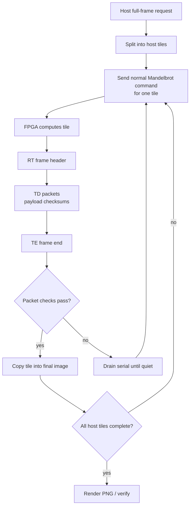

# Tile Response And Host-Tiled Rendering Design

## Purpose

The 12 Mbaud UART path raises the theoretical payload ceiling to about `600000 pixels/s` for 16-bit pixels:

```text
12000000 bits/s / 10 UART bits per byte / 2 bytes per pixel = 600000 pixels/s
```

That bandwidth is high enough that 1080p frames can complete in a few seconds, but a full `1920x1080` response is still about `4.15 MiB` of uninterrupted UART payload. During early 12 Mbaud testing, isolated small frames and direct reprobes passed, but long full-frame bursts occasionally lost bytes near the tail of the transfer. A single dropped byte in the legacy monolithic response invalidates the entire frame because the host only has one final checksum and no resynchronization point.

The tile design solves this by adding two layers:

| Layer | Location | Role |
|---|---|---|
| RTL response tiling | `rtl/tx_ctrl.v` | Breaks the response stream into framed `TD` packets with coordinates and per-packet checksums. |
| Host-driven compute tiling | `python/mandelbrot_host.py` | Splits a large image into retryable compute requests and stitches the returned subframes. |

The RTL layer detects and localizes byte slips. The host-driven layer provides recovery by recomputing only the failed host tile.

## Design Goals

| Goal | Design Choice |
|---|---|
| Preserve existing command format | The host still sends the original Mandelbrot command packet for each requested rectangle. |
| Preserve legacy compatibility | The host parser accepts both legacy `RK` and tiled `RT` responses. |
| Avoid a large RTL protocol rewrite | The FPGA still streams pixels in raster order; `tx_ctrl` only packetizes the stream. |
| Recover from high-baud byte slips | Host tiles are retried as independent compute requests. |
| Keep performance close to single-burst 12M | Use large horizontal stripes such as `1920x120`, not tiny tiles. |
| Keep software diagnosis simple | Logs record tile checksum errors, retry count, timing, and final image assembly. |

## Response Protocol

### Legacy Response

The original response format is still supported by the host:

```text
RK rows(u16) cols(u16) payload checksum
```

The checksum is an XOR over payload bytes only. The host can parse this format for older bitstreams or simple tests.

### Tiled Response

The current RTL emits a tiled response frame:

```text
RT rows(u16) cols(u16)
TD row(u16) col(u16) tile_rows(u16) tile_cols(u16) payload checksum
TD ...
TE rows(u16) cols(u16)
```

Packet meanings:

| Packet | Bytes | Meaning |
|---|---|---|
| `RT` | magic plus frame rows/cols | Starts a tiled response and declares the full response dimensions. |
| `TD` | magic, row, col, tile size, payload, checksum | Carries one rectangular tile in row-major order. |
| `TE` | magic plus frame rows/cols | Ends the tiled response. |

The `TD` checksum is payload-only. Header fields are protected by semantic checks: magic, dimensions, row/column bounds, payload length, and final frame completion.

### RTL Defaults

The response packet size is configured in `rtl/config.vh`:

| Parameter | Current Default | Meaning |
|---|---:|---|
| `CFG_RESPONSE_TILE_COLS` | `64` | Maximum RTL response packet width. |
| `CFG_RESPONSE_TILE_GAP_CYCLES` | `1000` | Idle cycles inserted between response packets, about 10 us at 100 MHz. |

This RTL tile is independent of the host compute tile. For example, a host tile of `1920x120` is returned as many RTL `TD` packets, each currently up to 64 columns wide.

## Host-Driven Tiling

Host-driven tiling is enabled with:

```bash
--tile-width <pixels> --tile-height <pixels> --tile-retries <count> --quiet
```

Recommended 1080p mode:

```bash
python python\mandelbrot_host.py --port COM6 --width 1920 --height 1080 --max-iter 128 --center 1.0 1.0 --step 0.002 --timeout 600 --verify --tile-width 1920 --tile-height 120 --tile-retries 3 --quiet --output python\hw_1080p_hosttile_fast_escape.png
```

For each host tile, the host:

1. Computes the tile center from the full-frame coordinate system.
2. Sends a normal Mandelbrot command with the tile dimensions and tile center.
3. Receives either legacy or tiled response data for that tile.
4. Validates packet framing and checksums.
5. Copies the returned pixels into the final full-frame image.
6. On failure, drains the serial stream until quiet and retries the same tile.

The FPGA does not know that the host is assembling a larger frame. This keeps RTL changes small and makes retry behavior entirely host-controlled.

## Data Flow



## Why Large Horizontal Stripes Work Best

The tile size trades off recovery granularity against overhead.

Small tiles have strong recovery boundaries but poor throughput. A `80x60` tile contains only `4800` pixels, so a 1080p frame needs 432 commands. At 12 Mbaud, the payload for one tile is only about 8 ms, so Python process overhead, serial write/read overhead, command startup, response packet parsing, and logging dominate.

Large stripes reduce fixed overhead. A `1920x120` tile needs only 9 commands per 1080p frame while keeping each response around `460800` payload bytes. This is much smaller than a full-frame `4.15 MiB` burst, but large enough that UART payload time dominates per-command overhead.

Very large stripes, such as `1920x240`, reduce the command count to 5 and were fastest in the one-run tile-size matrix. The tradeoff is a larger retry unit: a checksum error forces recomputation of 240 rows instead of 120 rows.

## Tile-Size Matrix Benchmark

The matrix below used five host tile sizes across the six standard 1080p scenes. Each combination was run once, with `--tile-retries 3` and `--quiet`. Software verification was disabled for this matrix so the measurements reflect FPGA/transport elapsed time, not Python reference rendering time.

Detailed logs are under `python/host_tile_size_matrix/`.

### By Scene

| Scene | `80x60` | `320x120` | `960x120` | `1920x120` | `1920x240` |
|---|---:|---:|---:|---:|---:|
| Fast escape @128 | `13.433s` | `6.992s` | `5.597s` | `4.845s` | `4.759s` |
| Standard @64 | `12.977s` | `6.491s` | `4.641s` | `5.450s` | `4.355s` |
| Seahorse zoom @512 | `24.975s` | `18.605s` | `17.231s` | `17.085s` | `16.951s` |
| Deep tendrils @8192 | `40.828s` | `33.966s` | `33.355s` | `37.524s` | `33.077s` |
| Deep mini-brot @8192 | `91.297s` | `84.214s` | `83.505s` | `83.280s` | `83.179s` |
| Deep Seahorse @1024 | `44.215s` | `37.236s` | `36.534s` | `36.340s` | `36.243s` |

Retry events in this single-run matrix:

| Tile | Host tiles/frame | Retry Events | Total FPGA Time Across Six Scenes | Mean Throughput |
|---:|---:|---:|---:|---:|
| `80x60` | 432 | 0 | `227.725s` | `86263.92 pps` |
| `320x120` | 54 | 3 | `187.504s` | `144807.13 pps` |
| `960x120` | 18 | 0 | `180.863s` | `180234.74 pps` |
| `1920x120` | 9 | 2 | `184.524s` | `177844.65 pps` |
| `1920x240` | 5 | 0 | `178.564s` | `196496.66 pps` |

### Interpreting The Matrix

The `80x60` case is slow in every scene because the frame is split into 432 host commands. This exposes fixed host and protocol overhead more than FPGA compute time.

The `320x120` case reduces command count by 8x, but this particular single-run matrix saw three retry events. That makes it useful as a recovery test but not a clean measure of the best-case tile shape.

The `960x120` and `1920x120` cases are the practical high-throughput range. They cut command count to 18 or 9, respectively, and maintain a moderate retry unit. `1920x120` is the recommended default because it has a full 30-run stability sweep with 30/30 transport pass.

The `1920x240` case was fastest in the one-run matrix. It needs only five host commands per 1080p frame and had no retry in this run. It is a good candidate for future soak testing, but it currently has less repeat data than `1920x120`, and a failed tile costs twice as many rows to recompute.

Compute-bound scenes are less sensitive to tile size. Deep mini-brot changes only from `83.280s` to `83.179s` between `1920x120` and `1920x240`, because the worker pipelines dominate. UART-bound scenes benefit more from larger tiles because they are dominated by transport and per-command overhead.

## Stability Benchmark For The Recommended Tile

The recommended `1920x120` tile was also run five times per scene with software verification enabled. All 30 frame runs completed:

| Scene | Transport Pass | Retry Events | Mean FPGA s | Stddev s | CV | Mean pps |
|---|---:|---:|---:|---:|---:|---:|
| Fast escape @128 | `5/5` | `0` | `4.844` | `0.001` | `0.02%` | `428068.64` |
| Standard @64 | `5/5` | `0` | `4.450` | `0.001` | `0.02%` | `466030.04` |
| Seahorse zoom @512 | `5/5` | `1` | `17.598` | `1.151` | `6.54%` | `118207.86` |
| Deep tendrils @8192 | `5/5` | `1` | `34.026` | `1.873` | `5.51%` | `61080.26` |
| Deep mini-brot @8192 | `5/5` | `0` | `83.281` | `0.001` | `0.00%` | `24898.89` |
| Deep Seahorse @1024 | `5/5` | `0` | `36.343` | `0.002` | `0.00%` | `57056.36` |

Without retry events, the measured FPGA-time variation is effectively zero. The two scenes with visible variation each had one recovered tile retry.

## Current Recommendation

Use `1920x120` as the default reliable 1080p high-baud mode:

| Reason | Explanation |
|---|---|
| Low command count | Only 9 host commands per 1080p frame. |
| Recoverable failures | A checksum error recomputes 120 rows, not the whole frame. |
| Proven repeatability | Completed a six-scene, 30-run verified stability sweep. |
| Near single-burst performance | UART-bound scenes pay a small overhead; compute-bound scenes are unchanged. |

Use `1920x240` when maximum throughput is preferred and a larger retry unit is acceptable. It should receive a similar multi-run stability sweep before replacing `1920x120` as the default recommendation.

## Future Improvements

| Improvement | Benefit |
|---|---|
| Add sequence IDs to `TD` packets | Detect duplicates, missing packets, and stale data explicitly. |
| Add host request IDs | Prevent late data from an old tile from being accepted as a new tile. |
| Add FPGA-side retransmission | Retry one packet instead of recomputing a whole host tile. |
| Increase or tune `CFG_RESPONSE_TILE_COLS` | Reduce `TD` packet count inside large host stripes. |
| Add adaptive tile sizing | Use larger tiles for stable scenes and smaller tiles after retry events. |
| Move to a stronger transport | USB FIFO, Ethernet, or memory-mapped transport would remove UART burst limits. |
