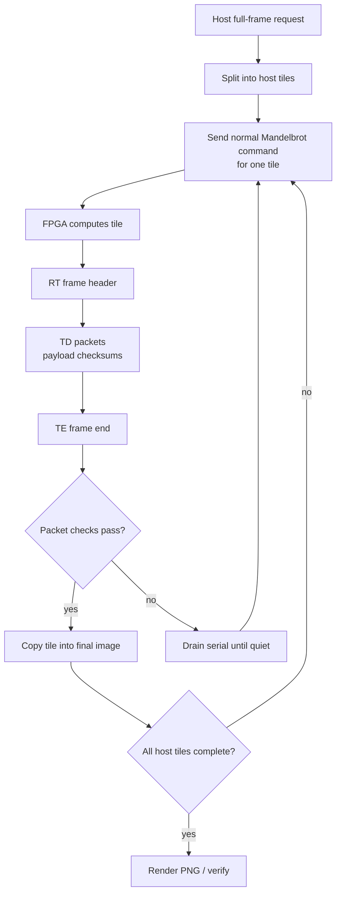

# Tile 响应与 Host 分块渲染设计

## 目的

12 Mbaud UART 将 16-bit pixel 的理论 payload 上限提高到约 `600000 pixels/s`：

```text
12000000 bits/s / 10 UART bits per byte / 2 bytes per pixel = 600000 pixels/s
```

这个带宽足以让 1080p frame 在数秒内完成，但完整 `1920x1080` response 仍然是约 `4.15 MiB` 的连续 UART payload。早期 12 Mbaud 测试中，小图和直接复测可以通过，但长时间 full-frame burst 偶尔会在尾部附近丢字节。legacy 单帧 response 只有最后一个 checksum，没有中间重同步点；一旦丢 1 byte，整帧都会失效。

Tile 设计用两层机制解决这个问题：

| 层级 | 位置 | 作用 |
|---|---|---|
| RTL response tiling | `rtl/tx_ctrl.v` | 将 response stream 切成带坐标和 per-packet checksum 的 `TD` packets。 |
| Host-driven compute tiling | `python/mandelbrot_host.py` | 将大图拆成可重试的 compute requests，并把返回的 subframes 拼回最终图像。 |

RTL 层负责尽早检测和定位 byte slip。Host-driven 层负责恢复：只重算失败的 host tile，而不是重算整张图。

## 设计目标

| 目标 | 设计选择 |
|---|---|
| 保留现有 command 格式 | Host 对每个矩形区域仍发送原 Mandelbrot command packet。 |
| 保留 legacy 兼容 | Host parser 同时支持 legacy `RK` 和 tiled `RT` response。 |
| 避免大规模 RTL 协议重写 | FPGA 仍按 raster order 输出 pixel，`tx_ctrl` 只负责 packetize。 |
| 从 high-baud byte slip 恢复 | Host tile 作为独立 compute request，可失败后重试。 |
| 性能接近 single-burst 12M | 使用 `1920x120` 这类大横向 stripe，而不是过小 tile。 |
| 软件诊断简单 | 日志记录 tile checksum error、retry count、timing 和最终拼图结果。 |

## Response 协议

### Legacy Response

Host 仍支持原 response 格式：

```text
RK rows(u16) cols(u16) payload checksum
```

checksum 是 payload bytes 的 XOR，不包含 header。这个格式用于兼容旧 bitstream 或简单测试。

### Tiled Response

当前 RTL 输出 tiled response frame：

```text
RT rows(u16) cols(u16)
TD row(u16) col(u16) tile_rows(u16) tile_cols(u16) payload checksum
TD ...
TE rows(u16) cols(u16)
```

packet 含义：

| Packet | Bytes | 含义 |
|---|---|---|
| `RT` | magic 加 frame rows/cols | 开始一个 tiled response，并声明完整 response 尺寸。 |
| `TD` | magic、row、col、tile size、payload、checksum | 携带一个 row-major 矩形 tile。 |
| `TE` | magic 加 frame rows/cols | 结束 tiled response。 |

`TD` checksum 只覆盖 payload。Header 字段通过语义检查保护：magic、dimensions、row/column bounds、payload length 和最终 frame completion。

### RTL 默认参数

Response packet 大小在 `rtl/config.vh` 中配置：

| Parameter | 当前默认 | 含义 |
|---|---:|---|
| `CFG_RESPONSE_TILE_COLS` | `64` | RTL response packet 最大宽度。 |
| `CFG_RESPONSE_TILE_GAP_CYCLES` | `1000` | response packets 之间插入的 idle cycles，100 MHz 下约 10 us。 |

RTL tile 与 host compute tile 相互独立。例如 host tile 是 `1920x120` 时，RTL 会把该 tile 的 response 再拆成很多最大 64 columns 的 `TD` packets。

## Host-Driven Tiling

Host-driven tiling 通过以下参数启用：

```bash
--tile-width <pixels> --tile-height <pixels> --tile-retries <count> --quiet
```

推荐 1080p 模式：

```bash
python python\mandelbrot_host.py --port COM6 --width 1920 --height 1080 --max-iter 128 --center 1.0 1.0 --step 0.002 --timeout 600 --verify --tile-width 1920 --tile-height 120 --tile-retries 3 --quiet --output python\hw_1080p_hosttile_fast_escape.png
```

对每个 host tile，host 会：

1. 根据 full-frame 坐标系计算该 tile 的 center。
2. 用 tile dimensions 和 tile center 发送普通 Mandelbrot command。
3. 接收该 tile 的 legacy 或 tiled response。
4. 校验 packet framing 和 checksums。
5. 将返回 pixels 拷贝到最终 full-frame image。
6. 如果失败，则 drain serial stream 直到 quiet，然后重试同一个 tile。

FPGA 不知道 host 正在拼一张更大的图。这让 RTL 改动保持较小，retry 行为完全由 host 控制。

## 数据流



## 为什么大横向 Stripe 最有效

Tile size 是恢复粒度和固定开销之间的折中。

小 tile 的恢复边界很细，但吞吐差。`80x60` tile 只有 `4800` pixels，一张 1080p frame 需要 432 个 commands。12 Mbaud 下一个 tile 的 payload 时间只有约 8 ms，因此 Python 开销、serial write/read、command startup、response packet parsing 和 logging 会占主导。

大 stripe 能减少固定开销。`1920x120` tile 一张 1080p frame 只需要 9 个 commands，同时每次 response 约 `460800` payload bytes。它比 full-frame `4.15 MiB` burst 小很多，但又足够大，可以让 UART payload time 主导每次 command 的开销。

更大的 stripe，例如 `1920x240`，把 command count 降到 5，并且在单次 tile-size matrix 中最快。代价是 retry unit 更大：一次 checksum error 要重算 240 rows，而不是 120 rows。

## Tile-Size Matrix Benchmark

下面的矩阵用 5 种 host tile size 跑 6 个标准 1080p 场景。每个组合跑 1 次，使用 `--tile-retries 3` 和 `--quiet`。该矩阵默认关闭 software verification，因此测量的是 FPGA/transport elapsed time，不包含 Python reference rendering 时间。

详细日志在 `python/host_tile_size_matrix/` 下。

### 按场景对比

| Scene | `80x60` | `320x120` | `960x120` | `1920x120` | `1920x240` |
|---|---:|---:|---:|---:|---:|
| Fast escape @128 | `13.433s` | `6.992s` | `5.597s` | `4.845s` | `4.759s` |
| Standard @64 | `12.977s` | `6.491s` | `4.641s` | `5.450s` | `4.355s` |
| Seahorse zoom @512 | `24.975s` | `18.605s` | `17.231s` | `17.085s` | `16.951s` |
| Deep tendrils @8192 | `40.828s` | `33.966s` | `33.355s` | `37.524s` | `33.077s` |
| Deep mini-brot @8192 | `91.297s` | `84.214s` | `83.505s` | `83.280s` | `83.179s` |
| Deep Seahorse @1024 | `44.215s` | `37.236s` | `36.534s` | `36.340s` | `36.243s` |

单次矩阵中的 retry events：

| Tile | Host tiles/frame | Retry Events | Six Scenes Total FPGA Time | Mean Throughput |
|---:|---:|---:|---:|---:|
| `80x60` | 432 | 0 | `227.725s` | `86263.92 pps` |
| `320x120` | 54 | 3 | `187.504s` | `144807.13 pps` |
| `960x120` | 18 | 0 | `180.863s` | `180234.74 pps` |
| `1920x120` | 9 | 2 | `184.524s` | `177844.65 pps` |
| `1920x240` | 5 | 0 | `178.564s` | `196496.66 pps` |

### Matrix 结果解释

`80x60` 在所有场景都慢，因为一帧被拆成 432 个 host commands。这暴露的是固定 host/protocol overhead，而不是 FPGA compute 的极限。

`320x120` 将 command count 降低了 8 倍，但这次单次矩阵中出现了 3 次 retry。因此它可以证明恢复路径有效，但不是最佳情况下 tile shape 的干净测量。

`960x120` 和 `1920x120` 是实用的高吞吐区间。它们分别把 command count 降到 18 和 9，同时保持适中的 retry unit。`1920x120` 是当前推荐默认值，因为它有完整 30-run 稳定性测试，且 30/30 transport pass。

`1920x240` 在单次矩阵中最快。它每个 1080p frame 只需要 5 个 host commands，并且这次没有 retry。它是后续 soak test 的好候选，但目前重复测试数据少于 `1920x120`，并且失败时需要重算的 tile 高度翻倍。

Compute-bound 场景对 tile size 不太敏感。Deep mini-brot 从 `1920x120` 到 `1920x240` 只从 `83.280s` 变到 `83.179s`，因为 worker pipelines 主导。UART-bound 场景更受益于大 tile，因为它们主要受 transport 和 per-command overhead 限制。

## 推荐 Tile 的稳定性 Benchmark

推荐的 `1920x120` tile 还做了每场景 5 次、带 software verification 的稳定性测试。30 次 frame run 全部完成：

| Scene | Transport Pass | Retry Events | Mean FPGA s | Stddev s | CV | Mean pps |
|---|---:|---:|---:|---:|---:|---:|
| Fast escape @128 | `5/5` | `0` | `4.844` | `0.001` | `0.02%` | `428068.64` |
| Standard @64 | `5/5` | `0` | `4.450` | `0.001` | `0.02%` | `466030.04` |
| Seahorse zoom @512 | `5/5` | `1` | `17.598` | `1.151` | `6.54%` | `118207.86` |
| Deep tendrils @8192 | `5/5` | `1` | `34.026` | `1.873` | `5.51%` | `61080.26` |
| Deep mini-brot @8192 | `5/5` | `0` | `83.281` | `0.001` | `0.00%` | `24898.89` |
| Deep Seahorse @1024 | `5/5` | `0` | `36.343` | `0.002` | `0.00%` | `57056.36` |

没有 retry event 的场景中，FPGA time 的波动几乎为零。有明显波动的两个场景各发生了一次已恢复的 tile retry。

## 当前建议

默认可靠 1080p high-baud 模式建议使用 `1920x120`：

| 原因 | 说明 |
|---|---|
| Command count 低 | 每张 1080p frame 只有 9 个 host commands。 |
| 可恢复失败 | checksum error 只重算 120 rows，而不是整张图。 |
| 重复性已验证 | 完成六场景 30-run verified stability sweep。 |
| 接近 single-burst 性能 | UART-bound 场景有小幅开销；compute-bound 场景基本不变。 |

如果更看重最大吞吐，且能接受更大的 retry unit，可以尝试 `1920x240`。在替换 `1920x120` 作为默认推荐前，它还需要类似的 multi-run stability sweep。

## 后续改进

| 改进 | 收益 |
|---|---|
| 给 `TD` packets 增加 sequence IDs | 显式检测 duplicate、missing packet 和 stale data。 |
| 增加 host request IDs | 防止旧 tile 的迟到数据被误认为新 tile。 |
| 增加 FPGA-side retransmission | 重传单个 packet，而不是重算整个 host tile。 |
| 调整或提高 `CFG_RESPONSE_TILE_COLS` | 减少大 host stripe 内部的 `TD` packet 数。 |
| 增加 adaptive tile sizing | 稳定场景用大 tile，发生 retry 后动态缩小 tile。 |
| 换用更强 transport | USB FIFO、Ethernet 或 memory-mapped transport 可以消除 UART burst 限制。 |
