# Mandelbrot FPGA Accelerator Architecture

## 1. Overview

This project implements a UART-controlled Mandelbrot accelerator on FPGA. The current board target is XC7K70T (`xc7k70tfbg676-1`) with a 200 MHz differential input clock (`CLK_200_P/N`). The default build runs the full compute/UART domain directly at 200 MHz with `DIRECT_200MHZ=1`. The host sends one binary command describing a complete image or tile, and the FPGA streams back one 16-bit iteration count per pixel. The current default compute configuration is FP64, six Mandelbrot workers, four pixel contexts per worker, dynamic row scheduling, `FP_CE_DIV=1`, and a 12 Mbaud fractional-NCO UART.

The design is intentionally streaming-oriented. It does not store a full frame on FPGA. A dynamic row dispatcher assigns one row at a time to available workers, each worker interleaves four pixel contexts over one shared FP64 multiplier and one shared FP64 adder, per-worker FIFOs absorb row output, a raster-order collector restores the original host-visible pixel order, and the transmit controller streams pixels to the host as soon as they are available.

Current validated capabilities:

| Item | Value |
|---|---:|
| FPGA target | `xc7k70tfbg676-1` |
| Board clock input | 200 MHz differential `CLK_200_P/N` |
| Internal system clock | Direct 200 MHz (`DIRECT_200MHZ=1`) |
| 100MHz reference build | `../build_fp64_100mhz.tcl` |
| FP/core effective clock enable rate | 200 MHz (`FP_CE_DIV=1`) |
| Mandelbrot workers | 6 |
| Pixel contexts per worker | 4 |
| Default scheduler | Dynamic idle-core row scheduling (`SCHED_MODE=1`) |
| UART baudrate | 12000000 baud |
| Pixel format | `uint16`, little-endian iteration count |
| Maximum iteration count | 65535 |
| Width/height fields | 16-bit each |
| Pixel count path | 32-bit, validated above 65535 pixels |
| Largest validated image | 1920x1080 |
| Stable mode used in testing | FP64 |
| Host serial port default | `COM9` |
| Programming link | Vivado `hw_server` at `127.0.0.1:3122`, CH347 XVC at `127.0.0.1:2542` |
| Current XC7K70T board build status | Full FP64 bitstream builds cleanly |
| Current routed timing | `WNS=0.003ns`, `TNS=0.000ns`, `WHS=0.042ns`, `THS=0.000ns` |
| Current routed utilization | `29891` LUTs, `25501` registers, `97` DSP48E1, `13.5` BRAM tiles |

## 2. Top-Level Architecture

Top-level integration is in `../rtl/top.v`.

```text
Host PC
  |
  |  UART command: center, step, max_iter, rows, cols
  v
uart_rx
  |
  v
cmd_parser
  |
  |  compute_start, image parameters
  v
mandelbrot_multicore -- raster fifo_wr/fifo_data --> queue(1024 x 16-bit) --> tx_ctrl --> uart_tx
       |
       +-- work_dispatch_dynamic_rows
       +-- 6 x mandelbrot_core_worker_kctx -- per-worker FIFO --> raster_collect_dynamic_rows
              |
              +-- fp_mul
              +-- fp_add
```

The main modules are:

| Module | File | Role |
|---|---|---|
| `top` | `../rtl/top.v` | Instantiates the 200 MHz differential clock input, MMCM-generated 100 MHz system clock, LED status outputs, clock-enable generator, UART, command parser, parameterized worker wrapper, output FIFO, and TX controller. |
| `uart_rx` | `../rtl/uart_rx.v` | Receives 8N1 UART bytes using a fractional baud accumulator. |
| `uart_tx` | `../rtl/uart_tx.v` | Sends 8N1 UART bytes using a fractional baud accumulator. |
| `cmd_parser` | `../rtl/cmd_parser.v` | Parses command packet and validates XOR checksum. |
| `mandelbrot_multicore` | `../rtl/mandelbrot_multicore.v` | Parameterized worker wrapper with scheduler, per-worker FIFOs, raster merger, and `tx_start` handling. |
| `work_dispatch_static_rows` | `../rtl/work_dispatch_static_rows.v` | Static regression scheduler. Assigns interleaved rows to workers. |
| `work_dispatch_dynamic_rows` | `../rtl/work_dispatch_dynamic_rows.v` | Default scheduler. Assigns one full row at a time to an available worker and records row ownership. |
| `mandelbrot_core_worker_kctx` | `../rtl/mandelbrot_core_worker_kctx.v` | Default parameterized 4-context worker. Interleaves four pixel contexts over one FP64 multiplier and one FP64 adder. |
| `mandelbrot_core_worker_2ctx` | `../rtl/mandelbrot_core_worker_2ctx.v` | Lower-LUT comparison/regression worker. |
| `mandelbrot_core_worker` | `../rtl/mandelbrot_core_worker.v` | Single-context regression worker. |
| `raster_merge_static_rows` | `../rtl/raster_merge_static_rows.v` | Static-mode merger. Restores per-worker row streams to strict row-major output order. |
| `raster_collect_dynamic_rows` | `../rtl/raster_collect_dynamic_rows.v` | Default dynamic result collector. Uses the row-owner table to drain dynamically assigned rows in raster order. |
| `mandelbrot_core` | `../rtl/mandelbrot_core.v` | Legacy/single-core raster-order Mandelbrot engine used by regression simulation. |
| `fp_mul` | `../rtl/fp_mul.v` | Parameterized FP multiplier. |
| `fp_add` | `../rtl/fp_add.v` | Parameterized FP adder/subtractor. |
| `queue` | `../rtl/queue.v` | Synchronous FIFO for per-core and output buffering. |
| `tx_ctrl` | `../rtl/tx_ctrl.v` | Builds response header, drains FIFO, transmits pixels and checksum. |

## 3. Command And Response Protocol

The protocol is binary, little-endian, and frame-oriented. One command produces one full image response.

### 3.1 Host To FPGA Command

FP64 command length is 33 bytes. FP128 command length is 57 bytes.

| Offset | Size | Field |
|---:|---:|---|
| 0 | 1 | Magic byte `0x4D` |
| 1 | 1 | Precision flag, bit0 `0=FP64`, `1=FP128` |
| 2 | 2 | `rows`, uint16 LE |
| 4 | 2 | `cols`, uint16 LE |
| 6 | 2 | `max_iter`, uint16 LE |
| 8 | 8 or 16 | `center_re`, FP64 or FP128 LE |
| 16 or 24 | 8 or 16 | `center_im`, FP64 or FP128 LE |
| 24 or 40 | 8 or 16 | `step`, FP64 or FP128 LE |
| Last | 1 | XOR checksum over all previous bytes |

`cmd_parser` assembles these fields with byte-wise shift registers and only starts computation if the XOR including the received checksum is zero.

### 3.2 FPGA To Host Response

Response length is `6 + 2 * rows * cols + 1` bytes.

| Offset | Size | Field |
|---:|---:|---|
| 0 | 1 | `0x52`, ASCII `R` |
| 1 | 1 | `0x4B`, ASCII `K` |
| 2 | 2 | `rows`, uint16 LE |
| 4 | 2 | `cols`, uint16 LE |
| 6 | `2*N` | Pixel data, uint16 LE per pixel |
| Last | 1 | XOR checksum over pixel bytes only |

The host currently computes the response checksum over pixel data only, matching `tx_ctrl`.

## 4. Clocking And Clock-Enable Design

The board provides a 200 MHz differential `CLK_200_P/N` input. The default `top.v` path sets `DIRECT_200MHZ=1`, bypasses the MMCM, and uses the buffered 200 MHz input as the single `sys_clk` domain. UART, parser, FIFO, TX controller, floating-point datapath, and Mandelbrot core all run in that single clock domain. The 100MHz reference build sets `DIRECT_200MHZ=0`, enabling the MMCM path. The `fp_ce` signal is retained as a compile-time throttle, but the current FP64 configuration sets `FP_CE_DIV=1`, so it is asserted every system clock.

`fp_ce` is generated in `top.v`:

```verilog
reg [`FP_CE_DIV-1:0] ce_counter;
wire fp_ce;
assign fp_ce = (`FP_CE_DIV == 1) ? 1'b1 : (ce_counter == `FP_CE_DIV - 1);
```

Current `../rtl/fp_defines.vh` sets:

```verilog
`define FP_CE_DIV 1
```

Therefore the core and FP units advance every internal system cycle. In the default build that is true 200 MHz datapath operation. The 100MHz reference build preserves the same single compute/UART clock-domain structure at a lower clock rate.

### 4.1 Why Clock Enable Instead Of A Derived Clock

The current single-clock + enable approach avoids clock-domain crossing issues and simplifies timing closure.

Benefits:

| Benefit | Explanation |
|---|---|
| Single logic clock domain | All compute/UART registers are clocked by MMCM-generated `sys_clk`. |
| No CDC between core and UART | FIFO and handshake signals stay in one clock domain. |
| Easier reset and debug | One synchronous timing model. |
| STA remains direct | Current FP64 timing uses normal single-cycle 100 MHz constraints. |

### 4.2 Timing Constraints

Current FP64 builds use normal single-cycle timing at the direct 200 MHz `sys_clk`. No `u_core` multicycle exceptions are required. The full XC7K70T Mandelbrot bitstream builds successfully and meets timing.

Current routed timing:

| Metric | Value |
|---|---:|
| Default 200MHz WNS | 0.003 ns |
| TNS | 0.000 ns |
| Default 200MHz WHS | 0.042 ns |
| THS | 0.000 ns |

### 4.3 Direct-200MHz Timing Design

The default build is direct 200MHz:

```text
vivado.bat -mode batch -source build_fp64.tcl
```

It sets `CLK_HZ=200000000`, `DIRECT_200MHZ=1`, `SCHED_MODE=1`, `DYNAMIC_OWNER_DEPTH=4096`, `CORE_COUNT=6`, and `WORKER_CONTEXTS=4`. No multicycle exceptions are used for the Mandelbrot datapath; the design must close as normal single-cycle 5.000 ns logic. The old 100MHz 4ctx design is retained as `../build_fp64_100mhz.tcl` for reference comparisons.

The main 200MHz timing issue was not the FP arithmetic alone. The hard paths were worker context/control decisions feeding 64-bit FPU operands and per-context state updates. The final design uses these timing cuts:

| Cut | Purpose |
|---|---|
| FP multiplier partial-product/register split | Reduces DSP/mantissa multiply path depth. |
| FP adder compare/select, normalize, and final-output pipeline stages | Keeps exponent compare, mantissa align, normalize, and output select out of one cycle. |
| TX `S_TILE_ADVANCE` state | Removes tile/row counter update from the transmit hot path. |
| kctx `C_CHECK_ITER` state | Separates `AOP_NEXT_IM` result writeback from iteration increment/escape/max-iter re-arm. |
| kctx FPU issue request slicing | Splits context selection from FPU operand drive by one cycle. |

The final kctx request-sliced issue path is:

```text
Cycle N:
  scan contexts and choose a ready operation
  latch only req_valid, req_op, req_ctx
  clear the corresponding ready/issued flag

Cycle N+1:
  use req_ctx and req_op to drive mul_a/mul_b or add_a/add_b
  insert req_op/req_ctx into the result tag pipeline
  clear req_valid

Cycle N+latency:
  result tag identifies which context receives mul_result or add_result
```

Example for one multiply issue:

```text
N:   context 2 has MOP_ZRZI ready, so mul_req_op=MOP_ZRZI and mul_req_ctx=2
N+1: mul_a=c_z_re[2], mul_b=c_z_im[2], mul_op_pipe[0]=MOP_ZRZI, mul_ctx_pipe[0]=2
N+6: mul_done_op=MOP_ZRZI, mul_done_ctx=2, mul_result is written to c_z_re_z_im[2]
```

Only the operation and context are latched in the request stage. A rejected variant also latched 64-bit operands in `mul_req_a/mul_req_b/add_req_a/add_req_b`; that preserved functionality but moved the hot endpoint to the request registers and failed timing (`WNS=-0.042ns` after post-route phys-opt). Removing operand latches restored timing-clean routing.

The subtle functional detail is tag latency. The FPU latency probe showed that, in the request-sliced worker, `fp_mul`'s nonzero product pulse aligns with `MUL_LAT=6`, while `fp_add` aligns with `ADD_LAT=9`. Earlier `MUL_LAT=7/8` variants could capture the following zero-result cycle under high-iteration boundary pixels. The final direct-200MHz kctx worker therefore uses:

```verilog
localparam MUL_LAT = 6;
localparam ADD_LAT = 9;
```

## 5. Floating-Point Format

The project uses parameterized binary floating-point formats selected at compile time with `fp_defines.vh`.

| Parameter | FP64 | FP128 |
|---|---:|---:|
| Total width | 64 | 128 |
| Sign bits | 1 | 1 |
| Exponent bits | 11 | 15 |
| Mantissa bits | 52 | 112 |
| Bias | 1023 | 16383 |
| Max normal exponent macro | 2046 | 32766 |

The implementation is IEEE-like but not a full IEEE-754 implementation. It is sufficient for the project workload, but it does not implement all special cases.

Important simplifications:

| Feature | Current behavior |
|---|---|
| Denormals | Not fully supported; zero-like behavior is used. |
| NaN/Inf | Not intended as input or output. |
| Rounding | Truncation/limited normalization behavior, not full IEEE rounding. |
| Exceptions | No exception flags. |

The FPGA and software reference are compared against the implemented RTL behavior, not a full IEEE-754 formal model. A detailed analysis of boundary pixel differences (truncation vs IEEE round-to-nearest-even) is available in [FP64_BOUNDARY_DIFFERENCE_ANALYSIS.md](FP64_BOUNDARY_DIFFERENCE_ANALYSIS.md).

## 6. Floating-Point Multiplier Pipeline

`fp_mul.v` implements multiplication for FP64/FP128 using parameterized exponent and mantissa widths.

Algorithm summary:

1. Register inputs when `ce` is asserted.
2. Detect zero operands.
3. Compute result sign as `a.sign ^ b.sign`.
4. Add exponents and subtract bias.
5. Multiply hidden-bit mantissas: `{1'b1, a.man} * {1'b1, b.man}`.
6. Register DSP product and metadata.
7. Normalize based on the product MSB.
8. Register final output.

Detailed multiplier pipeline:

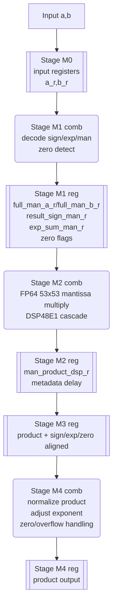

Shape convention: rounded boxes are combinational logic; double-sided boxes are register stages.

Pipeline intent:

| Stage | Main registers | Purpose |
|---|---|---|
| M0 | `a_r`, `b_r` | Isolate caller routing from FP decode. |
| M1 | decoded mantissas and metadata | Remove zero mux and sign/exponent decode from DSP input path. |
| M2 | `man_product_dsp_r` | Register DSP cascade output. |
| M3 | product/metadata alignment registers | Align delayed sign/exponent/zero flags with product. |
| M4 | `product` | Normalize and publish final FP value. |

The multiplier includes input, decoded-mantissa, DSP-product, and metadata registers to improve timing. The decoded-mantissa stage removes zero mux and exponent/sign decode logic from the DSP input path. The multiplication is annotated with:

```verilog
(* mult_style = "pipe_block" *)
```

This encourages DSP-based implementation. The Zynq-7010 implementation uses multiple DSP48E1s for FP64 mantissa multiplication.

### 6.1 Multiplier Pipeline Behavior

The Mandelbrot workers do not assume single-cycle FP units. The current 4-context worker issues operations into shared FP pipelines and routes returning results with latency-matched operation/context tags. The exact worker tag latencies are documented with the worker pipeline in section 8.4.

## 7. Floating-Point Adder Pipeline

`fp_add.v` implements both addition and subtraction. Subtraction is performed by flipping the sign of operand B before entering the adder:

```verilog
wire [`FP_WIDTH-1:0] add_b_eff = add_neg ? {~add_b[`FP_SIGN_IDX], add_b[`FP_EXP_HI:0]} : add_b;
```

Algorithm summary:

1. Register inputs on `ce`.
2. Decode signs, exponents, and mantissas.
3. Compare magnitudes and register the selected large/small operands.
4. Align the smaller mantissa by exponent difference.
5. Add or subtract aligned mantissas depending on signs.
6. Register intermediate mantissa/sign/exponent information.
7. Normalize the mantissa.
8. Adjust exponent.
9. Register output.

Detailed adder/subtractor pipeline:

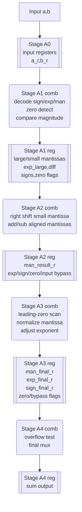

Shape convention: rounded boxes are combinational logic; double-sided boxes are register stages.

Pipeline intent:

| Stage | Main registers | Purpose |
|---|---|---|
| A0 | `a_r`, `b_r` | Isolate caller routing and provide stable decode inputs. |
| A1 | `man_large_s1`, `man_small_s1`, `exp_large_s1`, `diff_s1` | Cut decode/compare/select away from alignment and add/sub. |
| A2 | `man_result_r`, `exp_large_r`, `sign_large_r` | Register add/sub result before normalization. |
| A3 | `man_final_r`, `exp_final_r`, `sign_final_r` | Register normalized result before overflow/final mux. |
| A4 | `sum` | Publish zero bypass, overflow-zero, or normal FP result. |

Important fixes already made in this design:

| Issue | Fix |
|---|---|
| Wrong same-sign normalization slice | Corrected carry/no-carry mantissa extraction. |
| Negative add/sub mismatch | Added tests and fixed sign/magnitude handling. |
| Input timing pressure | Added input registers. |
| 100 MHz adder critical path | Split decode/compare/select from align/add-sub. |
| Output normalization timing | Added output-side normalization/output registers. |

## 8. Mandelbrot Core Architecture

The default `mandelbrot_core_worker_kctx.v` worker computes one row job and maintains four live pixel contexts internally. For each pixel, it iterates:

```text
z_{n+1} = z_n^2 + c

z_re_next = z_re^2 - z_im^2 + c_re
z_im_next = 2 * z_re * z_im + c_im
escape if z_re^2 + z_im^2 > 4
```

Each worker uses one FP multiplier and one FP adder. It time-multiplexes those units across four pixel contexts with tagged FP result writeback. The current wrapper instantiates six independent workers.

### 8.1 Coordinate Generation

The host provides image center and pixel step. The RTL uses integer-truncated half dimensions:

```text
half_w = (cols - 1) >> 1
half_h = (rows - 1) >> 1

c_re_start = center_re - half_w * step
c_im_start = center_im + half_h * step
```

For each row in the single-core engine:

```text
c_re = c_re_start
for each column: c_re += step
after row: c_im -= step
```

The software reference intentionally mirrors this integer-center behavior. This avoids false mismatches versus a conventional floating-centered renderer.

Worker coordinate initialization pipeline:

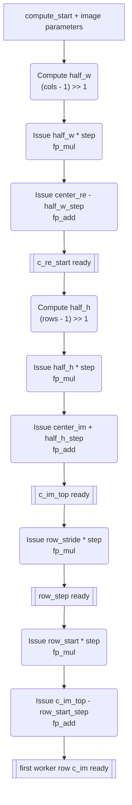

Shape convention: rounded boxes are issued computations or FP operations; double-sided boxes are registered ready values after tagged FP writeback.

In the current default dynamic scheduler, each worker receives one row at a time. `row_start` is the assigned row and `row_stride=rows`, so the worker exits after completing that single row.

### 8.2 4-Core Row Scheduling

`mandelbrot_multicore` supports a compile-time scheduling parameter:

| Parameter | Value | Meaning |
|---|---:|---|
| `SCHED_MODE` | `0` | Static interleaved rows, regression mode. |
| `SCHED_MODE` | `1` | Dynamic idle-core row scheduling, default board mode. |
| `DYNAMIC_OWNER_DEPTH` | `4096` default | Owner-table rows available in dynamic mode. |

Dynamic idle-core scheduling uses `work_dispatch_dynamic_rows.v`. It reuses the row-start/stride worker interface by making each job one full row:

```text
row_start = assigned row
row_stride = rows
```

Because `row + row_stride >= rows` after one row, the existing worker finishes after that row and returns `done`. The dynamic dispatcher tracks which cores are active, waits for `done` to return low before reusing a core, and assigns the next unissued row to the first available core. It also emits `owner_row` and `owner_core` so the collector can later restore raster order.

The dispatcher also waits until the selected core FIFO is empty before assigning another row to that core. This is a deliberate backpressure rule. A 1080p fast-escape workload can compute rows faster than UART can transmit them; without this guard, future rows can fill a per-core FIFO while the raster collector is waiting for an earlier row from that same core, creating a strict-raster deadlock. Requiring an empty per-core FIFO before row reuse keeps at most one completed row queued per core and preserves forward progress under UART backpressure.

Dynamic dispatch structure:

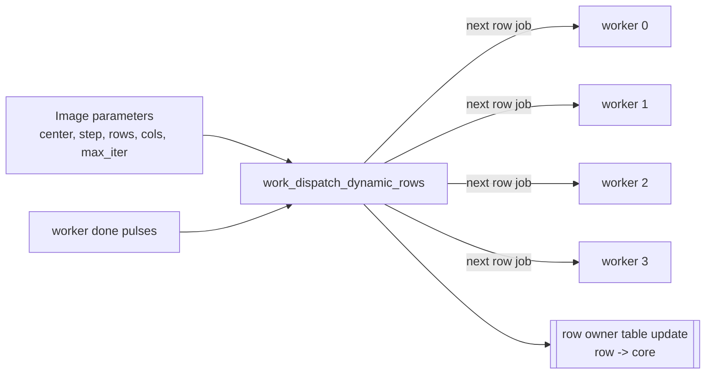

Dynamic mode preserves the existing host-visible raster stream and is the default scheduling layer. It improves row-level load balance but does not remove worker-internal FP pipeline bubbles and cannot improve scenes already capped by UART bandwidth.

### 8.3 Raster Merge

The host-visible protocol expects pixels in row-major order. Dynamic mode uses `raster_collect_dynamic_rows.v` to restore that order. The collector first waits until the owner table has an entry for the current raster row. The source core is then `owner_mem[row]`. After source selection, it waits for that per-core FIFO, reads one pixel, waits one synchronous FIFO read cycle, and writes the pixel into the shared output FIFO. `DYNAMIC_OWNER_DEPTH` bounds the owner table; the default `4096` rows covers the validated 1080p use case.

Raster merge pipeline:

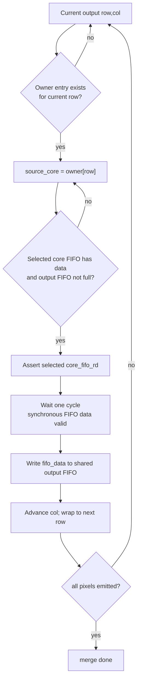

Collector state machine:

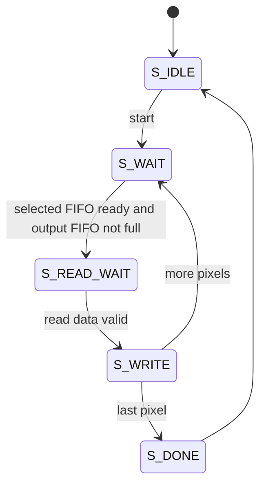

### 8.4 Default 4-Context Worker Pipeline

The default worker is `mandelbrot_core_worker_kctx` with `CONTEXTS=4`. Each context keeps its own pixel coordinate, current `z`, delayed intermediate values, iteration count, state, and pending ordered-commit result. The shared multiplier and adder accept at most one operation per cycle each. Every issued operation carries an operation tag and context tag through latency-matched delay lines so the returning FP result updates the correct context.

Current direct-200MHz kctx tag constants are:

```verilog
localparam MUL_LAT = 6;
localparam ADD_LAT = 9;
```

The historical 2ctx worker and single-context worker remain in the source tree for comparison/regression, but the detailed architecture below describes the current 4ctx worker.

Per-context state includes:

| State | Purpose |
|---|---|
| `c_c_re`, `c_c_im` | Pixel coordinate. |
| `c_z_re`, `c_z_im` | Current complex value. |
| `c_z_re_sq`, `c_z_im_sq`, `c_z_re_z_im` | Delayed FP intermediates. |
| `c_iter` | Iteration count. |
| `c_col` | Worker-local ordered commit column. |
| `c_state` | Per-context micro-state. |
| `c_result_valid`, `c_result_iter` | Completed pixel result waiting for ordered commit. |

The current 4-context worker structure is:

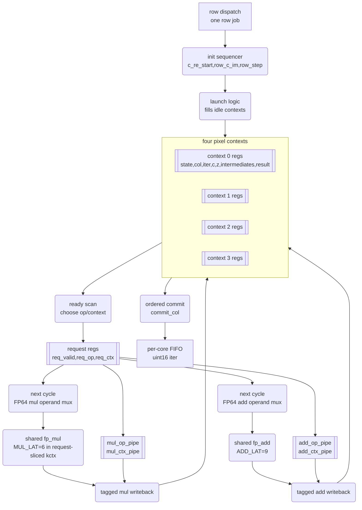

The shared FP units use operation and context tag delay lines:

| Tag path | Latency | Purpose |
|---|---:|---|
| Tag path | Latency | Purpose |
|---|---:|---|
| `mul_op_pipe`, `mul_ctx_pipe` | 6 cycles | Route `fp_mul` output back to the correct context and destination in the request-sliced kctx worker. |
| `add_op_pipe`, `add_ctx_pipe` | 9 cycles | Route `fp_add` output back to the correct context and destination in the request-sliced kctx worker. |

Per-context operation flow for a non-escaping iteration:

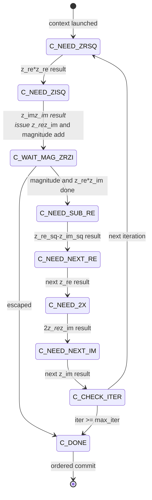

Issue timing for direct-200MHz kctx:

```text
Cycle N:   scan contexts, choose one ready operation, latch req_valid/req_op/req_ctx
Cycle N+1: drive FPU operands from req_ctx/req_op, insert op/context tag into result pipe
Cycle N+latency: use delayed tag to write the FP result back to the selected context
```

The worker commits in local column order. A later context can finish before an earlier column, but its result remains pending until `commit_col` reaches it. This preserves the per-core FIFO contract and keeps downstream raster collection unchanged.

Detailed history for the older 2ctx worker, rejected 200MHz attempts, and lower-LUT future worker ideas is kept in [ARCHITECTURE_EVOLUTION_REPORT.md](ARCHITECTURE_EVOLUTION_REPORT.md) and [CONTEXT_WORKER_ARCHITECTURE_REPORT.md](CONTEXT_WORKER_ARCHITECTURE_REPORT.md).

### 8.5 Escape Check

Escape is detected with:

```text
z_re^2 + z_im^2 > 4.0
```

The implementation includes quick checks on each squared term and on their sum:

```verilog
quick_esc(z_re_sq) || quick_esc(z_im_sq) || quick_esc(add_result)
```

`quick_esc` compares the floating-point exponent against `bias + 2` and handles the exact `4.0` boundary by checking mantissa bits. Values greater than 4.0 escape. Exact 4.0 does not escape.

### 8.6 Output And Backpressure

When a pixel is complete, a worker waits until its per-core FIFO is not full, writes the 16-bit iteration count, and then advances to the next pixel. The raster merger drains per-core FIFOs into the shared output FIFO. `tx_ctrl` then drains the shared output FIFO to UART.

The top-level output FIFO has 1024 entries of 16-bit data. Each worker also has a per-core FIFO. The system is still fundamentally streaming and will backpressure workers when UART is the bottleneck or when strict raster ordering waits for an earlier row.

Output buffering and backpressure path:

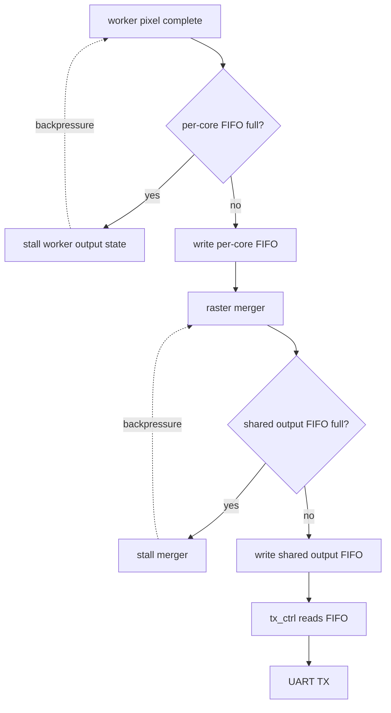

Because `queue.v` has synchronous read data, both the raster merger and `tx_ctrl` use a read-wait style: assert read enable, wait one clock for `data_out` to become valid, then consume the value.

## 9. UART Design

UART is 8N1, no parity, no hardware flow control. The current source default is `BAUD=12000000` for both `../rtl/uart_rx.v`, `../rtl/uart_tx.v`, and `../python/mandelbrot_host.py`.

The original UART used an integer `CLOCKS_PER_BIT` divider. That worked at conservative rates but quantized every baudrate to an integer number of 100 MHz system clocks. The current design keeps `CLOCKS_PER_BIT = CLK_HZ / BAUD` as a compatibility parameter, but actual bit timing is generated by a 32-bit fractional phase accumulator:

```text
CLK_HZ = 100000000
BAUD = 12000000
ACC_WIDTH = 32
BAUD_INC = round(BAUD * 2^ACC_WIDTH / CLK_HZ)
baud_sum = baud_acc + BAUD_INC
baud_tick = carry_out(baud_sum)
```

For 12 Mbaud, one UART bit is `100 MHz / 12 MHz = 8.333...` system clocks. The fractional accumulator emits a tick pattern that alternates 8- and 9-cycle bit intervals so the long-term average baudrate is close to the requested value. This removes the large baud error that an integer divider would introduce at rates that are not exact divisors of 100 MHz.

Fractional baud generator structure:

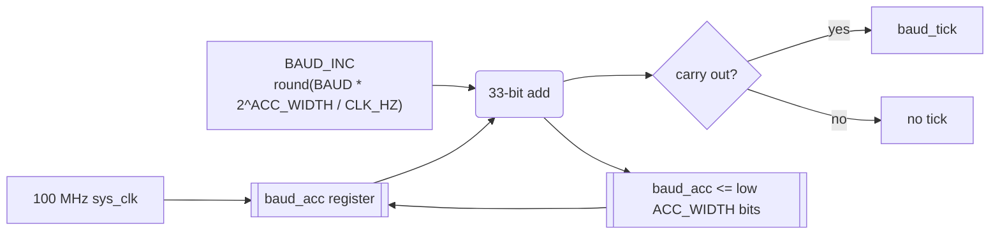

`uart_rx.v` synchronizes the asynchronous RX input with two flip-flops, detects the falling start edge, preloads the accumulator to `HALF_BIT`, validates that the start bit is still low at the center of the start bit, and then samples each data bit on subsequent fractional baud ticks. A continuous-frame off-by-one bug was fixed so RX enters stop-bit checking immediately after sampling data bit 7 instead of waiting one extra bit period.

`uart_tx.v` serializes one start bit, eight data bits, and one stop bit. The same accumulator style advances the TX state machine; `transmit_avail` acts as a ready signal for `tx_ctrl`.

UART receive pipeline:

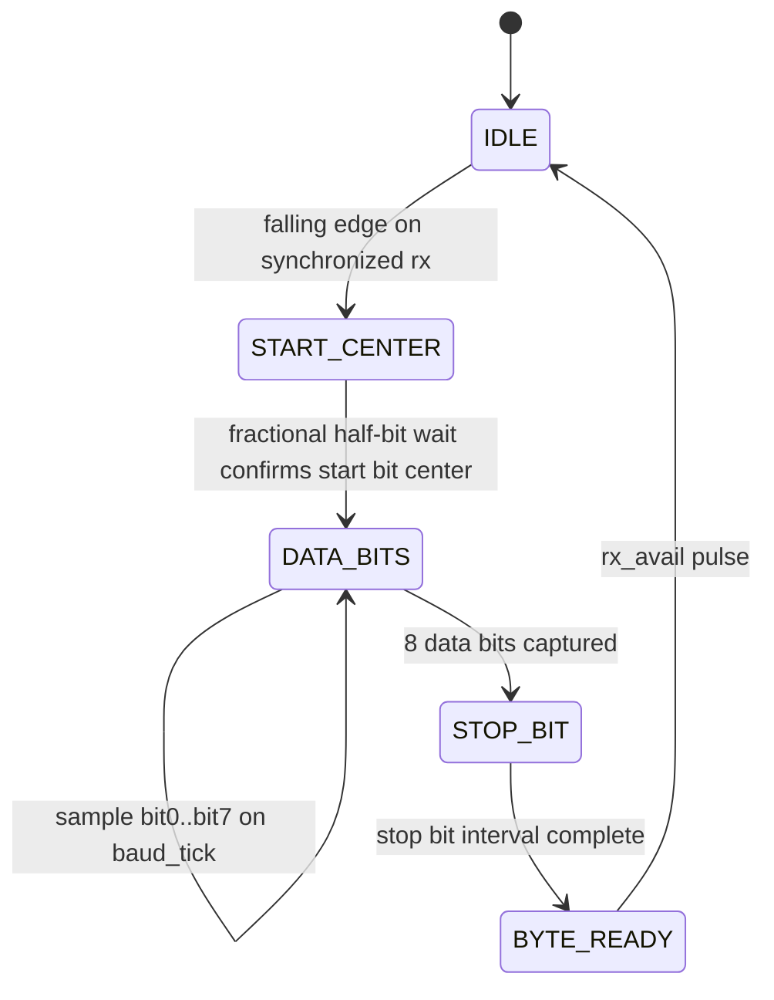

UART transmit pipeline:

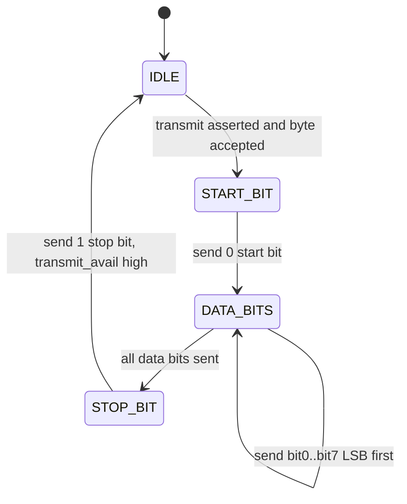

UART integration in the response path:

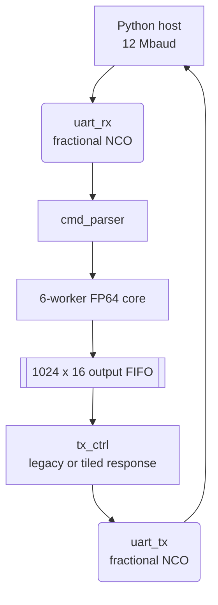

The UART remains in the same 100 MHz clock domain as the parser, core, FIFOs, and TX controller. There is no UART/core CDC; the asynchronous external RX pin is handled only by the two-flop synchronizer inside `uart_rx`.

Baudrate history and raw investigation data are kept in [UART_BAUDRATE_INVESTIGATION.md](UART_BAUDRATE_INVESTIGATION.md), [UART_TIMING_ANALYSIS.md](UART_TIMING_ANALYSIS.md), and [ARCHITECTURE_EVOLUTION_REPORT.md](ARCHITECTURE_EVOLUTION_REPORT.md). This architecture document describes the current 12 Mbaud fractional-NCO implementation.

## 10. TX Controller And Large-Frame Support

`tx_ctrl.v` drains pixels from the output FIFO and serializes the host response. The original design emitted one monolithic `RK` frame per command. That was simple and efficient at lower baudrates, but at 12 Mbaud a full `1920x1080` frame is about `4.15 MiB` of uninterrupted UART payload. Early 12 Mbaud testing showed that such long bursts can occasionally lose bytes near the tail of the transfer. With only one final checksum, a single dropped byte invalidates the entire frame and leaves the host waiting for the declared payload length until timeout.

The current design keeps the same compute command format and raster-ordered pixel stream, but wraps the response in a lightweight tile protocol. The protocol has two layers:

| Layer | Implemented In | Function |
|---|---|---|
| RTL response tiling | `../rtl/tx_ctrl.v` | Splits the response stream into framed `TD` packets with coordinates and per-packet checksums. |
| Host-driven display tiling | `../python/mandelbrot_host.py` | Splits a large image into host-visible stripes and stitches returned subframes. |
| Hardware compute sub-tiling | `../python/mandelbrot_host.py` | Splits each host tile into smaller retryable hardware commands. |

The RTL layer detects and localizes byte slips. The host-driven layer provides recovery by recomputing only the failed hardware compute tile inside the host tile.

Tile design goals:

| Goal | Design Choice |
|---|---|
| Preserve the existing compute command | A host tile is just a normal Mandelbrot command with adjusted center and smaller dimensions. |
| Preserve old host compatibility | The Python receiver accepts both legacy `RK` responses and current `RT`/`TD`/`TE` responses. |
| Keep RTL small | `tx_ctrl` packetizes the existing raster stream; it does not buffer a full frame or implement retransmission. |
| Add resynchronization points | Each `TD` packet has magic bytes, coordinates, dimensions, a bounded payload length, and a payload checksum. |
| Make failures recoverable | The host retries a compute subtile rather than losing the entire 1080p frame or a full host stripe. |
| Keep throughput close to single burst | Recommended host tiles are large horizontal stripes, not tiny rectangles. |

The architecture intentionally separates detection from recovery. The FPGA detects packet boundaries and supplies enough metadata for the host to validate each packet, but it does not participate in a bidirectional ACK/retry protocol during response streaming. This keeps the UART path simple and avoids buffering old packets in FPGA memory.

### 10.1 Response Formats

Supported response formats:

| Format | Magic | Purpose | Checksum |
|---|---|---|---|
| Legacy full frame | `RK` | Original single payload response. | One final XOR byte over all payload bytes. |
| Tiled frame header | `RT` | Announces frame dimensions before tile packets. | Magic/dimensions checked by host. |
| Tiled data packet | `TD` | Carries one rectangular pixel tile with row/column coordinates. | One XOR byte over the tile payload. |
| Tiled frame end | `TE` | Marks completion of the frame dimensions. | Magic/dimensions checked by host. |

Legacy response layout:

```text
RK rows(u16) cols(u16) payload checksum
```

Tiled response frame layout:

```text
RT rows(u16) cols(u16)
TD row(u16) col(u16) tile_rows(u16) tile_cols(u16) payload checksum
TD ...
TE rows(u16) cols(u16)
```

All multi-byte fields are little-endian. `row` and `col` in a `TD` packet are relative to the current response frame, not the original full image when host-driven tiling is active. For a host tile request of `1920x120`, the response frame dimensions are `1920x120`, and packet coordinates range inside that tile response.

Tiled data packet layout:

```text
TD row_lo row_hi col_lo col_hi tile_rows_lo tile_rows_hi tile_cols_lo tile_cols_hi payload checksum
```

The `TD` checksum is payload-only. Header fields are protected by semantic checks on the host side: magic bytes, frame dimensions, row/column bounds, expected payload length, and final frame completion. This keeps the RTL packetizer small and avoids a full bidirectional transport protocol in the FPGA.

The host parser accepts packets only when the following invariants hold:

| Check | Purpose |
|---|---|
| `RT` dimensions equal the requested response dimensions | Reject stale or corrupt frame headers. |
| `TD` rectangle is inside the response frame | Prevent out-of-bounds writes into the host image buffer. |
| `TD` payload length equals `tile_rows * tile_cols * 2` | Detect truncated or shifted packet payloads. |
| `TD` payload checksum matches | Detect byte corruption or byte slip inside the packet payload. |
| Every expected pixel is filled before `TE` | Detect missing packets or premature frame end. |
| `TE` dimensions match `RT` | Reject stale or corrupt end markers. |

The current host does not require `TD` packets to arrive out of order because the RTL emits them in raster order. The bounds and filled-pixel checks are still useful because they make future coordinate-tagged output easier to validate.

### 10.2 RTL Tile Generation

The current source defaults are:

| Parameter | Default | Meaning |
|---|---:|---|
| `CFG_RESPONSE_TILE_COLS` | `64` | Maximum RTL response packet width. |
| `CFG_RESPONSE_TILE_GAP_CYCLES` | `1000` | Inter-packet idle gap at 100 MHz, about 10 us. |

`CFG_RESPONSE_TILE_COLS` controls the width of each RTL `TD` packet. The packet height is determined by the stream position and remaining pixels; in the current implementation packets advance through the response in raster order and do not reorder pixels. The output FIFO still supplies one 16-bit pixel at a time, so the packetizer is a wrapper around the same low-byte/high-byte UART serialization used by the legacy response.

The RTL response tile is not the same thing as a host compute tile:

| Concept | Controlled By | Example | Purpose |
|---|---|---|---|
| RTL response tile | `CFG_RESPONSE_TILE_COLS` in `../rtl/config.vh` | `64` columns | Adds packet boundaries and checksums inside one FPGA response. |
| Host tile | `--tile-width`, `--tile-height` | full width x 120 rows | Defines the display/logging stripe and final image copy region. |
| Hardware compute tile | `--compute-tile-width`, `--compute-tile-height` | host tile, width capped at 4096 | Creates retryable hardware commands inside each host tile. |

A single hardware compute tile can therefore produce many RTL `TD` packets. For example, the default `1920x120` compute tile used for 1080p with `CFG_RESPONSE_TILE_COLS=64` produces 3600 64-column response packets inside one response frame. A smaller `512x120` compute tile can still be selected explicitly when a smaller retry unit is preferred.

Host-driven tiling is now the default behavior in `../python/mandelbrot_host.py`. If the user does not pass `--tile-width` or `--tile-height`, the host selects a full-width stripe with a default height of 120 rows. If the user does not pass `--compute-tile-width` or `--compute-tile-height`, each compute tile equals the host tile, except the compute width is capped at 4096 columns. Tile receive uses a shorter per-read timeout, `--tile-read-timeout 30`, so a byte slip can fail and retry a compute tile without waiting for the global serial timeout. The old single-command path is still available through `--full-frame` for regression and controlled experiments.

`CFG_RESPONSE_TILE_GAP_CYCLES` inserts a small idle gap between response packets. This gives the host/USB serial stack short scheduling windows without adding a large throughput penalty. The current default of `1000` cycles is about 5 us at 200 MHz.

For a response frame with `rows` and `cols`, the approximate packet count is:

```text
td_packets = rows * ceil(cols / CFG_RESPONSE_TILE_COLS)
```

With the current `CFG_RESPONSE_TILE_COLS=64`, one default `1920x120` hardware compute tile produces:

```text
120 * ceil(1920 / 64) = 120 * 30 = 3600 TD packets
```

A default `1920x120` host stripe is one compute response. The payload size is unchanged at two bytes per pixel. The framing overhead for each `TD` packet is 2 magic bytes, 8 header bytes, and 1 checksum byte, so `11` bytes per packet. One default `1920x120` compute response therefore has:

```text
payload_bytes = 1920 * 120 * 2 = 460800
td_overhead   = 3600 * 11 = 39600
gap_time      = 3600 * 1000 / 100 MHz = 36.0 ms
```

This overhead is small compared with the payload time at 12 Mbaud, but it is not zero. Increasing `CFG_RESPONSE_TILE_COLS` would reduce packet count and host parsing overhead, at the cost of larger corruption windows and possibly different timing/resource behavior in `tx_ctrl`.

### 10.3 Reliability Boundary

Packetized response framing by itself detects checksum errors earlier, but it does not let the FPGA retransmit one packet. During response streaming the protocol is still effectively one-way: the host is receiving and the FPGA is transmitting. If a `TD` packet checksum fails, the host cannot ask the current `tx_ctrl` instance to resend only that packet.

Recovery therefore happens at the hardware compute-tile boundary. The host records the failed compute-tile coordinates, discards that subframe, drains stale serial bytes until the link is quiet, resets the input buffer, sends the soft reset command, and sends the same compute tile command again. This recovers from byte slips while keeping RTL retransmission complexity out of the FPGA.

The soft reset command is the eight-byte UART sequence `RST!RST!`. `cmd_parser` recognizes it in any parser state and pulses a system reset long enough to clear the command parser, compute engine, per-core FIFOs, output FIFO, and `tx_ctrl`. The host sends it automatically after a failed compute tile attempt unless `--no-soft-reset-on-retry` is used. It can also be sent manually with `python python\mandelbrot_host.py --port COM9 --soft-reset`.

Host retry sequence:

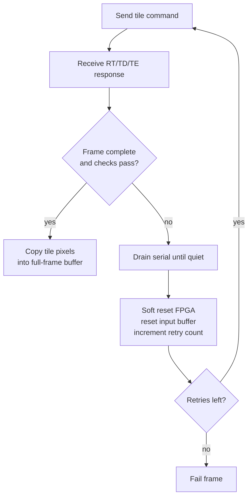

The retry is still coarser than one `TD` packet. A bad `TD` packet causes the current hardware compute tile to be recomputed, because the FPGA has already streamed past the failed packet and has no retained copy to resend. With the default `1920x120` host stripe and matching compute tile, one retry recomputes one host stripe rather than the entire 1080p frame. If a smaller retry unit is more important than command overhead, pass explicit compute tile dimensions such as `--compute-tile-width 512 --compute-tile-height 120`.

If bytes stop arriving in the middle of a `TD` payload, the receiver cannot know the packet is incomplete until the serial read returns short. The tiled path therefore overrides the serial timeout during each tile request with `--tile-read-timeout`, currently 30 seconds by default. This turns the apparent hang into a bounded wait followed by drain and retry.

Current limitations:

| Missing Feature | Effect |
|---|---|
| No packet sequence ID | The host detects bad framing/checksum but cannot explicitly report missing packet numbers. |
| No request ID | Late bytes from an old failed request are handled by drain/quiet timing, not by an explicit ID check. |
| No FPGA-side retransmission | A failed packet requires recomputing the current hardware compute tile. |
| Payload-only checksum | Header corruption is caught by semantic checks, not by a header CRC. |

These are deliberate tradeoffs for the current UART implementation. The design gives practical recovery at 12 Mbaud without converting the FPGA UART path into a full reliable transport stack.

Important reliability boundaries:

| Boundary | Current Behavior |
|---|---|
| Packet corruption inside one `TD` | Detected by payload checksum; host retries the compute tile. |
| Header corruption | Detected by magic/dimension/bounds/length checks; host retries the compute tile. |
| Lost packet | Detected by missing filled pixels or unexpected `TE`; host retries the compute tile. |
| Late bytes after a failed tile | Mitigated by drain-until-quiet, soft reset, and input-buffer reset. |
| Duplicate or stale valid-looking tile | Not explicitly protected without request IDs; currently mitigated by serial drain and strict command sequencing. |
| FPGA compute error with valid transport | Not corrected by the tile protocol; use `--verify` or targeted simulation for numerical validation. |

### 10.4 Host-Driven Tile Geometry

Host-driven tiling builds reliability above this packetized response format. Instead of requesting a full 1920x1080 frame in one command, the host builds large host-visible stripes and sends one hardware compute command for each default stripe. If a compute response fails checksum or framing, the host drains the serial stream, sends soft reset, and retries that compute tile. The recommended 1080p host stripe is `1920x120`, producing nine hardware compute requests per frame by default.

Tile center calculation preserves the same integer-center coordinate convention as the full-frame renderer. For a full image with center `(center_re, center_im)`, pixel step `step`, full dimensions `width x height`, and a compute tile at `(cx0, cy0)` with dimensions `cw x ch`, the host computes:

```python
full_half_w = (width - 1) >> 1
full_half_h = (height - 1) >> 1
subtile_half_w = (cw - 1) >> 1
subtile_half_h = (ch - 1) >> 1
subtile_center_re = center_re + (cx0 + subtile_half_w - full_half_w) * step
subtile_center_im = center_im + (full_half_h - (cy0 + subtile_half_h)) * step
```

This makes each compute command generate exactly the same pixel coordinates as the corresponding rectangle in a monolithic full-frame command. After receiving a compute response, the host copies each returned row into the final image buffer:

```python
dst = (cy0 + dy) * width + cx0
pixels[dst:dst + cw] = subtile_pixels[src:src + cw]
```

The FPGA is intentionally unaware of the full-frame assembly. It only receives ordinary Mandelbrot commands for smaller rectangles.

This choice has an important consequence: all full-frame coordinate logic remains in software. The FPGA only sees a tile-local frame with its own `rows`, `cols`, `center`, and `step`. That is why `TD` coordinates are relative to the tile response and why the host copy step applies `(x0, y0)` when writing into the final image buffer.

The geometry formula preserves the RTL integer-center convention for both odd and even compute-tile dimensions. It uses truncated half dimensions, matching RTL expressions such as:

```verilog
half_w = (cols - 1) >> 1;
```

This avoids off-by-one seams between adjacent compute tiles.

### 10.5 Tile Size Tradeoffs

Tile size is a tradeoff between recovery granularity and fixed overhead. Small tiles reduce retry cost but increase command count, packet parsing, and host overhead. Large horizontal stripes approach single-burst performance while preserving a practical retry boundary. The current default is a full-width host stripe of 120 rows; if compute-tile dimensions are omitted, the compute tile equals the host tile except for the 4096-column cap.

Tile-size selection can be estimated with two competing terms:

```text
frame_time ~= compute_time(tile_shape)
           + uart_payload_time(full_frame_pixels)
           + td_packet_overhead_time(tile_shape)
           + host_command_overhead * host_tile_count
           + retry_cost
```

The UART payload term is nearly constant for a fixed full-frame size. Small tiles increase command/serial overhead. Larger tiles reduce fixed overhead but increase `retry_cost` because more pixels must be recomputed after one checksum failure. The recommended current split keeps a large `1920x120` host stripe for 1080p. By default, the compute tile equals that stripe. If retry granularity is more important than command overhead, pass explicit smaller compute-tile dimensions such as `--compute-tile-width 512 --compute-tile-height 120`. Historical tile-size measurements are kept in [ARCHITECTURE_EVOLUTION_REPORT.md](ARCHITECTURE_EVOLUTION_REPORT.md) and [TILE_DESIGN.md](TILE_DESIGN.md).

### 10.6 Large Logical Images Above 4096 Rows

The default dynamic scheduler records row ownership for `DYNAMIC_OWNER_DEPTH=4096` rows per hardware command. A single full-frame command taller than 4096 rows can therefore stall when the raster collector reaches an unrecorded row. Default host tiling changes the practical limit: each compute tile is a separate hardware command with its own local `rows` field, so the owner-depth limit applies to `compute_tile_height`, not to the logical full-frame height.

Examples:

| Logical image | Default host tile behavior | Owner-depth status |
|---|---|---|
| `4096x4096` | 35 host stripes of up to 120 rows, each split into compute tiles | Safe; each hardware command is 120 rows except the tail. |
| `16384x16384` | Full-width stripes if width fits one hardware command | Safe for row ownership; very large host memory and runtime. |
| `65536x65536` | Cannot use one full-width tile because hardware `cols` is 16-bit | Must use both horizontal and vertical tiling, and host memory becomes impractical. |

The hardware command format uses 16-bit `rows` and `cols`, so each individual hardware request must have `tile_width <= 65535` and `tile_height <= 65535`; the current default bitstream further constrains practical `tile_height <= 4096` unless rebuilt. Logical full images larger than 65535 in width or height can be represented by host tiling only if the host splits them so every hardware command stays inside those per-command limits.

The current Python host still assembles the complete final image in memory before rendering. Very large logical frames therefore hit host RAM, PNG rendering time, and optional software verification time long before they become comfortable workflows. For example, a `16384x16384` final pixel buffer contains 268435456 iteration values; as a Python list this is far larger than the raw 512 MiB `uint16` payload. A `65536x65536` frame is about 8 GiB even as raw `uint16`, and much larger as Python objects, so it requires a streaming/tiled image writer rather than the current full-buffer renderer.

Use `--full-frame` only to test the older monolithic path. In that mode, images taller than 4096 rows still require a larger `DYNAMIC_OWNER_DEPTH` bitstream or a compatible static/streaming design.

The response size is based on:

```verilog
wire [31:0] total_pixels = {16'd0, rows} * {16'd0, cols};
wire [31:0] total_bytes  = total_pixels * 2;
```

The explicit 32-bit cast is important. Without it, Verilog computes `rows * cols` using the operand widths, producing a 16-bit product before extension. That caused images larger than 65535 pixels to fail. The fix was validated with `320x240` and `1920x1080` frames.

`queue.v` has synchronous read behavior. `tx_ctrl` therefore includes `S_READ_WAIT` between asserting `fifo_rd` and using `fifo_data`. This prevents pixel misalignment.

TX controller response pipeline:

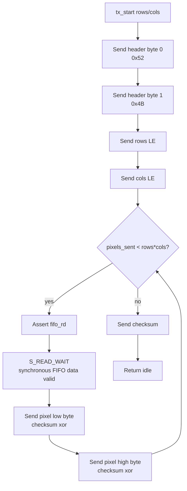

The legacy pipeline above is still the conceptual data path: read pixels, serialize low/high bytes, and compute an XOR checksum. The current tiled implementation wraps the same pixel stream in repeated `TD` packets and emits `RT`/`TE` frame markers.

Tiled response pipeline:

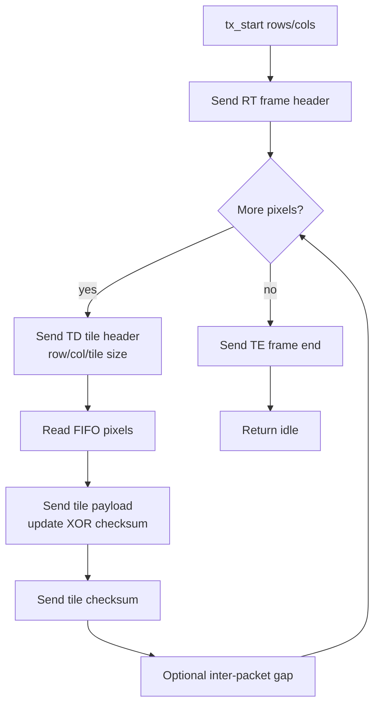

## 11. Host Software Architecture

Host code is in `../python/mandelbrot_host.py`.

Responsibilities:

| Component | Responsibility |
|---|---|
| CLI parser | Accept center, step, max iteration, dimensions, output, mode, port, timeout, verify flag, tiling, soft reset, and quiet progress options. |
| FP encoding | Pack FP64 with Python `struct.pack('<d')`; pack FP128 manually for experimental mode. |
| Command builder | Build little-endian command packet and XOR checksum. |
| Serial transport | Open `COM9` by default at 12000000 baud. |
| Response receiver | Read legacy `RK` or tiled `RT`/`TD`/`TE` responses, validate checksums, and convert to uint16 pixels. |
| Host-driven tiling | Default host stripes plus `--compute-tile-width`, `--compute-tile-height`, and `--tile-retries` split a frame into retryable hardware compute tiles. |
| Soft reset | `--soft-reset` sends `RST!RST!`; failed compute-tile attempts send it automatically unless disabled. |
| Quiet progress | `--quiet` shows a single-line progress bar: `(n / total compute tile)` and `(m / total host tile)`. |
| Renderer | Convert iteration counts to PNG or text output. |
| Software reference | Optional `--verify` computes a Python Mandelbrot image matching RTL coordinate rules. |
| Timing | Print FPGA elapsed, pixels/s, render elapsed, software elapsed, and total elapsed. |

Typical command:

```bash
python python\mandelbrot_host.py --width 1920 --height 1080 --max-iter 512 --center -0.743643887037151 0.13182590420533 --step 0.000005 --timeout 1800 --output python\hw_1080p_zoom.png
```

Recommended high-baud 1080p host-tiled command:

```bash
python python\mandelbrot_host.py --port COM9 --width 1920 --height 1080 --max-iter 128 --center 1.0 1.0 --step 0.002 --timeout 600 --verify --tile-width 1920 --tile-height 120 --tile-retries 3 --quiet --output python\hw_1080p_hosttile_fast_escape.png
```

The tile arguments are optional because the host now enables stripe tiling by default. If compute tile arguments are omitted, the compute tile is the host tile itself, except the compute width is capped at 4096 columns. Use `--full-frame` to disable host tiling for regression tests or controlled single-burst experiments.

### 11.1 Host-Tiled Stability

Current host-tiled stability and benchmark summaries are generated by `../python/host_tile_stability_benchmark.py` into `../python/host_tile_stability_bench/`. Architecture evolution and historical stability results are kept in [ARCHITECTURE_EVOLUTION_REPORT.md](ARCHITECTURE_EVOLUTION_REPORT.md). The host retry mechanism is part of the current architecture: failed compute-tile attempts drain stale UART bytes, issue `RST!RST!`, and recompute the failed tile. Exact HW/SW match is not used as the transport pass criterion for deep scenes because FP64 boundary differences are documented separately.

### 11.2 Software Reference Matching RTL

The reference model uses the same coordinate convention as the RTL:

```python
half_w = (width - 1) >> 1
half_h = (height - 1) >> 1
re_start = center_re - half_w * step
im_start = center_im + half_h * step
```

This is different from a renderer that centers exactly at `width / 2.0` and `height / 2.0`. The integer-center convention is required for bit-for-bit comparison with the RTL pixel grid.

## 12. Verification Strategy

Verification uses several layers.

### 12.1 Unit Simulation

`../sim/tb_fp.v` tests FP add/multiply cases. Coverage includes:

| Category | Examples |
|---|---|
| Zero handling | `0 + x`, `0 * x` |
| Positive multiplication | `2 * 3`, `2.5 * 2.5`, coordinate offset cases |
| Same-sign addition | `1.5 + 3.5` |
| Opposite-sign addition | `-0.75 + 0.1`, `0.5625 + -0.01` |
| Negative same-sign addition | `-0.075 + -0.075` |

Run:

```bash
vivado -mode batch -source sim_fp.tcl
```

### 12.2 Core Simulation

`../sim/tb_core.v` runs the Mandelbrot core against a software reference embedded in the testbench. It covers individual points, a small grid, and a full-size first-pixel regression.

Run:

```bash
vivado -mode batch -source sim_core.tcl
```

Expected pass marker:

```text
=== CORE TEST PASS ===
```

### 12.3 Multicore Simulation

`../sim/tb_multicore.v` instantiates `mandelbrot_multicore` with four workers and checks that the default static merged output stream matches row-major software reference order. `../sim/tb_multicore_dynamic.v` runs the same raster-order check with `SCHED_MODE=1` dynamic idle-core row scheduling.

Run:

```bash
vivado -mode batch -source sim_multicore.tcl
vivado -mode batch -source sim_multicore_dynamic.tcl
```

Expected pass marker:

```text
=== MULTICORE TEST PASS: 192 pixels ===
=== DYNAMIC MULTICORE TEST PASS: 192 pixels ===
```

### 12.4 Response Packetizer And Soft Reset Simulation

Focused response simulations validate tiled response framing independent of the full compute pipeline:

```bash
vivado -mode batch -source sim_tx_ctrl_tiled.tcl
vivado -mode batch -source sim_tx_ctrl_host_tiled_4096.tcl
vivado -mode batch -source sim_cmd_parser_soft_reset.tcl
```

Expected pass markers:

```text
=== TX CTRL TILED TEST PASS: td=7680 pixels=491520 bytes=1067532 ===
=== HOST-TILED 4096 TEST PASS: frames=35 td=262144 pixels=16777216 bytes=36438436 ===
=== CMD PARSER SOFT RESET TEST PASS ===
```

The 4096x4096 test follows the host default geometry: 34 responses of `4096x120` and one tail response of `4096x16`. It checks `RT/TD/TE` framing, per-packet checksum, total packet count, total pixel count, and tail handling.

### 12.5 Host-Side Random Reference Testing

`../python/test_random_compare.py` compares host/software reference conventions across randomized cases. This catches coordinate convention errors, checksum assumptions, and corner cases in command construction.

Example validated command:

```bash
python python/test_random_compare.py --cases 300 --seed 20260608
```

### 12.6 Hardware Smoke Tests

`../python/test_esc.py` sends 1x1-like commands for obvious escape points. It verifies UART RX, command parsing, core start, escape logic, FIFO/TX, and host parsing.

Validated points include:

```text
c=(2.5,0) -> iter=1
c=(2.6,0) -> iter=1
c=(3.0,0) -> iter=1
c=(4.1,0) -> iter=1
```

### 12.7 Hardware Image Verification

For moderate images, the host can run software verification:

```bash
python python\mandelbrot_host.py --verify --width 160 --height 120 --max-iter 256 --output python\verify.png
```

Many tested cases reached `100.00%` match.

For large 1080p or very high iteration tests, `--verify` is normally skipped because Python software rendering becomes slow.

### 12.8 Large-Frame Verification

The 32-bit pixel-count fix was validated with:

```text
320x240 @ 128, center=(1.0,1.0): 76800/76800 match, 22873.22 pixels/s
1920x1080 frames: successful transfer and rendering
```

## 13. Performance Characteristics

The system has two main bottlenecks:

1. UART bandwidth for fast-escaping or low-iteration scenes.
2. FP/core compute for high-iteration zooms.

At 12 Mbaud, the practical UART payload upper bound is roughly:

```text
12000000 bits/s / 10 UART bits/byte / 2 bytes/pixel ~= 600000 pixels/s
```

Measured direct-200MHz fast-scene throughput remains below that theoretical serial payload limit because host/driver overhead, response framing, retry recovery, FIFO pacing, issue slicing, and compute start/finish overhead still matter:

```text
1080p fast escape @128: 453333.47 pixels/s, 10-run mean
1080p standard @64:    450824.12 pixels/s, 10-run mean
```

Current direct-200MHz dynamic + 6-worker + 4-context 10-run examples at 12 Mbaud with `1920x120` host/compute tiles:

| Case | FPGA Time | Throughput | Main limiter |
|---|---:|---:|---|
| `1080p Seahorse zoom @512` | `5.715s` | `366227.26 pps` | Mixed compute/output |
| `1080p deep tendrils @8192` | `8.567s` | `242675.75 pps` | Mostly compute |
| `1080p deep minibrot @8192` | `20.963s` | `98916.27 pps` | Compute-bound |
| `1080p deep Seahorse @1024` | `9.668s` | `214934.36 pps` | Mostly compute |

Fast escape and standard views are transport/host/issue-overhead sensitive. The current 6-worker direct-200MHz default is faster than the previous 4-worker direct-200MHz point on every measured scene, with the largest gains in compute-heavy views. Historical performance comparisons are kept in [ARCHITECTURE_EVOLUTION_REPORT.md](ARCHITECTURE_EVOLUTION_REPORT.md) and [WORKER_COUNT_SCALING.md](WORKER_COUNT_SCALING.md).

The latest direct-200MHz 10-run stability summary is:

| Scene | Transport pass | Retry events | Mean FPGA s | Min | Max | CV | Mean pps | vs 100MHz 4ctx |
|---|---:|---:|---:|---:|---:|---:|---:|---:|
| fast escape @128 | `10/10` | `2` | `4.641` | `4.423` | `6.592` | `14.77%` | `453333.47` | `1.009x` |
| standard @64 | `10/10` | `2` | `4.636` | `4.416` | `5.515` | `9.92%` | `450824.12` | `1.247x` |
| Seahorse zoom @512 | `10/10` | `2` | `5.715` | `5.418` | `6.937` | `10.87%` | `366227.26` | `1.721x` |
| deep tendrils @8192 | `10/10` | `1` | `8.567` | `8.409` | `9.968` | `5.75%` | `242675.75` | `2.063x` |
| deep mini-brot @8192 | `10/10` | `0` | `20.963` | `20.962` | `20.965` | `0.00%` | `98916.27` | `2.106x` |
| deep Seahorse @1024 | `10/10` | `1` | `9.668` | `9.511` | `11.065` | `5.08%` | `214934.36` | `2.065x` |

## 14. Resource Use

Latest representative default direct-200MHz dynamic + 6-worker + 4-context FP64 routed utilization:

| Resource | Used | Device | Utilization |
|---|---:|---:|---:|
| Slice LUTs | 29891 | 41000 | 72.90% |
| Slice Registers | 25501 | 82000 | 31.10% |
| DSP48E1 | 97 | 240 | 40.42% |
| Block RAM Tile | 13.5 | 135 | 10.00% |

Latest routed timing for the current default build:

| Build | Scheduler | Workers | Worker contexts | WNS | TNS | WHS | THS |
|---|---|---:|---:|---:|---:|---:|---:|
| `../build_fp64.tcl` | Direct-200MHz dynamic idle-core rows + tiled response | 6 | 4 | 0.003 ns | 0.000 ns | 0.042 ns | 0.000 ns |
| `../build_fp64_100mhz.tcl` | 100MHz reference dynamic idle-core rows + tiled response | 4 | 4 | 0.583 ns | 0.000 ns | 0.039 ns | 0.000 ns |

The current default is the timing-fixed 6-worker direct-200MHz build. It uses more LUTs and DSPs than the previous 4-worker direct-200MHz default, but it is timing-clean and is the fastest validated point across the six-scene 1080p set. Many fast scenes still approach host/transport limits, so further compute replication is less valuable than transport and protocol improvements unless the target view is compute-heavy.

## 15. Known Limitations

| Limitation | Details |
|---|---|
| Static 4-core scheduler | Regression mode. Interleaved rows balance many views, but strict raster ordering can still wait on a slower row. |
| Dynamic row scheduler | Default mode. Reclaims row-level tail imbalance while preserving strict raster output. It gates row reuse on an empty per-core FIFO to avoid UART-backpressure deadlock. |
| Four-context worker | Default per-worker pipeline on XC7K70T. It improves standard/deep scenes in direct-200MHz mode by keeping each worker's shared FP units busier. |
| Six-worker default | Current best validated point. The timing fix removes the original 6-worker 200MHz route-dominated dispatcher/worker-control failures. |
| Generic 8-context worker | Not a validated default; higher-context work needs a lower-LUT shape. See `PIPELINE_BUBBLE_ANALYSIS.md`. |
| Direct-200MHz mode | Current default. Timing-clean and hardware-benchmarked at six workers; the 100MHz 4ctx build remains an explicit reference. |
| UART output | 12 Mbaud raises the payload ceiling to about 600000 pixels/s, but long multi-megabyte bursts can still show occasional host/FT232HL receive instability without packet-level retransmission. |
| FP64 precision | Very deep zooms below approximately `1e-12` to `1e-14` pixel step become precision-sensitive. |
| FP units are IEEE-like, not full IEEE-754 | No full NaN/Inf/denormal/rounding support. |
| FP128 mode exists structurally | Most validation and performance work has focused on FP64. |
| Max iteration field is 16-bit | Maximum supported `max_iter` is 65535. |

## 16. Future Improvement Directions

Most valuable next steps:

1. Add a higher-bandwidth transport, such as USB FIFO, SPI, Ethernet, or memory-mapped PS interface on Zynq.
2. Add row/tile IDs to the response protocol so the host can accept out-of-order rows or tiles.
3. Extend the current dynamic row scheduler toward dynamic tiles once the protocol can carry coordinates.
4. Add packet-level framing, sequence numbers, and retransmission or a higher-bandwidth transport if UART must remain near 12 Mbaud.
5. Add cardioid and period-2 bulb classification to skip interior pixels quickly.
6. Evaluate fixed-point arithmetic for Mandelbrot-specific deep zoom windows.
7. Validate and optimize FP128 mode for deeper zooms beyond FP64 precision comfort.

## 17. Build And Run Commands

Simulation:

```bash
vivado -mode batch -source sim_fp.tcl
vivado -mode batch -source sim_core.tcl
vivado -mode batch -source sim_multicore.tcl
vivado -mode batch -source sim_multicore_dynamic.tcl
```

Build and program:

```bash
vivado -mode batch -source build_fp64.tcl
vivado -mode batch -source program.tcl
```

Optional 100MHz reference build:

```bash
vivado -mode batch -source build_fp64_100mhz.tcl
```

Small direct-200MHz hardware gate:

```bash
vivado -mode batch -source program.tcl -tclargs ./fp64_proj/mandelbrot_fp64.runs/impl_1/top.bit
python python\mandelbrot_host.py --width 160 --height 120 --max-iter 256 --center -0.5 0.0 --step 0.005 --output python\hw_xc7k70t_ctx4_200mhz_small_verify.png --verify --quiet
```

Optional dynamic scheduler build:

```bash
vivado -mode batch -source build_fp64_dynamic.tcl
```

Small hardware verification:

```bash
python python\test_esc.py
python python\mandelbrot_host.py --verify --width 160 --height 120 --max-iter 256 --output python\verify_160x120.png
```

1080p render example:

```bash
python python\mandelbrot_host.py --width 1920 --height 1080 --max-iter 512 --center -0.743643887037151 0.13182590420533 --step 0.000005 --timeout 1800 --output python\hw_1080p_zoom.png
```
