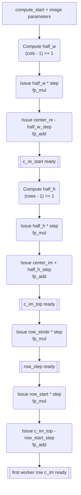
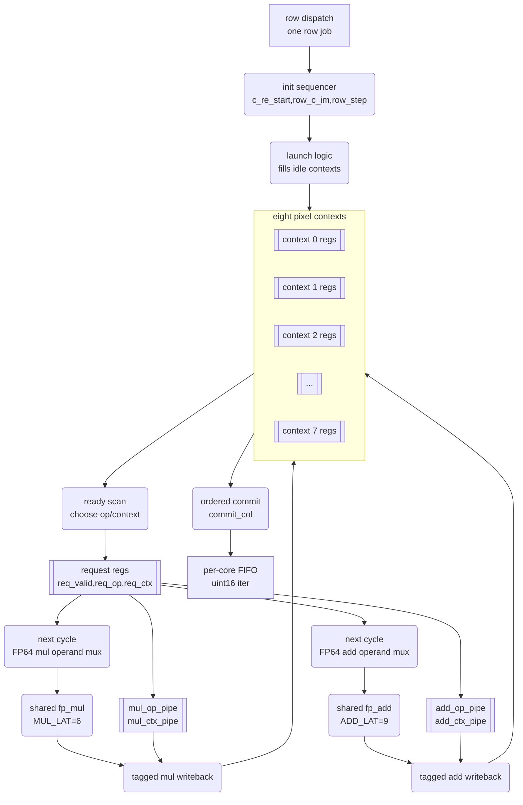
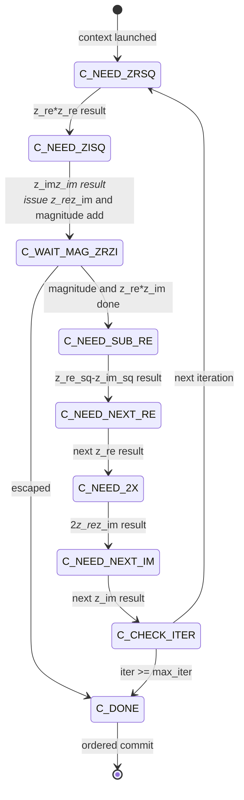
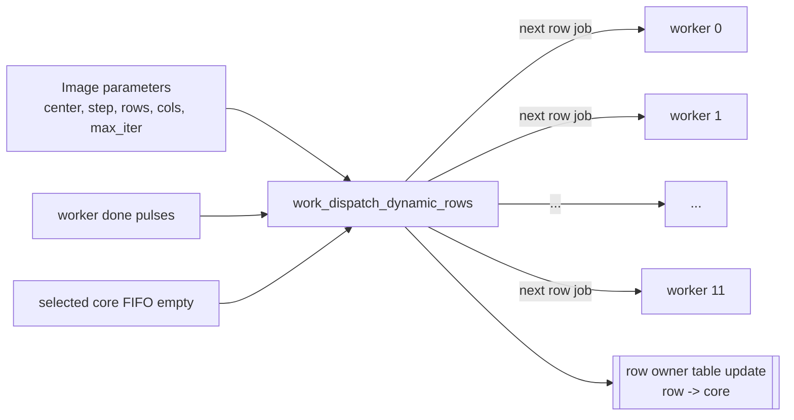
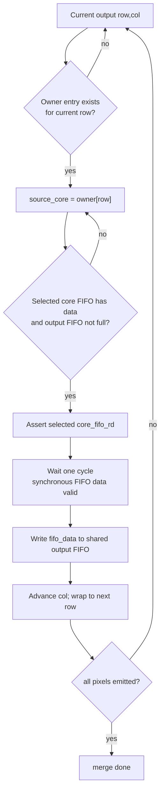
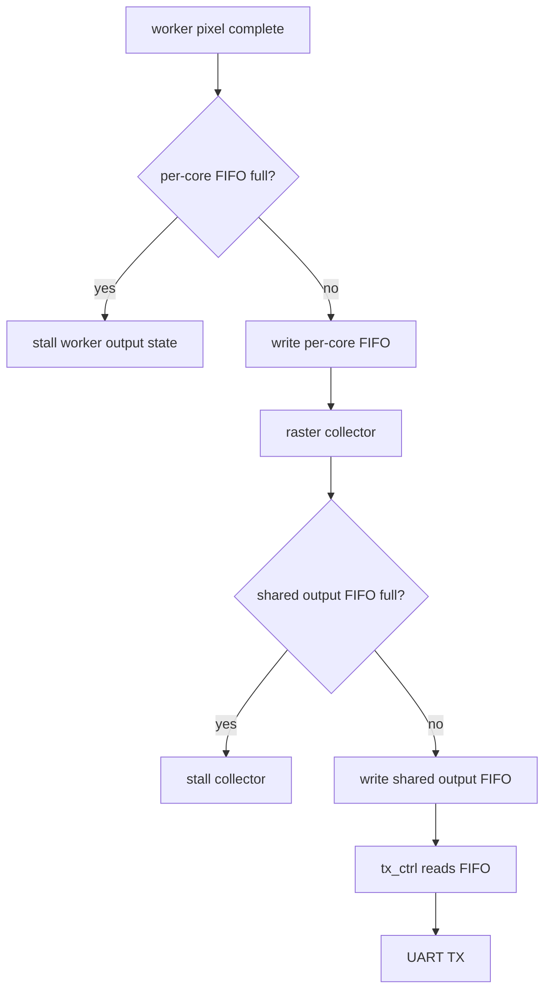
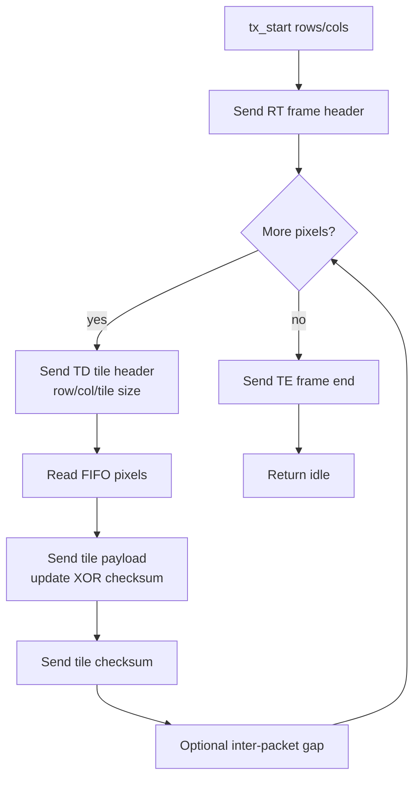

# Mandelbrot FPGA Accelerator Architecture

## 1. Overview

This project implements a UART-controlled FPGA Mandelbrot accelerator. The current validated board target is VMC_RTSB ZU4EV using Vivado part `xczu4ev-sfvc784-1-i`. The board supplies a single-ended `24.576 MHz` `sys_clk`, and the accepted design runs the UART, command parser, compute datapath, FIFOs, response packetizer, and LED/status logic in one synchronous clock domain.

The host sends one binary image or tile command containing dimensions, center coordinate, pixel step, precision flag, maximum iteration count, and checksum. The FPGA computes FP64 Mandelbrot iteration counts with 12 row workers, each worker interleaving 8 live pixel contexts over one shared FP64 multiplier and one shared FP64 adder. Dynamic row scheduling assigns rows to idle workers, a raster collector restores strict row-major output order, and `tx_ctrl` streams tiled `RT` / `TD` / `TE` response packets back over UART.

The current accepted deployment point is:

| Item | Value |
|---|---:|
| Board | VMC_RTSB ZU4EV |
| FPGA part | `xczu4ev-sfvc784-1-i` |
| Input clock | Single-ended `sys_clk`, `24.576 MHz` |
| Constraint file | `../constraints_vmc_rtsb_zu4ev/led.xdc` |
| UART pins | FPGA RX `D12`, FPGA TX `C12` |
| Host serial port | `COM6` |
| UART baud | `6,144,000` baud |
| Host command pacing | `--tx-byte-gap 0.00005` |
| Floating-point mode | FP64 |
| Worker count | `12` |
| Pixel contexts per worker | `8` |
| Scheduler | Dynamic idle-core row scheduling (`SCHED_MODE=1`) |
| Dynamic owner depth | `4096` rows per hardware command |
| Core FIFO depth | `4096` entries per worker |
| Output FIFO depth | `1024` 16-bit pixels |
| RTL response tile width | `64` columns |
| FPU tag latency | `MUL_LAT=6`, `ADD_LAT=9` |
| Largest validated image | `1920x1080` |
| Final six-scene result | `6/6 PASS`, `0` retry events |

Accepted bitstream path:

```text
../fp64_zu4ev_proj/mandelbrot_fp64.runs/impl_1/top.bit
```

The detailed optimization and board validation log is [VMC_RTSB_ZU4EV_24576_OPT_REPORT.md](VMC_RTSB_ZU4EV_24576_OPT_REPORT.md). Historical XC7K70T direct-200MHz and 100MHz architectures remain documented in [ARCHITECTURE_EVOLUTION_REPORT.md](ARCHITECTURE_EVOLUTION_REPORT.md), [200MHZ_ATTEMPT_REPORT.md](200MHZ_ATTEMPT_REPORT.md), and [WORKER_COUNT_SCALING.md](WORKER_COUNT_SCALING.md), but they are no longer the current board target.

## 2. Top-Level Architecture

Top-level integration is in `../rtl/top.v`.

```text
Host PC
  |
  | UART command: center, step, rows, cols, max_iter, checksum
  v
uart_rx
  |
  v
cmd_parser
  |
  | compute_start + image parameters
  v
mandelbrot_multicore
  |        |
  |        +-- work_dispatch_dynamic_rows
  |        +-- 12 x mandelbrot_core_worker_kctx
  |        +-- per-worker result FIFOs
  |        +-- raster_collect_dynamic_rows
  v
queue, 1024 x 16-bit shared output FIFO
  |
  v
tx_ctrl, RT/TD/TE tiled response packetizer
  |
  v
uart_tx
  |
  v
Host PC
```

The main modules are:

| Module | File | Role |
|---|---|---|
| `top` | `../rtl/top.v` | ZU4EV top-level integration: `sys_clk` BUFG, reset, UART, parser, multicore engine, output FIFO, TX controller, LEDs. |
| `uart_rx` | `../rtl/uart_rx.v` | 8N1 UART receiver. Current high-baud path uses integer clocks-per-bit with three-point majority sampling. |
| `uart_tx` | `../rtl/uart_tx.v` | 8N1 UART transmitter using fractional accumulator timing. |
| `cmd_parser` | `../rtl/cmd_parser.v` | Parses command packets, checks XOR checksum, recognizes soft reset sequence, and emits `compute_start`. |
| `mandelbrot_multicore` | `../rtl/mandelbrot_multicore.v` | Parameterized worker wrapper, scheduler, per-worker FIFOs, raster collector, and frame-done/`tx_start` generation. |
| `work_dispatch_static_rows` | `../rtl/work_dispatch_static_rows.v` | Static interleaved-row scheduler retained for regression builds. |
| `work_dispatch_dynamic_rows` | `../rtl/work_dispatch_dynamic_rows.v` | Accepted scheduler. Assigns one row at a time to idle workers and records row ownership. |
| `mandelbrot_core_worker_kctx` | `../rtl/mandelbrot_core_worker_kctx.v` | Accepted multi-context worker. Interleaves 8 pixel contexts over one FP64 multiplier and one FP64 adder. |
| `mandelbrot_core_worker_2ctx` | `../rtl/mandelbrot_core_worker_2ctx.v` | Historical lower-context worker retained for comparison/regression. |
| `mandelbrot_core_worker` | `../rtl/mandelbrot_core_worker.v` | Single-context regression worker. |
| `raster_merge_static_rows` | `../rtl/raster_merge_static_rows.v` | Static scheduler result merger. |
| `raster_collect_dynamic_rows` | `../rtl/raster_collect_dynamic_rows.v` | Accepted dynamic row collector. Uses row-owner table to drain worker FIFOs in raster order. |
| `fp_mul` | `../rtl/fp_mul.v` | FP64-oriented multiplier pipeline. |
| `fp_add` | `../rtl/fp_add.v` | FP64-oriented adder/subtractor pipeline. |
| `queue` | `../rtl/queue.v` | Synchronous FIFO used for per-worker and output buffering. |
| `tx_ctrl` | `../rtl/tx_ctrl.v` | Drains output FIFO, emits legacy or tiled response packets, computes payload checksums. |
| `debug_leds` | `../rtl/debug_leds.v` | Board LED/status mapping separated from the compute datapath. |

## 3. Board-Level Hardware Integration

The ZU4EV board integration intentionally removed the older XC7K70T differential clock/MMCM path. The accepted top-level clocking path is:

```text
sys_clk port -> BUFG -> single internal sys_clk domain
```

There is no CDC between UART, command parser, compute datapath, FIFOs, and TX controller. The only asynchronous input in normal operation is the external UART RX pin, which is synchronized inside `uart_rx` before start-bit detection.

Current key constraints:

| Port | Package pin | I/O standard | Notes |
|---|---|---|---|
| `sys_clk` | `E10` | `LVCMOS25` | Single-ended 24.576 MHz input. |
| `rst_n` | `D14` | `LVCMOS25`, pull-up | Active-low reset input. |
| `uart_rx` | `D12` | `LVCMOS25` | Host-to-FPGA UART data. |
| `uart_tx` | `C12` | `LVCMOS25` | FPGA-to-host UART data. |
| `led[2]` | `A11` | `LVCMOS25` | Debug/status LED. |
| `led[3]` | `A12` | `LVCMOS25` | Debug/status LED. |

The clock constraint is:

```tcl
create_clock -name sys_clk -period 40.690 [get_ports sys_clk]
```

The UART pin naming is FPGA-side naming. Final board probing showed FPGA TX is `C12` and FPGA RX is `D12`. TX-pattern, RX-scope, echo, burst-capture, raw-probe, small-frame verify, and full 1080p scene tests were used to confirm the final mapping.

## 4. Configuration System

Source defaults are centralized in `../rtl/config.vh`. Build scripts may override top-level parameters with Vivado generics, but the current source defaults match the accepted ZU4EV deployment:

| Macro | Default | Used by | Purpose |
|---|---:|---|---|
| `CFG_CLK_HZ` | `24576000` | UART, top-level generics | System clock frequency. |
| `CFG_DIRECT_200MHZ` | `1` | `top` compatibility path | Historical name; current ZU4EV path still means direct single-clock operation. |
| `CFG_UART_BAUD` | `6144000` | UART RX/TX | Accepted high-baud project-body UART rate. |
| `CFG_UART_ACC_WIDTH` | `32` | UART TX and compatibility timing | Fractional accumulator width. |
| `CFG_CORE_COUNT` | `12` | `top`, `mandelbrot_multicore` | Number of worker instances. |
| `CFG_CORE_FIFO_DEPTH` | `4096` | worker FIFOs | Per-worker result buffering. |
| `CFG_OUTPUT_FIFO_DEPTH` | `1024` | shared output FIFO | Buffer between raster collector and TX controller. |
| `CFG_RESPONSE_TILE_COLS` | `64` | `tx_ctrl` | Maximum `TD` packet width. |
| `CFG_RESPONSE_TILE_GAP_CYCLES` | `1000` | `tx_ctrl` | Optional inter-packet idle gap. |
| `CFG_SCHED_MODE` | `1` | multicore wrapper | `0` static rows, `1` dynamic rows. |
| `CFG_DYNAMIC_OWNER_DEPTH` | `4096` | dynamic collector | Maximum rows tracked per hardware command. |
| `CFG_WORKER_CONTEXTS` | `8` | multicore wrapper | Live pixel contexts per worker. |
| `CFG_WORKER_MUL_LAT` | `6` | kctx worker | Multiplier result tag latency. |
| `CFG_WORKER_ADD_LAT` | `9` | kctx worker | Adder result tag latency. |

The accepted default build is `../build_fp64.tcl`; it explicitly uses the ZU4EV part, `../constraints_vmc_rtsb_zu4ev/led.xdc`, `CLK_HZ=24576000`, `CORE_COUNT=12`, and `WORKER_CONTEXTS=8`. Parameter sweeps use `../build_fp64_zu4ev_24576_sweep.tcl`. The old `build_fp64_200mhz.tcl` file is only a compatibility wrapper to the ZU4EV sweep script.

## 5. Command And Response Protocol

The host/FPGA protocol is binary, little-endian, and frame-oriented. The host sends one command per hardware image/tile request. The FPGA sends one response frame for that command.

### 5.1 Host-To-FPGA Command

FP64 command length is 33 bytes. FP128 command length is structurally supported at 57 bytes, but the current validated performance path is FP64.

FP64 packet layout:

| Offset | Size | Field |
|---:|---:|---|
| 0 | 1 | Magic byte `0x4D`. |
| 1 | 1 | Precision flag, bit0 `0=FP64`, `1=FP128`. |
| 2 | 2 | `rows`, uint16 LE. |
| 4 | 2 | `cols`, uint16 LE. |
| 6 | 2 | `max_iter`, uint16 LE. |
| 8 | 8 | `center_re`, FP64 LE. |
| 16 | 8 | `center_im`, FP64 LE. |
| 24 | 8 | `step`, FP64 LE. |
| 32 | 1 | XOR checksum over all previous bytes. |

`cmd_parser` accepts a command only when the XOR including the checksum is zero. It also recognizes the soft reset sequence `RST!RST!` in any parser state and emits a reset pulse that clears the parser, compute engine, output FIFOs, and TX controller.

At `6.144 Mbaud`, the host must send the 33-byte command with `--tx-byte-gap 0.00005`. This is not a throughput issue because commands are tiny compared with image payloads. It is a board-level RX margin workaround: continuous host-to-FPGA command bursts at 4 FPGA clocks per UART bit were observed to corrupt or drop bytes.

### 5.2 FPGA-To-Host Response

The current response format is tiled:

```text
RT rows(u16) cols(u16)
TD row(u16) col(u16) tile_rows(u16) tile_cols(u16) payload checksum
TD ...
TE rows(u16) cols(u16)
```

All pixel payload entries are `uint16` iteration counts, little-endian. The payload checksum is XOR over the tile payload bytes. Header integrity is checked by the host through magic, dimensions, bounds, expected payload length, complete-pixel coverage, and final `TE` dimensions.

The legacy `RK rows cols payload checksum` full-frame parser remains in the Python host for older bitstreams, but the accepted ZU4EV path uses `RT` / `TD` / `TE` tiled responses.

## 6. Clocking, Reset, And Timing Philosophy

The design intentionally keeps one clock domain. Earlier project phases used 100 MHz or direct 200 MHz on other boards; the current ZU4EV board clock is much lower at 24.576 MHz. That changes the optimization target:

| Earlier high-clock branch | Current ZU4EV branch |
|---|---|
| Timing closure and route delay were primary constraints. | Timing closure has large slack. |
| More pipeline cuts were often required for 200 MHz. | Pipeline cuts are not needed for Fmax at 24.576 MHz. |
| Worker count was limited by timing and resources. | Worker/context balance is mainly LUT/PPC constrained. |

The accepted build has route WNS `25.024 ns` against a `40.690 ns` period. That large margin does not mean arbitrary FPU latency can be reduced. The worker uses operation/context tags aligned to actual FPU output timing; consuming outputs earlier caused large image mismatches in RTL simulation. Therefore the current safe timing model is:

```text
MUL_LAT = 6
ADD_LAT = 9
FP_CE_DIV = 1
one useful internal compute cycle per sys_clk
```

## 7. Floating-Point Datapath

The compute path uses project-local FP units rather than vendor floating-point IP. They are IEEE-like enough for Mandelbrot rendering and host/reference comparison, but they do not implement a complete IEEE-754 feature set. The design primarily targets normalized FP64 values used by the Mandelbrot algorithm.

Each accepted worker instantiates:

| Unit | Count per worker | Role |
|---|---:|---|
| `fp_mul` | 1 | `z_re*z_re`, `z_im*z_im`, `z_re*z_im`, coordinate setup multiplies. |
| `fp_add` | 1 | magnitude add, subtract `z_re_sq-z_im_sq`, add constants, double `z_re_z_im`. |

The worker schedules operations onto these two shared FP units. A worker does not instantiate separate FP units for each mathematical expression. This choice keeps DSP usage modest and makes context count important: enough contexts must be live to keep the shared pipelines busy while earlier operations are waiting for results.

Important numerical behavior:

| Topic | Current behavior |
|---|---|
| Precision | FP64 is the validated board path. |
| Rounding | RTL arithmetic differs slightly from Python IEEE round-to-nearest-even behavior. |
| Boundary pixels | Deep zoom exact SW match can be below 100% because Mandelbrot boundary dynamics amplify tiny FP differences. |
| Transport pass criteria | Full-frame receipt, valid checksums, and no unrecovered tile failures are the board-level stability criteria. |

The boundary-difference analysis is documented separately in [FP64_BOUNDARY_DIFFERENCE_ANALYSIS.md](FP64_BOUNDARY_DIFFERENCE_ANALYSIS.md).

## 8. Mandelbrot Worker Architecture

For each pixel, the worker iterates:

```text
z_{n+1} = z_n^2 + c

z_re_next = z_re^2 - z_im^2 + c_re
z_im_next = 2 * z_re * z_im + c_im
escape if z_re^2 + z_im^2 > 4
```

The accepted `mandelbrot_core_worker_kctx` instance maintains 8 live pixel contexts. Each context contains its coordinate, current `z`, delayed intermediate values, iteration count, per-context state, and pending ordered-commit result.

Per-context state includes:

| State | Purpose |
|---|---|
| `c_c_re`, `c_c_im` | Pixel coordinate. |
| `c_z_re`, `c_z_im` | Current complex value. |
| `c_z_re_sq`, `c_z_im_sq`, `c_z_re_z_im` | FP intermediates. |
| `c_iter` | Current iteration count. |
| `c_col` | Worker-local output column. |
| `c_state` | Per-context micro-state. |
| `c_result_valid`, `c_result_iter` | Completed pixel waiting for ordered commit. |

### 8.1 Coordinate Generation

The host supplies the center coordinate and pixel step. RTL and host software use the same integer-center convention:

```text
half_w = (cols - 1) >> 1
half_h = (rows - 1) >> 1

c_re_start = center_re - half_w * step
c_im_start = center_im + half_h * step
```

For host-driven tiles, Python computes a tile-local center so each hardware tile produces exactly the same coordinates as the matching rectangle in a monolithic full-frame command. This avoids seams between tiles.

Worker coordinate initialization pipeline:



In dynamic mode, each job is one full row: `row_start` is the assigned row, and `row_stride=rows`, so the worker exits after completing that row.

### 8.2 Context Scheduling And Tagged Writeback

The worker scans contexts for ready operations, selects one operation/context for the multiplier and/or adder path, registers the request, drives operands on the following cycle, and inserts operation/context tags into latency-aligned shift registers.



Accepted tag latencies:

| Tag path | Latency | Purpose |
|---|---:|---|
| `mul_op_pipe`, `mul_ctx_pipe` | 6 cycles | Route `fp_mul` output to the correct context and destination. |
| `add_op_pipe`, `add_ctx_pipe` | 9 cycles | Route `fp_add` output to the correct context and destination. |

Per-context Mandelbrot iteration state flow:



Issue timing:

```text
Cycle N:         scan contexts, choose ready operation, latch req_valid/req_op/req_ctx
Cycle N+1:       drive FPU operands and insert operation/context tag
Cycle N+latency: delayed tag selects context and destination for writeback
```

The worker commits results in local column order. A later context can finish earlier, but it waits until `commit_col` reaches that pixel. This preserves the per-worker FIFO contract and makes downstream raster restoration simpler.

### 8.3 Escape Check

Escape is detected by checking whether:

```text
z_re^2 + z_im^2 > 4.0
```

The RTL includes quick checks on each squared term and on the magnitude sum. Exact `4.0` does not escape; values greater than `4.0` escape. This matches the Mandelbrot boundary convention used by the host reference.

### 8.4 Latency Retiming Attempt

At `24.576 MHz`, there is ample timing slack, so it was tempting to reduce apparent per-iteration latency by consuming FP results earlier. The worker was parameterized with `CFG_WORKER_MUL_LAT` and `CFG_WORKER_ADD_LAT` to test this explicitly.

Large `120x160`, `max_iter=128` RTL simulation results:

| Override | Result |
|---|---|
| `MUL_LAT=6`, `ADD_LAT=9` | PASS, accepted default. |
| `MUL_LAT=4`, `ADD_LAT=7` | FAIL, about 1902 pixel mismatches. |
| `MUL_LAT=5`, `ADD_LAT=8` | FAIL, about 1902 pixel mismatches. |
| `MUL_LAT=6`, `ADD_LAT=8` | FAIL, about 1902 pixel mismatches. |
| `MUL_LAT=5`, `ADD_LAT=9` | FAIL, about 1902 pixel mismatches. |

Conclusion: the current FPU output timing and worker tag alignment require `6/9`. A real latency reduction must restructure `fp_mul.v` and/or `fp_add.v`, add a dedicated latency scoreboard, and repeat RTL/build/board validation.

## 9. Multicore Scheduling And Raster Collection

`mandelbrot_multicore` supports compile-time scheduler selection:

| `SCHED_MODE` | Dispatcher | Collector | Status |
|---:|---|---|---|
| `0` | `work_dispatch_static_rows` | `raster_merge_static_rows` | Static regression path. |
| `1` | `work_dispatch_dynamic_rows` | `raster_collect_dynamic_rows` | Accepted board path. |

Dynamic scheduling assigns one full row to the first available worker. The dispatcher records `row -> core` ownership in an owner table, then the raster collector drains the owning worker FIFO when that row becomes next in raster order.

Dynamic dispatch structure:



The empty-FIFO guard is deliberate. If a core were reused while its earlier row was still buffered, future rows could fill a worker FIFO while the raster collector waits for an earlier row, creating a strict-raster backpressure deadlock. Requiring the selected worker FIFO to be empty before assigning another row bounds per-core queued work and preserves forward progress under UART backpressure.

Raster collection pipeline:



`DYNAMIC_OWNER_DEPTH=4096` means each hardware command can track 4096 rows. Host tiling makes this sufficient for large logical images because each hardware tile is a separate command with local row coordinates. The logical full image can exceed 4096 rows if the host splits it into safe tile heights.

## 10. Output Buffering And Backpressure

The design is fully streaming and does not hold a frame-sized buffer. Backpressure flows from UART to TX controller, output FIFO, raster collector, per-core FIFOs, and workers.



`queue.v` has synchronous read behavior. Consumers assert read enable, wait one cycle for valid `data_out`, then consume the value. Both `raster_collect_dynamic_rows` and `tx_ctrl` follow this read-wait pattern.

## 11. UART Design And High-Baud Timing

UART is 8N1 with no parity and no hardware flow control.

### 11.1 TX Timing

`uart_tx` uses a fractional accumulator style transmitter. This keeps long-term baud average accurate when the requested baud is not an integer divisor of the FPGA clock.

At `24.576 MHz` and `6.144 Mbaud`, the average bit period is exactly 4 FPGA clocks. The TX path is therefore straightforward and has been stable for image payload return.

### 11.2 RX Timing

The high-baud RX path is more constrained. At `6.144 Mbaud`, there are only four FPGA clocks per UART bit. The current `uart_rx` uses integer clocks-per-bit and three-point majority sampling. Two important fixes were made during bring-up:

| RX issue | Fix |
|---|---|
| Final sample of a bit was not included in same-cycle majority decision. | Added next-sample sum so the third sample participates in the decision. |
| Back-to-back frames could miss a start bit if the line was already low at stop-bit completion. | Stop state can immediately enter start handling when line is low. |

These fixes made the RX implementation more correct, but they did not make continuous `6.144 Mbaud` 33-byte command bursts fully reliable. The accepted system-level solution is host command byte pacing.

Validated UART behavior:

| Baud | FPGA clocks/bit | Result |
|---:|---:|---|
| `1,536,000` | 16 | Echo bring-up passed. |
| `3,072,000` | 8 | Full project body passed small-frame and six-scene 1080p. |
| `4,096,000` | 6 | Echo-only passed; full project without command pacing did not respond. |
| `6,144,000` | 4 | Accepted with `--tx-byte-gap 0.00005`. |
| `8,192,000` | 3 | Echo failed. |

The key diagnostic was `uart_rx_burst_capture_top`: echo tests send one byte and wait for one byte, so they add a large implicit inter-byte gap. The Mandelbrot command is a continuous 33-byte burst. Burst capture showed missing/corrupt command bytes at high baud without pacing, but exact command capture with a 50 us byte gap.

## 12. TX Controller And Tiled Response

`tx_ctrl.v` drains the shared output FIFO and serializes response packets. The tiled protocol gives the host bounded packet checks and a way to retry hardware compute tiles if a packet fails.

Supported response markers:

| Marker | Meaning |
|---|---|
| `RT` | Tiled response frame header with rows/cols. |
| `TD` | Tiled data packet with row/col/tile size and payload checksum. |
| `TE` | Tiled response frame end with rows/cols. |
| `RK` | Legacy full-frame response, still accepted by host for old bitstreams. |

Tiled TX pipeline:



With `CFG_RESPONSE_TILE_COLS=64`, a `1920x120` hardware response contains:

```text
120 * ceil(1920 / 64) = 3600 TD packets
payload bytes = 1920 * 120 * 2 = 460800
TD overhead = 3600 * 11 = 39600 bytes
```

The FPGA does not implement packet replay. If the host detects a bad `TD`, the host drains the serial stream, optionally sends `RST!RST!`, and recomputes the current hardware tile. This keeps FPGA memory use low.

## 13. Host Software Architecture

Host code is in `../python/mandelbrot_host.py`.

Responsibilities:

| Component | Responsibility |
|---|---|
| CLI parser | Accepts geometry, zoom parameters, max iterations, output format, UART port/baud, tile settings, reset, quiet mode, and verification options. |
| FP encoding | Packs FP64 with Python `struct.pack('<d')`; FP128 packing exists for experimental paths. |
| Command builder | Builds the little-endian command packet and XOR checksum. |
| Serial transport | Opens `COM6` by default at `6144000` baud. |
| Command pacing | Sends command bytes with optional `--tx-byte-gap`, required for accepted high-baud mode. |
| Response parser | Accepts legacy `RK` and current `RT` / `TD` / `TE` responses. |
| Host tiling | Splits large logical images into hardware commands and assembles returned subframes. |
| Retry/recovery | Retries failed hardware tiles after drain/reset when tile parsing fails. |
| Renderer | Converts iteration counts to PNG/BMP/text with selectable palettes. |
| Software reference | Optional `--verify` computes a matching Python Mandelbrot reference. |
| Timing | Prints FPGA elapsed time, pixel throughput, render time, software reference time, and total host time. |

Typical accepted small verification command:

```powershell
python python\mandelbrot_host.py --port COM6 --baud 6144000 --tx-byte-gap 0.00005 --width 160 --height 120 --max-iter 128 --center -0.5 0.0 --step 0.005 --timeout 180 --verify --tile-width 160 --tile-height 120 --tile-retries 1 --output python\hw_24576_160x120_6144k.png
```

Recommended six-scene benchmark wrapper:

```powershell
python python\host_tile_stability_benchmark.py --port COM6 --baud 6144000 --tx-byte-gap 0.00005 --runs 1 --tile-width 1920 --tile-height 120 --tile-retries 3 --run-tag zu4ev24576_6144k_c12ctx8 --summary-name zu4ev24576_6144k_c12ctx8_6scene.md
```

### 13.1 Host Tile Geometry

The host can split a logical full image into hardware tiles. The tile-local center is computed to preserve the same integer-center coordinate convention as a monolithic full-frame command:

```python
full_half_w = (width - 1) >> 1
full_half_h = (height - 1) >> 1
subtile_half_w = (cw - 1) >> 1
subtile_half_h = (ch - 1) >> 1
subtile_center_re = center_re + (cx0 + subtile_half_w - full_half_w) * step
subtile_center_im = center_im + (full_half_h - (cy0 + subtile_half_h)) * step
```

This keeps adjacent hardware tiles seam-free.

### 13.2 Software Reference

The software reference mirrors RTL coordinate generation:

```python
half_w = (width - 1) >> 1
half_h = (height - 1) >> 1
re_start = center_re - half_w * step
im_start = center_im + half_h * step
```

Do not compare against a renderer centered at `width / 2.0` and `height / 2.0`; that uses a different pixel grid.

## 14. Verification Strategy

The current project uses layered verification.

| Layer | Tool/command | Purpose |
|---|---|---|
| FP unit simulation | `sim_fp.tcl`, `sim_fp_latency.tcl` | FP add/mul functional and latency checks. |
| Core simulation | `sim_core.tcl` | Single-core point/grid tests. |
| Multicore simulation | `sim_multicore_dynamic_contexts.tcl` | Dynamic scheduler, row collector, worker/context counts, and latency overrides. |
| Packetizer simulation | `sim_tx_ctrl_tiled.tcl`, `sim_tx_ctrl_host_tiled_4096.tcl` | Response packet/count/checksum/tail behavior. |
| Parser simulation | `sim_cmd_parser_soft_reset.tcl` | Command and soft reset behavior. |
| UART diagnostics | echo, TX-pattern, RX-scope, burst-capture tops | Board pin, baud, and burst RX validation. |
| Raw board probe | `python/uart_raw_probe.py` | Confirms command path and tiled response header. |
| Small board verify | `mandelbrot_host.py --verify 160x120` | End-to-end numerical and transport gate. |
| Six-scene benchmark | `host_tile_stability_benchmark.py` | 1080p stability/performance gate. |

Representative accepted RTL simulation:

```powershell
& "Z:\Softwares\Xilinx\Vivado\2024.2\bin\vivado.bat" -mode batch -source sim_multicore_dynamic_contexts.tcl -tclargs WORKER_CONTEXTS=8 CORE_COUNT=12 ROWS=120 COLS=160 MAX_ITER=128 CORE_FIFO_DEPTH=4096 DYNAMIC_OWNER_DEPTH=4096 TIMEOUT_CYCLES=60000000 -nolog -nojournal
```

The accepted hardware gate sequence was:

1. RTL simulation for the worker/context candidate.
2. Vivado synthesis, implementation, timing, and utilization review.
3. Program bitstream through `program.tcl` using Vivado hardware auto-connect.
4. 1x1 raw probe at selected baud and byte gap.
5. `160x120` software-verified image.
6. Six standard 1080p scenes with `--verify` and host tiles `1920x120`.

## 15. Timing, Resource Use, And Performance

Accepted `12 workers / 8 contexts @ 24.576 MHz / 6.144 Mbaud` route result:

| Metric | Value |
|---|---:|
| WNS | `25.024 ns` |
| TNS | `0.000 ns` |
| WHS | `0.010 ns` |
| CLB LUTs | `84,949 / 87,840 = 96.71%` |
| LUT as Logic | `81,937 / 87,840 = 93.28%` |
| CLB Registers | `71,408 / 175,680 = 40.65%` |
| Block RAM Tile | `25.5 / 128 = 19.92%` |
| DSPs | `121 / 728 = 16.62%` |

The accepted build is LUT-limited, not DSP-limited. A `24 workers / 8 contexts` attempt was simulation-valid but failed implementation resource DRC. A `14 workers / 4 contexts` candidate routed with lower LUT usage and higher slack, but was slower across all six full-frame scenes.

Candidate comparison:

| Candidate | Timing/resource | Board result | Decision |
|---|---|---|---|
| `24 workers / 8 contexts` | Failed resource DRC; LUT-as-logic over device capacity. | Not programmed. | Rejected. |
| `12 workers / 8 contexts` | `WNS=25.024 ns`; `84,949` CLB LUTs; `121` DSPs. | Six 1080p scenes PASS, zero retries. | Accepted. |
| `14 workers / 4 contexts` | `WNS=30.896 ns`; `69,869` CLB LUTs; `141` DSPs. | Six 1080p scenes PASS, one retry, slower than 12/8. | Rejected as default. |

Final six-scene board result:

| Scene | Transport | Retries | FPGA s | Pixels/s | SW match |
|---|---:|---:|---:|---:|---:|
| fast escape @128 | PASS | 0 | `9.587` | `216,288.01` | `2,073,588 / 2,073,600` |
| standard @64 | PASS | 0 | `9.622` | `215,498.75` | `2,073,600 / 2,073,600` |
| Seahorse zoom @512 | PASS | 0 | `15.192` | `136,492.42` | `2,072,760 / 2,073,600` |
| deep tendrils @8192 | PASS | 0 | `27.377` | `75,742.33` | `2,072,027 / 2,073,600` |
| deep mini-brot @8192 | PASS | 0 | `71.977` | `28,809.10` | `2,058,166 / 2,073,600` |
| deep Seahorse @1024 | PASS | 0 | `31.128` | `66,614.27` | `2,049,714 / 2,073,600` |

Historical performance reference:

| Platform/config | Clock / UART | Workers / contexts | Fast escape @128 | Deep mini-brot @8192 | Status |
|---|---|---:|---:|---:|---|
| XC7K70T 100MHz reference | 100 MHz | 4 / 4 | `4.683s`, about `442,824 pps` | `44.148s`, about `46,969 pps` | Historical reference. |
| XC7K70T direct-200MHz | 200 MHz, 12 Mbaud | 6 / 4 | `4.641s`, `453,333 pps` | `20.963s`, `98,916 pps` | Fastest historical high-clock point. |
| ZU4EV 14/4 | 24.576 MHz, 6.144 Mbaud | 14 / 4 | `11.269s`, `184,012 pps` | `76.179s`, `27,220 pps` | Valid but slower. |
| ZU4EV 12/8 | 24.576 MHz, 6.144 Mbaud | 12 / 8 | `9.587s`, `216,288 pps` | `71.977s`, `28,809 pps` | Current default. |

## 16. Known Limitations

| Limitation | Current impact |
|---|---|
| High-baud RX margin | `6.144 Mbaud` requires `50 us` command byte gap; continuous 33-byte command bursts are not accepted. |
| UART bandwidth | Even at `6.144 Mbaud`, FPGA-to-host image payload is a significant part of fast-scene time. |
| LUT utilization | Accepted `12/8` build uses `96.71%` CLB LUTs; more workers need lower-LUT control/FPU structure. |
| No FPGA-side packet retransmission | Bad packets are recovered by host recomputing the current hardware tile, not by packet replay. |
| `DYNAMIC_OWNER_DEPTH` | One hardware command tracks 4096 rows; larger logical images must use host tiling or a rebuilt owner table. |
| FP64 boundary differences | Deep zoom exact software match can be below 100%, but transport/full-frame validation remains stable. |
| FP128 | Structurally present, but not the validated high-performance path. |
| Max iteration field | 16-bit, maximum `65535`. |

## 17. Future Improvement Directions

Most useful next steps:

1. Add sequence/request IDs and stronger CRC coverage to the response protocol.
2. Add real packet-level retransmission or move to a stronger transport.
3. Evaluate USB FIFO, SPI, Ethernet, or Zynq PS memory-mapped transfer to replace UART for large payloads.
4. Design a lower-LUT high-context worker or restructure the FP pipelines with explicit latency scoreboards.
5. Add mathematical interior tests, such as cardioid and period-2 bulb rejection, to reduce compute on standard views.
6. Improve host memory handling for very large logical images with array/numpy/streaming writers.

## 18. Build And Run Commands

Default accepted build:

```powershell
& "Z:\Softwares\Xilinx\Vivado\2024.2\bin\vivado.bat" -mode batch -source build_fp64.tcl -nolog -nojournal
```

Worker/context sweep build:

```powershell
& "Z:\Softwares\Xilinx\Vivado\2024.2\bin\vivado.bat" -mode batch -source build_fp64_zu4ev_24576_sweep.tcl -tclargs 4 14 -nolog -nojournal
```

Program accepted bitstream:

```powershell
& "Z:\Softwares\Xilinx\Vivado\2024.2\bin\vivado.bat" -mode batch -source program.tcl -tclargs "./fp64_zu4ev_proj/mandelbrot_fp64.runs/impl_1/top.bit" -nolog -nojournal
```

Raw probe:

```powershell
python python\uart_raw_probe.py --port COM6 --baud 6144000 --tx-byte-gap 0.00005 --trials 3 --read-window 2 --rows 1 --cols 1 --max-iter 5
```

Small verified image:

```powershell
python python\mandelbrot_host.py --port COM6 --baud 6144000 --tx-byte-gap 0.00005 --width 160 --height 120 --max-iter 128 --center -0.5 0.0 --step 0.005 --timeout 180 --verify --tile-width 160 --tile-height 120 --tile-retries 1 --output python\hw_24576_160x120_6144k.png
```

Six-scene benchmark:

```powershell
python python\host_tile_stability_benchmark.py --port COM6 --baud 6144000 --tx-byte-gap 0.00005 --runs 1 --tile-width 1920 --tile-height 120 --tile-retries 3 --run-tag zu4ev24576_6144k_c12ctx8 --summary-name zu4ev24576_6144k_c12ctx8_6scene.md
```
