# Mandelbrot FPGA Accelerator Architecture

## 1. Overview

This project implements a Mandelbrot accelerator on FPGA with two transport modes: PL-PS DDR (default) and UART streaming. The current board target is VMC_RTSB ZU4EV (`xczu4ev-sfvc784-2-i` for the default DDR build, from `reference/design_1.bd`; the UART alternative build targets `xczu4ev-sfvc784-1-i`) with a 200 MHz single-ended `sys_clk` input on package pin `E12`. The default build runs the full compute/UART domain directly at 200 MHz with `DIRECT_200MHZ=1`. The host sends one binary command describing a complete image or tile, and the FPGA streams back one 16-bit iteration count per pixel. The current default compute configuration is **fx64 Q8.55 (only active arithmetic mode)**, twenty-two Mandelbrot workers (DDR default) / twenty-four (UART alternative), four pixel contexts per worker, dynamic row scheduling, `FP_CE_DIV=1`, and a 12 Mbaud fractional-NCO UART. The historical FP64 12-worker, 8-context path (`WORKER_MODE=0`) is retained as a regression-only build and is not an active mode.

The design is intentionally streaming-oriented. It does not store a full frame on FPGA. A dynamic row dispatcher assigns one row at a time to available workers, each worker interleaves four pixel contexts over one shared fixed-point multiplier and one shared fixed-point adder, per-worker FIFOs absorb row output, a raster-order collector restores the original host-visible pixel order, and the transmit controller streams pixels to the host as soon as they are available.

Current validated capabilities:

| Item | Value |
|---|---:|
| FPGA target | `xczu4ev-sfvc784-2-i` (DDR default, from `reference/design_1.bd`) / `xczu4ev-sfvc784-1-i` (UART alternative) |
| Board clock input | 200 MHz single-ended `sys_clk` on `E12` |
| Internal system clock | Direct 200 MHz (`DIRECT_200MHZ=1`) |
| Main constraint file | `../constraints_vmc_rtsb_zu4ev/mandelbrot_top.xdc` (UART) / `mandelbrot_with_ram.xdc` (DDR) |
| Core effective clock enable rate | 200 MHz (`FP_CE_DIV=1`) |
| Arithmetic mode | fx64 Q8.55 (`WORKER_MODE=1`), only active arithmetic mode |
| Default transport | PL-PS DDR (AXI HPC0 to PS DDR4 to UART download) |
| Mandelbrot workers | 22 (DDR default) / 24 (UART alternative) |
| Pixel contexts per worker | 4 |
| Historical FP64 mode | `WORKER_MODE=0`, 12 workers, 8 contexts (regression only, not active) |
| Default scheduler | Dynamic idle-core row scheduling (`SCHED_MODE=1`) |
| UART baudrate | 12000000 baud |
| Pixel format | `uint16`, little-endian iteration count |
| Maximum iteration count | 65535 |
| Width/height fields | 16-bit each |
| Pixel count path | 32-bit, validated above 65535 pixels |
| Largest validated image | 1920x1080 |
| Active arithmetic mode | fx64 (fixed-point Q8.55, only active mode) |
| Host serial port default | `COM6` |
| Host `--mode` default | `ddr` (PL-PS DDR + fx64) |
| Programming link | XSDB JTAG boot (DDR mode) or Vivado hardware auto-connect (UART mode), target matched by `*xczu4*` |
| Current VMC_RTSB ZU4EV build status | DDR bitstream builds cleanly; UART alternative bitstream builds cleanly |
| Current routed timing (fx64 22w PL-PS DDR) | `WNS=0.114ns`, `TNS=0.000ns`, `WHS=0.011ns`, `THS=0.000ns` |
| Current routed timing (fx64 24w UART) | `WNS=0.078ns`, `TNS=0.000ns`, `WHS=0.011ns`, `THS=0.000ns` |
| Current routed utilization (fx64 22w PL-PS DDR) | `86450` LUTs (98.42%), `73894` registers, `445` DSP48E2, `46` BRAM tiles |
| Current routed utilization (fx64 24w UART) | `83731` LUTs (95.32%), `76116` registers, `483` DSP48E2, `33` BRAM tiles |

## 2. Top-Level Architecture

Top-level integration is in `../rtl/top.v` (UART alternative) and `../rtl/top_with_ram.v` (DDR default, wrapped by the PS block design `system_wrapper.v`). The default DDR build instantiates the Zynq PS BD with AXI HPC0 read/write to PS DDR4; the UART alternative build is PL-only.

```text
Host PC
  |
  |  UART command: center, step, max_iter, rows, cols
  v
uart_rx
  |
  v
cmd_parser / cmd_parser_v2
  |
  |  compute_start, image parameters
  v
mandelbrot_multicore -- raster fifo_wr/fifo_data --> queue(1024 x 16-bit)
        |
        +-- work_dispatch_dynamic_rows
        +-- 22 (DDR) / 24 (UART) x mandelbrot_core_worker_fx -- per-worker FIFO --> raster_collect_dynamic_rows
               |
               +-- fx_mul (fixed-point Q8.55)
               +-- fx_add (fixed-point Q8.55)
               +-- fx_mul_int (init path)

DDR default build (top_with_ram):
  queue --> axi_ddr_writer --> AXI HPC0 --> PS DDR4 --> axi_ddr_reader --> tx_ctrl --> uart_tx
UART alternative build (top):
  queue --> tx_ctrl --> uart_tx
```

The main modules are:

| Module | File | Role |
|---|---|---|
| `top` | `../rtl/top.v` | UART alternative PL-only top. Instantiates the ZU4EV 200 MHz single-ended `sys_clk` input, `BUFG`, LED status outputs, clock-enable generator, UART, command parser, parameterized worker wrapper, output FIFO, and TX controller. |
| `top_with_ram` | `../rtl/top_with_ram.v` | DDR default top. Adds `cmd_parser_v2`, `axi_ddr_writer`, `axi_ddr_reader`, and download-path TX ownership on top of the multicore + output FIFO + `tx_ctrl` stack. Wrapped by the PS block design `system_wrapper.v`. |
| `uart_rx` | `../rtl/uart_rx.v` | Receives 8N1 UART bytes using a fractional baud accumulator. |
| `uart_tx` | `../rtl/uart_tx.v` | Sends 8N1 UART bytes using a fractional baud accumulator. |
| `cmd_parser` | `../rtl/cmd_parser.v` | UART-mode parser. Parses command packet and validates XOR checksum. |
| `cmd_parser_v2` | `../rtl/cmd_parser_v2.v` | DDR-mode parser. Handles `COMPUTE_TILE` / `ENTER_DOWNLOAD` / `ACK` / `TILE_DONE` framing and download-path TX ownership. |
| `mandelbrot_multicore` | `../rtl/mandelbrot_multicore.v` | Parameterized worker wrapper with scheduler, per-worker FIFOs, raster merger, and `tx_start` handling. Active mode is `WORKER_MODE=1` (fx). `WORKER_MODE=0` (FP64) is regression-only. |
| `work_dispatch_static_rows` | `../rtl/work_dispatch_static_rows.v` | Static regression scheduler. Assigns interleaved rows to workers. |
| `work_dispatch_dynamic_rows` | `../rtl/work_dispatch_dynamic_rows.v` | Default scheduler. Assigns one full row at a time to an available worker and records row ownership. |
| `mandelbrot_core_worker_fx` | `../rtl/mandelbrot_core_worker_fx.v` | **Default** fixed-point Q8.55 4-context worker. Interleaves four pixel contexts over one `fx_mul` and one `fx_add`. Uses `MUL_LAT=4`, `ADD_LAT=2`. |
| `mandelbrot_core_worker_kctx` | `../rtl/mandelbrot_core_worker_kctx.v` | Historical FP64 4/8-context worker (regression only, `WORKER_MODE=0`). Uses `MUL_LAT=6`, `ADD_LAT=9`. |
| `mandelbrot_core_worker_2ctx` | `../rtl/mandelbrot_core_worker_2ctx.v` | Historical FP64 2-context worker (regression only). |
| `mandelbrot_core_worker` | `../rtl/mandelbrot_core_worker.v` | Single-context FP64 regression worker. |
| `raster_merge_static_rows` | `../rtl/raster_merge_static_rows.v` | Static-mode merger. Restores per-worker row streams to strict row-major output order. |
| `raster_collect_dynamic_rows` | `../rtl/raster_collect_dynamic_rows.v` | Default dynamic result collector. Uses the row-owner table (8-bit `owner_mem`, supporting up to 256 workers) to drain dynamically assigned rows in raster order. |
| `mandelbrot_core` | `../rtl/mandelbrot_core.v` | Legacy/single-core raster-order Mandelbrot engine used by regression simulation. |
| `fx_mul` | `../rtl/fx_mul.v` | Fixed-point 64-bit signed multiplier with `>>FX_FRAC` truncation. 3-stage pipeline. |
| `fx_add` | `../rtl/fx_add.v` | Fixed-point 64-bit signed adder. 1-stage pipeline. |
| `fx_mul_int` | `../rtl/fx_mul_int.v` | 16-bit unsigned x 64-bit signed fixed-point multiplier, used by the fx worker init path. |
| `fp_mul` | `../rtl/fp_mul.v` | Parameterized FP64 multiplier (historical, regression only when `WORKER_MODE=0`). |
| `fp_add` | `../rtl/fp_add.v` | Parameterized FP64 adder/subtractor (historical, regression only when `WORKER_MODE=0`). |
| `axi_ddr_writer` | `../rtl/axi_ddr_writer.v` | DDR-mode AXI4 write master. Streams output FIFO pixels to PS DDR4. |
| `axi_ddr_reader` | `../rtl/axi_ddr_reader.v` | DDR-mode AXI4 read master. Reads pixels back from PS DDR4 for UART download. |
| `pl_por` | `../rtl/pl_por.v` | PL-local power-on reset for the DDR JTAG blank-boot flow. |
| `queue` | `../rtl/queue.v` | Synchronous FIFO for per-core and output buffering. |
| `tx_ctrl` | `../rtl/tx_ctrl.v` | Builds response header, drains FIFO, transmits pixels and checksum. |
| `debug_leds` | `../rtl/debug_leds.v` | Maps internal debug/status signals to the reduced ZU4EV LED set. |

The debug LED mapping is intentionally isolated from `top.v` in `debug_leds.v`. The current ZU4EV top exposes only `led[3:2]`:

| Output | Meaning |
|---|---|
| `led[2]` | Status/debug output constrained to `A11`. |
| `led[3]` | Status/debug output constrained to `A12`. |

## 3. Command And Response Protocol

The protocol is binary, little-endian, and frame-oriented. One command produces one full image response. This section describes the UART-mode protocol used by `cmd_parser` and `tx_ctrl`. The DDR-default protocol used by `cmd_parser_v2` (`55 AA TYPE LEN PAYLOAD CHECKSUM` frames: `COMPUTE_TILE`, `ENTER_DOWNLOAD`, `ACK`, `TILE_DONE`) is documented in [Appendix B](#appendix-b-pl-ps-ddr-architecture).

### 3.1 Host To FPGA Command

fx64 command length is 33 bytes (FP128 command length is 57 bytes). The FP64 field packing is retained only for the regression build.

| Offset | Size | Field |
|---:|---:|---|
| 0 | 1 | Magic byte `0x4D` |
| 1 | 1 | Precision flag, bit0 `0=FP64/fx64`, `1=FP128` |
| 2 | 2 | `rows`, uint16 LE |
| 4 | 2 | `cols`, uint16 LE |
| 6 | 2 | `max_iter`, uint16 LE |
| 8 | 8 or 16 | `center_re`, FP64/fx64 or FP128 LE |
| 16 or 24 | 8 or 16 | `center_im`, FP64/fx64 or FP128 LE |
| 24 or 40 | 8 or 16 | `step`, FP64/fx64 or FP128 LE |
| Last | 1 | XOR checksum over all previous bytes |

When `--mode fx64` (UART alternative) or `--mode ddr` (DDR default, which also uses fx64 arithmetic), the host packs `center_re`, `center_im`, and `step` as 64-bit signed Q8.55 integers (`struct.pack('<q', round(value * 2**55))`). When `--mode fp64` (regression build only), they are packed as IEEE 754 doubles (`struct.pack('<d', value)`). Both use the same 8-byte field width, so the command length is identical. The `cmd_parser` assembles these fields with byte-wise shift registers and only starts computation if the XOR including the received checksum is zero.

### 3.2 FPGA To Host Response

Response length is `6 + 2 * rows * cols + 1` bytes.

| Offset | Size | Field |
|---:|---:|---|
| 0 | 1 | `0x52`, ASCII `R` |
| 1 | 1 | `0x4B`, ASCII `K` |
| 2 | 2 | `rows`, uint16 LE |
| 4 | 2 | `cols`, uint16 LE |
| 6 | `2*N` | Pixel data, uint16 LE per pixel |
| Last | 1 | XOR checksum over pixel bytes only |

The host currently computes the response checksum over pixel data only, matching `tx_ctrl`.

## 4. Clocking And Clock-Enable Design

The VMC_RTSB ZU4EV board provides a 200 MHz single-ended `sys_clk` input on package pin `E12`. The default `top_with_ram.v` (DDR) and alternative `top.v` (UART) paths both set `DIRECT_200MHZ=1`, buffer `sys_clk` with a `BUFG`, and use that buffered clock as the single system domain. UART, parser, FIFO, TX controller, AXI read/write masters, fixed-point datapath, and Mandelbrot core all run in that single clock domain. The `fp_ce` signal is retained as a compile-time throttle, but the current configuration sets `FP_CE_DIV=1`, so it is asserted every system clock.

`fp_ce` is generated in `top.v` (and equivalently in `top_with_ram.v`):

```verilog
reg [`FP_CE_DIV-1:0] ce_counter;
wire fp_ce;
assign fp_ce = (`FP_CE_DIV == 1) ? 1'b1 : (ce_counter == `FP_CE_DIV - 1);
```

Current `../rtl/fp_defines.vh` sets:

```verilog
`define FP_CE_DIV 1
```

Therefore the core and compute units advance every internal system cycle. In the default build that is true 200 MHz datapath operation.

### 4.1 Why Clock Enable Instead Of A Derived Clock

The current single-clock + enable approach avoids clock-domain crossing issues and simplifies timing closure.

| Benefit | Explanation |
|---|---|
| Single logic clock domain | All compute/UART registers are clocked by the `BUFG`-buffered 200 MHz `sys_clk`. |
| No CDC between core and UART | FIFO and handshake signals stay in one clock domain. |
| Easier reset and debug | One synchronous timing model. |
| STA remains direct | Current fx64 timing uses normal single-cycle 200 MHz constraints. |

### 4.2 Timing Constraints

Current fx64 builds use normal single-cycle timing at the direct 200 MHz `sys_clk`. No `u_core` multicycle exceptions are required. Both the DDR default and UART alternative VMC_RTSB ZU4EV Mandelbrot bitstreams build successfully and meet timing.

Current routed timing:

| Build | Mode | Workers | Contexts | WNS | TNS | WHS | THS |
|---|---|---:|---:|---:|---:|---:|---:|
| `build_mandelbrot_with_ram.tcl` (DDR default) | fx64 | 22 | 4 | 0.114 ns | 0.000 ns | 0.011 ns | 0.000 ns |
| `build_fp64_fx24.tcl` (UART alternative) | fx64 | 24 | 4 | 0.078 ns | 0.000 ns | 0.011 ns | 0.000 ns |
| `build_fp64.tcl` (historical regression) | FP64 | 12 | 8 | 0.148 ns | 0.000 ns | 0.010 ns | 0.000 ns |

### 4.3 Direct-200MHz Timing Design

The default DDR build is direct 200MHz:

```text
vivado.bat -mode batch -source build_mandelbrot_with_ram.tcl
```

It targets `xczu4ev-sfvc784-2-i`, instantiates the Zynq PS BD from `reference/design_1.bd`, and sets `CLK_HZ=200000000`, `SCHED_MODE=1`, `CORE_COUNT=22`, `WORKER_MODE=1`, `FX_CONTEXTS=4`, and `WORKER_CONTEXTS=4`. The UART alternative build (`build_fp64_fx24.tcl`) targets `xczu4ev-sfvc784-1-i` and sets `CORE_COUNT=24` with the same fx64 worker parameters plus `DYNAMIC_OWNER_DEPTH=4096` and `RESPONSE_TILE_ROW_SPLITS=8`. No multicycle exceptions are used for the Mandelbrot datapath; the design must close as normal single-cycle 5.000 ns logic.

The fixed-point datapath has shorter pipeline latencies than FP64 (`MUL_LAT=4` vs 6, `ADD_LAT=2` vs 9) and no FP normalization/alignment logic. This reduces the critical path depth and allows 22 workers (DDR) to close timing at `WNS=0.114ns` and 24 workers (UART) at `WNS=0.078ns`, compared to the historical FP64 12-worker build's `WNS=0.148ns`.

The historical FP64 timing cuts (request-sliced FPU issue, FP multiplier partial-product splits, FP adder normalize/output pipeline stages, kctx `C_CHECK_ITER` state separation) are documented in [Appendix A](#appendix-a-historical-fp64-architecture).

## 5. Number Representation

### 5.1 Fixed-Point Q8.55 (Only Active Mode, `WORKER_MODE=1`)

The only active arithmetic mode is fixed-point Q8.55, defined in `../rtl/fx_defines.vh`:

| Parameter | Value |
|---|---:|
| Total width (`FX_W`) | 64 bits |
| Integer bits (`FX_INT_W`) | 8 (range +-128) |
| Fractional bits (`FX_FRAC`) | 55 |
| Resolution | 2^-55 ~= 2.77e-17 |
| Format | Two's complement signed |

The 8 integer bits (+-128 range) are necessary because intermediate `z^2` values can reach ~36 before the escape check fires (|z| can momentarily exceed 2 after `z_next = z^2 + c` is computed but before the next iteration's escape check). The 55 fractional bits provide finer resolution than FP64's 52-bit mantissa (2^-52 ~= 2.22e-16), and all six standard benchmark scenes match FP64 pixel-for-pixel at 100%.

The host packs `center_re`, `center_im`, and `step` as 64-bit signed Q8.55 integers in the same 8-byte field width as FP64 (`--mode fx64` for UART alternative, `--mode ddr` for DDR default). The `--verify` software reference uses matching fixed-point arithmetic (Python integer multiply with `>> FX_FRAC` truncation).

Fixed-point arithmetic eliminates FP exponent comparison, mantissa alignment, leading-zero count, and normalization — reducing adder latency from 9 cycles (FP64) to 2 cycles and multiplier latency from 6 cycles to 4 cycles. This is the only arithmetic mode used by the DDR default and UART alternative builds.

### 5.2 Floating-Point FP64/FP128 (Historical Regression Only, `WORKER_MODE=0`)

The historical FP64/FP128 formats are selected at compile time with `fp_defines.vh` and used only by the regression build when `WORKER_MODE=0`. They are not active modes. The FP64 format uses 1 sign + 11 exponent + 52 mantissa bits (bias 1023). The FP128 format uses 1 sign + 15 exponent + 112 mantissa bits (bias 16383). The FP implementation is IEEE-like but not a full IEEE-754 implementation: no denormal, NaN/Inf, or full rounding support.

A detailed analysis of FP64 boundary pixel differences (truncation vs IEEE round-to-nearest-even) is available in [FP64_BOUNDARY_DIFFERENCE_ANALYSIS.md](FP64_BOUNDARY_DIFFERENCE_ANALYSIS.md). The fx64 mode does not have this issue because the software reference uses the same truncation arithmetic as the RTL.

## 6. Fixed-Point Compute Units

### 6.1 Fixed-Point Multiplier (`fx_mul.v`)

`fx_mul.v` implements fixed-point Q8.55 signed multiplication with truncation. The 3-stage pipeline produces `(a * b) >> FX_FRAC`, extracting the middle 64 bits of the 128-bit signed product.

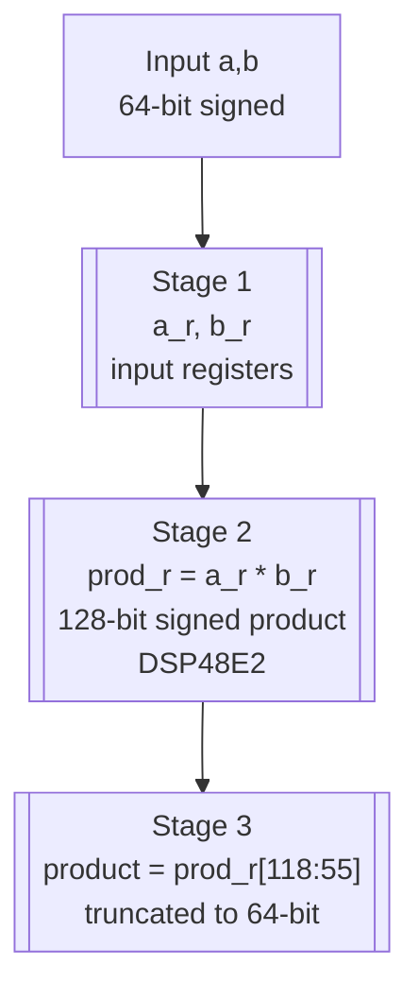
```mermaid
flowchart TB
    IN["Input a,b<br/>64-bit signed"] --> S1[["Stage 1<br/>a_r, b_r<br/>input registers"]]
    S1 --> S2[["Stage 2<br/>prod_r = a_r * b_r<br/>128-bit signed product<br/>DSP48E2"]]
    S2 --> S3[["Stage 3<br/>product = prod_r[118:55]<br/>truncated to 64-bit"]]
```

| Stage | Registers | Purpose |
|---|---|---|
| 1 | `a_r`, `b_r` | Input registers to isolate caller routing. |
| 2 | `prod_r` (128-bit) | Full signed product, registered. Vivado maps to DSP48E2. |
| 3 | `product` (64-bit) | Truncated result `prod_r[FX_FRAC+63:FX_FRAC]`, registered. |

The worker tag latency is `MUL_LAT=4` (3 pipeline stages + 1 cycle for non-blocking operand delivery from the issue logic). Vivado maps the 64x64 signed multiply into DSP48E2 resources.

### 6.2 Fixed-Point Adder (`fx_add.v`)

`fx_add.v` implements fixed-point Q8.55 signed addition in a single pipeline stage:

```verilog
always @(posedge clk) begin
    if (rst) sum <= 0;
    else if (ce) sum <= a + b;
end
```

Subtraction is handled by negating the b operand before it enters the adder: `c_add_b <= -c_zi_sq[i]` for the `z_re^2 - z_im^2` operation. The worker tag latency is `ADD_LAT=2` (1 pipeline stage + 1 cycle for non-blocking operand delivery).

### 6.3 Init Multiplier (`fx_mul_int.v`)

A separate `fx_mul_int.v` (16-bit unsigned x 64-bit signed, 3-stage pipeline) is used by the worker init path to compute `half_w * step`, `half_h * step`, and `row_start * step` without using the shared compute multiplier. The result is `(intval * fxval)[63:0]`, taking the lower 64 bits of the 80-bit product. Since `intval` is a row/column index (max ~65535) and `fxval` is a Q8.55 step value, the product fits in 64 bits.

## 7. Mandelbrot Core Architecture

### 7.1 Fixed-Point Worker (`mandelbrot_core_worker_fx`)

The default worker `mandelbrot_core_worker_fx.v` computes one row job and maintains four live pixel contexts internally. For each pixel, it iterates:

```text
z_{n+1} = z_n^2 + c

z_re_next = z_re^2 - z_im^2 + c_re
z_im_next = 2 * z_re * z_im + c_im
escape if z_re^2 + z_im^2 > 4
```

Each worker uses one `fx_mul` (`MUL_LAT=4`) and one `fx_add` (`ADD_LAT=2`). It time-multiplexes those units across four pixel contexts with tagged fixed-point result writeback. The current wrapper instantiates twenty-two independent workers (DDR default) / twenty-four (UART alternative).

The per-iteration dependency chain is `2*MUL_LAT + max(MUL_LAT, ADD_LAT) + 4*ADD_LAT = 2*4 + 4 + 4*2 = 20` cycles. The issue limit for `1M+1A` is `max(3/1, 5/1) = 5` cycles/iteration. Four contexts are sufficient to hide the 20-cycle dependency (`ceil(20/5) = 4`).

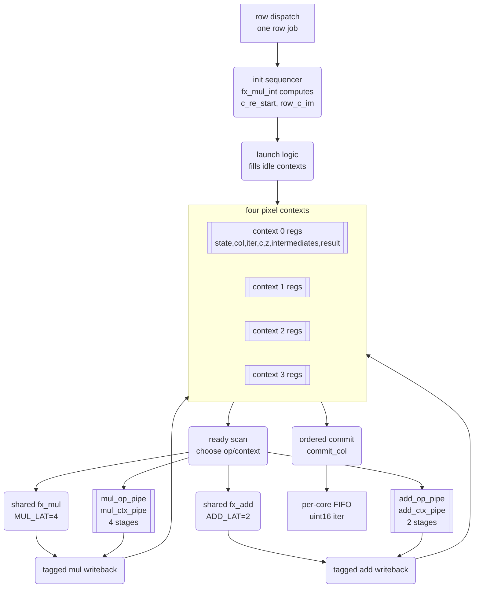
```mermaid
flowchart TB
    DISPATCH["row dispatch<br/>one row job"] --> INIT("init sequencer<br/>fx_mul_int computes<br/>c_re_start, row_c_im")
    INIT --> LAUNCH("launch logic<br/>fills idle contexts")

    subgraph CTX["four pixel contexts"]
        C0[["context 0 regs<br/>state,col,iter,c,z,intermediates,result"]]
        C1[["context 1 regs"]]
        C2[["context 2 regs"]]
        C3[["context 3 regs"]]
    end

    LAUNCH --> CTX
    CTX --> ARB("ready scan<br/>choose op/context")
    ARB --> MUL("shared fx_mul<br/>MUL_LAT=4")
    ARB --> ADD("shared fx_add<br/>ADD_LAT=2")
    ARB --> MTAG[["mul_op_pipe<br/>mul_ctx_pipe<br/>4 stages"]]
    ARB --> ATAG[["add_op_pipe<br/>add_ctx_pipe<br/>2 stages"]]
    MUL --> MWR("tagged mul writeback")
    MTAG --> MWR
    ADD --> AWR("tagged add writeback")
    ATAG --> AWR
    MWR --> CTX
    AWR --> CTX
    CTX --> COMMIT("ordered commit<br/>commit_col")
    COMMIT --> FIFO["per-core FIFO<br/>uint16 iter"]
```

Per-context state:

| State | Purpose |
|---|---|
| `c_c_re`, `c_c_im` | Pixel coordinate (Q8.55). |
| `c_z_re`, `c_z_im` | Current complex value (Q8.55). |
| `c_zr_sq`, `c_zi_sq`, `c_zrzi` | Delayed intermediates (Q8.55). |
| `c_nre` | Next z_re (Q8.55). |
| `c_iter` | Iteration count. |
| `c_col` | Worker-local ordered commit column. |
| `c_state` | Per-context micro-state. |
| `c_res_v`, `c_res_iter` | Completed pixel result waiting for ordered commit. |

Tag delay lines:

| Tag path | Latency | Purpose |
|---|---:|---|
| `mul_op_pipe`, `mul_ctx_pipe` | 4 cycles | Route `fx_mul` result to correct context. |
| `add_op_pipe`, `add_ctx_pipe` | 2 cycles | Route `fx_add` result to correct context. |

Per-context operation flow:

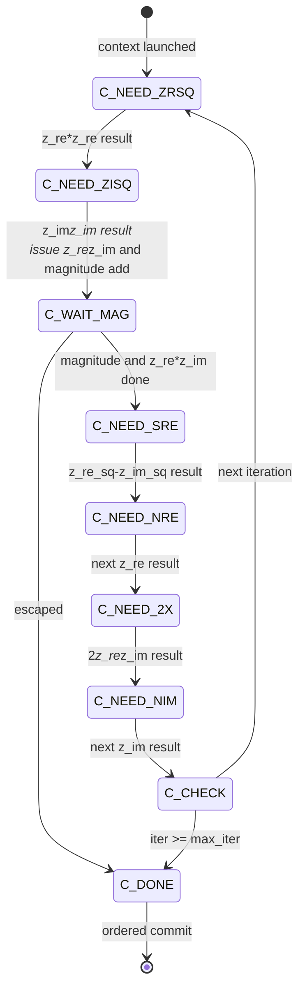
```mermaid
stateDiagram-v2
    [*] --> C_NEED_ZRSQ: context launched
    C_NEED_ZRSQ --> C_NEED_ZISQ: z_re*z_re result
    C_NEED_ZISQ --> C_WAIT_MAG: z_im*z_im result<br/>issue z_re*z_im and magnitude add
    C_WAIT_MAG --> C_DONE: escaped
    C_WAIT_MAG --> C_NEED_SRE: magnitude and z_re*z_im done
    C_NEED_SRE --> C_NEED_NRE: z_re_sq-z_im_sq result
    C_NEED_NRE --> C_NEED_2X: next z_re result
    C_NEED_2X --> C_NEED_NIM: 2*z_re*z_im result
    C_NEED_NIM --> C_CHECK: next z_im result
    C_CHECK --> C_DONE: iter >= max_iter
    C_CHECK --> C_NEED_ZRSQ: next iteration
    C_DONE --> [*]: ordered commit
```

Subtraction (`z_re^2 - z_im^2`) is implemented by negating the b operand: `c_add_b <= -c_zi_sq[i]`, then the `fx_add` computes `a + (-b) = a - b`.

Escape detection is an integer comparison: `z_re_sq + z_im_sq > (4 << FX_FRAC)`. This replaces the FP64 `quick_esc` exponent/mantissa comparison with a single 64-bit signed compare.

The worker commits in local column order. A later context can finish before an earlier column, but its result remains pending until `commit_col` reaches it. This preserves the per-core FIFO contract and keeps downstream raster collection unchanged.

### 7.2 Coordinate Generation

The host provides image center and pixel step. The RTL uses integer-truncated half dimensions:

```text
half_w = (cols - 1) >> 1
half_h = (rows - 1) >> 1

c_re_start = center_re - half_w * step
c_im_start = center_im + half_h * step
```

For each row:

```text
c_re = c_re_start
for each column: c_re += step
after row: c_im -= step
```

The software reference intentionally mirrors this integer-center behavior. This avoids false mismatches versus a conventional floating-centered renderer.

The fx worker init path uses a dedicated `fx_mul_int` module (16-bit x 64-bit, 3-stage pipeline) to compute `c_re_start = center_re - half_w * step` and `row_c_im = c_im_top - row_start * step`. This keeps the shared compute multiplier free for pixel iterations during init.

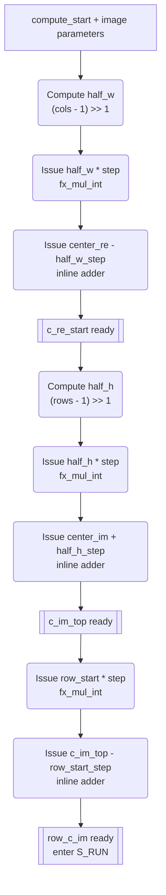
```mermaid
flowchart TB
    START["compute_start + image parameters"] --> HW("Compute half_w<br/>(cols - 1) >> 1")
    HW --> MW("Issue half_w * step<br/>fx_mul_int")
    MW --> RE0("Issue center_re - half_w_step<br/>inline adder")
    RE0 --> CRE[["c_re_start ready"]]
    CRE --> HH("Compute half_h<br/>(rows - 1) >> 1")
    HH --> MH("Issue half_h * step<br/>fx_mul_int")
    MH --> IMTOP("Issue center_im + half_h_step<br/>inline adder")
    IMTOP --> CIMTOP[["c_im_top ready"]]
    CIMTOP --> RSOFF("Issue row_start * step<br/>fx_mul_int")
    RSOFF --> RSUB("Issue c_im_top - row_start_step<br/>inline adder")
    RSUB --> FIRSTROW[["row_c_im ready<br/>enter S_RUN"]]
```

In the current default dynamic scheduler, each worker receives one row at a time. `row_start` is the assigned row and `row_stride=rows`, so the worker exits after completing that single row.

### 7.3 Dynamic Row Scheduling

`mandelbrot_multicore` supports a compile-time scheduling parameter:

| Parameter | Value | Meaning |
|---|---:|---|
| `SCHED_MODE` | `0` | Static interleaved rows, regression mode. |
| `SCHED_MODE` | `1` | Dynamic idle-core row scheduling, default board mode. |
| `DYNAMIC_OWNER_DEPTH` | `4096` default | Owner-table rows available in dynamic mode. |

Dynamic idle-core scheduling uses `work_dispatch_dynamic_rows.v`. It reuses the row-start/stride worker interface by making each job one full row:

```text
row_start = assigned row
row_stride = rows
```

Because `row + row_stride >= rows` after one row, the existing worker finishes after that row and returns `done`. The dynamic dispatcher tracks which cores are active, waits for `done` to return low before reusing a core, and assigns the next unissued row to the first available core. It also emits `owner_row` and `owner_core` so the collector can later restore raster order.

The dispatcher also waits until the selected core FIFO is empty before assigning another row to that core. This is a deliberate backpressure rule. A 1080p fast-escape workload can compute rows faster than UART can transmit them; without this guard, future rows can fill a per-core FIFO while the raster collector is waiting for an earlier row from that same core, creating a strict-raster deadlock. Requiring an empty per-core FIFO before row reuse keeps at most one completed row queued per core and preserves forward progress under UART backpressure.

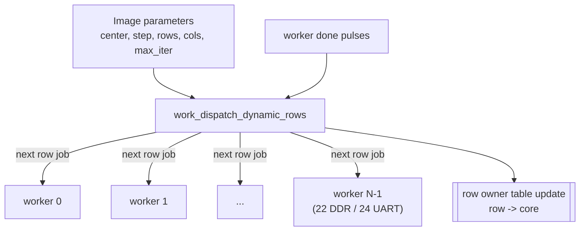
```mermaid
flowchart TB
    PARAM["Image parameters<br/>center, step, rows, cols, max_iter"] --> DYN["work_dispatch_dynamic_rows"]
    DONE["worker done pulses"] --> DYN
    DYN -->|"next row job"| C0["worker 0"]
    DYN -->|"next row job"| C1["worker 1"]
    DYN -->|"next row job"| C2["..."]
    DYN -->|"next row job"| CN["worker N-1<br/>(22 DDR / 24 UART)"]
    DYN --> OWNER[["row owner table update<br/>row -> core"]]
```

Dynamic mode preserves the existing host-visible raster stream and is the default scheduling layer. It improves row-level load balance but cannot improve scenes already capped by UART bandwidth.

### 7.4 Raster Merge

The host-visible protocol expects pixels in row-major order. Dynamic mode uses `raster_collect_dynamic_rows.v` to restore that order. The collector first waits until the owner table has an entry for the current raster row. The source core is then `owner_mem[row]` (8-bit, supporting up to 256 workers). After source selection, it waits for that per-core FIFO, reads one pixel, waits one synchronous FIFO read cycle, and writes the pixel into the shared output FIFO. `DYNAMIC_OWNER_DEPTH` bounds the owner table; the default `4096` rows covers the validated 1080p use case.

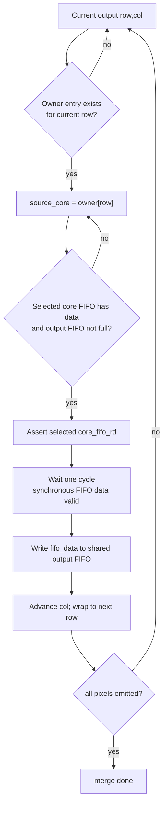
```mermaid
flowchart TB
    POS["Current output row,col"] --> OWN{"Owner entry exists<br/>for current row?"}
    OWN -->|no| POS
    OWN -->|yes| SEL["source_core = owner[row]"]
    SEL --> WAIT{"Selected core FIFO has data<br/>and output FIFO not full?"}
    WAIT -->|no| SEL
    WAIT -->|yes| RD[Assert selected core_fifo_rd]
    RD --> RWAIT["Wait one cycle<br/>synchronous FIFO data valid"]
    RWAIT --> WR["Write fifo_data to shared output FIFO"]
    WR --> ADV["Advance col; wrap to next row"]
    ADV --> DONE{"all pixels emitted?"}
    DONE -->|no| POS
    DONE -->|yes| FRAME_DONE[merge done]
```

Collector state machine:

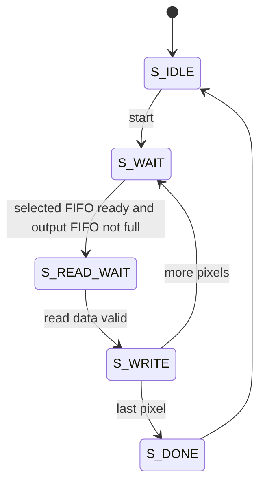
```mermaid
stateDiagram-v2
    [*] --> S_IDLE
    S_IDLE --> S_WAIT: start
    S_WAIT --> S_READ_WAIT: selected FIFO ready and output FIFO not full
    S_READ_WAIT --> S_WRITE: read data valid
    S_WRITE --> S_WAIT: more pixels
    S_WRITE --> S_DONE: last pixel
    S_DONE --> S_IDLE
```

### 7.5 Escape Check

Escape is detected with:

```text
z_re^2 + z_im^2 > 4.0
```

In fixed-point Q8.55, this is a single 64-bit signed integer comparison:

```verilog
c_escape[cx] <= (add_result > four_fx);
```

where `four_fx = 4 << FX_FRAC`. This replaces the FP64 `quick_esc` exponent/mantissa logic with a single comparator, saving LUT and eliminating a timing-critical path.

### 7.6 Output And Backpressure

When a pixel is complete, a worker waits until its per-core FIFO is not full, writes the 16-bit iteration count, and then advances to the next pixel. The raster merger drains per-core FIFOs into the shared output FIFO. `tx_ctrl` then drains the shared output FIFO to UART.

The top-level output FIFO has 1024 entries of 16-bit data. Each worker also has a per-core FIFO. The system is still fundamentally streaming and will backpressure workers when UART is the bottleneck or when strict raster ordering waits for an earlier row.

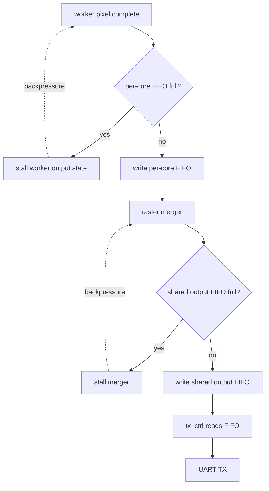
```mermaid
flowchart TB
    W["worker pixel complete"] --> CFULL{"per-core FIFO full?"}
    CFULL -->|yes| WSTALL["stall worker output state"]
    CFULL -->|no| CWR["write per-core FIFO"]
    CWR --> MERGE["raster merger"]
    MERGE --> OFULL{"shared output FIFO full?"}
    OFULL -->|yes| MSTALL["stall merger"]
    OFULL -->|no| OWR["write shared output FIFO"]
    OWR --> TXC["tx_ctrl reads FIFO"]
    TXC --> UART["UART TX"]

    MSTALL -. backpressure .-> MERGE
    WSTALL -. backpressure .-> W
```

Because `queue.v` has synchronous read data, both the raster merger and `tx_ctrl` use a read-wait style: assert read enable, wait one clock for `data_out` to become valid, then consume the value.

## 8. UART Design

UART is 8N1, no parity, no hardware flow control. The current source default is `BAUD=12000000` for both `../rtl/uart_rx.v`, `../rtl/uart_tx.v`, and `../python/mandelbrot_host.py`.

The original UART used an integer `CLOCKS_PER_BIT` divider. That worked at conservative rates but quantized every baudrate to an integer number of system clocks. The current design keeps `CLOCKS_PER_BIT = CLK_HZ / BAUD` as a compatibility parameter, but actual bit timing is generated by a 32-bit fractional phase accumulator:

```text
CLK_HZ = 200000000
BAUD = 12000000
ACC_WIDTH = 32
BAUD_INC = round(BAUD * 2^ACC_WIDTH / CLK_HZ)
baud_sum = baud_acc + BAUD_INC
baud_tick = carry_out(baud_sum)
```

For 12 Mbaud at the current 200 MHz system clock, one UART bit is `200 MHz / 12 MHz = 16.666...` system clocks. The fractional accumulator emits a tick pattern that alternates 16- and 17-cycle bit intervals so the long-term average baudrate is close to the requested value. This removes the large baud error that an integer divider would introduce at rates that are not exact divisors of the system clock.

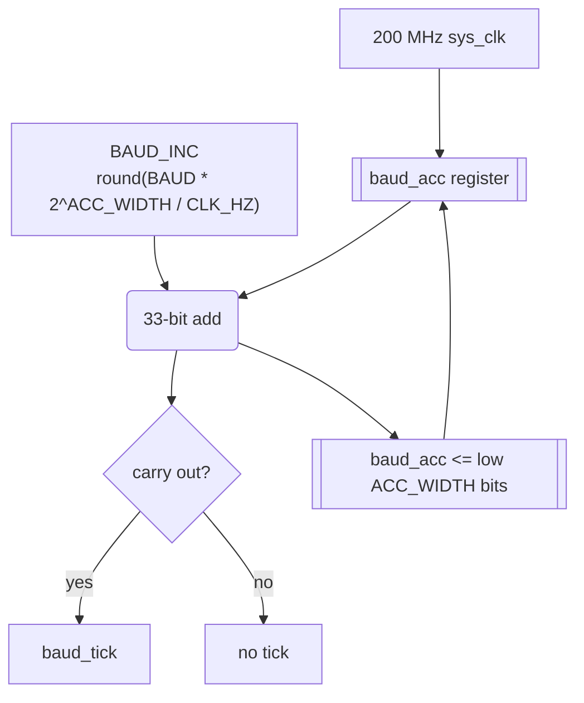
```mermaid
flowchart TB
    CLK["200 MHz sys_clk"] --> ACC[["baud_acc register"]]
    INC["BAUD_INC<br/>round(BAUD * 2^ACC_WIDTH / CLK_HZ)"] --> ADD("33-bit add")
    ACC --> ADD
    ADD --> CARRY{"carry out?"}
    CARRY -->|yes| TICK["baud_tick"]
    CARRY -->|no| WAIT["no tick"]
    ADD --> NEXT[["baud_acc <= low ACC_WIDTH bits"]]
    NEXT --> ACC
```

`uart_rx.v` synchronizes the asynchronous RX input with two flip-flops, detects the falling start edge, preloads the accumulator to `HALF_BIT`, validates that the start bit is still low at the center of the start bit, and then samples each data bit on subsequent fractional baud ticks. A continuous-frame off-by-one bug was fixed so RX enters stop-bit checking immediately after sampling data bit 7 instead of waiting one extra bit period.

`uart_tx.v` serializes one start bit, eight data bits, and one stop bit. The same accumulator style advances the TX state machine; `transmit_avail` acts as a ready signal for `tx_ctrl`.

UART receive pipeline:

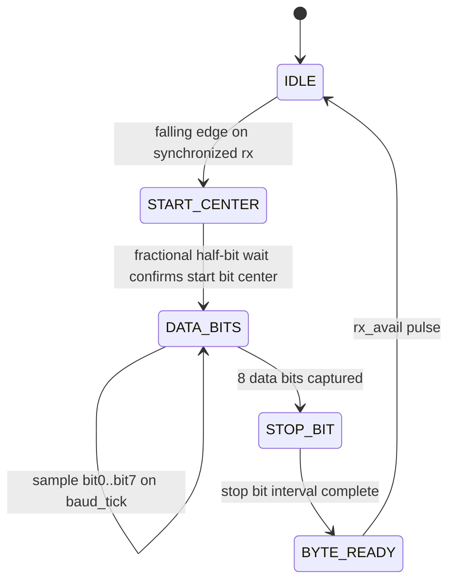
```mermaid
stateDiagram-v2
    [*] --> IDLE
    IDLE --> START_CENTER: falling edge on synchronized rx
    START_CENTER --> DATA_BITS: fractional half-bit wait confirms start bit center
    DATA_BITS --> DATA_BITS: sample bit0..bit7 on baud_tick
    DATA_BITS --> STOP_BIT: 8 data bits captured
    STOP_BIT --> BYTE_READY: stop bit interval complete
    BYTE_READY --> IDLE: rx_avail pulse
```

UART transmit pipeline:

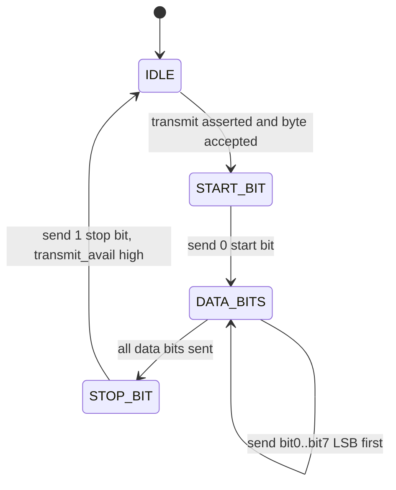
```mermaid
stateDiagram-v2
    [*] --> IDLE
    IDLE --> START_BIT: transmit asserted and byte accepted
    START_BIT --> DATA_BITS: send 0 start bit
    DATA_BITS --> DATA_BITS: send bit0..bit7 LSB first
    DATA_BITS --> STOP_BIT: all data bits sent
    STOP_BIT --> IDLE: send 1 stop bit, transmit_avail high
```

UART integration in the response path (UART alternative build):

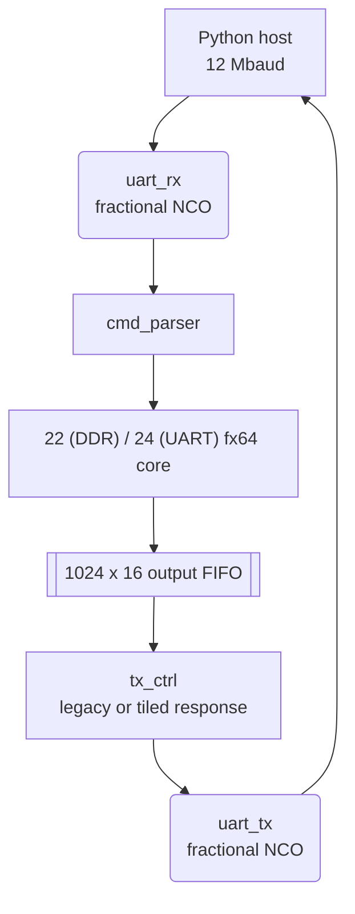
```mermaid
flowchart TB
    HOST["Python host<br/>12 Mbaud"] --> RX("uart_rx<br/>fractional NCO")
    RX --> CMD["cmd_parser"]
    CMD --> CORE["22 (DDR) / 24 (UART) fx64 core"]
    CORE --> OFIFO[["1024 x 16 output FIFO"]]
    OFIFO --> TXC["tx_ctrl<br/>legacy or tiled response"]
    TXC --> TX("uart_tx<br/>fractional NCO")
    TX --> HOST
```

The UART remains in the same 200 MHz clock domain as the parser, core, FIFOs, and TX controller. There is no UART/core CDC; the asynchronous external RX pin is handled only by the two-flop synchronizer inside `uart_rx`.

Baudrate history and raw investigation data are kept in [UART_BAUDRATE_INVESTIGATION.md](UART_BAUDRATE_INVESTIGATION.md), [UART_TIMING_ANALYSIS.md](UART_TIMING_ANALYSIS.md), and [ARCHITECTURE_EVOLUTION_REPORT.md](ARCHITECTURE_EVOLUTION_REPORT.md).

## 9. TX Controller And Large-Frame Support

`tx_ctrl.v` drains pixels from the output FIFO and serializes the host response. The original design emitted one monolithic `RK` frame per command. That was simple and efficient at lower baudrates, but at 12 Mbaud a full `1920x1080` frame is about `4.15 MiB` of uninterrupted UART payload. Early 12 Mbaud testing showed that such long bursts can occasionally lose bytes near the tail of the transfer. With only one final checksum, a single dropped byte invalidates the entire frame and leaves the host waiting for the declared payload length until timeout.

The current design keeps the same compute command format and raster-ordered pixel stream, but wraps the response in a lightweight tile protocol. The protocol has two layers:

| Layer | Implemented In | Function |
|---|---|---|
| RTL response tiling | `../rtl/tx_ctrl.v` | Splits the response stream into framed `TD` packets with coordinates and per-packet checksums. |
| Host-driven display tiling | `../python/mandelbrot_host.py` | Splits a large image into host-visible stripes and stitches returned subframes. |
| Hardware compute sub-tiling | `../python/mandelbrot_host.py` | Splits each host tile into smaller retryable hardware commands. |

The RTL layer detects and localizes byte slips. The host-driven layer provides recovery by recomputing only the failed hardware compute tile inside the host tile.

### 9.1 Response Formats

| Format | Magic | Purpose | Checksum |
|---|---|---|---|
| Legacy full frame | `RK` | Original single payload response. | One final XOR byte over all payload bytes. |
| Tiled frame header | `RT` | Announces frame dimensions before tile packets. | Magic/dimensions checked by host. |
| Tiled data packet | `TD` | Carries one rectangular pixel tile with row/column coordinates. | One XOR byte over the tile payload. |
| Tiled frame end | `TE` | Marks completion of the frame dimensions. | Magic/dimensions checked by host. |

Legacy response layout:

```text
RK rows(u16) cols(u16) payload checksum
```

Tiled response frame layout:

```text
RT rows(u16) cols(u16)
TD row(u16) col(u16) tile_rows(u16) tile_cols(u16) payload checksum
TD ...
TE rows(u16) cols(u16)
```

All multi-byte fields are little-endian. `row` and `col` in a `TD` packet are relative to the current response frame, not the original full image when host-driven tiling is active. For a host tile request of `1920x120`, the response frame dimensions are `1920x120`, and packet coordinates range inside that tile response.

The `TD` checksum is payload-only. Header fields are protected by semantic checks on the host side: magic bytes, frame dimensions, row/column bounds, expected payload length, and final frame completion. This keeps the RTL packetizer small and avoids a full bidirectional transport protocol in the FPGA.

### 9.2 RTL Tile Generation

The current source defaults are:

| Parameter | Default | Meaning |
|---|---:|---|
| `CFG_RESPONSE_TILE_ROW_SPLITS` | `8` | Number of full-width row-split retry/checksum tiles per compute response. |
| `CFG_RESPONSE_TILE_GAP_CYCLES` | `1000` | Inter-packet idle gap, about 5 us at 200 MHz. |

`CFG_RESPONSE_TILE_ROW_SPLITS` controls the retry/checksum granularity inside one hardware compute response. Each `TD` packet spans the full response width (`tile_cols = cols`, `col = 0`) and covers a slice of the response height. The base slice height is `rows / CFG_RESPONSE_TILE_ROW_SPLITS`, with a minimum of one row; the final packet carries any remaining rows. Packets still advance through the response in raster order and do not reorder pixels.

| Concept | Controlled By | Example | Purpose |
|---|---|---|---|
| RTL response retry tile | `CFG_RESPONSE_TILE_ROW_SPLITS` in `../rtl/config.vh` | full width x 15 rows for `1920x120`, `M=8` | Adds packet boundaries and local checksums inside one FPGA response. |
| Host tile | `--tile-width`, `--tile-height` | full width x 120 rows | Defines the display/logging stripe and final image copy region. |
| Hardware compute tile | `--compute-tile-width`, `--compute-tile-height` | host tile, width capped at 2048 | Creates retryable hardware commands inside each host tile. |

With the current `CFG_RESPONSE_TILE_ROW_SPLITS=8`, one default `1920x120` hardware compute tile produces:

```text
base_rows = 120 / 8 = 15
td_packets = 8
retry tile shape = 1920 x 15
```

### 9.3 Reliability Boundary

Packetized response framing detects local payload checksum errors, but it does not let the FPGA retransmit one packet. During response streaming the protocol is still effectively one-way: the host is receiving and the FPGA is transmitting. If a `TD` packet checksum fails, the host cannot ask the current `tx_ctrl` instance to resend only that packet.

Recovery now depends on failure class. For a checksum-only local `TD` failure, the host has consumed a complete `RT/TD/TE` frame and the UART stream is still aligned. It keeps the valid local retry tiles, records the failed row-split rectangle in full-image coordinates, continues the remaining compute tiles, then recomputes merged failed rectangles after the first full-frame pass. For framing failures such as bad magic, incomplete header, incomplete payload, missing checksum, or premature end, stream alignment is not trusted; the host drains stale serial bytes until quiet, resets the input buffer, sends the soft reset command, and retries the current compute tile immediately.

Host retry sequence:

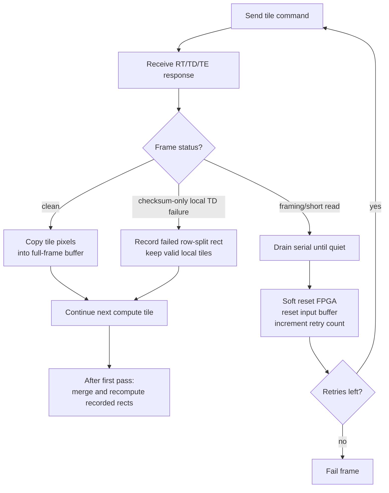
```mermaid
flowchart TB
    CMD["Send tile command"] --> RX["Receive RT/TD/TE response"]
    RX --> CHECK{"Frame status?"}
    CHECK -->|clean| COPY["Copy tile pixels<br/>into full-frame buffer"]
    CHECK -->|checksum-only local TD failure| RECORD["Record failed row-split rect<br/>keep valid local tiles"]
    CHECK -->|framing/short read| DRAIN["Drain serial until quiet"]
    DRAIN --> RESET["Soft reset FPGA<br/>reset input buffer<br/>increment retry count"]
    RESET --> RETRY{"Retries left?"}
    RETRY -->|yes| CMD
    RETRY -->|no| FAIL["Fail frame"]
    COPY --> NEXT["Continue next compute tile"]
    RECORD --> NEXT
    NEXT --> DEFER["After first pass:<br/>merge and recompute recorded rects"]
```

The soft reset command is the eight-byte UART sequence `RST!RST!`. `cmd_parser` recognizes it in any parser state and pulses a system reset long enough to clear the command parser, compute engine, per-core FIFOs, output FIFO, and `tx_ctrl`.

### 9.4 Host-Driven Tile Geometry

Host-driven tiling builds reliability above this packetized response format. Instead of requesting a full 1920x1080 frame in one command, the host builds large host-visible stripes and sends one hardware compute command for each default stripe. If a compute response fails checksum or framing, the host drains the serial stream, sends soft reset, and retries that compute tile. The recommended 1080p host stripe is `1920x120`, producing nine hardware compute requests per frame by default.

Tile center calculation preserves the same integer-center coordinate convention as the full-frame renderer. For a full image with center `(center_re, center_im)`, pixel step `step`, full dimensions `width x height`, and a compute tile at `(cx0, cy0)` with dimensions `cw x ch`, the host computes:

```python
full_half_w = (width - 1) >> 1
full_half_h = (height - 1) >> 1
subtile_half_w = (cw - 1) >> 1
subtile_half_h = (ch - 1) >> 1
subtile_center_re = center_re + (cx0 + subtile_half_w - full_half_w) * step
subtile_center_im = center_im + (full_half_h - (cy0 + subtile_half_h)) * step
```

This makes each compute command generate exactly the same pixel coordinates as the corresponding rectangle in a monolithic full-frame command. The geometry formula preserves the RTL integer-center convention for both odd and even compute-tile dimensions.

### 9.5 Large Logical Images Above 4096 Rows

The default dynamic scheduler records row ownership for `DYNAMIC_OWNER_DEPTH=4096` rows per hardware command. Default host tiling changes the practical limit: each compute tile is a separate hardware command with its own local `rows` field, so the owner-depth limit applies to `compute_tile_height`, not to the logical full-frame height.

The response size is based on:

```verilog
wire [31:0] total_pixels = {16'd0, rows} * {16'd0, cols};
wire [31:0] total_bytes  = total_pixels * 2;
```

The explicit 32-bit cast is important. Without it, Verilog computes `rows * cols` using the operand widths, producing a 16-bit product before extension. That caused images larger than 65535 pixels to fail.

TX controller response pipeline:

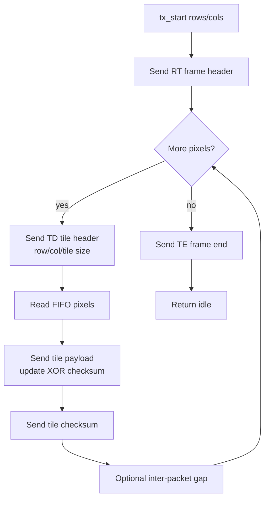
```mermaid
flowchart TB
    START["tx_start rows/cols"] --> RT["Send RT frame header"]
    RT --> NEXT{"More pixels?"}
    NEXT -->|yes| TDH["Send TD tile header<br/>row/col/tile size"]
    TDH --> RD["Read FIFO pixels"]
    RD --> PAYLOAD["Send tile payload<br/>update XOR checksum"]
    PAYLOAD --> TCS["Send tile checksum"]
    TCS --> GAP["Optional inter-packet gap"]
    GAP --> NEXT
    NEXT -->|no| TE["Send TE frame end"]
    TE --> DONE["Return idle"]
```

## 10. Host Software Architecture

Host code is in `../python/mandelbrot_host.py`.

| Component | Responsibility |
|---|---|
| CLI parser | Accept center, step, max iteration, dimensions, output, mode, port, timeout, verify flag, tiling, soft reset, and quiet progress options. |
| Arithmetic encoding | Pack fx64 as `struct.pack('<q', round(value * 2**55))`; pack FP64 with `struct.pack('<d')`; pack FP128 manually. |
| Command builder | Build little-endian command packet and XOR checksum. |
| Serial transport | Open `COM6` by default at 12000000 baud. |
| Response receiver | Read legacy `RK` or tiled `RT`/`TD`/`TE` responses, validate checksums, and convert to uint16 pixels. |
| Host-driven tiling | Default host stripes plus `--compute-tile-width`, `--compute-tile-height`, and `--tile-retries` split a frame into retryable hardware compute tiles. |
| Soft reset | `--soft-reset` sends `RST!RST!`; failed compute-tile attempts send it automatically unless disabled. |
| Quiet progress | `--quiet` shows a single-line progress bar. |
| Renderer | Convert iteration counts to PNG or text output. |
| Software reference | Optional `--verify` computes a Python Mandelbrot image matching RTL coordinate rules. Uses fx64 fixed-point arithmetic when `--mode ddr` (default) or `--mode fx64`, or float arithmetic when `--mode fp64` (regression only). |
| Timing | Print FPGA elapsed, pixels/s, render elapsed, software elapsed, and total elapsed. |

Recommended high-baud 1080p host-tiled command:

```bash
python python\mandelbrot_host.py --port COM6 --width 1920 --height 1080 --max-iter 128 --center 1.0 1.0 --step 0.002 --timeout 600 --verify --tile-width 1920 --tile-height 120 --tile-retries 3 --quiet --output python\hw_1080p_hosttile_fast_escape.png
```

The default `--mode` is `ddr`, which matches the default bitstream (`build_mandelbrot_with_ram.tcl`, 22 workers, PL-PS DDR transport). Use `--mode fx64` when the UART alternative bitstream (`build_fp64_fx24.tcl`, 24 workers) is programmed. Use `--mode fp64` only when the historical FP64 regression bitstream (`build_fp64.tcl`) is programmed.

The software reference uses the same coordinate convention as the RTL:

```python
half_w = (width - 1) >> 1
half_h = (height - 1) >> 1
re_start = center_re - half_w * step
im_start = center_im + half_h * step
```

## 11. Verification Strategy

### 11.1 Unit Simulation (Regression)

`../sim/tb_fp.v` tests historical FP64 add/multiply cases (regression only).

```bash
vivado -mode batch -source sim_fp.tcl
```

### 11.2 Core Simulation

`../sim/tb_core.v` runs the Mandelbrot core against a software reference embedded in the testbench.

```bash
vivado -mode batch -source sim_core.tcl
```

### 11.3 Fixed-Point Multicore Simulation

`../sim/tb_multicore_fx.v` instantiates `mandelbrot_multicore` with `WORKER_MODE=1` and a fixed-point software reference model. It checks 192 pixels (12x16) for bit-exact match.

```bash
vivado -mode batch -source sim_fx.tcl
```

Expected pass marker:

```text
=== FX MULTICORE TEST PASS: 192 pixels ===
```

### 11.4 FP64 Multicore Simulation (Regression)

`../sim/tb_multicore_dynamic.v` runs the historical FP64 dynamic scheduler simulation (regression only, `WORKER_MODE=0`).

```bash
vivado -mode batch -source sim_multicore_dynamic.tcl
```

### 11.5 Response Packetizer And Soft Reset Simulation

```bash
vivado -mode batch -source sim_tx_ctrl_tiled.tcl
vivado -mode batch -source sim_tx_ctrl_host_tiled_4096.tcl
vivado -mode batch -source sim_cmd_parser_soft_reset.tcl
```

### 11.6 Hardware Smoke Test

```bash
python python\mandelbrot_host.py --mode ddr --port COM6 --width 1 --height 1 --max-iter 256 --center 2.5 0.0 --step 0.001 --output python\smoke_test.png --timeout 10
```

### 11.7 Hardware Image Verification

```bash
python python\mandelbrot_host.py --mode ddr --verify --width 160 --height 120 --max-iter 256 --output python\verify_160x120.png
```

Expected: `HW vs SW: 19200/19200 match (100.00%)`.

## 12. Performance Characteristics

The system has two main bottlenecks:

1. UART bandwidth for fast-escaping or low-iteration scenes.
2. Core compute for high-iteration zooms.

At 12 Mbaud, the practical UART payload upper bound is roughly:

```text
12000000 bits/s / 10 UART bits/byte / 2 bytes/pixel ~= 600000 pixels/s
```

Direct-200MHz fx64 24-worker, 4-context UART alternative 1080p benchmark at 12 Mbaud with `1920x120` host/compute tiles:

| Scene | FP64 12w/8ctx baseline | FX 24w/4ctx (UART) | Speedup | Main limiter |
|---|---:|---:|---:|---|
| Fast escape @128 | `3.733s / 555k pps` | `3.733s / 556k pps` | `1.00x` | UART-bound |
| Standard @64 | `3.816s / 546k pps` | `3.727s / 556k pps` | `1.02x` | UART-bound |
| Seahorse zoom @512 | `3.964s / 525k pps` | `3.882s / 534k pps` | `1.02x` | Mixed |
| Deep tendrils @8192 | `3.994s / 519k pps` | `5.029s / 412k pps` | — | Mixed |
| Deep mini-brot @8192 | `9.166s / 226k pps` | `5.091s / 407k pps` | **`1.80x`** | Compute-bound |
| Deep Seahorse @1024 | `4.575s / 455k pps` | `4.074s / 509k pps` | `1.12x` | Mixed |

Deep scenes improve significantly: mini-brot @8192 accelerates **1.80x** (9.2s -> 5.1s) due to 2x worker parallelism and shorter dependency latency (20 vs 47 cycles/iteration). Shallow scenes remain UART-bound at ~555k pps. The DDR default build's compute-stage acceleration is documented in [Appendix B.7](#b7-benchmark-results); end-to-end DDR timing is download-bound until a faster PS-side push path is added.

The historical FP64 12-worker/8-context 10-run benchmark data is kept in [VMC_RTSB_ZU4EV_200MHZ_OPT_REPORT.md](VMC_RTSB_ZU4EV_200MHZ_OPT_REPORT.md). The full redesign study with phase reports is in [REDESIGN_STUDY_REPORT.md](REDESIGN_STUDY_REPORT.md).

## 13. Resource Use

Latest representative routed utilization (DDR default and UART alternative, direct-200MHz fx64):

| Resource | DDR 22w Used | DDR 22w Util | UART 24w Used | UART 24w Util | Device |
|---|---:|---:|---:|---:|---:|
| CLB LUTs | 86,450 | 98.42% | 83,731 | 95.32% | 87,840 |
| CLB Registers | 73,894 | 42.07% | 76,116 | 43.33% | 175,680 |
| DSP48E2 | 445 | 61.13% | 483 | 66.35% | 728 |
| Block RAM Tile | 46 | 35.94% | 33 | 25.78% | 128 |

Resource comparison (fx64 vs historical FP64):

| Resource | FP64 12w/8ctx | FX 22w DDR | FX 24w UART | Notes |
|---|---:|---:|---:|---|
| LUT as Logic | 82,686 (94.13%) | 86,450 (98.42%) | 83,731 (95.32%) | DDR adds PS/AXI/download logic |
| DSP48E2 | 123 (16.9%) | 445 (61.1%) | 483 (66.3%) | 64x64 multiplies; DDR uses 22 workers |
| WNS | 0.103ns | 0.114ns | 0.078ns | All timing-clean at 200 MHz |

Latest routed timing for the current builds:

| Build | Mode | Workers | Contexts | WNS | TNS | WHS | THS |
|---|---|---:|---:|---:|---:|---:|---:|
| `build_mandelbrot_with_ram.tcl` (DDR default) | fx64 | 22 | 4 | 0.114 ns | 0.000 ns | 0.011 ns | 0.000 ns |
| `build_fp64_fx24.tcl` (UART alternative) | fx64 | 24 | 4 | 0.078 ns | 0.000 ns | 0.011 ns | 0.000 ns |
| `build_fp64.tcl` (historical regression) | FP64 | 12 | 8 | 0.148 ns | 0.000 ns | 0.010 ns | 0.000 ns |

The fixed-point design shifts resource utilization from LUT-dominated (94% LUT, 17% DSP) to a more balanced profile (95-98% LUT-as-logic, 61-66% DSP), nearly doubling the worker count within the same LUT budget. The DDR build's higher LUT count reflects the added `cmd_parser_v2`, AXI read/write masters, and download-path logic.

## 14. Known Limitations

| Limitation | Details |
|---|---|
| Dynamic row scheduler | Default mode. Gates row reuse on an empty per-core FIFO to avoid UART-backpressure deadlock. |
| Four-context fx worker | Default per-worker pipeline. Four contexts hide the 20-cycle dependency chain at `MUL_LAT=4`/`ADD_LAT=2`. |
| 22-worker DDR default / 24-worker UART alternative | Current best validated points. Nearly 2x the FP64 baseline's 12 workers within the same LUT budget. |
| LUT/routing pressure | The DDR 22-worker build uses 98.42% CLB LUTs; the UART 24-worker build uses 95.32%. Further scaling needs a lower-LUT worker structure (ring/barrel). |
| DSP utilization | 61-66% DSP from 64x64 fixed-point multiplies. Further worker scaling is DSP-limited at 64-bit. |
| Direct-200MHz mode | Current default. Timing-clean at `WNS=0.114ns` (DDR) / `WNS=0.078ns` (UART). |
| DDR download bandwidth | End-to-end DDR mode is download-bound (~4.4s for 1080p) until a faster PS-side push path (Ethernet/USB) replaces UART download. |
| UART output | 12 Mbaud ~600k pps ceiling (UART alternative). Shallow scenes are UART-bound; deep scenes benefit from extra compute. |
| Fixed-point precision | Q8.55 covers all FP64-validated scenes at 100% match. Step sizes below ~1e-17 need wider format. |
| FP64 regression mode | `WORKER_MODE=0` retains the historical FP64 12w/8ctx path. Regression-only, not active. IEEE-like, not full IEEE-754. |
| FP128 mode exists structurally | Most validation and performance work has focused on fx64. FP128 is regression/experimental only. |
| Max iteration field is 16-bit | Maximum supported `max_iter` is 65535. |

## 15. Future Improvement Directions

1. Add a higher-bandwidth PS-side push transport (Ethernet / USB) on top of the DDR design to lift the ~600k pps UART download ceiling and expose compute gains on shallow scenes.
2. Redesign the worker as a low-LUT ring/barrel structure to reduce per-worker LUT and fit 28-32 workers.
3. Add request IDs and packet sequence numbers to the response protocol for explicit stale-packet rejection.
4. Add FPGA-side retry-tile cache so checksum failures can retransmit instead of recomputing.
5. Add periodicity detection for mini-brot interior points (safe with fixed-point's controllable truncation).
6. Validate and optimize FP128 mode for deeper zooms beyond fx64 precision comfort.

## 16. Build And Run Commands

Simulation:

```bash
vivado -mode batch -source sim_fx.tcl
vivado -mode batch -source sim_fp.tcl
vivado -mode batch -source sim_core.tcl
vivado -mode batch -source sim_multicore_dynamic.tcl
```

Build and program the DDR default (22-worker fx64 + PS DDR4):

```bash
vivado -mode batch -source build_mandelbrot_with_ram.tcl
```

Program the DDR build via XSDB JTAG blank-boot (no FSBL):

```bash
vivado -mode batch -source boot_jtag_with_ram.tcl
```

Build and program the UART alternative (24-worker fx64):

```bash
vivado -mode batch -source build_fp64_fx24.tcl
vivado -mode batch -source program.tcl -tclargs ./fp64_fx24_proj/mandelbrot_fp64_fx24.runs/impl_1/top.bit
```

Historical FP64 regression build:

```bash
vivado -mode batch -source build_fp64.tcl
```

Small fx64 hardware verification (DDR default, `--mode ddr` is the default):

```bash
python python\mandelbrot_host.py --mode ddr --port COM6 --width 160 --height 120 --max-iter 256 --center -0.5 0.0 --step 0.005 --output python\hw_ddr_160x120.png --verify --quiet --timeout 60 --tile-width 160 --tile-height 120 --tile-retries 3
```

1080p render example (DDR default):

```bash
python python\mandelbrot_host.py --port COM6 --width 1920 --height 1080 --max-iter 512 --center -0.743643887037151 0.13182590420533 --step 0.000005 --timeout 1800 --tile-width 1920 --tile-height 120 --tile-retries 3 --quiet --output python\hw_1080p_zoom.png
```

---

## Appendix A. Historical FP64 Architecture

This appendix documents the historical FP64 design (`WORKER_MODE=0`) for regression reference only. FP64 is not an active mode. The active fx64 design is described in sections 1-16 above.

### A.1 FP64 Number Format

| Parameter | FP64 | FP128 |
|---|---:|---:|
| Total width | 64 | 128 |
| Sign bits | 1 | 1 |
| Exponent bits | 11 | 15 |
| Mantissa bits | 52 | 112 |
| Bias | 1023 | 16383 |

The FP implementation is IEEE-like but not a full IEEE-754 implementation: no denormal, NaN/Inf, or full rounding support.

### A.2 FP64 Multiplier Pipeline (`fp_mul.v`)

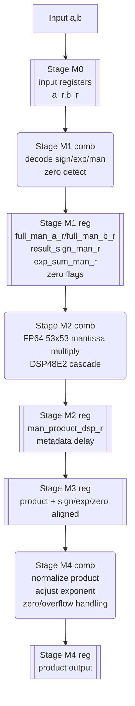
```mermaid
flowchart TB
    IN["Input a,b"] --> R0[["Stage M0<br/>input registers<br/>a_r,b_r"]]
    R0 --> D0("Stage M1 comb<br/>decode sign/exp/man<br/>zero detect")
    D0 --> R1[["Stage M1 reg<br/>full_man_a_r/full_man_b_r<br/>result_sign_man_r<br/>exp_sum_man_r<br/>zero flags"]]
    R1 --> DSP("Stage M2 comb<br/>FP64 53x53 mantissa multiply<br/>DSP48E2 cascade")
    DSP --> R2[["Stage M2 reg<br/>man_product_dsp_r<br/>metadata delay"]]
    R2 --> R3[["Stage M3 reg<br/>product + sign/exp/zero aligned"]]
    R3 --> NORM("Stage M4 comb<br/>normalize product<br/>adjust exponent<br/>zero/overflow handling")
    NORM --> OUT[["Stage M4 reg<br/>product output"]]
```

| Stage | Main registers | Purpose |
|---|---|---|
| M0 | `a_r`, `b_r` | Isolate caller routing from FP decode. |
| M1 | decoded mantissas and metadata | Remove zero mux and sign/exponent decode from DSP input path. |
| M2 | `man_product_dsp_r` | Register DSP cascade output. |
| M3 | product/metadata alignment registers | Align delayed sign/exponent/zero flags with product. |
| M4 | `product` | Normalize and publish final FP value. |

The multiplication is annotated with `(* mult_style = "pipe_block" *)` to encourage DSP-based implementation. Worker tag latency: `MUL_LAT=6`.

### A.3 FP64 Adder Pipeline (`fp_add.v`)

Subtraction is performed by flipping the sign of operand B before entering the adder:

```verilog
wire [`FP_WIDTH-1:0] add_b_eff = add_neg ? {~add_b[`FP_SIGN_IDX], add_b[`FP_EXP_HI:0]} : add_b;
```

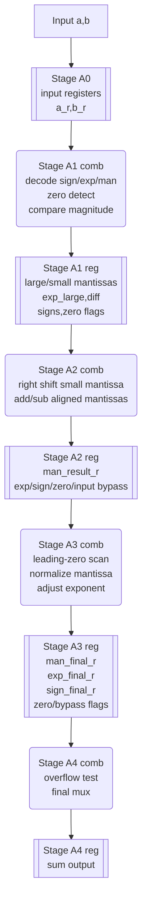
```mermaid
flowchart TB
    IN["Input a,b"] --> R0[["Stage A0<br/>input registers<br/>a_r,b_r"]]
    R0 --> D0("Stage A1 comb<br/>decode sign/exp/man<br/>zero detect<br/>compare magnitude")
    D0 --> R1[["Stage A1 reg<br/>large/small mantissas<br/>exp_large,diff<br/>signs,zero flags"]]
    R1 --> ALIGN("Stage A2 comb<br/>right shift small mantissa<br/>add/sub aligned mantissas")
    ALIGN --> R2[["Stage A2 reg<br/>man_result_r<br/>exp/sign/zero/input bypass"]]
    R2 --> LZ("Stage A3 comb<br/>leading-zero scan<br/>normalize mantissa<br/>adjust exponent")
    LZ --> R3[["Stage A3 reg<br/>man_final_r<br/>exp_final_r<br/>sign_final_r<br/>zero/bypass flags"]]
    R3 --> OF("Stage A4 comb<br/>overflow test<br/>final mux")
    OF --> OUT[["Stage A4 reg<br/>sum output"]]
```

| Stage | Main registers | Purpose |
|---|---|---|
| A0 | `a_r`, `b_r` | Isolate caller routing and provide stable decode inputs. |
| A1 | `man_large_s1`, `man_small_s1`, `exp_large_s1`, `diff_s1` | Cut decode/compare/select away from alignment and add/sub. |
| A2 | `man_result_r`, `exp_large_r`, `sign_large_r` | Register add/sub result before normalization. |
| A3 | `man_final_r`, `exp_final_r`, `sign_final_r` | Register normalized result before overflow/final mux. |
| A4 | `sum` | Publish zero bypass, overflow-zero, or normal FP result. |

Worker tag latency: `ADD_LAT=9`.

### A.4 FP64 8-Context Worker (`mandelbrot_core_worker_kctx`)

The FP64 worker is `mandelbrot_core_worker_kctx` with `CONTEXTS=8`. Each context keeps its own pixel coordinate, current `z`, delayed intermediate values, iteration count, state, and pending ordered-commit result. The shared multiplier and adder accept at most one operation per cycle each.

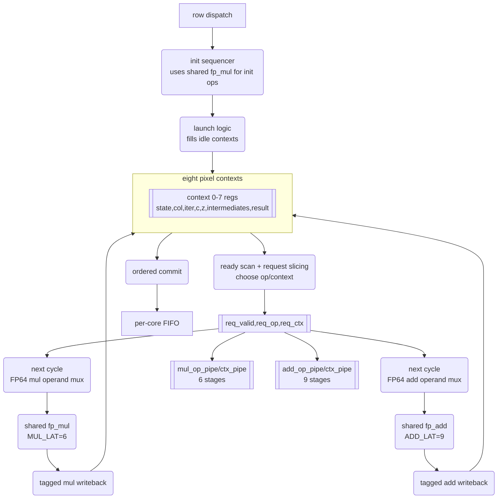
```mermaid
flowchart TB
    DISPATCH["row dispatch"] --> INIT("init sequencer<br/>uses shared fp_mul for init ops")
    INIT --> LAUNCH("launch logic<br/>fills idle contexts")

    subgraph CTX["eight pixel contexts"]
        C0[["context 0-7 regs<br/>state,col,iter,c,z,intermediates,result"]]
    end

    LAUNCH --> CTX
    CTX --> ARB("ready scan + request slicing<br/>choose op/context")
    ARB --> REQ[["req_valid,req_op,req_ctx"]]
    REQ --> MUXM("next cycle<br/>FP64 mul operand mux")
    REQ --> MUXA("next cycle<br/>FP64 add operand mux")
    MUXM --> MUL("shared fp_mul<br/>MUL_LAT=6")
    MUXA --> ADD("shared fp_add<br/>ADD_LAT=9")
    REQ --> MTAG[["mul_op_pipe/ctx_pipe<br/>6 stages"]]
    REQ --> ATAG[["add_op_pipe/ctx_pipe<br/>9 stages"]]
    MUL --> MWR("tagged mul writeback")
    ADD --> AWR("tagged add writeback")
    MWR --> CTX
    AWR --> CTX
    CTX --> COMMIT("ordered commit")
    COMMIT --> FIFO["per-core FIFO"]
```

The request-sliced issue path:

```text
Cycle N:   scan contexts, choose one ready operation, latch req_valid/req_op/req_ctx
Cycle N+1: drive FPU operands from req_ctx/req_op, insert op/context tag into result pipe
Cycle N+latency: use delayed tag to write the FP result back to the selected context
```

FP64 escape check uses `quick_esc`:

```verilog
quick_esc(z_re_sq) || quick_esc(z_im_sq) || quick_esc(add_result)
```

`quick_esc` compares the floating-point exponent against `bias + 2` and handles the exact `4.0` boundary by checking mantissa bits.

### A.5 FP64 Timing Cuts

The historical FP64 200MHz build required these timing cuts:

| Cut | Purpose |
|---|---|
| FP multiplier partial-product/register split | Reduces DSP/mantissa multiply path depth. |
| FP adder compare/select, normalize, and final-output pipeline stages | Keeps exponent compare, mantissa align, normalize, and output select out of one cycle. |
| TX `S_TILE_ADVANCE` state | Removes tile/row counter update from the transmit hot path. |
| kctx `C_CHECK_ITER` state | Separates `AOP_NEXT_IM` result writeback from iteration increment/escape/max-iter re-arm. |
| kctx FPU issue request slicing | Splits context selection from FPU operand drive by one cycle. |

The fx64 worker does not require most of these because fixed-point add is a single-cycle integer add and fixed-point multiply is a simpler 3-stage DSP pipeline without exponent handling.

---

## Appendix B. PL-PS DDR Architecture

This appendix documents the PL-PS DDR design. The design uses PS DDR4 as a pixel buffer: compute writes pixels to DDR via AXI, then a PL-side AXI reader reads them back and returns them over UART using the existing `RT/TD/TE` protocol. The full design document is [PL_PS_DDR_DESIGN.md](PL_PS_DDR_DESIGN.md).

### B.1 Overview

The PL-PS DDR design adds a Zynq UltraScale+ PS block design with:
- `zynq_ultra_ps_e_0` (DDR4 4 GiB, S_AXI_HPC0_FPD 64-bit read/write)
- `axi_smc_0` (SmartConnect 1 SI / 1 MI)
- `top_with_ram` (custom RTL: multicore + output FIFO + axi_ddr_writer + axi_ddr_reader + tx_ctrl + cmd_parser_v2)
- `pl_por_0` (PL-local power-on reset)

The compute pipeline streams pixels to PS DDR via AXI write. The download pipeline reads pixels back from PS DDR via AXI read and sends them over UART. XSDB/JTAG is only used for PS DDR initialization and PL programming.

### B.2 Architecture

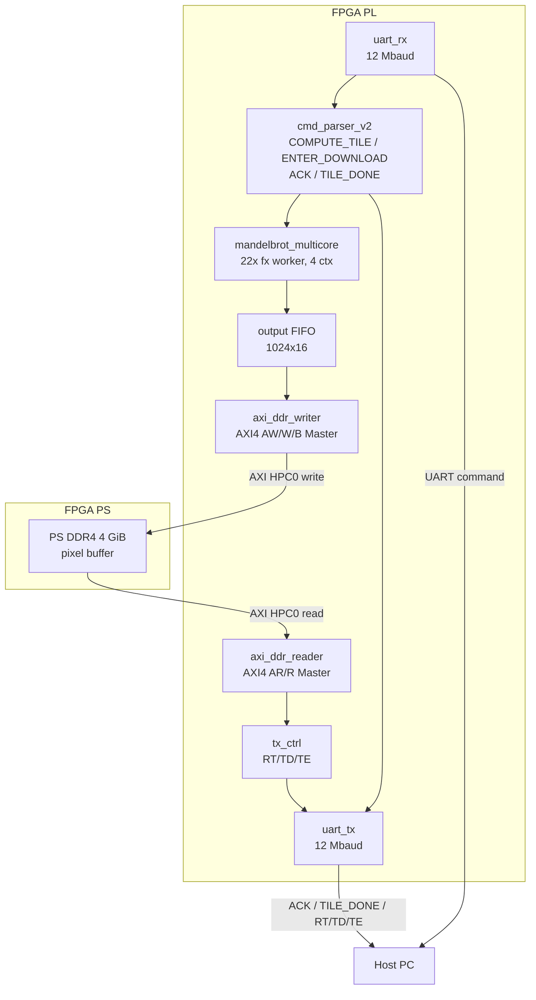
```mermaid
flowchart TB
    subgraph PL["FPGA PL"]
        URX["uart_rx<br/>12 Mbaud"]
        CMD2["cmd_parser_v2<br/>COMPUTE_TILE / ENTER_DOWNLOAD<br/>ACK / TILE_DONE"]
        CORE2["mandelbrot_multicore<br/>22x fx worker, 4 ctx"]
        FIFO2["output FIFO<br/>1024x16"]
        AXIW["axi_ddr_writer<br/>AXI4 AW/W/B Master"]
        AXIR["axi_ddr_reader<br/>AXI4 AR/R Master"]
        TXC["tx_ctrl<br/>RT/TD/TE"]
        UTX2["uart_tx<br/>12 Mbaud"]
        URX --> CMD2 --> CORE2 --> FIFO2 --> AXIW
        AXIR --> TXC --> UTX2
        CMD2 --> UTX2
    end

    subgraph PS["FPGA PS"]
        DDR["PS DDR4 4 GiB<br/>pixel buffer"]
    end

    URX -->|"UART command"| USB["Host PC"]
    UTX2 -->|"ACK / TILE_DONE / RT/TD/TE"| USB
    AXIW -->|"AXI HPC0 write"| DDR
    DDR -->|"AXI HPC0 read"| AXIR
```

### B.3 Protocol

The PL-PS DDR protocol uses `55 AA TYPE LEN PAYLOAD CHECKSUM` frames:

| Direction | Type | Name | Len | Purpose |
|---|---|---|---|---|
| H→F | 0x10 | COMPUTE_TILE | 42 | Compute tile and write to DDR (center_re/im/step + max_iter + rows/cols + ddr_base + tile_id) |
| H→F | 0x11 | ENTER_DOWNLOAD | 12 | Download a tile from DDR via UART (ddr_base u64 + rows u16 + cols u16) |
| H→F | 0x02 | QUERY_STATUS | 0 | Debug: query internal pipeline state |
| F→H | 0x81 | ACK | 1 | Command accepted (status: 0=OK, 1=BUSY, 2=BAD_ALIGN, 3=BAD_SIZE) |
| F→H | 0x84 | TILE_DONE | 4 | Tile written to DDR (xor16 u16 + status u8 + reserved u8) |
| F→H | 0x90 | DEBUG_STATUS | 13 | Debug response (13-byte pipeline state snapshot) |

### B.4 done_sticky + done_ack Handshake

The `axi_ddr_writer` sets `done_sticky` (a level signal) when all pixels are written to DDR. The `cmd_parser_v2` detects this via `ddr_done_seen`, queues a TILE_DONE frame, and after the frame's checksum byte is transmitted, pulses `done_ack` for one cycle to clear `done_sticky`.

### B.5 UART Download Path

The download path reuses the existing `tx_ctrl` module to generate `RT/TD/TE` frames. The `axi_ddr_reader` reads 64-bit beats from DDR via AXI AR/R, feeds them through a 16-entry beat FIFO, and serializes them into uint16 pixels via a 4-lane serializer. The `top_with_ram` download controller manages UART TX ownership: `cmd_parser_v2` owns TX during command/ACK/TILE_DONE phase; `tx_ctrl` owns TX during `RT/TD/TE` download phase.

If a UART framing error occurs during download, the host drains stale bytes and re-sends `ENTER_DOWNLOAD` for the same DDR address. The FPGA re-reads the tile from DDR without recomputing.

### B.6 Boot Flow

The design uses a JTAG blank-boot flow (no FSBL, no PS C code):

1. `targets 8; rst -system` (PS reset)
2. `source psu_init_with_ram.tcl; psu_init` (PS register init via JTAG — PLL, DDR, clocks, MIO)
3. `mwr 0x10000000 0xDEADBEEF; mrd 0x10000000` (DDR verify)
4. `fpga system_wrapper.bit` (PL bitstream)
5. PL `pl_por` releases reset after ~5ms, UART alive

### B.7 Benchmark Results

The old UART design pipelines compute and transfer per tile (total ≈ max(compute, transfer)). The DDR design separates them into sequential phases: compute → DDR write, then DDR → UART download (total = compute + download).

| Scene | Old UART 24w (s) | DDR Compute (s) | DDR Download (s) | DDR Total (s) | E2E Speedup |
|---|---:|---:|---:|---:|---:|
| Fast escape @128 | `3.733` | `0.221` | `4.369` | `4.590` | `0.81x` |
| Standard @64 | `3.727` | `0.223` | `4.373` | `4.596` | `0.81x` |
| Seahorse @512 | `3.882` | `1.086` | `5.009` | `6.095` | `0.64x` |
| Deep tendrils @8192 | `5.029` | `1.950` | `5.002` | `6.952` | `0.72x` |
| Deep mini-brot @8192 | `5.091` | `5.104` | `4.418` | `9.522` | `0.53x` |
| Deep Seahorse @1024 | `4.074` | `2.254` | `4.406` | `6.660` | `0.61x` |

End-to-end DDR mode is slower than UART because compute and download are sequential. The DDR design's value is compute-stage acceleration (1.8-17× without UART backpressure), lossless retry from DDR, and a path to PS-side push (Ethernet/USB) that would reduce download from ~4.4s to <0.1s.

### B.8 Resource

| Resource | UART fx64 24w | PL-PS DDR 22w | Change |
|---|---:|---:|---|
| CLB LUTs | 83,731 (95.32%) | 86,450 (98.42%) | +2,719 (PS + AXI R/W + download) |
| DSP48E2 | 483 (66.3%) | 445 (61.1%) | -38 (22 vs 24 workers) |
| Block RAM Tile | 33 (25.8%) | 46 (35.9%) | +13 (PS infra) |
| WNS | 0.078ns | 0.114ns | Timing met at 200 MHz |

### B.9 Reference Project

The PL-PS DDR design is based on the `PL-PS-MEM-TEST` reference project, which validated:
- AXI HP0 64-bit write path to PS DDR4 (509 MiB/s measured)
- JTAG blank-boot flow (`psu_init.tcl` via XSDB)
- PL-local reset (`pl_por.v`)
- DDR4 high-address enable (4 GiB full range)
- `reference/design_1.bd` PS configuration source
