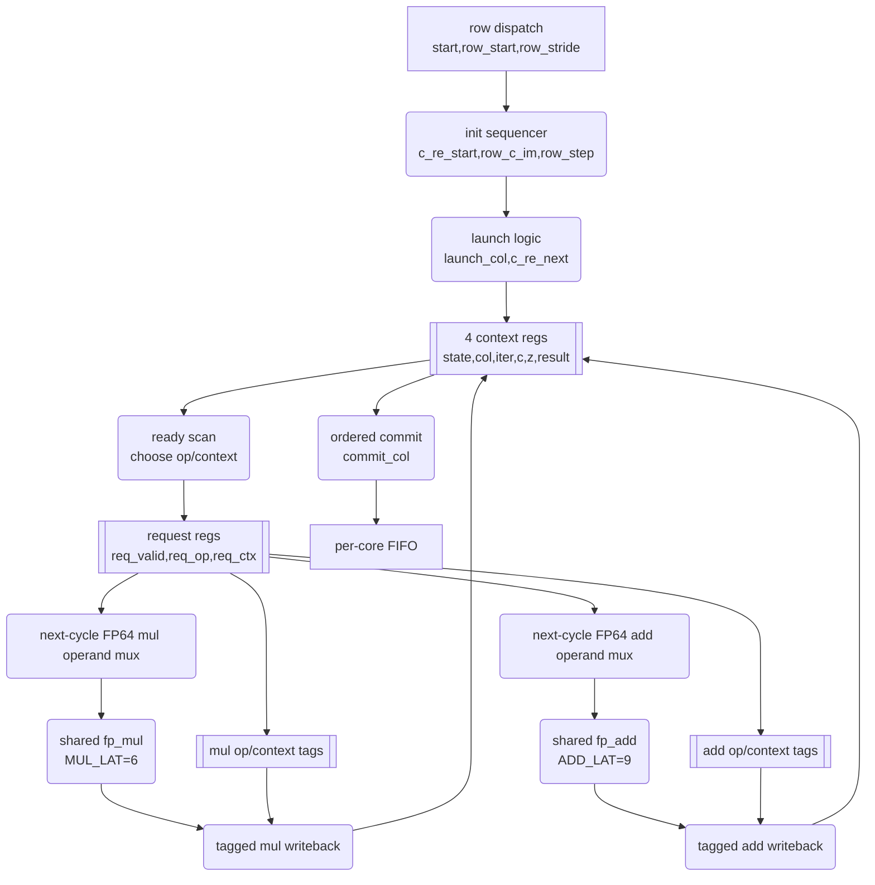

# Mandelbrot FPGA 加速器架构

本文说明当前默认架构。英文原文为 `ARCHITECTURE.md`。

## 1. 总览

当前设计是 UART 控制的流式 Mandelbrot FPGA 加速器。当前板级目标为 XC7K70T `xc7k70tfbg676-1`，输入时钟为 200 MHz 差分 `CLK_200_P/N`。默认构建使用 `DIRECT_200MHZ=1`，让完整 compute/UART 域直接运行在 200 MHz。Host 发送完整图像或 tile 命令，FPGA 返回每个像素的 16 位迭代次数。当前默认计算配置为 FP64、6 个 worker、每 worker 4 个像素上下文、动态行调度、`FP_CE_DIV=1`、12 Mbaud fractional-NCO UART，并使用 tiled response 加 host-driven tile retry 提高长帧可靠性。

| 项目 | 当前值 |
|---|---:|
| FPGA | `xc7k70tfbg676-1` |
| 板级时钟输入 | 200 MHz 差分 `CLK_200_P/N` |
| 内部系统时钟 | direct 200 MHz，`DIRECT_200MHZ=1` |
| 100MHz 参考构建 | `../build_fp64_100mhz.tcl` |
| FP/core enable | 200 MHz，`FP_CE_DIV=1` |
| Worker 数量 | 6 |
| 每 worker 上下文 | 4 |
| 调度器 | `SCHED_MODE=1` 动态空闲 core 行调度 |
| UART | 12000000 baud |
| 默认串口 | `COM9` |
| 烧录链路 | Vivado `hw_server` 在 `127.0.0.1:3122`，CH347 XVC 在 `127.0.0.1:2542` |
| 像素格式 | little-endian `uint16` |
| 最大迭代 | 65535 |
| 最大已验证图像 | 1920x1080 |
| 当前 XC7K70T 板级状态 | 完整 FP64 bitstream 已通过 |
| 当前 timing | `WNS=0.003ns`, `TNS=0.000ns`, `WHS=0.042ns`, `THS=0.000ns` |
| 当前资源 | `29891` LUTs, `25501` registers, `97` DSP48E1, `13.5` BRAM tiles |

## 2. 顶层结构

顶层模块为 `../rtl/top.v`。数据路径如下：

```text
Host PC
  -> uart_rx
  -> cmd_parser
  -> mandelbrot_multicore
  -> queue(1024 x 16-bit)
  -> tx_ctrl
  -> uart_tx
  -> Host PC
```

`mandelbrot_multicore` 内部包含：

| 模块 | 作用 |
|---|---|
| `work_dispatch_dynamic_rows` | 把行动态派给空闲 worker。 |
| `mandelbrot_core_worker_kctx` | 默认 4-context 参数化 worker；LUT 占用较高。 |
| `mandelbrot_core_worker_2ctx` | 低 LUT 对比/regression worker。 |
| per-core FIFO | 暂存每个 worker 的行输出。 |
| `raster_collect_dynamic_rows` | 按 row-owner 表恢复 raster order。 |

## 3. 命令和响应协议

FP64 命令长度为 33 字节，FP128 命令长度为 57 字节。字段包括 magic、precision、rows、cols、max_iter、center、step 和 XOR checksum。

Legacy response：

```text
RK rows(u16) cols(u16) payload checksum
```

当前 tiled response：

```text
RT rows(u16) cols(u16)
TD row(u16) col(u16) tile_rows(u16) tile_cols(u16) payload checksum
TD ...
TE rows(u16) cols(u16)
```

所有多字节字段为 little-endian。`TD` checksum 只覆盖 payload，header 通过 magic、尺寸、边界和长度检查保护。

## 4. 时钟和 clock enable

板上输入为 200 MHz 差分 `CLK_200_P/N`。默认 `top.v` 使用 direct 200MHz 路径，把 buffered 200MHz 输入作为同一个 `sys_clk` 域。UART、parser、FIFO、TX controller、FP datapath 和 Mandelbrot core 都在这个内部单一时钟域。`fp_ce` 仍保留为编译期节流参数，但当前 FP64 默认 `FP_CE_DIV=1`，即每个内部周期推进。100MHz 参考构建显式设置 `DIRECT_200MHZ=0` 并使用 MMCM 生成 100MHz。

### 4.1 direct-200MHz 时序设计

200MHz 收敛后的关键切片如下：

| 切片 | 作用 |
|---|---|
| `fp_mul.v` partial-product/register split | 降低 mantissa 乘法/DSP 级联路径。 |
| `fp_add.v` compare/select、normalize、final output 分段 | 避免指数比较、对齐、规格化和输出选择堆在一拍。 |
| `tx_ctrl.v` 的 `S_TILE_ADVANCE` | 拆开 tile/row advance 与发送热路径。 |
| kctx `C_CHECK_ITER` | 拆开 `AOP_NEXT_IM` 写回和 iter/escape/next-mul re-arm。 |
| kctx FPU issue request slicing | 第一拍只选 context/op，第二拍驱动 64-bit FPU operand。 |

最终 kctx issue 时序：

```text
Cycle N:   扫描 ready context，锁存 req_valid/req_op/req_ctx
Cycle N+1: 根据 req_ctx/req_op 驱动 mul_a/mul_b 或 add_a/add_b，并把 tag 放入 result pipe
Cycle N+latency: 用 done tag 把 FPU result 写回对应 context
```

例子：

```text
N:   context 2 发射 MOP_ZRZI，mul_req_op=MOP_ZRZI，mul_req_ctx=2
N+1: mul_a=c_z_re[2]，mul_b=c_z_im[2]，mul_op_pipe[0]=MOP_ZRZI
N+6: mul_done_op=MOP_ZRZI，mul_done_ctx=2，mul_result 写入 c_z_re_z_im[2]
```

一个被否定的版本还锁存了 `mul_req_a/mul_req_b/add_req_a/add_req_b` 这些 64-bit operand。功能没问题，但 timing endpoint 变成 request operand regs，post-route phys-opt 后仍 `WNS=-0.042ns`，所以撤回。

最终 direct-200MHz kctx 使用的 tag latency 是：

```verilog
localparam MUL_LAT = 6;
localparam ADD_LAT = 9;
```

这里 `MUL_LAT=6` 是功能关键。FPU latency probe 显示 request-sliced worker 中 `fp_mul` 的非零输出脉冲与第 6 拍 tag 对齐；使用 `MUL_LAT=7/8` 会在部分高迭代边界像素上抓到下一拍的 0。

## 5. FP64 浮点实现

`fp_add.v` 和 `fp_mul.v` 是参数化 FP 单元。实现为 IEEE-like，足够用于本项目 Mandelbrot 负载，但不是完整 IEEE-754：不完整支持 denormal、NaN、Inf 和标准 rounding。

FP64 边界差异来自 RTL truncation 和 Python 软件参考的 round-to-nearest-even 差异。边界附近 Mandelbrot 迭代会放大 sub-ULP 差异，因此少量边界像素不匹配是预期行为。

## 6. Worker pipeline

默认 worker 为 `mandelbrot_core_worker_kctx`，配置为 4 context。当前默认实例化 6 个 worker。每个 worker 有一个 FP64 multiplier 和一个 FP64 adder，并维护 4 个像素上下文。一个上下文等待 FP 结果时，其他上下文可以向 FP pipeline issue 新操作。

关键点：

| 项目 | 当前值 |
|---|---:|
| `MUL_LAT` | 6 |
| `ADD_LAT` | 9 |
| FP 单元 | 1M + 1A per worker |
| 上下文 | 4 per worker |
| commit | worker-local column order |

旧单 context 和 2-context worker 保留为 regression/对比路径。当前 6-worker 4ctx kctx 在 XC7K70T 上已通过 bitstream、烧录和 1080p 六场景测试，当前是默认部署路径。direct-200MHz 版本加入 request slicing：



历史 2ctx 结构、被否定的 200MHz 尝试和未来低 LUT worker 思路放在 `ARCHITECTURE_EVOLUTION_REPORT_CN.md`、`PIPELINE_BUBBLE_ANALYSIS_CN.md` 和 `CONTEXT_WORKER_ARCHITECTURE_REPORT_CN.md` 中。

## 7. 动态行调度

动态调度器每次把一整行分派给一个空闲 worker，并记录 row owner。collector 按原始行顺序读取对应 worker FIFO，保证 host 看到的输出仍是 raster order。

调度器只在目标 core FIFO 为空时分派下一行。这条规则避免 UART backpressure 下未来行填满 FIFO，而 collector 正等待同一 core 的早期行，造成死锁。

## 8. UART

UART 为 8N1，无硬件流控。当前默认 12 Mbaud，RX 和 TX 都使用 32-bit fractional NCO 产生 bit tick。12 Mbaud 的 bit 时间为 8.333 个 100 MHz 周期，不能用整数 divider 精确表示，因此 fractional NCO 会产生 8/9 cycle 的平均节拍。

12 Mbaud 使理论 payload 上限达到约 `600000 pixels/s`，但 1080p 单帧是约 4.15 MiB 长 burst，host/FT232H/driver 偶发 byte slip。当前推荐用 host-driven tile 降低失败代价。

## 9. Tile response 和 host-driven tile

Tile 方案分两层：

| 层 | 位置 | 作用 |
|---|---|---|
| RTL response tiling | `../rtl/tx_ctrl.v` | 把像素流封装为 `RT/TD/TE` packet，并提供 per-packet checksum。 |
| Host-driven display tiling | `../python/mandelbrot_host.py` | 把大图拆成 host 可见 stripe，并拼回最终图像。 |
| Hardware compute sub-tiling | `../python/mandelbrot_host.py` | 把每个 host tile 再拆成更小的可重试硬件命令。 |

Host-driven tiling 当前默认开启。如果用户不传 `--tile-width/--tile-height`，host 自动使用全宽、120 行高的 stripe。如果用户不传 `--compute-tile-width/--compute-tile-height`，compute tile 默认等于 host tile 本身，但 compute 宽度上限为 4096。每个 compute tile 接收时使用较短的 `--tile-read-timeout 30`，因此中途 byte slip 不需要等全局串口 timeout 才能进入 retry。旧整帧单命令路径通过 `--full-frame` 显式开启。

推荐 1080p host tile shape 是 `1920x120`，默认 compute tile 也是 `1920x120`。它把一帧分成 9 个硬件命令。某个 compute tile 失败时，host 会 drain stale bytes、发送 soft reset，并只重算该 tile，而不是重算整帧。

当前 `CFG_RESPONSE_TILE_COLS=64`，因此一个默认 `1920x120` compute tile 产生：

```text
120 * ceil(1920 / 64) = 3600 TD packets
```

这里的 retry 单元是 compute tile；在默认 1080p 配置下它与 host stripe 相同。需要更小 retry unit 时，仍可显式传 `--compute-tile-width` 和 `--compute-tile-height`。

Host 校验 `RT` 维度、`TD` bounds、payload length、payload checksum、像素覆盖和 `TE` 维度。如果失败，host 记录失败 compute tile 的坐标，drain serial until quiet、reset input buffer、发送 soft reset，然后只重试该 compute tile。Soft reset 命令是 8 字节 UART 序列 `RST!RST!`；也可以手动执行 `python python\mandelbrot_host.py --port COM9 --soft-reset`。

`--quiet` 下 host 使用单行进度条，格式为：

```text
[progress] (n / total compute tile) (m / total host tile) current task
```

`4096x4096` 默认 host-tiled path 已做 RTL packetizer 级验证：逻辑图像拆成 35 个硬件 response，检查 262144 个 `TD` packet 和 16777216 个像素，checksum、frame boundary、tail tile 均通过。

### 超过 4096 行的大图

默认 dynamic scheduler 的 owner table 深度为 4096，但这是每个硬件命令的限制。默认 host tile 会把逻辑大图拆成多个硬件命令，所以只要 `tile_height <= 4096`，逻辑图像高度可以超过 4096。

| 逻辑图像 | 默认 host tile 行为 | 结论 |
|---|---|---|
| `4096x4096` | 约 35 个 120-row host stripe，每个 stripe 再拆 compute tile | owner-depth 安全。 |
| `16384x16384` | 多个 120-row stripe | FPGA owner-depth 安全，但 host 内存/运行时间很大。 |
| `65536x65536` | 必须横向和纵向都 tile | 单硬件命令不能表示 65536 cols，且 host full-buffer 不现实。 |

单个硬件命令的 `rows`/`cols` 仍是 16-bit，因此每个 tile 的宽高必须不超过 65535；默认 bitstream 还要求每个 tile 高度不超过 4096。当前 Python host 会把最终图像完整缓存在内存中，所以超大图还需要 streaming/tiled image writer 才实用。

## 10. Host 软件

`../python/mandelbrot_host.py` 负责：

| 功能 | 说明 |
|---|---|
| 命令编码 | 打包 FP64/FP128 参数和 checksum。 |
| 串口传输 | 默认 `COM9`，12 Mbaud。 |
| 响应解析 | 支持 legacy `RK` 和 tiled `RT/TD/TE`。 |
| Host tile | `--tile-width`, `--tile-height`。 |
| Compute tile | `--compute-tile-width`, `--compute-tile-height`, `--tile-retries`。 |
| Soft reset | `--soft-reset` 手动发送；失败重试时默认自动发送，`--no-soft-reset-on-retry` 可关闭。 |
| Quiet progress | `--quiet` 显示 compute tile 和 host tile 的单行进度条。 |
| 渲染 | 输出 PNG/text。 |
| 验证 | `--verify` 计算 Python reference。 |

## 11. 当前资源

| Resource | Used | Device | Utilization |
|---|---:|---:|---:|
| Slice LUTs | 36367 | 41000 | 88.70% |
| Slice Registers | 19149 | 82000 | 23.35% |
| DSP48E1 | 37 | 240 | 15.42% |
| Block RAM Tile | 9.5 | 135 | 7.04% |

direct-200MHz 6-worker 4ctx 资源和 timing：

| Resource | Used | Device | Utilization |
|---|---:|---:|---:|
| Slice LUTs | 29891 | 41000 | 72.90% |
| Slice Registers | 25501 | 82000 | 31.10% |
| DSP48E1 | 97 | 240 | 40.42% |
| Block RAM Tile | 13.5 | 135 | 10.00% |

| WNS | TNS | WHS | THS |
|---:|---:|---:|---:|
| `0.003ns` | `0.000ns` | `0.042ns` | `0.000ns` |

默认 6-worker direct-200MHz 10 轮 1080p 稳定性测试，全部 transport pass：

| 场景 | Pass | Retry | 平均 FPGA s | 平均 pps | 对比 100MHz 4ctx |
|---|---:|---:|---:|---:|---:|
| fast escape @128 | `10/10` | `2` | `4.641` | `453333.47` | `1.009x` |
| standard @64 | `10/10` | `2` | `4.636` | `450824.12` | `1.247x` |
| Seahorse zoom @512 | `10/10` | `2` | `5.715` | `366227.26` | `1.721x` |
| deep tendrils @8192 | `10/10` | `1` | `8.567` | `242675.75` | `2.063x` |
| deep mini-brot @8192 | `10/10` | `0` | `20.963` | `98916.27` | `2.106x` |
| deep Seahorse @1024 | `10/10` | `1` | `9.668` | `214934.36` | `2.065x` |

## 12. 已知限制和后续方向

| 限制 | 说明 |
|---|---|
| 12 Mbaud UART | 长 burst 仍可能 byte slip，缺少 packet-level retransmission。 |
| 6-worker 4ctx 默认 | 当前默认配置，可部署、timing-clean，六场景 1080p 实测为当前最佳性能点。 |
| 4-worker 4ctx direct-200MHz | 历史低面积参考点，仍可用于对比。 |
| 2-context worker | 保留为低 LUT 对比/regression 配置；历史数据见演进文档。 |
| 8ctx generic worker | 尚未作为默认候选验证，预计仍需更低 LUT 结构。 |
| direct-200MHz 模式 | 当前默认。6-worker 修复后已 timing-clean、烧录并完成 1080p benchmark；100MHz 4ctx 保留为显式参考。 |
| FP64 | 深 zoom 会受精度影响。 |

后续方向包括更强传输层、packet sequence/request ID、低 LUT 高 context worker、FP128 优化和更强 tile/retry 协议。
