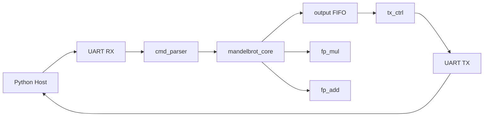
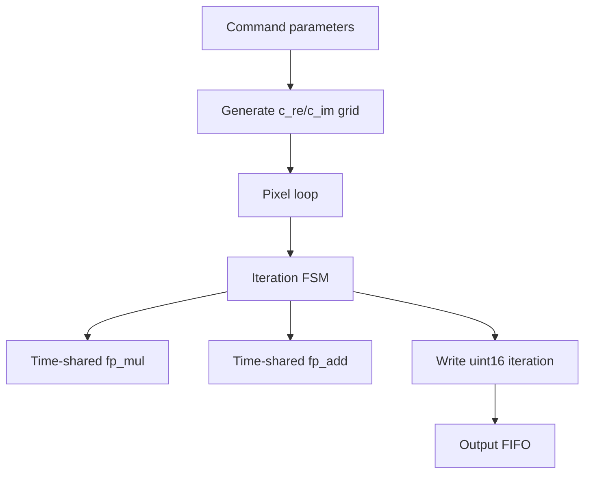
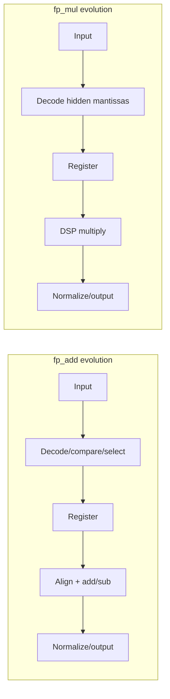
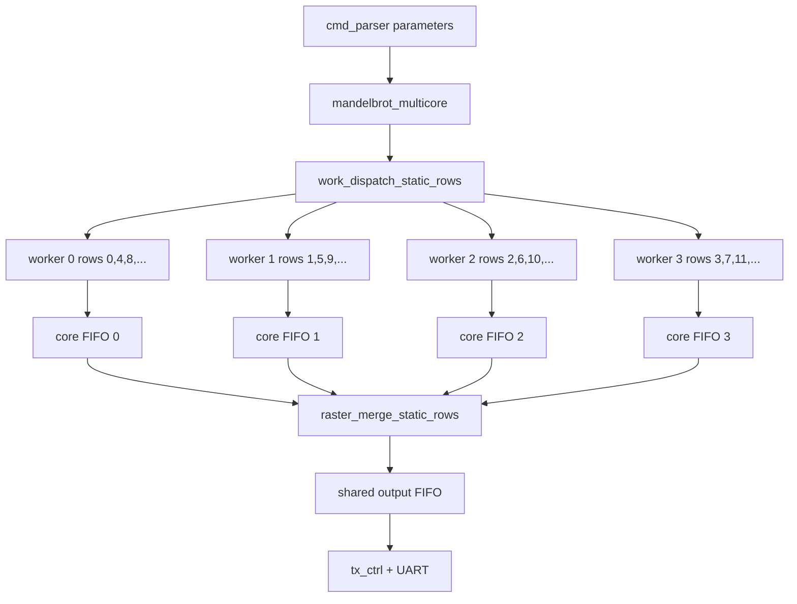
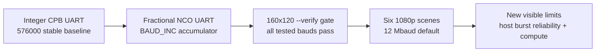
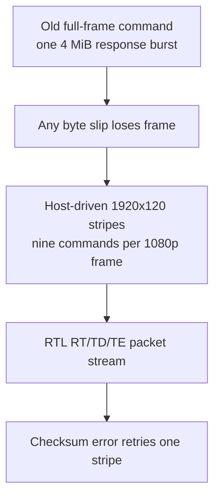

# Architecture Evolution And Optimization Report

This report explains the design thinking behind the Mandelbrot FPGA accelerator and summarizes how the architecture evolved from the initial single-core UART renderer to the current 4-core FP64 implementation. Stage-specific details are intentionally linked to the focused reports instead of duplicated in full.

## Related Stage Reports

| Stage | Report | Scope |
|---|---|---|
| Detailed current architecture | [ARCHITECTURE.md](ARCHITECTURE.md) | Full ../RTL/software architecture, protocol, verification, timing, and current performance. |
| 100 MHz timing closure | [PERFORMANCE_100MHZ.md](PERFORMANCE_100MHZ.md) | FP64 pipeline changes, 50 MHz effective to true 100 MHz migration, timing and performance impact. |
| UART baudrate optimization | [UART_BAUDRATE_BENCHMARK.md](UART_BAUDRATE_BENCHMARK.md) | CP2102 baudrate tests, 500000 baud selection, UART-limited benchmark impact. |
| UART baudrate deep investigation | [UART_BAUDRATE_INVESTIGATION.md](UART_BAUDRATE_INVESTIGATION.md) | Raw-probe integer-divider tests, TX-only isolation, 576000 candidate. |
| UART timing analysis | [UART_TIMING_ANALYSIS.md](UART_TIMING_ANALYSIS.md) | Single-sample RX timing, CP2102 drift, margin analysis, root cause of high-baud failures. |
| FP64 boundary differences | [FP64_BOUNDARY_DIFFERENCE_ANALYSIS.md](FP64_BOUNDARY_DIFFERENCE_ANALYSIS.md) | Truncation vs RNE, chaotic amplification, boundary pixel trace, difference classification. |
| Dynamic idle-core scheduling | [DYNAMIC_IDLE_CORE_SCHEDULING.md](DYNAMIC_IDLE_CORE_SCHEDULING.md) | Optional row-level dynamic scheduler, result collector, mode switching, validation, and limits. |
| Multi-core feasibility | [MULTICORE_FEASIBILITY.md](MULTICORE_FEASIBILITY.md) | Resource model, scheduler alternatives, output-order constraints, expected scaling. |
| Implemented 4-core design | [MULTICORE_4CORE_ARCHITECTURE.md](MULTICORE_4CORE_ARCHITECTURE.md) | Final 4-core architecture, modular dispatch/merge boundary, validation, 1080p benchmark results. |
| Abandoned N-context worker experiments | [CONTEXT_WORKER_ARCHITECTURE_REPORT.md](CONTEXT_WORKER_ARCHITECTURE_REPORT.md) | Generic scoreboard 4/8ctx and ring/lookahead experiments; behavioral pass but not deployable on xc7z010. |
| Historical notes | [DESIGN.md](DESIGN.md) | Earlier design notes and historical context. |

## Final Current State

| Item | Current Value |
|---|---:|
| FPGA | Xilinx Kintex-7 `xc7k70tfbg676-1` |
| Board clock input | 200 MHz differential `CLK_200_P/N` |
| Internal system clock | 100 MHz generated by MMCM |
| Floating-point mode | FP64 |
| Compute cores | 4 |
| Worker contexts | 2 per worker |
| Default scheduler | Dynamic idle-core rows |
| Effective worker rate | 100 MHz per worker, `FP_CE_DIV=1` |
| UART | 12000000 baud, 8N1, fractional-NCO RX/TX |
| Host serial port default | `COM9` |
| Hardware server | `127.0.0.1:2542` |
| Host protocol | Unchanged raster-order response stream |
| Pixel format | 16-bit little-endian iteration count |
| Largest validated frame | 1920x1080 |
| Current XC7K70T board build status | Full FP64 bitstream builds cleanly |
| Current XC7K70T timing/utilization | `WNS=1.148ns`, `TNS=0.000ns`; 13726 / 41000 Slice LUTs, 14559 / 82000 registers, 37 / 240 DSP48E1, 9.5 / 135 BRAM tiles |

## Initial Architecture Design Thinking

The original design goal was not maximum theoretical Mandelbrot throughput. It was a board-debuggable, end-to-end FPGA accelerator that could accept a complete image command from a PC, compute pixels in hardware, and return a file-renderable image with minimal host-side assumptions.

The initial architecture therefore favored these priorities:

| Priority | Design Choice | Reason |
|---|---|---|
| Simple bring-up | UART command/response protocol | UART is easy to probe, debug, and drive from Python on Windows. |
| Low memory use | Streaming pixels instead of frame buffering | A full 1080p frame at 16 bits/pixel is about 4 MiB, unnecessary for a serial output path. |
| Deterministic validation | Raster-order pixel stream | Host can render directly and compare against a software reference without coordinates per pixel. |
| Manageable RTL | One Mandelbrot FSM using one FP multiplier and one FP adder | Keeps area small and makes pipeline latency explicit. |
| Timing simplicity | One 100 MHz clock domain | Avoids derived-clock CDC issues between UART, parser, compute, FIFO, and TX. |
| Precision for zooms | FP64 default | FP64 supports visually useful deep zooms without committing to a much larger FP128 implementation. |

This produced the first useful architecture:



The important early decision was to make the hardware/software contract raster-order and image-level rather than pixel-command based. That avoided per-pixel command overhead and made it possible to later insert multi-core compute behind the same protocol.

## Baseline Single-Core Architecture

The baseline compute core used one FP multiplier and one FP adder, scheduled by a finite-state machine. Each pixel iterated:

```text
z_re_next = z_re^2 - z_im^2 + c_re
z_im_next = 2 * z_re * z_im + c_im
escape when z_re^2 + z_im^2 > 4
```

The core issued an FP operation, waited a fixed number of `fp_ce` pulses, then consumed the registered result. This made FP latency explicit and kept the Mandelbrot FSM independent from exact internal FP pipeline details.



The early design was resource-light. That was useful because it gave enough DSP/LUT/FF headroom to later improve timing and add multiple workers.

## Stage 1: Functional Correctness And Streaming Reliability

Before pursuing performance, the design needed to produce correct pixels and complete frames.

Key fixes included:

| Area | Issue | Resolution |
|---|---|---|
| FP add | Sign/magnitude and normalization corner cases | Added targeted tests and corrected same-sign/opposite-sign behavior. |
| FP mul | Coordinate multiplication cases | Added input and DSP product registers; verified image coordinate cases. |
| Core escape | Escape calculation used stale intermediate value | Corrected scheduling so `z_re^2 + z_im^2` uses the intended current terms. |
| Coordinate grid | Host and RTL center conventions differed | Host reference now mirrors RTL integer-center behavior. |
| TX stream | FIFO read data became valid one cycle after read | Added `S_READ_WAIT` in `tx_ctrl`. |
| Large images | `rows * cols` could truncate to 16 bits | Forced 32-bit pixel count in TX controller. |
| UART TX | Derived pseudo clock caused transfer fragility | Moved UART TX to the single `sys_clk` domain. |

Effect:

| Validation | Result |
|---|---|
| FP unit simulation | Passed targeted multiply/add cases. |
| Core simulation | Passed point/grid/full-size first-pixel regression. |
| Host reference testing | Passed randomized host/reference cases. |
| Hardware smoke | Passed known escape points. |
| Hardware image verify | Achieved 100% match on small frames. |

The outcome of this stage was a stable single-core streaming renderer with a trustworthy software reference.

## Stage 2: True 100 MHz FP64 Core

The early stable hardware used a 100 MHz physical clock but advanced the FP/core datapath every other cycle. That made timing easier but limited compute throughput.

The optimization goal was true 100 MHz operation with no core multicycle exceptions.

Detailed report: [PERFORMANCE_100MHZ.md](PERFORMANCE_100MHZ.md).

### Design Problem

Directly changing `FP_CE_DIV=2` to `FP_CE_DIV=1` failed timing badly:

| Attempt | Result |
|---|---:|
| Direct true 100 MHz | `WNS=-4.626ns`, `TNS=-593.205ns` |

The worst path was initially in `fp_add`, where decode, compare/select, alignment, and add/sub logic were too deep for 10 ns.

### Pipeline Strategy

The fix was not to change Mandelbrot math. It was to cut the long FP timing cones:



Timing closure path:

| Build | WNS | Result |
|---|---:|---|
| Old effective-50 MHz, multicycle | `2.619ns` | pass |
| Direct true 100 MHz | `-4.626ns` | fail |
| After adder cut | `-1.221ns` | fail, bottleneck moved to multiplier |
| After adder + multiplier cuts | `0.258ns` | pass |

### Stage Effect

Compute-bound workloads improved consistently by about `1.40x-1.41x`. The speedup was below an ideal `2x` because the deeper FP pipeline increased `PIPE_WAIT` from 6 to 9.

Representative 1080p impact from [PERFORMANCE_100MHZ.md](PERFORMANCE_100MHZ.md):

| Case | Old 50 MHz Effective | True 100 MHz | Speedup |
|---|---:|---:|---:|
| Deep tendrils @8192 | `478.776s` | `340.055s` | `1.41x` |
| Deep minibrot @8192 | `1198.049s` | `850.711s` | `1.41x` |
| Deep seahorse @1024 | `511.486s` | `363.254s` | `1.41x` |

UART-bound scenes barely improved, which exposed the next bottleneck.

## Stage 3: UART Baudrate Optimization

Once true 100 MHz was stable, fast scenes were capped by the serial output link.

Detailed reports: [UART_BAUDRATE_BENCHMARK.md](UART_BAUDRATE_BENCHMARK.md), [UART_BAUDRATE_INVESTIGATION.md](UART_BAUDRATE_INVESTIGATION.md), [UART_TIMING_ANALYSIS.md](UART_TIMING_ANALYSIS.md).

### Design Problem

At 460800 baud, the theoretical pixel ceiling was:

```text
460800 bits/s / 10 UART bits/byte / 2 bytes/pixel = 23040 pixels/s
```

Fast 1080p scenes were already near this ceiling.

### Initial Sweep

The 100 MHz clock allowed exact integer dividers for several candidate rates:

| Baudrate | `CLOCKS_PER_BIT` | Board Result |
|---:|---:|---|
| 1000000 | 100 | timeout |
| 800000 | 125 | timeout |
| 625000 | 160 | timeout |
| 500000 | 200 | pass |
| 460800 | 217 | previous stable baseline |

500000 baud was initially selected as the highest stable tested rate.

### Raw-Probe Deep Investigation

A follow-up investigation used `../python/uart_raw_probe.py` to dump raw byte-level responses at each integer-divided baud rate, identifying three distinct failure classes:

| Baud | CPB | FPGA actual | Symptom | Root cause |
|---:|---:|---:|---:|---|
| 500000 | 200 | 500000.00 | Pass | Exact divider |
| 520833 | 192 | 520833.33 | Pass | Exact divider |
| 523560 | 191 | 523560.21 | 1/8 corrupt frames | CP2102 baud quantisation mismatch |
| 526316 | 190 | 526315.79 | All frames byte-corrupted | CP2102 baud quantisation mismatch |
| 530000–540000 | 189–185 | ~530k–541k | Zero response | RX timing margin collapse |
| **576000** | **174** | **574712.64** | **Pass** | **Standard PC baud, clean CP2102 path** |
| 625000 | 160 | 625000.00 | Zero response | FPGA RX uplink |
| 800000 | 125 | 800000.00 | Zero response | FPGA RX uplink |
| 1000000 | 100 | 1000000.00 | Zero response | FPGA RX uplink |

A **TX-only isolation experiment** (`uart_tx_pattern_top.v`) proved definitively that the FPGA TX downlink functions correctly at 625000, 800000, and 1000000 baud — the host receives large volumes of bytes when TX is driven without depending on RX. The failures at those rates are in the **FPGA RX uplink**, caused by the single-sample architecture lacking oversampling, start-bit verification, and majority-vote sampling.

Detailed timing analysis and CP2102 baud quantisation calculations are in [UART_TIMING_ANALYSIS.md](UART_TIMING_ANALYSIS.md).

### Stage Effect

The UART ceiling moved to:

```text
576000 bits/s / 10 / 2 = 28800 pixels/s
```

Representative impact:

| Case | 460800 | 500000 | 576000 | Speedup (500k→576k) |
|---|---:|---:|---:|---:|
| 1080p standard @64 | `90.551s` | `83.510s` | `72.735s` | `1.15x` |
| 1080p Seahorse zoom @512 | — | `83.956s` | `74.265s` | `1.13x` |
| Deep compute-bound cases | unchanged | unchanged | unchanged | `1.00x` |

## Stage 4: Multi-Core Feasibility Study

The next optimization question was whether multiple FP64 Mandelbrot cores fit on the target and whether they would actually help under the unchanged UART protocol.

Detailed report: [MULTICORE_FEASIBILITY.md](MULTICORE_FEASIBILITY.md).

### Resource Reasoning

The single-core 500000 baud design used about 10 DSP48E1 blocks. The compute core accounted for roughly 9 of them.

Planning model:

```text
DSP_total(N) ~= 1 + 9 * N
```

Estimated DSP use:

| Cores | Estimated DSPs | Assessment |
|---:|---:|---|
| 2 | ~19 | easy |
| 4 | ~37 | good target |
| 6 | ~55 | possible, more timing risk |
| 8 | ~73 | high routing/timing risk |

4 cores were chosen as the direct implementation target because they were large enough to materially improve deep zooms while still leaving routing/timing headroom.

### Scheduling Reasoning

The unchanged host protocol requires a raster-order stream with no coordinate metadata. That rules out a simple out-of-order dynamic scheduler unless hardware reorders results internally.

Options considered:

| Strategy | Pros | Cons | Decision |
|---|---|---|---|
| Contiguous row bands | Simple output order | Poor balance on localized zooms | Not selected |
| Interleaved rows | Better balance, simple `row % N` merge | Still strict-order stalls possible | Selected |
| Dynamic row chunks | Better balance | Needs row IDs or more complex reorder | Future |
| Tile scheduling | Best future balance | Needs protocol support for tile IDs | Future |
| Pixel interleaving | Fine balance | Merge/control overhead too high | Not selected |

The chosen path was static interleaved rows plus a hardware raster merger.

## Stage 5: Implemented 4-Core Architecture

The final implemented design instantiates four worker cores and preserves the existing host protocol.

Detailed report: [MULTICORE_4CORE_ARCHITECTURE.md](MULTICORE_4CORE_ARCHITECTURE.md).

### Implemented Data Path



### Modularity For Future Protocols

The scheduler and merger were deliberately separated from the worker arithmetic datapath:

| Current Module | Future Replacement |
|---|---|
| `work_dispatch_static_rows.v` | Dynamic row/tile scheduler. |
| `raster_merge_static_rows.v` | Row/tile packetizer or out-of-order merger. |
| Existing UART response stream | Higher-bandwidth coordinate-tagged stream. |

This keeps future protocol changes localized. Workers already accept row metadata through `row_start_in` and `row_stride_in`.

### 4-Core Timing Closure

The first 4-core route missed timing by a small margin in `fp_add` normalization/output logic:

| Build | Result |
|---|---:|
| First 4-core route | `WNS=-0.133ns`, `TNS=-0.151ns` |
| After additional `fp_add` output-side pipeline | timing met |

Final timing:

| Metric | Value |
|---|---:|
| WNS | `0.224ns` |
| TNS | `0.000ns` |
| WHS | `0.005ns` |
| THS | `0.000ns` |

### 4-Core Resource Result

| Resource | Used | Available | Utilization |
|---|---:|---:|---:|
| Slice LUTs | 8597 | 17600 | 48.85% |
| Slice Registers | 9807 | 35200 | 27.86% |
| Block RAM Tile | 8.5 | 60 | 14.17% |
| DSP48E1 | 38 | 80 | 47.50% |

The result matched the feasibility study closely.

## End-To-End Stage Effects

The table below summarizes how each stage moved the system bottleneck.

| Stage | Main Bottleneck Before | Change | Effect |
|---|---|---|---|
| Functional baseline | Correctness and streaming reliability | Fixed FP/core/TX/host reference bugs | Produced reliable hardware images and simulation regressions. |
| True 100 MHz | FP adder/multiplier timing | Added FP pipeline cuts, removed multicycle constraints | Compute-bound scenes improved about `1.40x-1.41x`. |
| UART 576k baud | 460800 baud output ceiling | Swept integer-divider bauds with raw-probe; TX-only isolation proved TX works at 625k+; 576k selected as stable standard-PC baud | UART-limited scenes improved about `1.15x`; systematic understanding of high-baud failure mode. |
| Multi-core feasibility | Need parallel compute but protocol constrained | Selected 4-core interleaved rows | Clear path with no host protocol change. |
| 4-core implementation | Single-worker compute throughput | Added 4 workers and raster merger | Compute-bound 1080p scenes improved about `3.5x-3.6x`. |
| FP64 boundary differences | Truncation vs RNE discrepancy | Quantified chaotic amplification, documented acceptance criteria | Verified differences are benign and expected. |
| Dynamic scheduler option | Static row modulo can leave row-level tail imbalance | Added `SCHED_MODE=1` idle-core row dispatcher and raster collector | Dynamic mode simulates and builds successfully while preserving the host protocol. |
| Worker-internal 2-context interleaving | Per-worker FP pipelines underfed | Added `mandelbrot_core_worker_2ctx` with tagged FP writeback and ordered commit | Five of six 1080p scenes now hit UART ceiling; deep mini-brot improves `2.80x` vs 4-core 1ctx. |
| Dynamic backpressure fix | Large UART-bound dynamic frames could deadlock | Gate dynamic row reuse on empty per-core FIFO | 1920-wide and full 1080p frames complete reliably under UART backpressure. |
| Fractional UART 12 Mbaud | Integer divider precision and 576k output ceiling | Replaced integer CPB timing with 32-bit fractional baud accumulators in RX/TX | Fast 1080p scenes improve from about `28.5k pps` to `443k-493k pps`; compute-heavy scenes expose core limits. |
| Tiled response and host-driven stripes | 12 Mbaud multi-megabyte bursts can occasionally lose bytes | Added `RT`/`TD`/`TE` response packets and host `1920x120` stripe retries | Six-scene 30-run sweep completed with 30/30 transport pass; two checksum errors recovered at tile granularity. |
| Compute-tile retry and soft reset | Host-tile retry still recomputed large stripes and stale bytes could leave the link out of sync | Added explicit compute-tile controls and UART soft reset `RST!RST!` | Retry unit is one compute tile; current default uses the host tile itself (`1920x120` at 1080p) with width capped at 4096, and optional smaller compute tiles remain available. |
| Planned low-LUT N-context worker | Generic K-context scoreboard proved functional but exceeded LUT capacity | Documented ring/barrel context-slot worker direction | Future 4/8/12/16-context work should reduce wide muxes and scans before adding FP units. |
| XC7K70T 4ctx optional worker | 2ctx still leaves FP issue bubbles in deep scenes | Built and validated `WORKER_CONTEXTS=4` generic worker on larger XC7K70T | Timing clean at `WNS=0.583ns`; deep 1080p scenes improve about `1.8x-2.1x`, but LUT use reaches `88.70%`. |

## Final 1080p Performance Comparison

The 4-core design's gains over single-core are architecture-limited, not baudrate-limited. The tables below show the architectural speedup at matched baud rates.

### At 500000 Baud (Historical Baseline)

| Scene | Single Core 500k | 4-Core 500k | Speedup | Limiting Factor |
|---|---:|---:|---:|---|
| Fast escape @128 | `91.183s` | `83.520s` | `1.09x` | UART |
| Standard @64 | `83.510s` | `83.501s` | `1.00x` | UART |
| Seahorse zoom @512 | `171.817s` | `83.956s` | `2.05x` | UART after compute improvement |
| Deep tendrils @8192 | `340.029s` | `93.960s` | `3.62x` | mixed, near UART |
| Deep mini-brot @8192 | `850.720s` | `234.261s` | `3.63x` | compute |
| Deep seahorse @1024 | `363.253s` | `103.032s` | `3.53x` | mixed, near UART |

### At 576000 Baud (Historical Default)

| Scene | 4-Core 500k | 4-Core 576k | Throughput | vs 4-Core 500k |
|---|---:|---:|---:|---:|
| Fast escape @128 | `83.520s` | `72.736s` | `28508.56 pps` | `1.15x` |
| Standard @64 | `83.510s` | `72.735s` | `28508.82 pps` | `1.15x` |
| Seahorse zoom @512 | `83.956s` | `74.265s` | `27921.47 pps` | `1.13x` |
| Deep tendrils @8192 | `93.960s` | `93.916s` | `22079.29 pps` | `1.00x` |
| Deep mini-brot @8192 | `234.261s` | `234.231s` | `8852.78 pps` | `1.00x` |
| Deep seahorse @1024 | `103.032s` | `100.658s` | `20600.46 pps` | `1.02x` |

The 576000 baud improvement follows UART dependency precisely: UART-bound scenes see the full ~15% raw bandwidth gain (576000/500000 = 1.152), mixed-bound scenes see a partial improvement (1.02x–1.13x), and compute-bound scenes see no change. All six scenes ran successfully at 1080p resolution; the first three were verified with `--verify` against the software reference.

### Dynamic Scheduler At 576000 Baud

The optional `SCHED_MODE=1` dynamic row scheduler was also benchmarked on the same six 1080p scenes after programming `fp64_dynamic_proj/mandelbrot_fp64_dynamic.runs/impl_1/top.bit`.

| Scene | Static 4-Core 576k | Dynamic 4-Core 576k | Dynamic Throughput | Dynamic vs Static |
|---|---:|---:|---:|---:|
| Fast escape @128 | `72.736s` | `72.721s` | `28514.47 pps` | `1.000x` |
| Standard @64 | `72.735s` | `72.719s` | `28515.41 pps` | `1.000x` |
| Seahorse zoom @512 | `74.265s` | `74.253s` | `27926.03 pps` | `1.000x` |
| Deep tendrils @8192 | `93.916s` | `93.907s` | `22081.36 pps` | `1.000x` |
| Deep mini-brot @8192 | `234.231s` | `234.137s` | `8856.36 pps` | `1.000x` |
| Deep seahorse @1024 | `100.658s` | `100.691s` | `20593.74 pps` | `1.000x` |

This confirms the scheduling model: the current real scenes have little row-level tail imbalance left for dynamic assignment to recover. The dynamic scheduler is useful as an architecture option and validates the scheduler/collector replacement boundary, but the next major performance improvements still require transport upgrades, tagged/tile output, or worker-internal de-bubbling.

The important lesson is that dynamic row assignment targeted the wrong dominant term for these measured scenes. Fast scenes are already limited by UART output time. Compute-heavy scenes are dominated by worker-internal FP latency rather than row ownership imbalance. The existing static scheduler already interleaves adjacent rows, so it was much closer to balanced than a contiguous-band split would have been.

### Default Dynamic + Two-Context Worker At 576000 Baud Historical Baseline

The current default combines dynamic row scheduling with two pixel contexts inside each of the four workers. Each worker still shares one FP64 multiplier and one FP64 adder; the improvement comes from tagged FP writeback and context interleaving, not from adding more FP units.

| Scene | Previous 4-Core 1ctx 576k | Default Dynamic 2ctx 576k | Throughput | Speedup |
|---|---:|---:|---:|---:|
| Fast escape @128 | `72.736s` | `72.720s` | `28514.74 pps` | `1.000x` |
| Standard @64 | `72.735s` | `72.721s` | `28514.28 pps` | `1.000x` |
| Seahorse zoom @512 | `74.265s` | `72.790s` | `28487.54 pps` | `1.020x` |
| Deep tendrils @8192 | `93.916s` | `72.781s` | `28491.11 pps` | `1.290x` |
| Deep mini-brot @8192 | `234.231s` | `83.708s` | `24771.84 pps` | `2.798x` |
| Deep seahorse @1024 | `100.658s` | `72.776s` | `28493.04 pps` | `1.383x` |

The result matches the earlier whole-system model. Fast escape and standard views had almost no headroom because they were already near the 576000 baud pixel ceiling. Tendrils and deep seahorse improve until they also hit UART. Deep mini-brot remains compute-bound, so it exposes the largest visible improvement.

The implemented 2-context worker required three correctness details:

| Detail | Why it matters |
|---|---|
| FP result tags | Back-to-back FP issues must route delayed results to the correct pixel context. |
| Actual tag latencies | `MUL_LAT=6` and `ADD_LAT=7`; using old `PIPE_WAIT+1` timing mis-tagged adjacent context results. |
| Ordered commit | Contexts can finish out of order, but the per-core FIFO must remain worker-local column order. |

The dynamic scheduler also needed a backpressure rule: only assign a new row to a core when that core's FIFO is empty. Without this, a fast compute scene could fill a core FIFO with future rows while the raster collector waited for an earlier row from that same core, deadlocking under UART backpressure.

Architecturally, the implemented 2-context worker is a tagged two-entry scoreboard. It keeps two pixel context register sets, issues ready operations into one shared FP64 multiplier and one shared FP64 adder, carries operation/context tags through latency-matched delay lines, and commits completed pixels in column order. This was the smallest correct deployable step, but its LUT cost comes from FP64 operand muxing, writeback demuxing, in-flight checks, and ordered commit logic rather than from DSP replication.

The later generic 4/8-context experiment confirmed the functional direction but also showed the wrong deployable RTL shape for xc7z010: direct scoreboard parameterization expands the wide muxes and context scans too aggressively. The documented next architecture direction is a CPU-like barrel or ring worker with fixed context slots, a round-robin issue pointer, latency-delayed return pointers, and an ordered result ring. That approach still stores N pixel states, but it should reduce LUT use by avoiding arbitrary N-way context selection each cycle.

Historical routed timing and placed utilization for this integration point, before the later 12 Mbaud tiled-response controller changes:

| Metric | Value |
|---|---:|
| WNS | `0.091ns` |
| TNS | `0.000ns` |
| WHS | `0.011ns` |
| THS | `0.000ns` |
| Slice LUTs | `13630 / 17600` (`77.44%`) |
| Slice Registers | `14391 / 35200` (`40.88%`) |
| DSP48E1 | `38 / 80` (`47.50%`) |
| Block RAM Tile | `9.5 / 60` (`15.83%`) |

### Fractional UART At 12 Mbaud

The final transport step replaced integer `CLOCKS_PER_BIT` timing with a fractional baud accumulator shared by the UART RX and TX designs. The compatibility parameter remains, but bit ticks now come from:

```text
BAUD_INC = round(BAUD * 2^ACC_WIDTH / CLK_HZ)
```

At the current default `BAUD=12000000`, one bit is `8.333...` system clocks at 100 MHz, so an integer divider cannot represent it accurately. The accumulator emits a repeating mix of 8- and 9-cycle intervals, preserving the average baudrate while keeping all logic in the single 100 MHz clock domain.



12 Mbaud six-scene results after targeted reprobes:

| Scene | 576k 2ctx | 12M 2ctx | 12M Throughput | Main limiter at 12M |
|---|---:|---:|---:|---|
| Fast escape @128 | `72.720s` | `4.678s` | `443288.08 pps` | UART/host burst overhead |
| Standard @64 | `72.721s` | `4.202s` | `493434.63 pps` | UART/host burst overhead |
| Seahorse zoom @512 | `72.790s` | `17.280s` | `120003.12 pps` | Mixed compute/output |
| Deep tendrils @8192 | `72.781s` | `33.393s` | `62096.41 pps` | Compute/raster ordering |
| Deep mini-brot @8192 | `83.708s` | `83.428s` | `24854.93 pps` | Compute-bound |
| Deep seahorse @1024 | `72.776s` | `36.480s` | `56842.30 pps` | Compute/raster ordering |

The 12 Mbaud path is fast but not yet protocol-hardened. The first six-scene sweep had two late-frame receive timeouts near the end of 4.1 MiB payloads; direct reprobes filled both result cells. This points to occasional host/FT232HL/driver long-burst receive instability rather than deterministic RTL pixel-count failure. The current response protocol has one final checksum and no packet sequence numbers, so any dropped byte causes the host to wait for the declared payload length until timeout.

### Tiled Response And Host-Driven Stripe Retry

The next transport hardening step kept the UART physical layer but changed the response contract. The RTL now emits framed tiled responses using `RT` frame headers, repeated `TD` data packets, and `TE` frame-end markers. Each `TD` packet carries row/column coordinates, tile dimensions, payload bytes, and a payload XOR checksum. The host parser accepts both the original `RK` full-frame response and the new tiled response.

Packetizing the response alone detects byte slips earlier, but it does not let the FPGA retransmit a packet because the UART protocol is still unidirectional during response streaming. Reliability therefore moved one level up: host-driven tiling splits a frame into retryable compute commands. A failed packet invalidates only the current host tile; the host drains the serial stream and recomputes that tile.



The selected operating point is `--tile-width 1920 --tile-height 120 --tile-retries 3 --quiet`. Smaller `80x60` tiles were reliable but slow because 1080p required 432 commands and thousands of small packet reads. Larger horizontal stripes reduce the command count to nine while retaining a recovery boundary much smaller than a full frame.

Historical routed timing and placed utilization after the 12 Mbaud tiled-response build on the earlier xc7z010 target:

| Metric | Value |
|---|---:|
| WNS | `0.285ns` |
| TNS | `0.000ns` |
| WHS | `0.021ns` |
| THS | `0.000ns` |
| Slice LUTs | `13917 / 17600` (`79.07%`) |
| LUT as Logic | `13641 / 17600` (`77.51%`) |
| LUT as Memory | `276 / 6000` (`4.60%`) |
| Slice Registers | `14458 / 35200` (`41.07%`) |
| DSP48E1 | `37 / 80` (`46.25%`) |
| Block RAM Tile | `9.5 / 60` (`15.83%`) |

Repeated 12 Mbaud host-tiled stability results:

| Scene | Completed runs | Tile retries | Mean FPGA s | Stddev s | CV | Mean pps | vs previous 12M single-burst |
|---|---:|---:|---:|---:|---:|---:|---:|
| Fast escape @128 | `5/5` | `0` | `4.844` | `0.001` | `0.02%` | `428068.64` | `0.966x` |
| Standard @64 | `5/5` | `0` | `4.450` | `0.001` | `0.02%` | `466030.04` | `0.944x` |
| Seahorse zoom @512 | `5/5` | `1` | `17.598` | `1.151` | `6.54%` | `118207.86` | `0.982x` |
| Deep tendrils @8192 | `5/5` | `1` | `34.026` | `1.873` | `5.51%` | `61080.26` | `0.981x` |
| Deep mini-brot @8192 | `5/5` | `0` | `83.281` | `0.001` | `0.00%` | `24898.89` | `1.002x` |
| Deep seahorse @1024 | `5/5` | `0` | `36.343` | `0.002` | `0.00%` | `57056.36` | `1.004x` |

The benchmark target was five repeats for each of the six standard 1080p scenes. After 23 completed frame runs, the FT232H disappeared from Windows and subsequent attempts failed before opening the serial port; after reconnecting the device, the failed/open-port logs were rerun with `--resume`, completing all 30 frame runs. The completed sweep shows that the stripe retry path recovers occasional checksum errors with only a small performance penalty on transport-bound scenes and no meaningful penalty on compute-bound mini-brot or deep Seahorse.

Test parameters for the comparison table:

| Scene | Center | Step | Max Iter |
|---|---|---:|---:|
| Fast escape @128 | `(1.0, 1.0)` | `0.002` | `128` |
| Standard @64 | `(-0.5, 0.0)` | `0.002` | `64` |
| Seahorse zoom @512 | `(-0.743643887037151, 0.13182590420533)` | `5e-6` | `512` |
| Deep tendrils @8192 | `(-0.77568377, 0.13646737)` | `1e-9` | `8192` |
| Deep mini-brot @8192 | `(-1.25066, 0.02012)` | `1e-9` | `8192` |
| Deep seahorse @1024 | `(-0.743643887037151, 0.13182590420533)` | `1e-8` | `1024` |

### N-Context Worker Experiments And XC7K70T 4ctx Validation

After the 2-context worker became the default timing-clean design, the next compute-side question was whether more contexts could hide more FP latency without adding DSPs. Two related experiments were tried and abandoned for xc7z010 deployment, but the later XC7K70T migration provided enough LUT capacity to validate the 4-context generic worker on board.

The first experiment was the generic K-context scoreboard worker, `mandelbrot_core_worker_kctx`. It preserves the 2ctx tagged writeback idea but scales it to `CONTEXTS=4` or `8` by using generic context arrays, ready scans, context tags, and ordered commit. Behavioral simulation passed, but synthesis showed that the LUT cost scales too poorly:

| Case | Behavioral sim | Slice LUTs | Placement result |
|---|---:|---:|---|
| Current 2ctx specialized worker | Board baseline | `13917 / 17600` (`79.07%`) | Timing-clean default |
| Generic 4ctx scoreboard | PASS, 192 pixels | `37350 / 17600` (`212.22%`) | Not placeable |
| Generic 8ctx scoreboard | PASS, 192 pixels | `71462 / 17600` (`406.03%`) | Not placeable |

On XC7K70T, the 4ctx version becomes deployable:

| Case | Target | Timing | Slice LUTs | Registers | DSPs | Board result |
|---|---|---:|---:|---:|---:|---|
| Default 2ctx worker | XC7K70T | `WNS=1.148ns` | `13726 / 41000` (`33.48%`) | `14559 / 82000` (`17.75%`) | `37 / 240` (`15.42%`) | Timing-clean default, `160x120` verify PASS |
| Generic 4ctx scoreboard | XC7K70T | `WNS=0.583ns` | `36367 / 41000` (`88.70%`) | `19149 / 82000` (`23.35%`) | `37 / 240` (`15.42%`) | Timing-clean optional build, `160x120` verify PASS |

The 4ctx bitstream was built with `build_fp64_contexts.tcl 4`, programmed from `fp64_ctx4_proj/mandelbrot_fp64_ctx4.runs/impl_1/top.bit`, and verified at `160x120`: `19200/19200` pixels matched (`100.00%`) with `0.091s` FPGA elapsed.

One-run 1080p results at 12 Mbaud using `1920x120` host/compute tiles:

| Scene | Default 2ctx FPGA s | Optional 4ctx FPGA s | Optional 4ctx pps | 4ctx vs 2ctx |
|---|---:|---:|---:|---:|
| Fast escape @128 | `5.127` | `4.683` | `442824.20` | `1.09x` |
| Standard @64 | `4.731` | `5.782` | `358640.05` | `0.82x` |
| Seahorse zoom @512 | `19.440` | `9.836` | `210825.06` | `1.98x` |
| Deep tendrils @8192 | `37.326` | `17.677` | `117303.25` | `2.11x` |
| Deep mini-brot @8192 | `83.561` | `44.146` | `46971.46` | `1.89x` |
| Deep Seahorse @1024 | `36.626` | `19.965` | `103861.51` | `1.83x` |

The result updates the earlier conclusion: generic K-context is not deployable on the small xc7z010, but 4ctx is deployable on XC7K70T. It is still not the best long-term RTL shape because it spends most of the extra device headroom on wide context arrays, operand muxes, writeback demuxes, and scans. The right next high-context architecture remains a lower-LUT explicit-slot or barrel/ring worker.

The second experiment modeled a ring/barrel worker with a small lookahead window. The model suggested that `4ctx ring_la4` could recover most of the lost scheduling freedom while avoiding a full K-way scoreboard. A minimal RTL attempt implemented that idea by adding lookahead scheduling to the generic K-context worker. It was also abandoned because it still left Vivado with generic FP64 context arrays and wide mux/writeback fabrics:

| Case | Behavioral sim | Implementation result |
|---|---:|---|
| `4ctx LA1` generic lookahead | PASS, 192 pixels, `497905 ns` | Bitstream generated but timing failed: `WNS=-0.271ns`, `TNS=-3.574ns` |
| `4ctx LA2` generic lookahead | PASS, 192 pixels, `468745 ns` | Placement blocked: synth `25194 / 17600` Slice LUTs (`143.15%`) |
| `4ctx LA4` generic lookahead | PASS, 192 pixels, `444355 ns` | Placement blocked: synth `39025 / 17600` Slice LUTs (`221.73%`) |
| `8ctx LA4` generic lookahead | PASS, 192 pixels, `328325 ns` | Not pursued to implementation after 4ctx failed |

No 1080p board benchmark was run for the abandoned xc7z010 lookahead variants because there was no suitable timing-clean candidate bitstream. The current architectural decision is to keep the timing-clean 2ctx worker as the default, keep the XC7K70T 4ctx generic worker as an optional validated build, and not pursue the old generic lookahead implementation path in this repository.

The practical lesson is that model-level scheduling improvements are not enough when the RTL shape still exposes generic FP64 context arrays to synthesis. XC7K70T proves the performance direction for 4ctx, but its `88.70%` LUT use also shows why any future 8/12/16-context attempt should be a fresh hand-shaped worker with explicit slots and measured single-core/two-core LUT scaling, not a wider parameterized extension of `mandelbrot_core_worker_kctx`.

## Architectural Lessons

### Streaming Was The Right Initial Choice

Streaming kept memory use low and allowed early board validation with a simple UART protocol. The same stream contract survived the transition from one core to four cores.

### The Host Protocol Became Both Strength And Constraint

The raster-order protocol made validation simple and backward-compatible. It also forced the FPGA to reorder internally, which limits future scheduling flexibility. This is acceptable for 4 cores over UART, but not ideal for higher bandwidth or more cores.

### Timing Closure Required Data Path Changes, Not Constraints

The true 100 MHz stage succeeded because long FP logic cones were pipelined. Removing multicycle constraints simplified STA and made multi-core replication safer.

### 4 Cores Were A Good Match For The 576000 Baud Stage

At the 576000 baud stage, four workers were enough to push many compute-heavy scenes near the UART ceiling (~28800 pps). More workers would have consumed resources while often waiting on UART unless the scene was extremely compute-bound.

At 12 Mbaud, that conclusion changes. Fast scenes are still transport-sensitive, but several deep scenes now expose compute/raster-order limits. More worker contexts, protocolized output, and recoverable packet framing become more valuable than simply adding more identical cores behind the same strict raster stream.

### Dynamic Row Scheduling Is Now The Default Scheduling Layer

The original 4-core implementation deliberately separated dispatch and merge logic. That boundary has now been exercised by making dynamic row scheduling the default path while keeping static scheduling as a regression mode:

| Mode | Dispatcher | Collector | Protocol |
|---|---|---|---|
| Static regression | `work_dispatch_static_rows` | `raster_merge_static_rows` | Existing raster stream. |
| Dynamic default | `work_dispatch_dynamic_rows` | `raster_collect_dynamic_rows` | Existing raster stream. |

Dynamic mode assigns one full row at a time to an idle core and records row ownership. The collector still emits rows in order, so the host does not change. The dispatcher now waits for a core's per-core FIFO to become empty before reusing that core. This prevents large UART-bound frames from deadlocking under strict raster output when compute runs ahead of transmit.

Why the measured speedup is effectively zero:

| Cause | Effect |
|---|---|
| UART-bound views already ran at about 99% of the 576000 baud pixel ceiling | A better scheduler could not send pixels faster than the old UART. |
| Static interleaved rows already spread smooth Mandelbrot row costs across all four cores | Dynamic assignment has little tail imbalance to recover. |
| Dynamic mode uses one-row jobs to reuse the existing worker safely | Each row repeats worker startup work, which consumes part of any balancing gain. |
| The collector still emits strict raster order | A slow earlier row can still hold the output stream even if later rows completed. |
| High-iteration views are dominated by the worker FSM and `PIPE_WAIT=10` FP latency | Row scheduling does not increase per-worker FP issue utilization. |

The architectural value is therefore not just immediate throughput. It validates that the dispatch/collection boundary can be replaced without touching UART, command parsing, FP datapaths, or host protocol, and it is now the scheduling layer used by the 2-context default build.

Validation after adding this mode:

| Command | Result |
|---|---|
| `../sim_multicore.tcl` | `=== MULTICORE TEST PASS: 192 pixels ===` |
| `../sim_multicore_dynamic.tcl` | `=== DYNAMIC MULTICORE TEST PASS: 192 pixels ===` |
| `../build_fp64.tcl` | Static bitstream generated, timing met. |
| `../build_fp64_dynamic.tcl` | Dynamic bitstream generated, timing met. |

## Recommended Next Evolution

The next major improvement should target protocol and transport before adding more compute cores.


Recommended order:

| Priority | Step | Reason |
|---:|---|---|
| 1 | Add sequence numbers and true retransmission | Current `RT`/`TD`/`TE` packets detect errors, and host-driven tiling can recompute a stripe, but the FPGA still cannot retransmit one packet. |
| 2 | Add request IDs and stronger row/tile IDs | Enables resynchronization, duplicate rejection, and out-of-order completion beyond the current raster collector. |
| 3 | Add a higher-bandwidth transport | USB FIFO, SPI, Ethernet, or PS memory mapping would remove UART/driver burst limits. |
| 4 | Keep 2ctx as the default worker; treat XC7K70T 4ctx as an optional high-LUT performance build | Generic 4ctx is now board-validated on XC7K70T, but `88.70%` LUT use leaves little headroom. |
| 5 | Extend row-level dynamic scheduling to dynamic tiles | Improves load balance on localized deep zooms once output can be tagged. |
| 6 | Revisit 6 or 8 cores | Only useful after output bandwidth and scheduling improve. |
| 7 | Add mathematical interior tests | Cardioid/period-2 bulb rejection can reduce compute for standard views. |

## Summary

The project evolved through a pragmatic sequence:

1. Build a correct single-core streaming renderer.
2. Close true 100 MHz FP64 timing.
3. Raise UART bandwidth safely to 576000 baud via systematic integer-divider sweep, raw-probe, and TX-only isolation experiments.
4. Perform UART timing analysis proving FPGA RX was the old high-baud failure root.
5. Study multi-core scaling under the unchanged raster protocol.
6. Implement 4-core interleaved-row workers with a modular scheduler and raster merger.
7. Analyze and document FP64 boundary differences (truncation vs RNE rounding, chaotic amplification).
8. Add a dynamic idle-core row scheduler and matching raster collector, now used by default.
9. Add a two-context worker with tagged FP writeback and ordered commit.
10. Fix dynamic row reuse under UART backpressure by requiring an empty per-core FIFO before assigning another row to a core.
11. Replace integer UART timing with a fractional baud accumulator and validate 12 Mbaud full-protocol operation.
12. Add tiled response framing and host-driven 1920x120 stripe retries to make 12 Mbaud operation recoverable at tile granularity.
13. Validate the optional 4-context generic worker on XC7K70T, confirming the context-scaling performance direction while exposing the LUT cost.

The current design preserves the original host command protocol while raising the default transport to 12 Mbaud and adding packetized response parsing. Fast 1080p scenes now reach hundreds of thousands of pixels per second, while the optional 4ctx worker raises deep mini-brot from about `24.8k` to `47.0k pixels/s`. The next major architecture step is no longer another integer baud tweak; it is sequence-numbered retransmission, a stronger transport, or a lower-LUT high-context worker that keeps the 4ctx performance direction without consuming nearly all XC7K70T LUTs.
