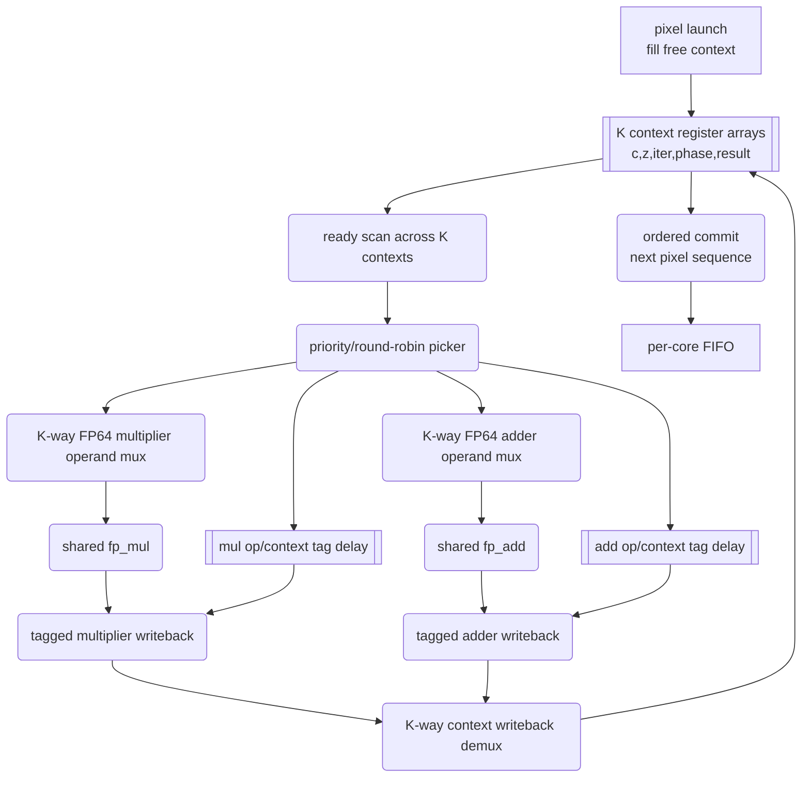
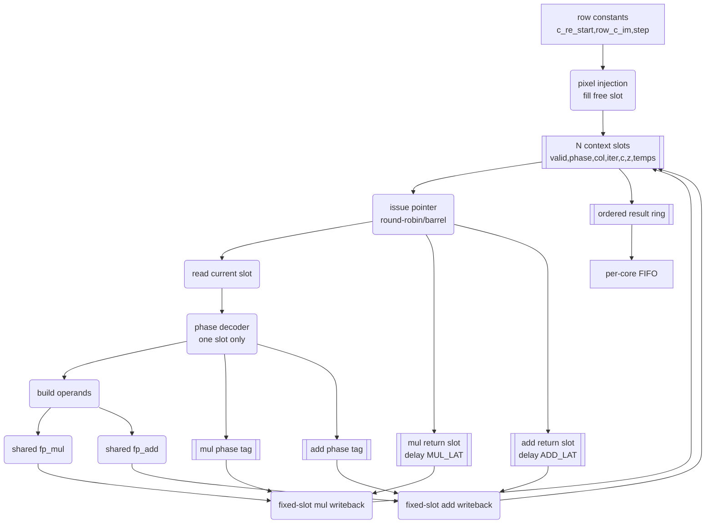
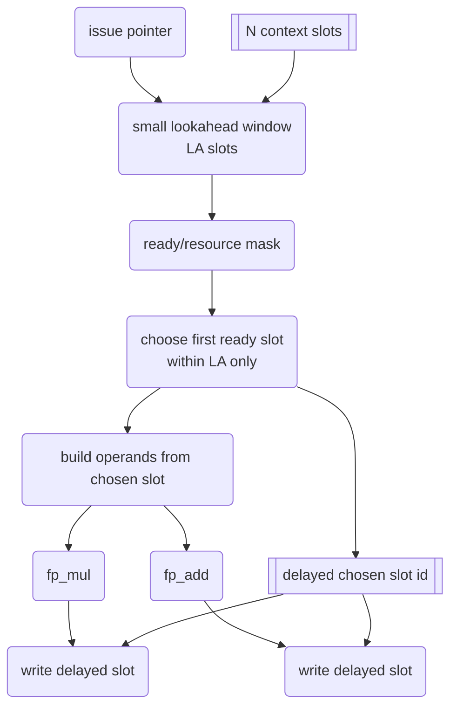

# Context Worker Architecture Report

This report compares the old generic N-context scoreboard worker with the planned low-LUT ring/barrel worker. It also documents a revised ring design with a small lookahead scheduling window, because the first rigid-ring model left too much performance on the table in branch-divergent scenes.

The new architecture simulator is `../tools/context_arch_sim.c`. It generates real Mandelbrot iteration traces and schedules the same trace through the old scoreboard model and several ring models.

This is a compute-side architecture model. It does not model UART bandwidth, host parsing, USB-UART behavior, placement, routing delay, or final bitstream timing.

## 1. Old N-Context Scoreboard Worker

The old generic N-context worker extends the current deployed 2-context worker. Each worker still shares FP64 units; it does not duplicate the full FP datapath for every context. Each pixel context keeps independent Mandelbrot state, and the scheduler scans all contexts to find ready operations.

Minimum per-context state:

| State | Purpose |
|---|---|
| `c_re`, `c_im` | Pixel coordinate. |
| `z_re`, `z_im` | Current Mandelbrot state. |
| `z_re_sq`, `z_im_sq`, `z_re_z_im` | Multiplier intermediates. |
| `tmp_re`, `next_re`, `tmp_2x` | Adder/subtractor intermediates. |
| `iter` | Current iteration count. |
| `phase` | Per-context micro-operation phase. |
| `col` or `seq` | Worker-local output order. |
| `result_valid`, `result_iter` | Completed result waiting for ordered commit. |

Scoreboard structure:



## 2. Old Scoreboard Timing

The old design is opportunistic. If any context is ready and the required FP unit is available, that context can issue, even if it is not the next fixed slot in a ring.

```text
cycle k:     scan K contexts, choose ready op, issue to FP pipeline
cycle k+6:   multiplier result returns with delayed context/op tag
cycle k+7:   adder result returns with delayed context/op tag
writeback:   result -> context[tag.ctx].field[tag.op]
commit:      emit only the next ordered pixel sequence
```

This gives high scheduling freedom and is a useful performance upper-bound model. The cost is that every context is visible to wide combinational logic.

Actual synthesis already showed that this generic shape is not deployable on xc7z010:

| Configuration | Behavioral sim | Slice LUTs | DSPs | Result |
|---|---:|---:|---:|---|
| Current 2ctx specialized worker | Board baseline | `13917 / 17600` (`79.07%`) | `37 / 80` | Deployable, timing clean |
| Generic 4ctx worker | PASS, 192 pixels | `37350 / 17600` (`212.22%`) | `37 / 80` | Not placeable |
| Generic 8ctx worker | PASS, 192 pixels | `71462 / 17600` (`406.03%`) | `37 / 80` | Not placeable |

The DSP count is almost unchanged. The blocker is LUT and routing pressure from K-way FP64 operand muxes, tagged writeback demuxes, ready scans, in-flight scans, and ordered-commit comparisons.

## 3. New Ring/Barrel Worker

The new design keeps the useful idea of multiple pixel contexts sharing FP units, but avoids full K-way scheduling. It uses fixed context slots and a rotating issue pointer, similar to a barrel processor.

Rigid ring structure:



Rigid ring timing:

```text
cycle k:     issue slot s phase p if ready and FP unit is available
cycle k+1:   issue slot s+1 or next fixed lane slot
cycle k+6:   multiplier result returns to delayed slot s
cycle k+7:   adder result returns to delayed slot s
commit:      ordered result ring emits only next pixel sequence
```

This removes most arbitrary context selection. It should be much cheaper than a generic scoreboard, but the first model showed weak speedups in high-context branch-divergent scenes because the pointer often visits a not-ready slot.

## 4. Revised Ring With Limited Lookahead

To recover performance without returning to a full K-way scoreboard, the revised design adds a small lookahead window after the issue pointer.

```text
lookahead = 1: rigid ring, current slot only
lookahead = 2: current slot or next slot
lookahead = 4: current slot plus next three slots
lookahead = K: approximates the old scoreboard and should be avoided in RTL
```

The intended RTL shape is a small ready mask and a small operand select over only `LA` candidate slots. For `LA=2` or `LA=4`, this is still much smaller than scanning all K contexts when K is 8, 12, or 16.

Revised scheduler structure:



Design tradeoff:

| Design | Scheduling freedom | Expected LUT cost | Purpose |
|---|---:|---:|---|
| `ring_la1` | Lowest | Lowest | Area baseline, but too rigid. |
| `ring_la2` | Low | Low | Cheap skip-ahead for 2/4ctx. |
| `ring_la4` | Moderate | Moderate | Best near-term candidate for 4/8ctx. |
| Full scoreboard | Highest | Too high | Performance upper bound only. |

The recommended near-term RTL target is therefore an explicit `4ctx ring_la4 1M+1A` worker, followed by `8ctx ring_la4 1M+1A` only if the 4ctx build has comfortable LUT/timing margin. It should not be implemented by only adding a lookahead parameter to the generic K-context scoreboard, because that still leaves Vivado with generic context arrays and wide writeback/operand selection structures.

## 5. Simulator

The simulator is `../tools/context_arch_sim.c`.

Build and self-test:

```bash
gcc -O2 -std=c99 -Wall -Wextra -o tools\context_arch_sim.exe tools\context_arch_sim.c
tools\context_arch_sim.exe --self-test
```

Pass marker:

```text
SELF-TEST PASS: iteration-count checks matched expected values
```

Sweep command:

```bash
tools\context_arch_sim.exe --width 160 --height 120 --max-iter 64 --center -0.5 0.0 --step 0.005 --sweep
```

The sweep outputs `scoreboard`, `ring_la1`, `ring_la2`, and `ring_la4` for each context/add/mul configuration.

## 6. Standard Scene Results

Scene:

```text
160x120, center=(-0.5,0), step=0.005, max_iter=64
avg_iter=59.953073, workers=4, MUL_LAT=6, ADD_LAT=7
```

| Configuration | Scoreboard pps | Ring LA1 pps | Ring LA2 pps | Ring LA4 pps | LA4 vs Scoreboard |
|---|---:|---:|---:|---:|---:|
| `2ctx 1M+1A` | `282406` | `246250` | `282406` | `282406` | `1.000x` |
| `4ctx 1M+1A` | `559300` | `391727` | `476486` | `559163` | `1.000x` |
| `8ctx 1M+1A` | `1041344` | `915152` | `915163` | `924595` | `0.888x` |
| `16ctx 1M+1A` | `1313372` | `912818` | `912829` | `919388` | `0.700x` |
| `16ctx 1M+2A` | `1965926` | `1804418` | `1804511` | `1807214` | `0.919x` |
| `16ctx 2M+1A` | `1315334` | `995126` | `1040322` | `1102152` | `0.838x` |
| `16ctx 2M+2A` | `2130214` | `1810658` | `1814109` | `1817511` | `0.853x` |

Observations:

- `LA4` almost completely fixes the 4ctx rigid-ring loss in this scene.
- At 8ctx and 16ctx with only `1M+1A`, `LA4` helps little because one issue lane and fixed row-level ordering still dominate.
- `16ctx 1M+2A` remains the most attractive high-context extra-unit direction; `2M+1A` is still adder-limited.

## 7. Seahorse Zoom Results

Scene:

```text
80x60, center=(-0.743643887037151,0.13182590420533), step=5e-6, max_iter=512
avg_iter=149.404792, workers=4, MUL_LAT=6, ADD_LAT=7
```

| Configuration | Scoreboard pps | Ring LA1 pps | Ring LA2 pps | Ring LA4 pps | LA4 vs Scoreboard |
|---|---:|---:|---:|---:|---:|
| `2ctx 1M+1A` | `101879` | `90646` | `101879` | `101879` | `1.000x` |
| `4ctx 1M+1A` | `173744` | `131771` | `149334` | `173744` | `1.000x` |
| `8ctx 1M+1A` | `278724` | `180948` | `180949` | `217237` | `0.779x` |
| `16ctx 1M+1A` | `371882` | `150546` | `150547` | `181245` | `0.487x` |
| `16ctx 1M+2A` | `441400` | `278472` | `281550` | `301309` | `0.683x` |
| `16ctx 2M+1A` | `375077` | `197133` | `224752` | `260403` | `0.694x` |
| `16ctx 2M+2A` | `451982` | `276120` | `279778` | `296868` | `0.657x` |

Observations:

- `LA4` again fixes 4ctx almost completely.
- High-context branch-divergent scenes still lose too much with only a 4-slot window.
- This argues against jumping straight to 16ctx ring. The better path is a small, measurable `4ctx ring_la4` prototype first.

## 8. RTL Implementation Attempt

The first RTL attempt implemented the lookahead idea directly inside `mandelbrot_core_worker_kctx` by adding:

- `LOOKAHEAD` parameter, defaulted through `CFG_WORKER_LOOKAHEAD`.
- `WORKER_LOOKAHEAD` top-level and testbench generics.
- A rotating `issue_ptr`.
- A bounded `issue_ptr + j` scan for multiplier and adder issue, where `j < LOOKAHEAD`.
- Build/simulation script support for `WORKER_CONTEXTS` and `WORKER_LOOKAHEAD`.

This was intentionally the smallest RTL change, but it is not the final low-LUT shape. It still uses generic context arrays for FP64 state and tagged writeback. Therefore it tests whether a bounded ready window alone is enough. It is not.

### 8.1 Behavioral Simulation Results

Command pattern:

```bash
vivado -mode batch -source sim_multicore_dynamic_contexts.tcl -tclargs <contexts> <lookahead>
```

| Case | Result | Pixels | Sim finish time | Notes |
|---|---|---:|---:|---|
| `4ctx LA1` | PASS | `192` | `497905 ns` | Rigid ring, lowest area. |
| `4ctx LA2` | PASS | `192` | `468745 ns` | Small skip-ahead. |
| `4ctx LA4` | PASS | `192` | `444355 ns` | Full 4-slot lookahead. |
| `8ctx LA4` | PASS | `192` | `328325 ns` | Functional, still generic-array RTL. |

All tested lookahead cases are functionally plausible in behavioral simulation.

### 8.2 Implementation Results On xc7z010

Command pattern:

```bash
vivado -mode batch -source build_fp64_contexts.tcl -tclargs <contexts> <lookahead>
```

| Case | Synthesis / implementation result | Slice LUTs | LUT as Logic | Registers | DSPs | BRAM | Timing |
|---|---|---:|---:|---:|---:|---:|---|
| Historical `2ctx` specialized worker on xc7z010 | Existing timing-clean baseline | `13917 / 17600` (`79.07%`) | `13641 / 17600` (`77.51%`) | `14458 / 35200` (`41.07%`) | `37 / 80` (`46.25%`) | `9.5 / 60` (`15.83%`) | `WNS=0.285ns`, routed clean |
| `4ctx LA1` generic lookahead | Bitstream generated, but timing failed | placed `16344 / 17600` (`92.86%`) | placed `15812 / 17600` (`89.84%`) | placed `19131 / 35200` (`54.35%`) | `37 / 80` (`46.25%`) | `9.5 / 60` (`15.83%`) | `WNS=-0.271ns`, `TNS=-3.574ns`, not acceptable |
| `4ctx LA2` generic lookahead | Placement blocked by LUT over-utilization | synth `25194 / 17600` (`143.15%`) | synth `24406 / 17600` (`138.67%`) | synth `19119 / 35200` (`54.32%`) | `37 / 80` (`46.25%`) | `9.5 / 60` (`15.83%`) | Not placed |
| `4ctx LA4` generic lookahead | Placement blocked by LUT over-utilization | synth `39025 / 17600` (`221.73%`) | synth `38237 / 17600` (`217.26%`) | synth `19197 / 35200` (`54.54%`) | `37 / 80` (`46.25%`) | `9.5 / 60` (`15.83%`) | Not placed |

The result is decisive: limiting the scan window improves the model, but implementing it inside the generic K-context worker does not produce a deployable `4ctx LA4` design. `LA1` is the only 4ctx lookahead variant that places and routes far enough to generate a bitstream, but it still misses 100 MHz timing. `LA2` and `LA4` are over the LUT budget before placement.

### 8.3 1080p Board Test Status

No 1080p board run was performed for the new 4ctx lookahead worker because there is no timing-clean candidate bitstream:

- `4ctx LA4`, the intended performance candidate, cannot be placed due to LUT over-utilization.
- `4ctx LA2` also cannot be placed.
- `4ctx LA1` generates a bitstream but fails timing at 100 MHz, so it is not a valid stability or 1080p performance candidate.
- On xc7z010, the `2ctx` timing-clean bitstream remained the only valid board-test baseline for these lookahead variants. On XC7K70T, the generic 4ctx scoreboard is now timing-clean and is the default, but this failed lookahead path still has no valid board-test candidate.

Running 1080p on a timing-failed exploratory bitstream would produce ambiguous results and would not validate the architecture.

### 8.4 What The Attempt Proves

This attempt proves that the model-level lookahead idea is useful, but it must be implemented as a genuinely low-LUT explicit worker. The problematic RTL structures are still present in the generic implementation:

- FP64 context arrays indexed by variable context id.
- Wide implicit muxes for context state reads.
- Tagged writeback into arbitrary context arrays.
- Generic loops that Vivado maps into broad mux fabrics even when the issue scan is bounded.
- Commit and state-update logic still touching all contexts.

The next implementation should not continue modifying `mandelbrot_core_worker_kctx`. It should be a hand-shaped `mandelbrot_core_worker_4ring` with four explicit slots and a small fixed `LA4` chooser.

## 9. Updated Design Direction

Recommended RTL path:

1. Implement a new `mandelbrot_core_worker_4ring` with explicit slots, `1M+1A`, and `LA=4`.
2. Keep the current worker interface and ordered FIFO contract.
3. Avoid generic FP64 context arrays for the performance-critical operand path.
4. Use four explicit slot records or four explicitly named slot banks so Vivado does not infer large generic mux fabrics.
5. Use a 4-slot ready mask and first-ready chooser inside the lookahead window.
6. Delay the chosen slot id through `MUL_LAT` and `ADD_LAT` pipelines for fixed-slot writeback.
7. Synthesize a single-core or two-core build before replicating four workers.
8. Only evaluate `8ctx ring_la4` after the explicit 4ctx build has enough LUT/timing margin.
9. Do not add a second adder until a high-context low-LUT worker is actually placeable.

The important change from the first ring idea is that rigid `LA=1` is too conservative, but the important lesson from the RTL attempt is that `LA4` must be implemented with a different RTL shape. A small `LA=4` window is still the right scheduling compromise; the failed part was using the generic K-context array worker as the implementation vehicle.
