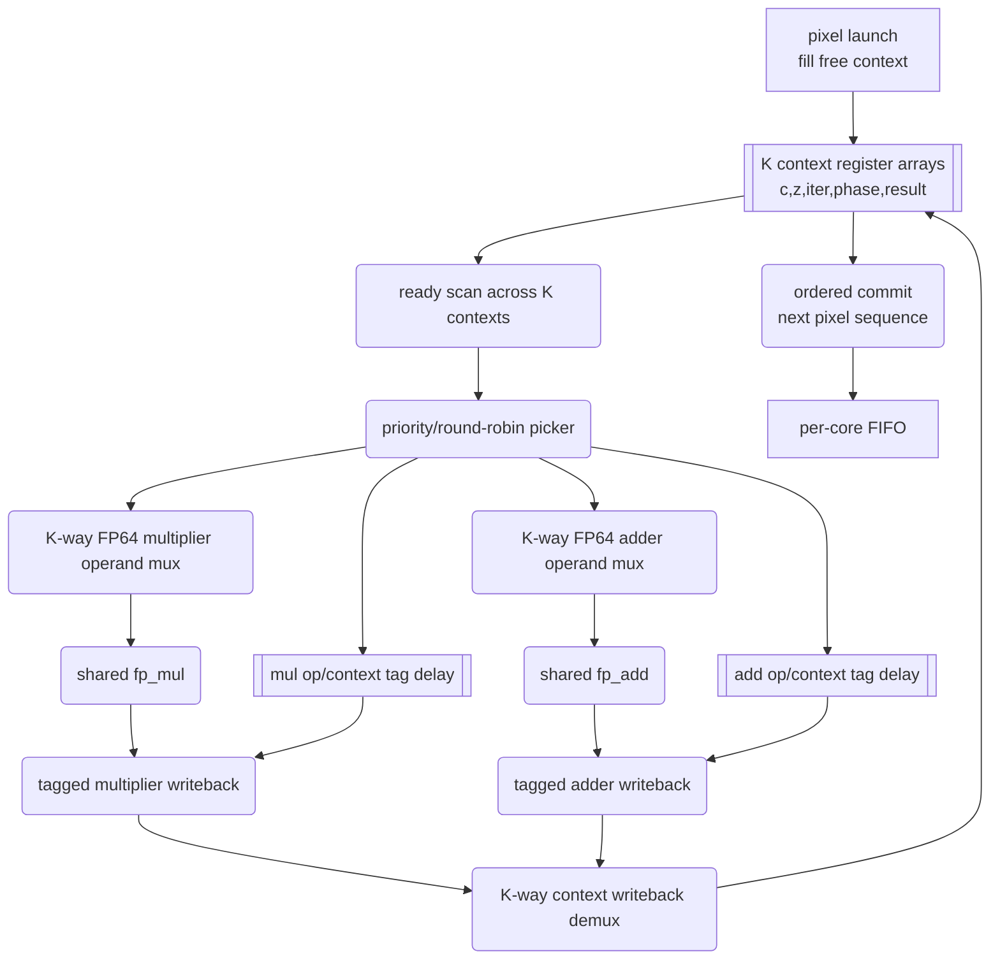
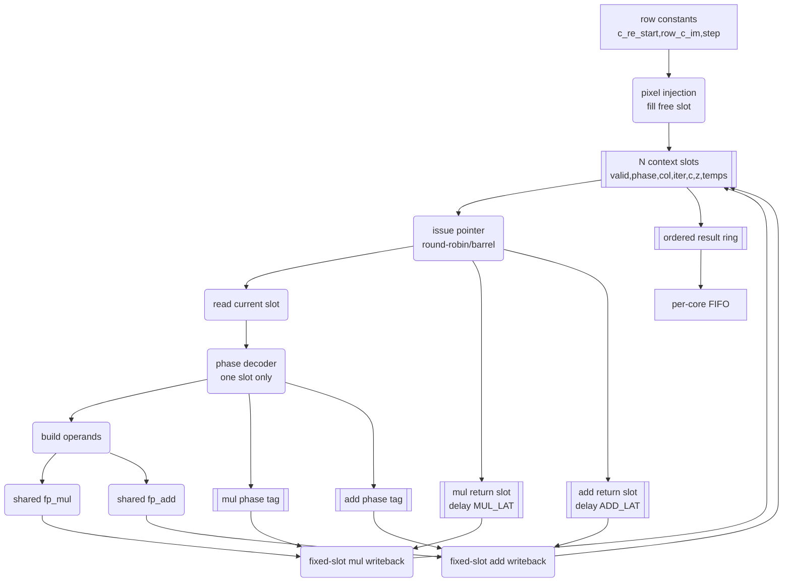

# Context Worker 架构报告（中文备份）

英文主文档见 `CONTEXT_WORKER_ARCHITECTURE_REPORT.md`。本文件作为中文备份，内容跟随英文主文档维护。

本文比较两种多 context Mandelbrot worker 架构：旧 generic N-context scoreboard 设计，以及新的低 LUT ring/barrel 设计方向。本文同时引入新的架构级模拟程序 `../tools/context_arch_sim.c`，用于在相同 Mandelbrot iteration trace 下比较不同 `ctx` 数、不同 `add/mul` 数量、旧设计和新设计的 compute-side 性能。当前新设计已从 rigid ring 扩展为带有限 lookahead 的 ring/barrel 调度，以解决原始 ring 性能倍率偏低的问题。

本文只建模 FPGA compute worker 调度，不建模 UART、host parser、USB-UART 驱动、布局布线延迟或 bitstream timing。因此结果用于判断架构趋势和瓶颈，不等同于板级最终帧率。

## 1. 旧 N-Context Scoreboard 结构

旧 generic N-context worker 的目标是把当前可部署的 2-context worker 推广到任意 `K` 个 context。每个 worker 仍共享 FP64 multiplier 和 FP64 adder，而不是复制 K 份 FP datapath。K 个 context 分别保存独立像素状态，调度器每周期扫描所有 context，选择 ready 的 context 发射 FP 操作。

每个 context 至少包含：

| State | 用途 |
|---|---|
| `c_re`, `c_im` | 当前像素坐标。 |
| `z_re`, `z_im` | Mandelbrot 迭代状态。 |
| `z_re_sq`, `z_im_sq`, `z_re_z_im` | 乘法结果中间值。 |
| `tmp_re`, `next_re`, `tmp_2x` | 加减法中间值。 |
| `iter` | 当前像素迭代计数。 |
| `phase` | 当前 context 的微操作阶段。 |
| `col` 或 `seq` | worker-local 输出顺序。 |
| `result_valid`, `result_iter` | 已完成但等待 ordered commit 的结果。 |

旧结构的核心是 scoreboard：



## 2. 旧结构时序

旧 scoreboard 结构是 opportunistic 调度。只要某个 context ready，且对应 FP unit 可用，它就可以被调度，即使它不是当前 round-robin pointer 指向的第一个 context。

典型时序：

```text
cycle k:     scan K contexts, choose ready op, issue to FP pipeline
cycle k+6:   multiplier result returns with delayed context/op tag
cycle k+7:   adder result returns with delayed context/op tag
writeback:   result -> context[tag.ctx].field[tag.op]
commit:      only emit next ordered pixel sequence
```

优点是调度自由度高。context 0 如果还在等 FP result，context 5 已 ready，则旧设计可以立即使用 context 5，减少 FP unit bubble。

缺点是所有 context 都暴露给组合逻辑：ready scan、FP64 operand mux、tagged writeback demux、in-flight scan 和 commit compare 都随 K 增大而快速膨胀。

旧 generic K-context RTL 的实际综合结果已经说明它不能直接部署在 xc7z010：

| 配置 | 行为仿真 | Slice LUTs | DSPs | 结果 |
|---|---:|---:|---:|---|
| 当前 2ctx 专用 worker | board baseline | `13917 / 17600` (`79.07%`) | `37 / 80` | 可部署，timing clean |
| Generic 4ctx worker | PASS, 192 pixels | `37350 / 17600` (`212.22%`) | `37 / 80` | 不可布局 |
| Generic 8ctx worker | PASS, 192 pixels | `71462 / 17600` (`406.03%`) | `37 / 80` | 不可布局 |

DSP 数量几乎不变，说明瓶颈不是 FP unit 数量，而是 LUT 逻辑和路由压力。

## 3. 新 Ring/Barrel 设计思路

新设计保留“多个 context 共享 FP unit”的方向，但不再每周期全局扫描 K 个 context。它把 worker 做成类似 barrel processor 的结构：N 个固定 slot 保存 N 个像素状态，issue pointer 按固定或近似固定顺序轮转，FP result 按 latency-delayed return pointer 写回固定 slot。

核心目标不是减少 context state，而是减少 K 路任意选择逻辑：

| 项目 | 旧 scoreboard | 新 ring/barrel |
|---|---|---|
| Context 选择 | 每周期扫描所有 K 个 context。 | 当前 slot 或小固定 lane group。 |
| Operand 选择 | K 路 FP64 mux。 | 当前 slot read，mux 更窄。 |
| Result routing | context/op tag demux 到任意 context。 | latency-delayed return slot。 |
| In-flight tracking | 扫描 tag pipeline 和 context 状态。 | slot phase + 固定 latency。 |
| Commit | active context compare。 | ordered result ring。 |
| 性能 | 同 K/A/M 下通常更高。 | 同 K/A/M 下通常更低。 |
| 面积目标 | 4/8ctx 已实测不可部署。 | 目标是让 4/8/12/16ctx 有部署可能。 |

新设计的重点是面积和时序可收敛性，而不是在理想调度模型下超过旧 scoreboard。

## 4. 新 Ring/Barrel 结构



新结构中的关键模块：

| 模块 | 说明 |
|---|---|
| Context slots | 固定 N 个 slot，每个 slot 保存一个像素 context。 |
| Issue pointer | 按固定顺序选择当前 slot，不做全局 ready priority scan。 |
| Phase decoder | 只解码当前 slot 的 phase，生成当前 FP operands。 |
| Return pointer delay | issue slot id 延迟 `MUL_LAT` 或 `ADD_LAT` 周期后用于写回。 |
| Phase tag delay | 只保留小 phase tag，说明 result 应写入哪个字段。 |
| Ordered result ring | 保持现有 worker FIFO 的 raster-order contract。 |

## 5. 新结构时序

新 ring/barrel 结构的理想时序：

```text
cycle k:     issue slot s phase p if ready and FP unit is available
cycle k+1:   issue slot s+1 or next fixed lane slot
cycle k+6:   multiplier result returns to delayed slot s
cycle k+7:   adder result returns to delayed slot s
commit:      ordered result ring emits only next pixel sequence
```

如果当前 slot 不 ready，新模型会产生 bubble，或者只在很小的 fixed lane group 内尝试其它 slot。它不会像旧 scoreboard 一样全局寻找最优 ready context。因此，新结构牺牲一部分调度自由度换取较低 LUT 和更可控的 timing。

## 6. RTL 更改方向

推荐的 RTL 演进不是继续扩展 `mandelbrot_core_worker_kctx`，而是新增一个显式低 LUT worker，例如 `mandelbrot_core_worker_4ring`。

建议更改：

1. 保留当前 worker 外部接口，避免改 `mandelbrot_multicore`、per-core FIFO 和上层 raster merge contract。
2. 初版只做 `4ctx 1M+1A`，不要同时加入第二 adder 或 8/16ctx。
3. 用固定 slot arrays 替代 generic scoreboard ready arrays。
4. 用 `issue_slot_pipe[MUL_LAT]` / `issue_slot_pipe[ADD_LAT]` 替代 arbitrary context writeback demux。
5. 用小 phase tag pipeline 替代宽 op/context metadata。
6. 用 ordered result ring 保证 worker 输出顺序不变。
7. 先综合 single-core 或 two-core build，确认 LUT scaling，再复制到 4 cores。

如果初版 ring worker 仿真性能过低，再考虑有限 skip-ahead，例如只检查当前 slot 后 1 到 3 个 slot，而不是恢复完整 K-way scoreboard。

## 6.1 有限 Lookahead 调度

原始 ring 设计 `lookahead=1` 只检查当前 slot，面积最低，但在 branch-divergent 场景下性能倍率偏低。修正版在 issue pointer 后增加一个小窗口：

```text
lookahead = 1: rigid ring，只检查当前 slot
lookahead = 2: 当前 slot 或下一个 slot
lookahead = 4: 当前 slot 加后续 3 个 slot
lookahead = K: 接近旧 scoreboard，不建议作为 RTL 目标
```

对应 RTL 不是全局 K 路扫描，而是小范围 ready mask 和 first-ready chooser。`LA=4` 对 4ctx worker 来说基本等价于小型 scoreboard，但仍远小于 8/12/16ctx 全局 scoreboard。推荐当前 RTL 原型目标改为 `4ctx ring_la4 1M+1A`。

## 7. 新模拟程序

新增模拟程序：`../tools/context_arch_sim.c`。

它会先按场景参数生成真实 Mandelbrot iteration trace，然后用两种模型调度同一组像素：

| 模型 | 含义 |
|---|---|
| `scoreboard` | 旧 generic N-context ready-scan 设计。 |
| `ring` | 新 fixed-slot ring/barrel 设计。 |

编译：

```bash
gcc -O2 -std=c99 -Wall -Wextra -o tools\context_arch_sim.exe tools\context_arch_sim.c
```

自测：

```bash
tools\context_arch_sim.exe --self-test
```

通过结果：

```text
SELF-TEST PASS: iteration-count checks matched expected values
```

典型 sweep：

```bash
tools\context_arch_sim.exe --width 160 --height 120 --max-iter 64 --center -0.5 0.0 --step 0.005 --sweep
```

输出字段包括：

| 字段 | 说明 |
|---|---|
| `cycles` | compute-only worker cycles。 |
| `compute_pps` | 按 100 MHz 估算的 compute-only pixels/s。 |
| `speedup_vs_1ctx_same_model` | 相对同模型 `1ctx 1M+1A` 的加速。 |
| `vs_scoreboard` | 同配置下 ring/lookahead 相对 scoreboard 的速度。小于 1 表示 ring 更慢。 |

`--sweep` 会输出 `scoreboard`、`ring_la1`、`ring_la2`、`ring_la4`。

## 8. 模拟结果：Standard Scene

场景参数：

```text
image=160x120
center=(-0.5,0)
step=0.005
max_iter=64
avg_iter=59.953073
workers=4
MUL_LAT=6
ADD_LAT=7
scheduler=dynamic
clock=100 MHz
```

| 配置 | Scoreboard pps | Ring LA1 pps | Ring LA2 pps | Ring LA4 pps | LA4 vs Scoreboard |
|---|---:|---:|---:|---:|---:|
| `2ctx 1M+1A` | `282406` | `246250` | `282406` | `282406` | `1.000x` |
| `4ctx 1M+1A` | `559300` | `391727` | `476486` | `559163` | `1.000x` |
| `8ctx 1M+1A` | `1041344` | `915152` | `915163` | `924595` | `0.888x` |
| `16ctx 1M+1A` | `1313372` | `912818` | `912829` | `919388` | `0.700x` |
| `16ctx 1M+2A` | `1965926` | `1804418` | `1804511` | `1807214` | `0.919x` |
| `16ctx 2M+1A` | `1315334` | `995126` | `1040322` | `1102152` | `0.838x` |
| `16ctx 2M+2A` | `2130214` | `1810658` | `1814109` | `1817511` | `0.853x` |

结论：

- `LA4` 在该场景下几乎完全修复 4ctx rigid ring 的性能损失。
- 8ctx/16ctx 单 lane 下 `LA4` 帮助有限，说明固定 row/slot 顺序仍是瓶颈。
- `16ctx 1M+2A` 仍是高 context 后更有价值的 extra-unit 方向；`2M+1A` 仍偏 adder-limited。

## 9. 模拟结果：Seahorse Zoom

场景参数：

```text
image=80x60
center=(-0.743643887037151,0.13182590420533)
step=5e-6
max_iter=512
avg_iter=149.404792
workers=4
MUL_LAT=6
ADD_LAT=7
scheduler=dynamic
clock=100 MHz
```

| 配置 | Scoreboard pps | Ring LA1 pps | Ring LA2 pps | Ring LA4 pps | LA4 vs Scoreboard |
|---|---:|---:|---:|---:|---:|
| `2ctx 1M+1A` | `101879` | `90646` | `101879` | `101879` | `1.000x` |
| `4ctx 1M+1A` | `173744` | `131771` | `149334` | `173744` | `1.000x` |
| `8ctx 1M+1A` | `278724` | `180948` | `180949` | `217237` | `0.779x` |
| `16ctx 1M+1A` | `371882` | `150546` | `150547` | `181245` | `0.487x` |
| `16ctx 1M+2A` | `441400` | `278472` | `281550` | `301309` | `0.683x` |
| `16ctx 2M+1A` | `375077` | `197133` | `224752` | `260403` | `0.694x` |
| `16ctx 2M+2A` | `451982` | `276120` | `279778` | `296868` | `0.657x` |

结论：

- `LA4` 同样几乎完全修复 4ctx 的 rigid ring 损失。
- 8ctx/16ctx branch-divergent 场景仍损失明显，因此不建议直接跳到 16ctx ring。
- 当前最合理的下一步是先实现 `4ctx ring_la4 1M+1A`，实测 LUT/timing 后再决定是否扩展。

## 10. RTL 实施尝试结果

本轮先采用最小 RTL 改动，把 lookahead 直接加到现有 `mandelbrot_core_worker_kctx`：新增 `LOOKAHEAD`、`WORKER_LOOKAHEAD`、`issue_ptr`，并把 mul/add issue 的扫描限制为 `issue_ptr` 后的有限窗口。该方法验证了“限制 ready scan”本身是否足够降低 LUT。结论是不够。

行为仿真结果：

| Case | 结果 | Pixels | 仿真结束时间 | 说明 |
|---|---|---:|---:|---|
| `4ctx LA1` | PASS | `192` | `497905 ns` | rigid ring，面积最低。 |
| `4ctx LA2` | PASS | `192` | `468745 ns` | 小窗口 skip-ahead。 |
| `4ctx LA4` | PASS | `192` | `444355 ns` | 4-slot lookahead。 |
| `8ctx LA4` | PASS | `192` | `328325 ns` | 功能可行，但仍是 generic-array RTL。 |

实现结果：

| Case | 综合/实现结果 | Slice LUTs | LUT as Logic | Registers | DSPs | BRAM | Timing |
|---|---|---:|---:|---:|---:|---:|---|
| 当前默认 `2ctx` 专用 worker | 已有 timing-clean baseline | `13917 / 17600` (`79.07%`) | `13641 / 17600` (`77.51%`) | `14458 / 35200` (`41.07%`) | `37 / 80` (`46.25%`) | `9.5 / 60` (`15.83%`) | `WNS=0.285ns`, routed clean |
| `4ctx LA1` generic lookahead | 生成 bitstream，但 timing failed | placed `16344 / 17600` (`92.86%`) | placed `15812 / 17600` (`89.84%`) | placed `19131 / 35200` (`54.35%`) | `37 / 80` (`46.25%`) | `9.5 / 60` (`15.83%`) | `WNS=-0.271ns`, `TNS=-3.574ns` |
| `4ctx LA2` generic lookahead | LUT 超量，placement 阻塞 | synth `25194 / 17600` (`143.15%`) | synth `24406 / 17600` (`138.67%`) | synth `19119 / 35200` (`54.32%`) | `37 / 80` (`46.25%`) | `9.5 / 60` (`15.83%`) | Not placed |
| `4ctx LA4` generic lookahead | LUT 超量，placement 阻塞 | synth `39025 / 17600` (`221.73%`) | synth `38237 / 17600` (`217.26%`) | synth `19197 / 35200` (`54.54%`) | `37 / 80` (`46.25%`) | `9.5 / 60` (`15.83%`) | Not placed |

1080p 板级测试状态：未执行。原因是没有 timing-clean 的 4ctx lookahead bitstream。`4ctx LA4` 和 `4ctx LA2` 不能 placement，`4ctx LA1` 虽能生成 bitstream 但 100 MHz timing failed，因此不能作为稳定 1080p 测试候选。当前仍只有默认 `2ctx` timing-clean bitstream 是有效板级 baseline。

本轮实施说明：模型级 `LA4` 思路仍然有价值，但不能通过在 generic K-context worker 上加窗口实现。真正的下一步必须是显式 `mandelbrot_core_worker_4ring`，避免 generic FP64 context arrays、任意 context writeback 和 Vivado 推导出的宽 mux fabrics。

## 11. 总结

旧 scoreboard 是性能上界模型，但 4/8ctx 已实测 LUT 过量，不适合继续作为部署 RTL 方向。原始 rigid ring 的面积目标正确，但调度自由度过低。加入小窗口 lookahead 后，模型中 `LA4` 能恢复 4ctx 场景下大部分甚至全部 scoreboard 性能；但本轮 RTL 证明，仅在 generic kctx 上限制 scan window 仍然无法得到可部署设计。

下一步应新写显式 `4ctx ring_la4 1M+1A` worker，并用 single-core 或 two-core build 测 LUT scaling。只有当显式低 LUT 高 context worker 可部署后，才值得继续评估 `8ctx ring_la4`、`1M+2A` 或更高 FP unit 数量。
