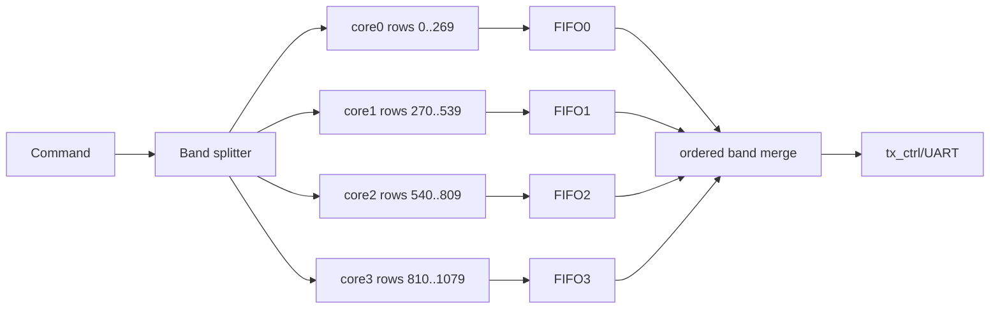
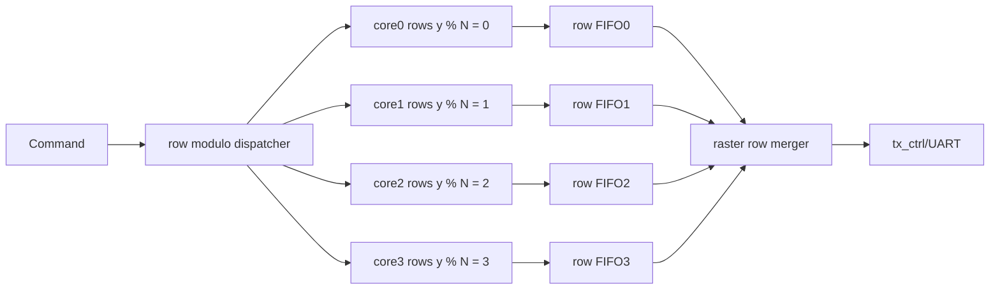
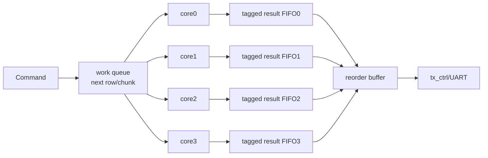

# Multi-Core Mandelbrot Feasibility Study

This document evaluates whether the current FP64 Mandelbrot accelerator can be scaled from one compute core to multiple compute cores on the tested Zynq-7010 target. It covers resource headroom, expected scaling, task distribution strategies, output ordering, protocol implications, and a parameterized multi-core architecture proposal.

## Current Baseline

Current validated baseline:

| Item | Value |
|---|---:|
| FPGA | Xilinx Zynq-7010 `xc7z010clg400-1` |
| System clock | 100 MHz |
| FP mode | FP64 |
| Core rate | true 100 MHz, `FP_CE_DIV=1` |
| UART baudrate | 500000 baud |
| UART pixel ceiling | 25000 pixels/s |
| `PIPE_WAIT` | 9 |
| Output pixel | `uint16` iteration count |
| Output order | raster order |

Routed timing for the current 500000 baud build:

| Metric | Value |
|---|---:|
| WNS | `0.690ns` |
| TNS | `0.000ns` |
| WHS | `0.011ns` |
| THS | `0.000ns` |

## Current Resource Utilization

Current placed utilization from `top_utilization_placed.rpt`:

| Resource | Used | Available | Utilization |
|---|---:|---:|---:|
| Slice LUTs | 1947 | 17600 | 11.06% |
| LUT as Logic | 1878 | 17600 | 10.67% |
| LUT as Memory / SRL | 69 | 6000 | 1.15% |
| Slice Registers | 2685 | 35200 | 7.63% |
| Slices | 813 | 4400 | 18.48% |
| Block RAM Tile | 0.5 | 60 | 0.83% |
| RAMB18 | 1 | 120 | 0.83% |
| DSP48E1 | 10 | 80 | 12.50% |
| BUFGCTRL | 1 | 32 | 3.13% |
| Bonded IOB | 3 | 100 | 3.00% |

The design is resource-light. DSP48E1 usage is the main first-order limit for FP64 multi-core scaling.

## Per-Core Resource Estimate

The current top-level design uses 10 DSP48E1 blocks. One DSP is used by `tx_ctrl` for `rows * cols`, based on Vivado DRC messages. The Mandelbrot FP64 compute core therefore uses about 9 DSPs, dominated by the 53x53 FP64 mantissa multiplier.

Approximate DSP model:

```text
DSP_total(N) ~= 1 + 9 * N
```

where `N` is the number of Mandelbrot compute cores and `1` is the shared `tx_ctrl` pixel-count multiply.

Estimated DSP capacity:

| Cores | Estimated DSPs | DSP Utilization | Feasibility |
|---:|---:|---:|---|
| 1 | 10 | 12.5% | current |
| 2 | 19 | 23.8% | easy |
| 3 | 28 | 35.0% | likely easy |
| 4 | 37 | 46.3% | good target |
| 6 | 55 | 68.8% | possible but timing/routing risk grows |
| 8 | 73 | 91.3% | theoretical upper bound, high routing/timing risk |

Approximate LUT/register estimates are less exact because current top-level overhead is mixed with the core. A conservative planning model is:

```text
LUT_total(N) ~= 500 + 1450 * N + merge_logic
FF_total(N)  ~= 600 + 2100 * N + merge_logic
```

Estimated logic capacity with small merge overhead:

| Cores | Estimated LUTs | LUT Utilization | Estimated FFs | FF Utilization |
|---:|---:|---:|---:|---:|
| 1 | ~1950 | 11% | ~2700 | 8% |
| 2 | ~3400 | 19% | ~4800 | 14% |
| 4 | ~6300 | 36% | ~9000 | 26% |
| 6 | ~9200 | 52% | ~13200 | 38% |
| 8 | ~12100 | 69% | ~17400 | 49% |

Logic is not the limiting factor for 2 or 4 cores. DSP routing and output bandwidth are more important.

## Performance Limits

### UART-Limited Workloads

At 500000 baud:

```text
500000 bits/s / 10 UART bits per byte / 2 bytes per pixel = 25000 pixels/s
```

Any scene that already approaches 25000 pixels/s cannot improve with more cores unless output bandwidth increases or the protocol compresses output.

Examples from current measurements:

| Case | Throughput | Bottleneck |
|---|---:|---|
| 1080p standard @64 | 24830.65 pixels/s | UART |
| 1080p deep triple spiral @8192 | 24833.70 pixels/s | UART |

Multi-core provides almost no benefit for those cases while using more DSPs.

### Compute-Bound Workloads

Deep zoom/high-iteration scenes remain compute-bound:

| Case | Current Throughput | Bottleneck |
|---|---:|---|
| 1080p deep tendrils @8192 | 6098.30 pixels/s | compute |
| 1080p deep minibrot @8192 | 2437.46 pixels/s | compute |
| 1080p deep seahorse @1024 | 5708.41 pixels/s | compute |

These can benefit from multiple cores until aggregate compute throughput approaches the UART ceiling.

Approximate speedup ceiling with 500000 baud:

| Case | 1-Core pps | UART Ceiling | Maximum Useful Core Scaling |
|---|---:|---:|---:|
| Tendrils @8192 | 6098 | 25000 | ~4.1x |
| Mini-brot @8192 | 2437 | 25000 | ~10.3x |
| Seahorse @1024 | 5708 | 25000 | ~4.4x |

This means 4 cores are useful for many compute-heavy 1080p scenes. More than 4 cores only helps the most compute-bound scenes unless UART bandwidth is also improved.

## Multi-Core Design Requirements

A multi-core design must solve four problems:

1. Assign pixels or regions to cores.
2. Preserve or describe output order.
3. Merge per-core results into the UART stream.
4. Apply backpressure without deadlocking fast cores or overflowing buffers.

The current host protocol expects a single raster-ordered pixel stream with no coordinates attached to pixels. That strongly affects which task scheduling strategies are practical.

## Task Distribution Strategies

### Option A: Contiguous Row Bands

Each core receives a contiguous vertical band of rows.

Example for 4 cores and 1080 rows:

```text
core0: rows 0..269
core1: rows 270..539
core2: rows 540..809
core3: rows 810..1079
```



Pros:

- Simple coordinate generation.
- Natural raster order if the merger drains core0, then core1, then core2, then core3.
- Minimal protocol changes.
- Minimal output metadata.

Cons:

- Load balance can be poor. Mandelbrot complexity varies spatially.
- Lower bands may finish early and wait for upper bands to transmit.
- A slow band can dominate total frame time.
- Per-core FIFOs must hold results while waiting for earlier bands, or cores must stall.

Efficiency:

| Workload | Expected Efficiency |
|---|---|
| Symmetric standard view | medium to good |
| Localized deep zoom | variable |
| Highly uneven detail | poor to medium |

Assessment: easiest first implementation, but not the best long-term scheduler.

### Option B: Interleaved Rows

Each core computes every Nth row.

Example for 4 cores:

```text
core0: rows 0, 4, 8, ...
core1: rows 1, 5, 9, ...
core2: rows 2, 6, 10, ...
core3: rows 3, 7, 11, ...
```



Pros:

- Better load balance than contiguous bands because rows from different vertical regions are distributed across cores.
- Still preserves row-level structure.
- Host protocol can remain unchanged if the hardware merger outputs rows in increasing order.

Cons:

- Requires row-order-aware merge logic.
- Per-core output buffering must handle complete or partial rows.
- A row that is late can stall transmission of later rows.
- Current `mandelbrot_core` assumes continuous raster progression and would need start-row/row-stride parameters.

Efficiency:

| Workload | Expected Efficiency |
|---|---|
| Standard view | good |
| Deep zoom with uneven row costs | good |
| Extreme localized features | medium to good |

Assessment: best first serious multi-core design if preserving the current host protocol is important.

### Option C: Contiguous Row Chunks With Dynamic Assignment

The dispatcher keeps a queue of row chunks. Each core requests work when idle. A chunk can be one row or several rows.



Pros:

- Best load balance.
- Handles uneven Mandelbrot workloads well.
- Generic across image sizes and zoom points.
- Easy to tune chunk size.

Cons:

- Output order becomes hard if the current raster-only protocol is preserved.
- Requires row/chunk IDs in hardware FIFOs.
- Requires a reorder buffer or protocol change.
- Worst-case buffering can grow if an early row/chunk is slow and later chunks finish first.

Efficiency:

| Workload | Expected Efficiency |
|---|---|
| Standard view | good |
| Deep zoom | very good |
| Highly uneven features | best |

Assessment: best compute efficiency, but more complex. It is attractive if the protocol is allowed to include row/tile IDs or if the host can reorder results.

### Option D: Tile-Based Scheduling

The image is divided into rectangular tiles such as `64x64`, `128x16`, or `256x8`. Cores compute tiles.

Pros:

- Good locality.
- Flexible for future non-UART protocols.
- Can support dynamic scheduling.
- Useful if output protocol includes tile coordinates.

Cons:

- Current raster stream cannot consume tiles without reordering.
- Tile buffers can be large.
- Host changes are likely required.

Efficiency:

| Workload | Expected Efficiency |
|---|---|
| Standard view | good |
| Deep zoom | good to very good |
| Highly localized features | good with small tiles |

Assessment: good long-term architecture if protocol v2 supports tagged outputs.

### Option E: Pixel Interleaving

Each core computes every Nth pixel in raster order.

Pros:

- Excellent fine-grained load distribution.
- Cores see mixed workload complexity.

Cons:

- Very hard to output in raster order without per-pixel reorder logic.
- Coordinate generation becomes more complex.
- FIFO metadata overhead grows.
- Not worth it for the current UART stream.

Assessment: not recommended for this project.

## Output Ordering Strategies

### Keep Current Raster Protocol

Current response format:

```text
header: R K rows cols
payload: uint16 pixels in strict raster order
checksum: XOR over pixel bytes
```

If this protocol is preserved, hardware must output pixels in raster order. This favors:

- contiguous row bands with ordered band drain
- interleaved rows with row-order merger

It disfavors:

- dynamic chunks
- tiles
- pixel interleaving

because those require reorder buffering.

### Add Tagged Output Protocol

A protocol v2 could attach row or tile IDs:

```text
frame header
chunk header: y_start, x_start, rows, cols, payload_len
chunk payload: uint16 pixels
chunk checksum
...
frame checksum/end
```

Pros:

- Host can reorder results.
- Hardware merge becomes much simpler.
- Dynamic scheduling becomes practical.
- Fewer on-FPGA buffers.

Cons:

- Host must change.
- More bytes per chunk.
- Backward compatibility requires versioning.

For UART, chunk overhead is acceptable if chunks are reasonably large, e.g. row chunks or tiles of at least several thousand pixels.

## Recommended Architecture

### Phase 1: Parameterized Interleaved-Row Multi-Core, Raster-Compatible

Recommended first implementation target: 2 cores, then 4 cores.

Key idea:

```text
core_i computes rows where y % CORE_COUNT == i
hardware merger emits rows y = 0, 1, 2, ... in raster order
```

Required changes:

- Add `CORE_COUNT` parameter.
- Modify or wrap `mandelbrot_core` so each core accepts:
  - `row_start`
  - `row_stride`
  - `rows_total`
  - `cols`
  - common center/step/max_iter
- Each core writes pixels to a per-core FIFO.
- Add a row-aware merger that drains from the FIFO for the core responsible for the next expected row.
- Add row boundary markers or predictable per-row pixel counting in the merger.
- Keep existing host protocol unchanged.

Merger behavior:

```text
next_row = 0
while next_row < rows:
    src = next_row % CORE_COUNT
    wait until FIFO[src] has enough data for this row or a row-start marker
    stream cols pixels from FIFO[src]
    next_row++
```

Buffering:

- Minimal implementation can let the merger consume each row as it appears and backpressure cores through per-core FIFOs.
- More robust implementation gives each core at least one row of buffering.
- For 1920-wide images, one row is 1920 pixels x 16 bits = 30720 bits, about 1.7 RAMB18 per row.
- For 4 cores with one row buffer each, expect around 7 RAMB18, still low versus 120 available.

### Phase 2: Tagged Dynamic Row-Chunks

If protocol changes are acceptable, move to dynamic chunks.

Recommended chunk shape:

```text
chunk = K rows x full image width
```

Good starting values:

| Image Width | Suggested Chunk Rows |
|---:|---:|
| <= 320 | 4 to 8 |
| 640 | 2 to 4 |
| 1920 | 1 to 2 |

Dynamic row chunks balance workload better than static assignment and keep metadata simple.

## Parameterization Plan

Add a top-level parameter:

```verilog
parameter CORE_COUNT = 1;
```

Use generate blocks:

```verilog
genvar i;
generate
    for (i = 0; i < CORE_COUNT; i = i + 1) begin : g_core
        mandelbrot_core_worker u_core_i (...);
        queue #(.DEPTH(CORE_FIFO_DEPTH), .DATA_W(16)) u_fifo_i (...);
    end
endgenerate
```

Recommended new modules:

| Module | Role |
|---|---|
| `mandelbrot_core_worker` | Computes assigned rows/chunks, no global TX start. |
| `work_dispatch_static` | Generates row-start/stride assignments for each core. |
| `work_dispatch_dynamic` | Optional later dynamic chunk scheduler. |
| `multi_fifo_merge_raster` | Reads per-core FIFOs and emits raster-ordered pixels. |
| `tx_ctrl` | Can remain mostly unchanged if merger emits one ordered pixel stream. |

Keep these shared:

- `uart_rx`
- `uart_tx`
- `cmd_parser`
- `tx_ctrl`
- command protocol for Phase 1

Replicate these per core:

- `mandelbrot_core` worker FSM
- `fp_mul`
- `fp_add`
- per-core output FIFO

## Expected Scaling

### With 500000 Baud UART

The 500000 baud UART caps output at 25000 pixels/s. Expected scaling depends on the one-core throughput for a scene.

| 1-Core Throughput | 2-Core Expected | 4-Core Expected | Limiter |
|---:|---:|---:|---|
| 25000 pps | no gain | no gain | UART already saturated |
| 12000 pps | ~2x to 24000 pps | ~2.1x max | UART after 2 cores |
| 6100 pps | ~2x to 12200 pps | ~4x to 24400 pps | UART near 4 cores |
| 2400 pps | ~2x to 4800 pps | ~4x to 9600 pps | compute still limits |

For current measured 1080p cases:

| Case | 1-Core pps | 2-Core Estimate | 4-Core Estimate | Notes |
|---|---:|---:|---:|---|
| Standard @64 | 24830 | ~25000 | ~25000 | UART-limited; no useful multi-core gain. |
| Seahorse zoom @512 | 12069 | ~24100 | ~25000 | 2 cores nearly saturate UART. |
| Tendrils @8192 | 6098 | ~12200 | ~24400 | 4 cores useful. |
| Mini-brot @8192 | 2437 | ~4870 | ~9750 | 4 cores still compute-bound. |
| Seahorse @1024 | 5708 | ~11400 | ~22800 | 4 cores useful. |

### With Future Higher Baudrate

If UART is improved to 1 Mbps or higher using oversampling/fractional generation, 4-core and maybe 6-core designs become more attractive.

| Baudrate | Pixel Ceiling | Useful Core Count Range |
|---:|---:|---|
| 500000 | 25000 pps | 2 to 4, workload-dependent |
| 1000000 | 50000 pps | 4 to 6 |
| 2000000 | 100000 pps | 4 to 8 if UART is reliable |

## Risks

| Risk | Impact | Mitigation |
|---|---|---|
| DSP routing congestion | Timing may fail above 4 cores | Start with 2, floorplan/DSP-aware placement if needed. |
| Output-order stalls | Fast cores may block behind slow rows | Use interleaved rows or dynamic chunk protocol. |
| FIFO depth insufficient | Data loss or core stalls | Use per-core BRAM row buffers. |
| UART remains bottleneck | Multi-core speedup limited | Pair multi-core work with UART RX/TX upgrade. |
| Protocol complexity | Host changes and checksum changes | Keep Phase 1 raster-compatible; add protocol v2 later. |
| Load imbalance | Poor scaling | Prefer interleaved rows over contiguous bands. |

## Implementation Roadmap

### Milestone 1: Refactor Single Core Into Worker

- Separate image-level control from row computation.
- Add worker parameters: `row_start`, `row_stride`, `rows_total`, `cols`.
- Preserve single-core behavior with `CORE_COUNT=1`.
- Run existing `../sim_core.tcl` and board verify.

### Milestone 2: Static 2-Core Interleaved Rows

- Instantiate `CORE_COUNT=2` workers.
- Add per-core FIFOs.
- Add raster row merger.
- Keep existing host protocol.
- Validate small images and 1080p standard/deep cases.

### Milestone 3: Static 4-Core Interleaved Rows

- Increase `CORE_COUNT=4`.
- Increase FIFO depth to at least one row for 1080p testing.
- Evaluate timing and utilization.
- Benchmark compute-bound 1080p deep zooms.

### Milestone 4: Optional Protocol v2 Dynamic Chunks

- Add tagged chunk response format.
- Host reorders chunks into the final image.
- Implement dynamic row-chunk dispatcher.
- Compare static interleaving vs dynamic work stealing.

## Recommendation

The FPGA has enough resources for multi-core FP64 Mandelbrot acceleration. The most practical path is:

1. Implement parameterized `CORE_COUNT` support.
2. Start with 2-core interleaved rows while preserving the current raster protocol.
3. Move to 4 cores if timing remains clean.
4. Do not target 8 cores until UART bandwidth and merge/reorder architecture are improved.

Recommended first target:

| Item | Recommendation |
|---|---|
| First implementation | 2 cores |
| First assignment policy | interleaved rows |
| Host protocol | unchanged raster stream |
| FIFO strategy | per-core FIFO, preferably BRAM-backed row buffering |
| Next target | 4 cores after 2-core validation |
| Avoid initially | dynamic tile/pixel scheduling and 8-core routing pressure |

Expected benefit:

- No improvement for UART-limited fast scenes.
- About 2x on compute-bound scenes with 2 cores until UART is reached.
- Up to about 4x on deeply compute-bound scenes with 4 cores, bounded by 500000 baud output bandwidth.
