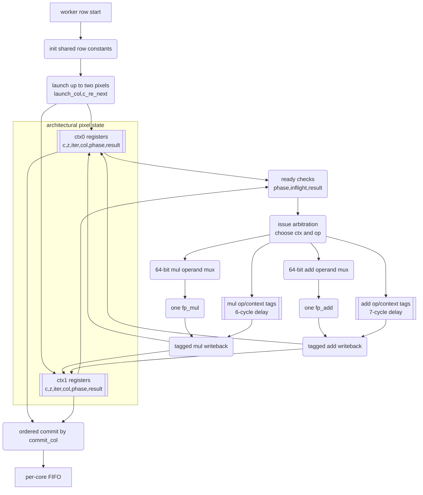
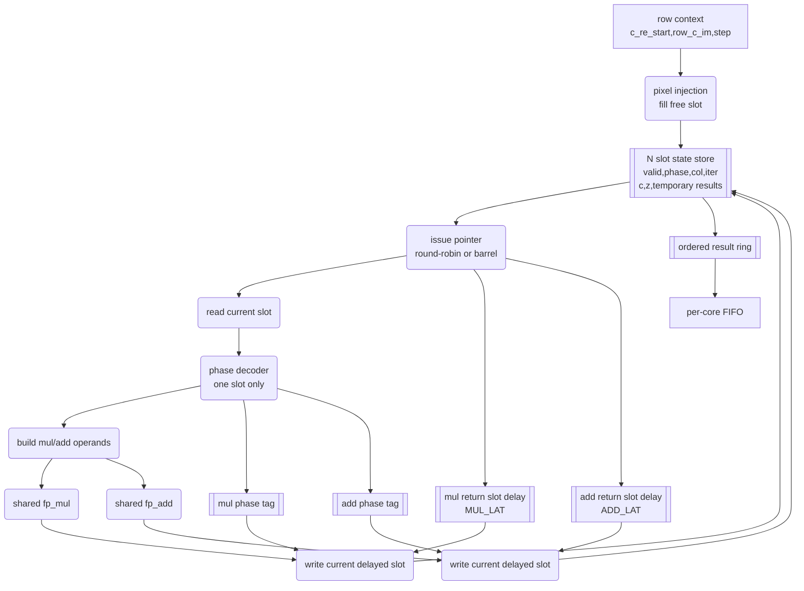

# Compute Pipeline Bubble Analysis And De-Bubbling Feasibility

This report analyzes the bubble situation in the current Mandelbrot compute worker, explores multi-context in-worker scheduling, discusses tagged out-of-order pixel completion and reorder before commit, compares different `fp_mul`/`fp_add` allocations per worker, and estimates theoretical compute and whole-system performance benefits.

The short version: the two-context worker proved the tagged multi-context architecture, but it still left many FP pipeline issue slots empty. Re-running the model with the current RTL latencies, `MUL_LAT=6` and `ADD_LAT=7`, shows that adding more ADD or MUL units is not useful at low context counts. The next compute gain should come from increasing contexts first. On XC7K70T, the generic four-context worker now builds, programs, passes board tests, and is the default build; deep compute-bound scenes improve about `1.78x-2.17x` versus the previous 2ctx default. The cost is high LUT use (`88.70%`). A second ADD becomes useful around 16 contexts, while a second MUL without more ADD capacity still gives essentially no gain. With the current 12 Mbaud UART path, fast scenes remain output-bound.

## Current Context

Current implemented accelerator:

| Item | Value |
|---|---:|
| FP mode | FP64 |
| System clock | 100 MHz |
| Worker count | 4 |
| FP clock enable | `FP_CE_DIV=1` |
| Default worker | `mandelbrot_core_worker_kctx` |
| Worker contexts | 4 |
| Historical lower-LUT worker | `mandelbrot_core_worker_2ctx`, 2 contexts |
| Tagged multiplier latency | `MUL_LAT=6` |
| Tagged adder latency | `ADD_LAT=7` |
| Legacy single-context wait | `PIPE_WAIT=10` |
| Per worker FP units | 1 multiplier + 1 adder |
| UART | 12000000 baud fractional NCO |
| UART payload ceiling | about `600000 pixels/s` |
| Reliable output mode | host-driven `1920x120` tiled stripes |
| Output protocol | raster-order pixels inside retryable tiled responses |

The legacy single-context worker is latency scheduled: it issues an FP operation, waits `PIPE_WAIT` cycles, consumes the result, and then issues the next dependent operation. The current default four-context worker is tagged and can issue back-to-back FP operations when another context is ready. It no longer uses `PIPE_WAIT=10` for result routing; it uses the actual tagged latencies `MUL_LAT=6` and `ADD_LAT=7`.

## Legacy Single-Context Per-Iteration Schedule

For a non-escaping Mandelbrot iteration, one worker performs these FP operations:

| Step | Multiplier issue | Adder issue | Wait after issue | Purpose |
|---:|---|---|---:|---|
| 1 | `z_re * z_re` | none | 10 | Produce `z_re_sq`. |
| 2 | `z_im * z_im` | none | 10 | Produce `z_im_sq`. |
| 3 | `z_re * z_im` | `z_re_sq + z_im_sq` | 10 | Produce cross product and escape sum. |
| 4 | none | `z_re_sq - z_im_sq` | 10 | Real-part difference. |
| 5 | none | `diff + c_re` | 10 | Next real part. |
| 6 | none | `z_re_z_im + z_re_z_im` | 10 | Double cross product. |
| 7 | none | `2*z_re*z_im + c_im` | 10 | Next imaginary part. |

Useful first-order estimate for the legacy single-context path:

```text
cycles_per_non_escape_iteration ~= 7 * (PIPE_WAIT + 1)
                                 ~= 7 * 11
                                 ~= 77 cycles
```

Operation count per non-escaping iteration:

```text
3 multiplier issues
5 adder issues
```

The adder and multiplier can both be issued during step 3, but otherwise most issue slots use only one of the two FP units.

## Bubble Diagram

`M` is a multiplier issue, `A` is an adder issue, and `.` is an idle feed cycle for that unit.

```text
Issue slot:  1           2           3           4           5           6           7
Cycle span:  0..10       11..21      22..32      33..43      44..54      55..65      66..76
Multiplier:  M.......... M.......... M.......... ........... ........... ........... ...........
Adder:       ........... ........... A.......... A.......... A.......... A.......... A..........
```

The core bubble problem is therefore not that the FP pipelines are too slow to accept work. It is that a single pixel context does not have enough independent work to feed them while waiting for dependent results.

## Legacy Single-Context FP Issue Utilization

Assuming the legacy 77-cycle wait-scheduled non-escaping iteration:

| Unit | Useful issues per iteration | Available issue cycles | Approximate issue utilization |
|---|---:|---:|---:|
| Multiplier | 3 | 77 | `3.9%` |
| Adder | 5 | 77 | `6.5%` |
| Combined FP issue slots | 8 | 154 | `5.2%` |

This is why adding pipeline stages to close timing was still beneficial, but a latency-scheduled single-context worker leaves the resulting FP pipelines heavily underfed.

## Current Tagged Worker Timing Model

The implemented two-context worker changes the timing model. It keeps one multiplier and one adder per worker, but it does not wait `PIPE_WAIT + 1` cycles before issuing work from another context. Instead, every issued FP operation carries a destination tag through a real latency-matched delay line:

| Unit | Current tag latency | Notes |
|---|---:|---|
| `fp_mul` | `MUL_LAT=6` | Back-to-back multiplier issue latency observed from the worker issue point. |
| `fp_add` | `ADD_LAT=7` | Back-to-back adder issue latency observed from the worker issue point. |

The current per-iteration dependency chain is therefore better represented as:

```text
full iteration latency ~= 2*MUL_LAT + max(MUL_LAT, ADD_LAT) + 4*ADD_LAT
                       ~= 2*6 + max(6, 7) + 4*7
                       ~= 47 cycles per context without interleaving

escape iteration latency ~= 2*MUL_LAT + max(MUL_LAT, ADD_LAT)
                         ~= 19 cycles per context without interleaving
```

The `max(MUL_LAT, ADD_LAT)` term is the current `mag` adder and `zrzi` multiplier overlap after `z_re_sq` and `z_im_sq` are available. The model also accounts for one coordinate adder issue per launched pixel to advance `c_re_next`; this matters most in fast-escape scenes where per-pixel iteration work is small.

This current model replaces the old all-stages-use-11-cycles approximation for forward-looking context and FP-unit planning. The old approximation remains useful only for explaining the original single-context FSM and the legacy Python 2-context prototype.

## Dependency Graph And Lower Bounds

For one non-escaping iteration, the true mathematical dependency graph is shorter than the current 7-wait sequential schedule.

```text
z_re,z_im
  |\
  | +--> z_re*z_im ------------------> double --> next_im
  |
  +----> z_re*z_re ----+
                       +--> escape sum
  +----> z_im*z_im ----+
                       +--> z_re_sq - z_im_sq --> next_re
```

With enough FP units for one pixel, the dependency graph is shorter than the legacy seven-wait FSM. In the current tagged latency model, the relevant dependency chain is:

```text
single-context full-iteration dependency latency ~= 47 cycles
single-context escape-check dependency latency   ~= 19 cycles
```

That is still latency, not throughput. Throughput is limited by how many FP operations can be issued per cycle across many independent pixel contexts.

For a worker with `M` multipliers and `A` adders, the ideal issue-limited cycles per non-escaping iteration are:

```text
T_issue = max(3 / M, 5 / A) cycles/iteration
```

This assumes enough independent pixel contexts exist to hide the current dependency latency and enough ready work exists to feed each FP unit.

## How Many Pixels Can Be In Flight Inside One Worker?

### Rule Of Thumb

With the current tagged RTL latencies, the longest single-context full-iteration dependency chain is about 47 cycles, while the ideal issue limit for one multiplier and one adder remains 5 cycles per non-escaping iteration because the adder must accept 5 operations. More generally, for a fully scheduled multi-context worker:

```text
minimum_contexts ~= ceil(current_full_iteration_latency / T_issue)
                 ~= ceil(47 / T_issue)
```

Practical designs need extra contexts for branch divergence, context refill/drain, output backpressure, row transitions, and phase conflicts.

| Worker FP units | Ideal `T_issue` | Mathematical minimum contexts | Practical context range |
|---|---:|---:|---:|
| 1 mul + 1 add | 5.00 cycles/iter | 10 | 12 to 16 |
| 1 mul + 2 add | 3.00 cycles/iter | 16 | 16 to 24 |
| 2 mul + 1 add | 5.00 cycles/iter | 10 | 12 to 16 |
| 2 mul + 2 add | 2.50 cycles/iter | 19 | 20 to 32 |
| 2 mul + 3 add | 1.67 cycles/iter | 29 | 32+ |
| 3 mul + 5 add | 1.00 cycles/iter | 47 | 48+ |

### Context Count Versus Throughput For 1 Mul + 1 Add

For the existing one-multiplier/one-adder worker, a simple non-escaping iteration model is:

```text
cycles_per_iteration ~= max(47 / contexts, 5)
```

The `5` comes from the adder bottleneck: one adder must issue 5 operations per iteration.

| Contexts per worker | Approx cycles/iter | Ideal speedup vs current worker | Assessment |
|---:|---:|---:|---|
| 1 | 47.0 | 1.0x | Current dependency chain without interleaving; legacy FSM is slower because it uses conservative waits. |
| 2 | 23.5 | 2.0x | Implemented proof point; still far below issue saturation. |
| 4 | 11.8 | 4.0x | Significant, still mostly context-limited. |
| 8 | 5.9 | 8.0x | Starts approaching the 1M+1A issue limit. |
| 12 | 5.0 | 9.4x | Near useful saturation. |
| 16 | 5.0 | 9.4x | Extra contexts mainly absorb divergence, refill/drain, and ordered-commit stalls. |

In practice, 8 to 16 contexts is still the useful range for the current FP-unit allocation. Below 8 contexts, many pipeline bubbles remain. Above 16 contexts, the one-adder issue limit dominates and extra contexts mostly add control complexity unless they are needed to tolerate divergence and ordered-commit stalls.

## 4/8-Context RTL Deployment Status

After the model indicated that more contexts should be tried before adding more FP units, a parameterized `1M+1A` worker was implemented as `mandelbrot_core_worker_kctx` and selected from `mandelbrot_multicore` when `WORKER_CONTEXTS` is explicitly set to 4 or 8. The 4-context generic worker is now validated on the larger XC7K70T target and is the default deployable path. The existing 2-context worker remains a lower-LUT comparison point with more timing margin.

The target matters. On the earlier xc7z010 target, the generic K-context RTL was functionally plausible but not deployable because it exceeded the available LUT budget before placement. On XC7K70T, the same 4-context direction becomes placeable and timing-clean, though still LUT-heavy.

| Configuration | Target | Behavioral dynamic multicore sim | Slice LUTs | Slice registers | DSPs | Result |
|---|---|---:|---:|---:|---:|---|
| 4ctx generic K-context worker | XC7K70T | Board validated | `36367 / 41000` (`88.70%`) | `19149 / 82000` (`23.35%`) | `37 / 240` (`15.42%`) | Bitstream available, timing clean, default |
| 2ctx historical lower-LUT worker | XC7K70T | Existing board baseline | `13726 / 41000` (`33.48%`) | `14559 / 82000` (`17.75%`) | `37 / 240` (`15.42%`) | Bitstream available, timing clean, historical baseline |
| 2ctx historical | xc7z010 | Existing board baseline | `13917 / 17600` (`79.07%`) | `14458 / 35200` (`41.07%`) | `37 / 80` (`46.25%`) | Bitstream available, timing clean |
| 4ctx generic historical | xc7z010 | PASS, 192 pixels, `445045 ns` sim time | `37350 / 17600` (`212.22%`) | `19046 / 35200` (`54.11%`) | `37 / 80` (`46.25%`) | FAIL, LUT over-utilized |
| 8ctx generic historical | xc7z010 | PASS, 192 pixels, `364705 ns` sim time | `71462 / 17600` (`406.03%`) | `29378 / 35200` (`83.46%`) | `37 / 80` (`46.25%`) | FAIL, LUT over-utilized |

The XC7K70T 4ctx bitstream was programmed successfully and passed a `160x120` small-image software verification gate: `19200/19200` pixels matched (`100.00%`) with `0.091s` FPGA elapsed. A one-run six-scene 1080p sweep with `1920x120` host/compute tiles also passed transport for every scene:

| Scene | 2ctx historical FPGA s | 4ctx default FPGA s | 4ctx pps | 4ctx vs 2ctx |
|---|---:|---:|---:|---:|
| Fast escape @128 | `5.127` | `4.683` | `442824.20` | `1.09x` |
| Standard @64 | `4.731` | `5.782` | `358640.05` | `0.82x` |
| Seahorse zoom @512 | `19.440` | `9.836` | `210825.06` | `1.98x` |
| Deep tendrils @8192 | `37.326` | `17.677` | `117303.25` | `2.11x` |
| Deep mini-brot @8192 | `83.561` | `44.146` | `46971.46` | `1.89x` |
| Deep Seahorse @1024 | `36.626` | `19.965` | `103861.51` | `1.83x` |

The 4ctx result confirms the model direction: deeper compute-bound scenes benefit strongly from more contexts without adding DSPs. Fast scenes remain close to the output/host ceiling, and the `standard @64` one-run result shows that short-iteration scenes can be sensitive to scheduling/refill/ordering overhead rather than monotonically improving.

The failure is not caused by DSP or BRAM pressure. DSP usage remains about the same because the experiment still uses one multiplier per worker. The blocker is control and routing logic: generic arrays of FP64 context state create wide operand muxes, result writeback muxes, inflight scans, and modulo context arbitration. Vivado maps those structures into a very large amount of LUT logic, and the xc7z010 has only 17600 Slice LUTs.

The practical conclusion is now target-dependent. Simply parameterizing the 2ctx scoreboard style into arbitrary `CONTEXTS=N` was the wrong deployable RTL shape for the small xc7z010 and remains area-expensive on XC7K70T. More contexts are the right compute direction, but 8/12/16-context work should still move toward a more area-conscious barrel/ring structure rather than continuing to widen the generic scoreboard.

## Current 2-Context RTL Shape

The implemented `mandelbrot_core_worker_2ctx` is a tagged two-entry scoreboard, not two duplicated FP datapaths. Each worker still contains one `fp_mul` and one `fp_add`. The extra area comes from duplicated pixel state, ready arbitration, operation/context tag delay lines, result writeback demuxing, and ordered commit.



The timing model is a real tagged pipeline:

| Path | RTL objects | Latency | Function |
|---|---|---:|---|
| Multiplier issue | `mul_a`, `mul_b`, `mul_op_pipe`, `mul_ctx_pipe` | 6 cycles | Route `mul_result` to `c_z_re_sq`, `c_z_im_sq`, `c_z_re_z_im`, or init state. |
| Adder issue | `add_a`, `add_b`, `add_op_pipe`, `add_ctx_pipe` | 7 cycles | Route `add_result` to magnitude, next `z`, coordinate, or init state. |
| Commit | `c_result_valid`, `c_col`, `commit_col` | variable | Hold out-of-order finished pixels until the next column is allowed to write. |

This style is correct and board-proven at two contexts, but its logic cost scales poorly. Adding contexts by widening this scoreboard creates larger FP64 operand muxes, wider writeback demuxes, more inflight scans, more ready comparisons, and more ordered-commit comparisons.

## Planned Low-LUT Generic N-Context Shape

The next deployable high-context worker should look more like a CPU barrel pipeline or fine-grained multithreaded pipeline than a fully flexible scoreboard. It still needs N architectural pixel states; the optimization is to avoid exposing all N states to wide combinational selection every cycle.



Expected timing behavior:

```text
cycle k:     issue slot s phase p
cycle k+1:   issue slot s+1 phase p or another ready phase
cycle k+6:   multiplier result returns to delayed slot s
cycle k+7:   adder result returns to delayed slot s
```

Design rules for the planned worker:

| Rule | Reason |
|---|---|
| Fixed or near-fixed slot order | Avoid N-way ready encoders and wide priority muxes. |
| Current-slot operand read | Avoid selecting FP64 operands from all contexts at once. |
| Latency-delayed return pointer | Replace arbitrary context writeback demux with fixed-slot writeback. |
| Small phase tags | Keep op routing without carrying full scoreboard metadata. |
| Ordered result ring | Preserve existing per-core FIFO contract. |
| Prototype one or two workers first | Measure LUT scaling before replicating four workers. |

This architecture will likely give up some opportunistic scheduling freedom compared with the current generic scoreboard, but it is the realistic route to 8, 12, or eventually 16 contexts without consuming nearly all LUTs. The goal is to approach the `1M+1A` issue limit before considering more FP adders.

Recommended next RTL direction:

| Direction | Reason |
|---|---|
| Keep `4ctx 1M+1A` as the XC7K70T deployable default | It is timing-clean and board-tested, and improves deep scenes. |
| Do not scale the generic K-context worker further without a lower-LUT shape | 4ctx already uses `88.70%` of XC7K70T LUTs; 8ctx historically required over 4x xc7z010 LUTs. |
| Redesign higher-context workers as explicit low-LUT slot/ring workers | Avoid generic variable indexing on FP64 arrays, wide muxes, and modulo arbitration. |
| Prefer a ring/slot pipeline over full scoreboard scans | A fixed issue order can trade some scheduling freedom for much lower mux and comparator cost. |
| Consider reducing `CORE_COUNT` while testing high-context workers | A single-core or two-core high-context build can validate compute scheduling before committing four copies. |
| Do not add `1M+2A` until a high-context low-LUT worker exists | Extra ADD capacity is modeled as useful only after much higher context occupancy. |

## Required Context State

Each active pixel context needs at least:

| Field | Width |
|---|---:|
| `c_re`, `c_im` | 128 bits total FP64 |
| `z_re`, `z_im` | 128 bits total FP64 |
| `z_re_sq`, `z_im_sq`, `z_re_z_im` | 192 bits total FP64 |
| `iter` | 16 bits |
| row/col or sequence tag | 32 to 48 bits |
| phase/state metadata | 8 to 16 bits |
| pending FP tags/status bits | 8 to 32 bits |

Rough storage estimate:

```text
500 to 650 bits per context
```

Example storage cost:

| Contexts | Per worker | Four workers |
|---:|---:|---:|
| 4 | 2.0 to 2.6 kbits | 8 to 10 kbits |
| 8 | 4.0 to 5.2 kbits | 16 to 21 kbits |
| 16 | 8.0 to 10.4 kbits | 32 to 42 kbits |
| 32 | 16.0 to 20.8 kbits | 64 to 83 kbits |

The raw storage is feasible. The expensive parts are the FP64 operand muxes, result writeback muxes, ready queues, hazard tracking, and verification.

## Tagged Out-Of-Order Pixel Completion Inside A Worker

A multi-context worker will not naturally finish pixels in raster order. Different pixels escape at different iteration counts, and contexts may be at different phases. Therefore each context needs a tag.

Minimum tag fields:

| Field | Purpose |
|---|---|
| `context_id` | Routes FP results back to the correct context. |
| `pixel_seq` | Restores worker-local pixel order before commit. |
| `row`, `col` | Optional explicit output coordinates, useful for global tagged output. |
| `phase` | Indicates which operation result is being written back. |

### FP Result Tagging

Each issued FP operation carries metadata through a delay line matching the FP pipeline latency:

```text
issue:    op_a, op_b, context_id, destination_field, phase
latency:  fp_add/fp_mul pipeline
writeback: result -> context[context_id].destination_field
```

This turns the current single-FSM capture states into a small scoreboard/writeback system.

### Pixel Commit Reorder

There are two viable commit policies.

| Policy | Description | Pros | Cons |
|---|---|---|---|
| Ordered commit inside worker | Contexts complete out of order, but a reorder ring emits only `next_pixel_seq`. | Preserves existing per-core FIFO contract. | A slow early pixel can block later completed pixels inside the worker. |
| Tagged output from worker | Worker emits `{row,col,iter}` or `{seq,iter}` as soon as a pixel completes. | Removes worker-local commit stalls. | Requires wider FIFOs and a downstream reorder/packet protocol. |

For near-term compatibility, ordered commit inside each worker is not optional; it is required even for the first 2-context prototype. With two active pixels, either pixel may escape first. If context 1 escapes after 5 iterations while context 0 remains inside until 200 iterations or `max_iter`, the worker would naturally produce context 1 first. Without a sequence tag and reorder buffer, the per-core FIFO would receive pixels in the wrong order and the existing raster merger would silently corrupt the image.

Therefore the minimum multi-context worker must include both:

```text
out-of-order context completion
ordered commit by pixel_seq before writing the worker FIFO
```

Tagged output from the worker is a longer-term alternative after protocol v2 or a downstream reorder layer exists. For the current raster-compatible design, every multi-context prototype must reorder before commit.

### Reorder Buffer Size

If the worker has `C` contexts, a local reorder ring of at least `C` pixel entries is required. More is useful because a long-running interior pixel can block many later fast-escaping pixels.

| Worker contexts | Minimum local commit buffer | Practical buffer |
|---:|---:|---:|
| 4 | 4 pixels | 8 to 16 pixels |
| 8 | 8 pixels | 16 to 32 pixels |
| 16 | 16 pixels | 32 to 64 pixels |
| 32 | 32 pixels | 64+ pixels |

Each committed pixel is only 16 bits plus valid/tag state if the buffer is local and ordered. If the output is globally tagged, each entry needs row/col or sequence metadata.

## Per-Worker FP Unit Allocation Options

The current worker has 1 multiplier and 1 adder. A non-escaping iteration needs 3 multiplier issues and 5 adder issues. Therefore, with enough contexts:

```text
ideal_cycles_per_iteration = max(3 / mul_count, 5 / add_count)
```

Theoretical per-worker compute speedup versus the current tagged 47-cycle dependency chain, assuming enough contexts to reach the issue limit:

| Per-worker units | Ideal cycles/iter | Ideal worker speedup | Bottleneck | Notes |
|---|---:|---:|---|---|
| 1 mul + 1 add | 5.00 | 9.4x | adder | Best first de-bubbling target. No extra DSPs. |
| 1 mul + 2 add | 3.00 | 15.7x | multiplier | Useful only after enough contexts exist. |
| 1 mul + 3 add | 3.00 | 15.7x | multiplier | No gain over 2 adders with one multiplier. |
| 2 mul + 1 add | 5.00 | 9.4x | adder | Extra multiplier gives no ideal throughput gain. |
| 2 mul + 2 add | 2.50 | 18.8x | adder | Strong but DSP-heavy and context-hungry. |
| 2 mul + 3 add | 1.67 | 28.2x | mixed | Very aggressive; needs many contexts. |
| 3 mul + 5 add | 1.00 | 47.0x | balanced issue | Theoretical limit, impractical on this device. |

### Resource Consequences

The current 4-worker FP64 design uses 37 DSP48E1 blocks in the latest 12 Mbaud tiled-response build. The practical planning model is still about 9 DSPs per FP64 multiplier-heavy worker plus shared overhead.

Current deployable placed utilization:

| Resource | Used | Device | Utilization |
|---|---:|---:|---:|
| Slice LUTs | 13917 | 17600 | 79.07% |
| LUT as Logic | 13641 | 17600 | 77.51% |
| LUT as Memory | 276 | 6000 | 4.60% |
| Slice Registers | 14458 | 35200 | 41.07% |
| DSP48E1 | 37 | 80 | 46.25% |
| Block RAM Tile | 9.5 | 60 | 15.83% |

Current deployable routed timing:

| WNS | TNS | WHS | THS |
|---:|---:|---:|---:|
| `0.285ns` | `0.000ns` | `0.021ns` | `0.000ns` |

Additional FP64 multipliers are expensive. Additional FP64 adders mainly consume LUTs/registers and routing.

Approximate DSP scaling for four workers:

| Per-worker multipliers | Estimated DSP48E1 use | Feasibility on 80 DSP device |
|---:|---:|---|
| 1 | 37 | Current, comfortable on DSPs but LUT-dense overall. |
| 2 | about 73 | Possible by DSP count but high routing/timing risk. |
| 3 | about 110 | Not feasible on Zynq-7010. |

This makes deeper `1 mul + 1 add` multi-context interleaving the most attractive first architecture. `1 mul + 2 add` may be a second step because it avoids extra DSP pressure, but the updated model shows it does not help at 2, 4, or 8 contexts because context latency is still the limiter. `2 mul + 1 add` is especially unattractive because the adder remains the issue bottleneck. `2 mul + 2 add` is only attractive after enough contexts exist, transport bandwidth is improved, and timing still closes.

## Architecture Options Compared

| Option | Contexts | FP units per worker | Ideal compute gain per worker | Resource risk | Verification risk | Current UART-visible gain |
|---|---:|---|---:|---|---|---|
| Legacy single-context worker | 1 | 1M + 1A | 1.0x | low | low | historical regression path |
| Current 2-context worker | 2 | 1M + 1A | 2.0x model, already implemented | low | proven | visible mostly on compute-heavy scenes |
| 4-context worker | 4 | 1M + 1A | 4.0x model | low-medium | medium | useful next compute step |
| 8-context worker | 8 | 1M + 1A | about 8.0x model | medium | high | near 1M+1A saturation start |
| 16-context worker | 16 | 1M + 1A | about 9.4x model | medium-high | high | saturates one adder; extra contexts absorb stalls |
| 16 contexts | 1M + 2A | about 15.6x model | high LUT/routing | very high | first point where second ADD pays off clearly |
| 16 contexts | 2M + 1A | same as 16ctx 1M+1A | high DSP/routing | high | not useful; adder bottleneck remains |
| 24+ contexts | 2M + 2A | about 18.8x+ model | high DSP/routing | very high | only after bandwidth and timing headroom are proven |

## Historical Whole-System Model At 576000 Baud

With the historical 576000 baud UART:

```text
new_pps = min(current_pps * compute_speedup, 28800)
```

This cap dominates many scenes. Even an ideal de-bubbled worker cannot exceed the UART ceiling unless output bandwidth improves.

| Scene | Current 4-core 576k | UART-capped maximum | Max visible speedup |
|---|---:|---:|---:|
| Fast escape @128 | 28508.56 pps | 28800 pps | 1.01x |
| Standard @64 | 28508.82 pps | 28800 pps | 1.01x |
| Seahorse zoom @512 | 27921.47 pps | 28800 pps | 1.03x |
| Deep tendrils @8192 | 22079.29 pps | 28800 pps | 1.30x |
| Deep mini-brot @8192 | 8852.78 pps | 28800 pps | 3.25x |
| Deep seahorse @1024 | 20600.46 pps | 28800 pps | 1.40x |

This is why the old UART path suppressed most benefits from compute de-bubbling. Deep mini-brot was the one measured scene with large visible headroom at that stage.

## Whole-System Performance Model At 12 Mbaud

The current default transport is no longer 576000 baud. The 12 Mbaud fractional-NCO UART has a raw payload ceiling around `600000 pixels/s`, and the reliable host-tiled mode uses `1920x120` stripes. That changes which scenes can expose compute improvements:

| Scene | 12M host-tiled measured pps | Current 2ctx compute model pps | Board / compute model | Current main limiter |
|---|---:|---:|---:|---|
| Fast escape @128 | `428068.64` | `1142933` | `37.5%` | Output/host protocol overhead. |
| Standard @64 | `466030.04` | `1061531` | `43.9%` | Output/host protocol overhead. |
| Seahorse zoom @512 | `118207.86` | `152317` | `77.6%` | Mixed compute and output. |
| Deep tendrils @8192 | `61080.26` | `73858` | `82.7%` | Mostly compute. |
| Deep mini-brot @8192 | `24898.89` | `29476` | `84.5%` | Compute-bound. |
| Deep Seahorse @1024 | `57056.36` | `69102` | `82.6%` | Mostly compute. |

At 12 Mbaud, compute work is visible again for the deep scenes. The model is intentionally compute-only and therefore should sit above board measurements, which still include row scheduling, FIFO/raster ordering, UART output, host parsing, and tile retry overhead. The 80-85% board/model ratio on deep scenes is a useful calibration point for future context-count projections.

For fast escape and standard views, the board is still output/host limited even at 12 Mbaud. More contexts or more FP units will not move those scenes much unless the transport/protocol path also improves.

## Implemented 2-Context RTL Results

The first synthesizable de-bubbling step has now been implemented in `../rtl/mandelbrot_core_worker_2ctx.v` and selected by `WORKER_CONTEXTS=2`. The design keeps the original four workers and keeps one FP64 multiplier plus one FP64 adder per worker. It adds a second pixel context inside each worker and interleaves the two contexts over the existing FP units.

### RTL Architecture

| Block | Implementation detail |
|---|---|
| Context table | Two sets of `z`, `c`, iteration, intermediate, state, and result registers. |
| Shared FP units | One `fp_mul` and one `fp_add` per worker, unchanged in count. |
| FP tags | `mul_op_pipe`/`mul_ctx_pipe` and `add_op_pipe`/`add_ctx_pipe` route delayed results. |
| Ordered commit | `commit_col` writes only the next worker-local column to the per-core FIFO. |
| Row launch | `launch_col` starts new contexts while `c_re_next` tracks the next column coordinate. |
| Dynamic scheduler guard | A core receives a new row only after its per-core FIFO is empty, avoiding UART-backpressure deadlock. |

The important timing lesson is that the tag delay is not the old single-context `PIPE_WAIT + 1` guard. The old worker waited conservatively between issue and capture. A back-to-back tagged worker must match the real FPU input-to-output latency as observed from the worker issue point:

| Unit | RTL tag latency |
|---|---:|
| `fp_mul` | `MUL_LAT=6` |
| `fp_add` | `ADD_LAT=7` |

Using `11/11` tag delays allowed simulations to finish but produced repeatable board mismatches concentrated on odd columns, because adjacent-context results were written back under the wrong delayed tag. Correcting the tag delays made both simulation and board verification match exactly.

### Validation

| Check | Result |
|---|---|
| 32x24 dynamic 2ctx simulation, `step=0.02`, `max_iter=64` | `768/768` matched. |
| 64x48 dynamic 2ctx stress simulation | `3072` pixels, `1317934` cycles. |
| Static 1ctx regression simulation | Passed. |
| Historical routed timing after initial 2ctx integration | `WNS=0.091ns`, `TNS=0.000ns`, `WHS=0.011ns`, `THS=0.000ns`. |
| Historical placed utilization after initial 2ctx integration | 13630 LUTs, 14391 registers, 38 DSP48E1, 9.5 BRAM tiles. |
| Current routed timing after 12M tiled-response build | `WNS=0.285ns`, `TNS=0.000ns`, `WHS=0.021ns`, `THS=0.000ns`. |
| Current placed utilization after 12M tiled-response build | 13917 LUTs, 14458 registers, 37 DSP48E1, 9.5 BRAM tiles. |
| Board 32x24 verify | `768/768` matched. |
| Board 160x120 verify | `19200/19200` matched. |

### Historical 576k 1080p Performance

These measurements use the earlier 576000 baud UART path, 1920x1080 frames, FP64, four workers, dynamic rows, and two contexts per worker. They remain useful for showing the original 2-context board impact, but they are no longer the current transport configuration.

| Scene | 4-core 1ctx 576k | 4-core 2ctx 576k | 2ctx throughput | Measured speedup | UART ceiling use |
|---|---:|---:|---:|---:|---:|
| Fast escape @128 | `72.736s` | `72.720s` | `28514.74 pps` | `1.000x` | `99.0%` |
| Standard @64 | `72.735s` | `72.721s` | `28514.28 pps` | `1.000x` | `99.0%` |
| Seahorse zoom @512 | `74.265s` | `72.790s` | `28487.54 pps` | `1.020x` | `98.9%` |
| Deep tendrils @8192 | `93.916s` | `72.781s` | `28491.11 pps` | `1.290x` | `98.9%` |
| Deep mini-brot @8192 | `234.231s` | `83.708s` | `24771.84 pps` | `2.798x` | `86.0%` |
| Deep seahorse @1024 | `100.658s` | `72.776s` | `28493.04 pps` | `1.383x` | `98.9%` |

### Historical 576k Theory Versus Measurement

The local 2-context model predicted up to `2x` worker-level speedup for balanced adjacent-pixel traces and much less for pathological ordered-commit traces. The full-system measurement must additionally pass through the UART cap:

```text
visible_pps = min(compute_pps_after_2ctx, 28800 pps)
```

That explains the measured table:

| Case | Interpretation |
|---|---|
| Fast escape and standard | Already UART-bound before 2ctx; compute improvement is hidden. |
| Seahorse zoom | Had only about 3% visible headroom; measured improvement is small and capped. |
| Deep tendrils and deep seahorse | Had 30-40% visible UART headroom; 2ctx fills it and reaches the UART ceiling. |
| Deep mini-brot | Still compute-bound after 2ctx, so it shows the largest speedup, `2.80x`. |

The `2.80x` whole-system speedup on mini-brot is larger than the simple legacy 2-context local model's balanced `2x` because the implemented worker is not just alternating two complete old FSMs. It also issues independent multiplier and adder operations through tagged pipelines with shorter true FPU latencies (`6/7`) than the old conservative single-context wait model (`11`). It still does not approach the updated `1M+1A` saturation target because two contexts are far below the 8-16 contexts needed to hide most dependency latency.

## Generic C Pipeline Simulator

The original exploratory model was `../python/pipeline_2ctx_model.py`. It was useful for proving that ordered commit is required, but it only modeled `1M+1A` and 1 or 2 contexts. A faster and more general C simulator has now been added:

| File | Purpose |
|---|---|
| `../tools/pipeline_sim.c` | Generic Mandelbrot compute-side pipeline model. Supports `K` contexts per worker, `A` adders per worker, `M` multipliers per worker, dynamic/static row scheduling, and host-like scene parameters. |

Build command:

```bash
gcc -O3 -std=c11 -Wall -Wextra -o ..\tools\pipeline_sim.exe ..\tools\pipeline_sim.c -lm
```

Example single configuration:

```bash
..\tools\pipeline_sim.exe --width 1920 --height 1080 \
  --center -1.25066 0.02012 --step 1e-9 --max-iter 8192 \
  --contexts 16 --multipliers 1 --adders 1
```

Example sweep over the architecture options in this report:

```bash
..\tools\pipeline_sim.exe --width 1920 --height 1080 \
  --center -1.25066 0.02012 --step 1e-9 --max-iter 8192 \
  --sweep
```

Supported host-like options include `--center`, `--step`, `--max-iter`, `--width`, `--height`, `--mode`, `--output`, `--format`, `--port`, `--timeout`, and `--verify`. The non-compute host options are accepted for CLI compatibility but ignored by the simulator. Pipeline-specific options are `--contexts`, `--adders`, `--multipliers`, `--workers`, `--add-lat`, `--mul-lat`, `--clock-hz`, `--scheduler`, `--sweep`, and `--exact`.

Two model modes are available:

| Mode | How to select | Intended use |
|---|---|---|
| Fast aggregate row model | Default | 1080p sweeps. Uses the actual Mandelbrot iteration-count trace, then estimates row compute cycles from context capacity and FP issue constraints. |
| Exact stage scheduler | `--exact` | Small-frame debugging. Simulates per-context FP stage issue cycle by cycle. |

Validation checks already run:

| Check | Result |
|---|---|
| Built with `gcc -O3 -std=c11 -Wall -Wextra` | Clean after removing the local binary from version control. |
| `../tools\pipeline_sim.exe --self-test` | Passed known point checks such as `(2.5,0) -> 1` and `(0,0) -> max_iter`. |
| 32x24 exact model, `2ctx 1M+1A`, `MUL_LAT=6`, `ADD_LAT=7` | `768` pixels, average iteration `61.605469`, `282276` compute cycles. |
| 32x24 fast model, same scene/config | `278388` compute cycles, within about `1.4%` of exact for this small frame. |
| Legacy latency cross-check, `MUL_LAT=11`, `ADD_LAT=11` | C exact model gives `1842020` cycles versus Python model `1827819` cycles for 32x24 2ctx; close enough for scheduler-level modeling, with differences from the generalized issue arbitration. |

The simulator intentionally reports `compute_pps` without applying the UART ceiling. This lets the model expose FPGA-side compute throughput that can be hidden by the output link or host protocol.

## C Simulator Predictions For Architecture Options

All rows below use the updated fast aggregate model, four workers, 100 MHz, dynamic row scheduling, `MUL_LAT=6`, `ADD_LAT=7`, and no UART cap. These are compute-side predictions, not end-to-end UART throughput. The model now accounts for the current tagged worker stage latency, overlapped `mag`/`zrzi`, and one coordinate add issue per launched pixel.

### Standard And Fast Scenes

| Worker architecture | Fast escape @128 | Standard @64 | Seahorse zoom @512 |
|---|---:|---:|---:|
| `1ctx 1M+1A` | `571474 pps` | `530772 pps` | `76159 pps` |
| `2ctx 1M+1A` | `1142934 pps` | `1061531 pps` | `152317 pps` |
| `2ctx 1M+2A` | `1142934 pps` | `1061531 pps` | `152317 pps` |
| `2ctx 2M+1A` | `1142934 pps` | `1061531 pps` | `152317 pps` |
| `4ctx 1M+1A` | `2285801 pps` | `2123005 pps` | `304633 pps` |
| `8ctx 1M+1A` | `4571255 pps` | `4245710 pps` | `609259 pps` |
| `16ctx 1M+1A` | `5365351 pps` | `4977671 pps` | `715832 pps` |
| `16ctx 1M+2A` | `8637619 pps` | `8069140 pps` | `1187095 pps` |
| `16ctx 2M+1A` | `5365351 pps` | `4977671 pps` | `715832 pps` |
| `16ctx 2M+2A` | `9140474 pps` | `8489660 pps` | `1218482 pps` |
| `24ctx 2M+2A` | `10727289 pps` | `9952399 pps` | `1431604 pps` |
| `32ctx 2M+3A` | `15895215 pps` | `14890110 pps` | `2147283 pps` |

Fast scenes have low average iteration counts, so their compute-only pps is already very high. On the actual board they are completely UART-bound long before these compute limits matter.

### Deep Zoom Scenes

| Worker architecture | Deep tendrils @8192 | Deep mini-brot @8192 | Deep seahorse @1024 |
|---|---:|---:|---:|
| `1ctx 1M+1A` | `36929 pps` | `14738 pps` | `34551 pps` |
| `2ctx 1M+1A` | `73858 pps` | `29476 pps` | `69102 pps` |
| `2ctx 1M+2A` | `73858 pps` | `29476 pps` | `69102 pps` |
| `2ctx 2M+1A` | `73858 pps` | `29476 pps` | `69102 pps` |
| `4ctx 1M+1A` | `147716 pps` | `58951 pps` | `138205 pps` |
| `8ctx 1M+1A` | `295431 pps` | `117902 pps` | `276408 pps` |
| `16ctx 1M+1A` | `347136 pps` | `138536 pps` | `324773 pps` |
| `16ctx 1M+2A` | `577052 pps` | `230653 pps` | `540038 pps` |
| `16ctx 2M+1A` | `347136 pps` | `138536 pps` | `324773 pps` |
| `16ctx 2M+2A` | `590853 pps` | `235803 pps` | `552809 pps` |
| `24ctx 2M+2A` | `694257 pps` | `277069 pps` | `649534 pps` |
| `32ctx 2M+3A` | `1041357 pps` | `415599 pps` | `974275 pps` |

The deep mini-brot scene is the useful compute-bound reference. The current implemented `2ctx 1M+1A` model predicts about `29476 pps` compute-side throughput. The measured 12M host-tiled board throughput is `24898.89 pps`, about `84.5%` of the compute-only model. That is close enough to confirm the scale of the model and leaves plausible room for RTL overhead, dynamic row/FIFO effects, ordered commit stalls, UART output, host parsing, and tile framing.

### Prediction Versus Current Board Measurements

This table compares the compute-only C model for the current implemented architecture, `2ctx 1M+1A`, against measured 12M host-tiled 1080p board throughput. The board numbers include UART output, packet framing, host parsing, row scheduling, FIFO/raster ordering, and occasional tile retry overhead.

| Scene | C model compute pps, `2ctx 1M+1A` | 12M host-tiled board pps | Board / model | Main limiter in measurement |
|---|---:|---:|---:|---|
| Fast escape @128 | `1142934` | `428068.64` | `37.5%` | Output/host path. |
| Standard @64 | `1061531` | `466030.04` | `43.9%` | Output/host path. |
| Seahorse zoom @512 | `152317` | `118207.86` | `77.6%` | Mixed compute/output. |
| Deep tendrils @8192 | `73858` | `61080.26` | `82.7%` | Mostly compute. |
| Deep mini-brot @8192 | `29476` | `24898.89` | `84.5%` | Compute-bound. |
| Deep seahorse @1024 | `69102` | `57056.36` | `82.6%` | Mostly compute. |

The comparison gives the updated answer: at 12 Mbaud, compute improvements are no longer hidden for deep scenes, but fast scenes remain output/host limited. If the output link is upgraded again, a 4/8/16-context `1M+1A` worker would matter immediately across more scenes. Adding more FP units only becomes worthwhile after enough contexts exist to feed them.

### Incremental Benefit Of Contexts, ADDs, And MULs

The updated sweep intentionally includes low-context multi-unit cases. The result is consistent across all six scenes:

| Change | Model result | Explanation |
|---|---|---|
| `2ctx 1M+1A` -> `2ctx 1M+2A` | no gain | Two contexts cannot generate enough independent ready adder work to use the second ADD. |
| `2ctx 1M+1A` -> `2ctx 2M+1A` | no gain | Two contexts are latency-limited, and the adder remains required for escape and update stages. |
| `4ctx 1M+1A` -> `4ctx 1M+2A` | no gain | Four contexts still do not hide enough dependency latency. |
| `8ctx 1M+1A` -> `8ctx 1M+2A` | no gain in the fast aggregate model | Eight contexts are near the 1M+1A issue boundary but still context-limited for this stage graph. |
| `16ctx 1M+1A` -> `16ctx 1M+2A` | about `1.61x-1.66x` gain | Context count is finally high enough that one adder becomes the limiter. |
| `16ctx 1M+1A` -> `16ctx 2M+1A` | no gain | Extra multiplier does not help because the single adder bottleneck remains. |
| `16ctx 1M+2A` -> `16ctx 2M+2A` | small extra gain, about `1.03x-1.06x` | A second multiplier helps only after the second adder exists, and even then the context/dependency limit remains visible. |

Representative deep mini-brot compute-only predictions:

| Architecture | Compute pps | Speedup vs `2ctx 1M+1A` | Interpretation |
|---|---:|---:|---|
| `2ctx 1M+1A` | `29476` | `1.00x` | Current implemented compute baseline. |
| `4ctx 1M+1A` | `58951` | `2.00x` | Best next pure-context step. |
| `8ctx 1M+1A` | `117902` | `4.00x` | Major gain without extra FP units. |
| `16ctx 1M+1A` | `138536` | `4.70x` | Near 1M+1A issue saturation. |
| `16ctx 1M+2A` | `230653` | `7.82x` | Second ADD becomes valuable only here. |
| `16ctx 2M+1A` | `138536` | `4.70x` | Second MUL alone is wasted. |
| `16ctx 2M+2A` | `235803` | `8.00x` | Small gain over 1M+2A, high DSP cost. |

This changes the planning priority. The next RTL step should not be adding FP units to the existing 2-context worker. It should be scaling the tagged context table and ordered commit machinery to 4 and then 8 contexts while keeping `1M+1A`. A second adder is only attractive after the design can keep roughly 16 contexts active. A second multiplier is lower priority on this device because it consumes scarce DSPs and gives no benefit without more adder capacity.

## Whole-System Model With Faster Output

If the output path allowed 600000 pixels/s sustained end-to-end throughput, roughly the 12 Mbaud UART payload ceiling without host/protocol overhead, an 8-context `1M+1A` worker would become visible on the deep scenes while fast scenes would still approach the output cap:

| Scene | Current 12M host-tiled pps | 8ctx `1M+1A` compute pps | 600k output-capped pps | Visible speedup |
|---|---:|---:|---:|---:|
| Seahorse zoom @512 | `118208` | `609259` | `600000` | `5.08x` |
| Deep tendrils @8192 | `61080` | `295431` | `295431` | `4.84x` |
| Deep mini-brot @8192 | `24899` | `117902` | `117902` | `4.74x` |
| Deep seahorse @1024 | `57056` | `276408` | `276408` | `4.84x` |

This shows the architectural dependency: de-bubbling is compute-significant, but fast scenes still require transport/protocol improvement to expose the full compute gain. Deep scenes are already compute-sensitive at 12 Mbaud and would benefit directly from more contexts.

## Legacy Python 2-Context Prototype Model

Before changing synthesizable worker RTL, a cycle model was added to validate the scheduling rules and quantify best/worst-case behavior for a two-context worker:

| File | Purpose |
|---|---|
| `../python/pipeline_2ctx_model.py` | Cycle model for 1-context vs 2-context FP issue scheduling, tagged completion, and ordered commit. |
| `../sim_worker_2ctx_model.tcl` | Convenience Tcl wrapper that runs the model with a fast default trace. |

This is a legacy performance/timing model, not a bitstream replacement. It remains useful for explaining why ordered commit is mandatory, but it only covers the original 1/2-context `1M+1A` experiment and uses the old conservative `PIPE_WAIT + 1 = 11` latency assumption. Use `../tools/pipeline_sim.c` for current `MUL_LAT=6`, `ADD_LAT=7`, `K`-context, multi-adder, and multi-multiplier predictions.

### Modeled 2-Context Timing Plan

The model uses the current worker's operation sequence and current latency assumption:

```text
PIPE_WAIT = 10
modeled FP result latency = PIPE_WAIT + 1 = 11 cycles
```

Each context owns one pixel and advances through the same per-iteration stages as the RTL worker:

```text
M, M, MA, A, A, A, A
```

Where:

| Symbol | Meaning |
|---|---|
| `M` | Issue one multiplier operation. |
| `A` | Issue one adder operation. |
| `MA` | Issue multiplier and adder in the same cycle, matching `S_MUL_ZISQ_CAPT`. |

The 2-context scheduler has one multiplier issue slot and one adder issue slot per cycle. It scans contexts, issues the first context whose next stage is ready and whose required FP unit is free, then records the next ready cycle:

```text
context.ready_cycle = current_cycle + 11
```

This models the essential timing behavior of a tagged writeback worker: a context cannot consume a result until the FP latency has elapsed, but the other context can issue independent work during that wait.

### Mandatory Ordered Commit In The Model

The model includes the required sequence-based commit mechanism from the start. Each context has:

```text
context_id
pixel_seq
done flag
iter_count result
```

When a context finishes, it writes its result into `done_table[pixel_seq]`. The output side only commits `next_commit_seq`:

```text
when context finishes:
    done_table[context.pixel_seq] = iter_count

while done_table[next_commit_seq] is valid:
    commit done_table[next_commit_seq]
    next_commit_seq++
```

This intentionally models the correctness constraint that a 2-context worker cannot simply write whichever pixel finishes first. If pixel 1 escapes quickly while pixel 0 runs for many iterations, pixel 1 must wait in the reorder table until pixel 0 commits.

### Test Command

Fast default run:

```bash
python python\pipeline_2ctx_model.py --width 32 --height 24 --max-iter 64 --center -0.5 0.0 --step 0.02 --pixels 512
```

Equivalent wrapper:

```bash
vivado -mode batch -source sim_worker_2ctx_model.tcl
```

The Tcl wrapper just executes the Python model. It does not launch HDL simulation.

### 2-Context Model Results

Measured model output:

| Trace | Pixels | Avg iter | 1-context cycles | 2-context cycles | Speedup | Max reorder occupancy | Ordered-commit wait cycles |
|---|---:|---:|---:|---:|---:|---:|---:|
| Real small frame | 768 | 61.61 | 3,636,874 | 1,827,819 | 1.99x | 2 | 16,321 |
| Uniform short | 512 | 1.00 | 51,201 | 25,603 | 2.00x | 1 | 0 |
| Uniform long | 512 | 64.00 | 2,518,017 | 1,259,011 | 2.00x | 1 | 0 |
| Alternating long/short | 512 | 32.50 | 1,284,609 | 1,259,010 | 1.02x | 2 | 1,233,152 |
| Long head, short tail | 512 | 1.12 | 56,019 | 30,421 | 1.84x | 2 | 4,817 |
| Banded synthetic | 512 | 19.00 | 756,609 | 378,307 | 2.00x | 1 | 0 |

### Result Interpretation

The 2-context model behaves exactly as the dependency analysis predicts:

| Case | Interpretation |
|---|---|
| Uniform short/long | Both contexts have similar work. Latency hiding is effective and speedup reaches about 2x. |
| Real small frame | Adjacent Mandelbrot pixels are similar enough that the two contexts stay balanced; speedup is about 1.99x. |
| Banded synthetic | Work is grouped, so adjacent contexts still see similar work; speedup remains about 2x. |
| Long head, short tail | One early long-running pixel blocks later ordered commits, but the second context still helps after the head clears; speedup is 1.84x. |
| Alternating long/short | Worst case for ordered commit. Every short pixel finishes behind a long predecessor and waits; speedup collapses to 1.02x. |

This proves that two pixels in flight are not enough by themselves. Correctness requires reorder-before-commit, and performance depends strongly on whether ordered commit blocks on long-running earlier pixels.

### Expected Versus Measured Model

The theoretical upper bound for two contexts is near 2x because, with only two independent pixels, at most two single-context latency gaps can be overlapped. The measured model reaches that upper bound for balanced traces. It falls below the upper bound only when ordered commit serializes a short pixel behind a long earlier pixel.

| Expectation | Model result |
|---|---|
| Balanced two-context traces should approach 2x. | Confirmed: real small frame, uniform, and banded traces are about 1.99x-2.00x. |
| Out-of-order completion must be handled. | Confirmed: reorder occupancy reaches 2 and commit waits appear on nonuniform traces. |
| Pathological alternating long/short traces can defeat ordered commit. | Confirmed: speedup drops to 1.02x with 1.23M commit-wait cycles. |
| More contexts are needed for robust throughput. | Confirmed: 2 contexts are a correctness and timing proof, not the final performance target. |

## Recommended De-Bubbled Worker Architecture

### Design Implication

The next RTL implementation should not try to build a two-context worker that simply alternates pixels and writes outputs directly. The minimum correct RTL block must include:

| Required block | Reason |
|---|---|
| Context table with two entries | Stores per-pixel state and phase. |
| FP operation tags | Routes delayed `fp_add`/`fp_mul` results to the right context. |
| Per-context completion state | Allows a later pixel to finish before an earlier one. |
| Sequence reorder table | Holds completed results until `next_commit_seq` is ready. |
| Ordered commit FSM | Preserves current per-core FIFO/raster merger contract. |

The model also shows why the real performance target should be 8 to 16 contexts. Two contexts validate the mechanism and can reach 2x on balanced traces, but they cannot keep FP units close to saturation and are vulnerable to ordered-commit stalls.

### Stage 1: Simulation-Only Multi-Context Worker

Start with `1 mul + 1 add` and 2 contexts. Do not add FP units yet. The 2-context design must already include out-of-order completion tracking and ordered commit, because two pixels do not necessarily finish in issue order.

Goals:

| Goal | Reason |
|---|---|
| Context table | Holds per-pixel `z`, `c`, iteration, phase, and sequence tag. |
| Tagged FP writeback | Proves result routing by `context_id`. |
| Simple ready queues | Selects contexts ready to issue multiplier or adder operations. |
| Completion flags per context | Records pixels that finish before earlier sequence numbers. |
| Ordered local commit by `pixel_seq` | Mandatory even for 2 contexts; preserves existing worker output order. |

Minimum 2-context commit behavior:

```text
next_commit_seq = first pixel sequence assigned to the worker

when context finishes:
    done_table[context.pixel_seq] = iter_count

while done_table[next_commit_seq] is valid and output FIFO has space:
    write done_table[next_commit_seq] to worker output FIFO
    clear done_table[next_commit_seq]
    next_commit_seq++
```

This is deliberately more complex than simply alternating two contexts, but it is the smallest correct design. A two-context worker without ordered commit can pass some uniform-cost tests but fail on normal Mandelbrot views where adjacent pixels escape at different iterations.

### Stage 2: Scale Context Count

Scale 2 -> 4 -> 8 -> 16 contexts while keeping `1M+1A`.

Expected milestones:

| Contexts | Expected result |
|---:|---|
| 2 | Confirms tagged writeback, out-of-order completion, and mandatory local reorder. |
| 4 | Should show clear simulation cycle reduction. |
| 8 | Hides most latency. |
| 16 | Near-saturates `1M+1A` issue limits. |

### Stage 3: Output Tagging Beyond The Worker

After the worker-local ordered commit path is stable, choose whether to keep that compatibility layer or move to a wider tagged output path:

| Policy | When to use |
|---|---|
| Ordered worker-local commit | Required for current multicore/raster merger. Keep this for compatibility. |
| Tagged worker output | Best after protocol v2 or tile/row tagged output exists. |

For long-term performance, tagged output is preferable because it allows later fast pixels to leave the worker immediately. This should be treated as a second output architecture after the basic worker-local reorder has already been proven.

### Stage 4: Evaluate More Adders Before More Multipliers

If `1M+1A` with roughly 16 contexts is proven and transport is no longer the bottleneck, evaluate `1M+2A`. The updated model shows no benefit from a second ADD at 2, 4, or 8 contexts, but a clear `1.6x+` compute gain at 16 contexts because the single adder finally becomes the limiter.

Only after that should `2M+2A` be considered. `2M+1A` gives no modeled gain over `1M+1A` because the adder remains the bottleneck, and `2M+2A` consumes most of the remaining DSP budget on the current device for only a small gain over `1M+2A` at 16 contexts.

## Practical Recommendation

Recommended priority:

| Priority | Work | Reason |
|---:|---|---|
| 1 | Scale the proven 2-context RTL to 4 contexts, then 8 contexts | Pure context scaling is the next modeled gain and does not add FP units. |
| 2 | Preserve tagged writeback and ordered commit while scaling contexts | Correctness depends on result tags and local raster-order commit. |
| 3 | Keep improving transport/protocol | Fast scenes remain output/host limited even at 12 Mbaud. |
| 4 | Evaluate 16-context `1M+1A` | Approaches the one-adder issue limit and creates the first point where extra ADD capacity is useful. |
| 5 | Add second adder per worker only after high-context scheduling works | `1M+2A` has no modeled benefit at 2/4/8 contexts, but is valuable around 16 contexts. |
| 6 | Consider second multiplier only after adding adder capacity and proving DSP/timing headroom | `2M+1A` is modeled as wasted; `2M+2A` is DSP-heavy and only modestly better than `1M+2A` at 16 contexts. |

## Conclusion

The legacy single-context worker had substantial pipeline bubbles: roughly 3 multiplier issues and 5 adder issues were spread across about 77 conservative wait-scheduled cycles. The current tagged worker model, using `MUL_LAT=6` and `ADD_LAT=7`, reduces the single-context dependency chain to about 47 cycles, but the implemented two-context design still leaves significant bubbles. A deeper multi-context `1M+1A` worker can move toward the 5-cycle adder issue limit, a compute gain of about `9.4x` versus the current tagged single-context dependency chain or about `4.7x` versus the implemented two-context compute model.

The first de-bubbling architecture has now been proven with two in-flight pixel contexts per worker, one multiplier, one adder, tagged FP writeback, and ordered commit. Re-running the model with the current latencies strengthens the earlier conclusion: add contexts before adding FP units. `2ctx`/`4ctx`/`8ctx` do not benefit from extra ADD or MUL units in the aggregate model; `16ctx 1M+2A` is the first clear multi-unit step. Adding more multipliers is not the first move because `2M+1A` is still adder-bottlenecked and FP64 multipliers consume scarce DSPs.

At 12 Mbaud, de-bubbling is already strategically relevant for deep scenes: current board throughput is about 80-85% of the compute-only `2ctx 1M+1A` model for deep tendrils, deep mini-brot, and deep Seahorse. Fast scenes remain output/host limited, so transport/protocol work is still required to expose compute gains there.
