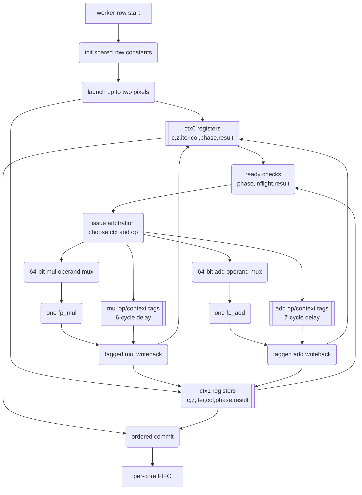
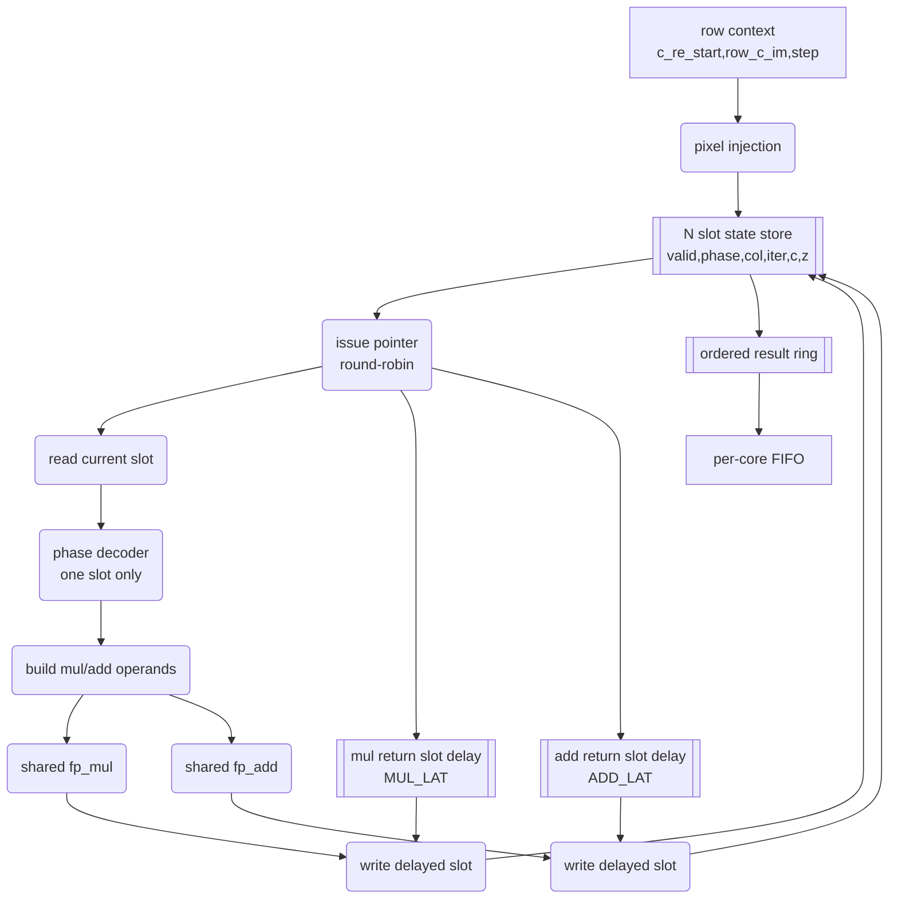

# Compute Pipeline 气泡分析与去气泡可行性

本文是 `PIPELINE_BUBBLE_ANALYSIS.md` 的中文版本，分析当前 worker 的 FP pipeline 气泡、context 数量、ADD/MUL 数量以及 4/8ctx 实验结果。

## 摘要

2-context worker 已证明 tagged multi-context 架构可行，但 FP pipeline 仍未饱和。使用当前 RTL latency `MUL_LAT=6`、`ADD_LAT=7` 重新建模后，结论是：低 context 下增加 ADD 或 MUL 没有收益。下一步应先增加 contexts。XC7K70T 上 4-context generic worker 已经构建、烧录并通过板级测试，当前成为默认 build；深度 compute-bound 场景相对之前默认 2ctx 提升约 `1.78x-2.17x`。代价是 LUT 占用达到 `88.70%`。第二个 ADD 大约到 16 contexts 才明显有价值；第二个 MUL 在没有更多 ADD 容量时基本无收益。

## 当前实现

| 项目 | 当前值 |
|---|---:|
| FP mode | FP64 |
| System clock | 100 MHz |
| Worker count | 4 |
| Worker contexts | 4 |
| 当前默认 worker | `mandelbrot_core_worker_kctx`，XC7K70T 4 contexts |
| Per worker FP units | 1 multiplier + 1 adder |
| `MUL_LAT` | 6 |
| `ADD_LAT` | 7 |
| UART | 12 Mbaud fractional NCO |
| 可靠输出模式 | host-driven `1920x120` tiled stripes |

## 旧单 context 调度

旧 worker 对每个 FP 操作 issue 后等待 `PIPE_WAIT=10`，等价大约 11 cycle capture 间隔。一个 non-escaping iteration 需要：

```text
3 multiplier issues
5 adder issues
```

旧估算：

```text
cycles_per_iteration ~= 7 * 11 = 77 cycles
```

FP issue 利用率很低：multiplier 约 3.9%，adder 约 6.5%。

## 当前 tagged worker 模型

2ctx worker 不再等待旧 `PIPE_WAIT+1`，而是通过 tag delay line 路由结果：

| Unit | Latency |
|---|---:|
| `fp_mul` | `MUL_LAT=6` |
| `fp_add` | `ADD_LAT=7` |

当前 dependency chain：

```text
full iteration latency ~= 2*MUL_LAT + max(MUL_LAT, ADD_LAT) + 4*ADD_LAT
                       ~= 47 cycles

escape iteration latency ~= 2*MUL_LAT + max(MUL_LAT, ADD_LAT)
                         ~= 19 cycles
```

## Context 数量需求

对 `1M+1A` worker，理想 issue limit 是 5 cycles/iteration，因为一个 iteration 需要 5 个 ADD issue。要隐藏约 47 cycle dependency，需要约 10 个 context，实际还要考虑 branch divergence、refill/drain、ordered commit stall 和 row transition，因此 8-16 contexts 是有意义区间。

| Contexts | Approx cycles/iter | 评价 |
|---:|---:|---|
| 2 | 23.5 | 当前实现，证明点，但未饱和。 |
| 4 | 11.8 | 仍 context-limited。 |
| 8 | 5.9 | 接近 `1M+1A` issue limit。 |
| 12 | 5.0 | 接近饱和。 |
| 16 | 5.0 | 多余 context 主要吸收 stall。 |

## 4/8ctx RTL 部署状态

实现了 `mandelbrot_core_worker_kctx`，当 `WORKER_CONTEXTS=4/8` 时使用。4ctx generic worker 已经在更大的 XC7K70T 上验证通过并成为默认配置；专用 2ctx worker 保留为低 LUT 对照。

| 配置 | 目标 | 行为/板级状态 | Slice LUTs | Registers | DSPs | 结果 |
|---|---|---:|---:|---:|---:|---|
| 4ctx generic | XC7K70T | board validated | `36367 / 41000` (`88.70%`) | `19149 / 82000` (`23.35%`) | `37 / 240` (`15.42%`) | 可部署，timing clean，默认 |
| 2ctx historical | XC7K70T | board baseline | `13726 / 41000` (`33.48%`) | `14559 / 82000` (`17.75%`) | `37 / 240` (`15.42%`) | 可部署，timing clean，低 LUT 对照 |
| 2ctx historical | xc7z010 | board baseline | `13917 / 17600` (`79.07%`) | `14458 / 35200` (`41.07%`) | `37 / 80` (`46.25%`) | 可部署，timing clean |
| 4ctx generic historical | xc7z010 | PASS, 192 pixels, `445045 ns` | `37350 / 17600` (`212.22%`) | `19046 / 35200` (`54.11%`) | `37 / 80` (`46.25%`) | FAIL, LUT 超量 |
| 8ctx generic historical | xc7z010 | PASS, 192 pixels, `364705 ns` | `71462 / 17600` (`406.03%`) | `29378 / 35200` (`83.46%`) | `37 / 80` (`46.25%`) | FAIL, LUT 超量 |

4ctx XC7K70T bitstream 已成功烧录，并通过 `160x120` 小图 `--verify` gate：`19200/19200` match (`100.00%`)，FPGA elapsed `0.091s`。1080p 六场景、默认 `1920x120` host/compute tile 单次测试也全部 PASS：

| Scene | 2ctx historical FPGA s | 4ctx default FPGA s | 4ctx pps | 4ctx vs 2ctx |
|---|---:|---:|---:|---:|
| Fast escape @128 | `5.127` | `4.683` | `442824.20` | `1.09x` |
| Standard @64 | `4.731` | `5.782` | `358640.05` | `0.82x` |
| Seahorse zoom @512 | `19.440` | `9.836` | `210825.06` | `1.98x` |
| Deep tendrils @8192 | `37.326` | `17.677` | `117303.25` | `2.11x` |
| Deep mini-brot @8192 | `83.561` | `44.146` | `46971.46` | `1.89x` |
| Deep Seahorse @1024 | `36.626` | `19.965` | `103861.51` | `1.83x` |

结论：generic K-context 数组式 scoreboard 功能上可行；在 xc7z010 上不可部署，在 XC7K70T 上 4ctx 可部署但 LUT 很高。问题不是 DSP，而是 FP64 context array、wide mux、writeback mux、inflight scan 和 arbitration logic 造成 LUT 快速增长。后续 8/12/16ctx 仍应转向更低 LUT 的 barrel/ring 结构。

## 当前 2ctx RTL 形态

当前 `mandelbrot_core_worker_2ctx` 是 tagged two-entry scoreboard，而不是复制两套 FP datapath。每个 worker 仍只有一个 `fp_mul` 和一个 `fp_add`。额外 LUT 来自两份像素状态、ready arbitration、operation/context tag delay line、result writeback demux 和 ordered commit。



时序上，每次 issue 都同时写入 op tag 和 context tag。`MUL_LAT=6` 后 multiplier result 依据 tag 写回对应 context 和字段；`ADD_LAT=7` 后 adder result 同理。context 可乱序完成，但写 FIFO 前必须按 `commit_col` 顺序提交。

## 规划低 LUT N-context 形态

下一版高 context worker 不应直接扩展当前 scoreboard。更合理方向是 CPU-like barrel/ring pipeline：N 个 slot 保存 N 个像素状态，issue pointer 固定或近似固定轮转，结果按 latency-delayed return pointer 写回固定 slot。



预期时序：

```text
cycle k:     issue slot s phase p
cycle k+1:   issue slot s+1 phase p or another ready phase
cycle k+6:   multiplier result returns to delayed slot s
cycle k+7:   adder result returns to delayed slot s
```

该结构不是消除 N 个像素状态，而是避免每周期扫描所有 context、避免 N 路 FP64 operand mux、避免任意 context writeback demux。它牺牲部分调度自由，换取更低 LUT，是 4/8/12/16 contexts 在 xc7z010 上可部署的更现实方向。

## 当前资源和 timing

| Resource | Used | Device | Utilization |
|---|---:|---:|---:|
| Slice LUTs | 13917 | 17600 | 79.07% |
| LUT as Logic | 13641 | 17600 | 77.51% |
| Slice Registers | 14458 | 35200 | 41.07% |
| DSP48E1 | 37 | 80 | 46.25% |
| Block RAM Tile | 9.5 | 60 | 15.83% |

| WNS | TNS | WHS | THS |
|---:|---:|---:|---:|
| `0.285ns` | `0.000ns` | `0.021ns` | `0.000ns` |

当前默认 XC7K70T 4ctx build 资源和 timing：

| Resource | Used | Device | Utilization |
|---|---:|---:|---:|
| Slice LUTs | 36367 | 41000 | 88.70% |
| Slice Registers | 19149 | 82000 | 23.35% |
| DSP48E1 | 37 | 240 | 15.42% |
| Block RAM Tile | 9.5 | 135 | 7.04% |

| WNS | TNS | WHS | THS |
|---:|---:|---:|---:|
| `0.583ns` | `0.000ns` | `0.039ns` | `0.000ns` |

## ADD/MUL 数量分析

一个 non-escaping iteration 需要 3 个 MUL issue 和 5 个 ADD issue。理想 issue limit：

```text
T_issue = max(3 / M, 5 / A)
```

| FP units | Ideal cycles/iter | 结论 |
|---|---:|---|
| 1M + 1A | 5.00 | 当前正确方向是增加 context。 |
| 1M + 2A | 3.00 | 低 context 无收益，约 16ctx 才有价值。 |
| 2M + 1A | 5.00 | ADD 仍是瓶颈，MUL 浪费。 |
| 2M + 2A | 2.50 | DSP-heavy，优先级低。 |

## 12M whole-system 模型

当前 12M host-tiled board 与 2ctx compute-only model 对比：

| Scene | Board pps | Model pps | Board/model | Limiter |
|---|---:|---:|---:|---|
| Fast escape @128 | `428068.64` | `1142934` | `37.5%` | output/host path |
| Standard @64 | `466030.04` | `1061531` | `43.9%` | output/host path |
| Seahorse zoom @512 | `118207.86` | `152317` | `77.6%` | mixed |
| Deep tendrils @8192 | `61080.26` | `73858` | `82.7%` | mostly compute |
| Deep mini-brot @8192 | `24898.89` | `29476` | `84.5%` | compute |
| Deep Seahorse @1024 | `57056.36` | `69102` | `82.6%` | mostly compute |

深场景已经能暴露 compute 改进；fast scenes 仍受 output/host 限制。

## 基于当前 direct-200MHz 4ctx 架构的模拟准确性与后续预测

本章刻意独立于前面的历史分析。它从现在已经验证并作为默认配置的 direct-200MHz 4ctx 架构出发，讨论 C pipeline simulator 本身的准确性。这里关注的不是 UART baud bound 或输出链路牵制，而是模型是否足够准确，能不能用来排序后续 context 数和 FP unit 数量的改动。

当前已验证 baseline：

| 项目 | 当前值 |
|---|---:|
| Target | XC7K70T |
| Build entry | `build_fp64.tcl` |
| Clocking | direct 200 MHz, `DIRECT_200MHZ=1` |
| Worker | `mandelbrot_core_worker_kctx` |
| Workers | 4 |
| Contexts per worker | 4 |
| FP units per worker | 1 multiplier + 1 adder |
| 当前模型 latency | `MUL_LAT=6`, `ADD_LAT=9` |
| Issue structure | request-sliced issue：先锁存 request，再下一拍驱动 FP operands |
| 当前 bitstream timing | `WNS=0.015ns`, `TNS=0.000ns`, `WHS=0.002ns`, `THS=0.000ns` |
| 当前资源 | 20288 LUT, 17202 FF, 37 DSP48E1, 9.5 BRAM tiles |

### 为准确性检查更新模型

排气泡模拟程序现在直接支持当前 baseline，并能对比 fast aggregate model 和 exact scheduler：

| 文件 | 更新内容 |
|---|---|
| `../python/pipeline_2ctx_model.py` | 虽然保留历史文件名，但现在支持任意 context 数、独立 `MUL_LAT=6` / `ADD_LAT=9`、多 multiplier/adder 配置，并输出相对当前 `4ctx 1M+1A` 的 speedup。 |
| `../tools/pipeline_sim.c` | 默认值改为当前硬件：4 contexts、1 multiplier、1 adder、`ADD_LAT=9`、`MUL_LAT=6`、200MHz。 |
| `../tools/pipeline_sim.c --compare-models` | 同时运行 exact per-stage scheduler 和 fast aggregate row model，并报告 fast model 的 cycle error。 |

Exact model 较慢，但更接近真实调度：它逐 stage 模拟 context 分配、ready cycle、FP unit contention、row scheduling 和 ordered commit。Fast aggregate model 适合做大图 sweep，但它把整行压缩成 aggregate latency 和 issue pressure，因此在行内迭代数差异很大、ordered commit stall 很明显时会偏乐观。

### 实际板级结果与当前 compute model

当前 direct-200MHz 4ctx 板级结果低于 compute-only 模型，尤其是 fast/standard 场景：

| Scene | Compute-only model, 当前 `4ctx 1M+1A` | 当前 10-run board pps | Board/model | 主要限制 |
|---|---:|---:|---:|---|
| Fast escape @128 | `3777807` | `413592.02` | `10.9%` | output/host dominated |
| Standard @64 | `3507484` | `414046.70` | `11.8%` | output/host dominated |
| Seahorse zoom @512 | `502530` | `273303.15` | `54.4%` | compute/output mixed |
| Deep tendrils @8192 | `243640` | `162504.12` | `66.7%` | mostly compute-sensitive |
| Deep mini-brot @8192 | `97224` | `65709.99` | `67.6%` | compute-sensitive |
| Deep Seahorse @1024 | `227948` | `149325.97` | `65.5%` | mostly compute-sensitive |

板级数据只作为 sanity check：模型和实测是否在同一数量级，以及哪些场景更适合作为 compute-sensitive 验证。它不应该被折成一个 baud-bound correction factor。Deep mini-brot 更适合作为 compute-roadmap 验证场景；Seahorse/mixed 场景更适合检验 ordered commit 和模型准确性。

### Exact 与 fast model 的准确性对比

在 exact simulation 可接受的小图上，比较 exact scheduler 和 fast aggregate model：

| Scene/sample | Config | Exact cycles | Fast cycles | Fast error | 解读 |
|---|---|---:|---:|---:|---|
| Standard small, `160x120`, `max_iter=256` | `4ctx 1M+1A` | `16295836` | `15927816` | `-2.26%` | fast model 在这个较平滑样本上较准确。 |
| Seahorse small, `160x120`, `max_iter=512` | `4ctx 1M+1A` | `9862976` | `7891061` | `-19.99%` | fast model 明显偏乐观；mixed iteration 和 ordered commit 影响较大。 |
| Deep mini-brot small, `160x120`, `max_iter=8192` | `4ctx 1M+1A` | `32611832` | `32612159` | `0.001%` | 对均匀深计算场景，fast model 很准确。 |

Sweep 对比进一步说明：在 `80x60` Seahorse 样本上，fast aggregate error 会随 context 增加而变差：`4ctx 1M+1A` 为 `-22.3%`，`8ctx 1M+1A` 为 `-36.7%`，`16ctx 1M+2A` 为 `-49.7%`。fast model 高估了 mixed scene 中更多 context 带来的收益，因为更多 out-of-order completion 和 ordered-commit stalls 被 aggregate 模型抹平了。

在 `80x60` deep mini-brot 样本上，实用范围内准确得多：`4ctx 1M+1A` 为 `0.002%`，`8ctx 1M+1A` 为 `-1.93%`，`16ctx 1M+1A` 为 `-0.02%`，`16ctx 1M+2A` 为 `-4.62%`。

### 基于更准确模型的后续预测

对架构排序，能跑 exact scheduler 的地方应优先用 exact；fast aggregate 对 mixed scene 只能当上界。

| Workload type | 推荐模型 | 可靠性 |
|---|---|---|
| 均匀深计算，例如 deep mini-brot center sample | fast aggregate 接近 exact，但最终仍应用 exact 小图确认。 | `8ctx`/`16ctx` 实用范围内较高。 |
| 平滑 standard view | 当前 `4ctx` 附近 fast model 通常较准，小图 exact 检查成本低。 | 中高。 |
| Seahorse/mixed escape distribution | 应以 exact scheduler 为准。 | fast aggregate 偏乐观，并且 context 越多越明显。 |
| 高 context、多 FP unit 设计 | 必须用 representative 小图 exact。 | fast aggregate 只能看 issue-limit 上界。 |

`80x60` deep mini-brot exact scheduler 给出的相对当前 `4ctx 1M+1A` 预测：

| Configuration | Exact speedup vs 当前 `4ctx 1M+1A` | 解读 |
|---|---:|---|
| `8ctx 1M+1A` | `1.96x` | 仍是最佳下一步；fast aggregate 的 `2.00x` 在这里基本可信。 |
| `16ctx 1M+1A` | `2.85x` | 深计算收益很强，接近 aggregate 预测。 |
| `16ctx 1M+2A` | `3.81x` | context 足够后第二 ADD 有价值，但 exact 低于理想 `4.00x`。 |
| `16ctx 2M+1A` | `2.82x` | 单独加第二 MUL 仍不吸引。 |
| `16ctx 2M+2A` | `4.00x` | 需要 context 和 ADD 容量都足够后才有意义。 |

`80x60` Seahorse exact scheduler 更保守：

| Configuration | Exact speedup vs 当前 `4ctx 1M+1A` | 解读 |
|---|---:|---|
| `8ctx 1M+1A` | `1.63x` | 仍有收益，但明显低于 aggregate `2.00x` 上界。 |
| `16ctx 1M+1A` | `2.34x` | context 有用，但 ordered commit 和 phase imbalance 限制 scaling。 |
| `16ctx 1M+2A` | `2.59x` | 第二 ADD 的收益小于 aggregate 预测。 |
| `16ctx 2M+1A` | `2.34x` | 单独第二 MUL 仍无帮助。 |
| `16ctx 2M+2A` | `2.62x` | 多 FP unit 收益被调度/commit 行为限制。 |

实用预测是：`8ctx 1M+1A` 仍然是正确下一步，但收益要按 workload 分开表述。均匀深场景可能接近 `2x`；Seahorse-like mixed 场景在 exact scheduler 下可能更接近 `1.6x`。`16ctx 1M+1A` 在 8ctx 成功后仍有吸引力，但 exact 模型说明了为什么不能过早加 FP unit。

### 直接 8ctx/16ctx RTL 尝试结果

在设计新的低 LUT 结构之前，先直接把现有 generic K-context worker 参数化到 8 和 16 contexts，作为资源和 timing 可行性检查。结果说明：行为方向可行，但当前物理实现形态不可直接上板。

| Candidate | RTL simulation | Build result | Resource/timing result | Board benchmark |
|---|---|---|---|---|
| `8ctx 1M+1A`, direct 200MHz | worker-only PASS；multicore dynamic PASS (`1920` pixels) | 生成 bitstream | `31830 / 41000` Slice LUTs (`77.63%`), `24548 / 82000` registers (`29.94%`), `65 / 240` DSP48E1；post-route physopt timing 失败：`WNS=-1.030ns`, `TNS=-5092.551ns`, `15701` setup failing endpoints | 未运行；timing-failing bitstream 不烧录。 |
| `16ctx 1M+1A`, direct 200MHz | worker-only PASS；multicore dynamic PASS (`1920` pixels) | placement 前停止 | 综合后 LUT 超资源：`56273 / 41000` Slice LUTs (`137.25%`), `54849 / 41000` LUT-as-logic (`133.78%`), `39215 / 82000` registers (`47.82%`), `65 / 240` DSP48E1；placer DRC `UTLZ-1` | 未运行；没有可 place 的 bitstream。 |

这验证了前面的结构判断：简单加宽 generic context-array scoreboard 不是 XC7K70T@200MHz 的正确物理形态。模型认为 8ctx 有收益，RTL 仿真也说明功能可行，但当前实现的 wide context/control logic 会造成 `-1ns` 级 timing failure。16ctx 则直接超过 LUT 预算。

下一次 8ctx 尝试应改变结构，而不是只改参数。重点应减少全 context scan、宽 FP64 operand mux 和任意 context writeback mux。barrel/ring slot 或 small ready queue 更可能保留计算收益，同时避免直接 8ctx build 的 timing 失败。

### Compute-only 架构排序

从模型准确性角度看，RTL 方向仍然是：

| 从当前 baseline 出发的变化 | Compute-only 结果 | 解释 |
|---|---:|---|
| `4ctx 1M+1A` -> `8ctx 1M+1A` | 约 `2.00x` | 最值得优先尝试；不增加 DSP，只增加 in-flight contexts。 |
| `8ctx 1M+1A` -> `16ctx 1M+1A` | 额外约 `1.42x` | 仍有收益，但开始接近单 adder issue limit。 |
| `16ctx 1M+1A` -> `16ctx 1M+2A` | 额外约 `1.40x` | 第二个 ADD 要在 context 足够多后才有价值。 |
| `16ctx 1M+1A` -> `16ctx 2M+1A` | 无模型收益 | 一个 full iteration 有 5 个 ADD issue，单独加第二 MUL 仍被 ADD 限制。 |
| `16ctx 1M+2A` -> `16ctx 2M+2A` | aggregate 模型中几乎无收益 | 第二个 MUL 不是第一个该加的 FP unit。 |

根本原因是 operation mix：一个 non-escaping iteration 需要 3 个 MUL issue 和 5 个 ADD issue。context 足够多以后，单 adder 会先成为硬瓶颈；只有在增加 context 后，第二个 ADD 才值得讨论。

### 基于当前 baseline 的推进方向

下一步不应该是“在当前 4ctx scoreboard 上直接加第二个 FP unit”。Exact-vs-fast 对比支持这个顺序：

| 优先级 | 方向 | 原因 |
|---:|---|---|
| 1 | 做低 LUT 的 8ctx `1M+1A` worker | exact model 仍预测有意义收益，且不增加 DSP。 |
| 2 | 保留 request slicing | 当前 200MHz 收敛依赖于不要把 context select、64-bit operand mux 和 FPU input drive 放在同一拍。 |
| 3 | 不要直接线性扩展 generic context-array scoreboard | wide scan、wide FP64 mux、任意 context writeback mux 很可能继续制造 LUT/timing 问题。 |
| 4 | 尝试 barrel/ring slot 或 small ready queue | 目标是减少宽组合选择，同时保持足够多 in-flight contexts。 |
| 5 | 8ctx timing-clean 后再评估 12ctx/16ctx `1M+1A` | deep scene 收益强，mixed scene scaling 要用 exact model 保守估计。 |
| 6 | 先加第二 ADD，再考虑第二 MUL | `1M+2A` 是第一个有意义的 multi-unit 扩展；`2M+1A` 模型无收益。 |
| 7 | 持续用 exact model 对照板级数据 | 不要用 fast aggregate 预测 mixed scene 或高 context multi-unit 设计。 |

## 规划建议

| 优先级 | 工作 | 原因 |
|---:|---|---|
| 1 | 设计低 LUT 高 context worker | XC7K70T 4ctx 已验证方向正确，但 generic kctx LUT 占用高。 |
| 2 | 保持 tagged writeback 和 ordered commit | 正确性依赖 result tag 和行内顺序。 |
| 3 | 继续改善 transport/protocol | fast scenes 仍 output-bound。 |
| 4 | 评估 8ctx/16ctx `1M+1A` | 接近 adder issue limit。 |
| 5 | 高 context 稳定后再加第二 ADD | 2/4/8ctx 下第二 ADD 无收益。 |
| 6 | 最后才考虑第二 MUL | `2M+1A` 模型显示浪费。 |

## 结论

当前 2ctx worker 是正确的去气泡第一步，但还没有填满 FP pipeline。XC7K70T 4ctx 板级结果进一步证明了增加 context 的性能方向，尤其是深度 compute-bound 场景。下一步不是增加 FP unit，而是实现低 LUT 的更多 context。Generic 4/8ctx 实验证明了功能方向，也证明了天真的参数化数组结构会快速消耗 LUT。
