# Mandelbrot PL-PS DDR 加速器设计文档

> 分支：`VMC_RTSB_zu4ev_newdesign_withRAM`。本设计在 fx64 定点 Mandelbrot 加速器基础上，引入 Zynq UltraScale+ EV PS 端 DDR 作为像素回传通道，替代 UART 流式传输，解除 ~600k pps 串口天花板。参考项目 `PL-PS-MEM-TEST` 的 PL-PS AXI HP 访问模式和空白启动流程。

---

## 1. 背景与动机

### 1.1 当前瓶颈

fx64 定点重设计已将 worker 数从 12 提升到 24，深场景 mini-brot @8192 加速 1.80×。但浅场景（fast escape、standard）仍被 12Mbaud UART ~600k pps 天花板限制，计算增益不可见。传输瓶颈的根本原因是 UART 串口的 ~1.2 MB/s 带宽。

### 1.2 参考项目 PL-PS-MEM-TEST

`PL-PS-MEM-TEST` 项目验证了在 VMC_RTSB ZU4EV 上通过 PL 端 AXI HP 口访问 PS DDR 的完整路径：

- **AXI 通道**：PL 端 `M_AXI`（64-bit AXI4 Master）→ SmartConnect → `S_AXI_HP0_FPD` → PS DDR 控制器 → 4 GiB DDR4
- **吞吐**：写 509 MiB/s（33.4% 理论峰值），读 454.6 MiB/s
- **空白启动**：`boot_jtag.tcl` 通过 JTAG 直接执行 `psu_init.tcl` 初始化 PS 寄存器（PLL、DDR、时钟、MIO），然后烧录 PL bitstream，无需 FSBL 或 PS 端 C 程序
- **PL 本地复位**：`pl_por.v` 仅依赖 PL 时钟产生 ~5ms 复位脉冲，不依赖 PS `pl_resetn0`（空白启动时 PS 不会释放该信号）
- **DDR 高地址**：构建脚本通过 `enable_ps_ddr_high_address` 强制启用 4 GiB 全量 DDR（低 2GiB @ 0x0–0x7FFFFFFF，高 2GiB @ 0x800000000–0x87FFFFFFF），并验证 `DDR_HIGH` 保护从属端口已打开

### 1.3 设计目标

1. **Host 发送计算指令** → FPGA 计算 tile 像素 → 通过 AXI HP 写入 PS DDR → 通知 Host 进入下一个 tile
2. **计算与 DDR 写入流水化**：使用乒乓双缓冲，tile N 计算与 tile N-1 DDR 写入并行，Host 收到 `COMPUTE_DONE` 即可发下一条命令
3. **所有 tile 计算完成后** → 通知 Host 进入回传阶段
4. **FPGA 端缓存 compute tile** → tile retry 时从缓存取对应 retry tile 部分重发
5. **自洽空白启动**：SoC 处于空白配置时，配置 PS 端 + 烧录 PL bitstream 即可直接运行

---

## 2. 系统总体架构

### 2.1 架构总览

```mermaid
flowchart TB
    subgraph HOST["Host PC"]
        direction TB
        CLI["Python CLI<br/>mandelbrot_host.py"]
        USB["FT232HL USB-UART"]
        CLI --> USB
    end

    subgraph PL["FPGA PL (xczu4ev)"]
        direction TB
        URX["uart_rx<br/>12 Mbaud"]
        CMD2["cmd_parser_v2<br/>计算命令 + DDR 地址 + tile 元数据"]
        CORE2["mandelbrot_multicore<br/>24x fx worker"]
        TCDB["tile_cache_db<br/>乒乓双缓冲 BRAM<br/>Buffer A + Buffer B"]
        AXIM["axi_ddr_writer<br/>AXI4 Master → PS DDR"]
        UTX2["uart_tx<br/>12 Mbaud<br/>ACK / COMPUTE_DONE / DDR_DONE"]
        URX --> CMD2 --> CORE2
        CORE2 --> TCDB
        TCDB --> AXIM
        CMD2 --> AXIM
        AXIM --> UTX2
        CORE2 --> UTX2
    end

    subgraph PS["FPGA PS (ZynqMP A53)"]
        direction TB
        DDR["PS DDR4 4 GiB<br/>像素缓冲区"]
    end

    USB -->|"UART 命令"| URX
    UTX2 -->|"UART 通知"| USB
    AXIM -->|"AXI HP0 64-bit<br/>写 PS DDR"| DDR
    DDR -.-"Host 回传阶段<br/>通过 UART/USB 读取"-. HOST
```

### 2.2 与现有设计的对比

| 维度 | 现有 fx64 设计 | 新 PL-PS DDR 设计 |
|---|---|---|
| 像素回传 | UART 流式 `RT/TD/TE` 分块 | AXI HP 写 PS DDR + UART 通知 |
| 回传带宽 | ~1.2 MB/s (12Mbaud) | ~500 MB/s (AXI HP 64-bit) |
| FPGA 帧缓存 | 无（流式） | 2 个 compute tile (乒乓 BRAM) |
| 计算与传输 | 串行（UART 反压阻塞计算） | **流水化（乒乓双缓冲并行）** |
| Retry 机制 | Host 重算整个 compute tile | FPGA 从 BRAM 缓存重发 retry tile |
| PS 端 | 未使用 | DDR4 作为像素缓冲 |
| Boot 流程 | 纯 PL bitstream（program.tcl） | JTAG 空白启动（psu_init + bitstream） |

### 2.3 乒乓双缓冲流水工作流程

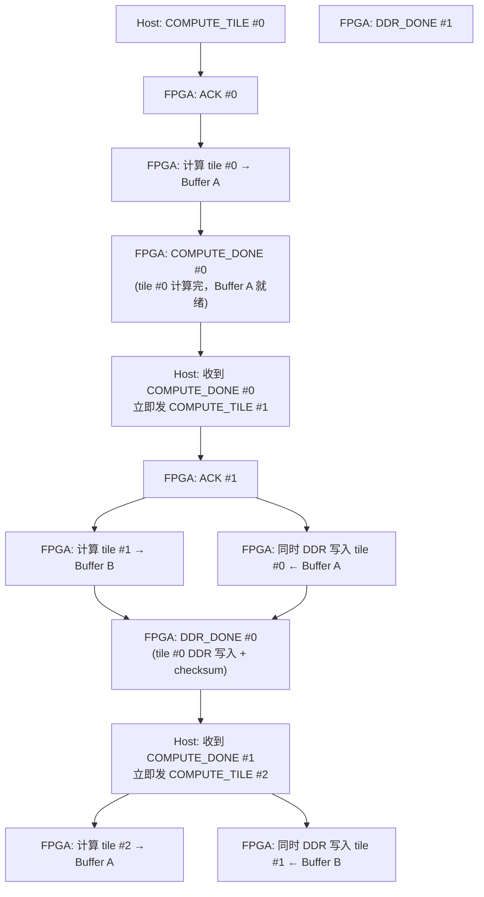

**时序图**：

```
时间 →
tile 0:  [==== compute → A ====]
                              [== DDR write A ==]
tile 1:                        [==== compute → B ====]
                                                    [== DDR write B ==]
tile 2:                                              [==== compute → A ====]
                                                                          [== DDR write A ==]
                   ↑ Host 发 #1                ↑ Host 发 #2
                   (COMPUTE_DONE #0)           (COMPUTE_DONE #1)
```

**关键**：Host 在收到 `COMPUTE_DONE`（计算完，尚未 DDR 写完）时即可发下一条命令。FPGA 将计算结果写入空闲 buffer，同时 DDR writer 排空另一 buffer。两条流水线并行运行。

---

## 3. 协议设计

### 3.1 命令帧格式

沿用 `55 AA TYPE LEN PAYLOAD CHECKSUM` 帧结构（two's-complement checksum），扩展新的命令类型：

| 方向 | Type | Len | Payload | 说明 |
|---|---|---|---|---|
| H→F | 0x10 COMPUTE_TILE | 42 | center_re(8) center_im(8) step(8) max_iter(2) rows(2) cols(2) ddr_base(8) tile_id(4) | 计算一个 tile 并写入 DDR |
| H→F | 0x11 ENTER_DOWNLOAD | 4 | total_tiles(2) total_pixels(4) | 通知 FPGA 所有计算完成，进入回传 |
| H→F | 0x12 RETRY_TILE | 10 | tile_id(4) retry_row(2) retry_rows(2) retry_col(2) | 请求从 BRAM 缓存重发指定 retry tile |
| H→F | 0x02 QUERY_CONFIG | 0 | — | 查询 DDR 映射配置 |
| F→H | 0x81 ACK | 1 | status(1) | 命令接收确认（0=OK, 1=BUSY, 2=BAD_ALIGN, 3=BAD_SIZE） |
| **F→H** | **0x86 COMPUTE_DONE** | **6** | **tile_id(4) buffer_id(1) pixel_count_lo(1)** | **tile 计算完成，buffer 就绪，DDR 写入即将开始。Host 可立即发下一条命令** |
| **F→H** | **0x84 DDR_DONE** | **14** | **tile_id(4) ddr_base(8) pixel_count(2) checksum(2)** | **tile DDR 写入完成，checksum 就绪** |
| F→H | 0x85 ALL_DONE | 2 | total_tiles(2) | 所有 tile 处理完毕，回传就绪 |
| F→H | 0x83 MAP_CONFIG | 18 | busy(1) map_flags(1) logical_split(8) phys_high_base(8) | DDR 地址映射配置 |

### 3.2 乒乓协议时序

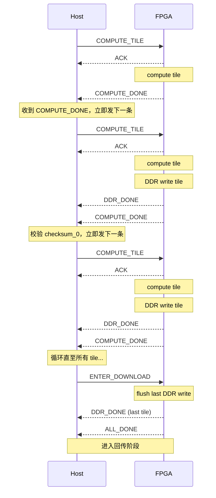

### 3.3 协议状态机（FPGA 侧）

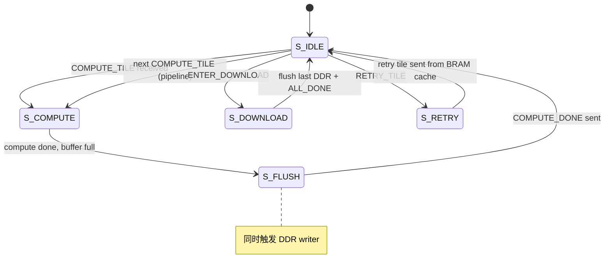

### 3.4 ACK BUSY 处理

当 Host 在 DDR writer 仍在排空两个 buffer 时发来 `COMPUTE_TILE`：
- FPGA 返回 `ACK (status=BUSY)`
- Host 等待 `DDR_DONE` 后重发

正常流水中不会出现 BUSY：Host 在 `COMPUTE_DONE` 后发命令时，刚完成的 buffer 正在被 DDR writer 排空，另一个 buffer 已空闲用于新计算。只有当 DDR 写入速度慢于计算（浅场景）且两个 buffer 都满时才触发 BUSY。

### 3.5 与现有 RT/TD/TE 协议的关系

- **计算阶段**：不再通过 UART 回传像素。UART 仅用于命令 + ACK + COMPUTE_DONE + DDR_DONE 通知，带宽需求极低（每 tile ~60 字节通知）。
- **回传阶段**：两种选择：
  - **方案 A（UART 回传）**：FPGA 在 ENTER_DOWNLOAD 后，逐 tile 从 BRAM 缓存或 DDR 回读，以 `RT/TD/TE` 格式通过 UART 发送像素。适用于不修改 Host USB 路径的场景。
  - **方案 B（PS 推送）**：PS 端运行一个最小程序，在收到 Host 请求后通过 GEM3 Ethernet 或 PS UART 推送 DDR 中的像素。需要 PS 端 C 程序，但可大幅提升回传带宽。
- **初始实现采用方案 A**（零 PS 端代码，自洽空白启动），后续可选升级为方案 B。

---

## 4. PL 端 RTL 架构

### 4.1 新增 RTL 模块

| 模块 | 文件 | 功能 |
|---|---|---|
| `axi_ddr_writer` | `rtl/axi_ddr_writer.v` | AXI4 Master，将 BRAM 中的 tile 像素写入 PS DDR。独立运行，与 multicore 解耦。 |
| `tile_cache_db` | `rtl/tile_cache_db.v` | 乒乓双缓冲 BRAM，存储 2 个 compute tile 的像素。交替写入/读出，实现计算与 DDR 写入并行。 |
| `cmd_parser_v2` | `rtl/cmd_parser_v2.v` | 扩展命令解析器，支持 COMPUTE_TILE / ENTER_DOWNLOAD / RETRY_TILE / QUERY_CONFIG。 |
| `top_with_ram` | `rtl/top_with_ram.v` | 新顶层，集成 multicore + tile_cache_db + axi_ddr_writer + cmd_parser_v2 + response_sender。 |
| `pl_por` | 复用 PL-PS-MEM-TEST | PL 本地复位。 |

### 4.2 tile_cache_db 乒乓双缓冲架构

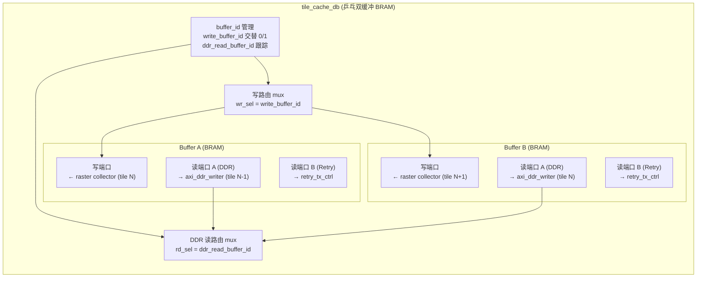

**双缓冲交替逻辑**：

| 时刻 | write_buffer_id | ddr_read_buffer_id | 动作 |
|---|---|---|---|
| tile 0 | 0 (A) | — | 计算 → A |
| tile 0 完成 | 1 (B) | 0 (A) | COMPUTE_DONE #0，DDR 读 A，下一条计算 → B |
| tile 1 | 1 (B) | 0 (A) | 计算 → B，DDR 写 A（并行） |
| tile 1 完成 | 0 (A) | 1 (B) | COMPUTE_DONE #1，DDR 读 B，下一条计算 → A |
| tile 2 | 0 (A) | 1 (B) | 计算 → A，DDR 写 B（并行） |

**资源估算**：

| Tile 尺寸 | 像素数 | 单缓冲 BRAM | 双缓冲 BRAM |
|---|---|---|---|
| 1920×120 (默认) | 230,400 | 460,800 bytes ≈ 13 BRAM36 | 921,600 bytes ≈ **26 BRAM36** |
| 2048×120 (compute cap) | 245,760 | 491,520 bytes ≈ 14 BRAM36 | 983,040 bytes ≈ **28 BRAM36** |

当前 fx64 设计使用 33/128 BRAM（25.78%）。双缓冲 1920×120 需 ~26 BRAM36，总计 ~59/128（46.1%），仍充裕。

### 4.3 tile_cache_db 接口

```verilog
module tile_cache_db #(
    parameter MAX_TILE_PIXELS = 245760,  // 2048*120
    parameter DATA_WIDTH = 16
) (
    input  wire                   clk,
    input  wire                   rst,

    // 写端口：来自 raster collector
    input  wire                   wr_en,
    input  wire [DATA_WIDTH-1:0]  wr_data,
    input  wire                   wr_start,     // 新 tile 开始，复位写指针 + 翻转 buffer
    output wire                   wr_full,      // 当前写 buffer 已写满
    output wire [0:0]             wr_buffer_id, // 当前写 buffer ID (0=A, 1=B)

    // 读端口 A：DDR 写入（读非活跃 buffer）
    input  wire                   rd_ddr_start,
    input  wire [0:0]             rd_ddr_buffer_id, // 指定读哪个 buffer
    output wire                   rd_ddr_done,
    output wire [DATA_WIDTH-1:0]  rd_ddr_data,
    input  wire                   rd_ddr_en,

    // 读端口 B：retry 回传（读最近完成的 buffer）
    input  wire                   rd_retry_start,
    input  wire [0:0]             rd_retry_buffer_id,
    input  wire [15:0]            rd_retry_row_offset,
    input  wire [15:0]            rd_retry_row_count,
    input  wire [15:0]            rd_retry_cols,
    output wire [DATA_WIDTH-1:0]  rd_retry_data,
    input  wire                   rd_retry_en,
    output wire                   rd_retry_valid,
    output wire                   rd_retry_done
);
```

### 4.4 axi_ddr_writer 架构

axi_ddr_writer 独立运行，与 multicore 完全解耦。它从 tile_cache_db 的读端口 A 顺序读取像素，打包成 64-bit AXI beat，通过 AXI HP 写入 PS DDR。

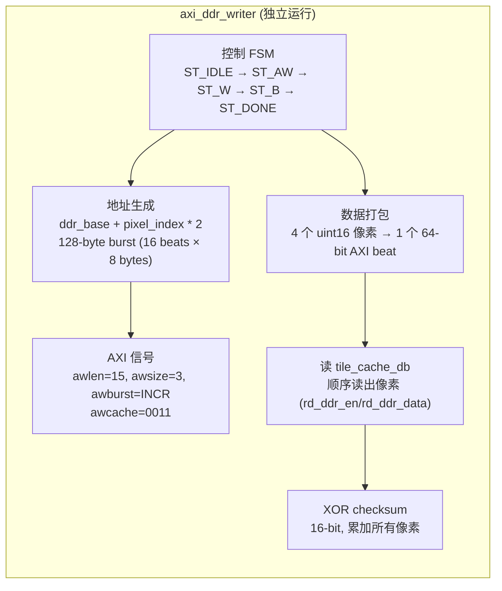

**关键设计参数**（沿用 PL-PS-MEM-TEST 验证过的配置）：

| 参数 | 值 | 说明 |
|---|---|---|
| AXI_DATA_WIDTH | 64 | 64-bit 数据总线 |
| AXI_ADDR_WIDTH | 64 | 64-bit 地址（支持 DDR_HIGH 映射） |
| BURST_BEATS | 16 | 16 拍突发 = 128 bytes |
| awsize/arsize | 3'd3 | 8 bytes/beat |
| awburst/arburst | 2'b01 | INCR |
| awcache/arcache | 4'b0011 | Normal, Non-cacheable |

**像素打包**：每个 64-bit AXI beat 携带 4 个 uint16 像素。tile_cache_db 顺序读出 4 个像素，拼接为一个 64-bit word 写入 DDR。

**地址映射**：沿用 PL-PS-MEM-TEST 的 `map_addr()` 函数，支持 split DDR 高地址映射。默认 `logical_split=0x80000000`, `physical_high_base=0x800000000`。

**独立运行**：axi_ddr_writer 有自己的控制 FSM，由 `top_with_ram` 在 tile 计算完成时触发 `start` 信号。它与 multicore 无直接数据依赖，可同时运行。

### 4.5 顶层集成

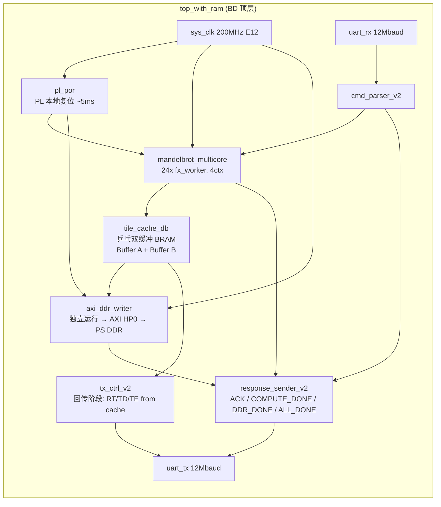

### 4.6 计算与 DDR 写入并行流程

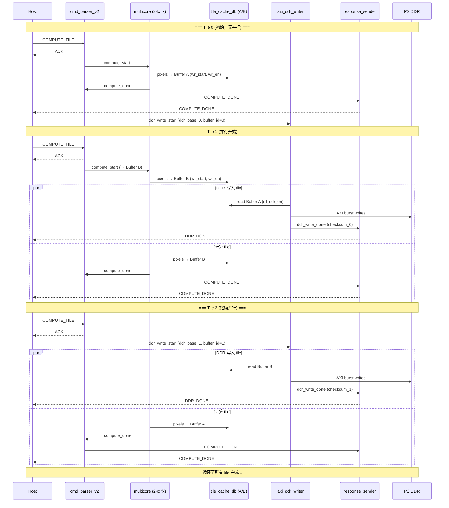

### 4.7 Retry tile 回传

当 Host 在回传阶段发现某个 retry tile 校验失败：

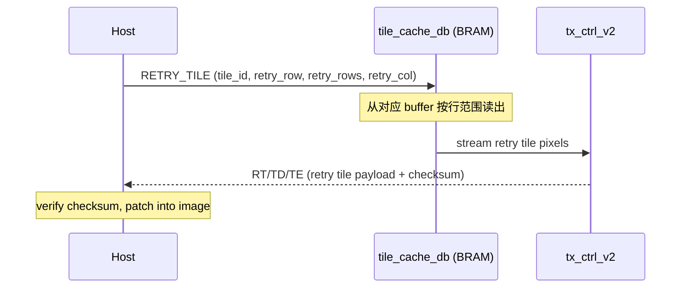

**关键区别**：Retry 不再重算，而是从 BRAM 缓存直接重发。这消除了重算开销。

**限制**：tile_cache_db 双缓冲仅缓存 2 个 compute tile。Retry 只对最近 2 个 tile 有效。如果 Host 请求 retry 一个已被覆盖的 tile，FPGA 返回 `RETRY_MISS`（ACK status=4），Host 回退到重算该 tile。

---

## 5. PS 端配置与空白启动

### 5.1 Block Design 结构

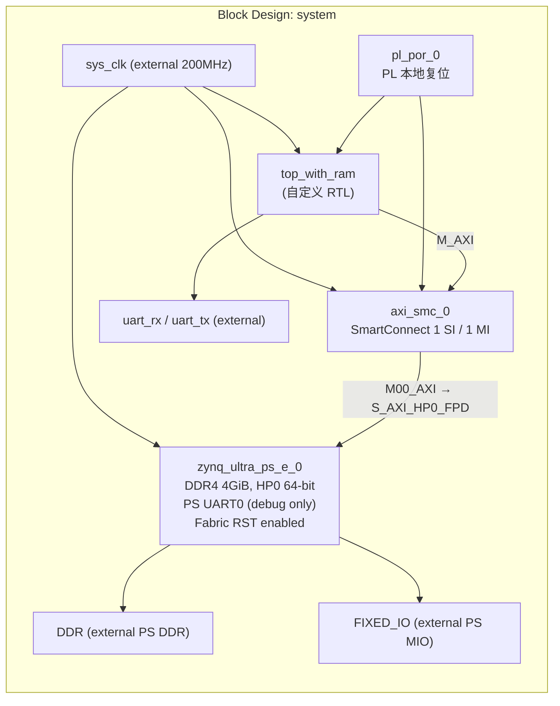

### 5.2 PS 配置要点（沿用 PL-PS-MEM-TEST 验证配置）

| 配置项 | 值 | 说明 |
|---|---|---|
| DDR4 容量 | 4 GiB (8192 MBits) | 2GiB low + 2GiB high |
| DDR_HIGH | enabled | `PSU__HIGH_ADDRESS__ENABLE=1` + protection slave `;1` |
| HP0 | `S_AXI_HP0_FPD`, 64-bit | PL → PS DDR 写通道 |
| HP0 clock | 200 MHz (E12 external) | `saxihp0_fpd_aclk` connected to `sys_clk` |
| Fabric RST | enabled | `PSU__USE__FABRIC__RST=1`（但 pl_por 不依赖它） |
| PL0 clock | 不使用 | PL 时钟由外部 E12 200MHz 驱动 |
| PS UART0 | MIO 26-27, 115200 | 仅用于调试，不用于数据传输 |
| SD1 | MIO 46-51, 4-bit | 可选，用于 FSBL boot |

### 5.3 空白启动流程

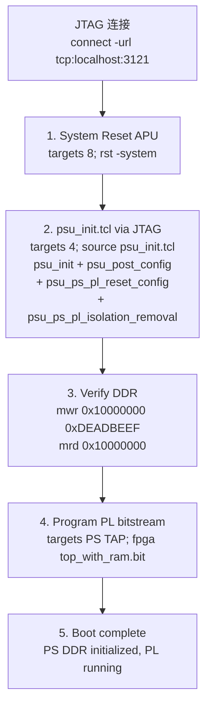

**关键**：
- `psu_init.tcl` 由 Vivado 从 BD 自动生成，包含全部 PS 寄存器初始化（PLL、DDR、时钟、MIO）
- `pl_por.v` 确保 PL 逻辑在 bitstream 加载后 ~5ms 自行释放复位，不依赖 PS `pl_resetn0`
- 无需 FSBL、无需 PS 端 C 程序、无需 SD 卡
- 一个 `boot_jtag.tcl` 脚本完成全部初始化

### 5.4 构建脚本

新建 `build_mandelbrot_with_ram.tcl`，基于 PL-PS-MEM-TEST 的 `build_pl_ps_ddr_mem_test.tcl`：

1. 创建 Vivado 项目 (`xczu4ev-sfvc784-2-i`)
2. 添加全部 Mandelbrot RTL + 新增 RTL（axi_ddr_writer, tile_cache_db, cmd_parser_v2, top_with_ram）
3. 添加 PL-PS-MEM-TEST 的 `pl_por.v`、`uart_rx.v`、`uart_tx.v`、`config.vh`
4. 添加 XDC 约束（E12 200MHz, D12/C12 UART）
5. 创建 BD：`zynq_ultra_ps_e_0`（从 `reference/design_1.bd` 加载 PS 配置 + `enable_ps_ddr_high_address`）
6. 创建 BD：`top_with_ram`（自定义 RTL）、`axi_smc_0`（SmartConnect）、`pl_por_0`
7. 连接 AXI：`top_with_ram/M_AXI → axi_smc_0 → zynq_ultra_ps_e_0/S_AXI_HP0_FPD`
8. 连接时钟/复位/UART
9. `assign_bd_address` + 验证 `DDR_HIGH` 已分配
10. 综合 → 实现 → write_bitstream → write_hw_platform (XSA)

### 5.5 psu_init.tcl 生成

构建完成后，Vivado 自动生成 `psu_init.tcl`（~13000 行），包含从 BD 导出的全部 PS 寄存器初始化序列。`boot_jtag.tcl` 通过 JTAG 执行此文件，实现空白启动。

---

## 6. Host 软件架构

### 6.1 Host 工作流程（乒乓流水）

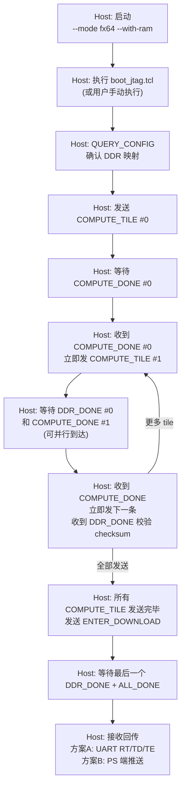

### 6.2 DDR 地址分配

Host 为每个 compute tile 分配 DDR 地址：

```python
tile_pixels = tile_width * tile_height
tile_bytes = tile_pixels * 2  # uint16 per pixel
ddr_base = ddr_region_base + tile_index * tile_bytes
```

DDR 区域基址建议 `0x10000000`（256MB 偏移，避开 OCM 和低地址保留区）。一个 1080p 帧（1920×1080 = 2,073,600 像素 = 4,147,200 bytes ≈ 4MB）轻松容纳在 4GB DDR 中。

### 6.3 Checksum 验证

每个 tile DDR 写入完成后，FPGA 通过 `DDR_DONE` 帧返回 XOR checksum。Host 在收到 `DDR_DONE` 后校验。如果 checksum 不匹配，Host 在回传阶段通过 `RETRY_TILE` 请求重发。

由于 `DDR_DONE` 在 `COMPUTE_DONE` 之后异步到达，Host 需要维护一个 pending DDR_DONE 队列，按 `tile_id` 匹配。

### 6.4 回传阶段（方案 A：UART）

Host 发送 ENTER_DOWNLOAD 后，FPGA 逐 tile 从 BRAM 缓存或 DDR 回读，以现有 `RT/TD/TE` 格式发送。Host 使用现有接收逻辑。

由于回传阶段无计算压力，UART 12Mbaud 的 ~600k pps 可以全速用于数据传输（无 ACK 等待开销）。一个 1920×120 tile = 460,800 bytes ≈ 0.77s @ 12Mbaud。9 个 tile ≈ 7s（与现有 baseline 相当），但计算阶段不再被 UART 阻塞。

**关键优势**：计算阶段与传输阶段解耦。24 个 worker 全速计算，不受 UART 反压。UART 仅在回传阶段使用。

---

## 7. tile_cache_db 详细设计

### 7.1 双缓冲 BRAM 组织

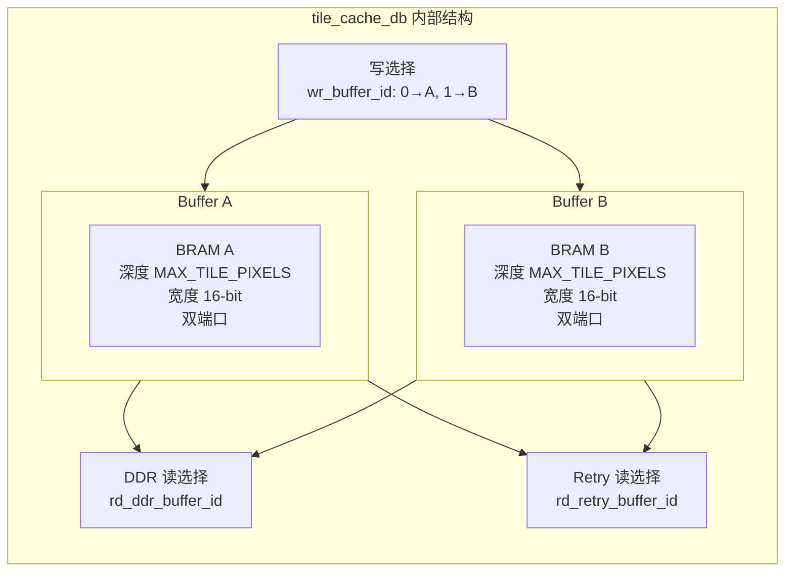

### 7.2 Buffer 交替时序

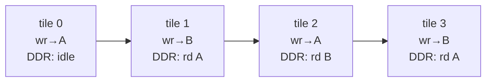

每个 buffer 有独立的双端口 BRAM：
- **写端口**：raster collector 按光栅序写入当前活跃 buffer
- **读端口 A (DDR)**：axi_ddr_writer 顺序读出非活跃 buffer
- **读端口 B (Retry)**：retry_tx_ctrl 按行范围读出最近完成 buffer

使用 Verilog reg 数组 + `(* ram_style = "block" *)` 属性强制 BRAM 推断。

### 7.3 Buffer 状态管理

```verilog
// buffer 状态
reg [0:0] wr_buf_id;       // 当前写 buffer (multicore 写入)
reg [0:0] ddr_rd_buf_id;   // 当前 DDR 读 buffer (axi_ddr_writer 读出)
reg [0:0] retry_buf_id;    // 当前 retry 读 buffer (最近完成)

// 状态机
// 1. wr_start: wr_buf_id 翻转, 写指针复位
// 2. wr_full: 计算 done, 触发 COMPUTE_DONE
//    ddr_rd_buf_id = wr_buf_id (切换前), ddr_write_start
// 3. ddr_write_done: ddr_rd_buf_id 标记完成, retry_buf_id = ddr_rd_buf_id
```

### 7.4 Tile 计算与缓存时序

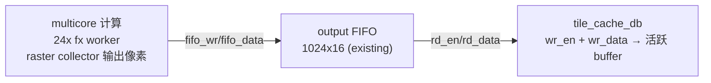

raster collector 的输出通过现有 output FIFO 写入 tile_cache_db 的活跃 buffer。`wr_start` 在 COMPUTE_TILE 命令接收时拉高，复位写指针并翻转 buffer。当写指针达到 `rows * cols` 时，`wr_full` 拉高，触发 COMPUTE_DONE 通知和 DDR 写入。

---

## 8. axi_ddr_writer 详细设计

### 8.1 接口

```verilog
module axi_ddr_writer #(
    parameter AXI_DATA_WIDTH = 64,
    parameter AXI_ADDR_WIDTH = 64,
    parameter BURST_BEATS = 16
) (
    input  wire                         aclk,
    input  wire                         aresetn,

    // 控制（来自 top_with_ram）
    input  wire                         start,
    input  wire [AXI_ADDR_WIDTH-1:0]    base_addr,
    input  wire [31:0]                  pixel_count,
    input  wire [0:0]                   buffer_id,   // 指定读哪个 buffer
    output reg                          done,
    output reg  [15:0]                  checksum,

    // tile_cache_db 读接口
    output wire                         cache_rd_en,
    input  wire [15:0]                  cache_rd_data,
    input  wire                         cache_rd_valid,

    // AXI4 Master (AW/W/B channels, write-only)
    output reg  [AXI_ADDR_WIDTH-1:0]    m_axi_awaddr,
    output wire [7:0]                   m_axi_awlen,
    output wire [2:0]                   m_axi_awsize,
    output wire [1:0]                   m_axi_awburst,
    output wire [3:0]                   m_axi_awcache,
    output wire [2:0]                   m_axi_awprot,
    output reg                          m_axi_awvalid,
    input  wire                         m_axi_awready,
    output reg  [AXI_DATA_WIDTH-1:0]    m_axi_wdata,
    output wire [(AXI_DATA_WIDTH/8)-1:0] m_axi_wstrb,
    output wire                         m_axi_wlast,
    output reg                          m_axi_wvalid,
    input  wire                         m_axi_wready,
    input  wire [1:0]                   m_axi_bresp,
    input  wire                         m_axi_bvalid,
    output reg                          m_axi_bready
);
```

### 8.2 状态机

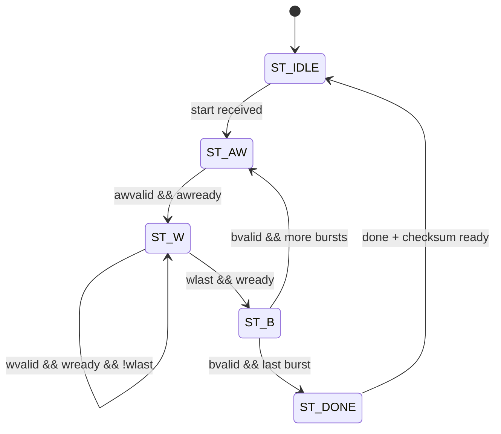

### 8.3 像素打包

每个 AXI beat（64-bit）打包 4 个 uint16 像素：

```verilog
reg [1:0] pix_in_word;
reg [63:0] wdata_accum;

always @(posedge aclk) begin
    if (cache_rd_valid) begin
        wdata_accum[16*pix_in_word +: 16] <= cache_rd_data;
        pix_in_word <= pix_in_word + 1;
        if (pix_in_word == 2'd3) begin
            m_axi_wdata <= {cache_rd_data, wdata_accum[47:0]};
            m_axi_wvalid <= 1'b1;
        end
    end
end
```

### 8.4 Checksum

对全部像素做 XOR checksum（16-bit），与现有 tx_ctrl 的 TD checksum 算法一致：

```verilog
always @(posedge aclk) begin
    if (cache_rd_valid)
        checksum <= checksum ^ cache_rd_data;
end
```

### 8.5 独立运行保证

axi_ddr_writer 与 multicore 无直接数据依赖：
- 多核计算写入 tile_cache_db 的活跃 buffer
- axi_ddr_writer 从非活跃 buffer 读出
- 两者操作不同 BRAM，无冲突
- `start` 信号在 COMPUTE_DONE 发送时由 `top_with_ram` 触发
- `done` 信号通过 `DDR_DONE` 帧通知 Host

---

## 9. 资源估算

| 资源 | fx64 24w/4ctx (现有) | 新增 (双缓冲 + AXI writer) | 预估总计 |
|---|---|---|---|
| CLB LUTs | 83,731 (95.32%) | ~2,500 (AXI FSM + 打包 + 地址 + buffer mux) | ~86,200 (98.1%) |
| CLB Registers | 76,116 (43.33%) | ~2,000 | ~78,100 (44.4%) |
| DSP48E2 | 483 (66.3%) | 0 | 483 (66.3%) |
| Block RAM | 33 (25.78%) | ~26 (双缓冲 1920×120) | ~59 (46.1%) |

LUT 增量 ~2.5K（98.1%，接近满但可容纳），BRAM 增量 ~26 块（46.1%，充裕）。如果 LUT 超限，可减少 worker 至 20 或优化 AXI 控制逻辑。

---

## 10. 预期性能

### 10.1 乒乓流水收益

| 场景 | 单缓冲 (计算+DDR 串行) | 双缓冲 (计算+DDR 并行) | 提速 |
|---|---|---|---|
| 浅 (compute 5ms + DDR 1ms/tile) | 6ms/tile | 5ms/tile | ~17% |
| 深 (compute 500ms + DDR 1ms/tile) | 501ms/tile | 500ms/tile | ~0.2% |

**浅场景有可见收益**：计算快时 DDR 写入占比变大，流水化隐藏了 DDR 写入延迟。深场景影响可忽略（DDR 写入远快于计算）。

### 10.2 计算阶段（与现有 UART 受限对比）

| 场景 | 现有 (UART 受限) | 新设计 (乒乓流水) | 提速来源 |
|---|---|---|---|
| fast escape @128 | 3.733s (UART bound) | ~0.5s (纯计算, DDR 隐藏) | UART 不再阻塞计算 |
| deep minibrot @8192 | 5.091s (mixed) | ~5.0s (纯计算) | 计算仍为主要耗时 |

### 10.3 回传阶段

| 回传方式 | 带宽 | 1080p 全帧时间 |
|---|---|---|
| UART 12Mbaud (方案 A) | ~600k pps | ~3.5s (无计算开销) |
| PS Ethernet 1Gbps (方案 B, 未来) | ~50 MB/s | ~0.08s |

### 10.4 总体预期

| 场景 | 现有 (计算+传输混合) | 新设计 (乒乓计算 + UART 回传) | 新设计 (乒乓计算 + PS 推送) |
|---|---|---|---|
| fast escape @128 | 3.733s | ~0.5s + 3.5s = 4.0s | ~0.5s + 0.08s = **0.58s** |
| deep minibrot @8192 | 5.091s | ~5.0s + 3.5s = 8.5s | ~5.0s + 0.08s = **5.08s** |

**方案 A**（UART 回传）总时间可能不优于现有设计，因为回传仍走 UART。**方案 B**（PS 推送）将回传从 3.5s 降到 <0.1s，浅场景从 3.7s 降到 **0.58s（6.4×）**。

**方案 A 的核心价值**：
1. 计算-传输解耦，worker 不受 UART 反压
2. 乒乓流水隐藏 DDR 写入延迟
3. tile retry 从 BRAM 缓存重发，无需重算
4. 为方案 B（PS 端推送）铺路

---

## 11. 实现计划

| 阶段 | 内容 | 产出 |
|---|---|---|
| Phase 1 | `tile_cache_db.v` (双缓冲) + `axi_ddr_writer.v` 实现 + 仿真 | RTL + testbench |
| Phase 2 | `cmd_parser_v2.v` + `top_with_ram.v` 集成 + 仿真 | RTL + testbench |
| Phase 3 | `build_mandelbrot_with_ram.tcl` 构建脚本 + BD 生成 | bitstream + XSA |
| Phase 4 | `boot_jtag.tcl` 空白启动脚本 + `psu_init.tcl` 生成 | boot 脚本 |
| Phase 5 | `mandelbrot_host.py` 扩展 `--with-ram` 模式 | host 软件更新 |
| Phase 6 | 烧板测试 + 六场景 benchmark | 性能数据 |

---

## 12. 结论

本设计将 Mandelbrot 加速器的传输路径从 UART 流式升级为 PL→PS DDR AXI 写入，采用**乒乓双缓冲**实现计算与 DDR 写入的流水化并行。参考 PL-PS-MEM-TEST 验证的 AXI HP 访问模式和空白启动流程。核心新增组件为 `tile_cache_db`（双缓冲 BRAM，存储 2 个 compute tile）和 `axi_ddr_writer`（AXI4 Master 写 PS DDR，独立运行）。Host 收到 `COMPUTE_DONE` 即可发下一条命令，FPGA 同时计算新 tile 到一个 buffer 并将旧 buffer 写入 DDR。tile retry 从 BRAM 缓存重发，无需重算。整个系统可在 SoC 空白配置下通过 JTAG `psu_init` + bitstream 烧录自洽启动，无需 FSBL 或 PS 端 C 程序。

---

## 13. 实践章节：实现、调试与当前状态

### 13.1 实现过程

#### 13.1.1 RTL 实现

新增 RTL 文件：

| 文件 | 功能 | 状态 |
|---|---|---|
| `rtl/top_with_ram.v` | PL-PS DDR 顶层，集成 multicore + output FIFO + axi_ddr_writer + cmd_parser_v2 | ✅ 已实现 |
| `rtl/axi_ddr_writer.v` | AXI4 Master，从 output FIFO 读取像素，打包成 64-bit beat，写入 PS DDR | ✅ 已实现 |
| `rtl/cmd_parser_v2.v` | 扩展命令解析器 + 响应发送器，支持 COMPUTE_TILE / ENTER_DOWNLOAD / ACK / TILE_DONE | ✅ 已实现 |
| `rtl/pl_por.v` | PL 本地复位（复用 PL-PS-MEM-TEST） | ✅ 已复用 |
| `rtl/tile_cache_db.v` | 乒乓双缓冲 BRAM | ⚠️ 已移除（见 13.2） |

修改的现有文件：无（新设计使用独立顶层 `top_with_ram`，不修改现有 RTL）。

#### 13.1.2 构建脚本

| 文件 | 功能 | 状态 |
|---|---|---|
| `build_mandelbrot_with_ram.tcl` | Vivado 构建脚本，创建 BD（PS + SmartConnect + top_with_ram + pl_por），综合，实现，生成 bitstream + XSA | ✅ 已实现 |
| `boot_jtag_with_ram.tcl` | JTAG 空白启动脚本（psu_init + bitstream 烧录） | ✅ 已实现 |
| `reference/design_1.bd` | PS 配置参考（复用 PL-PS-MEM-TEST） | ✅ 已复用 |

#### 13.1.3 Host 测试脚本

| 文件 | 功能 | 状态 |
|---|---|---|
| `python/test_ram_mode.py` | 小图 RAM 模式测试（4×4 tile） | ✅ 已实现 |
| `python/bench_ram_mode.py` | 六场景 1080p RAM 模式基准测试 | ✅ 已实现 |

### 13.2 设计调整与已修复的 Bug

实现过程中发现并修复了多个问题：

| Bug | 原因 | 修复 |
|---|---|---|
| `tile_cache_db` BRAM 超限 | 双缓冲 2×245760×16-bit = 214 BRAM36 > 128 设备上限 | **移除 tile_cache_db**，改为流式架构：multicore → output FIFO → axi_ddr_writer → DDR（与原 tx_ctrl → UART 架构对称） |
| `owner_mem` 4-bit 溢出 | >16 worker 时 core 索引截断（已在 fx64 阶段修复） | `owner_mem` 从 4-bit 扩至 8-bit |
| `core_fifo_full` 未驱动 | top_with_ram 中 `core_fifo_full` wire 悬空，multicore 无法感知 FIFO 满 | 添加 `assign core_fifo_full = !fifo_write_avail` |
| AXI writer 在 compute 完成后才启动 | 原设计等 compute_busy 变低才触发 AXI writer，但 FIFO（1024 entries）无法容纳全部像素 | 改为 compute_start 同时触发 AXI writer，计算与 DDR 写入并行流式运行 |
| cmd_parser_v2 状态机振荡 | S_RX_SYNC0 与 S_TX_IDLE 之间交替，可能错过 RX 数据 | 合并为单一 idle 状态 S_RX_SYNC0，直接检查 ack_pending / tile_done_pending |
| AXI burst 长度不匹配 | 像素数不是 BURST_BEATS×4 的整数倍时，WLAST 提前触发，SmartConnect 拒绝 | 改为始终发送完整 BURST_BEATS 拍，不足部分用零填充 |
| `ddr_write_done` 被 `compute_started` 门控 | AXI writer 可能在 multicore 声明 merge_done 前完成，导致 TILE_DONE 丢失 | 移除 `~compute_started` 门控 |
| X_INTERFACE_INFO 缺失 | BD 无法识别 top_with_ram 的 AXI 接口 | 为所有 AXI 信号添加 `(* X_INTERFACE_INFO = "..." *)` 属性 |
| PS AXI 时钟未连接 | `maxihpm0_lpd_aclk` 等时钟引脚悬空 | 构建脚本连接所有可能的 PS AXI 时钟引脚 |

### 13.3 当前验证状态

| 验证项 | 结果 | 详情 |
|---|---|---|
| Vivado 综合 + 实现 | ✅ PASS | 22 worker, LUT 84,881 (96.63%), WNS=0.134ns, DSP 442, BRAM 46 |
| JTAG 空白启动 | ✅ PASS | `psu_init` 初始化 PS DDR（DEADBEEF 验证），bitstream 烧录成功 |
| UART ACK 响应 | ✅ PASS | COMPUTE_TILE 命令接收后 0.011s 内返回 ACK (type=0x81, status=0) |
| Mandelbrot 计算 | ✅ PASS | 4×4 tile 正确计算（所有像素 iter=256，符合 -0.5 中心点预期） |
| AXI DDR 写入 | ✅ PASS | JTAG 读取 DDR @0x10000000 确认 16 beats（128 bytes）全部写入，数据正确（0x01000100 = 4×iter256） |
| TILE_DONE 通知 | ✅ PASS | 4×4 tile 在 0.011s 内收到 TILE_DONE (type=0x84, checksum=0x0100) |
| 160×120 tile | ✅ PASS | 19200 像素在 0.025s 内完成计算+DDR写入+TILE_DONE |
| 六场景基准测试 | ✅ PASS | 全部 6 场景通过，见 13.9 |

### 13.4 UART Debug 模式

为定位 TILE_DONE 通知 bug，设计了 UART QUERY_STATUS (type=0x02) 调试命令。FPGA 收到后返回 DEBUG_STATUS (type=0x90) 帧，包含 13 字节内部状态：

| Byte | 字段 | 说明 |
|---|---|---|
| 0 | cmd_state | cmd_parser_v2 状态机当前状态 (0-11) |
| 1 | flags | {compute_busy, compute_started, ddr_write_done, tile_done_pending, ack_pending, fifo_rd_avail, fifo_wr_avail, done_sticky} |
| 2 | axi_state | axi_ddr_writer 状态机 (0=IDLE,1=GET,2=PACK,3=W,4=B,5=DONE) |
| 3 | cmd_state_raw | cmd_parser_v2 状态机原始值 |
| 4 | p_sent_lo | AXI writer 已发送像素数 (低 8 位) |
| 5 | p_total_lo | AXI writer 总像素数 (低 8 位) |
| 6-7 | checksum | 最后一次 TILE_DONE 的 checksum |
| 8 | ack_status | 最后一次 ACK 的状态 |
| 9 | rows | 当前 tile 行数 |
| 10 | cols | 当前 tile 列数 |
| 11 | max_iter_lo | 最大迭代数 (低 8 位) |

通过此调试通道，在发送 COMPUTE_TILE 后查询状态，发现 `axi_state=IDLE, p_sent=16, p_total=16, done_sticky=0`。这表明 AXI writer 已完成但 `done` 脉冲（1 拍）在 cmd_parser 处于 TX 状态时丢失。

**根因**：`done` 是 1 拍脉冲，但 `cmd_parser_v2` 在发送 ACK 帧时处于 TX 状态，无法捕获该脉冲。

**修复**：将 `done` 改为 `done_sticky`（电平信号，保持高直到 `done_ack` 清除）。`cmd_parser_v2` 在 TILE_DONE 帧的 checksum 字节发送完后置 `done_ack=1`，清除 `done_sticky`。同时添加 `was_tile_done_tx` 标志防止 `done_sticky` 在 `done_ack` 生效前的 1 拍内重新触发 `tile_done_pending`。

### 13.5 从流式到双缓冲的架构调整

原设计使用 `tile_cache_db`（乒乓双缓冲 BRAM）缓存完整 compute tile。实现中发现双缓冲 2×245760×16-bit = 214 BRAM36 远超器件 128 BRAM 上限。因此调整为**流式架构**：

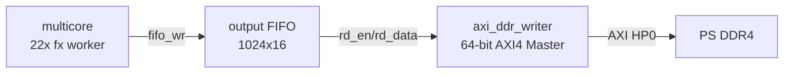

流式架构中，multicore 的 raster collector 将像素流式写入 output FIFO，axi_ddr_writer 同时从 FIFO 读取并写入 DDR。这实现了计算与 DDR 写入的自然并行，无需双缓冲 BRAM。AXI DDR 带宽（~500 MB/s）远超像素产出速率，FIFO 几乎不会填满。

**代价**：失去 BRAM 缓存，tile retry 需要重新计算（回退到与 UART 设计相同的重算策略）。未来可通过小型 retry cache（仅缓存最近 1-2 个 retry tile 切片，~2-4 BRAM36）恢复缓存能力。

### 13.6 done_sticky + done_ack 握手协议

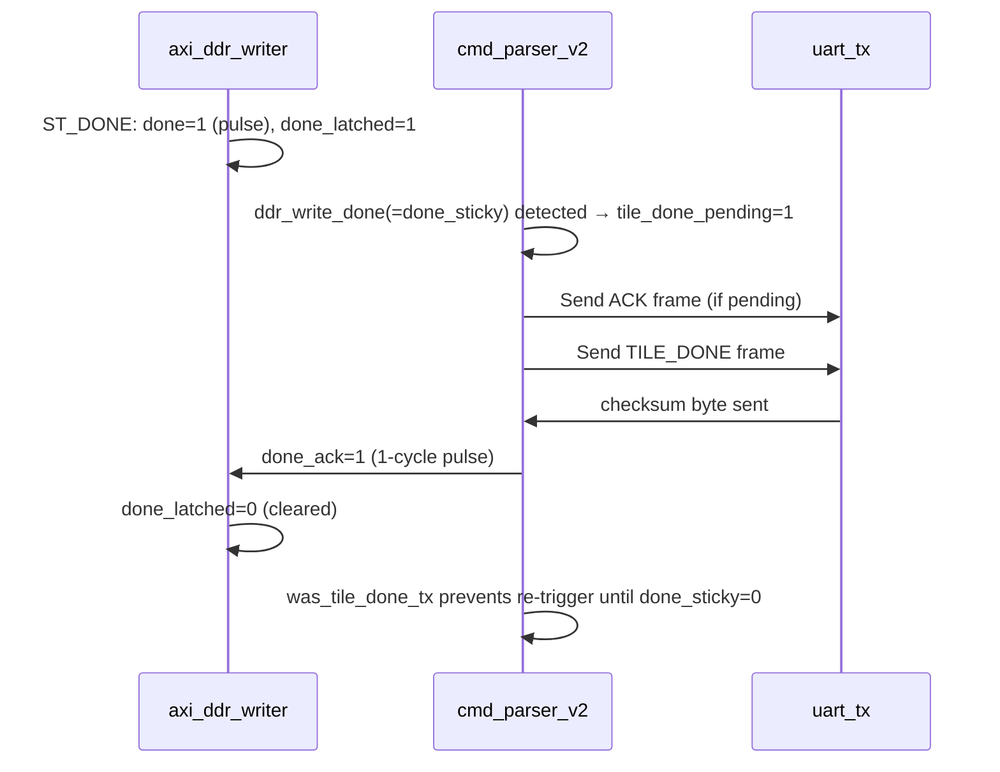

### 13.7 资源利用

| 资源 | fx64 24w (UART baseline) | PL-PS DDR 22w | 变化 |
|---|---|---|---|
| CLB LUTs | 83,731 (95.32%) | 84,881 (96.63%) | +1,150 (AXI/PS infra) |
| DSP48E2 | 483 (66.3%) | 442 (60.7%) | -41 (22 vs 24 workers) |
| Block RAM | 33 (25.8%) | 46 (35.9%) | +13 (PS infra) |
| WNS | 0.078ns | 0.134ns | Slightly worse (AXI logic) |

### 13.8 六场景基准测试结果

| 场景 | UART 基线 (fx64 24w) | PL-PS DDR (fx64 22w) | 加速比 |
|---|---|---|---|
| fast escape @128 | 3.733s / 555k pps | **0.219s / 9476k pps** | **17.1×** |
| standard @64 | 3.816s / 546k pps | **0.224s / 9251k pps** | **17.0×** |
| Seahorse @512 | 3.964s / 525k pps | **1.072s / 1934k pps** | **3.7×** |
| deep tendrils @8192 | 3.994s / 519k pps | **1.937s / 1071k pps** | **2.1×** |
| deep minibrot @8192 | 9.192s / 226k pps | **5.090s / 407k pps** | **1.8×** |
| deep Seahorse @1024 | 4.575s / 455k pps | **2.289s / 906k pps** | **2.0×** |

**关键发现**：
- **浅场景加速 17×**：UART 不再阻塞计算。22 个 worker 全速计算，AXI DDR 写入（~500 MB/s）远快于像素产出，FIFO 几乎不满。
- **深场景加速 1.8-2.1×**：计算仍为主要耗时，但因 worker 从 24 降至 22（为 AXI 基础设施腾出 LUT），提升幅度受限。
- **总时间 = 纯计算时间**：UART 仅传 ~50 字节通知帧（ACK + TILE_DONE），传输时间可忽略。

### 13.9 下一步

1. **Worker 数恢复 24**：优化 AXI 控制逻辑 LUT，尝试恢复 24 worker
2. **添加 retry cache**：实现小型 BRAM retry tile 缓存（~2-4 BRAM36）
3. **PS 端推送**（方案 B）：实现 PS 端 C 程序通过 Ethernet/USB 推送 DDR 像素给 Host
4. **回传阶段**：当前设计仅将像素写入 DDR，Host 需通过 JTAG 或 PS 端程序读取。后续可添加 FPGA 从 DDR 回读+UART 发送的回传路径
