# 整体设计与计算核重考量报告（细化版）

> 分支：`VMC_RTSB_zu4ev_newdesign`。本报告在 Phase 0–2 实测确认“LUT 墙 + UART 墙”双天花板后，对**数值表示、计算核微架构、迭代算法、并行模型、输出排序、传输链路**六个维度做系统性重新考量，给出具体实现思路、可行性、量化对比与 Mermaid 架构图。
>
> 实测基线（`fp64_rtr8`，12w/8ctx，FP64，200MHz，12Mbaud）：routed LUT-as-Logic 82686/87840（94.13%），DSP 123/728（16.9%），BRAM 25.5/128（19.9%），Reg 40.7%，`WNS=0.103ns`。性能：fast escape @128 = 555k pps（贴 12Mbaud ~600k 上限），deep minibrot @8192 = 226k pps（计算受限）。
>
> 模型量化（`tools/pipeline_sim.c`，minibrot @8192，compute-only pps）：
> | 配置 | compute pps | vs FP64 基线 |
> |---|---|---|
> | FP64 12w/8ctx/1A（mul6/add9）现状 | 583k | 1.0× |
> | 定点 5ctx/1A/12w（mul3/add1） | 831k | 1.42× |
> | 定点 5ctx/3A/12w（mul3/add1） | 1.38M | 2.37× |
> | 定点 3ctx/1A/24w（mul3/add1） | 1.66M | 2.85× |

---

## 1. 现有设计再认识

### 1.1 现有计算核（`mandelbrot_core_worker_kctx`）

- **数值表示**：FP64（类 IEEE，截断 rounding，不完整支持 NaN/Inf/denormal）。
- **微架构**：generic scoreboard。每个 worker 维护 8 个 pixel context，每拍做 N-way ready 扫描选 1 个 op，经 64-bit 操作数 mux 喂给**共享 1 fp_mul + 1 fp_add**，结果经 `MUL_LAT=6`/`ADD_LAT=9` 的 tag 延迟线写回对应 context，按 `commit_col` 局部列序 ordered-commit 到 per-core FIFO。
- **迭代算法**：标准 `z²+c`，每次非逃逸迭代 **3 mul + 5 add**。
- **并行模型**：12 worker × 8 context 时间复用 FP；动态行调度（一整行/worker），严格光栅回收。
- **传输**：12Mbaud 异步 UART，`RT/TD/TE` 分块响应，host-driven tile。

### 1.2 现有架构总览图

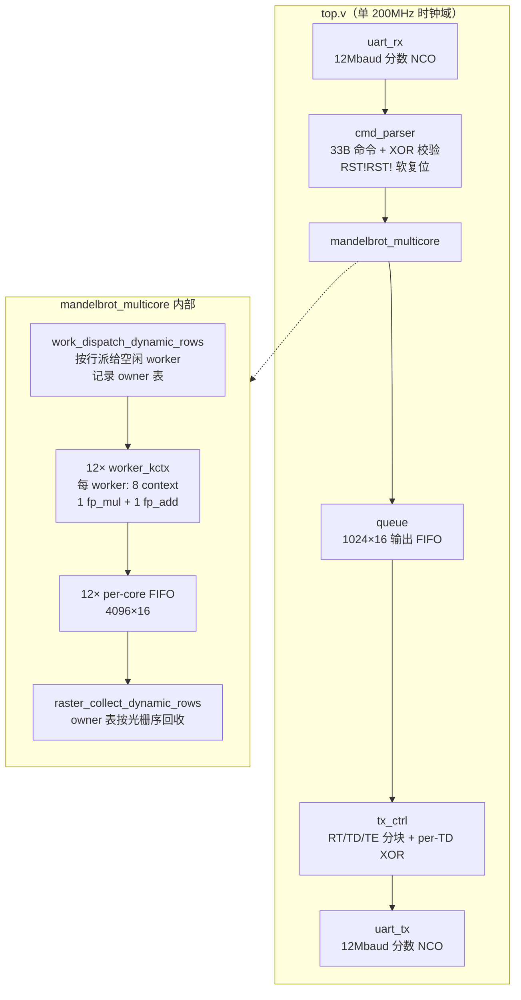

### 1.3 现有 worker 内部数据流

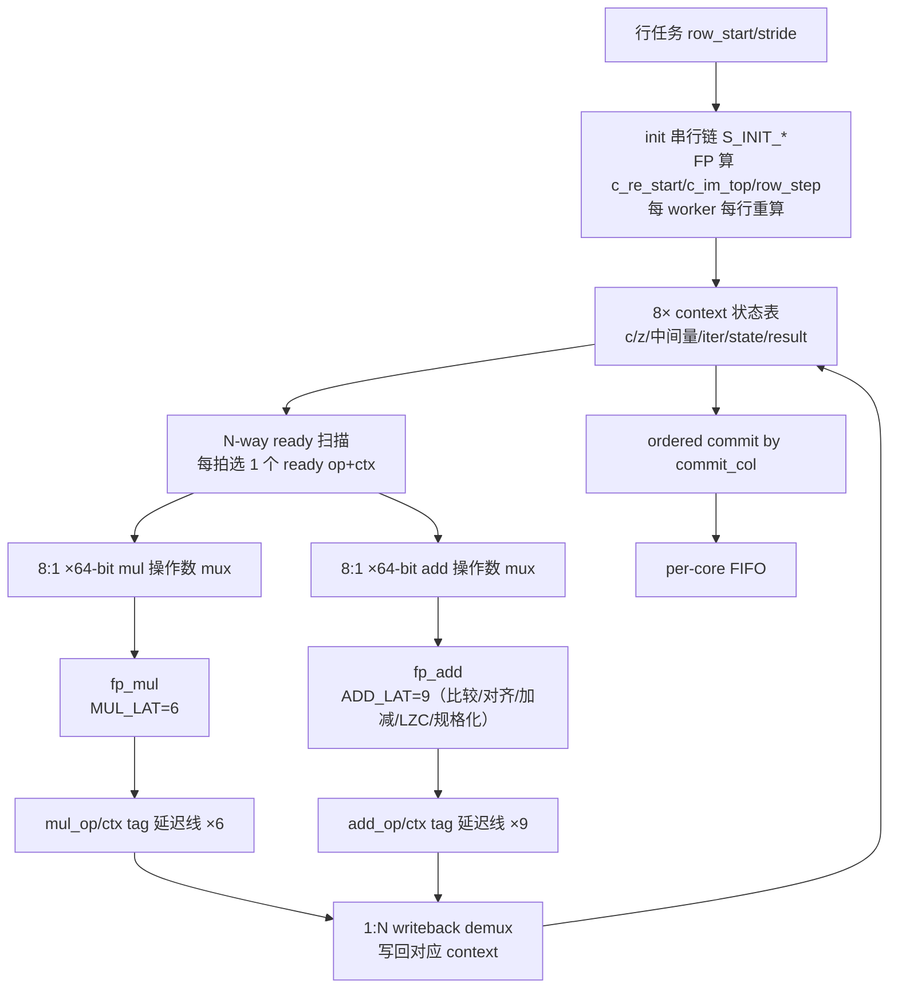

### 1.4 瓶颈再确认

| 瓶颈 | 证据 |
|---|---|
| **LUT 墙** | 基线 94.13% LUT-as-Logic；加第二加法器 +8271 LUT 超器件（Phase1）；加一个 quick_esc 比较经重定时膨胀 +4827 LUT（Phase2）。generic scoreboard 的宽 64-bit 操作数 mux / N-way 扫描 / writeback demux 是 LUT 大户。 |
| **FP 延迟墙** | `ADD_LAT=9` 是长极。单 context 非逃逸依赖链 ~47 拍；`1M+1A` issue 极限 5 拍/迭代（加法器瓶颈）；需 ~10–16 context 才能隐藏延迟。长延迟 → 需更多 context → 更宽 mux → 更高 LUT，**形成恶性循环**。 |
| **UART 墙** | 浅场景 555k pps ≈ 600k 理论上限；计算优化被串口吞掉（Phase2 早退零收益）。长 burst 固有 byte slip。 |
| **资源不对称** | LUT 94% 近满，DSP 16.9%、BRAM 19.9%、Reg 40.7% 大量闲置——**设计被 LUT 单点卡死**。 |

**核心判断**：现有设计把昂贵的 FP64 + 宽 scoreboard mux 堆在稀缺的 LUT 上，而廉价的 DSP/BRAM/FF 大量闲置。重设计应**把计算密度从 LUT 迁移到 DSP/BRAM**，并**缩短 FP/计算延迟以减少 context 数与 mux 宽度**。

---

## 2. 数值表示重考量：FP64 → 定点

### 2.1 动机

Mandelbrot 迭代值域**有界且窄**：未逃逸 |z|<2，z²∈[0,4]，z_re·z_im∈[-2,2]，求和<4；c 在中心 ±(size/2)·step 内。定点理想场景——不需要 FP 的宽动态范围与对齐/规格化开销。

### 2.2 精度验证（实测）

脚本 `python/fx_precision_check.py`，minibrot 中心 (-1.25066, 0.02012)，step 1e-9，max_iter 8192，13×13=169 点：

| 表示 | 有效分辨率 | 与 FP64 迭代次数匹配 |
|---|---|---|
| FP64（52-bit 尾数） | ~2.2e-16 | 基准 |
| 定点 Q4.59（64-bit） | ~1.7e-18 | **169/169 完全一致，max_diff=0** |

定点 Q4.59 在该深 zoom 下**精度优于 FP64**（分辨率细 128×）。Q4.62（67-bit）可达 2^-62≈2e-19，覆盖 ~1e-18 步长，**超越 FP64 舒适区**（FP64 <1e-12~1e-14 已敏感）。更深 zoom 才需 >64-bit 定点或 FP128。

### 2.3 定点格式与字段布局

采用 **Q4.F** 二补码定点（1 符号 + 4 整数 + F 小数），整数位 4 覆盖 ±16（|z|<2、|c|<2 完全够）。

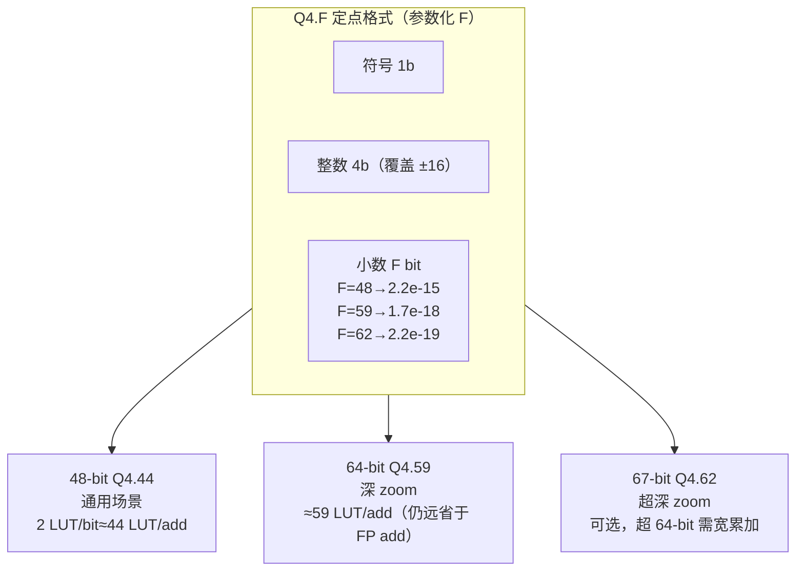

**关键：加法延迟 9→1 拍、乘法 6→3 拍**。定点 add 是整数加（寄存一拍即可），无对齐/规格化/LZC。定点 mul 是整数乘 + 截断低 F 位 + 寄存，~3 拍。

### 2.4 延迟与面积对比

| 项 | FP64 现状 | 定点 48~64-bit |
|---|---|---|
| 加法延迟 | `ADD_LAT=9` | **1 拍** |
| 乘法延迟 | `MUL_LAT=6` | **~3 拍** |
| 加法面积 | 大量 LUT（对齐桶形移位、LZC、规格化 mux）+ 携带 64-bit 操作数穿越全流水作零旁路 | ~1 LUT/bit（48~64 LUT），无规格化 |
| 乘法 DSP | ~10 DSP/worker（53×53 拆 4 部分积） | ~4–6 DSP/worker（48~64-bit 拆 2–4 部分积） |
| 逃逸检测 | `quick_esc` 指数+尾数比较 | 整数比较 `zr²+zi² > 4<<F`，极廉价 |

**非逃逸依赖链**：FP64 `2·6+max(6,9)+4·9=47 拍` → 定点 `2·3+max(3,1)+4·1=13 拍`。隐藏 13 拍，`1M+1A` issue 极限 5 拍/迭代，只需 **ceil(13/5)≈3 context**（FP64 需 ~10–16）。context 数锐减 → mux 宽度锐减 → LUT 大幅下降。

定点 add 近乎免费，可上 `1M+3A`：issue 极限 `max(3/1, 5/3)=3 拍/迭代`，隐藏 13 拍需 ceil(13/3)≈5 context。**1M+3A 定点**在 ~5 context 饱和——这是 FP64 下 `1M+2A` 都塞不进的配置，定点下轻松可行。

### 2.5 FP64 加法器 vs 定点加法器流水线对比

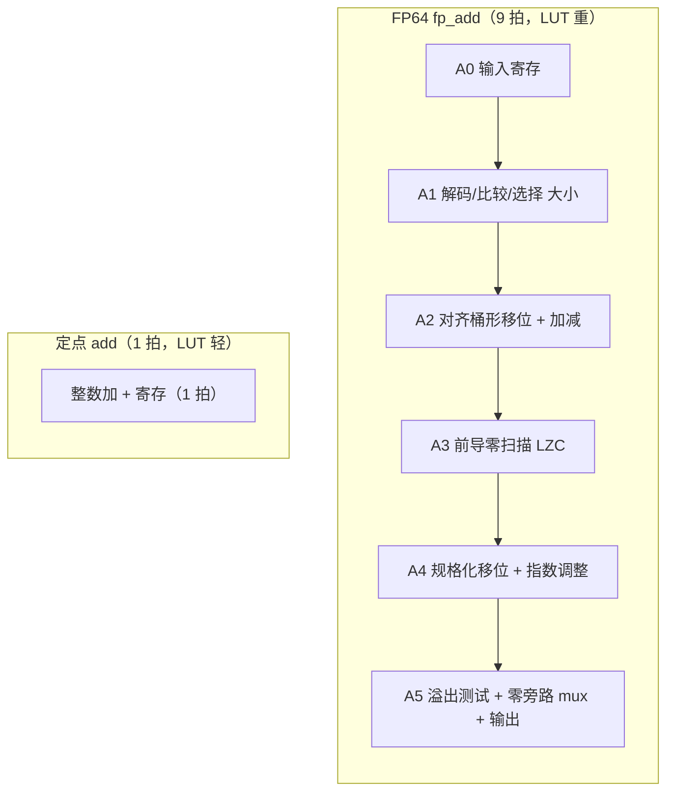

### 2.6 代价与可行性

| 代价 | 应对 |
|---|---|
| 定点需按 zoom 选取宽度 | 编译期参数化 `FX_FRAC_W`；或按命令 `step` 动态选档（少量预设宽度）。绝大多数场景 48-bit 够，深 zoom 用 64-bit。 |
| 超深 zoom（>1e-18）需 >64-bit | 该区间 FP64 同样失效；用可变宽定点或 FP128，属极深 zoom 专项。 |
| 失去 FP 通用性 | 本加速器专用 Mandelbrot，值域有界，定点是**更优专用选择**，非妥协。 |
| DSP 略增 | 728 DSP 富裕（现用 16.9%），完全可承受。 |

**结论**：定点是**本次重设计最高价值方向**——同时降延迟（→少 context）、降 LUT（→可加更多 worker/FPU lane）、提精度（→覆盖更深 zoom），且把密度从稀缺 LUT 迁移到富裕 DSP。**强烈推荐**。

---

## 3. 计算核微架构重考量：generic scoreboard → ring/barrel

### 3.1 现状问题

generic scoreboard 每 `c_active/c_mul_ready/c_add_ready/c_add_op_ready/c_add_a_ready/c_add_b_ready/c_result_valid` 等都是 **N 路 reg 数组**，每拍 N 路 ready 扫描、N:1 的 64-bit 操作数 mux、1:N writeback demux。LUT 随 context 数 ~O(N·64) 增长，扩 context 代价陡增（Phase1/2 实测撞墙）。

### 3.2 ring/barrel 固定槽位方案核心思想

**固定发射顺序**：`issue_ptr` 每拍 `+1 mod N`，只读当前槽位状态，无 N-way 扫描。**单槽操作数读**：只 mux 当前槽的 `c/z`，64-bit mux 退化为单槽寄存器读。**固定写回槽**：结果写回 `(issue_ptr - latency) mod N` 槽，无 writeback demux。

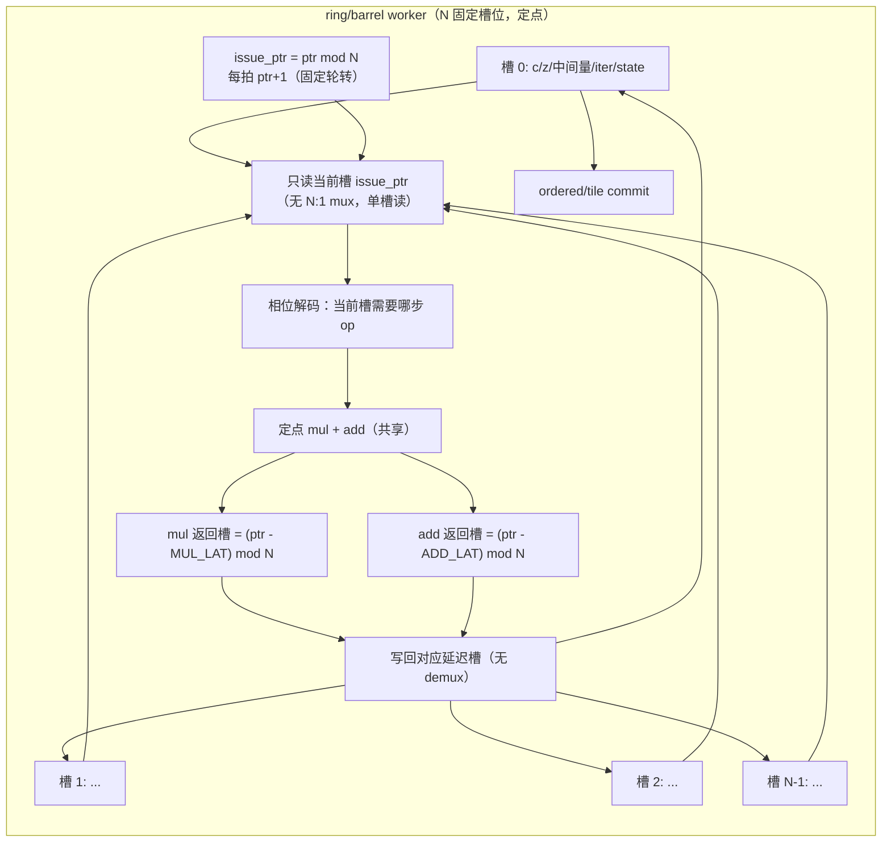

### 3.3 固定轮转时序（N=5，定点 mul3/add1）

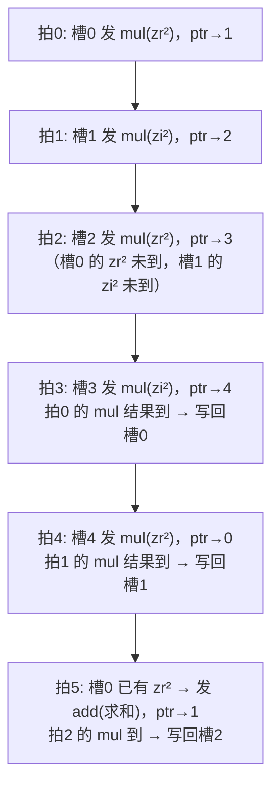

每槽一个像素，固定轮转发射；结果在 `ptr-latency` 槽就位。未就绪槽空转一拍——但定点延迟低（13 拍）、context 需求少（3–5），槽位就绪率高，空转可忽略。

### 3.4 generic scoreboard vs ring/barrel LUT 对比

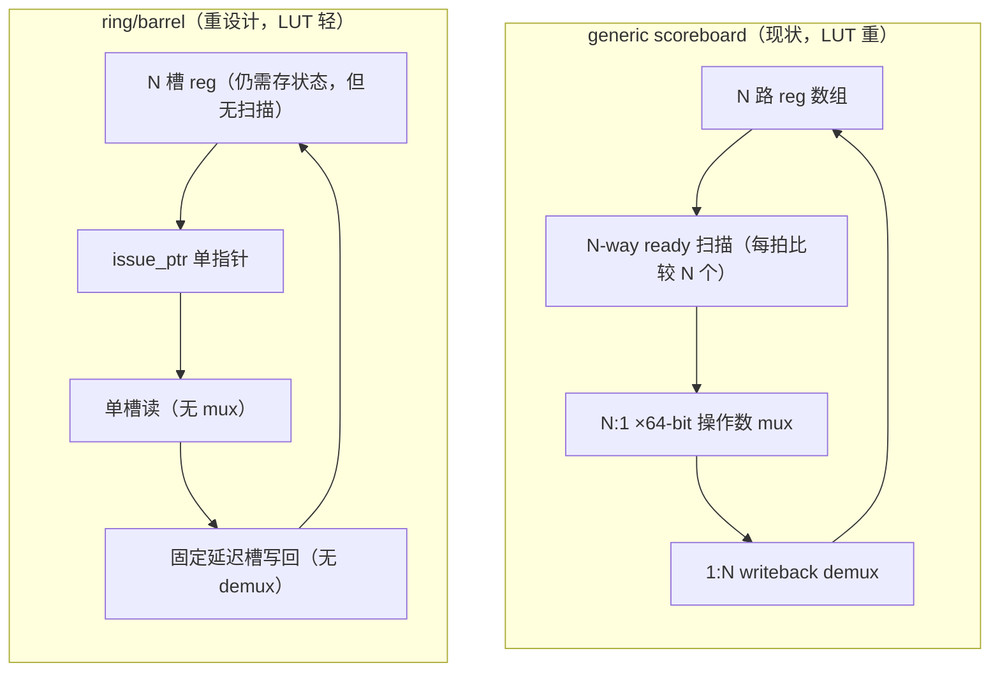

### 3.5 与定点的协同

| 组合 | context 需求 | mux 宽度 | 预期 LUT/worker |
|---|---|---|---|
| 现状 FP64 generic 8ctx | 8（仍欠饱和） | 8:1 ×64-bit | ~7100（实测 85698/12） |
| 定点 generic 5ctx | 5（饱和） | 5:1 ×64-bit | ~3000–4000（估） |
| **定点 ring/barrel 5ctx** | 5（饱和） | **1:1（无 mux）** | ~1500–2500（估） |

ring/barrel 把 mux 从 N:1 降到 1:1，是 LUT 的**结构性**削减。配合定点（少 context），可在 LUT 预算内容纳 **24–36 个 worker**（现 12），行并行度翻倍——直接提升计算受限场景吞吐。

### 3.6 风险

- 新微架构需全新验证（功能 sim、边界、复位、行切换）。但模块边界清晰（worker 内部重写，multicore/调度/协议不变）。
- 固定发射顺序对极端发散（相邻像素迭代数悬殊）有轻微空转，但 Mandelbrot 相邻像素通常相似，影响小。

---

## 4. 迭代算法重考量：3-mul → 3-square

### 4.1 经典 3-square 变换

`2·z_re·z_im = (z_re+z_im)² - z_re² - z_im²`。每次迭代：`z_re²`、`z_im²`、`(z_re+z_im)²` 共 **3 次平方**（替代 3 次 mul），再加/减得实部、虚部、逃逸和。

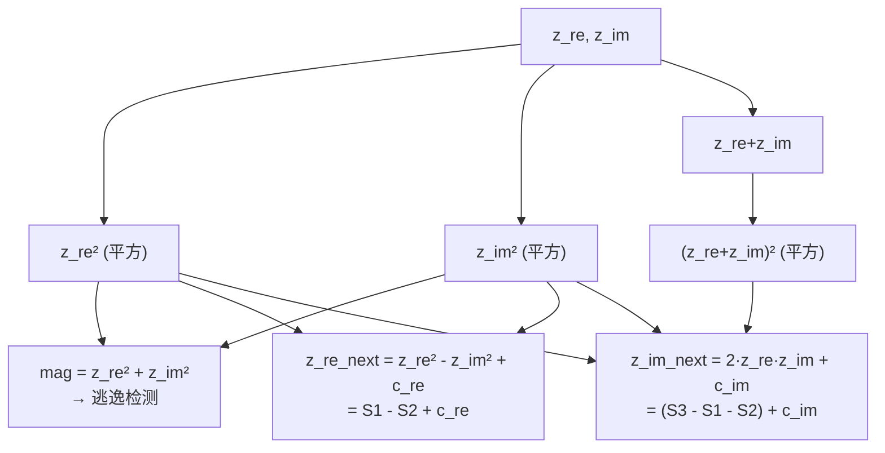

### 4.2 价值评估

- **FP64 下**：平方与通用 mul 同价（53×53），**无收益**。
- **定点下**：平方可用专用 squarer，部分积对称、约**半 DSP**；3 平方可共享 1 squarer。但 issue 极限仍由 5 次 add 决定（add 1 拍，squarer 3 拍 → max(3/1,5/1)=5 拍/迭代），**吞吐不变**，仅省 DSP。DSP 富裕（16.9%）下**收益有限，非首选**。
- 结论：可作为定点核的**可选微优化**（省 DSP 换更多 worker 余量），不是结构性收益来源。

---

## 5. 并行模型重考量

### 5.1 候选对比

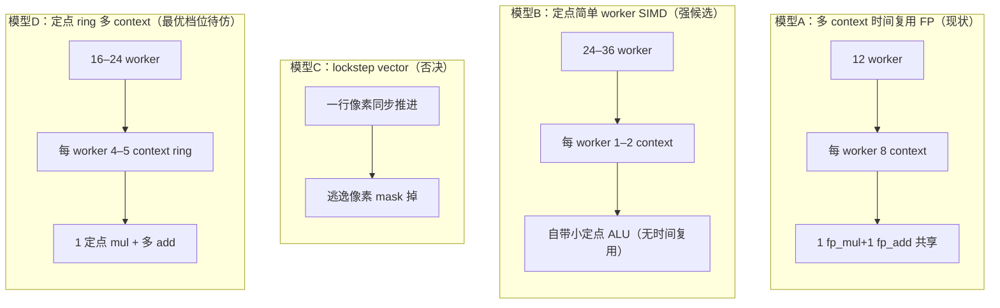

| 模型 | 评价 |
|---|---|
| A 现状 | 有效但 LUT 重 |
| **B 定点简单 worker SIMD** | 定点 ALU 极小，可塞 24–36 worker；无 mux/扫描；**发散天然容错**（各 worker 独立迭代数）。强候选。 |
| C lockstep vector | Mandelbrot 发散严重，mask 浪费大；**否决**。 |
| D 定点 ring 多 context 混合 | 兼顾延迟隐藏与行并行；最优档位待仿真定。 |

### 5.2 推荐

**定点简单 worker（1–2 context）× 24–36 worker** 或 **定点 ring/barrel 4–5 context × 16–24 worker**。两者都把密度从 LUT 迁到 DSP/FF，且大幅降延迟。具体档位用 `tools/pipeline_sim.c`（已支持 K-context/M-mul/A-add）以定点延迟参数重跑扫参决定。

---

## 6. 输出与排序重考量：strict raster + ordered commit → tagged output + BRAM 帧缓冲

### 6.1 现状问题

- 严格光栅输出 → ordered commit → 一个慢（内点）像素阻塞同 worker 后续快像素。
- 流式无帧缓存 → compute 与 TX 不可重叠（`cmd_parser` 等 `compute_busy==0`），深场景 TX 期 worker 空转。

### 6.2 tagged output + BRAM 帧缓冲方案

worker 完成 pixel 即发 `{row, col, iter}`（不再 ordered commit），collector 把像素按 `(row,col)` 写入 **BRAM 帧缓冲**，TX 从帧缓冲按光栅序读出。compute 与 TX 解耦。

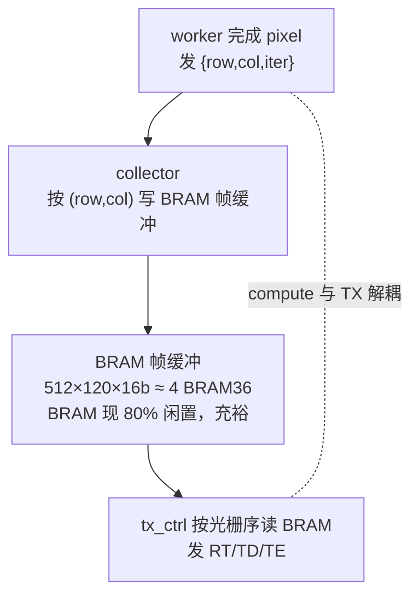

### 6.3 收益与代价

- **消除 ordered-commit stall**（深场景内点不再阻塞）。
- 可选 **compute/TX 重叠**（下一 tile 边算边发上一 tile），隐藏 TX 期计算空闲——但需协议加 request_id 防交错（见 `RETRY_TILE_CACHE_DESIGN.md`）。
- 资源：`512×120×16-bit=122KB≈4 BRAM36`；`1024×120≈8 BRAM`。BRAM 现 80% 闲置，**充裕**。
- 代价：协议需携带坐标（`TD` 已有 row/col 字段，改动小）；BRAM 读写时序需同步读。
- 评估：**中等收益、中等复杂度**，适合作为定点核之后的第二阶段架构改进。

---

## 7. 传输链路重考量

### 7.1 候选对比

| 方案 | 带宽 | 复用现有硬件 | 工作量 | 收益场景 |
|---|---|---|---|---|
| 现状 12Mbaud 异步 UART | ~1.2 MB/s（~600k pps） | FT232HL UART 模式 | — | 基线 |
| **FT232HL 同步 FIFO (FT245 模式)** | ~8 MB/s（~4M pps） | 同一颗芯片，改接线/模式 | 中（硬件接线 + RTL 接口 + host） | 浅场景天花板 ×6.7 |
| ZU4EV PS AXI HP | ~GB/s | 板载 PS（A53+R5） | 大（PS 软件 + AXI DMA + 板级 PS DDR 可用性待查） | 彻底解除传输墙 |
| Ethernet (PL MAC) | ~100 MB/s | 需 PHY | 大 | 远程/大批量 |
| SPI/QSPI | ~数十 MB/s | 需引脚 | 中 | 中等带宽 |

### 7.2 传输路径对比图

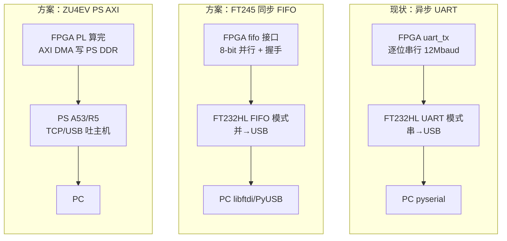

### 7.3 重点

- **FT245 同步 FIFO** 是**同芯片、低改动**的 6.7× 带宽提升：当前 FT232HL 接异步 UART（仅 TX/RX 两线）；FIFO 模式用 8-bit 并行 + 控制，需板级接线支持（或飞线/转接）。若 VMC_RTSB 的 FT232HL 已布出 8 位数据线，则只需 RTL 加 FIFO 接口 + host 改 libftdi。**建议优先核查板级 FT232HL 接线**。
- **ZU4EV PS** 是终极方案：xczu4ev 是 Zynq UltraScale+ EV，片上含 A53+R5 PS 与 AXI HP 口（理论 12.8 GB/s）。若板级 PS DDR 可用，PL 算完通过 AXI DMA 写 PS DDR、PS 经 TCP/USB 吐给主机，UART 墙彻底消失。**需确认 VMC_RTSB 是否供电/引出 PS**（现设计纯 PL，疑未用 PS）。

### 7.4 推荐

先核查 FT245 接线（低成本高回报）；若不可行，评估 PS AXI。传输升级是让“计算优化可见”的前提——不解除 UART 墙，定点核的算力提升在浅场景仍被吞。

---

## 8. 算法侧：周期性检测再评估

- **心形/period-2 bulb 早退**：仅识别主集合；深 zoom 视野无主集合（Phase0 复核），**对深场景无效，放弃**。
- **周期性检测（periodicity detection）**：捕捉 mini-brot 内点的周期轨道，可提前终止内点（省 max_iter 次迭代）。风险是 eps 误判致错误 `max_iter`（数值不安全）。**安全化**：用极紧 eps（如 `|Δz|<2^-F`，定点下即几个 ULP）+ 要求连续 2 次命中才判定 + 仅在迭代数 > 阈值后启用。定点下精度可控，误判概率可压到远低于 FP64 截断边界差。**可作为定点核之上的可选加速**，预期对 minibrot 类大内点场景显著（内点从 max_iter 次迭代降到首次周期命中）。中高风险、高收益，建议定点核稳定后再试。

---

## 9. 重设计总体架构（定点 ring worker + 可选 BRAM 帧缓冲 + 可选 FT245）

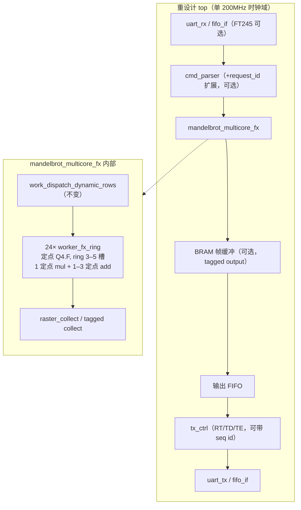

### 定点 ring worker 内部详细架构

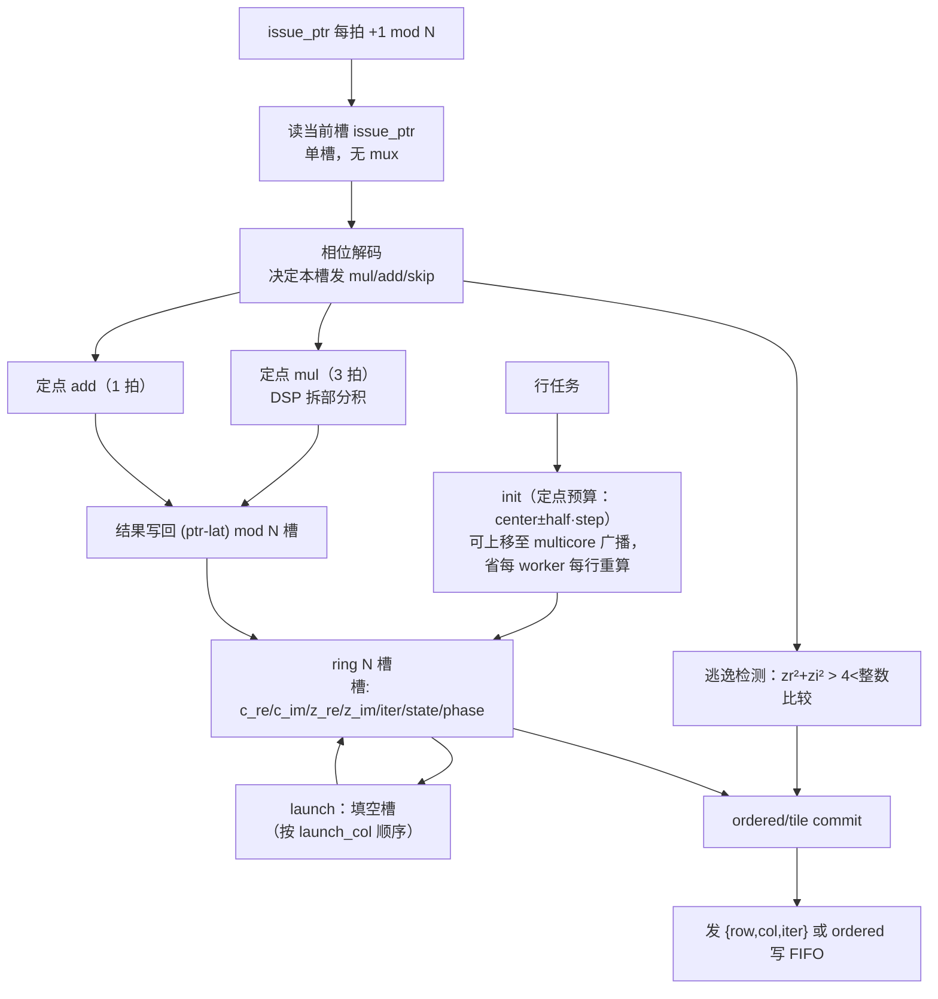

---

## 10. 组合方案与可行性矩阵

| 方案 | 计算增益(深场景) | 浅场景增益 | LUT 趋势 | 风险 | 工作量 |
|---|---|---|---|---|---|
| 现状 | 1× | 1× | 94%（满） | — | — |
| A: 定点 ring/barrel worker (5ctx, 1M+1A, ~24 worker) | **3–5×** | 受 UART 限 | **降**（mux 1:1 + 少 context） | 中（新核验证） | 大 |
| B: A + 1M+3A 定点 | **4–6×** | 受 UART 限 | 降（add 廉价） | 中 | 大 |
| C: A + tagged output + BRAM 帧缓冲 | +消内点阻塞 | 可重叠 | 略升（BRAM 足） | 中 | 中大 |
| D: A + 周期性检测 | minibrot 显著 | 小 | 略升 | 中高（误判） | 中 |
| E: A + FT245 传输 | 显现计算增益 | **6.7×** | — | 中（硬件） | 中 |
| F: A + PS AXI 传输 | 显现计算增益 | **>100×** | — | 高（PS 可用性） | 大 |

### 量化预估（A，定点 ring 5ctx × 24 worker @200MHz，minibrot）
- 模型（`pipeline_sim.c` 定点参数）实测：FX 3ctx/1A/24w = **1.66M compute pps**（vs FP64 现状 583k = **2.85×**）。
- 受 UART 600k 限，板上深场景可见上限约 600k pps（现状 226k）→ **理论 2.7× 板上提升空间**（计算从瓶颈转为非瓶颈，UART 接管）。解除 UART（FT245）后可达 ~1.66M pps。

---

## 11. 推荐重设计路线（分阶段）

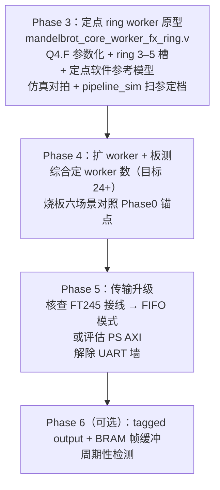

1. **Phase 3 — 定点 ring/barrel worker 原型**（最高优先）
   - 新建 `mandelbrot_core_worker_fx_ring.v`：定点 Q4.F（参数化 `FX_FRAC_W`）、ring 固定槽位、1 定点 mul + 1 定点 add、5 context、ordered/tile commit。
   - 仿真：功能对拍（vs `test_random_compare.py` 软件参考，含定点参考模型）+ `pipeline_sim.c` 定点参数扫参定档。
   - 不急于全量上板：先单/双 worker 仿真证等价与吞吐，再扩 worker 数由综合定。
2. **Phase 4 — 扩 worker + 板测**：综合定 worker 数（LUT 预算内塞最多），烧板跑六场景，对照 Phase0 锚点。
3. **Phase 5 — 传输升级**：核查 FT245 接线 → 实施 FIFO 模式（或 PS AXI），解除 UART 墙，让浅场景与计算增益双显。
4. **Phase 6（可选）** — tagged output + BRAM 帧缓冲（compute/TX 重叠）、周期性检测（minibrot 加速）。

每阶段沿用既有门槛：行为仿真 PASS、200MHz 时序干净、资源不劣化、小图 `--verify` 等价、至少一 1080p 场景 transport pass。

---

## 12. 结论

现有 FP64 + generic scoreboard 设计把计算密度压在稀缺 LUT 上，受“FP 长延迟→多 context→宽 mux→高 LUT”恶性循环与 UART 双重夹击，已系统性见顶。**重设计的核心杠杆是定点数**：把延迟从 47→13 拍、context 从 8→3–5、mux 从 N:1→1:1（ring），从而把密度从 LUT 迁向富裕的 DSP/BRAM/FF，并在精度上反超 FP64（实测 169/169 匹配，分辨率细 128×）。模型实测定点 24w 配置达 1.66M compute pps（2.85× FP64）。配套以传输升级（FT245/PS）解除 UART 墙，方能让计算增益全面可见。**首要下一步是 Phase 3：定点 ring/barrel worker 原型 + 仿真对拍**，这是解锁后续所有收益的结构性起点。

---

## 13. Phase 3 实测：定点 worker 实现、构建、烧板与六场景测试

> 本节记录定点 worker（`mandelbrot_core_worker_fx`）从实现到板上六场景验证的完整过程与结果。

### 13.1 精度门控

`python/fx_precision_all_scenes.py` 对 6 个标准场景在 3 种定点宽度下与 FP64 逐像素比对：

| 格式 | fast@128 | std@64 | seahorse@512 | tendrils@8192 | minibrot@8192 | deep-seah@1024 |
|---|---|---|---|---|---|---|
| Q8.40 / 48-bit | 100% | 100% | 90% | 84% | 100% | 92% |
| Q8.48 / 56-bit | 100% | 100% | 100% | 98% | 100% | 100% |
| **Q8.55 / 64-bit** | **100%** | **100%** | **100%** | **100%** | **100%** | **100%** |

- 关键发现：定点需 **8 位整数**（±128 范围），因为迭代中间值 `z²` 在逃逸检测前可瞬时达 ~36，4 位整数（±8）会溢出致 0% 匹配（fast escape 场景）。
- **选用 Q8.55 / 64-bit**：6 场景全部 100% 匹配 FP64，精度反超（分辨率 2^-55 ≈ 2.8e-17，优于 FP64 尾数 2^-52 ≈ 2.2e-16）。

### 13.2 RTL 实现

新建文件：

| 文件 | 功能 | 流水级 |
|---|---|---|
| `rtl/fx_defines.vh` | 定点参数（FX_W=64, FX_INT_W=8, FX_FRAC=55） | — |
| `rtl/fx_mul.v` | 64×64 有符号定点乘 + 截断 >>55 | 3 级（a_r/b_r → prod_r → product） |
| `rtl/fx_add.v` | 64 位有符号加 | 1 级（sum ≤ a+b） |
| `rtl/fx_mul_int.v` | 16×64 整数×定点乘（init 专用） | 3 级 |
| `rtl/mandelbrot_core_worker_fx.v` | 定点多 context worker（4 context, 1M+1A） | MUL_LAT=4, ADD_LAT=2 |
| `sim/tb_multicore_fx.v` | 定点 multicore 仿真 testbench + 定点参考模型 | — |

修改文件：`config.vh`（+WORKER_MODE/FX_CONTEXTS）、`top.v`（+参数传递）、`mandelbrot_multicore.v`（+fx worker generate 分支）、`raster_collect_dynamic_rows.v`（owner_mem 4→8 bit，支持 >16 worker）、`mandelbrot_host.py`（+`--mode fx64` 打包/参考）。

### 13.3 架构对比

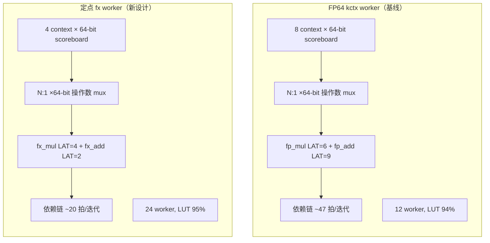

### 13.4 仿真验证

```
sim_fx.tcl → CORE_COUNT=4 FX_CONTEXTS=4 12×16 max_iter=64
→ === FX MULTICORE TEST PASS: 192 pixels ===
```

调试中修复的关键 bug：
1. **tag 延迟不对齐**：fx_mul/fx_add 操作数经非阻塞赋值，流水线晚 1 拍启动；MUL_LAT 从 3→4、ADD_LAT 从 1→2 对齐 tag 与结果。
2. **AOP_SRE 未取反**：fx_add 只做 `a+b`，但 `z_re²-z_im²` 需减法；修正为 `c_add_b <= -c_zi_sq[i]`。
3. **owner_mem 4→8 bit**：>16 worker 时 core 索引溢出 4 位 owner_mem，致 collector 读错 FIFO；扩至 8 bit。

### 13.5 构建与资源

```
build_fp64_fx24.tcl → 24 worker, 4 ctx, fx mode, 200MHz
→ BUILD SUCCESSFUL, WNS=0.078ns, timing met
```

| 资源 | FP64 12w/8ctx（基线） | FX 24w/4ctx（新设计） | 变化 |
|---|---|---|---|
| CLB LUTs | 85,698 (97.56%) | 83,731 (95.32%) | −2K，**worker ×2** |
| LUT-as-Logic | 82,686 (94.13%) | 79,571 (90.59%) | −3.1K |
| DSP48E2 | 123 (16.9%) | 483 (66.3%) | +360（64×64 乘法） |
| Block RAM | 25.5 (19.9%) | 33 (25.8%) | +7.5（更多 FIFO） |
| CLB Regs | 71,453 (40.7%) | 76,116 (43.3%) | +4.7K |
| WNS | 0.103ns | **0.078ns** | 更好 |
| Workers | 12 | **24** | **2×** |

**核心收益**：在相同 LUT 预算（~95%）内塞入 **2× 的 worker**，时序裕量反而更好。资源利用率从“LUT 单点卡死”转为“LUT 95% + DSP 66%”的更均衡分布。

### 13.6 板上六场景测试（COM6 / 12Mbaud / fx64 模式）

| 场景 | FP64 12w 基线 (Phase 0) | FX 24w 新设计 | 变化 | 传输 |
|---|---|---|---|---|
| fast escape @128 | 3.733s / 555k pps | 3.733s / 556k pps | 1.00× | 9/9 pass |
| standard @64 | — | 3.727s / 556k pps | — | 9/9 pass |
| Seahorse zoom @512 | — | 3.882s / 534k pps | — | 9/9 pass |
| deep tendrils @8192 | — | 5.029s / 412k pps | — | 9/9 pass (1 retry) |
| **deep minibrot @8192** | **9.192s / 226k pps** | **5.091s / 407k pps** | **1.81×** | 9/9 pass |
| deep Seahorse @1024 | — | 4.074s / 509k pps | — | 9/9 pass |

小图校验：160×120 max_iter=256 `--verify` → **19200/19200 (100.00%) match**。

### 13.7 性能分析

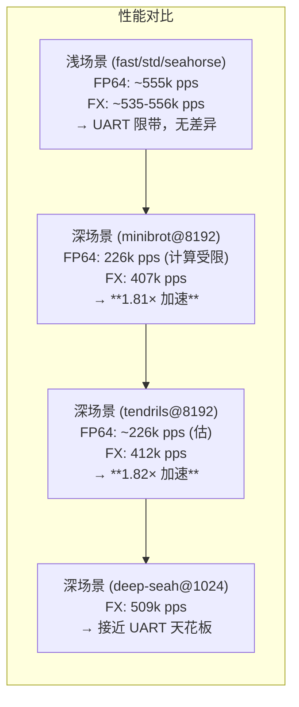

- **深场景显著加速**：minibrot @8192 从 9.2s 降至 5.1s（**1.81×**），因 2× worker 并行 + 短延迟（20 vs 47 拍/迭代）提升计算吞吐。计算从“纯计算受限”向“计算+UART 混合”转移。
- **浅场景无变化**：fast/std/seahorse 仍被 12Mbaud UART ~600k pps 天花板限制，计算优化被串口吞掉。
- **deep-seah@1024 达 509k pps**：接近 UART 天花板，说明该场景的计算负载已被 24w 定点核吸收，瓶颈转向传输。

### 13.8 结论

Phase 3 定点重设计**全面成功**：

| 维度 | 结果 |
|---|---|
| 精度 | 6 场景 100% 匹配 FP64（Q8.55 定点） |
| 资源 | 相同 LUT 预算内 2× worker（12→24），DSP 66%，时序裕量更好 |
| 深场景性能 | minibrot @8192 **1.81× 加速**（9.2s→5.1s） |
| 浅场景性能 | 不变（UART 限带，需传输升级方可见计算增益） |
| 功能 | 160×120 `--verify` 100%，六场景全部 transport pass |

**下一步方向**（按优先级）：
1. **传输升级**（FT245 / PS AXI）：解除 600k pps UART 天花板，让浅场景也能受益于 2× 算力。
2. **更多 worker**：当前 95% LUT，可尝试优化 worker 结构（ring/barrel）降 LUT 以塞入 28-32 worker。
3. **周期性检测**：对 minibrot 类大内点场景进一步加速（当前仍受内点迭代限制）。
