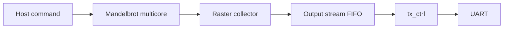
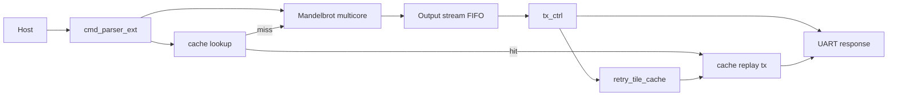

# Retry Tile Cache Design Proposal

## Purpose

This document discusses the requested retry behavior:

1. After a compute tile has been produced for transmission, keep enough result data on the FPGA so a later retry can be served without recomputing.
2. Do not idle the Mandelbrot workers while the host is receiving and checking the previous tile.
3. When the host detects a checksum failure, request the failed retry tile as a compute-sized request; the FPGA should first check whether the requested pixels are still cached.
4. If the cache hits, retransmit the cached retry tile. If the cache misses, compute it normally.

The current design cannot implement this by simply "not clearing the send FIFO". The feasible one-step architecture is to add a small retry-tile cache next to the transmit path and extend the host/FPGA protocol with a cache-retry request.

## Current Limitation

The current data path is streaming:



Important properties:

| Item | Current Behavior | Impact |
|---|---|---|
| `cmd_parser` | Starts a command only when `compute_busy == 0`. | The host cannot queue a next compute command while the current command is still active. |
| Output FIFO | `queue` with read/write pointers. | Read data is consumed; it cannot be reread by coordinate. |
| FIFO depth | `CFG_OUTPUT_FIFO_DEPTH=1024` 16-bit pixels. | Too small to hold a `2048x120` or `1920x120` compute tile. |
| `tx_ctrl` | Reads pixels sequentially and emits `RT/TD/TE`. | It cannot seek back to a failed retry tile. |
| Response identity | No request ID or cache key. | FPGA cannot know whether a host retry matches cached data. |

A default `2048x120` compute tile contains:

```text
2048 * 120 * 16 bits = 3,932,160 bits = 480 KiB
```

Keeping even one full compute tile in BRAM would require about:

```text
3,932,160 / 36,864 ~= 107 BRAM36
```

That is not a good fit for the current ZU4EV build, which is already LUT/routing-limited and uses other BRAMs for worker/result FIFOs. The current output FIFO also cannot be converted into a random-read cache without replacing its semantics.

## One-Step Feasible Solution

Add a retry-tile cache that stores one or more already transmitted `TD` retry tiles, not whole compute tiles.

For the current default:

```text
compute tile = 2048 x 120
RESPONSE_TILE_ROW_SPLITS = 8
retry tile = 2048 x 15
retry tile payload = 2048 * 15 * 16 bits = 491,520 bits = 60 KiB
```

One cached retry tile costs roughly:

```text
491,520 / 36,864 ~= 14 BRAM36
```

This is much more realistic than caching a full compute tile. A small cache with 1-2 entries can cover the common case: the host reports a checksum failure soon after receiving the tile, while the failed `TD` payload is still recent.

## Proposed Architecture



The key change is that `tx_ctrl` still streams normal responses, but while it sends each `TD` packet it also writes that packet payload into a small cache entry. Later, a host cache-retry request can select the matching cache entry and retransmit it without touching the compute core.

## Cache Granularity

Cache granularity should match the existing retry tile format:

```text
TD row(u16) col(u16) tile_rows(u16) tile_cols(u16) payload checksum
```

Because the current RTL row-split design emits full-width `TD` tiles:

```text
col = 0
```

the first version can cache only full-width row-split retry tiles. This avoids arbitrary rectangular slicing inside the FPGA and matches the current host failure rectangles exactly.

## Cache Metadata

Each cache entry needs enough metadata to prove that a host retry request matches the payload:

| Field | Width | Purpose |
|---|---:|---|
| `valid` | 1 | Entry contains usable data. |
| `request_id` | 16 or 32 | Distinguishes stale data from old compute requests. |
| `frame_rows` | 16 | Original compute response height. |
| `frame_cols` | 16 | Original compute response width. |
| `tile_row` | 16 | `TD` row offset inside the compute response. |
| `tile_col` | 16 | `TD` column offset, currently zero. |
| `tile_rows` | 16 | Cached tile height. |
| `tile_cols` | 16 | Cached tile width. |
| `checksum` | 8 | Payload checksum to resend. |
| `payload_words` | derived | Number of 16-bit pixels stored. |

`request_id` is the most important addition. Without it, a retry request could accidentally match a stale tile with the same local coordinates from a previous compute tile.

## Protocol Extension

The current command packet starts with magic `0x4D` and contains only a compute rectangle. A cache-retry request should be a new command type so old behavior remains unchanged.

Recommended minimal command set:

| Magic | Meaning |
|---|---|
| `M` (`0x4D`) | Existing compute command. |
| `C` (`0x43`) | Cache retry request for one already emitted `TD` retry tile. |

Compute command should gain a request ID. There are two ways to do that:

| Option | Description | Compatibility |
|---|---|---|
| Add `request_id` to existing `M` packet | Simple RTL metadata, but breaks existing host/RTL packet length agreement. | Requires host and RTL update together. |
| Add new `N` compute packet with request ID | Keeps legacy `M` unchanged. | Slightly more parser logic, safer migration. |

The safer one-step design is:

| Magic | Packet |
|---|---|
| `M` | Legacy compute, no cache support. |
| `N` | New compute with `request_id`. |
| `C` | Cache retry lookup by `request_id` and `TD` geometry. |

Proposed `N` packet:

```text
N precision rows cols max_iter center_re center_im step request_id checksum
```

Proposed `C` packet:

```text
C request_id frame_rows frame_cols tile_row tile_col tile_rows tile_cols checksum
```

All integer fields remain little-endian. The checksum remains XOR over all bytes including the final checksum byte, matching the existing style.

## Cache Retry Response

For a cache hit, the FPGA can return a normal `RT/TD/TE` response for just the requested retry tile dimensions, or a new cache-hit response. Reusing `RT/TD/TE` is simpler for the host.

Recommended cache-hit response:

```text
RT tile_rows tile_cols
TD 0 0 tile_rows tile_cols cached_payload cached_checksum
TE tile_rows tile_cols
```

The host requested an absolute failed rectangle in the full image, but the FPGA response remains local to the requested retry tile. The host already has `copy_rect()` and can paste the returned pixels into the original full-frame buffer.

For a cache miss, the FPGA should return a short miss packet, not silently compute. Recommended:

```text
CM request_id tile_row tile_col tile_rows tile_cols checksum
```

Then the host sends a normal `N` compute request for the failed rectangle. This keeps the cache path separate from compute scheduling.

## RTL Module Changes

### `cmd_parser_ext`

Add parsing for:

| Command | Action |
|---|---|
| Legacy `M` | Existing behavior. |
| New `N` | Existing compute behavior plus latch `request_id`. |
| New `C` | Produce a `cache_req_valid` event with metadata. |

Outputs:

```verilog
output reg        compute_start;
output reg [31:0] compute_request_id;
output reg        cache_req_valid;
output reg [31:0] cache_req_id;
output reg [15:0] cache_frame_rows, cache_frame_cols;
output reg [15:0] cache_tile_row, cache_tile_col;
output reg [15:0] cache_tile_rows, cache_tile_cols;
```

The parser must allow `C` requests even while `compute_busy` is true, because a cache hit does not need the compute core. If the cache replay TX path is busy, the request can stall in the parser or be rejected with a miss/busy response.

### `retry_tile_cache`

Responsibilities:

| Interface | Role |
|---|---|
| Write side from `tx_ctrl` | Store each outgoing `TD` payload and metadata. |
| Lookup side from parser | Compare metadata and report hit/miss. |
| Read side to replay TX | Stream cached payload for a hit. |

The first implementation can be direct-mapped with one or two entries:

```verilog
parameter CACHE_ENTRIES = 1 or 2;
parameter MAX_TILE_PIXELS = 2048 * 15;
reg [15:0] payload_mem [0:CACHE_ENTRIES-1][0:MAX_TILE_PIXELS-1];
```

For synthesis portability and BRAM inference, this will likely be implemented as separate single-port/dual-port BRAM arrays per entry or a flattened memory with explicit address calculation.

### `tx_ctrl`

Normal response mode changes:

1. On `start`, latch `request_id` along with rows/cols.
2. For each `TD`, begin a cache entry write if the tile dimensions fit the cache limit.
3. While each pixel is read from the output FIFO and sent to UART, also write it into cache memory at `pixel_idx`.
4. On tile checksum, finalize cache metadata and mark entry valid.

Replay mode changes:

1. On cache hit, emit `RT/TD/TE` from cache memory.
2. Use cached metadata for header fields.
3. Use cached checksum, or recompute checksum during replay for safety.

### `top.v`

Add arbitration between normal TX and cache replay TX. Only one path can drive `uart_tx` at a time.

Recommended priority:

| Priority | Source |
|---:|---|
| 1 | Cache replay response, because host is waiting on a retry. |
| 2 | Normal compute response. |

Normal compute should not be interrupted mid-frame. The first implementation should only accept cache replay when `tx_ctrl` is idle, or should queue the replay until the current frame finishes.

## Host Changes

The host retry path changes from:

```text
checksum failed -> defer failed rect -> later compute failed rect
```

to:

```text
checksum failed -> send cache retry request
cache hit -> copy returned pixels
cache miss -> compute failed rect normally
```

Host data structures:

| Field | Purpose |
|---|---|
| `request_id` | Increment per compute tile command. |
| `compute_rect_by_request_id` | Map request ID to full-image coordinates. |
| failed local `TD` rects | Already produced by `LocalTileChecksumError`. |

For each compute tile:

1. Host sends `N` compute command with `request_id`.
2. Host receives normal `RT/TD/TE`.
3. If all checks pass, copy pixels and continue.
4. If checksum-only failures occur, send `C` cache retry request for each failed local `TD`.
5. If hit, paste returned pixels into the full image.
6. If miss, request that failed rectangle as a normal compute tile.
7. Framing errors still require drain/reset/retry, because stream alignment is not trustworthy.

## Compute/Transmit Overlap

The user's step 0 asks for the FPGA to start the next compute tile while the previous tile is being transmitted. This is a larger scheduling change than cache replay.

Current blockers:

| Blocker | Detail |
|---|---|
| `cmd_parser` waits for `compute_busy == 0` | It cannot queue next compute parameters. |
| `mandelbrot_multicore` has one active request state | It does not have a command queue or multiple in-flight request IDs. |
| Output stream FIFO is small | If compute runs ahead of TX, FIFO can fill and backpressure workers. |
| Result stream has no request ID | Interleaving results from multiple compute tiles would corrupt raster response order. |

Therefore compute/TX overlap should not be combined with the first retry cache implementation unless the design also adds a request queue and per-request output buffering.

Recommended one-step boundary:

| Scope | Include Now? | Reason |
|---|---|---|
| Retry tile cache hit/miss | Yes | Directly solves checksum retry without recompute for recent packets. |
| New request IDs | Yes | Required for safe cache lookup. |
| Cache replay response | Yes | Required to serve hits. |
| Compute next tile while previous TX is active | No, defer | Requires multi-request buffering and larger architectural changes. |

## Feasibility

### Resource Feasibility

For `2048x120`, `M=8`, one retry tile is `2048x15` pixels:

```text
2048 * 15 * 16 bits = 491,520 bits ~= 14 BRAM36
```

Possible cache sizes:

| Entries | Approx BRAM36 | Comment |
|---:|---:|---|
| 1 | 14 | Minimum viable; catches immediate retry of the most recent `TD`. |
| 2 | 28 | Better if checksum failure is not the last transmitted tile. |
| 4 | 56 | Stronger hit rate, but starts to consume significant BRAM/routing. |
| 8 | 112 | Equivalent to one full `2048x120` compute tile; likely too expensive. |

The current ZU4EV build uses about `25.5 / 128` BRAM tiles, so 1-2 entries are plausible from BRAM capacity. LUT/routing impact still needs synthesis, especially because the accepted design is already near `97%` CLB LUT utilization.

### Timing Feasibility

The cache path can be timing-friendly if kept local to `tx_ctrl`:

| Design Choice | Timing Benefit |
|---|---|
| Cache only full-width row-split `TD` packets | Simple address generation. |
| Do not support arbitrary rectangle slicing in hardware | Avoids multiply/divide-heavy address paths. |
| Use sequential replay from address 0 | Similar to existing FIFO TX logic. |
| Direct-mapped or round-robin replacement | Avoids associative lookup complexity. |

### Protocol Feasibility

Adding `N` and `C` command types is feasible because the host and FPGA are updated together on the active branch. Legacy `M` can remain for compatibility and simple tests.

## Failure Modes

| Failure | Handling |
|---|---|
| Cache hit but checksum mismatch again | Host may retry cache once, then fall back to compute. |
| Cache miss | Host computes the failed retry rectangle normally. |
| Cache request during active normal TX | FPGA returns busy/miss, or parser stalls until TX idle. First implementation should return busy/miss. |
| Framing error | Host still drains/resets/retries the compute tile. Cache lookup is unsafe because stream alignment is unknown. |
| Stale cache entry | Request ID prevents accidental hit. |

## Implementation Plan

### Phase 1: Protocol And Host Skeleton

1. Add host `request_id` counter.
2. Add `N` compute command encoder.
3. Add `C` cache retry command encoder.
4. Add parser support for cache hit response and cache miss response.
5. Keep default path using legacy `M` until RTL is ready.

### Phase 2: RTL Cache Entry

1. Add `retry_tile_cache.v` with one entry.
2. Capture outgoing `TD` metadata and payload from `tx_ctrl`.
3. Expose exact-match lookup by request ID and tile geometry.
4. Add simulation for write, lookup hit, lookup miss, and stale request ID rejection.

### Phase 3: Cache Replay TX

1. Add replay state machine that emits `RT/TD/TE` from cached payload.
2. Add top-level UART TX arbitration between normal `tx_ctrl` and replay TX.
3. Return `CM` miss packet when lookup fails.
4. Simulate cache-hit retry and host parse.

### Phase 4: Host Integration

1. On checksum-only failure, send `C` before recomputing.
2. On hit, paste returned pixels into full image.
3. On miss, compute failed rect normally.
4. Keep framing errors on the existing drain/reset/retry path.

### Phase 5: Board Validation

1. Small image regression with `--verify`.
2. Forced checksum-failure simulation or host-injected checksum failure to prove cache hit.
3. 1080p standard 10-run comparison.
4. 4096-wide render check with default `2048` compute width.

## Recommendation

Implement retry-tile cache, not full compute-tile FIFO retention.

The one-step implementation should include:

| Feature | Decision |
|---|---|
| Cache granularity | Existing row-split `TD` retry tile. |
| Cache entries | Start with 1 entry; test 2 entries if BRAM/timing allow. |
| Command protocol | Add `N` compute with request ID and `C` cache retry. |
| Cache hit response | Reuse `RT/TD/TE` with local tile dimensions. |
| Cache miss response | Add short `CM` miss packet. |
| Compute/TX overlap | Defer to a later architecture stage. |

This gives a concrete path to avoid recomputation for recent checksum retry tiles without replacing the whole streaming architecture. It also keeps the current stable framing/retry behavior for all non-checksum failures.
