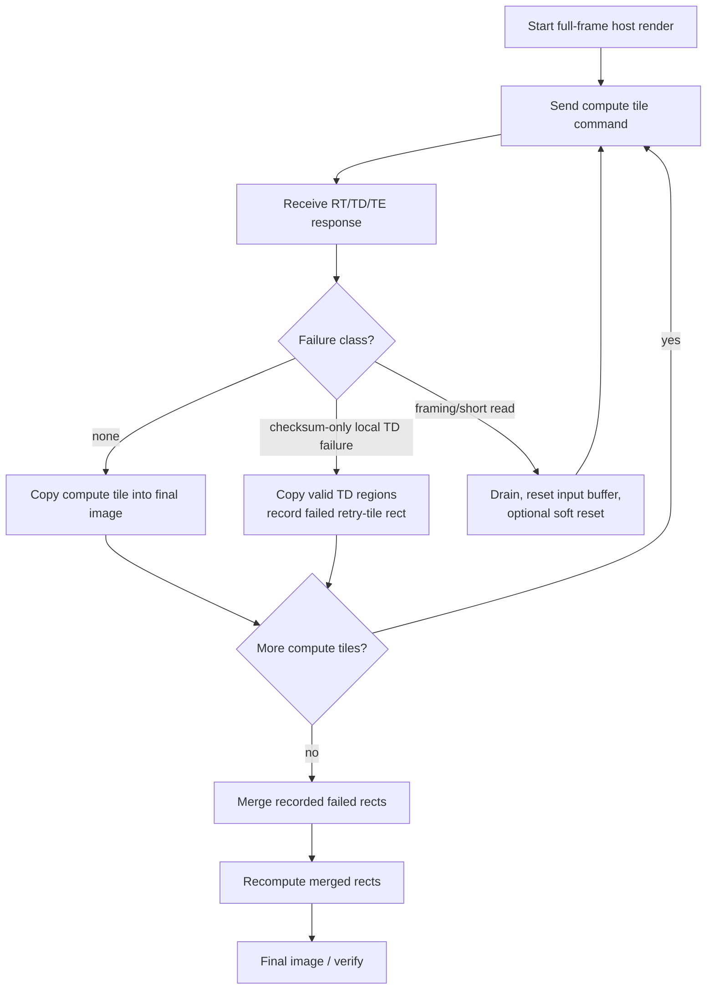

# Row-Split Retry Tile Design Report

## Purpose

The 12 Mbaud UART path raises the theoretical 16-bit pixel payload ceiling to about `600000 pixels/s`:

```text
12000000 bits/s / 10 UART bits per byte / 2 bytes per pixel = 600000 pixels/s
```

At this rate a 1080p frame can complete in a few seconds, but the serial stream is still long enough that an occasional byte slip, short read, or payload checksum mismatch must be recovered without restarting the whole frame. The current design keeps the compute tile size large for throughput, but splits each FPGA response into smaller retry/checksum tiles on the response path.

The current validated default is:

| Item | Value |
|---|---:|
| FPGA | VMC_RTSB ZU4EV `xczu4ev-sfvc784-1-i` |
| Compute configuration | `12 workers / 8 contexts`, direct `200 MHz` |
| UART | `12 Mbaud`, `COM6` |
| Host/compute tile | `1920x120` for 1080p |
| Retry tile split | full width, height split by `RESPONSE_TILE_ROW_SPLITS=8` |
| Retry tile shape for `1920x120` | `1920x15` |
| Per-read tile timeout | `5.0s` default |

## Design Goals

| Goal | Design Choice |
|---|---|
| Preserve the existing Mandelbrot command format | The host still sends normal rectangle commands. |
| Keep compute tiles large | Default 1080p compute tile remains `1920x120`, only 9 hardware requests per frame. |
| Localize checksum failures | Each response is split into full-width row-slices with independent checksums. |
| Avoid FPGA-side retransmission complexity | The FPGA still streams once; the host recomputes failed rectangles. |
| Avoid immediate retry stalls for checksum-only errors | Checksum-failed retry tiles are recorded, and recomputed after the first full-frame pass. |
| Recover framing failures safely | Bad magic, short payload, or missing checksum still triggers immediate drain/reset/retry because stream alignment is lost. |
| Reduce timeout tail | The per-read timeout is now `5.0s`, not the previous `30.0s`. |

## Response Protocol

The host supports both legacy and tiled response formats.

Legacy response:

```text
RK rows(u16) cols(u16) payload checksum
```

Current tiled response:

```text
RT rows(u16) cols(u16)
TD row(u16) col(u16) tile_rows(u16) tile_cols(u16) payload checksum
TD ...
TE rows(u16) cols(u16)
```

All multi-byte fields are little-endian. `TD` row/column coordinates are local to the current hardware response, not the full logical image.

The `TD` checksum is payload-only. Header corruption is detected by semantic checks:

| Check | Purpose |
|---|---|
| `RT` dimensions equal the requested response | Reject stale or corrupt frame headers. |
| `TD` magic is `TD` | Detect stream alignment loss. |
| `TD` rectangle is inside the response frame | Prevent out-of-bounds host writes. |
| Payload length equals `tile_rows * tile_cols * 2` | Detect short reads and shifted payloads. |
| Payload XOR checksum matches | Detect byte corruption inside the tile payload. |
| `TE` dimensions match `RT` after all pixels are accounted for | Detect premature or stale frame end. |

## New Row-Split Strategy

The previous experimental packetizer split responses by a fixed column width. That created many small packets and made the retry granularity depend on horizontal width. The current design instead splits each compute response along the height axis:

```text
base_rows = rows / RESPONSE_TILE_ROW_SPLITS, minimum 1
retry tile 0: row=0,              col=0, tile_rows=base_rows, tile_cols=cols
retry tile 1: row=base_rows,      col=0, tile_rows=base_rows, tile_cols=cols
...
final tile: remaining rows as one tile
```

For the default `1920x120` compute tile and `M=8`:

```text
base_rows = 120 / 8 = 15
TD packets per compute tile = 8
TD payload per retry tile = 1920 * 15 * 2 = 57600 bytes
```

This keeps the host-visible compute tile unchanged while giving the checksum/retry layer eight independent local failure regions inside each compute response.

## RTL Changes

| File | Change |
|---|---|
| `rtl/config.vh` | Added `CFG_RESPONSE_TILE_ROW_SPLITS`, default `8`. |
| `rtl/top.v` | Added `RESPONSE_TILE_ROW_SPLITS` top generic and passed it to `tx_ctrl`. |
| `rtl/tx_ctrl.v` | Replaced fixed-width column packetization with full-width row-split `TD` packets. |
| `build_fp64_response_tile_rows.tcl` | Added row-split sweep build script. |

`tx_ctrl` now emits each `TD` header as:

```text
row = current row offset inside the response
col = 0
```

It sends `tile_rows * cols` pixels per `TD` packet and computes one XOR checksum per row-split retry tile. The output FIFO still supplies pixels in normal raster order, so the compute core and raster collector are unchanged.

## Host Changes

| File | Change |
|---|---|
| `python/mandelbrot_host.py` | Added `LocalTileChecksumError`, row-split local failure capture, merge-and-retry rectangle handling, and deferred checksum-only retry. |
| `python/host_tile_stability_benchmark.py` | Counts both immediate compute-tile retries and deferred checksum retry tiles. |
| `python/response_tile_rows_benchmark.py` | Added row-split sweep benchmarking. |

The current host distinguishes two failure classes:

| Failure class | Examples | Recovery behavior |
|---|---|---|
| Checksum-only local failure with complete `RT/TD/TE` frame | `TD` payload checksum mismatch | Keep valid local tiles, record failed retry-tile rectangles, continue the remaining compute tiles, then recompute the merged failed rectangles after the first pass. |
| Framing or short-read failure | bad magic, incomplete header, incomplete payload, missing checksum, premature `TE` | Drain stale UART bytes, reset input buffer, optionally send `RST!RST!`, and retry the current compute tile immediately. |

This distinction is necessary because checksum-only failures leave the UART stream aligned: the host consumed the full frame through `TE`. Framing and short-read failures do not. Continuing after a framing failure would cause the next command to start while stale bytes from the old response are still arriving.

## Deferred Checksum Retry Flow



The merge step combines adjacent failed rectangles both horizontally and vertically when dimensions line up. This reduces repeated command overhead when consecutive retry tiles fail.

## 30-Second Retry Tail Investigation

The long retry tail observed during earlier `M=8` six-scene testing was not caused by checksum mismatch. The logs showed framing/short-read failures such as:

```text
ERROR: Incomplete tile payload at row=105, col=0: 56230/57600
ERROR: Bad tile magic: d300
```

The `row=105` case is the last `15`-row `TD` packet in a `1920x120` compute tile. The host expected `57600` payload bytes but received fewer. With the old `--tile-read-timeout 30`, `serial.read(payload_bytes)` waited until the full 30 seconds expired before returning the short payload. That is why one retry could stretch a nominal 3.7s run to roughly 34s.

The host default is now:

```text
--tile-read-timeout 5.0
```

Normal `1920x120` responses complete far below this timeout at 12 Mbaud. The shorter timeout bounds short-read penalties while still allowing valid large compute-tile transfers to complete.

## Row-Split Sweep Results

The row-split sweep used `standard @64`, `1920x1080`, `1920x120` host/compute tiles, 10 runs per valid split count.

| Row splits M | Retry tile shape | Build | Standard result | Retry events | Mean FPGA s | Mean pps | Clean-run mean pps | Notes |
|---:|---|---|---:|---:|---:|---:|---:|---|
| `1` | `1920x120` | PASS | 10/10 | 1 | `6.886` | `490486.30` | `538245.40` | One full-tile retry produced a 34.187s tail under the old timeout. |
| `2` | `1920x60` | PASS | invalid | 216 before abort | invalid | invalid | invalid | Tested before host failure classification fix; logs showed systematic incomplete payloads. |
| `4` | `1920x30` | PASS | 0/10 | 40 | Fail | Fail | Fail | Re-run after host fix; standard scene lost framing on large compute tiles. |
| `8` | `1920x15` | PASS | 10/10 | 0 | `3.718` | `557751.55` | `557751.55` | Stable default candidate. |
| `15` | `1920x8` | PASS | 10/10 | 1 | `3.807` | `547351.22` | `559033.23` | Clean-link pps slightly higher, but one retry and thin timing margin. |
| `30` | `1920x4` | PASS | 10/10 | 2 | `3.898` | `536672.13` | `560126.07` | Clean-link pps highest, but retry exposure higher. |

`M=8` is the selected default because it had the best stability/performance balance: 10/10 pass, zero retry events in the standard sweep, and no observed clean-run penalty large enough to justify finer split counts.

Detailed sweep report:

```text
python/host_tile_stability_bench/response_tile_rows_standard_comparison.md
```

## M=8 Six-Scene 10-Run Board Result

After programming the `M=8` bitstream and using the new host retry behavior with `--tile-read-timeout 5.0`, the six-scene 1080p benchmark completed 60/60 runs:

```text
python/host_tile_stability_bench/zu4ev200m_c12ctx8_rtr8_deferred_10run.md
```

| Scene | Transport pass | Retry events | Mean FPGA s | Min s | Max s | CV | Mean pps |
|---|---:|---:|---:|---:|---:|---:|---:|
| fast escape @128 | `10/10` | `1` | `3.821` | `3.720` | `4.702` | `8.11%` | `545436.22` |
| standard @64 | `10/10` | `1` | `3.816` | `3.715` | `4.696` | `8.10%` | `546090.60` |
| Seahorse zoom @512 | `10/10` | `1` | `3.964` | `3.864` | `4.855` | `7.89%` | `525491.58` |
| deep tendrils @8192 | `10/10` | `0` | `3.994` | `3.991` | `3.997` | `0.04%` | `519243.89` |
| deep mini-brot @8192 | `10/10` | `0` | `9.166` | `9.164` | `9.168` | `0.02%` | `226235.12` |
| deep Seahorse @1024 | `10/10` | `1` | `4.575` | `4.472` | `5.485` | `6.99%` | `454952.34` |

The four retry events in this 60-run set were framing failures (`Bad tile magic`), not checksum-only local failures. Therefore the deferred checksum path was not naturally exercised in this run, but the classification is important: checksum-only failures can now be deferred and recomputed after the first pass, while framing failures are still handled immediately to preserve stream synchronization.

Compared with the earlier `12w/8ctx` six-scene 10-run before row-split/deferred retry, the new `M=8` row-split flow improves every mean:

| Scene | Earlier mean s | New M=8 mean s | Speedup |
|---|---:|---:|---:|
| fast escape @128 | `4.563` | `3.821` | `1.194x` |
| standard @64 | `4.353` | `3.816` | `1.141x` |
| Seahorse zoom @512 | `4.499` | `3.964` | `1.135x` |
| deep tendrils @8192 | `4.739` | `3.994` | `1.187x` |
| deep mini-brot @8192 | `10.146` | `9.166` | `1.107x` |
| deep Seahorse @1024 | `4.967` | `4.575` | `1.086x` |

The main improvement comes from reducing response packet overhead and bounding short-read penalties. The compute architecture remains the same `12 workers / 8 contexts` design.

## Current Recommendation

Use the default configuration:

| Setting | Recommendation |
|---|---|
| Host tile | `1920x120` for 1080p. |
| Compute tile | Same as host tile unless intentionally testing smaller compute units. |
| Retry split | `RESPONSE_TILE_ROW_SPLITS=8`. |
| Tile timeout | Default `5.0s`; increase only for intentionally very large or slow tiles. |
| Failure handling | Defer checksum-only retry tiles; immediately drain/reset/retry framing failures. |

## Future Improvements

| Improvement | Benefit |
|---|---|
| Add FPGA-side retry-tile cache | Serve recent checksum retry tiles without recomputing when the failed `TD` packet is still cached. See [RETRY_TILE_CACHE_DESIGN.md](RETRY_TILE_CACHE_DESIGN.md). |
| Add packet sequence IDs | Detect missing or duplicate `TD` packets explicitly. |
| Add request IDs | Reject stale bytes from an older compute tile without relying only on drain/quiet timing. |
| Add FPGA-side retransmission | Retry one row-split packet without recomputing any pixels. |
| Add stronger header CRC | Detect header corruption directly, not only through semantic checks. |
| Move to a higher-bandwidth transport | Remove UART burst limits and host serial-driver variability. |
